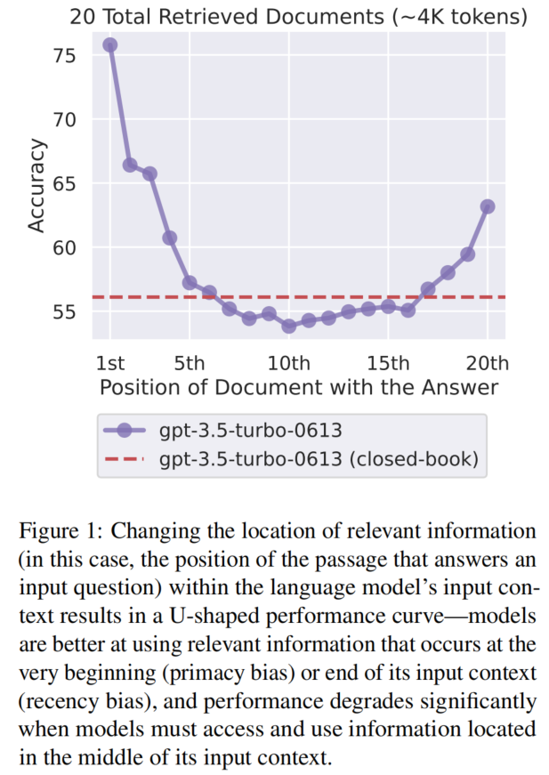

## 论文链接

[liu2024lost,Lost in the middle: How language models use long contexts](https://arxiv.org/abs/2307.03172)

---

## 核心问题
语言模型虽然能**接收**长上下文（4K→100K tokens），但它们是否真能**稳健地利用**长上下文中的信息？

---

## 核心发现：U型性能曲线

改变相关信息在输入上下文中的位置，会导致性能显著变化，呈现 **U型曲线**：
- **首因效应（Primacy bias）**：信息在上下文**开头**时，性能最高
- **近因效应（Recency bias）**：信息在上下文**结尾**时，性能也高
- **中间塌陷**：信息在上下文**中间**时，性能显著下降，甚至**低于闭卷设置**（即不提供任何文档时的性能）

> 关键数据：GPT-3.5-Turbo 在 20 文档设置中，中间位置的性能（~53.8%）低于闭卷性能（56.1%）。

---

## 实验一：多文档问答（Multi-document QA）

**任务设计**：
- 输入：1 个问题 + k 个文档（恰好 1 个包含答案，其余 k-1 个为干扰文档）
- 控制变量：文档总数（10/20/30）× 答案文档的位置（开头/中间/结尾）

**关键结论**：
1. **位置敏感性**：所有模型（GPT-3.5-Turbo、Claude-1.3、MPT-30B-Instruct、LongChat-13B）均受位置影响，中间位置性能最差。
2. **扩展上下文模型 ≠ 更会利用上下文**：
   - GPT-3.5-Turbo（4K）与 GPT-3.5-Turbo-16K 在 10/20 文档设置中性能几乎完全重叠。
   - Claude-1.3（8K）与 Claude-1.3-100K 同样几乎无差异。
   - 说明：能**装下**更长的上下文，不代表能**用好**更长的上下文。
3. **干扰文档类型不影响趋势**：无论是检索得到的硬负例还是随机文档，U型曲线均存在。

---

## 实验二：键值检索（Key-value Retrieval）

**任务设计**：
- 极简合成任务：给定 JSON 格式的 UUID 键值对，检索指定键对应的值。
- 去除自然语言语义干扰，测试最基础的"精确匹配检索"能力。

**关键结论**：
- **Claude 系列**表现完美（Claude-1.3 和 Claude-100K 在所有长度下均接近 100% 准确率）。
- **其他模型**（GPT-3.5-Turbo、MPT-30B-Instruct、LongChat-13B）在 140/300 键值对时，中间位置性能显著下降。
- 说明：即使只是**查找完全匹配的字符串**，部分模型也无法可靠地从长上下文中间检索。

---

## 实验三：开放域问答案例研究（Open-domain QA）

**任务设计**：标准检索器-阅读器架构，改变检索文档数 k（5→50）。

**关键结论**：
- **收益递减**：模型阅读性能在检索器召回率饱和前**早已饱和**。
- 具体数据：使用 50 个文档相比 20 个，GPT-3.5-Turbo 仅提升 ~1.5%，Claude-1.3 仅提升 ~1%。
- **实践启示**：盲目增加上下文长度（塞入更多文档）性价比极低，反而增加延迟和成本。

---

## 影响因素分析

### 1. 模型架构（§4.1）
- **编码器-解码器模型**（Flan-T5-XXL、Flan-UL2）在**训练时序列长度内**相对稳健，位置变化影响小。
- 但一旦**超出训练长度**，同样出现 U 型曲线。
- 假设原因：双向编码器能在未来文档的上下文中处理每个文档，改善相对重要性估计。

### 2. 查询感知上下文化（§4.2）
- **做法**：将查询（问题/键）同时放在文档/键值对的前后（而非仅放在末尾）。
- **效果**：
  - 对**键值检索**：几乎所有模型达到**近完美性能**（从 45.6% 最差 → 100%）。
  - 对**多文档问答**：趋势几乎不变，仅开头位置略有提升。
- 原因：仅解码器模型在上下文化文档时本看不到末尾的查询；前后放置查询让文档能被查询上下文编码。但多文档 QA 需要**推理**而不仅是**检索**，因此改善有限。

### 3. 指令微调（§4.3）
- **不是 U 型曲线的根本原因**：
  - MPT-30B（基础模型）与 MPT-30B-Instruct（指令微调后）均呈现 U 型曲线。
  - 指令微调仅**提升绝对性能**，并**略微缩小**最佳/最差差距（10% → 5%），但不改变趋势。
- **模型规模的影响**（Llama-2 系列）：
  - **7B 模型**：仅有**近因偏差**（只关注末尾）。
  - **13B / 70B 模型**：出现**U型曲线**（首因+近因）。
  - 说明：小模型无法利用长程上下文，大模型才能利用"开头"信息。

---

## 实践启示

1. **长上下文是权衡**：给模型更多信息 ≠ 更好，可能因推理负担增加而降低准确率。
2. **重排序（Reranking）**：将最相关文档推至上下文**开头**，可能比单纯增加文档数更有效。
3. **截断（Truncation）**：在检索增强生成中，适当减少检索文档数（如 20→10）对性能影响很小，但能降低成本和延迟。
4. **评估协议**：声称模型支持长上下文时，必须证明其性能受信息位置影响**最小**（最佳与最差情况差距小）。

---

## 一句话总结
> 当前语言模型能读长文，但会"迷失在中间"——它们对上下文开头和结尾的信息敏感，对中间信息显著失能；扩展上下文窗口本身并不解决这一问题。
