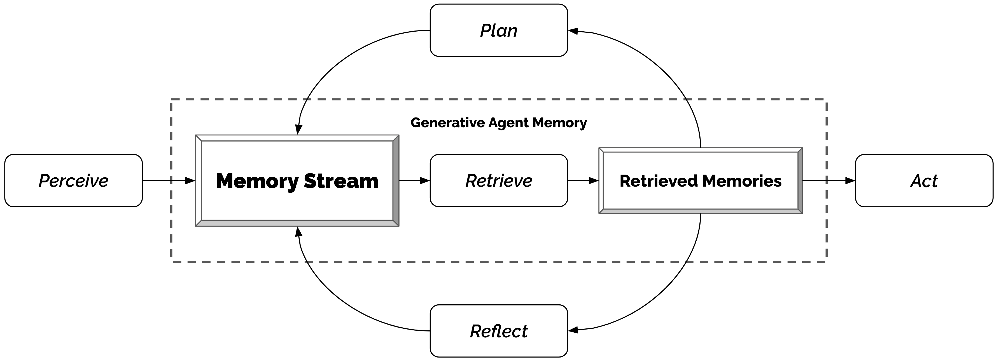
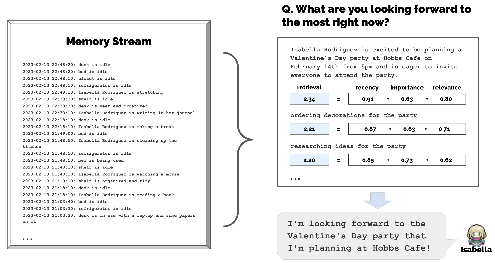
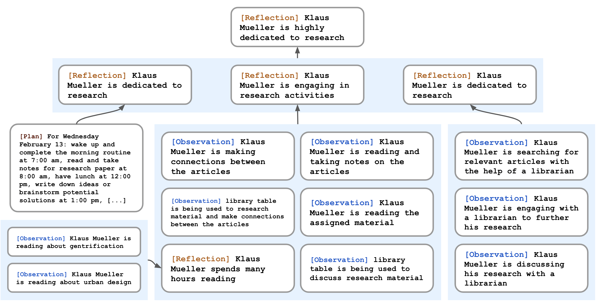
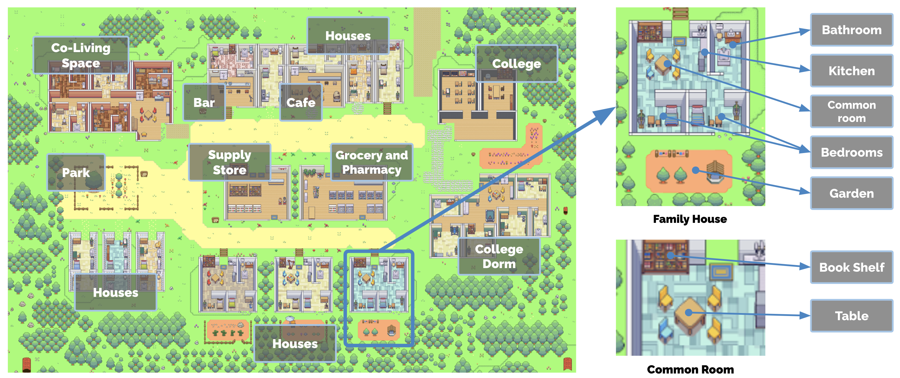
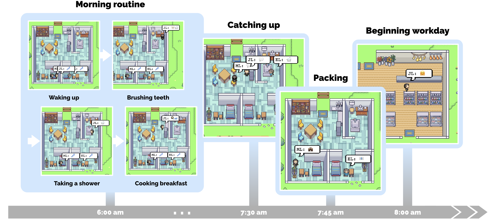
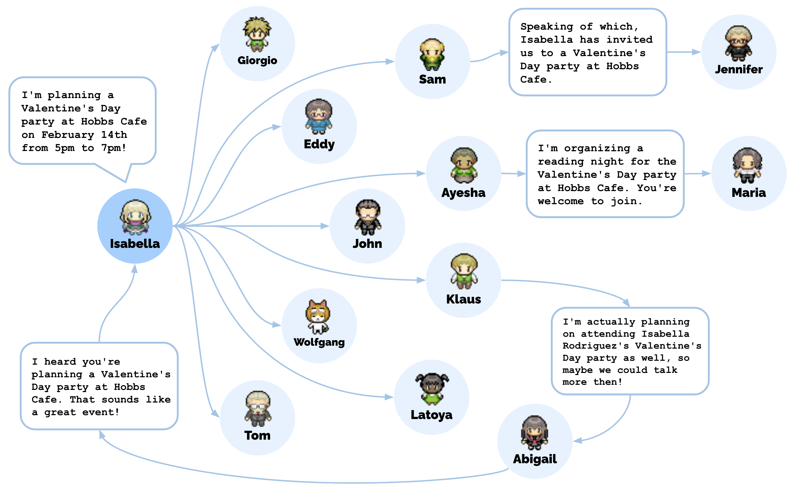
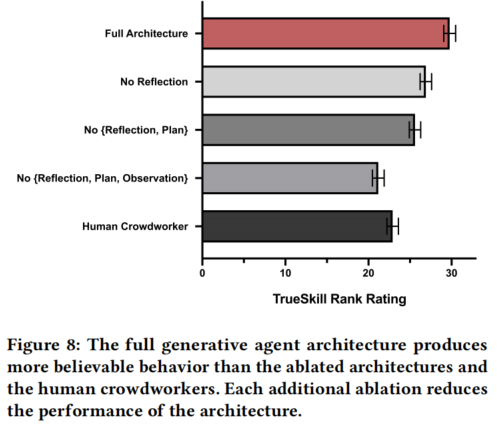

# 《Generative Agents: Interactive Simulacra of Human Behavior》阅读笔记

> **论文作者**：Joon Sung Park, Joseph C. O'Brien, Carrie J. Cai, Meredith Ringel Morris, Percy Liang, Michael S. Bernstein  
> **发表会议**：UIST '23 (The 36th Annual ACM Symposium on User Interface Software and Technology)  
> **发表时间**：2023年10月  
> **研究机构**：Stanford University, Google Research, Google DeepMind  

---

## 一、研究背景与核心问题

### 1.1 研究动机

如何构建一个能够反映**可信人类行为**的交互式人工社会？从沙盒游戏（如《模拟人生》）到认知模型与虚拟环境，四十多年来研究者和实践者一直梦想着构建能够充当人类行为可信代理的计算智能体。这些智能体若能与其过往经验保持一致并对其环境做出可信反应，便可为虚拟空间注入真实的社会现象，训练人们应对罕见但困难的人际情境，验证社会科学理论，支撑普适计算应用与社会机器人，并驱动能在开放世界中驾驭复杂人际关系的游戏非玩家角色（NPC）。

然而，人类行为的空间极为广阔且复杂。尽管大语言模型在单时间点模拟人类行为方面取得了显著进展，但要确保**长期行为一致性**，智能体需要一种能够管理不断增长记忆的架构——新的交互、冲突和事件会随时间出现和消退，同时还需要处理多个智能体之间展开的级联社会动态。仅凭大语言模型本身，智能体可能无法基于过往经验做出反应，无法进行重要推断，也无法维持长期连贯性。

### 1.2 核心研究问题

本文提出的核心问题是：**能否设计一种智能体架构，将大语言模型与记忆合成、检索机制相结合，使计算智能体能够模拟可信的人类行为？** 这一问题可分解为三个子问题：

- **记忆管理问题**：智能体如何存储、检索和利用随时间不断增长的经验记录？
- **抽象推理问题**：智能体如何从原始观察记忆中泛化并做出更高层次的推断？
- **长期规划问题**：智能体如何在长时间跨度内保持行为的一致性和可信性？

> **图1**：生成式代理是交互式应用中可信的人类行为模拟。在本研究中，通过将25个代理 inhabit 一个类似《模拟人生》的沙盒环境来展示生成式代理。用户可以观察和干预代理规划日常、分享新闻、建立关系和协调群体活动。

---

## 二、核心架构：生成式代理

### 2.1 架构总览

生成式代理的架构以大语言模型（具体实现使用 ChatGPT 的 `gpt3.5-turbo` 版本）为推理引擎，围绕一个名为 **记忆流（Memory Stream）** 的长期记忆数据库展开。该架构通过三个核心组件解决上述研究问题：

1. **记忆与检索（Memory & Retrieval）**：存储完整经验记录，并按需检索相关记忆
2. **反思（Reflection）**：将记忆递归合成为更高层次的抽象推断
3. **规划与反应（Planning & Reacting）**：将反思和当前环境转化为可执行的行动计划

> **图5**：生成式代理架构。代理感知环境，所有感知被保存在称为记忆流的全面经验记录中。基于感知，架构检索相关记忆并使用这些检索到的记忆来决定行动。这些检索到的记忆还被用于形成长期计划和创建更高层次的反思，两者都被写入记忆流以供将来使用。

### 2.2 记忆流与检索机制

#### 2.2.1 问题定义

生成式代理面临的第一个核心挑战是：智能体需要推理的经验集合远超提示词（prompt）所能容纳的范围。一方面，将完整的记忆流全部塞入大语言模型的上下文窗口会分散模型注意力，且受限于模型的上下文长度限制；另一方面，若仅做简单摘要，则会丢失关键细节。例如，当 Isabella 被问及"你最近对什么充满热情？"时，将她所有经验简单压缩为一个摘要，会产生一个毫无信息量的回答（如只提到合作办活动和咖啡馆的组织清洁）；而通过**检索相关记忆**的方式，则能产生更具体、更有信息量的回答（如提到她对让人们感到受欢迎和被包容的热情，以及规划活动创造欢乐氛围的热爱）。

#### 2.2.2 记忆流的数据结构

**定义（记忆流）**：记忆流是一个维护智能体经验全面记录的数据库，表示为一个**记忆对象（memory object）** 的列表。每个记忆对象包含以下字段：

- **自然语言描述**（`description`）：以自然语言描述该记忆的内容
- **创建时间戳**（`creation_timestamp`）：记录该记忆被创建的时间
- **最近访问时间戳**（`most_recent_access_timestamp`）：记录该记忆最近一次被检索的时间

记忆流中最基本的元素是**观察（observation）**，即智能体直接感知到的事件。观察可分为三类：
- 智能体自身执行的行为
- 智能体感知到其他智能体执行的行为
- 智能体感知到非智能体对象的状态变化

**示例**：在咖啡馆工作的 Isabella Rodriguez 随时间积累的观察包括：
> (1) Isabella Rodriguez 正在摆放糕点  
> (2) Maria Lopez 一边喝咖啡一边准备化学考试  
> (3) Isabella Rodriguez 和 Maria Lopez 正在讨论在 Hobbs Cafe 举办情人节派对  
> (4) 冰箱是空的

#### 2.2.3 检索函数的形式化定义

**定义（记忆检索函数）**：设 $\mathcal{M}$ 为记忆流中所有记忆对象的集合，$q$ 为当前查询情境。检索函数 $R: \mathcal{M} \times q \rightarrow \mathcal{M}^*$  从记忆流中筛选一个子集，该子集将被传递给大语言模型以条件化其输出。

> $\times$ 是集合中的笛卡尔积。$\mathcal{M} \times q$ 表示所有**有序对** $(m, q)$ 的集合，其中 $m \in \mathcal{M}$（某个记忆对象），$q$ 是当前查询情境。

本文实现的检索函数综合以下三个评分分量：

| 分量 | 符号 | 语义解释 |
|------|------|---------|
| **近因性** | $\text{recency}(m)$ | 记忆 $m$ 被最近访问的程度 |
| **重要性** | $\text{importance}(m)$ | 记忆 $m$ 对智能体的主观重要程度 |
| **相关性** | $\text{relevance}(m, q)$ | 记忆 $m$ 与当前查询 $q$ 的内容相关程度 |

**（1）近因性（Recency）**

**定义**：近因性衡量记忆对象距离当前时间的"远近"，遵循指数衰减规律。

**数学形式**：

$$
\text{recency}(m) = \delta^{\Delta t_m}
$$

其中：
- $\delta = 0.995$ 为衰减因子（decay factor），由作者经验设定
- $\Delta t_m$ 为自记忆 $m$ 上次被检索以来经过的沙盒游戏小时数

**物理含义**：指数衰减确保最近发生或被访问的事件在智能体的"注意力范围"内保持较高的显著度，而久远的事件逐渐被"遗忘"。这一机制模仿了人类认知中的时间近因效应——最近的经验更容易被回忆。

**（2）重要性（Importance）**

**定义**：重要性区分平凡记忆与核心记忆，赋予智能体认为重要的事件更高的分数。

**实现方式**：本文通过直接提示大语言模型输出一个整数分数来实现：

> *"On the scale of 1 to 10, where 1 is purely mundane (e.g., brushing teeth, making bed) and 10 is extremely poignant (e.g., a break up, college acceptance), rate the likely poignancy of the following piece of memory."*

**示例**：
- "cleaning up the room" $\rightarrow$ 评分 2（低重要性）
- "asking your crush out on a date" $\rightarrow$ 评分 8（高重要性）

**物理含义**：重要性分数在记忆对象创建时即被生成并固定存储。该分量确保核心事件（如分手、接受大学录取）在检索时优先于日常琐事（如刷牙、整理床铺），类似于人类记忆中情绪显著事件更容易被回忆的现象。

**（3）相关性（Relevance）**

**定义**：相关性衡量记忆对象与当前查询情境的内容匹配程度。

**实现方式**：本文利用大语言模型生成文本嵌入向量，计算余弦相似度：

$$
\text{relevance}(m, q) = \cos\bigl(\mathbf{e}(m), \mathbf{e}(q)\bigr) = \frac{\mathbf{e}(m) \cdot \mathbf{e}(q)}{\|\mathbf{e}(m)\| \|\mathbf{e}(q)\|}
$$

其中：
- $\mathbf{e}(\cdot)$ 表示通过大语言模型将文本描述映射为嵌入向量的编码函数
- $\mathbf{e}(m)$ 为记忆 $m$ 的自然语言描述的嵌入向量
- $\mathbf{e}(q)$ 为当前查询记忆的嵌入向量

**基础数学知识：余弦相似度**
> 给定两个非零向量 $\mathbf{a}, \mathbf{b} \in \mathbb{R}^n$，其余弦相似度定义为两者夹角的余弦值：$\cos\theta = \frac{\mathbf{a} \cdot \mathbf{b}}{\|\mathbf{a}\| \|\mathbf{b}\|} = \frac{\sum_{i=1}^n a_i b_i}{\sqrt{\sum a_i^2} \sqrt{\sum b_i^2}}$。该值域为 $[-1, 1]$，值越接近 1 表示方向越相似，即内容越相关。在信息检索中，余弦相似度是衡量文档语义相关性的标准度量。

**物理含义**：当智能体讨论化学考试复习时，关于早餐的记忆应获得低相关性分数，而关于老师和学业的记忆应获得高相关性分数。嵌入向量将自然语言映射到语义空间，使得语义相近的描述在向量空间中距离较近。

#### 2.2.4 最终检索分数公式

**定义（综合检索分数）**：在将三个分量分别通过 min-max 归一化到 $[0, 1]$ 范围后，最终的检索分数为三者的加权和：

$$
\boxed{\text{score}(m) = \alpha_{\text{recency}} \cdot \text{recency}(m) + \alpha_{\text{importance}} \cdot \text{importance}(m) + \alpha_{\text{relevance}} \cdot \text{relevance}(m, q)}
$$

**参数设定**：在本文实现中，所有权重系数设为相等：$\alpha_{\text{recency}} = \alpha_{\text{importance}} = \alpha_{\text{relevance}} = 1$。

**归一化说明**：min-max 归一化将一组数值线性映射到 $[0, 1]$ 区间。对于分量 $x$，其归一化值为 $\tilde{x} = \frac{x - x_{\min}}{x_{\max} - x_{\min}}$，其中 $x_{\min}$ 和 $x_{\max}$ 分别为该分量在所有候选记忆中的最小值和最大值。这一步确保三个不同量纲的分量具有可比性。

**检索流程**：系统对所有记忆计算上述分数，按分数降序排列，选取排名最高且能容纳在大语言模型上下文窗口内的记忆子集，作为提示词的一部分传递给模型。

> **图6**：记忆流包含大量与智能体当前情境相关和不相关的观察。检索识别出这些观察的一个子集，应传递给大语言模型以条件化其对情境的响应。

---

### 2.3 反思机制

#### 2.3.1 问题定义

仅配备原始观察记忆的智能体难以进行泛化或做出推断。考虑以下场景：用户问 Klaus Mueller"如果你必须从认识的人中选一个共度一小时，你会选谁？"在仅有观察记忆的情况下，智能体简单选择互动最频繁的人——Wolfgang，他的大学宿舍邻居。然而 Klaus 和 Wolfgang 只是点头之交，并无深入互动。更理想的回答需要智能体从 Klaus 花数小时做研究项目的记忆中泛化出 Klaus 热爱研究，同时认识到 Maria 也在投入研究，从而产生他们共享共同兴趣的推断，最终选择 Maria 而非 Wolfgang。

#### 2.3.2 反思的形式化定义

**定义（反思）**：反思是一种更高层次、更抽象的**记忆类型**，由智能体自身生成。反思作为记忆对象存入记忆流，在检索时与其他观察一同被考虑。反思的生成是周期性的，本文设定触发条件为：

$$
\sum_{m \in \mathcal{M}_{\text{recent}}} \text{importance}(m) \geq \theta_{\text{reflect}}
$$

其中 $\theta_{\text{reflect}} = 150$ 为预设阈值，$\mathcal{M}_{\text{recent}}$ 为智能体最新感知到的事件集合。在实际运行中，每个智能体每天大约反思 2-3 次。

#### 2.3.3 反思生成的实现流程

反思生成是一个两阶段过程：

**阶段一：问题生成（What to reflect on?）**

系统向大语言模型提供智能体记忆流中最近的 100 条记录，并提问：

> *"Given only the information above, what are 3 most salient high-level questions we can answer about the subjects in the statements?"*

模型生成候选问题，例如："What topic is Klaus Mueller passionate about?" 和 "What is the relationship between Klaus Mueller and Maria Lopez?"

**阶段二：洞察提取（Insight Extraction）**

将生成的问题作为查询进行记忆检索，收集相关记忆（包括其他反思），然后提示模型提取洞察并引用支撑证据：

> *"What 5 high-level insights can you infer from the above statements? (example format: insight (because of 1, 5, 3))"*

**示例输出**：
> Klaus Mueller is dedicated to his research on gentrification (because of 1, 2, 8, 15).

该语句被解析为反思存入记忆流，同时保留指向被引用记忆对象的指针。

#### 2.3.4 反思树的递归结构

反思的独特之处在于**智能体可以反思其他反思**。这导致反思形成树状结构：

- **叶节点**：直接来自环境的基础观察
- **非叶节点**：对其他观察或反思的合成，层次越高越抽象

> **图7**：Klaus Mueller 的反思树。智能体对世界的观察（叶节点）被递归地综合，推导出 Klaus 对自己"高度投入研究"的自我认知。

**第一性原理**：反思机制的本质是**层次化表征学习**。通过递归地将低层次经验聚类为高层次概念，智能体构建了关于自身和世界的抽象知识表示。这与人类认知中的"图式（schema）"理论一致——我们通过不断将具体经验归纳为抽象模式来理解世界。

---

### 2.4 规划与反应机制

#### 2.4.1 问题定义

大语言模型虽然能生成符合情境的合理行为，但智能体需要在长时间跨度上进行规划，以确保行为序列的一致性和可信性。若仅基于当前情境提示模型选择行动，可能出现短期优化破坏长期一致性的问题——例如 Klaus 在 12:00 吃午饭，然后在 12:30 和 13:00 又分别再吃一次午饭，尽管他已经吃过。规划机制确保智能体的行为在较长时间尺度上保持连贯。

#### 2.4.2 规划的形式化定义

**定义（计划）**：计划是描述智能体未来行动序列的数据结构，包含三个字段：

- **地点**（`location`）：执行行动的物理位置
- **起始时间**（`start_time`）：计划开始的时刻
- **持续时间**（`duration`）：计划持续的时长（分钟）

**示例计划条目**：
> for 180 minutes from 9am, February 12th, 2023, at Oak Hill College Dorm: Klaus Mueller's room: desk, read and take notes for research paper.

#### 2.4.3 递归分解实现

计划的生成采用**自顶向下递归分解**策略：

**第一层（日程大纲）**：首先生成覆盖全天的粗略计划，分为 5-8 个时间段：

> 1) wake up and complete the morning routine at 8:00 am  
> 2) go to Oak Hill College to take classes starting 10:00 am  
> ...  
> 5) work on his new music composition from 1:00 pm to 5:00 pm  
> 6) have dinner at 5:30 pm  
> 7) finish school assignments and go to bed by 11:00 pm

**第二层（小时级分解）**：将每个粗略块分解为小时级行动。例如 Eddy 的 13:00-17:00 作曲计划分解为：

> 1:00 pm: start by brainstorming some ideas for his music composition  
> ...  
> 4:00 pm: take a quick break and recharge his creative energy before reviewing and polishing his composition

**第三层（分钟级分解）**：进一步递归分解为 5-15 分钟级块：

> 4:00 pm: grab a light snack, such as a piece of fruit, a granola bar, or some nuts  
> 4:05 pm: take a short walk around his workspace  
> ...  
> 4:50 pm: take a few minutes to clean up his workspace

**工程优化**：该递归过程可调整以匹配所需的粒度。由于计划可能随时变更，系统仅提前生成高层计划，然后在需要时将近期未来递归分解为即时行动块。

#### 2.4.4 反应与对话

智能体在每个时间步的**行动循环**如下：

1. **感知**：智能体感知周围世界
2. **存储**：感知到的观察被存入记忆流
3. **决策**：大语言模型根据当前观察决定是否继续原计划或做出反应
4. **执行**：若反应涉及与其他智能体交互，则生成对话

**对话生成机制**：对话基于双方关于彼此的记忆进行条件生成。当 John 与 Eddy 对话时：
- John 检索关于 Eddy 的记忆（儿子、正在作曲、喜欢在花园散步思考音乐）
- John 生成第一句话："Hey Eddy, how's the music composition project for your class coming along?"
- Eddy 接收该话语作为新观察，检索关于 John 的记忆，决定是否回应
- 若回应，Eddy 基于自身记忆和对话历史生成回复

---

## 三、实验环境：Smallville

### 3.1 环境设计

Smallville 是一个基于 Phaser Web 游戏框架构建的精灵沙盒世界，模拟一个小镇环境。环境设计采用**树形数据结构**表示空间层次：

- 根节点：整个世界
- 子节点：区域（房屋、咖啡馆、商店）
- 叶节点：具体对象（桌子、书架、炉灶）

> **图2**：Smallville 沙盒世界，各区域标注。根节点描述整个世界，子节点描述区域（如房屋、咖啡馆、商店），叶节点描述对象（如桌子、书架）。智能体记住反映其所见世界部分的子图，维持这些部分的状态如同它们观察到的样子。

### 3.2 自然语言与结构化环境的映射

**环境到自然语言的转换**：树中的每条包含关系边被渲染为自然语言描述。例如，"stove" 是 "kitchen" 的子节点 $\rightarrow$ "there is a stove in the kitchen"。

**智能体的局部世界模型**：每个智能体维护一个环境的**子图表示**（即其已探索区域的子集），且智能体并非全知——离开某区域后其子图可能过时，重新进入时更新。

**位置决策**：当智能体需要执行某个行动时，系统递归遍历其环境树，将树的部分扁平化为自然语言提示模型选择最合适的区域，直到到达叶节点。

### 3.3 代理一天的生活示例

> **图3**：生成式代理 John Lin 的一个早晨。John 在早上 6 点左右醒来并完成晨间例程，包括刷牙、淋浴和吃早餐。他在出门前与妻子 Mei 和儿子 Eddy 短暂交流。

**John Lin 的完整早晨轨迹**：
- 7:00 am：John 第一个醒来，刷牙、淋浴、穿衣、吃早餐、在客厅餐桌看新闻
- 8:00 am：Eddy 起床准备上课，出门前与 John 交谈：
  > John: "Good morning Eddy. Did you sleep well?"  
  > Eddy: "Good morning dad. Yeah, I slept great."  
  > John: "That's good. What are you working on today?"  
  > Eddy: "I'm working on a new music composition for my class. It's due this week, so I'm trying to get it finished. But I'm having so much fun with it!"  
  > John: "That sounds great!"
- Mei 醒来后询问儿子情况，John 回忆刚刚的对话并转述
- 9:00 am：Mei 去教学/写研究论文，John 去药店上班

---

## 四、涌现社会行为

### 4.1 信息扩散

智能体通过对话传播信息。例如 Sam 在杂货店告诉 Tom 他正在竞选村长：

> Sam: "Hey Tom, how's it going?"  
> Tom: "Good, thanks. What's up?"  
> Sam: "Well, I wanted to talk to you about something. I'm actually running for mayor in the upcoming local election."  
> Tom: "Really? That's great news! Why are you running?"  
> Sam: "I've been involved in local politics for years now, and I really feel like I can make a difference in our community. Plus, I want to bring new ideas and perspectives to the table."

随后 Tom 又与其他智能体讨论 Sam 的竞选，信息逐步扩散。

### 4.2 关系记忆

智能体随时间形成新关系并记住互动。例如初始时 Sam 不认识 Latoya Williams，在公园偶遇后自我介绍并了解她在做摄影项目。后续互动中 Sam 能记住这段经历并询问项目进展。

### 4.3 协调——情人节派对案例

这是最具代表性的涌现行为案例。初始设置仅两个条件：
- Isabella Rodriguez 被初始化有举办情人节派对的意图
- Maria Lopez 的角色描述中提到她对 Klaus 有好感

**自发涌现的行为链**：
1. Isabella 在咖啡馆看到朋友和顾客时主动邀请
2. 2月13日下午，Isabella 花时间在咖啡馆装饰
3. Maria 来到咖啡馆，Isabella 请求帮忙装饰，Maria 同意
4. Maria 当晚邀请她暗恋的 Klaus 参加派对，Klaus 欣然接受
5. 2月14日下午5点，包括 Klaus 和 Maria 在内的5个代理出席派对

> **图9**：Isabella Rodriguez 的情人节派对邀请的扩散路径涉及总共12个代理（除 Isabella 外），他们在模拟结束时在 Hobbs Cafe 听说了派对。

**核心发现**：用户仅需设置 Isabella 的初始意图和 Maria 的好感，传播消息、装饰、邀请、赴约和派对上的互动等所有社会行为均由代理架构自发产生。

---

## 五、评估

### 5.1 控制评估

#### 5.1.1 评估方法

利用生成式代理能用自然语言回答问题的特性，研究者设计了"面试"方法来探测代理的能力。面试包含五个维度的问题类别：

| 类别 | 示例问题 | 评估能力 |
|------|---------|---------|
| 自我认知 | "Give an introduction of yourself" | 维持核心特征理解 |
| 记忆 | "Who is [name]?" / "Who is running for mayor?" | 检索特定事件/对话 |
| 计划 | "What will you be doing at 10 am tomorrow?" | 检索长期计划 |
| 反应 | "Your breakfast is burning! What would you do?" | 对意外事件的响应 |
| 反思 | "If you were to spend time with one person you met recently, who would it be and why?" | 利用深层理解做推断 |

**实验设计**：采用被试内设计（within-subjects），100 名参与者比较四种架构变体和一个众包人工撰写条件。

#### 5.1.2 实验条件

| 条件 | 描述 | 对应架构 |
|------|------|---------|
| **完整架构** | 具备观察、反思、规划全部功能 | 本文提出的完整架构 |
| 无反思 | 可访问观察，但无反思和规划 | 消融实验 |
| 无反思+无规划 | 仅可访问观察 | 消融实验 |
| 无记忆/反思/规划 | 无法访问记忆流中任何内容 | 大语言模型基线（代表先前工作） |
| 人工撰写 | 众包工作者根据记忆流人工撰写回答 | 人类基线 |

#### 5.1.3 统计分析方法

**TrueSkill 评分系统**：为将排名数据转化为可比较的区间数据，本文采用 TrueSkill 算法。TrueSkill 是 Elo 国际象棋评分系统的推广，用于多玩家环境，曾被 Xbox Live 用于玩家排名。

**定义（TrueSkill 模型）**：给定一组排名结果，TrueSkill 为每个条件输出一个均值评分 $\mu$ 和标准差 $\sigma$。条件 $i$ 的技能值被建模为正态分布 $\mathcal{N}(\mu_i, \sigma_i^2)$。

**Cohen's d 效应量**：为量化条件间的差异大小，本文计算标准化效应量：

$$
d = \frac{\mu_{\text{full}} - \mu_{\text{baseline}}}{\sigma_{\text{pooled}}}
$$

完整架构与纯 LLM 基线之间的 Cohen's d = 8.16，即差异达 8 个标准差，属于极大的效应量。

**Kruskal-Wallis 检验**：非参数单因素方差分析替代方法，用于检验排名数据的总体差异显著性：$H(4) = 150.29, p < 0.001$。

**Dunn 事后检验** + Holm-Bonferroni 校正：用于识别条件间的成对差异。结果显示所有成对差异均显著（$p < 0.001$），除了人工撰写条件与完全消融基线之间（两者表现最差，无显著差异）。

#### 5.1.4 结果

> **图8**：完整的生成式代理架构比消融架构和人工众包工作者产生更可信的行为。每个额外消融都会降低架构的表现。

| 条件 | TrueSkill $\mu$ | TrueSkill $\sigma$ |
|------|----------------|-------------------|
| **完整架构** | **29.89** | 0.72 |
| 无反思 | 26.88 | 0.69 |
| 无反思+无规划 | 25.64 | 0.68 |
| 人工撰写 | 22.95 | 0.69 |
| 无记忆/反思/规划 | 21.21 | 0.70 |

**关键发现**：
- 完整架构产生最可信的行为
- 每移除一个组件，表现均下降
- 完整架构显著优于人工撰写基线
- 所有组件（观察、反思、规划）对整体表现均有关键贡献

#### 5.1.5 错误模式分析

尽管完整架构表现最佳，仍存在以下错误模式：

1. **记忆 embellishment（润色/捏造）**：智能体偶尔会为知识添加不存在的信息。例如 Isabella 知道 Sam 参选后补充说"他明天要宣布"，尽管这是未讨论过的计划。

2. **不完整记忆检索**：智能体可能检索到片段化记忆。Tom 被问及 Isabella 的情人节派对时，检索到了与 Isabella 计划在派对上讨论选举的记忆，但未检索到听说派对的记忆，导致他不确定派对是否存在。

3. **LLM 世界知识的干扰**：智能体可能利用语言模型预训练知识来 embellish 回答。例如 Yuriko 描述邻居 Adam Smith 为"著有《国富论》的经济学家"，混淆了历史人物与邻居。

### 5.2 端到端评估

#### 5.2.1 测量指标

**信息扩散**：追踪两条特定信息的传播——Sam 的市长竞选和 Isabella 的情人节派对。在 25 个代理的两天模拟结束后，逐一面试每个代理是否知道这两条信息。

**关系形成**：构建无向图测量社交网络密度。定义图 $G = (V, E)$，其中：

- $|V| = 25$：顶点集合，每个顶点代表一个智能体
- $|E|$：边集合，若两个智能体彼此认识则存在边

**网络密度公式**：

$$
\boxed{\eta = \frac{2 \cdot |E|}{|V| \cdot (|V| - 1)}}
$$

其中：
- $|V|$：图中顶点的数量（本文中固定为 25）
- $|E|$：图中边的数量
- $\eta \in [0, 1]$：网络密度，值为 1 表示完全图（所有智能体两两相连），值为 0 表示无边

**基础数学知识：网络密度**
> 网络密度是图论中衡量社交网络紧密程度的指标。对于无向图，最大可能的边数为 $\binom{|V|}{2} = \frac{|V|(|V|-1)}{2}$（从 $|V|$ 个顶点中选 2 个的组合数）。网络密度定义为实际边数与最大可能边数之比，取值 0 到 1。密度越高，表明网络中的信息传播和社交连接越密集。

**协调能力**：统计在 Isabella 的情人节派对上，听说派对的智能体中有多少实际出席。

#### 5.2.2 结果

| 测量维度 | 初始状态 | 结束状态 | 变化 |
|---------|---------|---------|------|
| Sam 竞选知晓率 | 1 个代理 (4%) | 8 个代理 (32%) | +28% |
| Isabella 派对知晓率 | 1 个代理 (4%) | 13 个代理 (52%) | +48% |
| 网络密度 $\eta$ | 0.167 | 0.74 | +0.573 |
| 幻觉回答率 | — | 1.3% (6/453) | 极低 |
| 派对出席率 | — | 5/12 (受邀者中 42%) | 自然缺席 |

**关键发现**：
- 两条信息均成功在代理社区中扩散，且所有声称知道信息的代理均未产生幻觉
- 代理社区形成了新关系，网络密度从 0.167 增至 0.74
- 派对协调成功：12 个受邀代理中 5 个出席，缺席者中有 3 人明确 citing 时间冲突

---

## 六、讨论：机遇、局限与伦理

### 6.1 应用前景

生成式代理的潜在应用领域包括：
- **社交原型设计**：填充在线论坛或 VR 元宇宙，测试社会系统原型
- **角色扮演与排练**：安全地排练困难的人际对话（如面试准备）
- **游戏 NPC**：驱动开放世界游戏中可信的非玩家角色
- **社会理论验证**：作为测试平台验证社会科学理论
- **设计过程辅助**：类似认知模型 GOMS/KLM 的应用，在建模用户行为、原型设计早期阶段发挥作用

### 6.2 未来工作与局限

**实现层面**：
- 检索模块可通过微调相关性函数进一步增强
- 架构需要大量时间和资源（25 个代理 2 天模拟花费数千美元 token 费用和多天计算）
- 实时交互性有待提升（当前代理以大致实时游戏时间顺序运行）

**评估层面**：
- 当前评估时间尺度较短（仅 2 天游戏时间）
- 人工基线不代表最大人类表现
- 智能体的鲁棒性仍未知（可能受到提示注入、记忆篡改攻击）

**模型局限性**：
- 底层大语言模型的任何缺陷都会被生成式代理继承
- 已知语言模型的偏见可能导致代理表现出偏见行为或刻板印象
- 代理的对话风格可能过于正式（受底层模型指令微调的影响）
- 代理可能过于合作，难以拒绝他人建议

### 6.3 伦理与社会风险

| 风险 | 描述 | 缓解策略 |
|------|------|---------|
| **拟社会人际关系** | 用户可能将代理拟人化或产生情感依附 | 明确披露代理的计算本质；确保价值观对齐 |
| **错误推断** | 错误推断可能导致用户体验受损或伤害 | 遵循人机交互设计最佳实践 |
| **深度伪造与定向说服** | 可能被用于生成虚假信息或定向劝说 | 平台维护输入输出审计日志 |
| **过度依赖** | 开发者可能用代理替代真实人类参与者 | 代理应用于设计早期阶段，不替代真实人类输入 |

---

## 七、结论

本文提出了**生成式代理**——通过与生成模型的交互来模拟可信人类行为的计算代理。核心贡献包括：

1. **提出生成式代理概念**：可信的人类行为模拟，动态地以智能体不断变化的经验和环境为条件
2. **提出新型智能体架构**：使代理能够记住、检索、反思、与其他代理交互，并通过动态演变的环境进行规划
3. **两项评估实验**：控制评估和端到端评估，确立了架构各组件的重要性，并识别了记忆检索不当等故障模式
4. **讨论机遇与风险**：探讨了生成式代理在交互系统中的伦理和社会风险

通过将大语言模型与计算交互代理相融合，本文为可信人类行为模拟引入了架构和交互层面的新模式。随着底层模型的持续进步，生成式代理有望在角色扮演、社会原型设计、虚拟世界和游戏等交互应用中发挥重要作用。

---

## 附录：核心概念速查表

| 概念 | 定义 | 作用 |
|------|------|------|
| 记忆流（Memory Stream） | 以自然语言记录代理完整经验的时序数据库 | 提供长期记忆支持 |
| 观察（Observation） | 代理直接感知到的事件 | 记忆的原始输入 |
| 反思（Reflection） | 由代理生成的更高层次抽象思考 | 支持泛化和推断 |
| 检索函数（Retrieval Function） | 综合近因性、重要性、相关性的加权评分机制 | 从海量记忆中筛选相关信息 |
| 指数衰减（Exponential Decay） | 记忆显著度随时间呈指数下降的函数 | 实现近因效应 |
| 余弦相似度（Cosine Similarity） | 两个嵌入向量夹角的余弦值 | 衡量语义相关性 |
| min-max 归一化 | 将数值线性映射到 [0, 1] 区间 | 统一不同量纲的分量 |
| 网络密度（Network Density） | 实际边数与最大可能边数之比 | 衡量社交网络紧密程度 |
| TrueSkill | 基于排名的技能评分系统 | 将排名数据转化为区间分数 |
| Cohen's d | 标准化效应量 | 量化条件间差异大小 |
