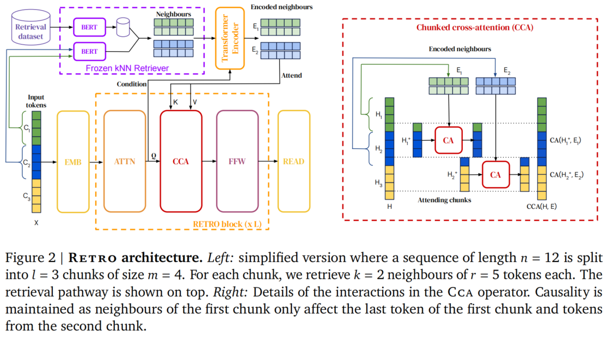
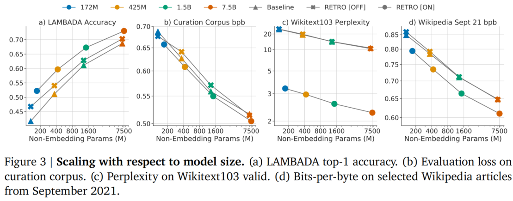
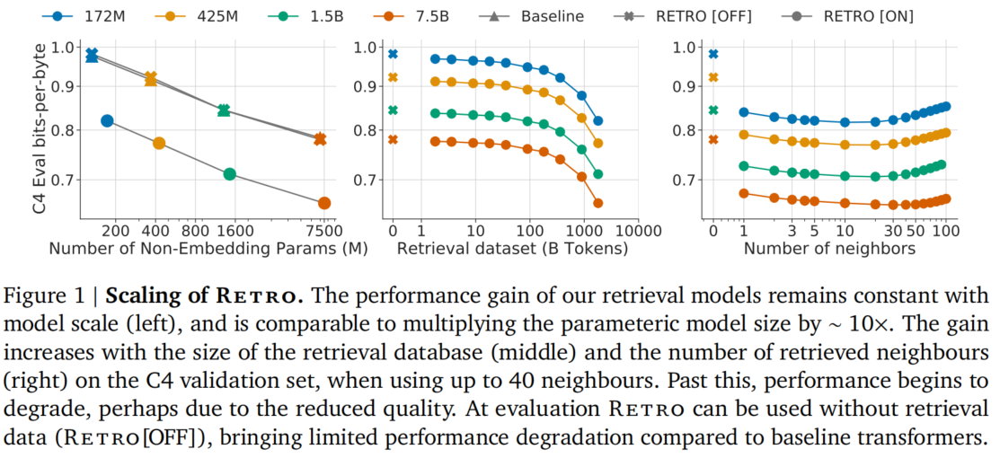
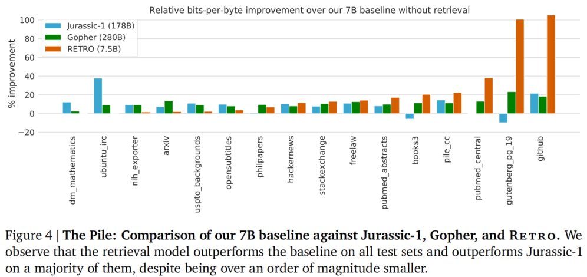
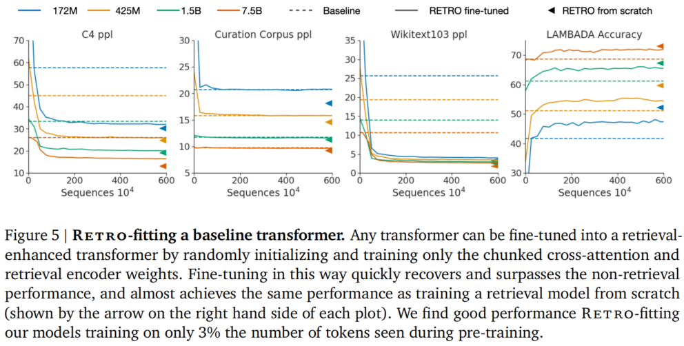
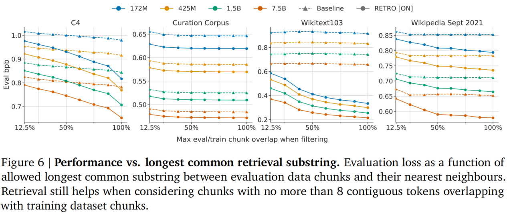

# RETRO 论文精读笔记

> **论文标题**: Improving language models by retrieving from trillions of tokens
>
> **作者**: Sebastian Borgeaud, Arthur Mensch, Jordan Hoffmann 等 (DeepMind)
>
> **发表时间**: 2021 年 12 月 (ICML 2022)
>
> **arXiv**: [2112.04426](https://arxiv.org/abs/2112.04426)

---

## 目录

- [一、研究背景与核心问题](#一研究背景与核心问题)
- [二、核心方法创新](#二核心方法创新)
  - [2.1 Chunk 级检索策略](#21-chunk-级检索策略)
  - [2.2 半参数化方法](#22-半参数化方法)
  - [2.3 保持自回归性](#23-保持自回归性)
- [三、RETRO 架构详解](#三-retro-架构详解)
  - [3.1 检索机制：Frozen BERT + kNN](#31-检索机制frozen-bert--knn)
  - [3.2 编码器-解码器架构](#32-编码器-解码器架构)
  - [3.3 Chunked Cross-Attention (CCA)](#33-chunked-cross-attention-cca)
- [四、公式详解与数学基础](#四公式详解与数学基础)
  - [4.1 自回归概率分解](#41-自回归概率分解)
  - [4.2 检索增强的对数似然](#42-检索增强的对数似然)
  - [4.3 交叉注意力机制](#43-交叉注意力机制)
  - [4.4 L2 距离与最近邻搜索](#44-l2-距离与最近邻搜索)
  - [4.5 Bits-Per-Byte 与泄漏分析](#45-bits-per-byte-与泄漏分析)
- [五、实验结果与发现](#五实验结果与发现)
  - [5.1 模型规模扩展实验](#51-模型规模扩展实验)
  - [5.2 数据库规模扩展实验](#52-数据库规模扩展实验)
  - [5.3 The Pile 基准测试](#53-the-pile-基准测试)
  - [5.4 RETRO-fitting：改造已有模型](#54-retro-fitting改造已有模型)
  - [5.5 问答任务实验](#55-问答任务实验)
  - [5.6 数据集泄漏分析](#56-数据集泄漏分析)
- [六、消融实验与设计选择](#六消融实验与设计选择)
- [七、隐私、安全与公平性讨论](#七隐私安全与公平性讨论)
- [八、与相关工作对比](#八与相关工作对比)
- [九、总结与启示](#九总结与启示)

---

## 一、研究背景与核心问题

语言模型（Language Model, LM）的核心任务是建模文本的概率分布，通常通过将其分解为条件化的下一个 token 预测来实现：

$$
p(x_1, \ldots, x_n) = \prod_i p(x_i \mid x_{<i})
$$

近年来，Transformer 架构在语言建模中取得了巨大成功，模型规模从 1 亿参数扩展到超过千亿参数（如 GPT-3 的 175B、Jurassic-1 的 178B）。这种规模扩张带来了显著的性能提升，但也面临三个根本性挑战：

**1. 训练成本极高。** 每次从头训练百亿参数模型需要数百万美元级别的计算资源，且随着参数增长呈超线性上升。

**2. 知识固化。** 模型参数中存储的知识是静态的，无法实时更新。模型一旦训练完成，就无法获取训练数据之后的新知识。

**3. 记忆与推理混杂。** 传统模型将所有知识编码在参数中，无法区分哪些是"记住的事实"，哪些是"推理能力"，导致可解释性差。

> **RETRO 的核心洞见**: 与其把知识全部塞进参数里，不如给模型配备一个"外接硬盘"——一个包含数万亿 token 的文本数据库。模型在生成每个词时，可以从这个数据库中检索相关的文本片段，并利用这些检索结果来辅助预测。

###  自回归概率分解

**① 定义（Definition）**

自回归（Autoregressive）在概率论中的严格定义是：一个序列的联合概率分布可以被分解为条件概率的链式乘积。对于离散序列 $X = (x_1, \ldots, x_n)$，其联合概率为：

$$P(X) = \prod_{i=1}^{n} P(x_i \mid x_1, \ldots, x_{i-1})$$

这是概率论中 **链式法则（Chain Rule）** 的直接应用，对任何联合分布都成立，无需额外假设。

**② 优化（Optimization）**

在实际训练中，我们并不直接优化概率乘积，而是优化其对数：

$$\log P(X) = \sum_{i=1}^{n} \log P(x_i \mid x_{<i})$$

这带来三个关键优化：
- **数值稳定性**：概率值通常极小（如 $10^{-5}$），连乘会导致浮点数下溢（underflow）。对数将乘法转为加法，避免数值问题。
- **梯度友好**：对数函数的导数为 $1/x$，在优化初期梯度较大，加速收敛；而概率值本身的梯度会随值减小而消失。
- **并行计算**：求和运算天然适合 GPU 的并行归约（reduction）操作。

**③ 实现（Implementation）**

训练时采用 **Teacher Forcing** 策略：无论模型在上一步预测出什么，输入到下一步的总是**真实的**前一个 token。这使得所有时间步的预测可以并行计算（因为输入序列已知），而非串行自回归生成。推理时则必须串行，因为需要用到上一步的预测输出。

**④ 原理（Principle）**

从信息论视角，最小化负对数似然等价于最小化模型分布与真实数据分布之间的**交叉熵（Cross-Entropy）**。根据香农信息论，语言模型的最优压缩率由真实分布的 **熵率（Entropy Rate）** 决定：

$$H = \lim_{n \to \infty} \frac{1}{n} H(X_1, \ldots, X_n)$$

自回归分解使得模型可以逼近这个熵率，而 RETRO 通过引入外部检索信息，进一步降低了条件熵 $H(X_i \mid X_{<i}, \text{Ret})$，从而突破了纯参数模型的压缩极限。

---

## 二、核心方法创新

### 2.1 Chunk 级检索策略

传统检索方法（如 kNN-LM）以单个 token 为粒度进行检索：为每个待预测的 token 找到最相似的上下文。这种方式的存储开销巨大——每个 token 需要一个向量，trillion 级别的数据库将产生无法承受的存储成本。

RETRO 采用 **Chunk 级检索策略**，流程如下：

1. **分块**：将输入序列划分为长度为 $m = 64$ 个 token 的 chunk。对于长度为 $n = 2048$ 的序列，共产生 $l = n/m = 32$ 个 chunk。
2. **检索**：对每个 chunk，使用 frozen BERT 计算其嵌入表示，然后在数据库中检索 $k$ 个最近邻 chunk。
3. **利用**：在生成第 $u$ 个 chunk 时，模型可以"看到"从第 1 到第 $u-1$ 个 chunk 检索到的所有邻居信息。

###  Chunk 级检索

**① 定义（Definition）**

Chunk 是序列的一个连续子段，形式化定义为：

$$C_u = (x_{(u-1)m+1}, x_{(u-1)m+2}, \ldots, x_{um})$$

其中 $m$ 为 chunk 大小，$u$ 为 chunk 索引。在 RETRO 中，$m=64$，$n=2048$，故 $l=32$。

**② 优化（Optimization）**

为什么选择 $m=64$？这是一个**计算-精度帕累托最优**点：
- **如果 $m$ 太小（如 token 级）**：检索频率过高，每个 token 都要查一次数据库，存储索引量 $O(T)$ 不可接受；且单个 token 语义不完整，检索噪声大。
- **如果 $m$ 太大（如文档级）**：检索粒度太粗，一个长文档内部可能包含多个主题，检索到的邻居与当前局部上下文相关性下降；且 chunk 内部前后 token 的检索条件差异大，无法精细匹配。
- **$m=64$ 的权衡**：约 50-100 个字符，通常覆盖一个完整句子或子句，语义单元完整且检索成本可控（32 次检索/序列）。

**③ 实现（Implementation）**

检索发生在**序列级别**而非 token 级别：对第 $u$ 个 chunk，使用**整个 chunk 的 BERT 平均池化向量**作为查询。这要求数据库中的文本也按相同长度 $m$ 切分并预计算嵌入。检索结果 $k$ 个邻居及其后续文本（continuation）被缓存为键值对，供 decoder 的 CCA 层使用。

**④ 原理（Principle）**

Chunk 级检索基于**局部语义一致性假设**：自然语言中，相邻的 64 个 token 通常围绕一个核心概念或事件展开，其语义可以被一个固定维度的稠密向量有效概括。这本质上是**n-gram 假设的连续扩展**——从离散符号的局部性推广到连续嵌入空间的局部性。BERT 的上下文嵌入进一步保证了：即使两个 chunk 没有词汇重叠（如"量子叠加"和"superposition principle"），只要语义相关，它们在向量空间中就接近。

---

### 2.2 半参数化方法

传统语言模型是纯参数化的：所有知识都存储在模型权重中。RETRO 采用 **半参数化（semi-parametric）** 方法，将知识存储分为两部分：

| 特性 | 纯参数化模型（如 GPT-3） | 半参数化模型（RETRO） |
|------|---------|---------|
| 知识存储 | 全部编码在模型参数中 | 参数 + 外部检索数据库 |
| 知识更新 | 需要重新训练整个模型 | 仅更新检索数据库 |
| 参数量 | 175B+（GPT-3） | 7.5B（达到同等效果） |
| 可解释性 | 黑盒，难以追溯知识来源 | 可查看检索到的邻居文本 |
| 推理成本 | 仅需模型前向传播 | 模型前向 + 数据库检索 |

这种分离带来了巨大的灵活性：更新知识不需要重新训练模型，只需更新检索数据库即可。这在成本上低了数个数量级。

### 半参数化方法

**① 定义（Definition）**

在统计学习理论中，方法分为三类：
- **参数化（Parametric）**：模型由固定数量参数描述（如线性回归、标准 Transformer），容量不随数据增长。
- **非参数化（Non-parametric）**：模型容量随数据增长（如 k-NN 直接使用全部训练数据），无固定参数。
- **半参数化（Semi-parametric）**：结合两者——用参数化组件（如神经网络）捕捉通用模式，用非参数化组件（如检索数据库）存储具体事实。

RETRO 属于第三类：decoder 是参数化的（7.5B 参数），而检索数据库是非参数化的（2T token，存储随数据增长）。

**② 优化（Optimization）**

半参数化实现了**存储-计算的帕累托前沿**优化：
- 纯参数化模型：知识存储在 $d \times d$ 权重矩阵中，存储密度高但更新成本极高（需重新训练）。
- 纯检索模型：无需训练，但推理时需遍历海量数据，计算不可接受。
- RETRO 的折中：7.5B 参数存储"如何推理"和"通用语言规律"，2T token 数据库存储"具体事实"。推理时仅查询 $k=2$ 个邻居，额外计算开销 $O(\log T)$ 可忽略。

**③ 实现（Implementation）**

数据库以 **键值存储（Key-Value Memory）** 形式实现：
- **Key**：BERT 平均池化后的 $d$-维向量（用于相似度搜索）。
- **Value**：原始邻居文本 $N$（64 token）及其续写 $F$（64 token），共 128 token。

这种分离允许独立优化：键用于快速最近邻搜索（ANN），值用于提供丰富的上下文信息给 decoder。

**④ 原理（Principle）**

从贝叶斯视角，半参数化对应于**先验-数据分离**：
- 参数化 decoder 编码了**先验分布** $P(Y \mid X, \theta)$——即语言的一般规律。
- 检索数据库提供了**数据似然** $P(D \mid X)$——即与当前上下文相关的具体证据。
- 最终预测是两者的贝叶斯组合：$P(Y \mid X, D, \theta) \propto P(Y \mid X, \theta) \cdot P(D \mid X)$。

这与人类认知一致：我们的大脑存储"如何思考"（参数化），但具体事实（如"法国首都是巴黎"）通过查阅外部资料（非参数化）获取，而非全部死记硬背。

---

### 2.3 保持自回归性

RETRO 的一个关键设计是严格保持自回归性：预测第 $u$ 个 chunk 的 token 时，只能使用从第 1 到第 $u-1$ 个 chunk 检索到的邻居，不能使用当前或未来 chunk 的检索结果。这保证了模型可以像标准 Transformer 一样进行自回归采样。

> **设计原则**：第一个 chunk $C_1$ 不依赖任何检索数据（$\text{Ret}(C_1) = \emptyset$），其预测仅基于模型参数。这确保了模型在没有任何外部信息时也能正常工作。

### 自回归性维护

**① 定义（Definition）**

自回归性（Autoregressive Property）的严格数学定义是：对于序列生成模型，预测 $x_i$ 时只能使用 $\{x_1, \ldots, x_{i-1}\}$ 作为条件，即：

$$P(x_i \mid x_{<i}) = P(x_i \mid x_1, \ldots, x_{i-1})$$

任何使用 $x_{\geq i}$ 信息的模型都违反了因果性（Causality），无法用于自回归采样。

**② 优化（Optimization）**

自回归约束在**训练时**可以通过**因果掩码（Causal Masking）**实现并行化：构造一个下三角掩码矩阵 $M$，其中 $M_{ij} = 1$ 当且仅当 $j \leq i$。这样所有位置的前向传播可以在一次矩阵运算中完成，无需串行循环。RETRO 的 CCA 扩展了这一思想：不仅 token 间有因果掩码，chunk 间的检索结果也有**块级因果掩码**。

**③ 实现（Implementation）**

实现自回归性需要两个层次的掩码：
- **Token 级**：标准 Transformer 的三角注意力掩码，防止 $x_i$ attend to $x_{>i}$。
- **Chunk 级**：第 $u$ 个 chunk 的 token 只能使用 $\{E_1, \ldots, E_{u-1}\}$ 作为检索上下文，不能使用 $E_{\geq u}$。

CCA 的 attending chunk 错位设计（第 $u$ 个 chunk 的最后一个 token 是第一个能看到 $E_u$ 的位置）精确实现了这一约束。

**④ 原理（Principle）**

从概率图模型（Probabilistic Graphical Model）视角，自回归模型对应一个**有向无环图（DAG）**，其中每个节点 $x_i$ 的父节点集合为 $\{x_1, \ldots, x_{i-1}\}$。引入检索信息后，图结构扩展为：

$$x_i \leftarrow \text{Ret}(C_u) \leftarrow C_u = (x_{(u-1)m+1}, \ldots, x_{um})$$

由于 $\text{Ret}(C_u)$ 依赖于整个 $C_u$（包括 $x_{um}$），如果允许 $x_{(u-1)m+1}$（$C_u$ 的第一个 token）使用 $\text{Ret}(C_u)$，就形成了一个**循环依赖**（$x_{(u-1)m+1}$ 依赖 $x_{um}$，而 $x_{um}$ 又依赖前面的 token）。RETRO 通过将 $E_u$ 的可见性推迟到 $C_u$ 的最后一个 token，打破了这个循环，维护了 DAG 结构。

---

## 三、RETRO 架构详解

RETRO 的整体架构采用 **编码器-解码器（Encoder-Decoder）** 设计，包含三个核心组件：Frozen BERT 检索器、邻居编码器（Encoder）和解码器（Decoder）。

*图 1：RETRO 架构概览。左图展示整体架构中的检索路径和解码器中的 RETRO Block；右图展示 CCA 的详细交互机制。（来源：论文 Figure 2）*

### 3.1 检索机制：Frozen BERT + kNN

RETRO 的检索数据库是一个**键值存储（Key-Value Memory）**：

- **键（Key）**：使用预训练的 BERT（**冻结**，不参与训练）对文本 chunk 做嵌入，然后对时间维度做平均池化，得到一个固定维度的向量。
- **值（Value）**：包含两部分——邻居 chunk $N$（用于计算 key 的原始文本）及其续写 $F$（在原文中紧跟 $N$ 的后续文本）。$N$ 和 $F$ 各长 64 个 token，总共 128 个 token。

检索时，使用 **L2 距离**（欧几里得距离）在 BERT 嵌入空间中寻找 $k$ 个最近邻：

$$
d(C, N) = \|\text{BERT}(C) - \text{BERT}(N)\|_2^2
$$

使用 SCaNN 库进行近似最近邻搜索，可以在 **10ms 内完成 2 万亿 token 数据库的查询**，时间复杂度为 $O(\log T)$。

###  Frozen BERT 检索器

**① 定义（Definition）**

键值存储（Key-Value Memory）的形式化定义为：一个映射 $M: \mathcal{K} \to \mathcal{V}$，其中 $\mathcal{K}$ 是键空间（BERT 嵌入向量），$\mathcal{V}$ 是值空间（原始文本片段）。检索操作定义为：

$$\text{Ret}(C) = \arg\min_{N \in \mathcal{D}}^{(k)} \|\text{BERT}(C) - \text{BERT}(N)\|_2^2$$

其中 $\arg\min^{(k)}$ 表示取距离最小的 $k$ 个元素。

**② 优化（Optimization）**

**冻结 BERT** 是一个关键优化选择：
- **梯度隔离**：BERT 不参与训练，其参数无需存储梯度，节省约 30% 显存。
- **预计算**：数据库中所有 chunk 的 BERT 嵌入可以在训练前**一次性预计算并缓存**，避免训练时重复编码。
- **表示稳定性**：如果 BERT 参与训练，其嵌入空间会随训练漂移，导致预计算的索引失效，必须频繁重建（万亿级索引重建成本极高）。

对比端到端训练的检索器（如 REALM、DPR）：虽然理论上可以学习更适合下游任务的嵌入，但 RETRO 证明**预训练 BERT 的通用语义空间已经足够好**，且工程实现简单得多。

**③ 实现（Implementation）**

平均池化的具体操作：对于 BERT 输出的序列隐藏状态 $H \in \mathbb{R}^{m \times d}$（$m=64$ token，$d=768$ 维），键向量计算为：

$$\text{Key}(N) = \frac{1}{m} \sum_{i=1}^{m} H_i$$

这相当于对时间维度做算术平均，将变长语义压缩为固定长度向量。SCaNN 库则通过 **向量量化（Vector Quantization）** 和 **倒排索引（Inverted File Index）** 将高维最近邻搜索从 $O(T)$ 降到 $O(\log T)$。

**④ 原理（Principle）**

冻结 BERT 有效的前提是**表示空间对齐（Representation Alignment）**：BERT 的嵌入空间与 decoder 的隐藏状态空间虽然维度不同（768 vs 2048），但语义结构兼容。这得益于：
- 预训练语言模型（PLM）的**普遍语义假设**：在足够大规模的无监督预训练后，不同架构的模型会学习到相似的语义拓扑结构（如"国王-男人+女人≈女王"的线性关系）。
- 邻居编码器（Transformer Encoder）的**适配作用**：即使 BERT 嵌入与 decoder 不完全对齐，邻居编码器通过双向注意力可以重新编码邻居信息，弥合表示差距。

---

### 3.2 编码器-解码器架构

检索到的邻居首先被送入一个**双向 Transformer 编码器**，产生编码后的邻居表示 $E$。编码器的一个关键设计是**查询条件化（Query Conditioning）**：编码器通过交叉注意力层接收解码器中当前 chunk 的激活值，使得邻居的编码可以根据查询 chunk 动态调整。

解码器则**交替使用**标准 Transformer Block 和 RETRO Block：

- **标准 Block**：$\text{LM}(H) = \text{FFW}(\text{Attn}(H))$，即自注意力 + 前馈网络
- **RETRO Block**：$\text{Retro}(H, E) = \text{FFW}(\text{CCA}(\text{Attn}(H), E))$，在自注意力和前馈网络之间插入了 Chunked Cross-Attention

RETRO Block 从第 6 层开始，**每 3 层放置一个**。例如，在 12 层模型中，CCA 出现在第 6、9、12 层。

###  编码器-解码器架构

**① 定义（Definition）**

编码器-解码器架构的形式化描述：
- **编码器**：双向 Transformer，$\text{Enc}(N, F, H_{query}) = \text{BiAttn}(\text{Embed}(N, F), H_{query})$，其中 $H_{query}$ 来自 decoder 的查询条件。
- **RETRO Block**：$\text{Retro}(H, E) = H + \text{FFW}(H + \text{CCA}(H, E))$，其中 CCA 插入在自注意力之后、FFW 之前。

**② 优化（Optimization）**

**每 3 层放置一个 CCA** 是稀疏性设计（Sparsity Design）：
- **如果每层都放**：计算开销增加约 30-40%，但收益递减（底层主要处理局部语法，不需要全局检索）。
- **如果只在顶层放**：底层无法利用检索信息修正早期表示，信息传播路径过长。
- **从第 6 层开始**：前 5 层专注于局部上下文建模和语法分析，第 6 层起进入语义组合阶段，此时引入外部知识最有效。

**③ 实现（Implementation）**

查询条件化的实现细节：编码器在标准双向注意力之上，增加了一个**交叉注意力层**，其 Query 来自 decoder 当前层的隐藏状态 $H_{dec}$，Key/Value 来自邻居的嵌入。这通过残差连接注入：

$$E_{encoded} = \text{BiAttn}(E_{embed}) + \text{CrossAttn}(H_{dec}, E_{embed})$$

这使得邻居编码**动态依赖**当前 decoder 的查询状态，而非静态编码。

**④ 原理（Principle）**

分层架构对应**信息抽象层次**（Levels of Abstraction）：
- **底层（1-5 层）**：处理词汇、句法、局部搭配（如"量子"后面接"力学"还是"计算"）。
- **中层（6-9 层）**：处理语义角色、指代消解、实体关系（如"它"指代什么）。
- **顶层（10-12 层）**：处理全局连贯性、主题一致性、知识推理（如"量子计算的优势是什么"）。

CCA 从第 6 层开始，是因为**检索信息主要用于语义层和知识层**，而非底层语法层。这符合神经语言学中的**层次加工假设**（Hierarchical Processing Hypothesis）。

---

### 3.3 Chunked Cross-Attention (CCA)

CCA 是 RETRO **最核心的创新**。它的作用是让解码器中的 token "关注"（attend to）检索到的邻居文本。

**CCA 的操作流程**：

1. **分块**：将解码器的中间激活 $H$ 分成 $l-1$ 个 **attending chunk**，每个大小为 $m$。第 $u$ 个 attending chunk 包含第 $u$ 个 chunk 的最后一个 token 和第 $u+1$ 个 chunk 的前 $m-1$ 个 token。

2. **交叉注意力**：每个 attending chunk 与对应的编码邻居 $E_u$ 做交叉注意力：

$$
\text{CCA}(H, E)_{um+i-1} := \text{Ca}(h_{um+i-1}, E_u)
$$

其中 $\text{Ca}$ 是标准的交叉注意力操作，$h_i$ 是 attending chunk 中的第 $i$ 个 token 的隐藏状态，$E_u$ 是从第 $u$ 个 chunk 检索到的邻居编码。

3. **合并输出**：将所有 attending chunk 的交叉注意力输出按时间顺序拼接，并进行适当的填充，得到最终输出 $\text{CCA}(H, E)$。

> **因果性维护**：第 $u$ 个 chunk 的 token 只能 attend 到从第 $u$ 个 chunk 检索到的邻居 $E_u$，而不能 attend 到 $E_{u+1}$ 或之后的检索结果。这通过 carefully 设计的 attending chunk 边界来实现——第 $u$ 个 chunk 的最后一个 token 是第一个可以"看到" $E_u$ 的位置。这是因为第 $u$ 个 token 的检索结果 $E_u$ 是基于整个第 $u$ 个 chunk 的内容从数据库中检索出来的。

前 $m-1$ 个 token（属于第一个 chunk）没有前驱 chunk 的检索结果，因此在这些位置 CCA 定义为恒等映射（identity），即直接传递输入。

###  CCA 机制

**① 定义（Definition）**

恒等映射（Identity Mapping）在 CCA 中的定义：对于没有可用检索信息的位置（如第一个 chunk 的前 $m-1$ 个 token），CCA 输出等于输入：

$$\text{CCA}(H, E)_{i} = H_i, \quad \text{for } i = 1, \ldots, m-1$$

这保证了即使没有外部知识，模型也能退化为标准 Transformer。

**② 优化（Optimization）**

Attending chunk 的**错位边界**是一个精妙的内存与计算优化：
- 如果不错位（第 $u$ 个 attending chunk = 第 $u$ 个 chunk），则第 $u$ 个 chunk 的前 $m-1$ 个 token 无法使用 $E_u$，导致 $m-1$ 个位置浪费检索信息。
- 通过错位（第 $u$ 个 attending chunk = 第 $u$ 个 chunk 最后 1 token + 第 $u+1$ 个 chunk 前 $m-1$ token），每个 token 都能使用其"前驱 chunk"的检索结果，**检索利用率最大化**。
- 仅需在序列开头填充 $m-1$ 个 identity 位置，内存开销极小。

**③ 实现（Implementation）**

输出合并的内存布局：CCA 的输出是分段计算的，每段长度为 $m$，对应一个 attending chunk。这些段按时间顺序拼接：

$$\text{CCA}(H, E) = [\underbrace{H_1, \ldots, H_{m-1}}_{\text{identity}}, \text{Ca}(h_m, E_1), \ldots, \text{Ca}(h_{2m-1}, E_1), \text{Ca}(h_{2m}, E_2), \ldots]$$

这要求实现时维护一个**段偏移指针**，确保每个 token 路由到正确的邻居编码 $E_u$。

**④ 原理（Principle）**

从**因果图（Causal Graph）**视角，CCA 的错位设计实现了**d-分离（d-separation）**：
- 节点 $x_i$（第 $u$ 个 chunk 的第 $i$ 个 token）的父节点包括：$x_{<i}$（历史 token）和 $E_u$（检索信息）。
- 节点 $E_u$ 的父节点是 $C_u = (x_{(u-1)m+1}, \ldots, x_{um})$（整个第 $u$ 个 chunk）。
- 如果 $i < m$（即 $x_i$ 是 $C_u$ 的前 $m-1$ 个 token），则 $x_i$ 是 $E_u$ 的后代（因为 $E_u$ 依赖于 $x_{um}$，而 $x_{um}$ 又依赖于 $x_i$）。允许 $x_i$ 使用 $E_u$ 会形成**循环因果路径** $x_i \to \ldots \to x_{um} \to E_u \to x_i$。
- 错位边界将 $E_u$ 的可见性推迟到 $x_{um}$（$C_u$ 的最后一个 token），此时 $x_{um}$ 不再依赖任何未来信息，循环被打破，DAG 结构得以保持。

---

## 四、公式详解与数学基础

### 4.1 自回归概率分解

语言模型的基础任务是将联合概率分解为条件概率的乘积：

$$
p(x_1, \ldots, x_n) = \prod_{i=1}^{n} p(x_i \mid x_{<i})
$$

**数学基础——链式法则（Chain Rule）**：

对于任意随机变量序列 $X_1, X_2, \ldots, X_n$，其联合概率可分解为：

$$
P(X_1, \ldots, X_n) = P(X_1) \cdot P(X_2 \mid X_1) \cdot P(X_3 \mid X_1, X_2) \cdots P(X_n \mid X_1, \ldots, X_{n-1})
$$

在语言模型中，假设每个词 $x_i$ 只依赖于它之前的所有词 $x_{<i} = (x_1, \ldots, x_{i-1})$，这是一种无限制的依赖关系（非固定阶的马尔可夫假设）。使用对数似然（log-likelihood）将乘积转换为求和，便于数值稳定优化：

$$
\log p(x_1, \ldots, x_n) = \sum_{i=1}^{n} \log p(x_i \mid x_{<i})
$$

### 4.2 检索增强的对数似然

RETRO 定义了检索增强的序列对数似然（论文公式 1）：

$$
L(X \mid \theta, D) = \sum_{u=1}^{l} \sum_{i=1}^{m} \log p_\theta\left(x_{(u-1)m+i} \;\middle|\; (x_j)_{j<(u-1)m+i},\; (\text{Ret}_D(C_{u'}))_{u'<u}\right)
$$

**各项含义**：

- $X = (x_1, \ldots, x_n)$：输入 token 序列（$n = 2048$）
- $l = n/m = 32$：chunk 数量（$m = 64$）
- $C_u = (x_{(u-1)m+1}, \ldots, x_{um})$：第 $u$ 个 chunk
- $\text{Ret}_D(C_u)$：从数据库 $D$ 中为 chunk $C_u$ 检索到的 $k$ 个邻居
- $\theta$：模型参数
- 下标 $u' < u$：严格限制只能使用之前 chunk 的检索结果，**保持自回归性**

**关键设计**：

- $\text{Ret}(C_1) = \emptyset$：第一个 chunk 不依赖任何检索数据
- 第 $u$ 个 chunk 的第 $i$ 个 token 的概率依赖于：
  1. 所有之前的 token $(x_j)_{j<(u-1)m+i}$
  2. 所有之前 chunk 检索到的邻居 $(\text{Ret}_D(C_{u'}))_{u'<u}$

###  检索增强的对数似然

**① 定义（Definition）**

检索函数 $\text{Ret}_D(C_u)$ 的形式化定义：给定数据库 $D$ 和查询 chunk $C_u$，返回 $k$ 个邻居-续写对：

$$\text{Ret}_D(C_u) = \{(N_1, F_1), \ldots, (N_k, F_k)\}$$

其中 $(N_j, F_j)$ 是数据库中与 $C_u$ 语义最接近的第 $j$ 个 chunk 及其后续文本。

**② 优化（Optimization）**

训练时的**延迟检索（Lazy Retrieval）**优化：由于数据库固定且 BERT 冻结，所有 chunk 的检索结果可以在训练前**预计算并缓存**。这避免了训练时实时检索的 I/O 瓶颈。缓存策略：
- 对于训练数据中的每个 chunk $C_u$，预计算 $\text{Ret}_D(C_u)$ 并存储为二进制索引。
- 训练时直接从缓存读取，无需调用 SCaNN，将检索开销从 $O(\log T)$ 降到 $O(1)$（内存读取）。

**③ 实现（Implementation）**

公式中的双重求和 $\sum_{u=1}^{l} \sum_{i=1}^{m}$ 等价于对序列中所有 token 的遍历，但按 chunk 分组。实现时：
- 外层循环遍历 $u=1, \ldots, l$（chunk 级别）。
- 内层循环遍历 $i=1, \ldots, m$（token 级别）。
- 对于每个 token $x_{(u-1)m+i}$，其检索上下文是**固定**的 $\{E_1, \ldots, E_{u-1}\}$，与 $i$ 无关。这允许在 chunk 内并行计算所有 token 的损失。

**④ 原理（Principle）**

从**变分推断（Variational Inference）**视角，检索增强的对数似然可以看作是对真实后验的近似：

$$\log p(X) = \log \int p(X \mid Z) p(Z) dZ \geq \mathbb{E}_{q(Z \mid X)}[\log p(X \mid Z)] - \text{KL}(q(Z \mid X) \| p(Z))$$

其中 $Z$ 是隐变量（检索信息），$q(Z \mid X)$ 由 BERT 检索器近似。RETRO 的检索过程对应于选择一个**确定性**的 $q$（取最近邻而非概率分布），从而简化了 ELBO（Evidence Lower Bound）优化。虽然牺牲了一些理论严谨性，但获得了工程可行性。

---

### 4.3 交叉注意力机制

交叉注意力的数学定义为（论文公式 4）：

$$
\text{Ca}(h, Y) = \text{softmax}(Y K \cdot Q^\top h) \cdot Y V
$$

**逐步拆解**：

**(1) 线性投影**

给定 query 向量 $h \in \mathbb{R}^d$，首先通过投影矩阵 $Q$ 得到 query 表示 $q = Q^\top h \in \mathbb{R}^c$。同时，输入矩阵 $Y \in \mathbb{R}^{T \times d}$（$T = k \times r$ 个检索 token）分别通过投影矩阵 $K$ 和 $V$ 得到 key 矩阵 $YK$ 和 value 矩阵 $YV$。

**(2) 注意力分数计算**

计算 query 与每个 key 的点积，得到注意力分数 $z = YK \cdot q \in \mathbb{R}^T$。点积衡量了两个向量之间的相似度——方向越一致，点积越大。

> **线性代数基础**：点积（Dot Product）是两个向量对应元素乘积之和。对于向量 $a, b \in \mathbb{R}^d$：
> $$
> a \cdot b = \sum_{i=1}^{d} a_i b_i = \|a\| \|b\| \cos\theta
> $$
> 当两个向量方向一致时，$\cos\theta = 1$，点积最大；方向相反时，$\cos\theta = -1$，点积最小。

**(3) Softmax 归一化**

$$\alpha = \text{softmax}(z), \quad \text{其中} \quad \text{softmax}(z)_i = \frac{e^{z_i}}{\sum_{j=1}^{T} e^{z_j}}$$

Softmax 将任意实数向量转换为概率分布——所有分量 $\alpha_i \in (0, 1)$，且 $\sum_i \alpha_i = 1$。

> **为什么用 Softmax？** Softmax 具有两个关键性质：(1) 输出恒为正且和为 1，构成合法的概率分布；(2) 对输入的缩放具有单调性，保留了排序关系。这使得模型可以"分配注意力"——将更多的"关注"放在更相关的检索 token 上。

**(4) 加权求和**

$$\text{Ca}(h, Y) = \sum_{i=1}^{T} \alpha_i \cdot (YV)_i \in \mathbb{R}^d$$

输出是所有 value 向量的加权和，权重由 query-key 相似度决定。这意味着与 query 更相似的 key 对应的 value 会被赋予更高的权重。

> **直觉理解**：交叉注意力就像"查阅参考书"。query 是你想解答的问题，keys 是书中各章节的索引标签，values 是章节内容。注意力机制帮你找到与问题最相关的章节，并综合这些章节的内容给出答案。

**多头注意力（Multi-Head Attention）**：

实际使用多组 $(Q, K, V)$ 并行计算，每组称为一个"头"（head），不同头可以捕捉不同类型的依赖关系。论文中还加入了相对位置编码到 softmax 中，使模型能感知 token 之间的相对距离。

###  交叉注意力机制

**① 定义（Definition）**

交叉注意力的线性代数严格定义：给定 query 向量 $h \in \mathbb{R}^d$ 和检索矩阵 $Y \in \mathbb{R}^{T \times d}$，投影矩阵 $W_Q, W_K, W_V \in \mathbb{R}^{d \times c}$：

$$\text{Ca}(h, Y) = \text{softmax}\left(\frac{(YW_K)(hW_Q)^\top}{\sqrt{c}}\right) YW_V$$

其中 $\sqrt{c}$ 是缩放因子（防止点积过大导致 softmax 饱和）。

**② 优化（Optimization）**

**多头并行（Multi-Head Parallelism）**的计算图优化：
- 将 $d$ 维空间划分为 $H$ 个头，每个头维度 $c = d/H$。
- 不同头可以并行计算，GPU 利用率高。
- **分工假设**：不同头自动学习不同功能（如一个头关注实体匹配，一个头关注关系推理，一个头关注数值计算）。这类似于集成学习中的多样性增益。

相对位置编码的优化：在标准 Transformer 中，位置编码加到输入嵌入上；RETRO 在 CCA 的 softmax 中直接加入相对位置偏置 $b_{ij}$：

$$\text{softmax}(z_i + b_{ij})$$

这避免了显式构造位置向量，节省内存且更灵活。

**③ 实现（Implementation）**

内存高效实现：交叉注意力的 Key 和 Value 矩阵 $YK, YV$ 在**同一个 chunk 内所有 token 共享**（因为检索上下文 $E_u$ 固定）。实现时：
- 预计算 $YK_u, YV_u$ 并缓存。
- 对于 chunk $u$ 内的 $m$ 个 token，复用相同的 $YK_u, YV_u$，仅计算不同的 $q_i = h_i W_Q$。
- 这减少了 $m$ 倍的 KV 缓存计算，显著降低内存带宽压力。

**④ 原理（Principle）**

交叉注意力可以看作**核方法（Kernel Method）**的特例。定义核函数：

$$\kappa(h, y_j) = \exp\left(\frac{(hW_Q)(y_jW_K)^\top}{\sqrt{c}}\right)$$

则注意力输出是检索 token 的核加权平均：

$$\text{Ca}(h, Y) = \sum_{j} \frac{\kappa(h, y_j)}{\sum_{k} \kappa(h, y_k)} \cdot y_j W_V$$

这等价于**高斯过程回归（Gaussian Process Regression）**中的均值预测，其中核函数衡量 query 与检索 token 的相似度。因此，交叉注意力本质上是在检索空间中进行**非参数化插值**：模型不是"记住"知识，而是根据查询动态地从检索数据库中"插值"出合适的响应。

---

### 4.4 L2 距离与最近邻搜索

检索使用 L2 距离（欧几里得距离）的平方（论文 §2.3）：

$$
d(C, N) = \|\text{BERT}(C) - \text{BERT}(N)\|_2^2 = \sum_{i} (\text{BERT}(C)_i - \text{BERT}(N)_i)^2
$$

**为什么用平方距离？**

平方操作是单调变换——不会改变最近邻的排序，同时省去了开方运算，计算更快。

**近似最近邻（ANN）搜索**：

对于包含 $T$ 个元素的数据库，暴力搜索需要 $O(T)$ 时间。RETRO 使用 **SCaNN 库**实现 $O(\log T)$ 的查询时间，使得在 2 万亿 token 的数据库上查询仅需约 **10ms**。

> **信息论基础**：最近邻搜索的核心思想是"相似的数据在嵌入空间中距离近"。BERT 嵌入将语义相似的文本映射到高维空间中相近的位置，这使得基于距离的检索能够有效找到语义相关的文本片段。

###  L2 距离与 ANN

**① 定义（Definition）**

度量空间（Metric Space）的公理化定义：集合 $\mathcal{X}$ 上的距离函数 $d: \mathcal{X} \times \mathcal{X} \to \mathbb{R}_{\geq 0}$ 必须满足：
- **非负性**：$d(x, y) \geq 0$，且 $d(x, y) = 0 \iff x = y$
- **对称性**：$d(x, y) = d(y, x)$
- **三角不等式**：$d(x, z) \leq d(x, y) + d(y, z)$

L2 距离（欧几里得距离）满足上述公理，构成合法的度量空间。

**② 优化（Optimization）**

**平方距离**的优化已在正文中说明。SCaNN 的**量化-聚类级联**优化：
- **倒排文件索引（IVF）**：将数据库向量聚类为 $\sqrt{T}$ 个簇，查询时只搜索最近的几个簇，将候选集从 $T$ 降到 $T/\sqrt{T} = \sqrt{T}$。
- **乘积量化（Product Quantization, PQ）**：将高维向量拆分为子向量，每个子向量独立量化到码本，将距离计算从浮点运算转为查表运算。
- **非对称距离计算（ADC）**：查询向量不量化，仅数据库向量量化，平衡精度与速度。

**③ 实现（Implementation）**

索引构建流程：
1. **数据预处理**：将 2T token 的文本库切分为 64-token chunk，共约 $3.1 \times 10^{10}$ 个 chunk。
2. **嵌入计算**：用 frozen BERT 编码每个 chunk，平均池化得到 768 维向量。
3. **索引构建**：使用 k-means 聚类构建 IVF 索引，每个簇内使用 PQ 量化。
4. **查询时**：对查询向量做相同编码，先找最近簇，再在簇内用 ADC 计算精确距离排序。

**④ 原理（Principle）**

最近邻搜索有效的理论基础是**流形假设（Manifold Hypothesis）**：高维语义数据（如文本嵌入）实际上分布在一个低维流形上，而非均匀填充整个空间。这意味着：
- 数据点之间存在**局部结构**，相似语义在流形上形成连续区域。
- 最近邻不仅"距离近"，而且"语义连续"——从 $C$ 到其最近邻 $N$ 的向量差 $N - C$ 指向语义空间中的"相关方向"。
- BERT 嵌入的**语义同构性**：如果两个 chunk 在语义上相关，它们的嵌入向量在 L2 空间中的距离必然小。这由 BERT 的预训练目标（MLM）保证——模型必须将上下文相似的 token 映射到相近的表示。

---

### 4.5 Bits-Per-Byte 与泄漏分析

论文提出了一个评估指标来量化数据集泄漏的影响（论文公式 5）：

$$
\forall \alpha \in [0, 1], \quad \mathcal{C}_\alpha := \left\{C \in \mathcal{C} : r(C) \leq \alpha\right\}, \quad \text{bpb}(\alpha) := \frac{\sum_{C \in \mathcal{C}_\alpha} \ell(C)}{\sum_{C \in \mathcal{C}_\alpha} N(C)}
$$

**各项含义**：

- $\mathcal{C}$：评估集的所有 chunk
- $r(C) = s/m$：评估 chunk $C$ 与训练数据的**最长公共子串比例**
  - $s \in [0, m]$：最长公共 token 子串长度
  - $r(C) = 0$：chunk 从未在训练集中见过
  - $r(C) = 1$：chunk 完全出现在训练集中
- $\mathcal{C}_\alpha$：只保留与训练集重叠不超过 $\alpha$ 的 chunk
- $\ell(C)$：模型对 chunk $C$ 的负对数似然（nats 或 bits）
- $N(C)$：chunk 编码的字节数

**Bits-Per-Byte（BPB）的数学含义**：

BPB 是信息论中衡量压缩效率的指标——每个字节需要多少位来编码。它与困惑度（Perplexity）的关系为：

$$
\text{BPB} = \frac{\log_2(\text{Perplexity})}{\text{bytes per token}}
$$

BPB **与 tokenizer 无关**，因此比 raw loss 更适合跨模型比较。

**这个公式的用途**：

通过控制评估 chunk 与训练数据的最大重叠比例 $\alpha$，可以分离出"真实泛化能力"和"记忆效应"：

- **低 $\alpha$（如 12.5%）**：只评估与训练集几乎无重叠的 chunk，反映模型的真实泛化能力
- **高 $\alpha$（如 100%）**：恢复完整评估性能，包含泄漏带来的虚假提升
- **$\text{bpb}(\cdot)$ 的斜率**：揭示了模型多大程度上"利用"了训练-测试泄漏

> **关键发现**：当 $\alpha = 12.5\\%$ 时（即 chunk 与训练集最多共享 8 个连续 token），RETRO 仍然显著优于基线。这说明 RETRO 的增益不仅来自"复制粘贴"训练数据，更重要的是从检索信息中提取和泛化知识的能力。

###  BPB 与泄漏分析

**① 定义（Definition）**

**熵率（Entropy Rate）**的严格定义：对于随机过程 $\{X_t\}$，其熵率为：

$$H = \lim_{n \to \infty} \frac{H(X_1, \ldots, X_n)}{n}$$

BPB 是熵率的**经验估计**：如果模型达到真实分布，BPB 应等于数据源的熵率（以 bits/byte 为单位）。对于自然语言，经验熵率约为 0.6-1.2 bits/byte。

**② 优化（Optimization）**

**字节级归一化**是跨模型比较的关键优化：
- 困惑度（Perplexity）依赖 tokenizer：BPE 分词 vs. Unigram 分词会产生不同的 token 数量，直接比较困惑度不公平。
- BPB 通过除以字节数 $N(C)$，消除了 tokenizer 差异，使得不同架构的模型（如 GPT-2 的 BPE vs. RETRO 的 SentencePiece）可以公平比较。
- 这类似于物理学中的"无量纲化"——将绝对量转换为相对量，消除单位依赖。

**③ 实现（Implementation）**

泄漏检测的实现细节：
- 对评估集中的每个 chunk $C$，计算其与训练集所有文本的**最长公共子串（Longest Common Substring, LCS）**长度 $s$。
- 由于训练集巨大（2T token），精确计算 LCS 不可行。实现时使用**后缀数组（Suffix Array）**或**滚动哈希（Rolling Hash）**进行高效匹配。
- 根据 $r(C) = s/m$ 对 chunk 分组，计算每组的平均 BPB，绘制 $\text{bpb}(\alpha)$ 曲线。

**④ 原理（Principle）**

BPB 与**Kolmogorov 复杂度**的深刻联系：
- Kolmogorov 复杂度 $K(x)$ 是生成字符串 $x$ 的最短程序长度。
- 语言模型的负对数似然 $-\log p(x)$ 是 $K(x)$ 的上界（通过编码定理）。
- BPB 衡量的是模型"压缩"数据的能力——BPB 越低，模型越接近数据的本质规律（而非表面记忆）。

泄漏分析的理论意义：如果模型性能完全来自泄漏（记忆），则 $\text{bpb}(\alpha)$ 应随 $\alpha$ 增加而急剧下降（斜率陡峭）；如果模型真正泛化，则 $\text{bpb}(\alpha)$ 应接近平坦。RETRO 的曲线介于两者之间，证明它既利用检索进行**合理的外推**（非泄漏），又在存在泄漏时**有效利用**（不拒绝有用信息）。

---

## 五、实验结果与发现

RETRO 的实验设计非常全面，涵盖了模型规模扩展、数据库规模扩展、多个基准测试以及泄漏分析。

### 5.1 模型规模扩展实验

作者在 150M 到 7B 参数的规模范围内训练了多组模型：

*图 2：不同模型规模下的性能对比。（来源：论文 Figure 3）*

**关键发现**：

- RETRO 在所有模型规模上均优于基线 Transformer，且提升幅度**不随规模增大而减小**。
- RETRO 带来的性能增益约相当于将参数规模扩大 **10 倍**（如 172M RETRO $\approx$ 1.5B Baseline）。
- 在 Wikitext103 上提升最显著（因为检索数据库包含大量 Wikipedia 类似内容），在 Curation Corpus 上提升最小（因为摘要内容设计为仅来自源文章，不在检索数据库中）。
- 在"未来" Wikipedia 2021 年 9 月数据集上，所有模型规模也观察到一致的增益。

###  模型规模扩展实验

**① 定义（Definition）**

**缩放律（Scaling Laws）**的定义：语言模型性能（如 loss）与模型规模 $N$、数据规模 $D$、计算量 $C$ 之间存在幂律关系：

$$L(N, D) \propto N^{-\alpha_N} + D^{-\alpha_D}$$

其中 $\alpha_N \approx 0.076$，$\alpha_D \approx 0.095$（典型值）。

**② 优化（Optimization）**

实验设计的**计算效率优化**：
- 使用 150M 到 7B 的模型规模范围，而非直接训练 175B，是因为 RETRO 的核心假设是"检索增强与参数规模正交"。如果小模型能验证假设，大模型只需按比例放大。
- 评估时**缓存检索结果**：对同一评估集，预计算所有 chunk 的邻居，避免重复检索，使评估时间从小时级降到分钟级。

**③ 实现（Implementation）**

实验的工程实现细节：
- **数据并行**：每个训练 batch 在不同 GPU 上并行处理，梯度同步。
- **检索并行**：数据库索引分布在多个检索节点，查询并行分发。
- **模型并行**：对于 7B 模型，使用张量并行（Tensor Parallelism）将大矩阵乘法拆分到多个 GPU。

**④ 原理（Principle）**

RETRO 的缩放律揭示了**数据-模型-检索的三元权衡**：
- 纯参数模型的性能提升主要来自 $N$（参数量）和 $D$（训练数据量）的增加。
- RETRO 引入第三个维度 $R$（检索数据库规模），使得性能曲面从 $L(N, D)$ 扩展到 $L(N, D, R)$。
- 关键发现：$R$ 的边际收益**不随 $N$ 增加而递减**（与模型规模无关），这意味着检索增强是参数扩展的**正交方向**——两者可以叠加，而非替代。这与经济学中的"互补品"概念类似：GPU 和 CUDA 是互补品，单独增加一个的收益不如同时增加两者。

---

### 5.2 数据库规模扩展实验

*图 3：RETRO 的扩展性分析。左：模型规模扩展；中：数据库规模扩展；右：邻居数量影响。（来源：论文 Figure 1）*

**左图**：RETRO 的增益在所有模型规模上保持恒定。

**中图**：检索数据库从 Wikipedia（40 亿 token）扩展到 MassiveText（1.75 万亿 token），性能持续提升。

**右图**：评估时使用的邻居数量 $k$ 的影响：
- 尽管训练时仅使用 2 个邻居，评估时增加邻居数量（从 1 到 10）仍可改善性能
- 更大的模型能利用更多邻居：172M 模型在 10 个邻居后饱和，而 7B 模型可利用多达 40 个邻居
- 超过 40 个邻居后性能开始下降，可能因为检索质量降低

###  数据库规模扩展

**① 定义（Definition）**

检索数据库规模 $R$ 的形式化定义：数据库 $D$ 包含的 token 总数 $|D| = R$。在实验中，$R$ 从 $4 \times 10^9$（Wikipedia）变化到 $1.75 \times 10^{12}$（MassiveText）。

**② 优化（Optimization）**

**评估时增加邻居数量**的优化策略：
- 训练时固定 $k=2$ 是为了降低计算和内存开销（每个邻居 128 token，2 个邻居共 256 token，编码器计算量可控）。
- 评估时不受训练资源限制，可以动态增加 $k$ 来压榨模型潜力。这类似于**测试时增强（Test-Time Augmentation）**——在推理时投入更多计算以提升性能。
- 大模型能利用更多邻居，说明大模型的**容量足够"吸收"更多检索信息**而不饱和；小模型容量有限，过多邻居引入噪声。

**③ 实现（Implementation）**

数据库构建的实现：
- **Wikipedia**：去重后的高质量百科文本，约 40 亿 token。
- **MassiveText**：大规模网络文本过滤后的数据集，约 1.75 万亿 token。
- 数据库按 64-token chunk 切分，预计算 BERT 嵌入和 SCaNN 索引。索引文件大小约为原始数据的 10-20%（向量 + 量化码本）。

**④ 原理（Principle）**

数据库规模扩展的性能曲线揭示了**信息检索中的覆盖率-精度权衡**：
- **覆盖率（Coverage）**：数据库越大，覆盖的语义空间越广，找到相关邻居的概率越高。
- **精度（Precision）**：数据库越大，噪声也越多（不相关 chunk 的比例增加），检索质量可能下降。
- RETRO 的实验显示，在 $R$ 从 40B 到 1.75T 的范围内，**覆盖率增益主导精度损失**，性能单调提升。但当 $k > 40$ 时，精度损失主导（引入了太多低质量邻居），性能下降。这符合信息检索中的**倒 U 型曲线**——适量检索有益，过量检索有害。

---

### 5.3 The Pile 基准测试

*图 4：在 The Pile 基准上的相对 BPB 改进。橙色为 7.5B RETRO，蓝色为 178B Jurassic-1，绿色为 280B Gopher。（来源：论文 Figure 4）*

7.5B RETRO 在 Pile 的多数子集上超过了 178B Jurassic-1 和 280B Gopher。仅在 **dm_mathematics** 和 **ubuntu_irc** 上表现不佳——推测原因是检索数据库中相关内容不足，或最近邻搜索在这些领域效果不佳。

### 5.4 RETRO-fitting：改造已有模型

*图 5：RETRO-fitting 实验。冻结预训练权重，仅训练 CCA 和检索编码器参数（<10% 参数），快速超越基线性能。（来源：论文 Figure 5）*

一个令人惊喜的发现是：可以将已经训练好的 Transformer **快速改造**为 RETRO 模型。具体做法是**冻结所有预训练权重**，仅随机初始化并训练 CCA 和检索编码器的参数（不到总参数的 10%）。

- 改造仅需预训练时约 **3% 的数据量**
- 改造后的模型在关闭检索时仍**保持原模型性能**
- 改造后的性能接近从头训练的 RETRO

这为已有模型的增强提供了一条高效路径。

###  RETRO-fitting

**① 定义（Definition）**

RETRO-fitting 的形式化定义：给定预训练模型 $M_{\theta}$（参数 $\theta$ 固定），引入新参数 $\phi$（CCA 层 + 邻居编码器），优化目标为：

$$\min_{\phi} L(X \mid \theta, \phi, D)$$

其中 $\theta$ 冻结，仅 $\phi$ 可更新。

**② 优化（Optimization）**

**参数高效微调（Parameter-Efficient Fine-Tuning, PEFT）**的优化：
- 仅训练 <10% 参数，梯度计算量和显存占用大幅降低。
- 冻结主体权重保留了预训练模型的**通用语言能力**，避免灾难性遗忘（Catastrophic Forgetting）。
- 仅需 3% 数据量，因为模型已经学会了"如何理解语言"，只需学习"如何利用检索信息"。

**③ 实现（Implementation）**

实现步骤：
1. 在预训练模型的第 6、9、12 层插入 CCA 层（随机初始化）。
2. 初始化邻居编码器（小型 Transformer，随机初始化）。
3. 冻结原模型所有权重（设置 `requires_grad=False`）。
4. 用原预训练数据的 3% 继续训练，只优化 CCA 和编码器参数。
5. 训练时预计算检索结果，避免实时检索开销。

**④ 原理（Principle）**

RETRO-fitting 成功的原理是**模块化与功能分离**：
- 预训练模型的前 5 层已经学会了**词汇和语法表示**。
- 中间层学会了**语义组合**。
- 顶层学会了**推理和生成**。
- CCA 层插入在中间层，其功能是**将外部知识注入已有的语义表示**，而非从头学习语言。这类似于给一位已经精通语言的学者配备图书馆——他不需要重新学习语言，只需学会如何查阅资料。

---

### 5.5 问答任务实验

在 Natural Questions 数据集上微调 7.5B RETRO 模型，使用 DPR 检索的 20 个 Wikipedia 段落作为检索来源。

**结果**：

| 模型 | 测试准确率 |
|------|-----------|
| Realm (Guu et al., 2020) | 40.4 |
| DPR (Karpukhin et al., 2020) | 41.5 |
| RAG (Lewis et al., 2020) | 44.5 |
| EMDR2 (Sachan et al., 2021) | 52.5 |
| FiD (Izacard and Grave, 2021) | **51.4** |
| FiD + Distill. (Izacard et al., 2020) | **54.7** |
| **RETRO 7.5B (DPR retrieval)** | **45.5** |

RETRO 的精确匹配准确率为 45.5%，优于 Realm、RAG、DPR，但低于 FiD（51.4%）。作者推测 FiD 基于 T5 的编码器-解码器架构使其更善于利用编码器输出，这是未来改进方向。值得注意的是，增加邻居数量超过 20 并未改善 RETRO 在 QA 任务上的性能。

### 5.6 数据集泄漏分析

*图 6：性能与训练-测试重叠的关系。横轴为允许的最大重叠比例，纵轴为评估 BPB。（来源：论文 Figure 6）*

泄漏分析是这篇论文方法论上的重要贡献。通过控制评估 chunk 与训练数据的最大重叠比例，可以分离出"真实泛化能力"和"记忆效应"。

**从图 6 可以看出**：

- 在 C4 和 Wikitext103 上（存在训练集泄漏），RETRO 比基线更善于利用泄漏，斜率更陡。这是因为 RETRO 可以显式地复制-粘贴训练 chunk 来预测泄漏的评估 chunk。
- 但在 Curation Corpus（设计为无泄漏）上，RETRO 提供了**恒定的性能增益**。
- 在 $\alpha = 12.5\%$ 的重叠限制下（少于 8 个连续 token 重叠），RETRO 仍然**显著优于基线**，证明其具有真正的知识提取和泛化能力。

---

## 六、消融实验与设计选择

论文在附录 D 中进行了详细的消融实验（使用 247M 参数模型，157B token 训练 schedule）：

| 消融组 | 消融变体 | C4 Eval BPB |
|--------|---------|------------|
| 基准 | 完整 RETRO | 0.822 |
| 模型 | 不使用查询条件化 | 0.829 |
| 模型 | 不使用 CA 位置编码 | 0.826 |
| 模型 | 共享嵌入（编码器/解码器） | 0.823 |
| 模型 | 6 层编码器（vs 2 层） | 0.821 |
| 检索值 | 仅使用邻居 N | 0.950 |
| 检索值 | 仅使用续写 F | 0.895 |
| 检索值 | 不使用检索 | 0.987 |

**关键消融发现**：

1. **邻居续写 F 比邻居本身 N 更重要**：仅使用 N 导致 BPB 大幅恶化（0.950），仅使用 F 导致 BPB 为 0.895，两者结合最佳（0.822）。这说明知道"接下来发生什么"（continuation）比"当前是什么"（neighbour）更有价值。

2. **训练时 2 个邻居效率最佳**：训练时仅使用 1 个邻居导致大幅下降，4 个邻居无显著提升但计算开销大。评估时可用更多邻居。

3. **CCA 每 3 层放置一次**（从第 6 层开始）是最优频率。仅在顶层或底层放置效果较差。

4. **共享/分离嵌入对性能影响不大**（0.822 vs 0.823），分离嵌入允许使用更窄的编码器，提高计算效率。

5. **查询条件化**和**相对位置编码**都提供 modest 但一致的增益。

###  消融实验

**① 定义（Definition）**

**消融实验（Ablation Study）**的因果推断基础：给定完整模型 $M$ 和组件集合 $\{c_1, \ldots, c_k\}$，消融实验通过移除组件 $c_i$ 构造变体 $M_{-i}$，比较 $L(M)$ 与 $L(M_{-i})$ 来量化 $c_i$ 的边际贡献：

$$\Delta_i = L(M_{-i}) - L(M)$$

**② 优化（Optimization）**

**247M 模型规模**的选择优化：
- 消融实验需要训练多个模型变体（8 组），使用 7B 模型成本不可接受。
- 247M 处于"缩放律线性区"（Chinchilla 最优规模附近），其行为可以可靠地外推到大模型。
- 157B token 训练 schedule 确保模型充分收敛，避免欠训练导致的虚假结论。

**③ 实现（Implementation）**

**控制变量法**的实验设计：
- 每次只改变一个组件（如仅移除查询条件化，其他保持不变），确保性能差异可归因于该组件。
- 使用相同随机种子初始化共享组件，减少随机性干扰。
- 评估时固定检索数据库和评估协议，排除外部变量。

**④ 原理（Principle）**

消融实验验证的是**归纳偏置（Inductive Bias）**的有效性：
- 每个组件（如查询条件化、位置编码）对应一个关于"世界如何运作"的假设。
- 如果移除组件后性能显著下降，说明该假设被数据**证实**（即世界确实按假设运作）。
- 如果移除后性能不变，说明该假设是**冗余的**（模型可以通过其他方式学到相同规律）。
- RETRO 的消融结果显示：邻居续写 F 的假设（"未来上下文比当前上下文更有信息价值"）被强烈证实（$\Delta = 0.165$ BPB），而嵌入共享的假设被证伪（$\Delta = 0.001$）。这符合奥卡姆剃刀原则：不必要的复杂性应被剔除。

---

## 七、隐私、安全与公平性讨论

论文在第 3.2 节坦诚讨论了检索增强模型带来的隐私、安全和公平性问题。

### 7.1 隐私问题

RETRO 在推理时可以直接访问完整的训练数据库，这意味着它可能**直接复制训练数据中的私人信息**（如姓名、电话、地址等）。这是比传统语言模型更严重的隐私风险。

**缓解方案**：
- 可以在推理时删除敏感数据来实现"遗忘"
- 差分隐私训练（Differential Privacy）可以保证模型权重中不存储私人信息
- 对私人数据的个性化可通过更新检索数据库实现，而无需修改模型权重

### 7.2 模型更新与成本

传统大模型需要完全重新训练才能更新知识，成本极高。RETRO 只需**更新检索数据库**即可获取新知识，成本低 **数个数量级**。这为保持模型时效性、公平性提供了更可行的路径。

### 7.3 偏见与毒性

检索模型可能通过检索数据的选择机制引入额外偏见源。如果发现训练数据中存在引发偏见或毒性的内容，可以在推理时事后过滤检索数据。

但需要注意的是：无分析和干预的情况下，检索可能**放大**训练数据中已有的偏见。这方面需要进一步研究。

### 7.4 可解释性

检索提供了一种可解释性路径：可以直接**查看和修改模型使用的邻居**，从而更好地理解模型输出的来源。这与传统黑盒模型形成鲜明对比，使模型行为更透明。

---

## 八、与相关工作对比

RETRO 与之前检索增强方法的关键区别：

| 方法 | 检索规模 | 检索粒度 | 检索器 | 集成方式 |
|------|---------|---------|--------|---------|
| kNN-LM | ~10⁹ token | Token 级 | 冻结 Transformer | 概率插值 |
| REALM | ~10⁹ token | 提示级 | 端到端训练 | 拼接到提示 |
| RAG/FiD | ~10⁹ token | 提示级 | 冻结/微调 DPR | 交叉注意力 |
| **RETRO** | **~10¹² token** | **Chunk 级** | **冻结 BERT** | **分块交叉注意力** |

RETRO 的核心差异化在于：

1. **规模**：它是第一个将检索数据库规模扩展到万亿 token 级别的工作。
2. **粒度**：采用 chunk 级检索，在效率和效果之间取得最佳平衡。
3. **深度耦合**：通过 CCA 机制实现检索与生成的深度耦合，而非简单的输出插值。
4. **冻结检索器**：使用预训练的 frozen BERT 作为检索器，无需训练或更新检索网络。
5. **序列级建模**：不同于 QA 方法仅在提示级别检索一次，RETRO 在生成序列的每个 chunk 都进行检索。

---

## 九、总结与启示

### 核心贡献

RETRO 论文的核心贡献可以概括为三点：

1. **规模突破**：首次证明在万亿 token 级别的检索数据库上对大型语言模型（7B 参数）进行检索增强是可行且高效的，7.5B RETRO 达到了 175B GPT-3 级别的性能。

2. **架构创新**：提出了 Chunked Cross-Attention（CCA）机制，实现了检索信息与模型生成的深度耦合，同时保持自回归性。

3. **方法论贡献**：提出了评估数据集泄漏的定量方法（过滤 BPB），并证明 RETRO 的增益主要来自知识提取和泛化，而非简单的记忆复制。

### 对研究者和工程师的启示

1. **检索增强是参数规模扩张的正交方向**：当计算资源受限时，投资检索基础设施可能比单纯增大模型更具性价比。

2. **分离"推理能力"和"知识存储"**：RETRO 的半参数化方法为构建更高效、可更新的 AI 系统提供了蓝图。

3. **Chunk 级粒度是效率和效果的最佳平衡点**：比 token 级更高效（存储开销线性降低），比文档级更精确（检索更相关）。

4. **评估需谨慎处理泄漏问题**：过滤 BPB 方法可以应用于所有语言模型的评估，帮助区分真实泛化和记忆效应。

5. **RETRO-fitting 的实用价值**：已有的大模型可以通过少量额外训练快速增强检索能力，这为工程实践提供了一条高效路径。

> RETRO 开创的"外接知识库"范式在后续研究中被广泛跟进（如 DeepMind 的 GopherCite、Meta 的 Atlas、以及当前热门的 RAG 系统），其核心理念——让模型学会"查阅资料"而非"死记硬背"——正逐渐成为大型 AI 系统的标准设计模式。

###  RETRO 的总体设计哲学

**① 定义（Definition）**

RETRO 的本质是一个**半参数化序列生成模型**：

$$P(X) = \prod_{u=1}^{l} \prod_{i=1}^{m} P(x_{(u-1)m+i} \mid x_{<(u-1)m+i}, \text{Ret}(C_{<u}))$$

其中 $\text{Ret}(C_{<u})$ 是从历史 chunk 检索到的外部知识。这一定义将传统自回归模型从"封闭系统"扩展为"开放系统"。

**② 优化（Optimization）**

RETRO 的整体设计遵循**分层优化**原则：
- **计算层**：用 chunk 级检索替代 token 级，将检索频率降低 $m=64$ 倍。
- **存储层**：用键值分离（向量索引 + 原始文本）实现 $O(\log T)$ 查询。
- **训练层**：用冻结检索器避免索引漂移，用预计算缓存避免 I/O 瓶颈。
- **架构层**：用稀疏 CCA（每 3 层一个）平衡知识注入与计算开销。

**③ 实现（Implementation）**

RETRO 的工程实现可以总结为**三个分离**：
- **表示分离**：BERT 负责检索嵌入（语义匹配），Decoder 负责生成嵌入（概率建模），邻居编码器负责适配（桥梁）。
- **时间分离**：训练时预计算检索（离线），推理时实时检索（在线），评估时动态调整邻居数（弹性）。
- **知识分离**：参数存储"如何推理"，数据库存储"具体事实"，CCA 负责动态组合。

**④ 原理（Principle）**

RETRO 的深层原理是**认知科学中的双重过程理论（Dual Process Theory）**的外化：
- **系统 1（直觉/参数）**：快速、自动、基于模式识别——对应 decoder 的前向传播，处理语法和常见搭配。
- **系统 2（推理/检索）**：缓慢、努力、基于逻辑和证据——对应 CCA 检索外部知识，处理罕见事实和精确信息。

传统大模型试图用系统 1 模拟系统 2（通过参数记忆所有事实），导致参数膨胀和更新困难。RETRO 承认两者的本质差异，为系统 2 配备专门的外部记忆系统。这与人类认知一致：我们不会背诵整本百科全书，而是学会如何查阅它。

从更宏观的视角，RETRO 代表了 AI 系统从**"单体智能"**向**"联邦智能"**的演进：模型不再是孤立的参数集合，而是与外部知识库、检索系统、编码器网络协同工作的**认知生态**。这一范式在后续的 RAG、Toolformer、ChatGPT 插件系统中得到了延续和扩展。
