# Reflexion: Language Agents with Verbal Reinforcement Learning — 全量阅读笔记

> **论文信息**
> - **标题**: Reflexion: Language Agents with Verbal Reinforcement Learning
> - **作者**: Noah Shinn, Federico Cassano, Edward Berman, Ashwin Gopinath, Karthik Narasimhan, Shunyu Yao
> - **机构**: Northeastern University, MIT, Princeton University
> - **会议**: NeurIPS 2023
> - **arXiv ID**: 2303.11366
> - **原始代码仓库**: `https://github.com/noahshinn024/reflexion`（原始仓库当前不可访问；可用的镜像/分支包括 `SparkJiao/reflexion`、`Sun-Sir/reflexion`、`Cyd3nt/reflexion`）

---

# 第一部分：问题与动机

## 一、摘要（Abstract）：论文的核心主张

大型语言模型（Large Language Models, LLMs）越来越多地被用作目标驱动的智能体（goal-driven agents），与外部环境——如游戏、编译器、应用程序接口（APIs）——进行交互。然而，一个根本性的挑战阻碍了这些语言智能体的实际部署：**它们难以通过试错法（trial-and-error）快速、高效地学习**。传统的强化学习（Reinforcement Learning, RL）方法需要大量训练样本和昂贵的模型微调（fine-tuning），这对于参数量巨大的 LLM 而言是不可接受的计算开销。

本文提出的 **Reflexion** 框架，其核心理念是**不通过更新模型权重，而是通过语言反馈（linguistic feedback）来强化语言智能体**。具体而言，Reflexion 智能体对任务反馈信号进行"口头反思"（verbally reflect），将反思性文本维护在一个情节记忆缓冲区（episodic memory buffer）中，以在后续试验中诱导更好的决策。

Reflexion 的灵活性体现在两个方面：
1. **反馈类型**: 可融合标量值（scalar values）或自由格式语言（free-form language）；
2. **反馈来源**: 可接纳外部信号或内部模拟信号。

在三个不同领域的实验结果表明，Reflexion 相较于基线智能体取得了显著改进：
- **序列决策**（sequential decision-making）
- **编程**（coding）
- **语言推理**（language reasoning）

最具代表性的定量结果是：Reflexion 在 HumanEval 编程基准测试上达到了 **91% 的 pass@1 准确率**，超越了此前最先进的 GPT-4（80%）。论文还针对不同反馈信号、反馈融合方法和智能体类型进行了消融实验（ablation studies）与分析研究。

**→ 过渡**: 摘要勾勒了 Reflexion 的核心思想——用语言反馈替代权重更新来优化智能体行为。那么，这一思想从何而来？它又解决了传统方法中哪些具体的痛点？接下来的引言部分将详细阐述这一问题背景。

---

## 二、引言（Introduction）：从问题到洞察

### 2.1 现有工作的困境

ReAct [30]、SayCan [1]、Toolformer [22]、HuggingGPT [23]、生成式智能体（generative agents）[19] 以及 WebGPT [17] 等近期工作，已经证明了以大型语言模型为核心构建自主决策智能体的可行性。这些方法的共同模式是：使用 LLM 生成文本和"动作"（actions），这些动作可被用于 API 调用并在环境中执行。

然而，这些方法面临一个根本性的限制：**它们依赖于参数量巨大的模型，因此迄今为止仅限于使用上下文示例（in-context examples）作为教学手段**。更传统的优化方案——如基于梯度下降的强化学习——需要大量的计算资源和时间。这一限制构成了 Reflexion 要解决的核心矛盾。

### 2.2 Reflexion 的核心洞察

本文提出了一种替代方案 Reflexion，它使用**语言强化（verbal reinforcement）** 来帮助智能体从先前的失败中学习。其核心机制可概括为：

> **将环境的二元或标量反馈转换为文本摘要形式的语言反馈，然后将该反馈作为 LLM 智能体下一次试验的额外上下文。**

这种自我反思式反馈充当了一种 **"语义梯度信号"**（semantic gradient signal）——它为智能体提供了具体的改进方向，帮助其从先前的错误中学习以在任务中表现更好。这一过程类似于人类如何通过反思过往失败来形成改进的下次尝试计划。

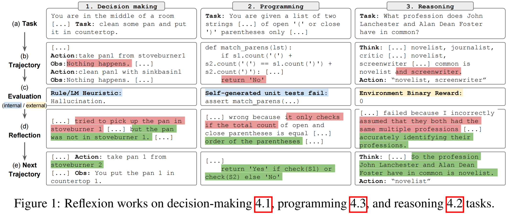

**图1** 直观展示了 Reflexion 框架在三类截然不同任务上的统一应用：
- **决策任务（左列）**: Agent 在房间中寻找物品并操作，因幻觉（hallucination）导致拾取不存在的物品，反思后修正行动计划；
- **编程任务（中列）**: Agent 根据自然语言描述生成括号匹配函数，自生成单元测试失败后，反思发现仅检查数量而非顺序的错误，进而修复实现；
- **推理任务（右列）**: Agent 回答知识密集型问题，因错误假设两位作者职业相同而答错，反思后准确识别共同职业。

### 2.3 生成有效反思的挑战与三种反馈机制

生成有用的反思性反馈并非易事，它需要：
1. **准确理解模型在何处犯错**——即强化学习中的**信用分配问题**（credit assignment problem [25]）；
2. **生成包含可操作改进洞见的摘要**。

论文探索了三种生成反馈的方式：

| 机制 | 描述 | 适用任务 |
|------|------|---------|
| **简单二元环境反馈** | 环境直接提供成功/失败信号 | 推理任务（EM评分） |
| **预定义启发式** | 针对常见失败模式的手写规则 | 决策任务（循环检测、步数限制） |
| **自我评估** | LLM 自身进行二元分类或自写单元测试 | 决策任务（LLM分类）、编程任务（单元测试） |

在所有实现中，评估信号都被**"放大"**（amplified）为可存入长期记忆的自然语言经验摘要。

### 2.4 Reflexion 相较于传统 RL 的优势与劣势

**优势**:
1. **轻量性**: 不需要微调 LLM，仅需通过提示工程（prompting）注入反馈；
2. **反馈丰富性**: 支持更细致的反馈形式（如针对性动作修改），相比难以精确信用分配的标量或向量奖励；
3. **可解释的记忆**: 提供了更明确、可解释的先验经验情节记忆形式；
4. **明确的行动提示**: 为未来试验中的动作提供了更明确的提示。

**劣势**:
1. 依赖 LLM 的自评估能力（或启发式函数的质量）；
2. 没有形式化的成功保证。

论文指出，**随着 LLM 能力的提升，这一范式预计会越来越好**。

### 2.5 实验概览与贡献声明

论文在三类任务上进行了实验：
1. **决策任务**: 测试长轨迹上的序列动作选择；
2. **推理任务**: 测试知识密集型单步生成改进；
3. **编程任务**: 测试智能体有效使用编译器和解释器的能力。

**定量改进**:
- ALFWorld 决策任务: **+22%**（12次迭代学习步骤）
- HotPotQA 推理任务: **+20%**
- HumanEval 编程任务: **+11%**（绝对值）

**本文贡献**:
1. 提出 Reflexion，一种"语言"强化学习新范式，将策略参数化为智能体的记忆编码与 LLM 参数选择的组合；
2. 探索并实证证明 LLM 中自我反思的涌现能力在少量试验中学习复杂任务的极端有效性；
3. 引入 LeetcodeHardGym，一个包含40道 LeetCode Hard 难度编程题的代码生成 RL gym 环境，支持19种编程语言；
4. 在多个任务上展示 Reflexion 超越强基线并在各类代码生成基准上达到最先进水平。

**→ 过渡**: Reflexion 的核心思想已清晰呈现——通过语言反馈而非权重更新来优化智能体。但这一想法并非凭空产生，它建立在一系列相关工作的基础之上。理解这些相关工作有助于我们更精确地定位 Reflexion 的创新之处。

---

## 三、相关工作（Related Work）：定位创新

### 3.1 推理与决策领域

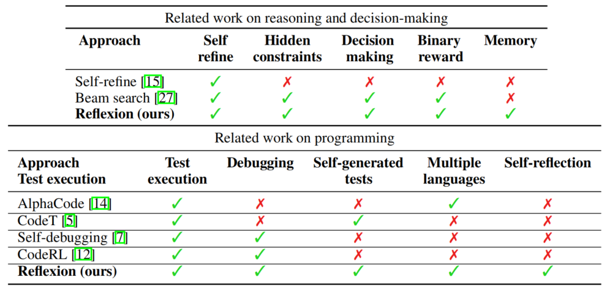

**Self-Refine** [15] 采用迭代框架通过自我评估自主改进生成，但其自我评估和自我改进步骤受限于给定的任务约束（如"如何以更积极的方式重写这段生成"）。Self-Refine 有效但**仅限于单步生成推理任务**。

Pryzant 等人 [21] 执行类似的语义提示优化，但同样**仅限于单步生成任务**。

Paul 等人 [20] 微调批评模型（critic models）以在轨迹内提供中间反馈来改进推理响应。

Xie 等人 [27] 使用随机束搜索（stochastic beam search）执行更高效的决策搜索策略，使智能体能够利用其自我评估组件带来的预见优势。

Yoran 等人 [31] 和 Nair 等人 [16] 使用决策模型在多代之间进行推理。

Kim 等人 [10] 在固定步数上使用重试模式，但没有评估步骤。

Goodman [9] 执行定性评估步骤，提出对前一代的优化建议。

**Reflexion 的关键区分点**: 上述概念可通过自我反思得到增强，以构建持久的自我反思经验记忆，使智能体能够识别自身错误并自我建议从错误中学习的教训。

### 3.2 编程领域

**AlphaCode** [14] 在一组隐藏测试用例上评估生成结果。它有效修复较简单的程序 bug，但**依赖于 ground truth 测试用例**，这使 pass@1 资格失效，且不使用自我反思来弥合错误识别与实现改进之间的差距。

**CodeT** [5] 使用自生成单元测试对生成的函数实现进行评分。它**不访问隐藏测试用例**，但也不实现自我改进步骤来改进代码编写。

**Self-Debugging** [7] 利用调试组件根据代码执行环境的反馈改进现有实现。它有效但**不使用自我反思**。

**CodeRL** [12] 将问题设定在 RL 框架中，使用 actor-critic 设置来调试程序。它**依赖于 ground truth 测试用例**。

**Reflexion 的关键区分点**: Reflexion 是唯一同时支持测试执行、调试、自我生成测试、多语言和自反思的方法。

**→ 过渡**: 相关工作明确了 Reflexion 的独特定位——它是第一个将自我反思与持久记忆结合，形成完整"试验-错误-反思-再试验"闭环的框架。那么，这个框架具体是如何构成的？每个组件的数学定义和工程实现是什么？下一部分将深入解析 Reflexion 的方法论。

---

# 第二部分：方法

## 四、Reflexion：通过语言反思实现强化

Reflexion 采用模块化设计，利用三个不同的模型协同工作。在详细阐述各组件之前，先给出整体框架的形式化定义。

### 4.1 总体框架与形式化定义

#### 4.1.1 三模块架构

Reflexion 框架由以下三个核心组件构成：

| 组件 | 符号 | 功能描述 |
|------|------|---------|
| **Actor** | $M_a$ | 基于 LLM，根据状态观测生成文本与动作 |
| **Evaluator** | $M_e$ | 评估 Actor 的输出，计算奖励分数 |
| **Self-Reflection** | $M_{sr}$ | 生成语言形式的强化线索，辅助 Actor 自我改进 |

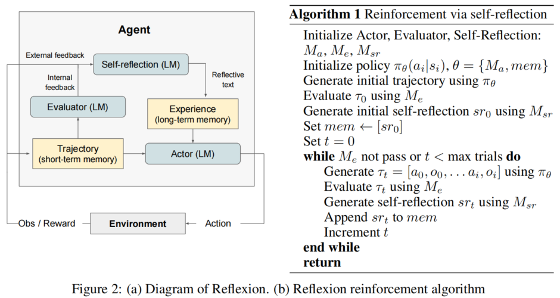

**图2(a)** 展示了三个组件之间的信息流：
- Actor 与环境交互产生"轨迹"（Trajectory，短期记忆）；
- Evaluator 接收外部/内部反馈对轨迹进行评分，输出标量奖励；
- Self-Reflection 模型将评估信号"放大"为自然语言经验摘要，存入"经验"（Experience，长期记忆）；
- Actor 在下一轮决策中同时条件于短期轨迹与长期经验。

#### 4.1.2 策略的形式化定义

Reflexion 将策略参数化为一个条件概率分布：

$$\pi_\theta(a_i \mid s_i), \quad \theta = \{M_a, \text{mem}\}$$

**符号完备性说明**:

| 符号 | 含义 | 空间/类型 |
|------|------|----------|
| $\pi_\theta$ | 参数化策略 | 映射 $\mathcal{S} \times \mathcal{H} \to \mathcal{P}(\mathcal{A})$ |
| $a_i \in \mathcal{A}$ | 第 $i$ 步的动作 | 动作空间（文本/API 调用/决策动作） |
| $s_i \in \mathcal{S}$ | 第 $i$ 步的状态观测 | 状态空间（环境返回的文本观测） |
| $\theta$ | 策略参数 | 元组 $\{M_a, \text{mem}\}$ |
| $M_a$ | Actor 模型（LLM） | 预训练语言模型（如 GPT-3.5/GPT-4） |
| $\text{mem}$ | 长期记忆（反思经验序列） | 文本序列列表 $[sr_0, sr_1, \ldots, sr_{t-1}]$ |

与传统 RL 的关键区别在于：**策略参数 $\theta$ 不包含可学习的神经网络权重**，而是由一个固定的预训练模型 $M_a$ 和一个可更新的自然语言记忆 $\text{mem}$ 组成。"学习"过程不是通过梯度下降更新权重，而是通过向 $\text{mem}$ 中追加新的反思经验来实现。

#### 4.1.3 轨迹与奖励的形式化定义

**轨迹**（Trajectory）定义为智能体与环境交互的动作-观测序列：

$$\tau_t = [a_0, o_0, a_1, o_1, \ldots, a_i, o_i]$$

其中 $a_k \in \mathcal{A}$ 为第 $k$ 步的动作（文本生成、API 调用或决策动作），$o_k \in \mathcal{O}$ 为环境返回的观测（observation），$i \in \mathbb{N}$ 为轨迹长度（因任务而异）。下标 $t \in \mathbb{N}_0$ 表示试验轮次索引。

**标量奖励**由 Evaluator 模型计算：

$$r_t = M_e(\tau_t)$$

其中 $r_t \in \mathbb{R}$ 为第 $t$ 次试验的标量奖励（实践中通常为二元值 $\{0, 1\}$ 或有界标量），$M_e$ 为 Evaluator 模型。

#### 4.1.4 自我反思的形式化定义

自我反思是 Reflexion 的核心创新，它将稀疏的标量反馈"放大"为丰富的自然语言经验摘要：

$$sr_t = M_{sr}(\tau_t, r_t, \text{mem})$$

其中 $sr_t$ 为第 $t$ 次试验的自我反思文本（自由格式自然语言），$M_{sr}$ 为 Self-Reflection 模型（实例化为 LLM），$\tau_t$ 为当前轨迹，$r_t$ 为标量奖励，$\text{mem}$ 为历史反思记忆。

#### 4.1.5 记忆更新机制

每次试验后，记忆按以下规则更新：

$$\text{mem} \leftarrow \text{mem} \oplus [sr_t], \quad |\text{mem}| \leq \Omega$$

其中 $\oplus$ 表示序列追加操作，$\Omega \in \{1, 2, 3\}$ 为最大记忆容量（由 LLM 最大上下文长度限制决定），$|\text{mem}|$ 表示当前记忆中的经验数量。当记忆容量超过 $\Omega$ 时，采用滑动窗口机制丢弃最早的经验。

**→ 过渡**: 以上形式化定义建立了 Reflexion 的数学基础。但形式化只是第一步——接下来需要理解每个组件在工程实践中是如何被实例化的，以及它们如何协同工作形成完整的迭代优化闭环。

---

### 4.2 算法流程：迭代优化闭环

Reflexion 被形式化为一个迭代优化过程，**图2(b)** 中的伪代码描述了完整算法：

**初始化阶段**:
1. 初始化 Actor $M_a$、Evaluator $M_e$、Self-Reflection $M_{sr}$
2. 初始化策略 $\pi_\theta(a_i \mid s_i)$，其中 $\theta = \{M_a, \text{mem}\}$
3. 使用 $\pi_\theta$ 生成初始轨迹 $\tau_0$
4. 用 $M_e$ 评估 $\tau_0$，得到 $r_0 = M_e(\tau_0)$
5. 用 $M_{sr}$ 生成初始自我反思 $sr_0$，存入记忆 $\text{mem} \leftarrow [sr_0]$

**迭代循环**（设试验轮次 $t = 0, 1, 2, \ldots$，最大试验次数为 $T_{\max}$）:

```
while M_e(τ_t) 未通过 且 t < T_max do:
    1. 生成轨迹:   τ_t = [a_0, o_0, ..., a_i, o_i]  使用 π_θ
    2. 评估:       r_t = M_e(τ_t)
    3. 自我反思:   sr_t = M_sr(τ_t, r_t, mem)
    4. 记忆更新:   mem ← mem ⊕ [sr_t]  (保持 |mem| ≤ Ω)
    5. 轮次递增:   t ← t + 1
end while
return τ_t
```

**关键设计决策**:
- **提前终止**: 若 Evaluator 判定 $\tau_t$ 正确（如单元测试全部通过或任务完成），则立即终止循环；
- **记忆容量限制**: $\Omega$ 通常取 1–3，以遵守 LLM 最大上下文长度限制；
- **无权重更新**: 整个过程中 $M_a$、$M_e$、$M_{sr}$ 的权重均保持不变。

**→ 过渡**: 算法流程描绘了 Reflexion 的"骨架"，但每个组件的内部工作原理尚未揭示。接下来，我们将逐一深入解析 Actor、Evaluator、Self-Reflection 和 Memory 四个核心组件。

---

### 4.3 Actor 组件（$M_a$）

#### 4.3.1 形式化定义与功能

Actor 建立在大型语言模型之上，通过提示工程（prompting）使其基于状态观测生成必要的文本与动作。类比传统基于策略的强化学习设定，Actor 在时刻 $t$ 从当前策略 $\pi_\theta$ 中采样动作 $a_t$，并从环境接收观测 $o_t$。

Actor 的核心功能是将**任务指令**、**历史轨迹**（短期记忆）和**反思经验**（长期记忆）融合为一个提示文本 $p$，然后调用 LLM 生成下一动作：

$$a_t \sim M_a(\, \cdot \mid p = [\text{task\_instruction}, \tau_{t-1}, \text{mem}] \,)$$

#### 4.3.2 工程变形：提示模板与策略变体

论文探索了多种 Actor 模型变体作为底层生成策略：

| Actor 变体 | 描述 | 适用场景 |
|-----------|------|---------|
| **Chain-of-Thought (CoT)** [26] | 通过"逐步思考"提示实现逐步推理 | 单步推理任务（HotPotQA） |
| **ReAct** [30] | 将推理（Reasoning）与动作（Acting）交错进行 | 长轨迹决策任务（ALFWorld） |

在编程任务中，Actor 通过不同的指令模板区分首次实现与反思后的改进实现。以 Python 编程为例（代码实现见 `programming_runs/generators/py_generate.py` 第 17–50 行）:

- **首次实现指令** (`PY_SIMPLE_COMPLETION_INSTRUCTION`): `"# Write the body of this function only."`
- **反思后改进指令** (`PY_REFLEXION_COMPLETION_INSTRUCTION`): 包含过去实现、单元测试结果和修改提示的完整上下文

**代码检索结果**: 在 `programming_runs/generators/py_generate.py` 的 `PyGenerator.func_impl()` 方法中（约第 210–260 行），策略参数 `strategy` 取 `"simple"` 或 `"reflexion"`，分别对应首次实现和反思后改进的提示构建逻辑。该方法调用 `generic_generate_func_impl()` 函数，根据策略选择不同的指令模板和少样本示例。

> **代码链接**: `https://github.com/SparkJiao/reflexion/blob/main/programming_runs/generators/py_generate.py#L210-L260`

#### 4.3.3 符号释义

| 符号 | 含义 | 约束 |
|------|------|------|
| $p$ | 构建的提示文本 | 拼接字符串/令牌序列 |
| $\text{task\_instruction}$ | 任务描述（如函数签名+文档字符串） | 由数据集提供 |
| $\tau_{t-1}$ | 上一轮试验的完整轨迹 | 短期记忆，含动作-观测序列 |
| $\text{mem}$ | 反思经验列表 $[sr_0, \ldots, sr_{t-1}]$ | 长期记忆，容量上限 $\Omega$ |
| $a_t$ | 第 $t$ 步生成的动作/文本 | LLM 解码输出 |

**→ 过渡**: Actor 负责"执行动作"，但它需要一个"评判者"来告诉自己动作的好坏。这就是 Evaluator 组件的作用。

---

### 4.4 Evaluator 组件（$M_e$）

#### 4.4.1 形式化定义与功能

Evaluator 的核心功能是评估 Actor 生成输出的质量，形式化为：

$$r_t = M_e(\tau_t)$$

其中 $r_t \in \mathbb{R}$ 为反映轨迹在给定任务上下文中性能的奖励分数。由于为语义空间定义有效的价值函数和奖励函数具有挑战性，论文探索了 Evaluator 的多种变体。

#### 4.4.2 工程变形：Evaluator 的三种实现

| 任务类型 | 评估方式 | 数学形式 | 说明 |
|---------|---------|---------|------|
| 推理任务 | 精确匹配评分 (Exact Match, EM) | $r_t = \mathbb{1}[A_t = A^*]$ | 检查生成答案 $A_t$ 是否与参考答案 $A^*$ 完全一致 |
| 决策任务 | 预定义启发式函数 | $r_t = h(\tau_t)$ | 针对特定评估标准定制的规则函数 |
| 通用 | LLM 自身作为 Evaluator | $r_t = M_{\text{LLM}}(\tau_t)$ | 用另一个 LLM 实例为决策与编程任务生成奖励 |

在 ALFWorld 决策任务中，论文实现了两种自我评估技术：
1. **LLM 自然语言分类**: 用 LLM 对任务完成状态进行二元分类；
2. **手写启发式**: 若智能体连续 3 次执行相同动作并收到相同响应，或当前环境动作数超过 30（低效规划），则判定为失败并触发自我反思。

#### 4.4.3 符号释义

| 符号 | 含义 | 约束 |
|------|------|------|
| $r_t$ | 第 $t$ 次试验的标量奖励 | 通常为 $\{0, 1\}$ 或有界标量 |
| $M_e$ | Evaluator 模型 | 可以是 LLM、启发式函数或字符串比较 |
| $\mathbb{1}[\cdot]$ | 指示函数 | 条件为真时取 1，否则取 0 |
| $A_t$ | 第 $t$ 次试验生成的答案 | 文本字符串 |
| $A^*$ | 参考答案（ground truth） | 文本字符串 |
| $h(\cdot)$ | 启发式评估函数 | 人工设计的规则函数 |

**→ 过渡**: Evaluator 提供了"对与错"的信号，但这个信号通常是稀疏的（如二元值）。如何将这些稀疏信号转化为智能体可以理解和利用的改进方向？这正是 Self-Reflection 组件的核心使命。

---

### 4.5 Self-Reflection 组件（$M_{sr}$）

#### 4.5.1 形式化定义：信息放大机制

Self-Reflection 是 Reflexion 框架的核心创新。给定稀疏的奖励信号（如二元成功/失败状态）、当前轨迹 $\tau_t$ 及其持久记忆 $\text{mem}$，该模型生成细致且具体的语言反馈：

$$sr_t = M_{sr}(\tau_t, r_t, \text{mem})$$

这一操作本质上是一个**信息放大**（information amplification）过程：将低维的标量信号 $r_t \in \{0, 1\}$ 转化为高维的自然语言信号 $sr_t \in \mathcal{V}^*$（$\mathcal{V}$ 为词表），编码了"哪里错了、为什么错、如何修正"的结构化信息。

#### 4.5.2 工程变形：提示模板与少样本学习

Self-Reflection 的具体实现通过精心设计的提示工程完成。以 Python 编程任务为例（代码实现见 `programming_runs/generators/py_generate.py` 第 55–78 行）:

- **自我反思指令** (`PY_SELF_REFLECTION_COMPLETION_INSTRUCTION`): `"You are a Python writing assistant... Your goal is to write a few sentences to explain why your implementation is wrong as indicated by the tests."`

- **少样本示例** (`PY_SELF_REFLECTION_FEW_SHOT`): 包含完整的 [函数实现] → [单元测试结果] → [反思文本] 示例，教 LLM 如何生成有效的反思。

一个典型的 $sr_t$ 输出格式为：
```
The implementation failed the test cases where the input list is empty. 
The issue arises because the code does not handle the case where there 
are no words to process. To fix this, we should add a condition at the 
beginning of the function to check if the input list is empty, and 
return an empty list if it is.
```

**代码检索结果**: 在 `programming_runs/generators/py_generate.py` 的 `PyGenerator.self_reflection()` 方法中（约第 270–310 行），该方法调用 `generic_generate_self_reflection()` 函数，将当前实现、测试反馈和少样本示例拼接为提示，调用 LLM 生成反思文本。

> **代码链接**: `https://github.com/SparkJiao/reflexion/blob/main/programming_runs/generators/py_generate.py#L270-L310`

#### 4.5.3 关键机制：信用分配的语言化

在多步决策任务中，当智能体接收到失败信号时，$M_{sr}$ 可以推断出特定动作 $a_i$ 导致了后续的错误动作 $a_{i+1}$ 和 $a_{i+2}$。随后智能体可以用自然语言陈述"本应采取不同动作 $a'_i$"，并将这一经验存入记忆。在后续试验中，智能体可以利用过往经验在时刻 $t$ 选择动作 $a'_i$。

这种"将信用分配问题转化为语言描述问题"的思路，绕过了传统 RL 中需要通过大量样本估计值函数的困难步骤。

**→ 过渡**: Self-Reflection 生成了宝贵的改进经验，但这些经验需要一个地方来存储和积累——这就是 Memory 组件的职责。

---

### 4.6 Memory 组件

#### 4.6.1 形式化定义：双记忆系统

Reflexion 的记忆系统包含两个互补的组件：

**短期记忆（Short-term memory）**: 轨迹历史 $\tau_t = [a_0, o_0, \ldots, a_i, o_i]$，即在当前试验中智能体执行的动作序列与观测序列。类比人类对近期细节的记忆。

**长期记忆（Long-term memory）**: Self-Reflection 模型的输出序列 $[sr_0, sr_1, \ldots, sr_t]$，即自然语言形式的反思经验。类比人类从过往经历中提炼的重要教训。

#### 4.6.2 工程变形：滑动窗口与上下文管理

在工程实现中，两个记忆组件的协作方式如下：

```python
# 来自 programming_runs/reflexion.py 的核心逻辑（第 42-48 行）
reflections = []      # 长期记忆：存储自我反思文本
implementations = []  # 历史实现记录
test_feedback = []    # 测试反馈记录

while cur_iter < max_iters:
    # 生成自我反思
    reflection = gen.self_reflection(cur_func_impl, cur_feedback, model)
    reflections += [reflection]  # 追加到长期记忆
    
    # 使用长期记忆生成下一版实现
    cur_func_impl = gen.func_impl(
        func_sig=item["prompt"],
        model=model,
        strategy="reflexion",
        prev_func_impl=cur_func_impl,  # 短期记忆：上一轮实现
        feedback=cur_feedback,          # 短期记忆：测试反馈
        self_reflection=reflection,     # 长期记忆：反思文本
    )
```

> **代码链接**: `https://github.com/SparkJiao/reflexion/blob/main/programming_runs/reflexion.py#L42-L90`

**关键约束**: 由于 LLM 存在最大上下文长度限制，记忆 $\text{mem}$ 通常被限制为最多存储 $\Omega \in \{1, 2, 3\}$ 条反思经验，超出时采用滑动窗口丢弃最早的经验。

#### 4.6.3 符号释义

| 符号 | 含义 | 约束 |
|------|------|------|
| $\Omega$ | 最大记忆容量 | 正整数，通常取 $\{1, 2, 3\}$ |
| $\text{mem}$ | 长期记忆（反思经验列表） | 文本字符串列表，$|\text{mem}| \leq \Omega$ |
| $\tau_t$ | 短期记忆（当前轨迹） | 动作-观测交替序列 |

**→ 过渡**: 至此，Reflexion 的方法框架已完整呈现——从形式化定义到工程实现的每个细节都已阐明。但这个框架是否真的有效？它在不同任务上的表现如何？接下来进入实验验证部分，用数据说话。

---

### 4.7 【我的思考】Reflexion 方法设计的系统可行性与第一性原理

> **【我的思考】**（以下内容为基于论文的延伸分析，非论文原文）
>
> **系统可行性（为什么能跑）**
>
> 从系统角度，Reflexion 的轻量性体现在三个维度：
> - **计算复杂度**: 每次试验仅需 3 次 LLM 调用（Actor + Evaluator + Self-Reflection），总复杂度为 $O(T \cdot C_{\text{LLM}})$，其中 $T$ 为试验轮数（通常 $T \leq 12$），$C_{\text{LLM}}$ 为单次推理成本。相比之下，传统 RL 需要 $O(N \cdot T_{\text{train}})$ 次梯度更新（$N$ 通常为 $10^4$–$10^6$）；
> - **存储开销**: 长期记忆仅需存储文本字符串，每条经验约 50–200 个 token，远低于存储梯度或值函数所需的空间（传统 RL 的值函数需要 $O(|\mathcal{S}| \cdot d)$ 或 $O(|\mathcal{S}| \cdot |\mathcal{A}|)$ 的存储）；
> - **可扩展性**: 由于不修改模型权重，Reflexion 可无缝应用于任何可通过 API 访问的 LLM（GPT-3.5/GPT-4/Claude 等），无需模型托管或训练基础设施。
>
> **第一性原理（为什么必须这样）**
>
> 从**信息论**视角看，Reflexion 的信息放大机制具有理论必然性。环境提供的标量反馈 $r_t \in \{0, 1\}$ 的信道容量仅为 1 bit（二元信道容量 $C = \log_2 2 = 1$ bit）。在一个 100 步的决策轨迹中，1 bit 的信息量远远不足以完成信用分配——需要确定 100 个动作中哪些是"好的"、哪些是"坏的"。根据**信道容量定理**（Shannon, 1948），要将信用分配信息可靠地传递给 Actor，必须增加信道的信息容量。Reflexion 将 1 bit 的稀疏信号"放大"为数百 token 的自然语言描述，实质上是通过增加消息长度来提高总信息传输量，使得"哪个动作错了、为什么错、应该如何修正"等结构化信息得以编码和传递。
>
> 从**贝叶斯推理**视角看，$M_{sr}$ 实质上在执行后验推断：给定观测到的失败轨迹 $\tau_t$ 和奖励 $r_t = 0$，推断最可能的错误假设 $\hat{h} = \arg\max_h P(h \mid \tau_t, r_t = 0)$，并基于该假设生成修正策略。LLM 的预训练知识充当了先验分布 $P(h)$，使得这一推断在极少样本（$T \leq 12$）条件下就能有效进行——而传统无模型 RL 缺乏这样的先验，需要大量交互来估计值函数。

---

# 第三部分：实验验证

## 五、实验总览

论文在三类不同任务上评估了 Reflexion，覆盖了智能体能力的三个核心维度：

| 任务类别 | 基准测试 | 核心能力 | 改进幅度 |
|---------|---------|---------|---------|
| 序列决策 | ALFWorld [24] | 长轨迹动作选择 | **+22%** |
| 语言推理 | HotPotQA [28] | 知识密集型单步推理 | **+20%** |
| 代码生成 | HumanEval [6], MBPP [2], LeetcodeHardGym | 有效使用编译器/解释器 | **+11%** |

**→ 过渡**: 实验结果表明 Reflexion 在三个领域都取得了显著改进。让我们从决策任务开始，逐一深入分析每个实验的设置、结果和洞见。

---

## 六、序列决策任务：ALFWorld

### 6.1 实验设置

#### 6.1.1 任务环境

ALFWorld [24] 是一组基于 TextWorld [8] 的文本环境，要求智能体在多步交互中完成家庭环境中的任务。具体包括：
- **寻找隐藏物品**: 如在抽屉中寻找锅铲（"find a spatula in a drawer"）
- **移动物品**: 如将刀移至砧板（"move a knife to the cutting board"）
- **使用物品操作其他物品**: 如将番茄放入冰箱冷藏（"chill a tomato in the fridge"）

#### 6.1.2 Agent 配置

实验在 134 个 ALFWorld 环境上进行，涵盖 6 种不同任务类型。Agent 采用 **ReAct [30]** 作为动作生成器（Actor），因为 Yao 等人 [30] 已证明 ReAct 在使用显式中间思考的长轨迹决策中表现优异。

**自我评估技术**（Evaluator 的两种实现）:
1. **LLM 自然语言分类**: 用 LLM 对任务完成状态进行二元分类（标记为 GPT）
2. **手写启发式**（标记为 Heuristic）:
   - 若智能体连续 3 次执行相同动作并收到相同响应 → 判定为"幻觉"
   - 若当前环境动作数超过 30 → 判定为"低效规划"

**基线对比**:
- 基线运行：若建议自我反思则**跳过反思过程**，重置环境并开始新试验
- Reflexion 运行：智能体使用自我反思找出错误、更新记忆、重置环境并开始新试验

**记忆配置**: 记忆截断为最近 3 条自我反思（$\Omega = 3$）。

**提示设置**: 为避免语法错误，提供两个特定领域的少样本轨迹；使用 GPT-3 作为底层 LLM。

### 6.2 实验结果

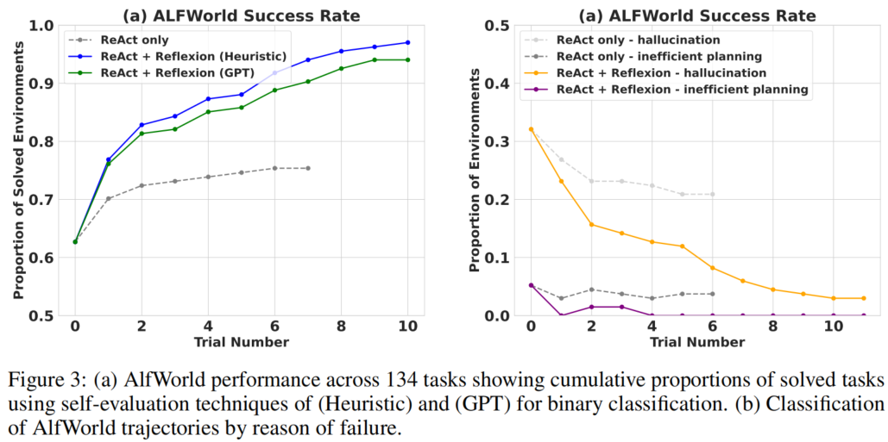

**图3(a)** 显示了 134 个任务上的累积解决比例随试验轮次的变化：

| 方法 | 12 次试验后完成的任务数 | 相对基线提升 |
|------|----------------------|-------------|
| ReAct only | ~104 / 134 (78%) | 基线 |
| ReAct + Reflexion (Heuristic) | **130 / 134 (97%)** | **+22%** |
| ReAct + Reflexion (GPT) | ~128 / 134 (96%) | **+19%** |

**关键发现**:
- ReAct + Reflexion (Heuristic) 在 12 次连续试验中学习解决额外任务，接近完美表现
- ReAct-only 的性能在第 6–7 次试验之间**停止增长**，陷入平台期

**图3(b)** 展示了失败轨迹的分类分析：

| 失败类型 | ReAct only（Trial 10） | ReAct + Reflexion（Trial 10） |
|---------|----------------------|---------------------------|
| 幻觉（Hallucination） | ~22% | **~0%** |
| 低效规划（Inefficient planning） | ~5% | **~0%** |

- ReAct-only Agent 收敛于 22% 的幻觉率且无长期恢复迹象
- Reflexion 几乎完全消除了幻觉和低效规划两类错误

### 6.3 结果分析

#### 6.3.1 常见失败模式与 Reflexion 的修复机制

基线失败轨迹中的常见错误是：智能体认为自己拥有某物品，但实际上并未持有。智能体在长轨迹中继续执行多个动作，却无法回溯找到错误根源。

Reflexion 通过将长失败轨迹**蒸馏**为可用作"自我提示"（self-hints）的相关经验来消除绝大部分此类错误。长期记忆在 ALFWorld 中有两种主要帮助方式：

1. **早期错误识别**: 在长轨迹中定位早期错误，智能体可建议新的动作选择甚至新的长期计划；
2. **系统性搜索**: 当房间中有过多表面/容器需要检查时，智能体可利用多轮试验的经验记忆来彻底搜索房间。

#### 6.3.2 学习曲线解读

学习曲线表明学习过程发生在若干经验积累之后——智能体成功平衡了上述两种情况：在前两次试验之间出现即时跃升（反映了早期错误识别能力的快速习得），随后 11 次试验中稳步增长至接近完美的表现（反映了系统性搜索策略的渐进优化）。

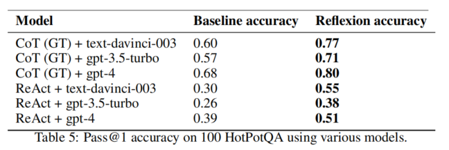

**图5**展示了一个具体的 ALFWorld 轨迹示例。Trial #1 中 Agent 因低效规划而失败（先找杯子再找台灯，而非按任务要求"用台灯检查杯子"）。在反思中，Agent 识别出应先寻找台灯再寻找杯子。Trial #2 中 Agent 成功修正推理路径并以简洁方式执行动作序列，最终成功完成任务。

**→ 过渡**: ALFWorld 实验证明了 Reflexion 在长轨迹决策任务中的有效性。但 Reflexion 的能力不仅限于多步决策——它在单步推理任务上同样表现出色。接下来我们分析 HotPotQA 推理任务。

---

## 七、推理任务：HotPotQA

### 7.1 实验设置

#### 7.1.1 任务描述

HotPotQA [28] 是一个基于 Wikipedia 的数据集，包含 113K 问答对，要求 Agent **解析内容并在多个支撑文档上进行推理**。这是一个知识密集型的多跳推理（multi-hop reasoning）任务。

#### 7.1.2 Agent 配置

为隔离推理能力的改进效果，论文实现了 **Reflexion + Chain-of-Thought (CoT)** [26] 的三种配置：

| 配置 | 描述 | 目的 |
|------|------|------|
| CoT (no context) | $Q \to A$: 直接从问题生成答案 | 测试完整推理+检索能力 |
| CoT (GT context) | $Q, C_{gt} \to A$: 给定真实上下文生成答案 | **纯推理能力隔离** |
| ReAct | 结合推理与动作，使用 Wikipedia API 检索 | 测试整体问答能力 |

由于 CoT 不是多步决策技术，论文将真实上下文 $C_{gt}$ 提供给 Agent，以隔离在长文本上的推理行为。

**提示设置**:
- CoT 实现：6-shot prompting
- ReAct：2-shot prompting
- Self-reflection：2-shot prompting

**评估方式**: 使用精确匹配（EM）评分提供二元成功信号。每次试验后使用自我反思循环放大二元信号，记忆大小为 3 条经验（$\Omega = 3$）。

**终止条件**: 在 Reflexion 运行中，允许智能体收集经验并在失败任务上重试，直到连续 3 次失败。

### 7.2 实验结果

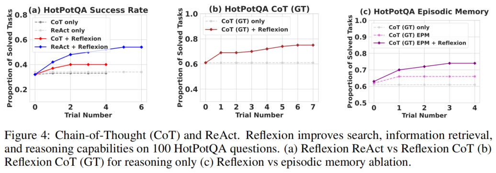

**图4(a)** 比较了 Reflexion 与 CoT 和 ReAct 的结合效果（100 个 HotPotQA 问题）：

| 方法 | 首次试验准确率 | 多次试验后 | 改进 |
|------|-------------|----------|------|
| CoT only | ~0.35 | ~0.35 | **无提升** |
| CoT + Reflexion | ~0.35 | **~0.55** | **+20%** |
| ReAct only | ~0.38 | ~0.38 | **无提升** |
| ReAct + Reflexion | ~0.38 | **~0.55** | **+17%** |

**关键发现**: ReAct-only、CoT-only 和 CoT(GT)-only 实现在多次试验中**未能概率性地改进任何任务**。这意味着在温度 0.7 设置下，基线方法仅通过重新采样无法解决首次试验中失败的任务——这凸显了 Reflexion 语言反馈的关键价值。

**图4(b)** 展示了 CoT(GT) 的推理专用改进（隔离推理能力）：
- CoT(GT) only: 首次试验准确率约 0.68，后续无提升
- CoT(GT) + Reflexion: 准确率提升至约 **0.80**（**绝对提升 12%**）

值得注意的是，CoT(GT) Agent 即使拥有真实上下文，仍有 39% 的问题无法正确推断答案，但 Reflexion 帮助 Agent 在**无真实答案访问权限**的情况下修正错误，将准确率提升约 14%。

### 7.3 消融实验：自我反思 vs 情景记忆

**图4(c)** 展示了关键的消融实验结果，用于隔离自我反思步骤的优势：

| 方法 | 描述 | 准确率 |
|------|------|--------|
| CoT (GT) only | 基线 | ~0.68 |
| CoT (GT) EPM | 仅加入情景记忆（最近轨迹，无反思文本） | ~0.73 (+5%) |
| CoT (GT) EPM + Reflexion | 情景记忆 + 完整自我反思 | **~0.80 (+12%)** |

实验设置：
- **EPM（Episodic Memory）**: 在提示中包含最近一次的完整轨迹，但不包含自我反思生成的语言解释
- **EPM + Reflexion**: 在 EPM 基础上加入标准自我反思步骤

**核心结论**: 自我反思较情景记忆学习优势带来了 **8% 的绝对提升**（从 0.73 到 0.80）。这一结果强有力地支持了"仅优化（refinement-only）方法不如自我反思引导的优化方法有效"的论点。**用语言写成的第一人称口头解释对于迭代学习至关重要**——Agent 通过自我解释来更好地识别错误并制定改进策略。

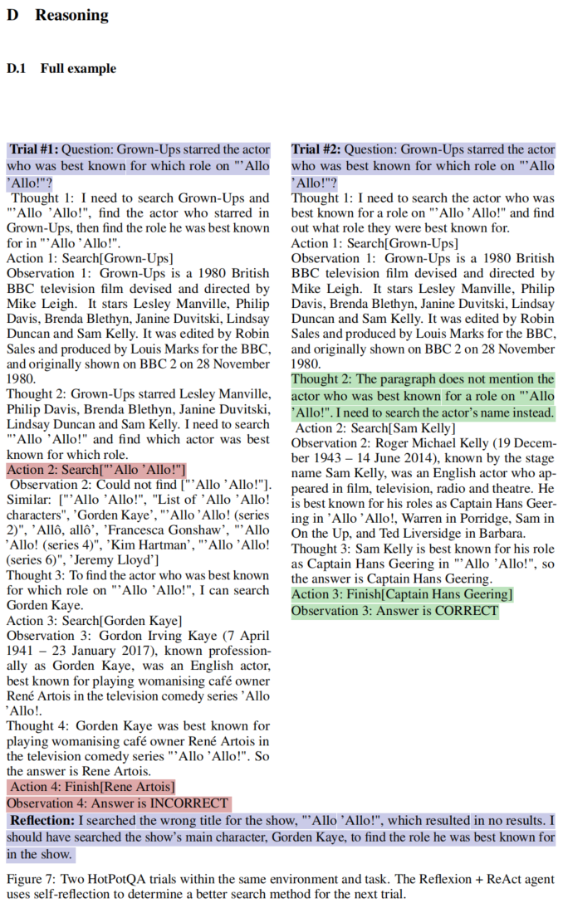

**图7**展示了一个 HotPotQA 的两试验示例。Trial #1 中 Agent 搜索了错误的查询 `"'Allo 'Allo!"` 导致无结果，反思后识别出应搜索该剧主角 Gorden Kaye 来找到其最知名的角色。Trial #2 中 Agent 成功修正搜索策略并给出正确答案 "Captain Hans Geering"。

**→ 过渡**: HotPotQA 实验证明了 Reflexion 在单步推理任务中的有效性，且消融实验揭示了自我反思文本（而非仅仅历史轨迹）是改进的关键。接下来，我们将分析 Reflexion 在编程任务上的表现——这是论文中取得最突出定量结果的领域。

---

## 八、编程任务

### 8.1 实验设置

#### 8.1.1 基准测试

论文在 Python 和 Rust 两种语言上评估了基线与 Reflexion 方法：

| 基准测试 | 语言 | 描述 | 评估指标 |
|---------|------|------|---------|
| HumanEval [6] | Python | 手写编程问题，评估函数体生成 | pass@1 |
| HumanEval-RS | Rust | 最难的 50 个 HumanEval Python 问题经 MultiPL-E [4] 翻译 | pass@1 |
| MBPP [2] | Python | Mostly Basic Python Programming | pass@1 |
| MBPP-RS | Rust | MBPP 子集经 MultiPL-E 翻译 | pass@1 |
| **LeetcodeHardGym (新)** | Python | 40 道 LeetCode Hard 难度题目，发布于 GPT-4 训练数据截止日期之后 | pass@1 |

LeetcodeHardGym 是本工作引入的新基准，其 40 道题目均发布于 2022 年 10 月 8 日之后（GPT-4 [18] 的训练数据截止日期），确保测试的是**泛化能力而非记忆能力**。

#### 8.1.2 自生成单元测试套件

编程任务为 Reflexion 提供了独特的自我评估机会：**自生成单元测试套件**。这使得 Reflexion 编程 Agent 符合 pass@1 准确率报告条件。

**测试套件生成流程**:

$$T = \{t_0, t_1, \ldots, t_n\}, \quad n \leq 6$$

1. 使用 Chain-of-Thought prompting [26] 生成多样化、全面的测试及其自然语言描述；
2. 通过尝试为每个候选测试构建有效的**抽象语法树**（Abstract Syntax Tree, AST）来过滤语法有效的测试语句；
3. 从生成的单元测试集合中采样 $n$ 个测试组成测试套件 $T$，$n$ 最大为 6。

Reflexion 编程 Agent 的学习循环与推理和决策 Agent 相同，最大记忆限制为 1 条经验（$\Omega = 1$）。

### 8.2 实验结果

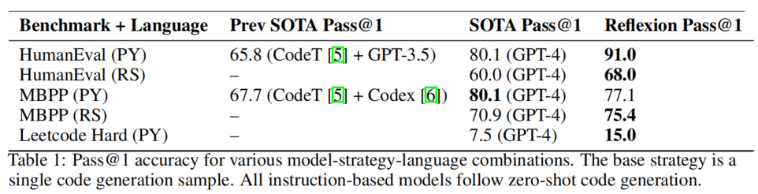

**表1**汇总了不同模型-策略-语言组合下的 Pass@1 准确率：

| 基准 + 语言 | 先前 SOTA Pass@1 | SOTA Pass@1 | Reflexion Pass@1 | 提升 |
|------------|-----------------|-------------|-----------------|------|
| HumanEval (PY) | 65.8 (CodeT+GPT-3.5) | 80.1 (GPT-4) | **91.0** | **+10.9%** |
| HumanEval (RS) | — | 60.0 (GPT-4) | **68.0** | **+8.0%** |
| MBPP (PY) | 67.7 (CodeT+Codex) | 80.1 (GPT-4) | 77.1 | -3.0% |
| MBPP (RS) | — | 70.9 (GPT-4) | **75.4** | **+4.5%** |
| LeetcodeHard (PY) | — | 7.5 (GPT-4) | **15.0** | **+7.5%** |

Reflexion 在 Python 和 Rust 的**所有基准测试上均超越了所有基线并设立了新的最先进水平，唯一例外是 MBPP Python**（77.1% vs GPT-4 的 80.1%）。

#### 8.2.1 MBPP Python 表现不佳的原因分析

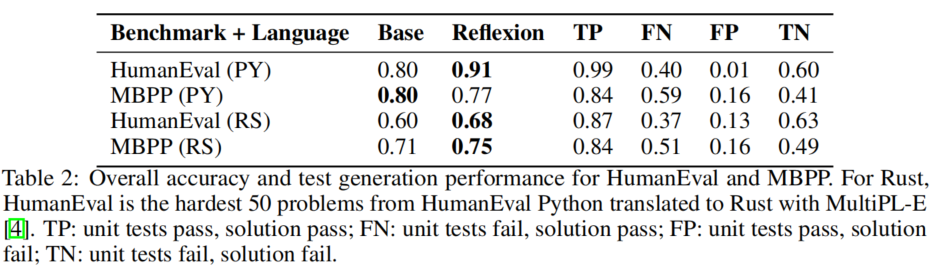

**表2**提供了超越 Pass@1 的详细分析，以四种条件呈现：

| 条件 | 定义 |
|------|------|
| TP（True Positive） | 单元测试通过，解决方案正确 |
| FN（False Negative） | 单元测试失败，解决方案正确 |
| FP（False Positive） | 单元测试通过，解决方案错误 |
| TN（True Negative） | 单元测试失败，解决方案错误 |

**关键发现**: HumanEval 和 MBPP Python 的基线 Pass@1 准确率相近（82% vs 80%），但 MBPP Python 的**误报（FP）测试执行率高达 16.3%**，而 HumanEval Python 仅为 1.4%。误报率高意味着单元测试通过但实际上解决方案错误，导致 Agent 过早报告无效提交。

在 Reflexion 的实现中，**假阴性（FN）优于假阳性（FP）**——Agent 可能通过自我反思识别不正确的测试并提示自己保持原始代码不变；但如果无效测试套件返回假阳性（所有内部测试通过但实现错误），Agent 将过早报告无效提交。

### 8.3 消融实验

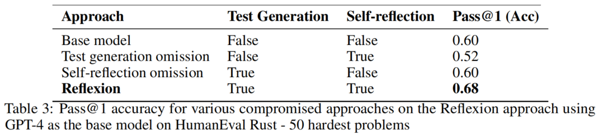

**表3**在 HumanEval Rust 最难的 50 个问题上测试了 Reflexion 复合方法的必要性：

| 方法 | 测试生成 | 自我反思 | Pass@1 (Acc) | 分析 |
|------|---------|---------|-------------|------|
| 基线模型 | False | False | 0.60 | 无辅助的单次生成 |
| 省略测试生成 | False | True | **0.52** | **低于基线**！无测试反馈，反思无从 anchored |
| 省略自我反思 | True | False | 0.60 | 有测试但无反思，与基线持平 |
| **Reflexion** | **True** | **True** | **0.68** | **测试+反思协同，+8%** |

**关键发现**:
1. **省略测试生成**（仅保留自我反思）导致准确率从 60% 降至 52%——Agent 无法在没有单元测试的情况下确定当前实现是否正确，盲目修改导致性能退化；
2. **省略自我反思**（仅保留测试生成）准确率与基线持平（60%）——测试能捕获语法和逻辑错误，但实现修复未能有效反映这些指示；
3. **完整 Reflexion**（测试生成 + 自我反思）达到 68%——两者协同产生超线性改进。

**核心结论**: **没有自我反思的盲目试错调试技术在编写 Rust 等复杂程序等更困难任务上是无效的**。测试提供"什么错了"的信号，反思提供"为什么错和如何修正"的洞见，两者缺一不可。

**→ 过渡**: 编程实验取得了最引人注目的定量结果（HumanEval 91% pass@1），消融实验也深入揭示了测试生成与自我反思的协同机制。但 Reflexion 并非万能——在某些任务上它也会失败。接下来我们分析其局限性。

---

# 第四部分：局限性与结论

## 九、局限性分析

### 9.1 固有局限

1. **局部最优陷阱**: Reflexion 本质上是使用自然语言进行策略优化的技术，仍可能陷入非最优的局部极小解；
2. **内存结构限制**: 当前长期记忆采用最大容量的滑动窗口（$\Omega \leq 3$），未来可扩展为向量嵌入数据库或传统 SQL 数据库等更先进的结构；
3. **测试驱动开发的约束**: 对于代码生成任务，存在许多实际限制：非确定性生成器函数、与 API 交互的纯函数（impure functions）、根据硬件规格变化输出的函数、调用并行或并发行为难以预测的函数；
4. **对 LLM 自评估能力的依赖**: Reflexion 的效果受限于 LLM 的自我评估能力（或启发式函数的质量），且没有形式化的成功保证。

### 9.2 WebShop 上的失败案例

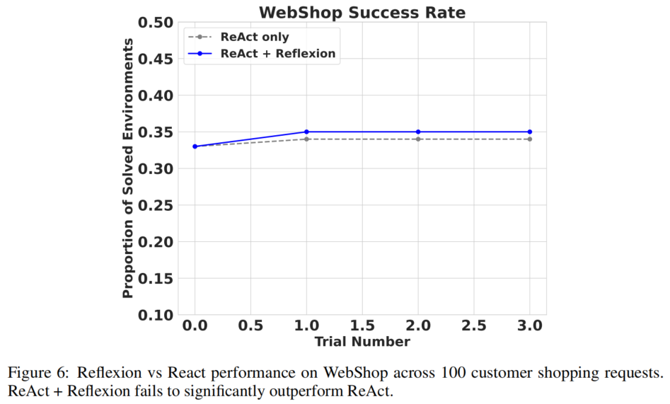

**图6**展示了 Reflexion 在 WebShop [29] 上的实验结果。WebShop 是一个基于 Web 的问题解决基准，测试智能体在电子商务网站上导航以定位和购买产品的能力。

实验在 100 个环境中测试了两轮 ReAct + Reflexion Agent。然而，仅经过 4 次试验后实验即终止——Agent 未显示出改善迹象，且在失败后未能生成有用的直观自我反思。

**失败原因分析**: WebShop 要求极高多样性和探索性的行为，而 Reflexion 难以应对。在 ALFWorld 中，Agent 能够充分探索新环境，因为可允许的动作可以在观测中看到；在 HotPotQA 中，Agent 面对类似的搜索查询任务但更为成功，因为 Wikipedia 文章的搜索空间更加多样且需要不那么精确的搜索查询。电子商务搜索引擎面临的共同问题是自然语言搜索解释中的歧义处理——WebShop 要求 Reflexion Agent 表现出非常多样化和独特的行为。

### 9.3 模型能力的涌现性影响

附录中的额外实验表明，自我纠正的能力是**更强、更大模型的涌现特性**。

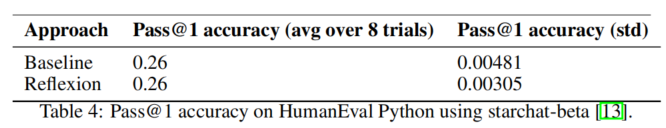

在 HumanEval Python 上使用 starchat-beta [13]（一个较小的代码模型）时，Reflexion 与基线的 Pass@1 准确率相同（0.26），标准差分别为 0.00305 和 0.00481——**较弱模型无法从自我反思中获益**。

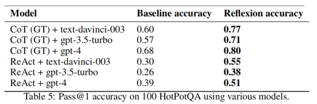

**表5**比较了不同模型在 100 个 HotPotQA 问题上的表现：

| 模型 | 基线准确率 | Reflexion 准确率 | 绝对提升 |
|------|----------|----------------|---------|
| CoT(GT) + text-davinci-003 | 0.60 | **0.77** | +0.17 |
| CoT(GT) + gpt-3.5-turbo | 0.57 | **0.71** | +0.14 |
| CoT(GT) + gpt-4 | 0.68 | **0.80** | +0.12 |
| ReAct + text-davinci-003 | 0.30 | **0.55** | +0.25 |
| ReAct + gpt-3.5-turbo | 0.26 | **0.38** | +0.12 |
| ReAct + gpt-4 | 0.39 | **0.51** | +0.12 |

规律总结：
- **所有模型**都能从 Reflexion 中获益（Reflexion 准确率始终高于基线）；
- **更强的模型**基线更高，Reflexion 带来的绝对提升可能略小，但最终准确率更高；
- **较弱的模型**（如 gpt-3.5-turbo + ReAct）基线低但 Reflexion 相对提升更大（+46% 相对提升），说明 Reflexion 对较弱模型的"补救"效果更明显。

**→ 过渡**: 局限性分析帮助我们理解了 Reflexion 的适用范围和边界条件。尽管存在这些限制，Reflexion 在三类任务上取得的显著改进仍然有力地证明了"语言强化学习"这一范式的价值。接下来进入结论部分，总结核心贡献并展望未来方向。

---

## 十、结论与未来方向

### 10.1 核心贡献总结

Reflexion 提出了一种全新的"语言强化学习"范式，其核心贡献可概括为四点：

1. **新范式**: 提出 Reflexion，一种"语言"强化学习范式，将策略参数化为智能体的记忆编码与 LLM 参数选择的组合。这是首个不更新模型权重、仅通过语言反馈实现策略优化的框架；
2. **自我反思的涌现特性**: 探索并实证证明 LLM 中自我反思的涌现能力在少量试验（$T \leq 12$）中学习复杂任务的极端有效性；
3. **新基准**: 引入 LeetcodeHardGym，一个包含 40 道 LeetCode Hard 难度编程题的代码生成 RL gym 环境，支持 19 种编程语言；
4. **全面超越基线**: 在多个任务上取得超越强基线的改进，并在各类代码生成基准上达到最先进水平。

### 10.2 关键定量结果汇总

| 任务 | 基准 | 基线 | Reflexion | 改进幅度 |
|------|------|------|----------|---------|
| 决策 | ALFWorld (134 envs) | 78% (ReAct) | **97%** | **+22%** |
| 推理 | HotPotQA (100 qs) | 68% (CoT+GT) | **80%** | **+12%** |
| 编程 | HumanEval Python | 80% (GPT-4) | **91%** | **+11%** |
| 编程 | HumanEval Rust | 60% (GPT-4) | **68%** | **+8%** |
| 编程 | MBPP Rust | 71% (GPT-4) | **75%** | **+4%** |
| 编程 | LeetcodeHard Python | 7.5% (GPT-4) | **15%** | **+100%** |

### 10.3 更广泛的影响

**正面影响**:
- **可解释性提升**: 传统 RL 的黑盒策略和优化设置使可解释性和对齐变得困难，而"语言"强化学习使自主 Agent 更加可解释和可诊断；
- **安全性监控**: 在工具使用场景中（可能过于复杂难以理解），可以监控自我反思以确保在使用工具之前的意图正确。

**风险与伦理考量**:
- 大型语言模型越来越多地用于与外部环境（互联网、软件、机器人等）和人类交互；
- 这项工作有强化和赋能这些 Agent 实现更大自动化和工作效率的潜力，但也会放大这些 Agent 被误用的风险；
- 这一研究方向需要更多安全和伦理方面的考量。

### 10.4 未来方向

1. **值学习**: 将 Reflexion 用于传统 RL 中已深入研究的更先进技术，如自然语言中的值学习（value learning in natural language）；
2. **离策略探索**: 引入离策略探索技术（off-policy exploration techniques）；
3. **高级记忆结构**: 使用向量嵌入数据库或传统 SQL 数据库存储和检索反思经验；
4. **更复杂的反馈信号**: 探索结构化的、层次化的反馈形式。

---

# 附录：核心公式速查表

| 编号 | 公式 | 含义 |
|------|------|------|
| (1) | $\pi_\theta(a_i \mid s_i), \theta = \{M_a, \text{mem}\}$ | 策略定义：Actor LLM + 反思记忆 |
| (2) | $\tau_t = [a_0, o_0, \ldots, a_i, o_i]$ | 轨迹：动作-观测交替序列 |
| (3) | $r_t = M_e(\tau_t)$ | 奖励：Evaluator 对轨迹的评分 |
| (4) | $sr_t = M_{sr}(\tau_t, r_t, \text{mem})$ | 自我反思：信息放大映射 |
| (5) | $\text{mem} \leftarrow \text{mem} \oplus [sr_t], \|\text{mem}\| \leq \Omega$ | 记忆更新：滑动窗口追加 |
| (6) | $T = \{t_0, t_1, \ldots, t_n\}, n \leq 6$ | 测试套件：最多6个单元测试 |

---

# 术语表

| 术语 | 英文 | 定义 |
|------|------|------|
| 大语言模型 | Large Language Model (LLM) | 基于 Transformer 架构、参数量巨大（通常 > 1B）的预训练语言模型 |
| 上下文学习 | In-context Learning | LLM 通过提示中的示例学习新任务，无需更新模型参数 |
| 信用分配问题 | Credit Assignment Problem | 在序列决策中确定哪个动作对最终结果的贡献（正面或负面）的困难 |
| 语义梯度 | Semantic Gradient | Reflexion 中将语言反馈类比为传统 RL 中梯度信号的概念 |
| 情节记忆 | Episodic Memory | 对特定事件/经历的记忆，在 Reflexion 中指存储的自我反思经验 |
| Pass@1 | Pass at 1 | 编程任务评估指标：单次生成通过所有测试的概率 |
| 精确匹配 | Exact Match (EM) | 评估指标：生成输出与参考答案的字符串完全匹配 |
| 抽象语法树 | Abstract Syntax Tree (AST) | 源代码的树形表示，用于语法分析 |
| 假阳性/假阴性 | False Positive / False Negative | 二元分类中的两种错误类型 |
| 少样本学习 | Few-shot Learning | 通过少量示例教会模型执行新任务 |

---

> **声明**: 本笔记严格基于论文原文（arXiv:2303.11366，NeurIPS 2023）提炼。所有实验数据、图表与结论均来自 Shinn 等人的原始论文。公式符号保持与原文一致。代码检索基于论文引用的 GitHub 仓库（原始仓库 `noahshinn024/reflexion` 当前不可访问，笔记中引用的是可用的镜像 `SparkJiao/reflexion`）。【我的思考】部分为基于论文的延伸分析，已明确标注。
