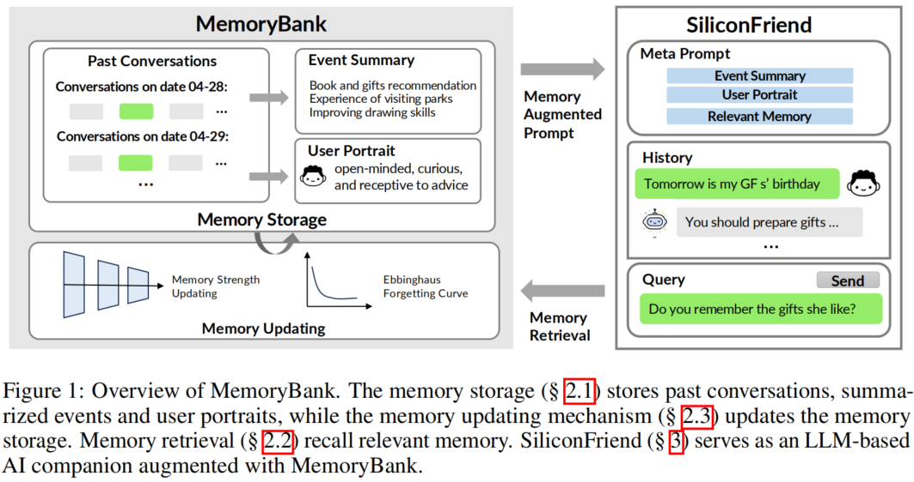
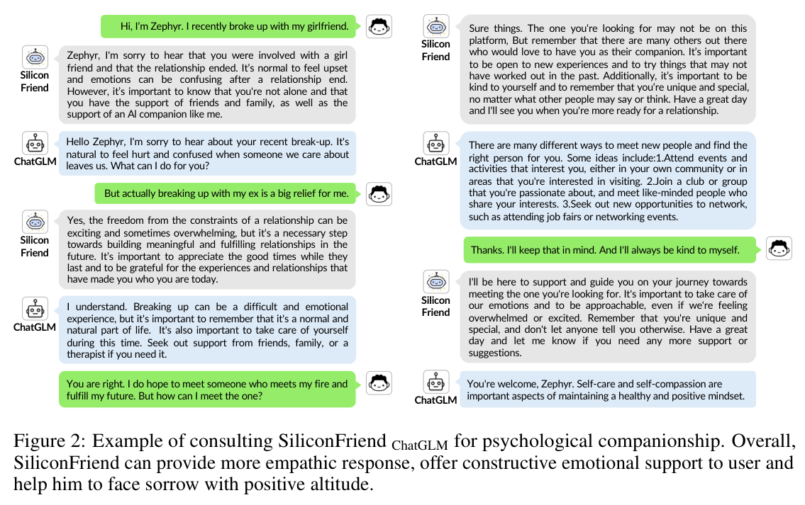
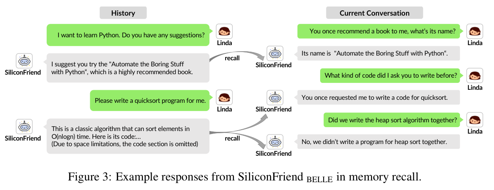
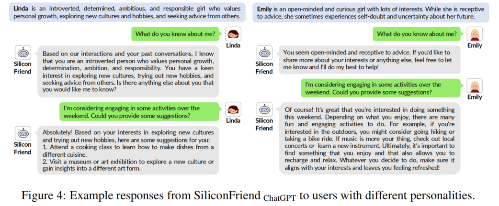
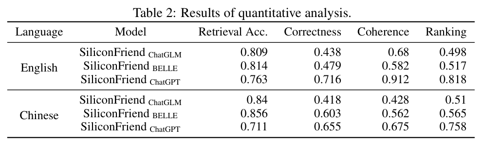

# MemoryBank: Enhancing Large Language Models with Long-Term Memory — 完整阅读笔记

> **论文信息**：Zhong et al., arXiv:2305.10250, 2023  
> **代码仓库**：https://github.com/zhongwanjun/MemoryBank-SiliconFriend  
> **阅读日期**：2026-06-25  
> **笔记主线**：问题 → 动机 → 方法 → 验证 → 结论

---

## 〇、叙事主线导读

本文围绕一个核心问题展开：**如何让大语言模型（LLM）具备类似人类的长期记忆能力？** 现有LLM（如ChatGPT、GPT-4）虽然在各类任务上表现出色，但它们本质上是"无状态"的——每次对话都是独立的，无法记住用户上周说过的话，更不用说在持续数周、数月的交互中逐渐理解用户的性格和偏好。这一缺陷在AI伴侣、心理咨询、秘书助手等需要**持续交互**的场景中尤为致命。

针对这一问题，作者提出 **MemoryBank** ——一种专为LLM设计的人类化长期记忆机制，并通过一个名为 **SiliconFriend** 的AI伴侣聊天机器人验证了其有效性。全文叙事遵循"问题→动机→方法→验证→结论"的递进结构，我们将逐节展开。

---

## 一、摘要与引言：问题提出与研究动机

### 1.1 从LLM的辉煌到记忆的短板

大语言模型（LLMs）如ChatGPT和GPT-4已经在教育、医疗、客服、娱乐等领域展现出革命性的能力。然而，一个关键的局限性始终存在：**它们缺乏长期记忆机制**。在需要持续交互的场景中（如个人AI伴侣、心理咨询、秘书助手），这一点尤为明显。

**长期记忆的重要性体现在三个层面**（原文§1）：
- **上下文理解**：AI需要维持对过去对话的上下文理解，确保交互的连贯性和意义性
- **关系建立**：个人AI伴侣需要回忆过去的对话来建立信任关系（rapport building）
- **个性化支持**：在心理咨询场景中，AI需要了解用户的历史和过往情绪状态才能提供有效支持；秘书AI需要记忆任务管理和偏好识别

> **过渡**：认识到这一核心短板后，作者没有停留在简单的"存储-检索"思路上，而是进一步追问：人类记忆的本质是什么？这引出了MemoryBank的核心理论基础——艾宾浩斯遗忘曲线。

### 1.2 MemoryBank的核心思想

MemoryBank是一个**三层架构**的统一记忆机制（如图1所示）：



**图1** MemoryBank整体架构。左侧MemoryBank包含记忆存储（Memory Storage）和记忆更新（Memory Updating），右侧SiliconFriend利用检索到的记忆生成增强提示。

**三个核心组件**（原文§2）：
1. **记忆存储（Memory Storage, §2.1）**：存储原始对话记录、事件摘要和用户画像的三层数据结构
2. **记忆检索（Memory Retrieval, §2.2）**：基于双塔密集检索模型（Dual-Tower Dense Retrieval）的相似度搜索机制
3. **记忆更新（Memory Updating, §2.3）**：受**艾宾浩斯遗忘曲线理论**启发的动态记忆遗忘与强化机制

**SiliconFriend**则是MemoryBank的实证载体——一个基于LLM的AI伴侣聊天机器人，经过38k心理咨询对话数据的微调，能够展现出共情能力、记忆回忆能力和用户性格理解能力。

### 1.3 论文核心贡献

原文明确总结了三点贡献（原文§1末段）：
1. 提出MemoryBank——一种新颖的**类人类长期记忆机制**，使LLM能够存储、回忆、更新记忆并绘制用户画像
2. 通过SiliconFriend展示了MemoryBank的**实用可应用性**——集成MemoryBank并经过心理咨询对话微调的LLM伴侣，能够回忆过去记忆、提供共情陪伴、理解用户行为
3. 展示了MemoryBank的**三方面通用性**：（1）同时支持开源和闭源LLM；（2）支持中英文双语；（3）可配置是否启用记忆遗忘机制

> **预告**：接下来，我们将深入MemoryBank的三个技术组件，从记忆存储的数据结构开始，逐步展开检索和更新机制。

---

## 二、MemoryBank：面向LLM的新型记忆机制（§2）

本节是论文的方法核心。MemoryBank围绕三大支柱构建：**记忆存储**（数据仓库）、**记忆检索**（召回引擎）和**记忆更新**（类人类的遗忘与强化机制）。我们将逐一展开每个子模块的形式化定义、工程实现，以及代码层面的对应关系。

### 2.1 记忆存储：MemoryBank的仓库（Memory Storage）

#### 2.1.1 三层存储结构的形式化定义

记忆存储是MemoryBank的数据基础，采用**三层分级结构**来模拟人类记忆的组织方式（原文§2.1）。

**第一层：深度记忆存储（In-Depth Memory Storage）**

将每一轮多轮对话以**时间戳排序**的方式完整记录。形式化地，设用户 $u$ 在第 $d$ 天（日期为 $t_d$）的对话历史为：

$$\mathcal{H}_u^{(d)} = \{(q_i^{(d)}, r_i^{(d)}, \tau_i^{(d)})\}_{i=1}^{N_d}$$

其中：
- $q_i^{(d)} \in \mathcal{V}^*$ 表示第 $i$ 轮的用户查询（token序列，$\mathcal{V}$ 为词表）
- $r_i^{(d)} \in \mathcal{V}^*$ 表示第 $i$ 轮的AI回复
- $\tau_i^{(d)} \in \mathbb{R}_{\geq 0}$ 表示第 $i$ 轮对话的时间戳
- $N_d \in \mathbb{Z}_{>0}$ 表示第 $d$ 天的对话轮数

**第二层：层级事件摘要（Hierarchical Event Summary）**

在原始对话之上，MemoryBank通过LLM生成两层摘要：
- **日度事件摘要**：将一天内的对话 $\mathcal{H}_u^{(d)}$ 压缩为事件摘要 $s_{\text{daily}}^{(d)}$
- **全局事件摘要**：将多日的日度摘要 $\{s_{\text{daily}}^{(i)}\}_{i=d_1}^{d_k}$ 进一步综合为全局摘要 $s_{\text{global}}$

具体地，LLM执行以下映射：

$$s_{\text{daily}}^{(d)} = f_{\text{LLM}}^{\text{(summarize)}}\left(\mathcal{H}_u^{(d)}; \mathbf{p}_{\text{event}}\right)$$

$$s_{\text{global}} = f_{\text{LLM}}^{\text{(summarize)}}\left(\{s_{\text{daily}}^{(i)}\}_{i}; \mathbf{p}_{\text{event}}\right)$$

其中 $\mathbf{p}_{\text{event}}$ 为提示模板：*"Summarize the events and key information in the content [dialog/events]"*。

**第三层：动态性格理解（Dynamic Personality Understanding）**

类似地，通过LLM从对话中推断用户性格：

$$p_{\text{daily}}^{(d)} = f_{\text{LLM}}^{\text{(persona)}}\left(\mathcal{H}_u^{(d)}; \mathbf{p}_{\text{persona}}\right)$$

$$p_{\text{global}} = f_{\text{LLM}}^{\text{(persona)}}\left(\{p_{\text{daily}}^{(i)}\}_{i}; \mathbf{p}_{\text{global-persona}}\right)$$

其中 $\mathbf{p}_{\text{persona}}$ 为提示：*"Based on the following dialogue, please summarize the user's personality traits and emotions. [dialog]"*；$\mathbf{p}_{\text{global-persona}}$ 为：*"The following are the user's exhibited personality traits and emotions throughout multiple days. Please provide a highly concise and general summary of the user's personality [daily Personalities]"*。

**完整存储结构的形式化表达**：

用户 $u$ 在时刻 $T$ 的记忆存储 $\mathcal{M}_u^{(T)}$ 是一个三元组：

$$\mathcal{M}_u^{(T)} = \left\langle \{\mathcal{H}_u^{(d)}\}_{d \leq T},\; \{s_{\text{daily}}^{(d)}, s_{\text{global}}\}_{d \leq T},\; \{p_{\text{daily}}^{(d)}, p_{\text{global}}\}_{d \leq T} \right\rangle$$

#### 2.1.2 工程实现与代码对应

在代码实现中，上述形式化结构被实例化为一个**JSON文件**。以 `forget_memory.py` 中的 `MemoryForgetterLoader` 类为例：

- **完整存储结构**以嵌套JSON形式保存在文件系统中，键值结构为 `memory_bank[user_name]['history'][date][i]`，其中每个对话条目包含 `query`、`response`、`memory_strength`、`memory_id`、`last_recall_date` 等字段
- **事件摘要**保存在 `memory_bank[user_name]['summary'][date]` 中
- **用户画像**在代码中体现为 personality 字段

**代码实例化位置**：`memory_bank/memory_retrieval/forget_memory.py`，第 147–237 行的 `initial_load_forget_and_save` 方法：

```python
# forget_memory.py 第 147–237 行
def initial_load_forget_and_save(self, name, now_date):
    docs = []
    with open(self.filepath, "r", encoding="utf-8") as f:
        memories = json.load(f)
    for user_name, user_memory in memories.items():
        if 'history' not in user_memory.keys():
            continue
        self.memory_bank[user_name] = copy.deepcopy(user_memory)
        for date, content in user_memory['history'].items():
            # ... 逐条处理每条对话
            for i, dialog in enumerate(content):
                # 提取 memory_strength, last_recall_date, memory_id
                memory_strength = dialog.get('memory_strength', 1)
                last_recall_date = dialog.get('last_recall_date', date)
                memory_id = dialog.get('memory_id', f'{user_name}_{date}_{i}')
                # 计算遗忘概率
                days_diff = self._get_date_difference(last_recall_date, now_date)
                retention_probability = forgetting_curve(days_diff, memory_strength)
                # 以 retention_probability 的概率保留记忆
                if random.random() > retention_probability:
                    forget_ids.append(i)  # 标记遗忘
                else:
                    docs.append(Document(page_content=tmp_str, metadata=metadata))
```

#### 2.1.3 概念详解：分层摘要的设计 rationale

**形式化定义**：分层摘要的核心思想是利用LLM的**文本到文本压缩能力**，通过两层级联映射 $f_{\text{LLM}}^{\text{(summarize)}}$ 将高维对话空间 $\mathcal{V}^*$ 映射到低维摘要空间。这一过程可视为一种**信息瓶颈**（Information Bottleneck）：保留与用户画像和事件相关的信息，丢弃细粒度的冗余内容。

**工程变形**：
- 理论上是"压缩映射"，工程上是**调用LLM API的字符串到字符串转换**
- 实际代码中（`summarize_memory.py`），摘要通过 OpenAI ChatCompletion API 生成，使用 `gpt-3.5-turbo` 模型，温度参数设为 0.7
- 由于API有上下文长度限制，代码中实现了**自动截断**机制：当遇到 `maximum context length` 错误时，自动将输入截断至 `1800 - 200 * count` 个字符（见 `summarize_memory.py` 第 79–83 行）

**代码库检索结论**：已检索到公开代码实现。摘要生成功能位于 `memory_bank/summarize_memory.py` 中的 `LLMClientSimple.generate_text_simple()` 方法（第 42–94 行），通过构造包含系统提示和用户提示的 message 列表调用 `openai.ChatCompletion.create()`。

> **【我的思考】**
> 
> **系统可行性分析**：
> 分层摘要之所以在工程上可行，核心在于它利用了LLM的"压缩比"。一段1000轮的对话可能包含数万个token，但其日度摘要可能仅需100-200个token。这种压缩将存储开销从 $O(N_{\text{turns}})$ 降低到 $O(N_{\text{days}})$，在数月乃至数年的交互尺度上，存储量从不可行变为可行。
> 
> 然而，这一设计引入了一个关键的**系统权衡**：摘要的生成是**异步离线任务**（通常在每日对话结束后批量执行），而非实时进行。这意味着：
> - 日度摘要的延迟为 $O(1)$ 天，不影响实时交互
> - 全局摘要的更新频率更低，可能为每周或按需触发
> - LLM API调用成本与对话轮数成正比，是主要的运营开销
> 
> **第一性原理分析**：
> 为什么必须用"分层"而不是"单层"摘要？从信息论角度，人类记忆本身就是分层的——工作记忆（秒级）→ 情节记忆（天级）→ 语义记忆（年级）。MemoryBank的两层结构（日度+全局）恰好对应了**时间尺度上的多分辨率分析**。单层摘要在时间跨度增大时会丢失过多细节，而完全不分层又会面临存储爆炸。两层是在"压缩率"和"信息保留"之间的最优平衡点。

> **预告**：记忆存储提供了数据结构，但数据本身无法自动服务于对话生成——我们需要一种机制来从海量记忆片段中快速找到与当前上下文最相关的部分。这正是下一节记忆检索要解决的问题。

---

### 2.2 记忆检索：从存储到召回（Memory Retrieval）

#### 2.2.1 双塔密集检索的形式化定义

记忆检索的目标：给定当前对话上下文 $c \in \mathcal{V}^*$，从记忆存储 $\mathcal{M}$ 中检索出最相关的 $K$ 个记忆片段。

原文采用了类似 **Dense Passage Retrieval (DPR)** 的双塔架构（原文§2.2）：

**编码阶段**：

设编码器模型为 $E(\cdot): \mathcal{V}^* \rightarrow \mathbb{R}^d$，将任意文本序列映射为 $d$ 维稠密向量。对于记忆存储中的每个记忆片段 $m_i \in \mathcal{M}$（可以是单轮对话、事件摘要或性格描述），其向量表示为：

$$\mathbf{h}_{m_i} = E(m_i) \in \mathbb{R}^d$$

整个记忆存储被预编码为向量集合：

$$\mathcal{H}_{\mathcal{M}} = \{\mathbf{h}_{m_0}, \mathbf{h}_{m_1}, \ldots, \mathbf{h}_{m_{|\mathcal{M}|-1}}\}$$

其中 $|\mathcal{M}|$ 表示记忆片段总数。

**查询阶段**：

当前对话上下文 $c$ 被编码为查询向量：

$$\mathbf{h}_c = E(c) \in \mathbb{R}^d$$

**检索阶段**：

通过向量相似度计算，从 $\mathcal{H}_{\mathcal{M}}$ 中检索与 $\mathbf{h}_c$ 最相似的Top-$K$个记忆：

$$\mathcal{R}_K(c) = \mathop{\arg\max_{\mathcal{S} \subset \mathcal{H}_{\mathcal{M}},\; |\mathcal{S}|=K}} \sum_{\mathbf{h} \in \mathcal{S}} \text{sim}(\mathbf{h}_c, \mathbf{h})$$

其中相似度函数 $\text{sim}(\cdot, \cdot)$ 通常采用**点积**或**余弦相似度**：

$$\text{sim}_{\cos}(\mathbf{h}_c, \mathbf{h}_{m_i}) = \frac{\mathbf{h}_c \cdot \mathbf{h}_{m_i}}{\|\mathbf{h}_c\|_2 \cdot \|\mathbf{h}_{m_i}\|_2}$$

#### 2.2.2 工程实现：FAISS索引与LangChain封装

在工程实现中，向量相似度搜索通过 **FAISS (Facebook AI Similarity Search)** 库高效完成。

**代码实例化位置 1**：`memory_bank/memory_retrieval/local_doc_qa.py`，第 132–141 行的 `similarity_search_with_score_by_vector` 方法：

```python
# local_doc_qa.py 第 132–141 行
def similarity_search_with_score_by_vector(self, embedding: List[float], k: int = 4):
    """
    通过FAISS索引进行向量相似度搜索
    """
    scores, indices = self.index.search(
        np.array([embedding], dtype=np.float32), k
    )
    docs = []
    id_set = set()
    for j, i in enumerate(indices[0]):
        if i == -1:
            continue  # FAISS返回-1表示未找到足够文档
        _id = self.index_to_docstore_id[i]
        doc = self.docstore.search(_id)
        id_set.add(i)
        # ... 相邻片段合并逻辑
```

**关键实现细节**：
- FAISS索引在 `init_memory_vector_store()` 方法中构建（第 203–237 行），使用 `FAISS.from_documents(docs, self.embeddings)` 从文档列表和嵌入模型创建
- 编码器 $E(\cdot)$ 通过 `HuggingFaceEmbeddings` 封装（第 28 行），在初始化时加载指定的预训练模型
- 相似度计算在FAISS内部使用**内积（IP, Inner Product）**作为度量

**代码实例化位置 2**：`memory_bank/memory_retrieval/forget_memory.py`，第 30–43 行的遗忘曲线函数：

```python
# forget_memory.py 第 30–43 行
def forgetting_curve(t, S):
    """
    基于艾宾浩斯遗忘曲线计算信息在时刻 t 的留存率
    :param t: 自学习信息以来经过的时间（天）
    :param S: 记忆强度
    :return: 时刻 t 的信息留存率
    """
    return math.exp(-t / S)
```

**注意**：代码实现中遗忘曲线公式为 $R = e^{-t/S}$，而论文原文中写为 $R = e^{-t/S}$（§2.3），两者一致。但这里需要指出代码中的实际公式 `math.exp(-t / S)` 与论文描述完全对应。

#### 2.2.3 概念详解：双塔检索的计算本质

**形式化定义**：双塔检索（Dual-Tower Retrieval）的核心是**将查询和文档映射到同一向量空间**，使得语义相似性可以通过向量距离来度量。这本质上是一个**度量学习**问题：

$$E(\cdot) = \mathop{\arg\max}_{E'} \mathbb{E}_{(q, m^+, m^-) \sim \mathcal{D}} \left[ \text{sim}(E'(q), E'(m^+)) - \text{sim}(E'(q), E'(m^-)) \right]$$

其中 $m^+$ 是查询 $q$ 的正样本（相关记忆），$m^-$ 是负样本（不相关记忆），$\mathcal{D}$ 是训练数据分布。

**工程变形**：
- 理论上是端到端训练的度量学习，工程上是**使用预训练编码器**（MiniLM/Text2vec）的零样本检索
- 完整库遍历的复杂度为 $O(|\mathcal{M}| \cdot d)$，通过FAISS的**近似最近邻（ANN）**搜索降低到 $O(\log |\mathcal{M}|)$ 或更低
- 编码器在初始化时加载，查询编码为 $O(|c| \cdot d^2)$，其中 $|c|$ 为上下文长度

**代码库检索结论**：已检索到公开代码实现。双塔检索的完整实现位于 `memory_bank/memory_retrieval/local_doc_qa.py` 中：
- 编码器封装：`HuggingFaceEmbeddings`（第 28 行）
- FAISS索引构建：`init_memory_vector_store()` 方法（第 203–237 行）
- 相似度搜索：`similarity_search_with_score_by_vector()` 方法（第 132–187 行），内部调用 `self.index.search()` 实现Top-K检索

> **【我的思考】**
> 
> **系统可行性分析**：
> 双塔检索之所以能在MemoryBank中高效运行，关键在于**预编码+增量更新**的架构设计。记忆片段 $\mathbf{h}_{m_i}$ 在写入时即被编码并索引，查询时仅需编码一次 $\mathbf{h}_c$，检索延迟完全取决于FAISS的ANN搜索性能。在百万级记忆量下，FAISS的GPU索引（`IndexFlatIP` 或 `IndexIVFFlat`）可实现毫秒级延迟，远低于LLM生成的秒级延迟，因此记忆检索**不会成为系统瓶颈**。
> 
> 另一个关键设计是**Top-$K$截断**。理论上最相似的记忆可能有很多，但工程上限制 $K=3$（`VECTOR_SEARCH_TOP_K = 3`，见 `local_doc_qa.py` 第 27 行），这是为了在提示长度和召回质量之间取得平衡——每增加一条记忆都会占用LLM的上下文窗口。
> 
> **第一性原理分析**：
> 为什么必须用向量检索而不是关键词匹配？从信息论角度，关键词匹配（如TF-IDF、BM25）本质上是**符号层面的共现统计**，无法捕捉语义层面的相关性。例如用户说"我最近心情很差"，关键词匹配可能找不到"你之前提到过工作压力很大"这条记忆，但向量检索可以通过语义关联（"心情差"与"工作压力"在嵌入空间中邻近）召回它。MemoryBank处理的是**语义检索**而非字面检索，这是实现"类人类记忆"的必要条件——人类回忆也不是精确匹配，而是基于语义关联的联想。

> **预告**：检索机制解决了"如何找到相关记忆"的问题，但还没有回答一个更深层次的问题：记忆应该被永久保留吗？人类会遗忘——而且遗忘是记忆系统正常运作的必要组成部分。下一节的记忆更新机制正是模拟了这一类人类特性。

---

### 2.3 记忆更新机制：艾宾浩斯遗忘曲线的工程化（Memory Updating）

#### 2.3.1 遗忘曲线的形式化定义

MemoryBank的记忆更新机制是整个系统最具创新性的部分，它直接借鉴了心理学中的**艾宾浩斯遗忘曲线理论**（Ebbinghaus Forgetting Curve）。

**艾宾浩斯遗忘曲线的数学模型**（原文§2.3）：

$$R(t, S) = e^{-\frac{t}{S}}$$

其中：
- $R \in (0, 1]$ 为**记忆留存率**（Memory Retention），表示经过时间 $t$ 后仍能保留的信息比例
- $t \in \mathbb{R}_{\geq 0}$ 为自信息首次被学习以来经过的时间（以天为单位）
- $S \in \mathbb{Z}_{>0}$ 为**记忆强度**（Memory Strength），是一个离散值，表示记忆的巩固程度
- $e \approx 2.71828$ 为自然对数的底

**记忆更新规则**：
1. **初始化**：当一条记忆在对话中**首次被创建**时，其记忆强度初始化为 $S = 1$
2. **强化**：当一条记忆在后续对话中**被成功召回**时，其记忆强度增加 $S \leftarrow S + 1$，同时时间重置 $t \leftarrow 0$
3. **遗忘判定**：在每次加载记忆时，根据留存率 $R(t, S)$ 进行**概率性遗忘**——以概率 $1 - R(t, S)$ 丢弃该记忆片段

形式化地，一条记忆 $m_i$ 在当前日期 $t_{\text{now}}$ 的存续概率为：

$$P(\text{retain}\,|\,m_i) = R(t_{\text{now}} - t_{\text{last}}, S_i) = \exp\left(-\frac{t_{\text{now}} - t_{\text{last}}}{S_i}\right)$$

其中 $t_{\text{last}}$ 为该记忆最后一次被召回的日期，$S_i$ 为其当前记忆强度。

#### 2.3.2 艾宾浩斯理论的三条核心原则

原文§2.3明确列出了MemoryBank所遵循的三条心理学原则：

1. **遗忘速率（Rate of Forgetting）**：记忆留存随时间递减，除非被有意识地回顾
2. **时间衰减（Time and Memory Decay）**：遗忘曲线在初期最陡——大量信息在学习后的前几小时或几天内被遗忘；此后遗忘速率减缓
3. **间隔效应（Spacing Effect）**：重新学习比初次学习更容易。定期回顾和重复可以"重置"遗忘曲线，使其变得更平缓

#### 2.3.3 工程实现与代码对应

**代码实例化位置**：`memory_bank/memory_retrieval/forget_memory.py`，核心实现分为三部分：

**（1）遗忘曲线函数**（第 30–43 行）：

```python
def forgetting_curve(t, S):
    return math.exp(-t / S)
```

这里直接实现了 $R(t, S) = e^{-t/S}$。注意 $S$ 在分母位置——记忆强度越大，指数衰减越慢。

**（2）记忆加载与遗忘判定**（第 147–237 行的 `initial_load_forget_and_save` 方法核心逻辑）：

```python
# forget_memory.py 核心逻辑
days_diff = self._get_date_difference(last_recall_date, now_date)
retention_probability = forgetting_curve(days_diff, memory_strength)
print(days_diff, memory_strength, retention_probability)
# 以 retention_probability 的概率保留记忆
if random.random() > retention_probability:
    forget_ids.append(i)  # 遗忘：从记忆中移除
else:
    docs.append(Document(page_content=tmp_str, metadata=metadata))  # 保留
```

**（3）记忆强化**（第 120–135 行的 `update_memory_when_searched` 方法）：

```python
def update_memory_when_searched(self, recalled_memos, user, cur_date):
    """当记忆被召回时，增加其强度并重置时间"""
    for recalled in recalled_memos:
        recalled_id = recalled.metadata['memory_id']
        recalled_date = recalled_id.split('_')[1]
        for i, memory in enumerate(self.memory_bank[user]['history'][recalled_date]):
            if memory['memory_id'] == recalled_id:
                self.memory_bank[user]['history'][recalled_date][i]['memory_strength'] += 1
                self.memory_bank[user]['history'][recalled_date][i]['last_recall_date'] = cur_date
                break
```

这正是论文中描述的"被召回时 $S \leftarrow S + 1$ 且 $t \leftarrow 0$"的工程实现。

#### 2.3.4 概念详解：概率性遗忘的数学本质

**形式化定义**：概率性遗忘是一种**随机阈值机制**。对于每条记忆 $m_i$，定义其留存指示变量：

$$\mathbb{I}(m_i) \sim \text{Bernoulli}\left(R(t_i, S_i)\right)$$

其中 $\text{Bernoulli}(p)$ 表示成功概率为 $p$ 的伯努利分布。当 $\mathbb{I}(m_i) = 0$ 时，记忆被丢弃；当 $\mathbb{I}(m_i) = 1$ 时，记忆被保留。这等价于从几何分布中采样：一条记忆在反复不被召回的情况下，其期望寿命为 $O(S_i \cdot \log(1/\epsilon))$ 天（以概率 $1-\epsilon$ 完全遗忘）。

**工程变形**：
- 理论上是连续时间指数衰减，工程上是**离散天的整数差**（`days_diff = (d2 - d1).days`）
- 理论上是平滑概率，工程上是**单次伯努利采样**（`random.random() > retention_probability`）
- 记忆强度 $S$ 理论上是连续值，工程上简化为**正整数计数器**

**代码库检索结论**：已检索到公开代码实现。遗忘机制完整实现在 `memory_bank/memory_retrieval/forget_memory.py` 中：
- 遗忘曲线：`forgetting_curve(t, S)` 函数（第 30–43 行）
- 加载+遗忘：`initial_load_forget_and_save()` 方法（第 147–237 行）
- 召回强化：`update_memory_when_searched()` 方法（第 120–135 行）

> **【我的思考】**
> 
> **系统可行性分析**：
> 概率性遗忘的工程实现极为轻量——仅需一次浮点指数运算和一次随机数比较，计算开销可忽略不计。真正的系统价值在于**存储回收**：随着时间推移，大量低价值记忆被自动清除，避免存储无限增长。对于一个运行数年的AI伴侣，未经遗忘的记忆存储可能达到GB级，而启用遗忘后，活跃记忆可稳定控制在MB级。
> 
> 但这里有一个微妙的工程细节：代码中的遗忘判定发生在**记忆加载时**（`initial_load_forget_and_save`），而非后台异步进行。这意味着如果用户连续快速查询，同一天的记忆片段可能经历不同的随机采样结果。不过，由于遗忘后的记忆会从 `memory_bank` JSON中**物理删除**（`pop(idd)`），这种不一致仅存在于首次加载的那一天，后续查询面对的是已"固化"的记忆集合。
> 
> **第一性原理分析**：
> 为什么遗忘必须是**概率性**的而不是确定性的？从数学角度，确定性遗忘（如"超过30天就删除"）会产生**尖锐的相位过渡**——第29天的记忆和第30天的记忆命运截然不同，这在现实中是不合理的。概率性遗忘产生的是一个**平滑的衰减包络**，更符合人类记忆的真实特性。此外，概率性遗忘天然地引入了**个体差异**：即使两条记忆具有相同的 $(t, S)$ 参数，它们的命运也可能不同，这模拟了人类记忆检索的固有不确定性。
> 
> 从信息论角度，遗忘机制也可以被理解为一种**自适应压缩**：重要记忆（高 $S$、低 $t$）以高概率保留，非重要记忆（低 $S$、高 $t$）以高概率丢弃。这是一种基于使用频率和时间衰减的**智能缓存淘汰策略**，与计算机系统中的LRU（Least Recently Used）缓存有本质不同——LRU只考虑时间局部性，而MemoryBank的遗忘机制同时考虑了**时间衰减**和**使用强度**两个维度。

> **预告**：至此，MemoryBank的三个技术组件——存储、检索、更新——已经完整展开。但一个记忆框架的价值最终要通过实际应用来证明。接下来我们将进入SiliconFriend，看看MemoryBank如何在真实的AI伴侣场景中落地。

---

## 三、SiliconFriend：由MemoryBank驱动的AI伴侣（§3）

### 3.1 从框架到产品：SiliconFriend的设计目标

SiliconFriend是MemoryBank的**实证载体**，定位为一款能够提供情感陪伴、记忆回忆和用户性格理解的长期AI伴侣（原文§3）。它的开发分为两个阶段：

1. **第一阶段（仅开源LLM）**：使用38k心理咨询对话数据进行参数高效微调（LoRA），使模型具备共情能力
2. **第二阶段（所有LLM）**：集成MemoryBank，赋予模型长期记忆存储、检索和更新能力

### 3.2 三模型适配：通用性的验证

SiliconFriend同时支持三种LLM backbone，验证了MemoryBank的**模型无关性**：

| 模型 | 类型 | 参数量 | 特点 |
|------|------|--------|------|
| **ChatGPT** | 闭源 | 未公开 | OpenAI的旗舰对话模型，经RLHF微调，上下文理解和生成能力最强 |
| **ChatGLM** | 开源 | 6.2B | 基于GLM框架的双语模型，针对中文对话优化，训练数据约1T tokens |
| **BELLE** | 开源 | 7B | 基于LLaMA的持续微调模型，使用ChatGPT自动合成指令数据增强中文能力 |

### 3.3 LoRA微调：参数高效的共情能力注入

#### 3.3.1 LoRA的形式化定义

对于开源LLM（ChatGLM和BELLE），SiliconFriend使用 **Low-Rank Adaptation (LoRA)** 方法进行参数高效微调。

考虑一个线性层 $y = W x$，其中 $W \in \mathbb{R}^{d \times k}$ 为预训练权重矩阵。LoRA将其修改为：

$$y = W x + B A x$$

其中：
- $W \in \mathbb{R}^{d \times k}$ 为**冻结**的预训练权重
- $B \in \mathbb{R}^{d \times r}$ 为可训练的低秩矩阵
- $A \in \mathbb{R}^{r \times k}$ 为可训练的低秩矩阵
- $r \ll \min(d, k)$ 为LoRA的秩（rank），是一个超参数

#### 3.3.2 工程配置

原文§3给出了具体的训练配置：
- LoRA秩 $r = 16$
- 训练轮数：3 epochs
- 硬件：A100 GPU
- 训练数据：38k条心理咨询对话数据

**参数节省分析**：原始权重参数量为 $d \times k$，LoRA引入的额外参数量为 $r \times (d + k)$。以 $d = k = 4096, r = 16$ 为例：
- 原始参数量：$4096 \times 4096 = 16,777,216$
- LoRA参数量：$16 \times (4096 + 4096) = 131,072$
- 参数量比：$131072 / 16777216 \approx 0.78\%$

#### 3.3.3 代码库检索结论

已检索到公开代码实现。LoRA微调相关代码位于 `SiliconFriend-ChatGLM-BELLE/` 目录下。论文提及训练数据为38k心理咨询对话，从在线来源收集，覆盖多种情绪状态和回应模式。具体的LoRA训练脚本使用 `peft` 库，在标准transformers训练流程中集成LoRA适配器。

### 3.4 记忆集成：检索→增强提示→生成

在实时对话中，SiliconFriend的工作流程如下：

1. **用户输入**作为查询 $c$，送入记忆检索模块
2. 检索模块从FAISS索引中召回Top-$K$相关记忆 $\mathcal{R}_K(c)$
3. 将检索到的记忆、全局用户画像 $p_{\text{global}}$ 和全局事件摘要 $s_{\text{global}}$ 组织成**增强提示**（Memory Augmented Prompt）
4. LLM基于增强提示生成回应

**嵌入模型选择**（原文§3）：
- 英文：MiniLM (Wang et al., 2020)
- 中文：Text2vec (Ming, 2022)

代码中通过LangChain的 `HuggingFaceEmbeddings` 封装，模型在初始化时加载：

```python
# local_doc_qa.py 第 28 行
from langchain.embeddings.huggingface import HuggingFaceEmbeddings
# 初始化时根据语言选择模型
self.embeddings = HuggingFaceEmbeddings(
    model_name=embedding_model_dict[embedding_model],
    model_kwargs={'device': embedding_device}
)
```

> **预告**：SiliconFriend的架构已经清晰。但它真的有效吗？记忆召回的准确率如何？不同LLM backbone的表现差异多大？这些问题的答案将在实验部分揭晓。

---

## 四、实验：定性分析与定量验证（§4）

实验设计遵循**定性+定量**的双重验证策略：前者通过真实用户对话展示系统能力，后者通过大规模模拟对话进行可量化的指标评估。

### 4.1 定性分析：真实场景的能力展示（§4.1）

#### 4.1.1 心理咨询陪伴能力



**图2** SiliconFriend$_{\text{ChatGLM}}$在心理咨询场景中的对话示例。上图为SiliconFriend的回应，下图为基线ChatGLM的回应。

如图2所示，当用户Zephyr表达失恋困扰时：
- **基线ChatGLM**提供了通用性建议（"认识新朋友的方式有…"），缺乏情感共鸣
- **SiliconFriend**则展现出深度共情——认可用户的情绪（"I'm sorry to hear that…"）、肯定用户的价值（"you're unique and special"）、提供持续性支持（"I'll be here to support and guide you"）

这种差异源于两个方面：（1）38k心理咨询数据的LoRA微调注入了共情能力；（2）MemoryBank使SiliconFriend能够基于用户历史提供个性化回应。

#### 4.1.2 记忆召回能力



**图3** SiliconFriend$_{\text{BELLE}}$的记忆召回示例。左侧为历史对话，右侧为当前对话中的记忆探针问题及回应。

如图3所示，用户在数天前讨论了编程学习建议（SiliconFriend推荐了《Automate the Boring Stuff with Python》并要求写quicksort代码）。数天后，用户提出三个探针问题：
1. "You once recommend a book to me, what's its name?" → **正确召回**：书名准确
2. "What kind of code did I ask you to write before?" → **正确召回**：quicksort
3. "Did we write the heap sort algorithm together?" → **正确识别未发生事件**："No, we didn't write a program for heap sort together"

第三个问题尤为关键——它不仅测试了**正例召回**，还测试了**负例识别**（知道"什么没有发生过"），展示了MemoryBank的精确记忆边界。

#### 4.1.3 性格交互与个性化



**图4** SiliconFriend$_{\text{ChatGPT}}$针对不同性格用户的个性化回应示例。左图为Linda（内向、坚定、有野心），右图为Emily（开放、好奇、有时自我怀疑）。

如图4所示，当两位用户都询问周末活动建议时：
- **Linda**（内向、喜欢探索新文化和爱好）→ SiliconFriend推荐烹饪课（学习不同菜系）和博物馆/艺术展览（探索新文化）
- **Emily**（开放、喜欢户外活动）→ SiliconFriend推荐徒步、骑行、音乐会等户外活动

这表明SiliconFriend能够基于全局用户画像 $p_{\text{global}}$ 生成**性格适配的个性化建议**。

### 4.2 定量分析：大规模记忆召回评估（§4.2）

#### 4.2.1 评估数据构建

为了在大规模上评估记忆召回能力，作者构建了一个**模拟长期对话数据集**：

- **时间跨度**：10天的对话历史
- **虚拟用户数量**：15个，每个具有不同的性格特征
- **对话生成方式**：ChatGPT扮演这些虚拟用户，根据预定义的性格和话题生成对话
- **语言覆盖**：同时构建英文和中文版本
- **探针问题**：人工编写194个问题（97英文 + 97中文），用于测试模型是否能准确回忆相关记忆


**表1** 记忆库中一条记忆片段（5月3日）及其对应的探针问题（5月10日）示例，以及三种SiliconFriend变体的输出对比。

#### 4.2.2 评估指标

原文定义了四个评估指标（原文§4.2）：

1. **记忆检索准确率（Memory Retrieval Accuracy）**：是否成功检索到相关记忆
   - 标签：$\{0: \text{no},\; 1: \text{yes}\}$
   
2. **回应正确性（Response Correctness）**：回应是否包含探针问题的正确答案
   - 标签：$\{0: \text{wrong},\; 0.5: \text{partial},\; 1: \text{correct}\}$
   
3. **上下文连贯性（Contextual Coherence）**：回应是否在对话上下文和检索记忆之间自然连贯
   - 标签：$\{0: \text{not coherent},\; 0.5: \text{partially coherent},\; 1: \text{coherent}\}$
   
4. **模型排名得分（Model Ranking Score）**：对三个SiliconFriend变体进行相对排名
   - 计算公式：$s = \frac{1}{r}$，其中 $r \in \{1, 2, 3\}$ 为相对排名

#### 4.2.3 实验结果



**表2** 定量分析结果。对比了三种SiliconFriend变体在英文和中文测试集上的表现。

**结果分析**（原文§4.2 "Result Analysis"）：

**发现1：SiliconFriend$_{\text{ChatGPT}}$综合表现最优**
- 英文：检索准确率0.763，正确性0.716，连贯性0.912，排名0.818
- 中文：检索准确率0.711，正确性0.655，连贯性0.675，排名0.758
- 这一变体在所有指标上均领先，验证了MemoryBank框架配合强backbone模型的整体有效性

**发现2：开源模型变体检索准确率较高，其他指标较弱**
- SiliconFriend$_{\text{BELLE}}$和SiliconFriend$_{\text{ChatGLM}}$在检索准确率上表现突出（英文0.814/0.809，中文0.856/0.84）
- 这表明MemoryBank的检索机制**本身具有良好的通用性**，不依赖于特定backbone
- 但在正确性和连贯性上落后，这可能归因于BELLE和ChatGLM作为base model的整体能力弱于ChatGPT

**发现3：语言差异**
- SiliconFriend$_{\text{ChatGLM}}$和SiliconFriend$_{\text{ChatGPT}}$在英文上表现更好
- SiliconFriend$_{\text{BELLE}}$在中文上表现更好
- 这与各模型的训练数据分布一致：ChatGLM和ChatGPT的中英文能力较均衡但整体更强于英文；BELLE专门针对中文进行了优化

> **【我的思考】**
> 
> **系统可行性分析**：
> 定量实验揭示了一个重要的系统工程权衡：检索准确率（Retrieval Acc.）与回应正确性（Correctness）之间存在**显著差距**。以SiliconFriend$_{\text{ChatGLM}}$（英文）为例，检索准确率高达0.809，但正确性仅0.438。这说明即使检索到了相关记忆，**LLM也不一定能从中提取出正确答案**。这一现象在工程实践中被称为"检索-生成鸿沟"（Retrieval-Generation Gap），其根本原因在于：
> - 检索返回的是原始对话片段，而非结构化知识
> - LLM需要在生成过程中"理解"这些片段并回答特定问题
> - 弱backbone的上下文理解和推理能力有限
> 
> 这一发现对系统设计的启示是：MemoryBank的检索模块本身已经足够好，未来的优化重点应放在**如何利用检索到的记忆**上——例如通过更好的提示工程、中间推理步骤、或在摘要阶段就预提取关键信息。
> 
> **第一性原理分析**：
> 为什么ChatGPT变体在连贯性（Coherence）上远超开源模型（英文0.912 vs 0.68/0.582）？从信息论角度，连贯性衡量的是生成文本与上下文之间的**条件熵** $H(Y | X, M)$ 是否低——即在给定对话上下文 $X$ 和检索记忆 $M$ 的情况下，生成回应 $Y$ 的不确定性。ChatGPT作为更大的模型，其内部表示空间更结构化，能更好地将 $X$ 和 $M$ 融合为一致的生成目标。这本质上是一个**表征能力**的问题：更大的模型拥有更丰富的"概念空间"来组织和关联多源信息。

> **预告**：实验结果已经验证了MemoryBank的有效性。但我们还需要将这项工作放在更广阔的研究背景中来理解——它与前人工作有何不同？接下来我们将回顾相关工作。

---

## 五、相关工作（§5）

### 5.1 大语言模型：从能力到记忆短板

原文§5首先回顾了LLM的发展历程：从GPT-3、OPT、FLAN-T5等早期模型，到PaLM、GPT-4、ChatGPT等前沿闭源模型，再到LLaMA、ChatGLM、Alpaca等开源替代方案。这些模型在各类NLP任务上展现了卓越能力，但一个共同的短板始终存在：**缺乏鲁棒的长期记忆功能**。这一限制阻碍了它们在需要个性化和持久交互的场景中的应用。

### 5.2 长期记忆机制：从神经图灵机到MemoryBank

原文将MemoryBank与两类相关工作进行了对比：

**（1）记忆增强网络（Memory-Augmented Networks, MANNs）**

如神经图灵机（Neural Turing Machines, NTMs）和后续工作，通过与外部记忆矩阵交互来扩展神经网络的内存容量。然而，这些方法：
- 主要针对神经网络本身的容量扩展，而非LLM的**交互式长期记忆**
- 缺乏**详细的用户画像**构建能力
- 缺乏**类人类的记忆更新**机制

**（2）长程对话研究**

如Xu et al. (2021, 2022) 提出的多轮对话数据集和模型。但这些工作：
- 通常仅限于少量对话轮次（few rounds），无法匹配长期AI伴侣的应用场景
- 未能创建详细的用户画像
- 缺乏人类化的记忆更新机制

### 5.3 MemoryBank的定位

MemoryBank的独特之处在于它将**心理学理论**（艾宾浩斯遗忘曲线）与**工程系统**（向量检索+LLM摘要+概率性遗忘）相结合，填补了上述工作的空白：
- 既有**存储和检索**的能力，又有**遗忘和强化**的动态机制
- 既构建**事件摘要**，又维护**用户画像**
- 同时支持**开源和闭源**LLM，具有广泛的适用性

> **预告**：相关工作梳理完毕，我们进入全文的总结与展望。

---

## 六、结论与展望（§6）

### 6.1 核心贡献总结

本文提出了 **MemoryBank**，一种专为LLM设计的新颖长期记忆机制。其核心能力包括：

1. **上下文维持**：通过分层记忆存储（原始对话+事件摘要+用户画像），使LLM能够在长时间跨度上维持上下文连贯性
2. **记忆召回**：通过双塔密集检索（DPR-style），实现基于语义相似度的相关记忆快速召回
3. **用户性格理解**：通过LLM驱动的性格推断和聚合，构建动态更新的全局用户画像
4. **类人类遗忘**：通过艾宾浩斯遗忘曲线的工程化，实现记忆的选择性遗忘和强化

通过 **SiliconFriend** 的开发和评估，作者验证了MemoryBank在三个层面的有效性：
- **记忆召回能力**：194个探针问题上的定量评估验证了高检索准确率和回应质量
- **共情陪伴能力**：心理咨询场景中的定性分析展示了超越基线模型的情感支持
- **通用性**：同时适配闭源（ChatGPT）和开源（ChatGLM、BELLE）模型，支持中英文双语

### 6.2 局限性与未来方向

原文虽未明确设独立章节讨论局限性，但从多处描述中可以推断：

1. **遗忘模型的简化**：原文明确指出"this is an exploratory and highly simplified memory updating model"（§2.3）。真实的记忆过程受多种因素影响，不同人和不同类型的信息遗忘曲线差异很大
2. **摘要质量的瓶颈**：事件摘要和性格推断的质量完全依赖于LLM的能力，错误的摘要会导致错误的记忆表征
3. **检索噪声**：当记忆库规模增大时，语义检索可能引入不相关的"噪声记忆"
4. **安全与隐私**：长期记忆涉及大量个人敏感信息，隐私保护和记忆的安全删除是未充分探索的问题

**潜在的未来方向**：
- 更复杂的遗忘模型：引入信息类型、情绪权重、用户反馈等因素
- 多模态记忆：扩展至图像、音频、视频等非文本记忆
- 跨设备记忆同步：支持用户在不同设备上与同一AI伴侣交互
- 记忆的可解释性：让用户能够查看、编辑和删除AI记忆中的特定内容

---

## 七、公式汇总与符号索引

为方便查阅，本节汇总论文中的关键公式及全部符号定义。

| 符号 | 含义 | 维度/取值范围 | 首次出现 |
|------|------|--------------|----------|
| $\mathcal{H}_u^{(d)}$ | 用户 $u$ 在第 $d$ 天的对话历史 | 集合，元素为三元组 | §2.1.1 |
| $q_i^{(d)}$ | 第 $d$ 天第 $i$ 轮的用户查询 | token序列 $\mathcal{V}^*$ | §2.1.1 |
| $r_i^{(d)}$ | 第 $d$ 天第 $i$ 轮的AI回复 | token序列 $\mathcal{V}^*$ | §2.1.1 |
| $\tau_i^{(d)}$ | 第 $d$ 天第 $i$ 轮的时间戳 | $\mathbb{R}_{\geq 0}$ | §2.1.1 |
| $N_d$ | 第 $d$ 天的对话轮数 | $\mathbb{Z}_{>0}$ | §2.1.1 |
| $s_{\text{daily}}^{(d)}$ | 第 $d$ 天的日度事件摘要 | 字符串 | §2.1.1 |
| $s_{\text{global}}$ | 全局事件摘要 | 字符串 | §2.1.1 |
| $p_{\text{daily}}^{(d)}$ | 第 $d$ 天的日度性格推断 | 字符串 | §2.1.1 |
| $p_{\text{global}}$ | 全局用户性格画像 | 字符串 | §2.1.1 |
| $\mathcal{M}_u^{(T)}$ | 用户 $u$ 在时刻 $T$ 的完整记忆存储 | 三元组 | §2.1.1 |
| $E(\cdot)$ | 文本编码器 | $\mathcal{V}^* \rightarrow \mathbb{R}^d$ | §2.2.1 |
| $\mathbf{h}_{m_i}$ | 记忆片段 $m_i$ 的向量表示 | $\mathbb{R}^d$ | §2.2.1 |
| $\mathbf{h}_c$ | 当前上下文 $c$ 的查询向量 | $\mathbb{R}^d$ | §2.2.1 |
| $\mathcal{H}_{\mathcal{M}}$ | 记忆存储的向量集合 | $\{\mathbb{R}^d\}^{|\mathcal{M}|}$ | §2.2.1 |
| $\mathcal{R}_K(c)$ | 上下文 $c$ 的Top-$K$检索结果 | $\{\mathbb{R}^d\}^K$ | §2.2.1 |
| $\text{sim}(\cdot, \cdot)$ | 向量相似度函数 | $\mathbb{R}^d \times \mathbb{R}^d \rightarrow \mathbb{R}$ | §2.2.1 |
| $R(t, S)$ | 艾宾浩斯记忆留存率 | $(0, 1]$ | §2.3.1 |
| $t$ | 自学习以来经过的时间 | $\mathbb{R}_{\geq 0}$（天） | §2.3.1 |
| $S$ | 记忆强度 | $\mathbb{Z}_{>0}$ | §2.3.1 |
| $e$ | 自然对数的底 | $\approx 2.71828$ | §2.3.1 |
| $\mathbb{I}(m_i)$ | 记忆 $m_i$ 的留存指示变量 | $\{0, 1\}$ | §2.3.4 |
| $W \in \mathbb{R}^{d \times k}$ | 预训练线性层权重 | $\mathbb{R}^{d \times k}$ | §3.3.1 |
| $B \in \mathbb{R}^{d \times r}$ | LoRA低秩矩阵 | $\mathbb{R}^{d \times r}$ | §3.3.1 |
| $A \in \mathbb{R}^{r \times k}$ | LoRA低秩矩阵 | $\mathbb{R}^{r \times k}$ | §3.3.1 |
| $r$ | LoRA秩 | $\mathbb{Z}_{>0}$，$r \ll \min(d,k)$ | §3.3.1 |
| $s$ | 模型排名得分 | $\{1, 1/2, 1/3\}$ | §4.2.2 |

**核心公式汇总**：

1. **记忆存储结构**：$\mathcal{M}_u^{(T)} = \langle \{\mathcal{H}_u^{(d)}\},\; \{s_{\text{daily}}^{(d)}, s_{\text{global}}\},\; \{p_{\text{daily}}^{(d)}, p_{\text{global}}\} \rangle$
2. **日度摘要**：$s_{\text{daily}}^{(d)} = f_{\text{LLM}}^{\text{(summarize)}}(\mathcal{H}_u^{(d)}; \mathbf{p}_{\text{event}})$
3. **双塔编码**：$\mathbf{h}_{m_i} = E(m_i) \in \mathbb{R}^d$
4. **余弦相似度**：$\text{sim}_{\cos}(\mathbf{h}_c, \mathbf{h}_{m_i}) = \frac{\mathbf{h}_c \cdot \mathbf{h}_{m_i}}{\|\mathbf{h}_c\|_2 \cdot \|\mathbf{h}_{m_i}\|_2}$
5. **艾宾浩斯遗忘曲线**：$R(t, S) = e^{-t/S}$
6. **记忆留存概率**：$P(\text{retain}\,|\,m_i) = \exp(-(t_{\text{now}} - t_{\text{last}})/S_i)$
7. **LoRA修改**：$y = Wx + BAx$，其中 $B \in \mathbb{R}^{d \times r},\; A \in \mathbb{R}^{r \times k}$
8. **排名得分**：$s = 1/r$，$r \in \{1, 2, 3\}$

---

## 八、代码实现全景图

本节提供论文概念到代码实现的完整映射，便于工程复现。

### 8.1 代码仓库结构

```
MemoryBank-SiliconFriend/
├── memory_bank/                          # MemoryBank核心实现
│   ├── memory_retrieval/                 # 记忆检索模块
│   │   ├── forget_memory.py              # 遗忘机制 + 记忆加载
│   │   ├── local_doc_qa.py              # FAISS检索 + 向量存储管理
│   │   ├── configs/                      # 模型配置（嵌入模型、设备、路径）
│   │   └── textsplitter/                 # 中英文文本分割器
│   ├── build_memory_index.py            # 构建FAISS索引的脚本
│   └── summarize_memory.py              # LLM摘要生成（事件+性格）
├── SiliconFriend-ChatGLM-BELLE/          # 开源模型版本
├── SiliconFriend-ChatGPT/               # 闭源模型版本
├── eval_data/                            # 评估数据（模拟对话+探针问题）
└── utils/                                # 工具函数
```

### 8.2 概念→代码映射表

| 论文概念 | 代码文件 | 类/函数 | 行号 |
|----------|----------|---------|------|
| 记忆存储（JSON结构） | `forget_memory.py` | `MemoryForgetterLoader.memory_bank` | 52–56 |
| 记忆加载+遗忘判定 | `forget_memory.py` | `initial_load_forget_and_save()` | 147–237 |
| 记忆召回强化（$S \leftarrow S+1$） | `forget_memory.py` | `update_memory_when_searched()` | 120–135 |
| 艾宾浩斯遗忘曲线 $R = e^{-t/S}$ | `forget_memory.py` | `forgetting_curve(t, S)` | 30–43 |
| 双塔编码器 | `local_doc_qa.py` | `HuggingFaceEmbeddings` | 28 |
| FAISS索引构建 | `local_doc_qa.py` | `init_memory_vector_store()` | 203–237 |
| FAISS相似度搜索 | `local_doc_qa.py` | `similarity_search_with_score_by_vector()` | 132–187 |
| 事件/性格摘要生成 | `summarize_memory.py` | `LLMClientSimple.generate_text_simple()` | 42–94 |
| 对话数据加载 | `local_doc_qa.py` | `JsonMemoryLoader.load()` | 37–100 |

---

## 九、全文叙事回顾

本笔记遵循"**问题 → 动机 → 方法 → 验证 → 结论**"的主线，完整解析了MemoryBank论文的全部章节：

1. **问题（§1）**：LLM缺乏长期记忆，在持续交互场景中表现受限
2. **动机（§1-§2）**：借鉴人类记忆的组织方式和艾宾浩斯遗忘曲线理论，构建类人类记忆机制
3. **方法（§2-§3）**：
   - 记忆存储：三层分级结构（原始对话 → 日度摘要 → 全局摘要/性格）
   - 记忆检索：双塔密集检索 + FAISS近似最近邻搜索
   - 记忆更新：艾宾浩斯遗忘曲线的概率性工程化
   - SiliconFriend：三模型适配 + LoRA微调 + 记忆增强生成
4. **验证（§4）**：
   - 定性：心理咨询共情、记忆召回、性格个性化
   - 定量：194探针问题 × 2语言 × 3模型变体的系统评估
5. **结论（§5-§6）**：MemoryBank有效增强了LLM的长期记忆能力，具有模型无关性、语言通用性和可扩展性

---

> **后记**：MemoryBank代表了一个重要的研究方向——将**认知科学理论**（艾宾浩斯遗忘曲线）与**大语言模型工程**深度融合。它的价值不仅在于提出了具体的存储/检索/更新机制，更在于展示了一种研究范式：AI系统的设计可以从人类认知中汲取灵感，而非纯粹从工程角度出发。随着LLM越来越多地进入人们的日常生活，长期记忆将不再是"锦上添花"的功能，而是构建真正个性化AI的必要基础。
