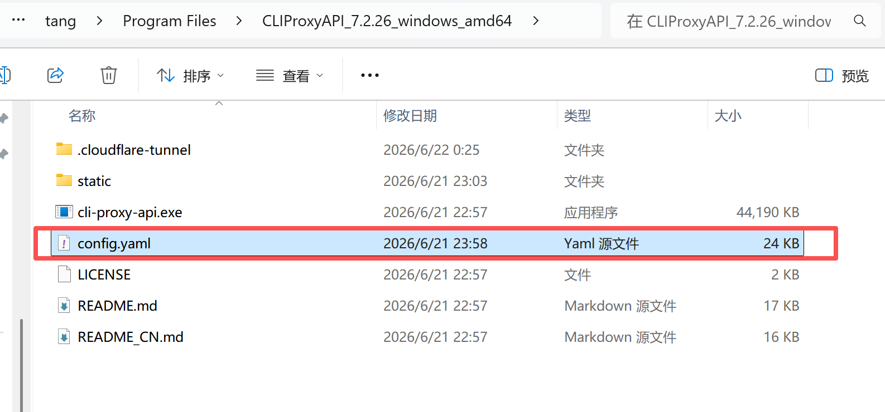
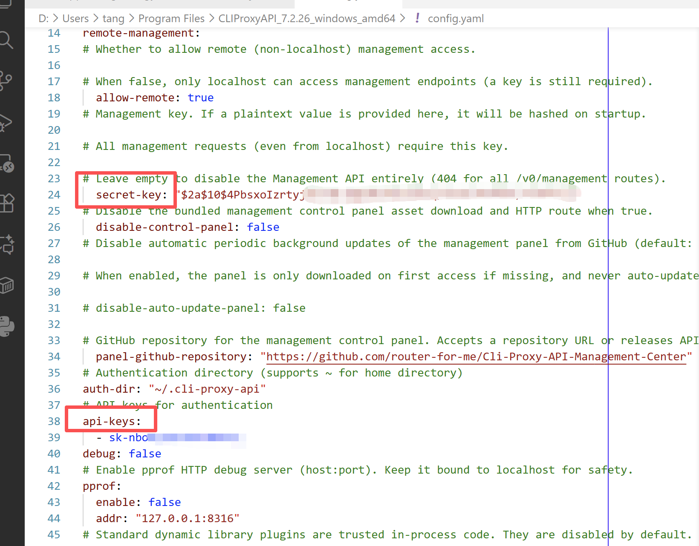
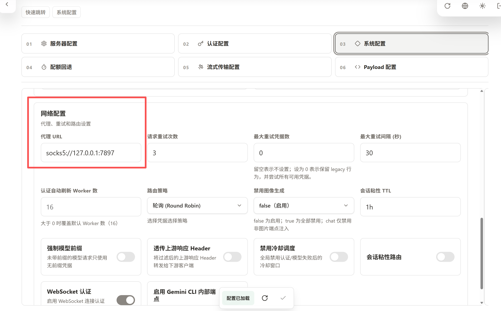

直接按照 free 使用教程的链接进行配置即可，不需要配置Cockpit Tools，直接配置 [CPAMC](https://github.com/router-for-me/CLIProxyAPI/releases)

注意，最开始的 `config.example.yaml` 改名成 `config.yaml`

然后设置 `secret-key` 和 `api-keys` 字段，可以都设置成 `123456`，后面再改。

然后进入网页 http://localhost:8317/management.html，进入 CPAMC 控制台。这个网页是在 [CPAMC 用户手册](https://help.router-for.me/cn/management/webui.html) 有写。

按照 free 使用本地教程配置后，记得额外配置代理 URL。其中 `socks5://127.0.0.1` 是固定的，后面的端口可以查看梯子软件的端口是多少，进行配置。

完成上述操作后，配置完成。
