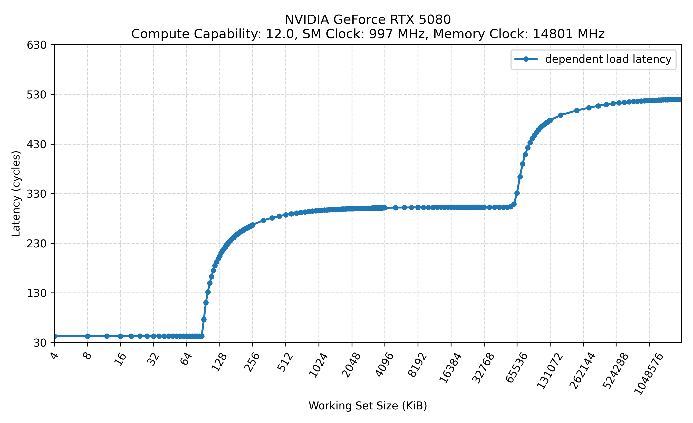
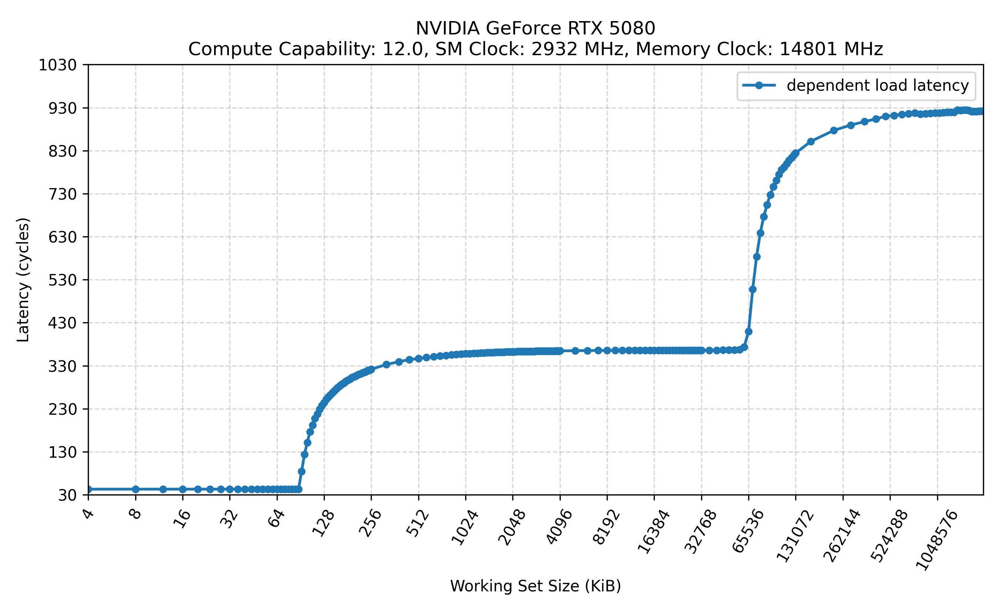
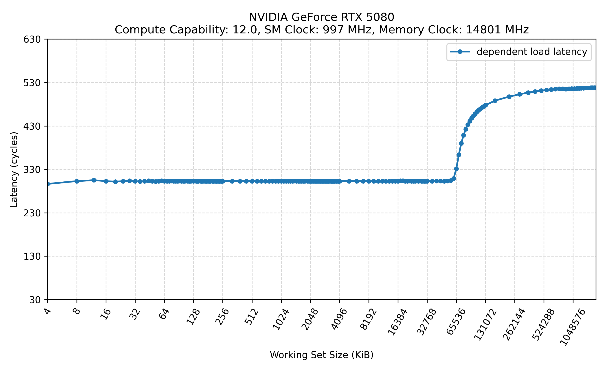
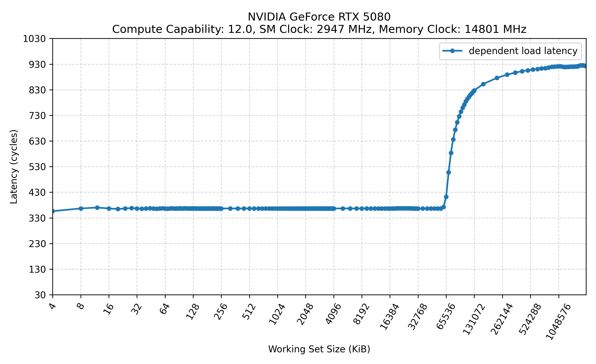

# 延迟的定义

延迟可以分为两种：

## True Latency （真实依赖延迟）

构造一串前后依赖的指令，让后一条指令必须等前一条指令的结果出来才能执行。

True Latency 反映在无法并行处理情况下的延迟。

  例如：

```assembly
FFMA R0, R0, R1, R2
FFMA R0, R0, R1, R2
FFMA R0, R0, R1, R2
FFMA R0, R0, R1, R2
```

每条指令都读写 R0，所以第 2 条必须等第 1 条的 R0 结果可用，第 3 条必须等第 2 条，以此类推。

这种情况下，硬件不能通过流水线重叠来隐藏延迟。

## Completion Latency (完成延迟 / 平均完成间隔)

构造一组互相独立的指令，它们之间没有数据依赖，所以硬件可以让它们并行、流水线化、重叠执行。

汇编层面类似：

```assembly
FFMA R0,  R0,  R20, R21
FFMA R1,  R1,  R20, R21
FFMA R2,  R2,  R20, R21
FFMA R3,  R3,  R20, R21
FFMA R4,  R4,  R20, R21
FFMA R5,  R5,  R20, R21
```

这些指令分别操作不同寄存器 R0, R1, R2, ...，所以彼此不需要等待。

假设单条 FFMA 的 true latency 是 10 cycles，但执行单元是流水线化的，可以每个 cycle 接收一条新指令。此时虽然每条指令从发射到结果可用仍然是 10 cycles，但因为流水线重叠了，所以从整体看，平均每条指令的完成间隔可能接近 1 cycle/instruction。

# 内存子系统的 True Latency

## L1，L2 和 DRAM

### 设置

我使用 pointer-chasing 方法测量 L1、L2 和 DRAM 的真实延迟（true latency）。

测试平台为 NVIDIA 5080 GPU，Compute Capability 为 sm_120。

测量前请注意以下事项：

1. **锁定 GPU 和显存频率**

   * 使用 `nvidia-smi -lgc <gpu_clocks>` 锁定 GPU 频率
   * 使用 `nvidia-smi -lmc <mem_clocks>` 锁定显存频率
   * 请使用脚本或者命令 `nvidia-smi dmon` 查看当前 GPU 频率和显存频率[^1]
   * [锁定 GPU 和显存频率的脚本](#lock_gpu_mem_clock)

[^1]: 使用 `nvidia-smi` 命令配置的频率不一定是实际运行时的频率。当 CUDA 应用启动后，已配置的频率仍可能动态变化。因此，每次运行 CUDA 程序时，都应在程序执行期间再次检查当前设备频率以进行确认。

2. **避免使用共享内存（Shared Memory）**

   * 在代码中确保不通过 `__shared__` 分配共享内存
   * 通过 CUDA 编程接口，尽可能将统一的 L1 / 共享内存空间分配给 L1 缓存：

   ```cuda
   // 尽量把统一空间划分给 L1 cache
   cudaFuncSetAttribute(
       pchase_latency_kernel,
       cudaFuncAttributePreferredSharedMemoryCarveout,
       cudaSharedmemCarveoutMaxL1
   );
   ```
3. **PTX 运算符决定是否绕过 L1 访问**
   在 CUDA 代码中内嵌 PTX 指令，可以指定访存操作是否绕过 L1 缓存。

   * `.ca`[^2]：允许在各级缓存（L1 和 L2）中进行缓存(各级缓存中的数据，可能会被再次访问。)<br>
   * `.cg`[^3]：仅在 L2 及更低层级缓存中分配，绕过 L1

[^2]: 默认的加载指令缓存操作为 ld.ca，它会在所有缓存层级（L1 和 L2）中分配缓存行，并采用常规的逐出策略。全局数据在 L2 层级上是一致的，但对于全局数据而言，多个 L1 缓存之间并不保持一致。如果一个线程通过其 L1 缓存向全局内存写入数据，而另一个线程通过另一个 L1 缓存使用 ld.ca 指令读取该地址的数据，那么第二个线程可能会读到过时的 L1 缓存数据，而不是第一个线程写入的数据。因此，驱动程序必须在相互依赖的并行线程网格之间，对全局数据的 L1 缓存行进行作废操作。这样，第一个网格程序写入的数据，就能够被第二个网格程序通过默认的 ld.ca 加载指令（该指令会将数据缓存在 L1 中）正确地获取到。

[^3]: 全局层级的缓存（仅在 L2 及更低层级缓存，不包含 L1）。<br>
可以使用 ld.cg 指令，使加载操作仅在全局层级进行缓存，即绕过 L1 缓存，仅将数据缓存在 L2 缓存中。

### 测试结果

下图展示了所有的测试结果，标题有以下信息：

- SM Clock: 通过 `nvidia-smi -lgc` 锁定的 GPU 频率
- Memory Clock: 通过 `nvidia-smi -lmc` 锁定的显存频率

#### 不旁路 L1: `.ca`




#### 旁路 L1: `.cg`




### 结论

| 组件 | SM 997 / Mem 14801  | SM 2932 / Mem 14801 | SM 997 / Mem 14801 (bypass L1) | SM 2947 / Mem 14801 (bypass L1) |
|------|---------------------|---------------------|---------------------| ---------------------|  
| L1   | 43            | 43             | \              | \              |
| L2   |  302          | 366            |302             | 366            |
| Mem  | 520           | 922            | 518            | 920            |

- 在相同的 SM 频率和 Mem 频率下，是否旁路 L1 对测得的 L2 延迟和 Mem 延迟几乎没有影响。换言之，常规访问路径中即使先查询 L1 并发生 Tag miss，其额外开销也可能被隐藏或小到难以在当前测量中分辨[^4]。

[^4]: 一种可能的解释是 L1 采用了类似 VIPT（Virtually Indexed, Physically Tagged）的 Cache 组织方式。对于典型的 PIPT（Physically Indexed, Physically Tagged）Cache，访问通常需要先完成地址翻译，再用物理地址索引 cache set 并进行 tag 比较；而在 VIPT Cache 中，set index 通常来自页内偏移，因此可以在 TLB 地址翻译的同时完成 cache set 索引，随后再用翻译得到的物理 tag 进行比较。这样，L1 查询过程中的部分开销可以与地址翻译重叠，从而减小 L1 miss 对后续 L2/Mem 访问路径的可观测延迟影响。

- 统计 cycle 时，代码是以 SM 频率为口径。在固定内存频率的情况下，降低 SM 频率，可以明显看到访问 L2 和内存的周期数发生了变化，而访问 L1 的周期数则保持不变。

- 修改 SM 频率通常不会改变按 cycle 计量的 L1 访问延迟，因为 L1 访问所经过的流水线级数基本固定；频率变化主要影响的是每个 cycle 对应的实际时间，而不是完成一次 L1 访问所需的 cycle 数。

- [Makefile 文件](#makefile_for_l1)，编译并且生成程序的 PTX 和 SASS 指令。通过比较 PTX 和 SASS 指令进一步确认配置的正确性。

- [不旁路 L1 的 True Latency 测量代码](#not_bypass_l1_true_latency)

- [旁路 L1 的 True Latency 测量代码](#bypass_l1_true_latency)


# 相关资料

[CUDA 官方编程手册](https://docs.nvidia.com/cuda/cuda-programming-guide/index.html)

[CUDA 官方 PTX ISA](https://docs.nvidia.com/cuda/parallel-thread-execution/index.html)

# 脚本

<a id="lock_gpu_mem_clock"></a>

## 锁定 GPU 和显存频率的脚本

`gpu_clock_lock.sh`

```shell
#!/usr/bin/env bash
set -euo pipefail

GPU_ID=0
SM_CLOCK=""
MEM_CLOCK=""
ACTION=""

usage() {
    cat <<EOF
Usage:
  $0 status [--gpu GPU_ID]
  $0 lock   --sm SM_MHZ [--mem MEM_MHZ] [--gpu GPU_ID]
  $0 unlock [--gpu GPU_ID]

Examples:
  $0 status
  sudo $0 lock --sm 2500
  sudo $0 lock --sm 2500 --mem 14000
  sudo $0 unlock

Notes:
  --sm  : lock SM/core clock in MHz, e.g. 2500
  --mem : lock memory clock in MHz, e.g. 14000
  --gpu : GPU index, default 0
EOF
}

need_nvidia_smi() {
    if ! command -v nvidia-smi >/dev/null 2>&1; then
        echo "ERROR: nvidia-smi not found"
        exit 1
    fi
}

need_root_for_modify() {
    if [[ "${ACTION}" == "lock" || "${ACTION}" == "unlock" ]]; then
        if [[ "${EUID}" -ne 0 ]]; then
            echo "ERROR: lock/unlock requires root. Please run with sudo."
            exit 1
        fi
    fi
}

show_status() {
    echo "==== GPU status ===="
    nvidia-smi -i "${GPU_ID}" \
        --query-gpu=index,name,pstate,temperature.gpu,power.draw,power.limit,clocks.current.sm,clocks.current.graphics,clocks.current.memory,clocks.max.sm,clocks.max.graphics,clocks.max.memory \
        --format=csv

    echo
    echo "==== nvidia-smi full summary ===="
    nvidia-smi -i "${GPU_ID}"
}

lock_clocks() {
    echo "==== Enable persistence mode ===="
    nvidia-smi -i "${GPU_ID}" -pm 1 || true
    echo

    if [[ -n "${SM_CLOCK}" ]]; then
        echo "==== Lock SM/core clock to ${SM_CLOCK} MHz ===="
        nvidia-smi -i "${GPU_ID}" -lgc "${SM_CLOCK},${SM_CLOCK}"
        echo
    else
        echo "ERROR: --sm SM_MHZ is required for lock"
        exit 1
    fi

    if [[ -n "${MEM_CLOCK}" ]]; then
        echo "==== Try to lock memory clock to ${MEM_CLOCK} MHz ===="
        if nvidia-smi -i "${GPU_ID}" -lmc "${MEM_CLOCK},${MEM_CLOCK}"; then
            echo "Memory clock locked to ${MEM_CLOCK} MHz"
        else
            echo "WARNING: Failed to lock memory clock."
            echo "This is common on some GeForce GPUs/drivers."
        fi
        echo
    fi

    show_status
}

unlock_clocks() {
    echo "==== Reset SM/core clock lock ===="
    nvidia-smi -i "${GPU_ID}" -rgc || true
    echo

    echo "==== Reset memory clock lock ===="
    nvidia-smi -i "${GPU_ID}" -rmc || true
    echo

    echo "==== Keep persistence mode enabled ===="
    nvidia-smi -i "${GPU_ID}" -pm 1 || true
    echo

    show_status
}

if [[ $# -lt 1 ]]; then
    usage
    exit 1
fi

ACTION="$1"
shift

while [[ $# -gt 0 ]]; do
    case "$1" in
        --gpu)
            GPU_ID="$2"
            shift 2
            ;;
        --sm)
            SM_CLOCK="$2"
            shift 2
            ;;
        --mem)
            MEM_CLOCK="$2"
            shift 2
            ;;
        -h|--help)
            usage
            exit 0
            ;;
        *)
            echo "Unknown argument: $1"
            usage
            exit 1
            ;;
    esac
done

need_nvidia_smi
need_root_for_modify

case "${ACTION}" in
    status)
        show_status
        ;;
    lock)
        lock_clocks
        ;;
    unlock)
        unlock_clocks
        ;;
    *)
        echo "Unknown action: ${ACTION}"
        usage
        exit 1
        ;;
esac
```

## 编译，并且生成 PTX 和 SASS 的 Makefile

<a id="makefile_for_l1"></a>

```makefile

# ==============================
# Makefile for RTX 5080 / sm_120
# ==============================

SRC      := l2_latency_pchase.cu
BUILD    := build
TARGET   := $(BUILD)/l2_latency_pchase

ARCH     := sm_120
COMPUTE  := compute_120

PTX      := $(BUILD)/l2_latency_pchase_$(ARCH).ptx
CUBIN    := $(BUILD)/l2_latency_pchase_$(ARCH).cubin
SASS     := $(BUILD)/l2_latency_pchase_$(ARCH).sass

NVCC      := nvcc
CUOBJDUMP := cuobjdump

# NVML 头文件路径
NVML_INC := /usr/local/cuda/include

# NVML 库路径，普通 Linux 通常是这个
NVML_LIB := /usr/lib/x86_64-linux-gnu

NVCCFLAGS := -O3 -std=c++17 -I$(NVML_INC)

LDFLAGS := -L$(NVML_LIB) -lnvidia-ml

GENCODE := \
	-gencode arch=$(COMPUTE),code=$(ARCH) \
	-gencode arch=$(COMPUTE),code=$(COMPUTE)

.PHONY: all run sass ptx cubin check clean info

all: $(BUILD) $(TARGET) $(PTX) $(CUBIN) $(SASS)

$(BUILD):
	mkdir -p $(BUILD)

# 1. 编译可执行文件，包含 sm_120 SASS 和 compute_120 PTX
$(TARGET): $(SRC) | $(BUILD)
	$(NVCC) $(NVCCFLAGS) $(GENCODE) $< -o $@ $(LDFLAGS)

# 2. 生成 PTX
# 注意：这里只生成 PTX，不需要链接 -lnvidia-ml
$(PTX): $(SRC) | $(BUILD)
	$(NVCC) $(NVCCFLAGS) -ptx -arch=$(COMPUTE) $< -o $@

# 3. 生成 CUBIN
# 注意：这里只生成 CUBIN，不需要链接 -lnvidia-ml
$(CUBIN): $(SRC) | $(BUILD)
	$(NVCC) $(NVCCFLAGS) -cubin -arch=$(ARCH) $< -o $@

# 4. 从可执行文件 dump SASS
$(SASS): $(TARGET) | $(BUILD)
	$(CUOBJDUMP) --dump-sass $(TARGET) > $(SASS)

# 运行 benchmark
run: $(TARGET)
	./$(TARGET)

# 只生成 sass
sass: $(SASS)

# 只生成 ptx
ptx: $(PTX)

# 只生成 cubin
cubin: $(CUBIN)

# 检查生成的 SASS 里是否是 sm_120，以及是否有 LDG
check: $(SASS)
	@echo "==== Architecture check ===="
	@grep -E "arch =|code for|\\.target" $(SASS) || true
	@echo
	@echo "==== Kernel / LDG check ===="
	@grep -E "Function :|LDG|STG|CS2R|CS2UR|BRA" $(SASS) | head -n 120 || true
	@echo
	@echo "SASS file: $(SASS)"

# 打印 nvcc 支持的架构
info:
	$(NVCC) --version
	@echo
	-$(NVCC) --list-gpu-arch
	@echo
	-$(NVCC) --list-gpu-code

clean:
	rm -rf $(BUILD)

```

# 代码

## 不旁路 L1 测量 True Latency

<a id="not_bypass_l1_true_latency"></a>

```cuda
#include <cuda_runtime.h>
#include <cstdio>
#include <cstdlib>
#include <vector>
#include <random>
#include <algorithm>
#include <cstdint>
#include <nvml.h>

#define CUDA_CHECK(call)                                      \
    do {                                                      \
        cudaError_t err = call;                               \
        if (err != cudaSuccess) {                             \
            fprintf(stderr, "CUDA error %s:%d: %s\n",         \
                    __FILE__, __LINE__,                       \
                    cudaGetErrorString(err));                 \
            std::exit(EXIT_FAILURE);                          \
        }                                                     \
    } while (0)

#define NVML_CHECK(call)                                                        \
do {                                                                        \
    nvmlReturn_t _status = (call);                                          \
    if (_status != NVML_SUCCESS) {                                          \
        fprintf(stderr, "NVML error %s:%d: %s\n",                           \
                __FILE__, __LINE__, nvmlErrorString(_status));              \
        exit(EXIT_FAILURE);                                                 \
    }                                                                       \
} while (0)
// 使用 inline PTX 强制 global load 经 cache 路径。
// .ca = cache at all levels，通常用于让 global load 进入 L1 + L2。
// 注意：具体缓存策略仍可能受架构和编译器影响，建议配合 SASS 检查。
__device__ __forceinline__ uint32_t ld_ca_u32(const uint32_t *ptr) {
    uint32_t val;
 
    // 把 CUDA generic pointer 显式转换成 global memory address。
    // 对 inline PTX 的 ld.global 更稳。
    unsigned long long addr =
        static_cast<unsigned long long>(__cvta_generic_to_global(ptr));
    
    // 从 global memory 地址 addr 读取一个 32-bit unsigned integer 到寄存器 val
    asm volatile("ld.global.ca.u32 %0, [%1];"
                 : "=r"(val)
                 : "l"(addr)
                 : "memory");
 
    return val;
}

// 单线程 pointer-chase。
// 每一次 load 的地址依赖上一次 load 的结果，所以无法并行隐藏 latency。
__global__ void pchase_latency_kernel(const uint32_t *__restrict__ chain,
                                      uint64_t *cycles_out,
                                      uint32_t *sink_out,
                                      int warmup_iters,
                                      int measure_iters) {
    uint32_t idx = 0;

    // warm-up：先把 working set 尽量带入 L1/L2。
    // 如果 working set 小于 L1，后续测量主要是 L1 hit。
    #pragma unroll 1
    for (int i = 0; i < warmup_iters; ++i) {
        // 功能上等价于 idx = chain[idx]，但底层明确使用 ld.global.ca.u32
        idx = ld_ca_u32(chain + idx);       
    }
    

    // 编译器层面的 barrier, 防止编译器移动 clock 前后的 load。
    asm volatile("" ::: "memory");

    uint64_t start = clock64();

    #pragma unroll 1
    for (int i = 0; i < measure_iters; ++i) {
        idx = ld_ca_u32(chain + idx);
    }

    uint64_t end = clock64();

    asm volatile("" ::: "memory");

    if (threadIdx.x == 0 && blockIdx.x == 0) {
        cycles_out[0] = end - start;
        sink_out[0] = idx;
    }
}

// overhead_kernel 用于对 pchase_latency_kernel 进行 baseline 校正。
// 它通过 global 函数内的寄存器变量 idx 构建依赖链，因此不会访问 global memory。
// 但该函数仍包含除内存访问以外的循环、计时和指令执行等开销。
// 用 pchase_latency_kernel 的延迟开销减去 overhead_kernel 的开销，
// 即可近似得到仅由访问 global memory 所产生的延迟开销。
__global__ void overhead_kernel(uint64_t *cycles_out,
                                uint32_t *sink_out,
                                int measure_iters) {
    uint32_t idx = 1;

    asm volatile("" ::: "memory");

    uint64_t start = clock64();

    #pragma unroll 1
    for (int i = 0; i < measure_iters; ++i) {
        idx = idx * 1664525u + 1013904223u;         // 一个线性同余生成器形式，类似伪随机数生成
    }

    uint64_t end = clock64();

    asm volatile("" ::: "memory");

    if (threadIdx.x == 0 && blockIdx.x == 0) {
        cycles_out[0] = end - start;
        sink_out[0] = idx;
    }
}

// 构造随机 pointer-chase 链，随机是为了避免 GPU 硬件可能通过 
// cache line、prefetch、内存合并等机制提前或高效访问
// chain[i] = next index。
// 形成一个覆盖所有元素的环。
std::vector<uint32_t> make_random_chain(size_t n, uint32_t seed = 1234) {
    std::vector<uint32_t> perm(n);
    for (size_t i = 0; i < n; ++i) {
        perm[i] = static_cast<uint32_t>(i);
    }

    std::mt19937 rng(seed);
    std::shuffle(perm.begin(), perm.end(), rng);

    std::vector<uint32_t> chain(n);

    for (size_t i = 0; i < n; ++i) {
        uint32_t cur = perm[i];
        uint32_t nxt = perm[(i + 1) % n];
        chain[cur] = nxt;
    }

    return chain;
}

double measure_one_size(size_t working_set_bytes,
                        uint64_t  warmup_iters,
                        uint64_t  measure_iters,
                        bool subtract_overhead) {
    size_t n = working_set_bytes / sizeof(uint32_t);

    if (n < 2) {
        fprintf(stderr, "working set too small\n");
        std::exit(EXIT_FAILURE);
    }

    if (n > UINT32_MAX) {
        fprintf(stderr, "working set too large for uint32 index\n");
        std::exit(EXIT_FAILURE);
    }

    std::vector<uint32_t> h_chain = make_random_chain(n);

    uint32_t *d_chain = nullptr;
    uint64_t *d_cycles = nullptr;
    uint32_t *d_sink = nullptr;         // GPU 上保存最终 idx

    CUDA_CHECK(cudaMalloc(&d_chain, n * sizeof(uint32_t)));
    CUDA_CHECK(cudaMalloc(&d_cycles, sizeof(uint64_t)));
    CUDA_CHECK(cudaMalloc(&d_sink, sizeof(uint32_t)));

    CUDA_CHECK(cudaMemcpy(d_chain,
                          h_chain.data(),       // .data() 提取指向首元素的原始指针
                          n * sizeof(uint32_t),
                          cudaMemcpyHostToDevice));

    CUDA_CHECK(cudaDeviceSynchronize());

    // hint: 尽量把统一空间划给 L1 cache
    cudaFuncSetAttribute(
        pchase_latency_kernel,
        cudaFuncAttributePreferredSharedMemoryCarveout,
        cudaSharedmemCarveoutMaxL1
    );
    // 测 p-chase
    // 由于这里是 latency 测试，只有一个线程可以避免 warp 调度隐藏 latency，
    // memory-level parallelism 增加, cache 访问干扰， 多线程访问合并等问题
    pchase_latency_kernel<<<1, 1>>>(d_chain,
                                    d_cycles,
                                    d_sink,
                                    warmup_iters,
                                    measure_iters);
    CUDA_CHECK(cudaGetLastError());
    CUDA_CHECK(cudaDeviceSynchronize());

    uint64_t h_cycles = 0;
    uint32_t h_sink = 0;

    CUDA_CHECK(cudaMemcpy(&h_cycles,
                          d_cycles,
                          sizeof(uint64_t),
                          cudaMemcpyDeviceToHost));
    CUDA_CHECK(cudaMemcpy(&h_sink,
                          d_sink,
                          sizeof(uint32_t),
                          cudaMemcpyDeviceToHost));

    double cycles_per_load = static_cast<double>(h_cycles) /
                             static_cast<double>(measure_iters);

    if (subtract_overhead) {
        overhead_kernel<<<1, 1>>>(d_cycles, d_sink, measure_iters);
        CUDA_CHECK(cudaGetLastError());
        CUDA_CHECK(cudaDeviceSynchronize());

        uint64_t h_overhead_cycles = 0;
        CUDA_CHECK(cudaMemcpy(&h_overhead_cycles,
                              d_cycles,
                              sizeof(uint64_t),
                              cudaMemcpyDeviceToHost));

        double overhead_per_iter =
            static_cast<double>(h_overhead_cycles) /
            static_cast<double>(measure_iters);

        cycles_per_load -= overhead_per_iter;
    }

    // 使用 sink，防止编译器认为结果无用。
    if (h_sink == 0xFFFFFFFFu) {
        printf("Impossible sink value\n");
    }

    CUDA_CHECK(cudaFree(d_chain));
    CUDA_CHECK(cudaFree(d_cycles));
    CUDA_CHECK(cudaFree(d_sink));

    return cycles_per_load;
}

int main() {
    int dev = 0;
    CUDA_CHECK(cudaSetDevice(dev));

    // 读取并打印 GPU 基本信息，方便后面解释 cache/显存边界。
    cudaDeviceProp prop{};
    CUDA_CHECK(cudaGetDeviceProperties(&prop, dev));

    printf("Device: %s\n", prop.name);
    printf("SM count: %d\n", prop.multiProcessorCount);
    printf("Compute capability: %d.%d\n", prop.major, prop.minor);
    printf("L2 cache size: %.2f MiB\n",
           prop.l2CacheSize / 1024.0 / 1024.0);
    printf("Global memory: %.2f GiB\n",
           prop.totalGlobalMem / 1024.0 / 1024.0 / 1024.0);
    printf("Memory bus width: %d bits\n", prop.memoryBusWidth);
    printf("\n");

    // 使用 NVML 获取当前实时频率
    NVML_CHECK(nvmlInit());

    // 更稳妥：通过 PCI Bus ID 找到对应 NVML 设备
    char pci_bus_id[32] = {};
    CUDA_CHECK(cudaDeviceGetPCIBusId(pci_bus_id, sizeof(pci_bus_id), dev));

    nvmlDevice_t nvml_dev;
    NVML_CHECK(nvmlDeviceGetHandleByPciBusId(pci_bus_id, &nvml_dev));

    unsigned int graphics_clock = 0;
    unsigned int sm_clock = 0;
    unsigned int mem_clock = 0;

    NVML_CHECK(nvmlDeviceGetClockInfo(nvml_dev, NVML_CLOCK_GRAPHICS, &graphics_clock));
    NVML_CHECK(nvmlDeviceGetClockInfo(nvml_dev, NVML_CLOCK_SM, &sm_clock));
    NVML_CHECK(nvmlDeviceGetClockInfo(nvml_dev, NVML_CLOCK_MEM, &mem_clock));

    printf("PCI Bus ID:                 %s\n", pci_bus_id);
    printf("Current GPU graphics clock: %u MHz\n", graphics_clock);
    printf("Current SM clock:           %u MHz\n", sm_clock);
    printf("Current memory clock:       %u MHz\n", mem_clock);
    printf("\n");
    
    bool subtract_overhead = false;

    std::vector<size_t> sizes;

    /*
     * 构造 working set 序列。
     *
     * 小 working set 主要测 L1；
     * 中等 working set 主要测 L2；
     * 超过 L2 的 working set 主要测显存。
     *
     * 在 cache 边界附近使用更细步进，
     * 因为延迟突变通常发生在这些位置。
     */

    // L1 重点区间：4KB ~ 256KB，每 4KB 测一次。
    // 你的结果显示 L1 转折大约出现在 64KB ~ 128KB，
    // 所以这里加密采样。
    for (size_t kb = 4; kb <= 256; kb += 4) {
        sizes.push_back(kb * 1024ull);
    }

    // L1 到 L2 过渡区：320KB ~ 4MB，每 64KB 测一次。
    // 用来观察延迟如何从 L1 miss 逐渐稳定到 L2 hit。
    for (size_t kb = 320; kb <= 4096; kb += 64) {
        sizes.push_back(kb * 1024ull);
    }

    // L2 稳定区：5MB ~ 32MB，每 1MB 测一次。
    // 你的结果中这一段基本稳定在 L2 hit latency。
    for (size_t mb = 5; mb <= 32; mb += 1) {
        sizes.push_back(mb * 1024ull * 1024ull);
    }

    // L2 边界区：36MB ~ 128MB，每 4MB 测一次。
    // 你的 GPU L2 是 64MiB，所以这里重点观察 L2 miss 转折。
    for (size_t mb = 36; mb <= 128; mb += 4) {
        sizes.push_back(mb * 1024ull * 1024ull);
    }

    // DRAM 区间：160MB ~ 2048MB，每 64MB 测一次。
    // 超过 L2 后主要观察显存访问延迟。
    for (size_t mb = 160; mb <= 2048; mb += 64) {
        sizes.push_back(mb * 1024ull * 1024ull);
    }

    printf("working_set_KB, cycles_per_dependent_load\n");

    for (size_t bytes : sizes) {
        size_t n = bytes / sizeof(uint32_t);

        /*
         * 动态设置迭代次数，要求至少 warmup_iters >= n，即整个 pointer chain 至少访问完整一圈
         *
         * 为什么不用固定次数？
         * - 小 working set：至少 1M 次，降低计时噪声；
         * - 大 working set：迭代次数随元素数增加，尽量覆盖更多链节点；
         * - 超大 working set：设置上限，避免运行时间过长。
         */
        uint64_t min_iters = 1ull << 20;   // 至少 1M 次
        uint64_t max_iters = 1ull << 26;   // 最多 64M 次

        uint64_t target_iters = 4ull * static_cast<uint64_t>(n);

        uint64_t warmup_iters =
            std::min<uint64_t>(
                std::max<uint64_t>(min_iters, target_iters),
                max_iters
            );

        uint64_t measure_iters =
            std::min<uint64_t>(
                std::max<uint64_t>(min_iters, target_iters),
                max_iters
            );

        printf("Running working set = %zu KB, warmup_iters = %llu, measure_iters = %llu ...\n",
               bytes / 1024,
               static_cast<unsigned long long>(warmup_iters),
               static_cast<unsigned long long>(measure_iters));
        fflush(stdout);

        // 对当前 working set 做 pointer chasing，返回平均每次依赖 load 的 cycle 数。
        double cyc = measure_one_size(bytes,
                                      warmup_iters,
                                      measure_iters,
                                      subtract_overhead);

        printf("%zu, %.2f\n", bytes / 1024, cyc);
        fflush(stdout);
    }

    return 0;
}
```

## 旁路 L1 测量 True Latency

<a id="bypass_l1_true_latency"></a>

```cuda
#include <cuda_runtime.h>
#include <cstdio>
#include <cstdlib>
#include <vector>
#include <random>
#include <algorithm>
#include <cstdint>
#include <nvml.h>

#define CUDA_CHECK(call)                                      \
    do {                                                      \
        cudaError_t err = call;                               \
        if (err != cudaSuccess) {                             \
            fprintf(stderr, "CUDA error %s:%d: %s\n",         \
                    __FILE__, __LINE__,                       \
                    cudaGetErrorString(err));                 \
            std::exit(EXIT_FAILURE);                          \
        }                                                     \
    } while (0)

#define NVML_CHECK(call)                                                        \
do {                                                                        \
    nvmlReturn_t _status = (call);                                          \
    if (_status != NVML_SUCCESS) {                                          \
        fprintf(stderr, "NVML error %s:%d: %s\n",                           \
                __FILE__, __LINE__, nvmlErrorString(_status));              \
        exit(EXIT_FAILURE);                                                 \
    }                                                                       \
} while (0)

// 使用 inline PTX 强制 global load 经 cache 路径。
// .cg = cache at global level，通常用于让 global load 进入 L2, 绕过 L1。
// 注意：具体缓存策略仍可能受架构和编译器影响，建议配合 SASS 检查。
__device__ __forceinline__ uint32_t ld_cg_u32(const uint32_t *ptr) {
    uint32_t val;

    // 把 CUDA generic pointer 显式转换成 global memory address。
    unsigned long long addr =
        static_cast<unsigned long long>(__cvta_generic_to_global(ptr));

    // .cg = cache at global level
    // 通常表示绕过/不分配 L1，只通过 L2 缓存 global memory load。
    asm volatile("ld.global.cg.u32 %0, [%1];"
                 : "=r"(val)
                 : "l"(addr)
                 : "memory");

    return val;
}

// 单线程 pointer-chase。
// 每一次 load 的地址依赖上一次 load 的结果，所以无法并行隐藏 latency。
__global__ void pchase_latency_kernel(const uint32_t *__restrict__ chain,
                                      uint64_t *cycles_out,
                                      uint32_t *sink_out,
                                      int warmup_iters,
                                      int measure_iters) {
    uint32_t idx = 0;

    // warm-up：先把 working set 尽量带入 L1/L2。
    // 如果 working set 小于 L1，后续测量主要是 L1 hit。
    #pragma unroll 1
    for (int i = 0; i < warmup_iters; ++i) {
        // 功能上等价于 idx = chain[idx]，但底层明确使用 ld.global.ca.u32
        idx = ld_cg_u32(chain + idx);       
    }
    

    // 编译器层面的 barrier, 防止编译器移动 clock 前后的 load。
    asm volatile("" ::: "memory");

    uint64_t start = clock64();

    #pragma unroll 1
    for (int i = 0; i < measure_iters; ++i) {
        idx = ld_cg_u32(chain + idx);
    }

    uint64_t end = clock64();

    asm volatile("" ::: "memory");

    if (threadIdx.x == 0 && blockIdx.x == 0) {
        cycles_out[0] = end - start;
        sink_out[0] = idx;
    }
}

// 测 clock/loop overhead。
// 用一个简单的依赖整数操作近似估计循环开销。
// 真实论文里的数值通常直接报告 p-chase 平均延迟；
// 如果你想更干净，可以用这个 overhead 做校正。
__global__ void overhead_kernel(uint64_t *cycles_out,
                                uint32_t *sink_out,
                                int measure_iters) {
    uint32_t idx = 1;

    asm volatile("" ::: "memory");

    uint64_t start = clock64();

    #pragma unroll 1
    for (int i = 0; i < measure_iters; ++i) {
        idx = idx * 1664525u + 1013904223u;
    }

    uint64_t end = clock64();

    asm volatile("" ::: "memory");

    if (threadIdx.x == 0 && blockIdx.x == 0) {
        cycles_out[0] = end - start;
        sink_out[0] = idx;
    }
}

// 构造随机 pointer-chase 链，随机是为了避免 GPU 硬件可能通过 
// cache line、prefetch、内存合并等机制提前或高效访问
// chain[i] = next index。
// 形成一个覆盖所有元素的环。
std::vector<uint32_t> make_random_chain(size_t n, uint32_t seed = 1234) {
    std::vector<uint32_t> perm(n);
    for (size_t i = 0; i < n; ++i) {
        perm[i] = static_cast<uint32_t>(i);
    }

    std::mt19937 rng(seed);
    std::shuffle(perm.begin(), perm.end(), rng);

    std::vector<uint32_t> chain(n);

    for (size_t i = 0; i < n; ++i) {
        uint32_t cur = perm[i];
        uint32_t nxt = perm[(i + 1) % n];
        chain[cur] = nxt;
    }

    return chain;
}

double measure_one_size(size_t working_set_bytes,
                        uint64_t  warmup_iters,
                        uint64_t  measure_iters,
                        bool subtract_overhead) {
    size_t n = working_set_bytes / sizeof(uint32_t);

    if (n < 2) {
        fprintf(stderr, "working set too small\n");
        std::exit(EXIT_FAILURE);
    }

    if (n > UINT32_MAX) {
        fprintf(stderr, "working set too large for uint32 index\n");
        std::exit(EXIT_FAILURE);
    }

    std::vector<uint32_t> h_chain = make_random_chain(n);

    uint32_t *d_chain = nullptr;
    uint64_t *d_cycles = nullptr;
    uint32_t *d_sink = nullptr;         // GPU 上保存最终 idx

    CUDA_CHECK(cudaMalloc(&d_chain, n * sizeof(uint32_t)));
    CUDA_CHECK(cudaMalloc(&d_cycles, sizeof(uint64_t)));
    CUDA_CHECK(cudaMalloc(&d_sink, sizeof(uint32_t)));

    CUDA_CHECK(cudaMemcpy(d_chain,
                          h_chain.data(),       // .data() 提取指向首元素的原始指针
                          n * sizeof(uint32_t),
                          cudaMemcpyHostToDevice));

    CUDA_CHECK(cudaDeviceSynchronize());

    // 测 p-chase
    // 由于这里是 latency 测试，只有一个线程可以避免 warp 调度隐藏 latency，
    // memory-level parallelism 增加, cache 访问干扰， 多线程访问合并等问题
    pchase_latency_kernel<<<1, 1>>>(d_chain,
                                    d_cycles,
                                    d_sink,
                                    warmup_iters,
                                    measure_iters);
    CUDA_CHECK(cudaGetLastError());
    CUDA_CHECK(cudaDeviceSynchronize());

    uint64_t h_cycles = 0;
    uint32_t h_sink = 0;

    CUDA_CHECK(cudaMemcpy(&h_cycles,
                          d_cycles,
                          sizeof(uint64_t),
                          cudaMemcpyDeviceToHost));
    CUDA_CHECK(cudaMemcpy(&h_sink,
                          d_sink,
                          sizeof(uint32_t),
                          cudaMemcpyDeviceToHost));

    double cycles_per_load = static_cast<double>(h_cycles) /
                             static_cast<double>(measure_iters);

    if (subtract_overhead) {
        overhead_kernel<<<1, 1>>>(d_cycles, d_sink, measure_iters);
        CUDA_CHECK(cudaGetLastError());
        CUDA_CHECK(cudaDeviceSynchronize());

        uint64_t h_overhead_cycles = 0;
        CUDA_CHECK(cudaMemcpy(&h_overhead_cycles,
                              d_cycles,
                              sizeof(uint64_t),
                              cudaMemcpyDeviceToHost));

        double overhead_per_iter =
            static_cast<double>(h_overhead_cycles) /
            static_cast<double>(measure_iters);

        cycles_per_load -= overhead_per_iter;
    }

    // 使用 sink，防止编译器认为结果无用。
    if (h_sink == 0xFFFFFFFFu) {
        printf("Impossible sink value\n");
    }

    CUDA_CHECK(cudaFree(d_chain));
    CUDA_CHECK(cudaFree(d_cycles));
    CUDA_CHECK(cudaFree(d_sink));

    return cycles_per_load;
}

int main() {
    int dev = 0;
    CUDA_CHECK(cudaSetDevice(dev));

    // 读取并打印 GPU 基本信息，方便后面解释 cache/显存边界。
    cudaDeviceProp prop{};
    CUDA_CHECK(cudaGetDeviceProperties(&prop, dev));

    printf("Device: %s\n", prop.name);
    printf("SM count: %d\n", prop.multiProcessorCount);
    printf("Compute capability: %d.%d\n", prop.major, prop.minor);
    printf("L2 cache size: %.2f MiB\n",
           prop.l2CacheSize / 1024.0 / 1024.0);
    printf("Global memory: %.2f GiB\n",
           prop.totalGlobalMem / 1024.0 / 1024.0 / 1024.0);
    printf("Memory bus width: %d bits\n", prop.memoryBusWidth);
    printf("\n");
    // CUDA Runtime API 里的频率信息，通常是最大频率，不是当前实时频率。
    printf("CUDA prop clockRate: %.2f MHz\n", prop.clockRate / 1000.0);
    printf("CUDA prop memoryClockRate: %.2f MHz\n", prop.memoryClockRate / 1000.0);
    printf("\n");

    // 使用 NVML 获取当前实时频率
    NVML_CHECK(nvmlInit());

    // 更稳妥：通过 PCI Bus ID 找到对应 NVML 设备
    char pci_bus_id[32] = {};
    CUDA_CHECK(cudaDeviceGetPCIBusId(pci_bus_id, sizeof(pci_bus_id), dev));

    nvmlDevice_t nvml_dev;
    NVML_CHECK(nvmlDeviceGetHandleByPciBusId(pci_bus_id, &nvml_dev));

    unsigned int graphics_clock = 0;
    unsigned int sm_clock = 0;
    unsigned int mem_clock = 0;

    NVML_CHECK(nvmlDeviceGetClockInfo(nvml_dev, NVML_CLOCK_GRAPHICS, &graphics_clock));
    NVML_CHECK(nvmlDeviceGetClockInfo(nvml_dev, NVML_CLOCK_SM, &sm_clock));
    NVML_CHECK(nvmlDeviceGetClockInfo(nvml_dev, NVML_CLOCK_MEM, &mem_clock));

    printf("PCI Bus ID:                 %s\n", pci_bus_id);
    printf("Current GPU graphics clock: %u MHz\n", graphics_clock);
    printf("Current SM clock:           %u MHz\n", sm_clock);
    printf("Current memory clock:       %u MHz\n", mem_clock);
    printf("\n");
    
    bool subtract_overhead = false;

    std::vector<size_t> sizes;

    /*
     * 构造 working set 序列。
     *
     * 小 working set 主要测 L1；
     * 中等 working set 主要测 L2；
     * 超过 L2 的 working set 主要测显存。
     *
     * 在 cache 边界附近使用更细步进，
     * 因为延迟突变通常发生在这些位置。
     */

    // L1 重点区间：4KB ~ 256KB，每 4KB 测一次。
    // 你的结果显示 L1 转折大约出现在 64KB ~ 128KB，
    // 所以这里加密采样。
    for (size_t kb = 4; kb <= 256; kb += 4) {
        sizes.push_back(kb * 1024ull);
    }

    // L1 到 L2 过渡区：320KB ~ 4MB，每 64KB 测一次。
    // 用来观察延迟如何从 L1 miss 逐渐稳定到 L2 hit。
    for (size_t kb = 320; kb <= 4096; kb += 64) {
        sizes.push_back(kb * 1024ull);
    }

    // L2 稳定区：5MB ~ 32MB，每 1MB 测一次。
    // 你的结果中这一段基本稳定在 L2 hit latency。
    for (size_t mb = 5; mb <= 32; mb += 1) {
        sizes.push_back(mb * 1024ull * 1024ull);
    }

    // L2 边界区：36MB ~ 128MB，每 4MB 测一次。
    // 你的 GPU L2 是 64MiB，所以这里重点观察 L2 miss 转折。
    for (size_t mb = 36; mb <= 128; mb += 4) {
        sizes.push_back(mb * 1024ull * 1024ull);
    }

    // DRAM 区间：160MB ~ 2048MB，每 64MB 测一次。
    // 超过 L2 后主要观察显存访问延迟。
    for (size_t mb = 160; mb <= 2048; mb += 64) {
        sizes.push_back(mb * 1024ull * 1024ull);
    }

    printf("working_set_KB, cycles_per_dependent_load\n");

    for (size_t bytes : sizes) {
        size_t n = bytes / sizeof(uint32_t);

        /*
         * 动态设置迭代次数，要求至少 warmup_iters >= n，即整个 pointer chain 至少访问完整一圈
         *
         * 为什么不用固定次数？
         * - 小 working set：至少 1M 次，降低计时噪声；
         * - 大 working set：迭代次数随元素数增加，尽量覆盖更多链节点；
         * - 超大 working set：设置上限，避免运行时间过长。
         */
        uint64_t min_iters = 1ull << 20;   // 至少 1M 次
        uint64_t max_iters = 1ull << 26;   // 最多 64M 次

        uint64_t target_iters = 4ull * static_cast<uint64_t>(n);

        uint64_t warmup_iters =
            std::min<uint64_t>(
                std::max<uint64_t>(min_iters, target_iters),
                max_iters
            );

        uint64_t measure_iters =
            std::min<uint64_t>(
                std::max<uint64_t>(min_iters, target_iters),
                max_iters
            );

        printf("Running working set = %zu KB, warmup_iters = %llu, measure_iters = %llu ...\n",
               bytes / 1024,
               static_cast<unsigned long long>(warmup_iters),
               static_cast<unsigned long long>(measure_iters));
        fflush(stdout);

        // 对当前 working set 做 pointer chasing，返回平均每次依赖 load 的 cycle 数。
        double cyc = measure_one_size(bytes,
                                      warmup_iters,
                                      measure_iters,
                                      subtract_overhead);

        printf("%zu, %.2f\n", bytes / 1024, cyc);
        fflush(stdout);
    }

    return 0;
}

```
