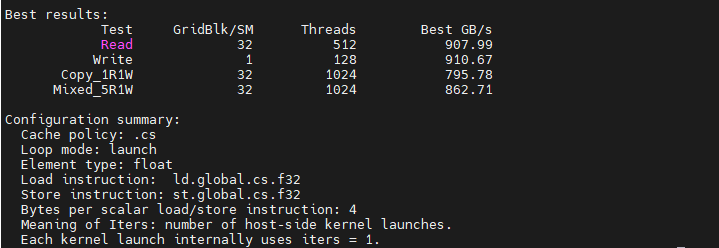

# 带宽和吞吐量含义区分

由于 [Dissecting the NVIDIA Hopper Architecture through Microbenchmarking and Multiple Level Analysis](https://arxiv.org/abs/2501.12084) 和 [Dissecting the NVIDIA Blackwell Architecture with Microbenchmarks](https://arxiv.org/abs/2507.10789) 两篇论文中对带宽和吞吐量的描述较为混乱，本文统一以 NVIDIA 白皮书中的定义为准。具体总结如下：

首先需要明确 GPU 中 **带宽（bandwidth）** 和 **吞吐量（throughput）** 这两个概念的区别：

- **带宽**：指单位时间内某个数据通路所能传输的数据量。  
  在 NVIDIA 白皮书中，带宽通常用于描述 HBM 显存带宽、NVLink / NVLink Switch 带宽等，常见单位为 GB/s、TB/s。

- **吞吐量**：指单位时间内 GPU 能够完成的计算操作、指令或任务的数量。  
  在 NVIDIA 白皮书中，吞吐量常用于描述 P16 / BF16 / FP8 Tensor Core 吞吐量等，最常见单位为 TFLOP/s、PFLOP/s。对于整数运算，则经常使用 TOPS（tera operations per second）。


# 代码和脚本

- [锁频脚本](#gpu_clock_lock)
- [cuda 编译 makefile](#makefile)
- DRAM 带宽分析
  - [DRAM 标准 float 带宽分析](#dram_1fp)
  - [DRAM 标准 float4 带宽分析](#dram_4fp)


# DRAM 带宽分析

包含以下两段测试代码：

- [DRAM 标准 float 带宽分析](#dram_1fp)
- [DRAM 标准 float4 带宽分析](#dram_4fp)

它们均通过 CUDA kernel 测量 GPU global memory / DRAM 路径在不同访问模式下的有效带宽：扫描多种 block/thread 配置，并分别统计 Read、Write、Copy、Mixed 四种操作下的 GB/s 数值。

不同之处在于：一个使用 scalar float 指令，每线程每条指令搬运 4B；另一个使用 vector float4 指令，每线程每条指令搬运 16B。在代码中的区别如下：

```cuda
// vector float4 .cg load 代码
asm volatile(
    "ld.global.cg.v4.f32 {%0, %1, %2, %3}, [%4];"
    : "=f"(v.x), "=f"(v.y), "=f"(v.z), "=f"(v.w)
    : "l"(ptr)
    : "memory"
);

// scalar float .cg load 代码
asm volatile(
    "ld.global.cg.f32 %0, [%1];"
    : "=f"(v)
    : "l"(ptr)
    : "memory"
);

```

## 代码模式配置

代码均有两个不同的配置参数；

- `kernel` 和 `launch`

- `cg` 和 `cs`[^1]

[^1]: `ld.cs`: **缓存流式访问（可能仅被访问一次）。**<br>
`ld.cs` 加载缓存流式操作在 L1 和 L2 缓存中使用“优先逐出”（evict-first）策略来分配全局缓存行，从而限制那些可能仅被访问一次或两次的临时流式数据所造成的缓存污染。当对局部窗口地址应用 `ld.cs` 时，它将执行 `ld.lu` 操作。<br>
`ld.lu`: **最后一次使用。**<br>
编译器或程序员在恢复溢出寄存器（spilled registers）和弹出函数栈帧（popping function stack frames）时，可以使用 `ld.lu` 指令，以避免对不再使用的缓存行进行不必要的写回。对于全局地址，`ld.lu` 指令执行的是缓存流式加载操作（`ld.cs`）。

四种不同的测试基准：

- `Read`: Read-only
- `Write`: Write-only
- `copy`: Copy 1R1W
- `Mixed`: Mixed 5R1W

代表每轮迭代 kernel 内部执行的读和写操作次数。

## `kernel` 和 `launch` 对比

我们以 scalar float 为例。当配置为 `kernel` 时，代表迭代在 kernel **内部**：

```cuda
// ------------------------------------------------------------
// Mixed 5-read-1-write kernel
// ------------------------------------------------------------
__global__ void dram_mixed_5r1w_kernel(
    const float* __restrict__ a0,
    const float* __restrict__ a1,
    const float* __restrict__ a2,
    const float* __restrict__ a3,
    const float* __restrict__ a4,
    float* __restrict__ dst,
    size_t elems,
    int iters,
    int policy
) {
...
...
    for (int it = 0; it < iters; ++it) {
        for (size_t i = tid; i < elems; i += stride) {
            float v0 = load_policy_float(a0 + i, policy);
            float v1 = load_policy_float(a1 + i, policy);
            float v2 = load_policy_float(a2 + i, policy);
            float v3 = load_policy_float(a3 + i, policy);
            float v4 = load_policy_float(a4 + i, policy);

            float out = v0 + v1 + v2 + v3 + v4;

            store_policy_float(dst + i, out, policy);
        }
    }
}
...
...
```

当配置为 `launch` 时，代表迭代在 kernel **外部**：

```cuda
static float time_benchmark(
    Launcher launcher,
    int warmup_iters,
    int measured_iters,
    LoopMode mode
) {
...
...
    if (mode == LOOP_LAUNCH) {
        for (int r = 0; r < measured_iters; ++r) {
            launcher(1, r);
        }
    } else {
        launcher(measured_iters, 0);
    }
...
...
}
```

## warmup_iters 和 measured_iters 限制

对于 `launch` 模式和 `kernel` 模式，限制 warmup_iters 为 0，measured_iters 为 10。这样做是为了防止缓存干扰 DRAM 带宽测量 [^2]。

[^2]: 跨 kernel 时: <br>
**L1 cache 基本不要指望复用**。L1 是每个 SM 私有的，一个 kernel 结束后，下一次 launch 的 block 不一定还调度到同一个 SM。<br>
**L2 cache 很可能复用**。L2 是 GPU 全局共享的。只要数据没有被其他访问挤出去，下一轮 kernel 读同一个地址时，就可能 L2 hit，所以需要 working set >> L2 cache size。

## `kernel` 和 `launch` 选择

xxxxx


## 测量结果

`cs` + `launch` 配置下，warmup_iters 为 0，measured_iters 为 10。测得结果：

### scalar float





### vector float4


# 代码和脚本

## 锁频脚本

`gpu_clock_lock.sh`

<a id="gpu_clock_lock"></a>
```bash
#!/usr/bin/env bash
set -euo pipefail

GPU_ID=0
SM_CLOCK=""
MEM_CLOCK=""
ACTION=""

usage() {
    cat <<EOF
Usage:
  $0 status [--gpu GPU_ID]
  $0 lock   --sm SM_MHZ [--mem MEM_MHZ] [--gpu GPU_ID]
  $0 unlock [--gpu GPU_ID]

Examples:
  $0 status
  sudo $0 lock --sm 2500
  sudo $0 lock --sm 2500 --mem 14000
  sudo $0 unlock

Notes:
  --sm  : lock SM/core clock in MHz, e.g. 2500
  --mem : lock memory clock in MHz, e.g. 14000
  --gpu : GPU index, default 0
EOF
}

need_nvidia_smi() {
    if ! command -v nvidia-smi >/dev/null 2>&1; then
        echo "ERROR: nvidia-smi not found"
        exit 1
    fi
}

need_root_for_modify() {
    if [[ "${ACTION}" == "lock" || "${ACTION}" == "unlock" ]]; then
        if [[ "${EUID}" -ne 0 ]]; then
            echo "ERROR: lock/unlock requires root. Please run with sudo."
            exit 1
        fi
    fi
}

show_status() {
    echo "==== GPU status ===="
    nvidia-smi -i "${GPU_ID}" \
        --query-gpu=index,name,pstate,temperature.gpu,power.draw,power.limit,clocks.current.sm,clocks.current.graphics,clocks.current.memory,clocks.max.sm,clocks.max.graphics,clocks.max.memory \
        --format=csv

    echo
    echo "==== nvidia-smi full summary ===="
    nvidia-smi -i "${GPU_ID}"
}

lock_clocks() {
    echo "==== Enable persistence mode ===="
    nvidia-smi -i "${GPU_ID}" -pm 1 || true
    echo

    if [[ -n "${SM_CLOCK}" ]]; then
        echo "==== Lock SM/core clock to ${SM_CLOCK} MHz ===="
        nvidia-smi -i "${GPU_ID}" -lgc "${SM_CLOCK},${SM_CLOCK}"
        echo
    else
        echo "ERROR: --sm SM_MHZ is required for lock"
        exit 1
    fi

    if [[ -n "${MEM_CLOCK}" ]]; then
        echo "==== Try to lock memory clock to ${MEM_CLOCK} MHz ===="
        if nvidia-smi -i "${GPU_ID}" -lmc "${MEM_CLOCK},${MEM_CLOCK}"; then
            echo "Memory clock locked to ${MEM_CLOCK} MHz"
        else
            echo "WARNING: Failed to lock memory clock."
            echo "This is common on some GeForce GPUs/drivers."
        fi
        echo
    fi

    show_status
}

unlock_clocks() {
    echo "==== Reset SM/core clock lock ===="
    nvidia-smi -i "${GPU_ID}" -rgc || true
    echo

    echo "==== Reset memory clock lock ===="
    nvidia-smi -i "${GPU_ID}" -rmc || true
    echo

    echo "==== Keep persistence mode enabled ===="
    nvidia-smi -i "${GPU_ID}" -pm 1 || true
    echo

    show_status
}

if [[ $# -lt 1 ]]; then
    usage
    exit 1
fi

ACTION="$1"
shift

while [[ $# -gt 0 ]]; do
    case "$1" in
        --gpu)
            GPU_ID="$2"
            shift 2
            ;;
        --sm)
            SM_CLOCK="$2"
            shift 2
            ;;
        --mem)
            MEM_CLOCK="$2"
            shift 2
            ;;
        -h|--help)
            usage
            exit 0
            ;;
        *)
            echo "Unknown argument: $1"
            usage
            exit 1
            ;;
    esac
done

need_nvidia_smi
need_root_for_modify

case "${ACTION}" in
    status)
        show_status
        ;;
    lock)
        lock_clocks
        ;;
    unlock)
        unlock_clocks
        ;;
    *)
        echo "Unknown action: ${ACTION}"
        usage
        exit 1
        ;;
esac
```


## makefile

`makefile`

<a id="makefile"></a>
```makefile
# ==============================
# Makefile for RTX 5080 / sm_120
# ==============================

SRC      := bench_dram.cu
BUILD    := build
TARGET   := $(BUILD)/bench_dram

ARCH     := sm_120
COMPUTE  := compute_120

PTX      := $(BUILD)/bench_dram$(ARCH).ptx
CUBIN    := $(BUILD)/bench_dram$(ARCH).cubin
SASS     := $(BUILD)/bench_dram$(ARCH).sass

NVCC      := nvcc
CUOBJDUMP := cuobjdump

# NVML 头文件路径
NVML_INC := /usr/local/cuda/include

# NVML 库路径，普通 Linux 通常是这个
NVML_LIB := /usr/lib/x86_64-linux-gnu

NVCCFLAGS := -O3 -std=c++17 -I$(NVML_INC)

LDFLAGS := -L$(NVML_LIB) -lnvidia-ml

GENCODE := \
	-gencode arch=$(COMPUTE),code=$(ARCH) \
	-gencode arch=$(COMPUTE),code=$(COMPUTE)

.PHONY: all run sass ptx cubin check clean info

all: $(BUILD) $(TARGET) $(PTX) $(CUBIN) $(SASS)

$(BUILD):
	mkdir -p $(BUILD)

# 1. 编译可执行文件，包含 sm_120 SASS 和 compute_120 PTX
$(TARGET): $(SRC) | $(BUILD)
	$(NVCC) $(NVCCFLAGS) $(GENCODE) $< -o $@ $(LDFLAGS)

# 2. 生成 PTX
# 注意：这里只生成 PTX，不需要链接 -lnvidia-ml
$(PTX): $(SRC) | $(BUILD)
	$(NVCC) $(NVCCFLAGS) -ptx -arch=$(COMPUTE) $< -o $@

# 3. 生成 CUBIN
# 注意：这里只生成 CUBIN，不需要链接 -lnvidia-ml
$(CUBIN): $(SRC) | $(BUILD)
	$(NVCC) $(NVCCFLAGS) -cubin -arch=$(ARCH) $< -o $@

# 4. 从可执行文件 dump SASS
$(SASS): $(TARGET) | $(BUILD)
	$(CUOBJDUMP) --dump-sass $(TARGET) > $(SASS)

# 运行 benchmark
run: $(TARGET)
	./$(TARGET)

# 只生成 sass
sass: $(SASS)

# 只生成 ptx
ptx: $(PTX)

# 只生成 cubin
cubin: $(CUBIN)

# 检查生成的 SASS 里是否是 sm_120，以及是否有 LDG
check: $(SASS)
	@echo "==== Architecture check ===="
	@grep -E "arch =|code for|\\.target" $(SASS) || true
	@echo
	@echo "==== Kernel / LDG check ===="
	@grep -E "Function :|LDG|STG|CS2R|CS2UR|BRA" $(SASS) | head -n 120 || true
	@echo
	@echo "SASS file: $(SASS)"

# 打印 nvcc 支持的架构
info:
	$(NVCC) --version
	@echo
	-$(NVCC) --list-gpu-arch
	@echo
	-$(NVCC) --list-gpu-code

clean:
	rm -rf $(BUILD)
```

## DRAM 带宽分析代码


### DRAM 标准 float 带宽分析


`bench_dram_float.cu`

<a id="dram_1fp"></a>
```cuda
// ============================================================
// bench_dram_float.cu
//
// Usage:
//   ./bench_dram_float <cs|cg> <launch|kernel> [working_set_mib]
//
// Examples:
//   ./bench_dram_float cs launch
//   ./bench_dram_float cg launch
//   ./bench_dram_float cs kernel
//   ./bench_dram_float cg kernel
//   ./bench_dram_float cs launch 4096
//
// 参数：
//   cache policy:
//     cs : 使用 ld.global.cs.f32 / st.global.cs.f32
//     cg : 使用 ld.global.cg.f32 / st.global.cg.f32
//
//   loop mode:
//     launch : host 端多次 launch，每个 kernel 只做一次 pass
//     kernel : kernel 内部循环 iters 次，每个 kernel launch 做多次 pass
//
// 说明：
//   这是 scalar float 版本，每条 load/store 指令访问 4 bytes。
//   原 float4 版本每条 load/store 指令访问 16 bytes。
// ============================================================

#include <cuda_runtime.h>

#include <cstdio>
#include <cstdlib>
#include <vector>
#include <algorithm>
#include <cstdint>
#include <cstring>
#include <cmath>
#include <string>

#define CHECK_CUDA(call)                                                   \
    do {                                                                   \
        cudaError_t err = call;                                            \
        if (err != cudaSuccess) {                                          \
            fprintf(stderr, "CUDA error %s:%d: %s\n",                      \
                    __FILE__, __LINE__, cudaGetErrorString(err));          \
            std::exit(EXIT_FAILURE);                                       \
        }                                                                  \
    } while (0)

enum CachePolicy {
    CACHE_CS = 0,
    CACHE_CG = 1
};

enum LoopMode {
    LOOP_LAUNCH = 0,
    LOOP_KERNEL = 1
};

// ------------------------------------------------------------
// .cs scalar float load
// ------------------------------------------------------------
__device__ __forceinline__ float load_cs_float(const float* ptr) {
    float v;

    asm volatile(
        "ld.global.cs.f32 %0, [%1];"
        : "=f"(v)
        : "l"(ptr)
        : "memory"
    );

    return v;
}

// ------------------------------------------------------------
// .cg scalar float load
// ------------------------------------------------------------
__device__ __forceinline__ float load_cg_float(const float* ptr) {
    float v;

    asm volatile(
        "ld.global.cg.f32 %0, [%1];"
        : "=f"(v)
        : "l"(ptr)
        : "memory"
    );

    return v;
}

// ------------------------------------------------------------
// runtime policy scalar float load
// ------------------------------------------------------------
__device__ __forceinline__ float load_policy_float(
    const float* ptr,
    int policy
) {
    if (policy == CACHE_CG) {
        return load_cg_float(ptr);
    } else {
        return load_cs_float(ptr);
    }
}

// ------------------------------------------------------------
// .cs scalar float store
// ------------------------------------------------------------
__device__ __forceinline__ void store_cs_float(
    float* ptr,
    float v
) {
    asm volatile(
        "st.global.cs.f32 [%0], %1;"
        :
        : "l"(ptr), "f"(v)
        : "memory"
    );
}

// ------------------------------------------------------------
// .cg scalar float store
// ------------------------------------------------------------
__device__ __forceinline__ void store_cg_float(
    float* ptr,
    float v
) {
    asm volatile(
        "st.global.cg.f32 [%0], %1;"
        :
        : "l"(ptr), "f"(v)
        : "memory"
    );
}

// ------------------------------------------------------------
// runtime policy scalar float store
// ------------------------------------------------------------
__device__ __forceinline__ void store_policy_float(
    float* ptr,
    float v,
    int policy
) {
    if (policy == CACHE_CG) {
        store_cg_float(ptr, v);
    } else {
        store_cs_float(ptr, v);
    }
}

// ------------------------------------------------------------
// Device hash
// ------------------------------------------------------------
__device__ __forceinline__ uint32_t dev_hash_u32(uint64_t x) {
    x += 0x9e3779b97f4a7c15ull;
    x = (x ^ (x >> 30)) * 0xbf58476d1ce4e5b9ull;
    x = (x ^ (x >> 27)) * 0x94d049bb133111ebull;
    x = x ^ (x >> 31);
    return static_cast<uint32_t>(x);
}

__device__ __forceinline__ float dev_u32_to_float(uint32_t x) {
    union {
        uint32_t u;
        float f;
    } v;

    v.u = 0x3f800000u | (x & 0x007fffffu);
    return v.f;
}

__device__ __forceinline__ float dev_u32_to_float_fast(uint32_t x) {
    return __uint_as_float(0x3f800000u | (x & 0x007fffffu));
}

// ------------------------------------------------------------
// Scalar pattern
// ------------------------------------------------------------
__device__ __forceinline__ float make_pattern_float(
    size_t i,
    int it,
    uint32_t seed
) {
    uint64_t x =
        static_cast<uint64_t>(i) +
        static_cast<uint64_t>(it) * 0x100000001b3ull +
        static_cast<uint64_t>(seed);

    uint32_t h = dev_hash_u32(x);
    return dev_u32_to_float(h);
}

__device__ __forceinline__ float make_light_pattern_float(
    size_t i,
    int it,
    uint32_t seed
) {
    uint32_t x =
        static_cast<uint32_t>(i) ^
        static_cast<uint32_t>(it * 747796405u) ^
        seed;

    x += 0x11111111u;

    return dev_u32_to_float_fast(x);
}

// ------------------------------------------------------------
// Read kernel
//
// 参数：
//   iters:
//     launch 模式下传 1
//     kernel 模式下传正式 iters
//
//   policy:
//     CACHE_CS or CACHE_CG
// ------------------------------------------------------------
__global__ void dram_read_kernel(
    const float* __restrict__ src,
    float* __restrict__ sink,
    size_t elems,
    int iters,
    int policy
) {
    size_t tid =
        static_cast<size_t>(blockIdx.x) * blockDim.x + threadIdx.x;

    size_t stride =
        static_cast<size_t>(gridDim.x) * blockDim.x;

    float acc = 0.0f;

    for (int it = 0; it < iters; ++it) {
        for (size_t i = tid; i < elems; i += stride) {
            float v = load_policy_float(src + i, policy);
            acc += v;
        }
    }

    sink[tid] = acc;
}

// ------------------------------------------------------------
// Write kernel
// ------------------------------------------------------------
__global__ void dram_write_kernel(
    float* __restrict__ dst,
    size_t elems,
    int iters,
    uint32_t seed,
    int policy
) {
    size_t tid =
        static_cast<size_t>(blockIdx.x) * blockDim.x + threadIdx.x;

    size_t stride =
        static_cast<size_t>(gridDim.x) * blockDim.x;

    for (int it = 0; it < iters; ++it) {
        for (size_t i = tid; i < elems; i += stride) {
            float v = make_light_pattern_float(i, it, seed);
            store_policy_float(dst + i, v, policy);
        }
    }
}

// ------------------------------------------------------------
// Copy kernel
// ------------------------------------------------------------
__global__ void dram_copy_kernel(
    const float* __restrict__ src,
    float* __restrict__ dst,
    size_t elems,
    int iters,
    int policy
) {
    size_t tid =
        static_cast<size_t>(blockIdx.x) * blockDim.x + threadIdx.x;

    size_t stride =
        static_cast<size_t>(gridDim.x) * blockDim.x;

    for (int it = 0; it < iters; ++it) {
        for (size_t i = tid; i < elems; i += stride) {
            float v = load_policy_float(src + i, policy);
            store_policy_float(dst + i, v, policy);
        }
    }
}

// ------------------------------------------------------------
// Mixed 5-read-1-write kernel
// ------------------------------------------------------------
__global__ void dram_mixed_5r1w_kernel(
    const float* __restrict__ a0,
    const float* __restrict__ a1,
    const float* __restrict__ a2,
    const float* __restrict__ a3,
    const float* __restrict__ a4,
    float* __restrict__ dst,
    size_t elems,
    int iters,
    int policy
) {
    size_t tid =
        static_cast<size_t>(blockIdx.x) * blockDim.x + threadIdx.x;

    size_t stride =
        static_cast<size_t>(gridDim.x) * blockDim.x;

    for (int it = 0; it < iters; ++it) {
        for (size_t i = tid; i < elems; i += stride) {
            float v0 = load_policy_float(a0 + i, policy);
            float v1 = load_policy_float(a1 + i, policy);
            float v2 = load_policy_float(a2 + i, policy);
            float v3 = load_policy_float(a3 + i, policy);
            float v4 = load_policy_float(a4 + i, policy);

            float out = v0 + v1 + v2 + v3 + v4;

            store_policy_float(dst + i, out, policy);
        }
    }
}

// ------------------------------------------------------------
// Host hash
// ------------------------------------------------------------
static inline uint32_t host_hash_u32(uint64_t x) {
    x += 0x9e3779b97f4a7c15ull;
    x = (x ^ (x >> 30)) * 0xbf58476d1ce4e5b9ull;
    x = (x ^ (x >> 27)) * 0x94d049bb133111ebull;
    x = x ^ (x >> 31);
    return static_cast<uint32_t>(x);
}

static inline float host_u32_to_float(uint32_t x) {
    uint32_t bits = 0x3f800000u | (x & 0x007fffffu);

    float f;
    std::memcpy(&f, &bits, sizeof(float));
    return f;
}

// ------------------------------------------------------------
// 初始化 float device array
// ------------------------------------------------------------
static void init_float_pattern(float* d, size_t elems, uint32_t seed) {
    const size_t chunk = 1 << 20;
    std::vector<float> h(chunk);

    size_t off = 0;

    while (off < elems) {
        size_t now = std::min(chunk, elems - off);

        for (size_t i = 0; i < now; ++i) {
            uint64_t idx = static_cast<uint64_t>(off + i);

            uint32_t hv = host_hash_u32(idx + seed);

            h[i] = host_u32_to_float(hv);
        }

        CHECK_CUDA(cudaMemcpy(
            d + off,
            h.data(),
            now * sizeof(float),
            cudaMemcpyHostToDevice
        ));

        off += now;
    }
}

// ------------------------------------------------------------
// 统一计时函数
//
// Launcher 签名：
//   launcher(kernel_iters, r)
//
// launch mode:
//   for r in repeats:
//     launcher(1, r)
//
// kernel mode:
//   launcher(repeats, 0)
//
// warmup 同理。
// ------------------------------------------------------------
template <typename Launcher>
static float time_benchmark(
    Launcher launcher,
    int warmup_iters,
    int measured_iters,
    LoopMode mode
) {
    if (warmup_iters > 0) {
        if (mode == LOOP_LAUNCH) {
            for (int r = 0; r < warmup_iters; ++r) {
                launcher(1, r);
            }
        } else {
            launcher(warmup_iters, 0);
        }

        CHECK_CUDA(cudaDeviceSynchronize());
        CHECK_CUDA(cudaGetLastError());
    }

    cudaEvent_t start, stop;

    CHECK_CUDA(cudaEventCreate(&start));
    CHECK_CUDA(cudaEventCreate(&stop));

    CHECK_CUDA(cudaEventRecord(start));

    if (mode == LOOP_LAUNCH) {
        for (int r = 0; r < measured_iters; ++r) {
            launcher(1, r);
        }
    } else {
        launcher(measured_iters, 0);
    }

    CHECK_CUDA(cudaEventRecord(stop));
    CHECK_CUDA(cudaEventSynchronize(stop));

    CHECK_CUDA(cudaGetLastError());

    float ms = 0.0f;
    CHECK_CUDA(cudaEventElapsedTime(&ms, start, stop));

    CHECK_CUDA(cudaEventDestroy(start));
    CHECK_CUDA(cudaEventDestroy(stop));

    return ms;
}

// ------------------------------------------------------------
// bytes / ms -> GB/s
// ------------------------------------------------------------
static double gbps(double bytes, double ms) {
    return bytes / (ms / 1000.0) / 1e9;
}

static const char* policy_name(CachePolicy p) {
    return p == CACHE_CG ? "cg" : "cs";
}

static const char* mode_name(LoopMode m) {
    return m == LOOP_KERNEL ? "kernel" : "launch";
}

static bool parse_policy(const char* s, CachePolicy& p) {
    if (std::strcmp(s, "cs") == 0 || std::strcmp(s, ".cs") == 0) {
        p = CACHE_CS;
        return true;
    }

    if (std::strcmp(s, "cg") == 0 || std::strcmp(s, ".cg") == 0) {
        p = CACHE_CG;
        return true;
    }

    return false;
}

static bool parse_mode(const char* s, LoopMode& m) {
    if (std::strcmp(s, "launch") == 0) {
        m = LOOP_LAUNCH;
        return true;
    }

    if (std::strcmp(s, "kernel") == 0) {
        m = LOOP_KERNEL;
        return true;
    }

    return false;
}

static void print_usage(const char* prog) {
    fprintf(stderr,
            "Usage:\n"
            "  %s <cs|cg> <launch|kernel> [working_set_mib]\n\n"
            "Examples:\n"
            "  %s cs launch\n"
            "  %s cg launch\n"
            "  %s cs kernel\n"
            "  %s cg kernel 4096\n",
            prog, prog, prog, prog, prog);
}

int main(int argc, char** argv) {
    if (argc < 3) {
        print_usage(argv[0]);
        return 1;
    }

    CachePolicy cache_policy = CACHE_CS;
    LoopMode loop_mode = LOOP_LAUNCH;

    if (!parse_policy(argv[1], cache_policy)) {
        fprintf(stderr, "Invalid cache policy: %s\n", argv[1]);
        print_usage(argv[0]);
        return 1;
    }

    if (!parse_mode(argv[2], loop_mode)) {
        fprintf(stderr, "Invalid loop mode: %s\n", argv[2]);
        print_usage(argv[0]);
        return 1;
    }

    int dev = 0;
    CHECK_CUDA(cudaSetDevice(dev));

    cudaDeviceProp prop{};
    CHECK_CUDA(cudaGetDeviceProperties(&prop, dev));

    int sms = prop.multiProcessorCount;

    size_t l2_bytes = prop.l2CacheSize;
    size_t global_mem = prop.totalGlobalMem;

    // ------------------------------------------------------------
    // 默认 working set
    // ------------------------------------------------------------
    size_t default_bytes = std::max<size_t>(
        l2_bytes * 64ull,
        2ull * 1024ull * 1024ull * 1024ull
    );

    default_bytes = std::min(default_bytes, global_mem / 8);

    size_t bytes = default_bytes;

    // argv[3] 可选：working set MiB
    if (argc >= 4) {
        double mib = std::atof(argv[3]);

        if (mib <= 0.0) {
            fprintf(stderr, "Invalid working_set_mib: %s\n", argv[3]);
            return 1;
        }

        bytes = static_cast<size_t>(mib * 1024.0 * 1024.0);
    }

    size_t elems = bytes / sizeof(float);
    bytes = elems * sizeof(float);

    if (elems == 0) {
        fprintf(stderr, "Working set too small.\n");
        return 1;
    }

    if (bytes * 6 > global_mem * 9 / 10) {
        fprintf(stderr,
                "Requested size too large for mixed 5R1W test.\n"
                "Need about 6x working set.\n"
                "Requested working set %.2f MiB, total needed %.2f GiB.\n",
                bytes / 1024.0 / 1024.0,
                bytes * 6.0 / 1024.0 / 1024.0 / 1024.0);
        return 1;
    }

    printf("GPU: %s\n", prop.name);
    printf("SM count: %d\n", sms);
    printf("Max threads per block: %d\n", prop.maxThreadsPerBlock);
    printf("L2 cache size: %.2f MiB\n", l2_bytes / 1024.0 / 1024.0);
    printf("Global memory: %.2f GiB\n", global_mem / 1024.0 / 1024.0 / 1024.0);
    printf("Working set per array: %.2f MiB\n", bytes / 1024.0 / 1024.0);
    printf("float elems per array: %zu\n", elems);
    printf("Cache policy: .%s\n", policy_name(cache_policy));
    printf("Loop mode: %s\n", mode_name(loop_mode));

    if (cache_policy == CACHE_CS) {
        printf("Load policy:  ld.global.cs.f32\n");
        printf("Store policy: st.global.cs.f32\n");
    } else {
        printf("Load policy:  ld.global.cg.f32\n");
        printf("Store policy: st.global.cg.f32\n");
    }

    printf("Element type: float\n");
    printf("Bytes per scalar load/store instruction: 4\n");
    printf("\n");

    // ------------------------------------------------------------
    // 扫描配置
    // ------------------------------------------------------------
    std::vector<int> thread_candidates = {
        128,
        256,
        512,
        1024
    };

    std::vector<int> block_per_sm_candidates = {
        1,
        2,
        4,
        8,
        16,
        32
    };

    std::vector<int> thread_list;

    for (int t : thread_candidates) {
        if (t <= prop.maxThreadsPerBlock) {
            thread_list.push_back(t);
        }
    }

    if (thread_list.empty()) {
        fprintf(stderr, "No valid thread block size found.\n");
        return 1;
    }

    int max_threads =
        *std::max_element(thread_list.begin(), thread_list.end());

    int max_blocks_per_sm =
        *std::max_element(
            block_per_sm_candidates.begin(),
            block_per_sm_candidates.end()
        );

    int max_blocks = sms * max_blocks_per_sm;

    // ------------------------------------------------------------
    // 分配 device memory
    // ------------------------------------------------------------
    float* d_a0 = nullptr;
    float* d_a1 = nullptr;
    float* d_a2 = nullptr;
    float* d_a3 = nullptr;
    float* d_a4 = nullptr;
    float* d_dst = nullptr;

    float* d_sink = nullptr;

    CHECK_CUDA(cudaMalloc(&d_a0, bytes));
    CHECK_CUDA(cudaMalloc(&d_a1, bytes));
    CHECK_CUDA(cudaMalloc(&d_a2, bytes));
    CHECK_CUDA(cudaMalloc(&d_a3, bytes));
    CHECK_CUDA(cudaMalloc(&d_a4, bytes));
    CHECK_CUDA(cudaMalloc(&d_dst, bytes));

    CHECK_CUDA(cudaMalloc(
        &d_sink,
        static_cast<size_t>(max_blocks) *
        static_cast<size_t>(max_threads) *
        sizeof(float)
    ));

    printf("Initializing arrays with pseudo-random patterns...\n");

    init_float_pattern(d_a0, elems, 0x12345678u);
    init_float_pattern(d_a1, elems, 0x23456789u);
    init_float_pattern(d_a2, elems, 0x3456789au);
    init_float_pattern(d_a3, elems, 0x456789abu);
    init_float_pattern(d_a4, elems, 0x56789abcu);

    CHECK_CUDA(cudaMemset(d_dst, 0, bytes));

    CHECK_CUDA(cudaMemset(
        d_sink,
        0,
        static_cast<size_t>(max_blocks) *
        static_cast<size_t>(max_threads) *
        sizeof(float)
    ));

    printf("Initialization done.\n\n");

    // ------------------------------------------------------------
    // 为避免缓存对 DRAM 测量结果造成干扰：
    // 默认每个测试只做 1 次 pass，不做 warmup。
    // 如果使用 kernel mode 且增加 iters，可能因为缓存命中提升而使带宽偏高。
    // ------------------------------------------------------------
    int read_iters  = 1;
    int write_iters = 1;
    int copy_iters  = 1;
    int mixed_iters = 1;

    int warmup_read  = 0;
    int warmup_write = 0;
    int warmup_copy  = 0;
    int warmup_mixed = 0;

    double read_bytes =
        static_cast<double>(bytes) * read_iters;

    double write_bytes =
        static_cast<double>(bytes) * write_iters;

    double copy_bytes =
        static_cast<double>(bytes) * copy_iters * 2.0;

    double mixed_bytes =
        static_cast<double>(bytes) * mixed_iters * 6.0;

    printf("Scan settings:\n");

    printf("  thread candidates: ");
    for (int t : thread_list) {
        printf("%d ", t);
    }
    printf("\n");

    printf("  GridBlk/SM candidates: ");
    for (int bpsm : block_per_sm_candidates) {
        printf("%d ", bpsm);
    }
    printf("\n");

    printf("  read_iters  = %d, warmup = %d\n", read_iters, warmup_read);
    printf("  write_iters = %d, warmup = %d\n", write_iters, warmup_write);
    printf("  copy_iters  = %d, warmup = %d\n", copy_iters, warmup_copy);
    printf("  mixed_iters = %d, warmup = %d\n", mixed_iters, warmup_mixed);
    printf("\n");

    printf("%10s %8s %10s %14s %16s %12s %12s %16s\n",
           "GridBlk/SM",
           "Threads",
           "Blocks",
           "GridWarp/SM",
           "Test",
           "Iters",
           "Time_ms",
           "GB/s");

    printf("----------------------------------------------------------------------------------------------------------\n");

    double best_read_gbps  = 0.0;
    double best_write_gbps = 0.0;
    double best_copy_gbps  = 0.0;
    double best_mixed_gbps = 0.0;

    int best_read_threads = 0;
    int best_read_bpsm = 0;

    int best_write_threads = 0;
    int best_write_bpsm = 0;

    int best_copy_threads = 0;
    int best_copy_bpsm = 0;

    int best_mixed_threads = 0;
    int best_mixed_bpsm = 0;

    int policy_int = static_cast<int>(cache_policy);

    // ------------------------------------------------------------
    // 正式扫描
    // ------------------------------------------------------------
    for (int threads : thread_list) {
        for (int blocks_per_sm : block_per_sm_candidates) {
            int blocks = sms * blocks_per_sm;

            double grid_warps_per_sm =
                static_cast<double>(blocks_per_sm) *
                static_cast<double>(threads) / 32.0;

            size_t sink_elems =
                static_cast<size_t>(blocks) *
                static_cast<size_t>(threads);

            CHECK_CUDA(cudaMemset(
                d_sink,
                0,
                sink_elems * sizeof(float)
            ));

            // ---------------------------
            // Read-only
            // ---------------------------
            float ms_read = time_benchmark(
                [&](int kernel_iters, int r) {
                    (void)r;

                    dram_read_kernel<<<blocks, threads>>>(
                        d_a0,
                        d_sink,
                        elems,
                        kernel_iters,
                        policy_int
                    );
                },
                warmup_read,
                read_iters,
                loop_mode
            );

            double read_gbps = gbps(read_bytes, ms_read);

            printf("%10d %8d %10d %14.1f %16s %12d %12.3f %16.2f\n",
                   blocks_per_sm,
                   threads,
                   blocks,
                   grid_warps_per_sm,
                   "Read",
                   read_iters,
                   ms_read,
                   read_gbps);

            if (read_gbps > best_read_gbps) {
                best_read_gbps = read_gbps;
                best_read_threads = threads;
                best_read_bpsm = blocks_per_sm;
            }

            // ---------------------------
            // Write-only
            // ---------------------------
            float ms_write = time_benchmark(
                [&](int kernel_iters, int r) {
                    uint32_t seed =
                        0xdeadbeefu +
                        static_cast<uint32_t>(r * 1315423911u);

                    dram_write_kernel<<<blocks, threads>>>(
                        d_dst,
                        elems,
                        kernel_iters,
                        seed,
                        policy_int
                    );
                },
                warmup_write,
                write_iters,
                loop_mode
            );

            double write_gbps = gbps(write_bytes, ms_write);

            printf("%10d %8d %10d %14.1f %16s %12d %12.3f %16.2f\n",
                   blocks_per_sm,
                   threads,
                   blocks,
                   grid_warps_per_sm,
                   "Write",
                   write_iters,
                   ms_write,
                   write_gbps);

            if (write_gbps > best_write_gbps) {
                best_write_gbps = write_gbps;
                best_write_threads = threads;
                best_write_bpsm = blocks_per_sm;
            }

            // ---------------------------
            // Copy 1R1W
            // ---------------------------
            float ms_copy = time_benchmark(
                [&](int kernel_iters, int r) {
                    (void)r;

                    dram_copy_kernel<<<blocks, threads>>>(
                        d_a0,
                        d_dst,
                        elems,
                        kernel_iters,
                        policy_int
                    );
                },
                warmup_copy,
                copy_iters,
                loop_mode
            );

            double copy_gbps = gbps(copy_bytes, ms_copy);

            printf("%10d %8d %10d %14.1f %16s %12d %12.3f %16.2f\n",
                   blocks_per_sm,
                   threads,
                   blocks,
                   grid_warps_per_sm,
                   "Copy_1R1W",
                   copy_iters,
                   ms_copy,
                   copy_gbps);

            if (copy_gbps > best_copy_gbps) {
                best_copy_gbps = copy_gbps;
                best_copy_threads = threads;
                best_copy_bpsm = blocks_per_sm;
            }

            // ---------------------------
            // Mixed 5R1W
            // ---------------------------
            float ms_mixed = time_benchmark(
                [&](int kernel_iters, int r) {
                    (void)r;

                    dram_mixed_5r1w_kernel<<<blocks, threads>>>(
                        d_a0,
                        d_a1,
                        d_a2,
                        d_a3,
                        d_a4,
                        d_dst,
                        elems,
                        kernel_iters,
                        policy_int
                    );
                },
                warmup_mixed,
                mixed_iters,
                loop_mode
            );

            double mixed_gbps = gbps(mixed_bytes, ms_mixed);

            printf("%10d %8d %10d %14.1f %16s %12d %12.3f %16.2f\n",
                   blocks_per_sm,
                   threads,
                   blocks,
                   grid_warps_per_sm,
                   "Mixed_5R1W",
                   mixed_iters,
                   ms_mixed,
                   mixed_gbps);

            if (mixed_gbps > best_mixed_gbps) {
                best_mixed_gbps = mixed_gbps;
                best_mixed_threads = threads;
                best_mixed_bpsm = blocks_per_sm;
            }

            printf("----------------------------------------------------------------------------------------------------------\n");
        }
    }

    printf("\nBest results:\n");

    printf("%16s %14s %12s %16s\n",
           "Test",
           "GridBlk/SM",
           "Threads",
           "Best GB/s");

    printf("%16s %14d %12d %16.2f\n",
           "Read",
           best_read_bpsm,
           best_read_threads,
           best_read_gbps);

    printf("%16s %14d %12d %16.2f\n",
           "Write",
           best_write_bpsm,
           best_write_threads,
           best_write_gbps);

    printf("%16s %14d %12d %16.2f\n",
           "Copy_1R1W",
           best_copy_bpsm,
           best_copy_threads,
           best_copy_gbps);

    printf("%16s %14d %12d %16.2f\n",
           "Mixed_5R1W",
           best_mixed_bpsm,
           best_mixed_threads,
           best_mixed_gbps);

    printf("\nConfiguration summary:\n");
    printf("  Cache policy: .%s\n", policy_name(cache_policy));
    printf("  Loop mode: %s\n", mode_name(loop_mode));
    printf("  Element type: float\n");

    if (cache_policy == CACHE_CS) {
        printf("  Load instruction:  ld.global.cs.f32\n");
        printf("  Store instruction: st.global.cs.f32\n");
    } else {
        printf("  Load instruction:  ld.global.cg.f32\n");
        printf("  Store instruction: st.global.cg.f32\n");
    }

    printf("  Bytes per scalar load/store instruction: 4\n");

    if (loop_mode == LOOP_LAUNCH) {
        printf("  Meaning of Iters: number of host-side kernel launches.\n");
        printf("  Each kernel launch internally uses iters = 1.\n");
    } else {
        printf("  Meaning of Iters: number of inner loops inside one kernel launch.\n");
        printf("  Host launches one timed kernel per test/configuration.\n");
    }

    CHECK_CUDA(cudaFree(d_a0));
    CHECK_CUDA(cudaFree(d_a1));
    CHECK_CUDA(cudaFree(d_a2));
    CHECK_CUDA(cudaFree(d_a3));
    CHECK_CUDA(cudaFree(d_a4));
    CHECK_CUDA(cudaFree(d_dst));
    CHECK_CUDA(cudaFree(d_sink));

    return 0;
}
```


### DRAM float4 带宽分析

`bench_dram_float4.cu`

<a id="dram_4fp"></a>
```cuda
// ============================================================
// bench_dram_float4.cu
//
// Usage:
//   ./bench_dram <cs|cg> <launch|kernel> [working_set_mib]
//
// Examples:
//   ./bench_dram cs launch
//   ./bench_dram cg launch
//   ./bench_dram cs kernel
//   ./bench_dram cg kernel
//   ./bench_dram cs launch 4096
//
// 参数：
//   cache policy:
//     cs : 使用 ld.global.cs / st.global.cs
//     cg : 使用 ld.global.cg / st.global.cg
//
//   loop mode:
//     launch : host 端多次 launch，每个 kernel 只做一次 pass
//     kernel : kernel 内部循环 iters 次，每个 kernel launch 做多次 pass
//
// ============================================================

#include <cuda_runtime.h>

#include <cstdio>
#include <cstdlib>
#include <vector>
#include <algorithm>
#include <cstdint>
#include <cstring>
#include <cmath>
#include <string>

#define CHECK_CUDA(call)                                                   \
    do {                                                                   \
        cudaError_t err = call;                                            \
        if (err != cudaSuccess) {                                          \
            fprintf(stderr, "CUDA error %s:%d: %s\n",                      \
                    __FILE__, __LINE__, cudaGetErrorString(err));          \
            std::exit(EXIT_FAILURE);                                       \
        }                                                                  \
    } while (0)

enum CachePolicy {
    CACHE_CS = 0,
    CACHE_CG = 1
};

enum LoopMode {
    LOOP_LAUNCH = 0,
    LOOP_KERNEL = 1
};

// ------------------------------------------------------------
// .cs load
// ------------------------------------------------------------
__device__ __forceinline__ float4 load_cs_float4(const float4* ptr) {
    float4 v;

    asm volatile(
        "ld.global.cs.v4.f32 {%0, %1, %2, %3}, [%4];"
        : "=f"(v.x), "=f"(v.y), "=f"(v.z), "=f"(v.w)
        : "l"(ptr)
        : "memory"
    );

    return v;
}

// ------------------------------------------------------------
// .cg load
// ------------------------------------------------------------
__device__ __forceinline__ float4 load_cg_float4(const float4* ptr) {
    float4 v;

    asm volatile(
        "ld.global.cg.v4.f32 {%0, %1, %2, %3}, [%4];"
        : "=f"(v.x), "=f"(v.y), "=f"(v.z), "=f"(v.w)
        : "l"(ptr)
        : "memory"
    );

    return v;
}

// ------------------------------------------------------------
// runtime policy load
// ------------------------------------------------------------
__device__ __forceinline__ float4 load_policy_float4(
    const float4* ptr,
    int policy
) {
    if (policy == CACHE_CG) {
        return load_cg_float4(ptr);
    } else {
        return load_cs_float4(ptr);
    }
}

// ------------------------------------------------------------
// .cs store
// ------------------------------------------------------------
__device__ __forceinline__ void store_cs_float4(
    float4* ptr,
    const float4& v
) {
    asm volatile(
        "st.global.cs.v4.f32 [%0], {%1, %2, %3, %4};"
        :
        : "l"(ptr), "f"(v.x), "f"(v.y), "f"(v.z), "f"(v.w)
        : "memory"
    );
}

// ------------------------------------------------------------
// .cg store
// ------------------------------------------------------------
__device__ __forceinline__ void store_cg_float4(
    float4* ptr,
    const float4& v
) {
    asm volatile(
        "st.global.cg.v4.f32 [%0], {%1, %2, %3, %4};"
        :
        : "l"(ptr), "f"(v.x), "f"(v.y), "f"(v.z), "f"(v.w)
        : "memory"
    );
}

// ------------------------------------------------------------
// runtime policy store
// ------------------------------------------------------------
__device__ __forceinline__ void store_policy_float4(
    float4* ptr,
    const float4& v,
    int policy
) {
    if (policy == CACHE_CG) {
        store_cg_float4(ptr, v);
    } else {
        store_cs_float4(ptr, v);
    }
}

// ------------------------------------------------------------
// Device hash
// ------------------------------------------------------------
__device__ __forceinline__ uint32_t dev_hash_u32(uint64_t x) {
    x += 0x9e3779b97f4a7c15ull;
    x = (x ^ (x >> 30)) * 0xbf58476d1ce4e5b9ull;
    x = (x ^ (x >> 27)) * 0x94d049bb133111ebull;
    x = x ^ (x >> 31);
    return static_cast<uint32_t>(x);
}

__device__ __forceinline__ float dev_u32_to_float(uint32_t x) {
    union {
        uint32_t u;
        float f;
    } v;

    v.u = 0x3f800000u | (x & 0x007fffffu);
    return v.f;
}


__device__ __forceinline__ float4 make_pattern_float4(
    size_t i,
    int it,
    uint32_t seed
) {
    uint64_t base =
        static_cast<uint64_t>(i) * 4ull +
        static_cast<uint64_t>(it) * 0x100000001b3ull +
        static_cast<uint64_t>(seed);

    uint32_t h0 = dev_hash_u32(base + 0);
    uint32_t h1 = dev_hash_u32(base + 1);
    uint32_t h2 = dev_hash_u32(base + 2);
    uint32_t h3 = dev_hash_u32(base + 3);

    return make_float4(
        dev_u32_to_float(h0),
        dev_u32_to_float(h1),
        dev_u32_to_float(h2),
        dev_u32_to_float(h3)
    );
}

__device__ __forceinline__ float dev_u32_to_float_fast(uint32_t x) {
    return __uint_as_float(0x3f800000u | (x & 0x007fffffu));
}

__device__ __forceinline__ float4 make_light_pattern_float4(
    size_t i,
    int it,
    uint32_t seed
) {
    uint32_t x =
        static_cast<uint32_t>(i) ^
        static_cast<uint32_t>(it * 747796405u) ^
        seed;

    uint32_t x0 = x + 0x11111111u;
    uint32_t x1 = x + 0x22222222u;
    uint32_t x2 = x + 0x33333333u;
    uint32_t x3 = x + 0x44444444u;

    return make_float4(
        dev_u32_to_float_fast(x0),
        dev_u32_to_float_fast(x1),
        dev_u32_to_float_fast(x2),
        dev_u32_to_float_fast(x3)
    );
}

// ------------------------------------------------------------
// Read kernel
//
// 参数：
//   iters:
//     launch 模式下传 1
//     kernel 模式下传正式 iters
//
//   policy:
//     CACHE_CS or CACHE_CG
// ------------------------------------------------------------
__global__ void dram_read_kernel(
    const float4* __restrict__ src,
    float* __restrict__ sink,
    size_t elems,
    int iters,
    int policy
) {
    size_t tid =
        static_cast<size_t>(blockIdx.x) * blockDim.x + threadIdx.x;

    size_t stride =
        static_cast<size_t>(gridDim.x) * blockDim.x;

    float acc = 0.0f;

    for (int it = 0; it < iters; ++it) {
        for (size_t i = tid; i < elems; i += stride) {
            float4 v = load_policy_float4(src + i, policy);
            acc += v.x + v.y + v.z + v.w;
        }
    }

    sink[tid] = acc;
}

// ------------------------------------------------------------
// Write kernel
// ------------------------------------------------------------
__global__ void dram_write_kernel(
    float4* __restrict__ dst,
    size_t elems,
    int iters,
    uint32_t seed,
    int policy
) {
    size_t tid =
        static_cast<size_t>(blockIdx.x) * blockDim.x + threadIdx.x;

    size_t stride =
        static_cast<size_t>(gridDim.x) * blockDim.x;

    for (int it = 0; it < iters; ++it) {
        for (size_t i = tid; i < elems; i += stride) {
            float4 v = make_light_pattern_float4(i, it, seed);
            store_policy_float4(dst + i, v, policy);
        }
    }
}

// ------------------------------------------------------------
// Copy kernel
// ------------------------------------------------------------
__global__ void dram_copy_kernel(
    const float4* __restrict__ src,
    float4* __restrict__ dst,
    size_t elems,
    int iters,
    int policy
) {
    size_t tid =
        static_cast<size_t>(blockIdx.x) * blockDim.x + threadIdx.x;

    size_t stride =
        static_cast<size_t>(gridDim.x) * blockDim.x;

    for (int it = 0; it < iters; ++it) {
        for (size_t i = tid; i < elems; i += stride) {
            float4 v = load_policy_float4(src + i, policy);
            store_policy_float4(dst + i, v, policy);
        }
    }
}

// ------------------------------------------------------------
// Mixed 5-read-1-write kernel
// ------------------------------------------------------------
__global__ void dram_mixed_5r1w_kernel(
    const float4* __restrict__ a0,
    const float4* __restrict__ a1,
    const float4* __restrict__ a2,
    const float4* __restrict__ a3,
    const float4* __restrict__ a4,
    float4* __restrict__ dst,
    size_t elems,
    int iters,
    int policy
) {
    size_t tid =
        static_cast<size_t>(blockIdx.x) * blockDim.x + threadIdx.x;

    size_t stride =
        static_cast<size_t>(gridDim.x) * blockDim.x;

    for (int it = 0; it < iters; ++it) {
        for (size_t i = tid; i < elems; i += stride) {
            float4 v0 = load_policy_float4(a0 + i, policy);
            float4 v1 = load_policy_float4(a1 + i, policy);
            float4 v2 = load_policy_float4(a2 + i, policy);
            float4 v3 = load_policy_float4(a3 + i, policy);
            float4 v4 = load_policy_float4(a4 + i, policy);

            float4 out;

            out.x = v0.x + v1.x + v2.x + v3.x + v4.x;
            out.y = v0.y + v1.y + v2.y + v3.y + v4.y;
            out.z = v0.z + v1.z + v2.z + v3.z + v4.z;
            out.w = v0.w + v1.w + v2.w + v3.w + v4.w;

            store_policy_float4(dst + i, out, policy);
        }
    }
}

// ------------------------------------------------------------
// Host hash
// ------------------------------------------------------------
static inline uint32_t host_hash_u32(uint64_t x) {
    x += 0x9e3779b97f4a7c15ull;
    x = (x ^ (x >> 30)) * 0xbf58476d1ce4e5b9ull;
    x = (x ^ (x >> 27)) * 0x94d049bb133111ebull;
    x = x ^ (x >> 31);
    return static_cast<uint32_t>(x);
}

static inline float host_u32_to_float(uint32_t x) {
    uint32_t bits = 0x3f800000u | (x & 0x007fffffu);

    float f;
    std::memcpy(&f, &bits, sizeof(float));
    return f;
}

// ------------------------------------------------------------
// 初始化 float4 device array
// ------------------------------------------------------------
static void init_float4_pattern(float4* d, size_t elems, uint32_t seed) {
    const size_t chunk = 1 << 20;
    std::vector<float4> h(chunk);

    size_t off = 0;

    while (off < elems) {
        size_t now = std::min(chunk, elems - off);

        for (size_t i = 0; i < now; ++i) {
            uint64_t idx = static_cast<uint64_t>(off + i);

            uint32_t h0 = host_hash_u32(idx * 4 + 0 + seed);
            uint32_t h1 = host_hash_u32(idx * 4 + 1 + seed);
            uint32_t h2 = host_hash_u32(idx * 4 + 2 + seed);
            uint32_t h3 = host_hash_u32(idx * 4 + 3 + seed);

            h[i] = make_float4(
                host_u32_to_float(h0),
                host_u32_to_float(h1),
                host_u32_to_float(h2),
                host_u32_to_float(h3)
            );
        }

        CHECK_CUDA(cudaMemcpy(
            d + off,
            h.data(),
            now * sizeof(float4),
            cudaMemcpyHostToDevice
        ));

        off += now;
    }
}

// ------------------------------------------------------------
// 统一计时函数
//
// Launcher 签名：
//   launcher(kernel_iters, r)
//
// launch mode:
//   for r in repeats:
//     launcher(1, r)
//
// kernel mode:
//   launcher(repeats, 0)
//
// warmup 同理。
// ------------------------------------------------------------
template <typename Launcher>
static float time_benchmark(
    Launcher launcher,
    int warmup_iters,
    int measured_iters,
    LoopMode mode
) {
    if (warmup_iters > 0) {
        if (mode == LOOP_LAUNCH) {
            for (int r = 0; r < warmup_iters; ++r) {
                launcher(1, r);
            }
        } else {
            launcher(warmup_iters, 0);
        }

        CHECK_CUDA(cudaDeviceSynchronize());
        CHECK_CUDA(cudaGetLastError());
    }

    cudaEvent_t start, stop;

    CHECK_CUDA(cudaEventCreate(&start));
    CHECK_CUDA(cudaEventCreate(&stop));

    CHECK_CUDA(cudaEventRecord(start));

    if (mode == LOOP_LAUNCH) {
        for (int r = 0; r < measured_iters; ++r) {
            launcher(1, r);
        }
    } else {
        launcher(measured_iters, 0);
    }

    CHECK_CUDA(cudaEventRecord(stop));
    CHECK_CUDA(cudaEventSynchronize(stop));

    CHECK_CUDA(cudaGetLastError());

    float ms = 0.0f;
    CHECK_CUDA(cudaEventElapsedTime(&ms, start, stop));

    CHECK_CUDA(cudaEventDestroy(start));
    CHECK_CUDA(cudaEventDestroy(stop));

    return ms;
}

// ------------------------------------------------------------
// bytes / ms -> GB/s
// ------------------------------------------------------------
static double gbps(double bytes, double ms) {
    return bytes / (ms / 1000.0) / 1e9;
}

static const char* policy_name(CachePolicy p) {
    return p == CACHE_CG ? "cg" : "cs";
}

static const char* mode_name(LoopMode m) {
    return m == LOOP_KERNEL ? "kernel" : "launch";
}

static bool parse_policy(const char* s, CachePolicy& p) {
    if (std::strcmp(s, "cs") == 0 || std::strcmp(s, ".cs") == 0) {
        p = CACHE_CS;
        return true;
    }

    if (std::strcmp(s, "cg") == 0 || std::strcmp(s, ".cg") == 0) {
        p = CACHE_CG;
        return true;
    }

    return false;
}

static bool parse_mode(const char* s, LoopMode& m) {
    if (std::strcmp(s, "launch") == 0) {
        m = LOOP_LAUNCH;
        return true;
    }

    if (std::strcmp(s, "kernel") == 0) {
        m = LOOP_KERNEL;
        return true;
    }

    return false;
}

static void print_usage(const char* prog) {
    fprintf(stderr,
            "Usage:\n"
            "  %s <cs|cg> <launch|kernel> [working_set_mib]\n\n"
            "Examples:\n"
            "  %s cs launch\n"
            "  %s cg launch\n"
            "  %s cs kernel\n"
            "  %s cg kernel 4096\n",
            prog, prog, prog, prog, prog);
}

int main(int argc, char** argv) {
    if (argc < 3) {
        print_usage(argv[0]);
        return 1;
    }

    CachePolicy cache_policy = CACHE_CS;
    LoopMode loop_mode = LOOP_LAUNCH;

    if (!parse_policy(argv[1], cache_policy)) {
        fprintf(stderr, "Invalid cache policy: %s\n", argv[1]);
        print_usage(argv[0]);
        return 1;
    }

    if (!parse_mode(argv[2], loop_mode)) {
        fprintf(stderr, "Invalid loop mode: %s\n", argv[2]);
        print_usage(argv[0]);
        return 1;
    }

    int dev = 0;
    CHECK_CUDA(cudaSetDevice(dev));

    cudaDeviceProp prop{};
    CHECK_CUDA(cudaGetDeviceProperties(&prop, dev));

    int sms = prop.multiProcessorCount;

    size_t l2_bytes = prop.l2CacheSize;
    size_t global_mem = prop.totalGlobalMem;

    // ------------------------------------------------------------
    // 默认 working set
    // ------------------------------------------------------------
    size_t default_bytes = std::max<size_t>(
        l2_bytes * 64ull,
        2ull * 1024ull * 1024ull * 1024ull
    );

    default_bytes = std::min(default_bytes, global_mem / 8);

    size_t bytes = default_bytes;

    // argv[3] 可选：working set MiB
    if (argc >= 4) {
        double mib = std::atof(argv[3]);
        bytes = static_cast<size_t>(mib * 1024.0 * 1024.0);
    }

    size_t elems = bytes / sizeof(float4);
    bytes = elems * sizeof(float4);

    if (elems == 0) {
        fprintf(stderr, "Working set too small.\n");
        return 1;
    }

    if (bytes * 6 > global_mem * 9 / 10) {
        fprintf(stderr,
                "Requested size too large for mixed 5R1W test.\n"
                "Need about 6x working set.\n"
                "Requested working set %.2f MiB, total needed %.2f GiB.\n",
                bytes / 1024.0 / 1024.0,
                bytes * 6.0 / 1024.0 / 1024.0 / 1024.0);
        return 1;
    }

    printf("GPU: %s\n", prop.name);
    printf("SM count: %d\n", sms);
    printf("Max threads per block: %d\n", prop.maxThreadsPerBlock);
    printf("L2 cache size: %.2f MiB\n", l2_bytes / 1024.0 / 1024.0);
    printf("Global memory: %.2f GiB\n", global_mem / 1024.0 / 1024.0 / 1024.0);
    printf("Working set per array: %.2f MiB\n", bytes / 1024.0 / 1024.0);
    printf("float4 elems per array: %zu\n", elems);
    printf("Cache policy: .%s\n", policy_name(cache_policy));
    printf("Loop mode: %s\n", mode_name(loop_mode));

    if (cache_policy == CACHE_CS) {
        printf("Load policy:  ld.global.cs.v4.f32\n");
        printf("Store policy: st.global.cs.v4.f32\n");
    } else {
        printf("Load policy:  ld.global.cg.v4.f32\n");
        printf("Store policy: st.global.cg.v4.f32\n");
    }

    printf("\n");

    // ------------------------------------------------------------
    // 扫描配置
    // ------------------------------------------------------------
    std::vector<int> thread_candidates = {
        128,
        256,
        512,
        1024
    };

    std::vector<int> block_per_sm_candidates = {
        1,
        2,
        4,
        8,
        16,
        32
    };

    std::vector<int> thread_list;

    for (int t : thread_candidates) {
        if (t <= prop.maxThreadsPerBlock) {
            thread_list.push_back(t);
        }
    }

    if (thread_list.empty()) {
        fprintf(stderr, "No valid thread block size found.\n");
        return 1;
    }

    int max_threads =
        *std::max_element(thread_list.begin(), thread_list.end());

    int max_blocks_per_sm =
        *std::max_element(
            block_per_sm_candidates.begin(),
            block_per_sm_candidates.end()
        );

    int max_blocks = sms * max_blocks_per_sm;

    // ------------------------------------------------------------
    // 分配 device memory
    // ------------------------------------------------------------
    float4* d_a0 = nullptr;
    float4* d_a1 = nullptr;
    float4* d_a2 = nullptr;
    float4* d_a3 = nullptr;
    float4* d_a4 = nullptr;
    float4* d_dst = nullptr;

    float* d_sink = nullptr;

    CHECK_CUDA(cudaMalloc(&d_a0, bytes));
    CHECK_CUDA(cudaMalloc(&d_a1, bytes));
    CHECK_CUDA(cudaMalloc(&d_a2, bytes));
    CHECK_CUDA(cudaMalloc(&d_a3, bytes));
    CHECK_CUDA(cudaMalloc(&d_a4, bytes));
    CHECK_CUDA(cudaMalloc(&d_dst, bytes));

    CHECK_CUDA(cudaMalloc(
        &d_sink,
        static_cast<size_t>(max_blocks) *
        static_cast<size_t>(max_threads) *
        sizeof(float)
    ));

    printf("Initializing arrays with pseudo-random patterns...\n");

    init_float4_pattern(d_a0, elems, 0x12345678u);
    init_float4_pattern(d_a1, elems, 0x23456789u);
    init_float4_pattern(d_a2, elems, 0x3456789au);
    init_float4_pattern(d_a3, elems, 0x456789abu);
    init_float4_pattern(d_a4, elems, 0x56789abcu);

    CHECK_CUDA(cudaMemset(d_dst, 0, bytes));

    CHECK_CUDA(cudaMemset(
        d_sink,
        0,
        static_cast<size_t>(max_blocks) *
        static_cast<size_t>(max_threads) *
        sizeof(float)
    ));

    printf("Initialization done.\n\n");

    // 为避免缓存对测量结果造成干扰，在测量 DRAM 带宽时不应进行预热和多轮迭代。
    // 实际测试表明，若增大迭代次数（iters）和预热轮次（warmup），受缓存命中率提升的影响，测得的带宽值会明显偏高
    int read_iters  = 1;
    int write_iters = 1;
    int copy_iters  = 1;
    int mixed_iters = 1;

    int warmup_read  = 0;
    int warmup_write = 0;
    int warmup_copy  = 0;
    int warmup_mixed = 0;

    double read_bytes =
        static_cast<double>(bytes) * read_iters;

    double write_bytes =
        static_cast<double>(bytes) * write_iters;

    double copy_bytes =
        static_cast<double>(bytes) * copy_iters * 2.0;

    double mixed_bytes =
        static_cast<double>(bytes) * mixed_iters * 6.0;

    printf("Scan settings:\n");

    printf("  thread candidates: ");
    for (int t : thread_list) {
        printf("%d ", t);
    }
    printf("\n");

    printf("  GridBlk/SM candidates: ");
    for (int bpsm : block_per_sm_candidates) {
        printf("%d ", bpsm);
    }
    printf("\n");

    printf("  read_iters  = %d, warmup = %d\n", read_iters, warmup_read);
    printf("  write_iters = %d, warmup = %d\n", write_iters, warmup_write);
    printf("  copy_iters  = %d, warmup = %d\n", copy_iters, warmup_copy);
    printf("  mixed_iters = %d, warmup = %d\n", mixed_iters, warmup_mixed);
    printf("\n");

    printf("%10s %8s %10s %14s %16s %12s %12s %16s\n",
           "GridBlk/SM",
           "Threads",
           "Blocks",
           "GridWarp/SM",
           "Test",
           "Iters",
           "Time_ms",
           "GB/s");

    printf("----------------------------------------------------------------------------------------------------------\n");

    double best_read_gbps  = 0.0;
    double best_write_gbps = 0.0;
    double best_copy_gbps  = 0.0;
    double best_mixed_gbps = 0.0;

    int best_read_threads = 0;
    int best_read_bpsm = 0;

    int best_write_threads = 0;
    int best_write_bpsm = 0;

    int best_copy_threads = 0;
    int best_copy_bpsm = 0;

    int best_mixed_threads = 0;
    int best_mixed_bpsm = 0;

    int policy_int = static_cast<int>(cache_policy);

    // ------------------------------------------------------------
    // 正式扫描
    // ------------------------------------------------------------
    for (int threads : thread_list) {
        for (int blocks_per_sm : block_per_sm_candidates) {
            int blocks = sms * blocks_per_sm;

            double grid_warps_per_sm =
                static_cast<double>(blocks_per_sm) *
                static_cast<double>(threads) / 32.0;

            size_t sink_elems =
                static_cast<size_t>(blocks) *
                static_cast<size_t>(threads);

            CHECK_CUDA(cudaMemset(
                d_sink,
                0,
                sink_elems * sizeof(float)
            ));

            // ---------------------------
            // Read-only
            // ---------------------------
            float ms_read = time_benchmark(
                [&](int kernel_iters, int r) {
                    (void)r;

                    dram_read_kernel<<<blocks, threads>>>(
                        d_a0,
                        d_sink,
                        elems,
                        kernel_iters,
                        policy_int
                    );
                },
                warmup_read,
                read_iters,
                loop_mode
            );

            double read_gbps = gbps(read_bytes, ms_read);

            printf("%10d %8d %10d %14.1f %16s %12d %12.3f %16.2f\n",
                   blocks_per_sm,
                   threads,
                   blocks,
                   grid_warps_per_sm,
                   "Read",
                   read_iters,
                   ms_read,
                   read_gbps);

            if (read_gbps > best_read_gbps) {
                best_read_gbps = read_gbps;
                best_read_threads = threads;
                best_read_bpsm = blocks_per_sm;
            }

            // ---------------------------
            // Write-only
            // ---------------------------
            float ms_write = time_benchmark(
                [&](int kernel_iters, int r) {
                    uint32_t seed =
                        0xdeadbeefu +
                        static_cast<uint32_t>(r * 1315423911u);

                    dram_write_kernel<<<blocks, threads>>>(
                        d_dst,
                        elems,
                        kernel_iters,
                        seed,
                        policy_int
                    );
                },
                warmup_write,
                write_iters,
                loop_mode
            );

            double write_gbps = gbps(write_bytes, ms_write);

            printf("%10d %8d %10d %14.1f %16s %12d %12.3f %16.2f\n",
                   blocks_per_sm,
                   threads,
                   blocks,
                   grid_warps_per_sm,
                   "Write",
                   write_iters,
                   ms_write,
                   write_gbps);

            if (write_gbps > best_write_gbps) {
                best_write_gbps = write_gbps;
                best_write_threads = threads;
                best_write_bpsm = blocks_per_sm;
            }

            // ---------------------------
            // Copy 1R1W
            // ---------------------------
            float ms_copy = time_benchmark(
                [&](int kernel_iters, int r) {
                    (void)r;

                    dram_copy_kernel<<<blocks, threads>>>(
                        d_a0,
                        d_dst,
                        elems,
                        kernel_iters,
                        policy_int
                    );
                },
                warmup_copy,
                copy_iters,
                loop_mode
            );

            double copy_gbps = gbps(copy_bytes, ms_copy);

            printf("%10d %8d %10d %14.1f %16s %12d %12.3f %16.2f\n",
                   blocks_per_sm,
                   threads,
                   blocks,
                   grid_warps_per_sm,
                   "Copy_1R1W",
                   copy_iters,
                   ms_copy,
                   copy_gbps);

            if (copy_gbps > best_copy_gbps) {
                best_copy_gbps = copy_gbps;
                best_copy_threads = threads;
                best_copy_bpsm = blocks_per_sm;
            }

            // ---------------------------
            // Mixed 5R1W
            // ---------------------------
            float ms_mixed = time_benchmark(
                [&](int kernel_iters, int r) {
                    (void)r;

                    dram_mixed_5r1w_kernel<<<blocks, threads>>>(
                        d_a0,
                        d_a1,
                        d_a2,
                        d_a3,
                        d_a4,
                        d_dst,
                        elems,
                        kernel_iters,
                        policy_int
                    );
                },
                warmup_mixed,
                mixed_iters,
                loop_mode
            );

            double mixed_gbps = gbps(mixed_bytes, ms_mixed);

            printf("%10d %8d %10d %14.1f %16s %12d %12.3f %16.2f\n",
                   blocks_per_sm,
                   threads,
                   blocks,
                   grid_warps_per_sm,
                   "Mixed_5R1W",
                   mixed_iters,
                   ms_mixed,
                   mixed_gbps);

            if (mixed_gbps > best_mixed_gbps) {
                best_mixed_gbps = mixed_gbps;
                best_mixed_threads = threads;
                best_mixed_bpsm = blocks_per_sm;
            }

            printf("----------------------------------------------------------------------------------------------------------\n");
        }
    }

    printf("\nBest results:\n");

    printf("%16s %14s %12s %16s\n",
           "Test",
           "GridBlk/SM",
           "Threads",
           "Best GB/s");

    printf("%16s %14d %12d %16.2f\n",
           "Read",
           best_read_bpsm,
           best_read_threads,
           best_read_gbps);

    printf("%16s %14d %12d %16.2f\n",
           "Write",
           best_write_bpsm,
           best_write_threads,
           best_write_gbps);

    printf("%16s %14d %12d %16.2f\n",
           "Copy_1R1W",
           best_copy_bpsm,
           best_copy_threads,
           best_copy_gbps);

    printf("%16s %14d %12d %16.2f\n",
           "Mixed_5R1W",
           best_mixed_bpsm,
           best_mixed_threads,
           best_mixed_gbps);

    printf("\nConfiguration summary:\n");
    printf("  Cache policy: .%s\n", policy_name(cache_policy));
    printf("  Loop mode: %s\n", mode_name(loop_mode));

    if (loop_mode == LOOP_LAUNCH) {
        printf("  Meaning of Iters: number of host-side kernel launches.\n");
        printf("  Each kernel launch internally uses iters = 1.\n");
    } else {
        printf("  Meaning of Iters: number of inner loops inside one kernel launch.\n");
        printf("  Host launches one timed kernel per test/configuration.\n");
    }

    CHECK_CUDA(cudaFree(d_a0));
    CHECK_CUDA(cudaFree(d_a1));
    CHECK_CUDA(cudaFree(d_a2));
    CHECK_CUDA(cudaFree(d_a3));
    CHECK_CUDA(cudaFree(d_a4));
    CHECK_CUDA(cudaFree(d_dst));
    CHECK_CUDA(cudaFree(d_sink));

    return 0;
}
```


