# 带宽和吞吐量含义区分


由于 [Dissecting the NVIDIA Hopper Architecture through Microbenchmarking and Multiple Level Analysis](https://arxiv.org/abs/2501.12084) 和 [Dissecting the NVIDIA Blackwell Architecture with Microbenchmarks](https://arxiv.org/abs/2507.10789) 两篇论文中对带宽和吞吐量的描述较为混乱，本文统一以 NVIDIA 白皮书中的定义为准。具体总结如下：
 

首先需要明确 GPU 中 **带宽（bandwidth）** 和 **吞吐量（throughput）** 这两个概念的区别：


- **带宽**：指单位时间内某个数据通路所能传输的数据量。  
  在 NVIDIA 白皮书中，带宽通常用于描述 HBM 显存带宽、NVLink / NVLink Switch 带宽等，常见单位为 GB/s、TB/s。


- **吞吐量**：指单位时间内 GPU 能够完成的计算操作、指令或任务的数量。  
  在 NVIDIA 白皮书中，吞吐量常用于描述 FP16 / BF16 / FP8 Tensor Core 吞吐量等，最常见单位为 TFLOP/s、PFLOP/s。对于整数运算，则经常使用 TOPS（tera operations per second）。

---

# 不同的缓存操作符

源自 [Parallel Thread Execution ISA Version 9.3](https://www.bing.com/ck/a?!&&p=1524ddf20b550101c85cfc3db394a92418faf4e07175d24257b64a395cc75a7dJmltdHM9MTc3OTkyNjQwMA&ptn=3&ver=2&hsh=4&fclid=3afa8528-2d53-6d4e-051b-92132c356cb8&u=a1aHR0cHM6Ly9kb2NzLm52aWRpYS5jb20vY3VkYS9wYXJhbGxlbC10aHJlYWQtZXhlY3V0aW9uL2luZGV4Lmh0bWw&ntb=1)


## 表 30：内存加载指令的缓存操作符

| 操作符 | 含义 |
|--------|------|
| `.ca` | **各级缓存**，很可能再次被访问。<br>默认的加载指令缓存操作是 `ld.ca`，它在所有级别（L1 和 L2）分配缓存行，使用正常的驱逐策略。全局数据在 L2 级别是一致的，但多个 L1 缓存对于全局数据并不一致。如果一个线程通过一个 L1 缓存写入全局内存，而第二个线程通过另一个 L1 缓存使用 `ld.ca` 加载该地址，第二个线程可能会获取到陈旧的 L1 缓存数据，而不是第一个线程写入的数据。驱动程序必须在并行线程的依赖网格之间使全局 L1 缓存行失效。然后，第一个网格程序的存储将被第二个网格程序发出的默认 `ld.ca` 加载正确地获取到 L1 中。 |
| `.cg` | **全局级别缓存**（缓存在 L2 及以下，不在 L1）。<br>使用 `ld.cg` 仅在全局缓存加载，绕过 L1 缓存，仅在 L2 缓存中缓存。 |
| `.cs` | **流式缓存**，很可能只访问一次。<br>`ld.cs` 加载缓存流式操作在 L1 和 L2 中分配具有驱逐优先策略的全局行，以限制可能被访问一次或两次的临时流式数据的缓存污染。当 `ld.cs` 应用于本地窗口地址时，它执行 `ld.lu` 操作。 |
| `.lu` | **最后一次使用**。<br>编译器/程序员可以在恢复溢出寄存器和弹出函数栈帧时使用 `ld.lu`，以避免对不再使用的行进行不必要的写回。`ld.lu` 指令在全局地址上执行加载缓存流式操作（`ld.cs`）。 |
| `.cv` | **不缓存并重新获取**（认为缓存的系统内存行已过时，重新获取）。<br>应用于全局系统内存地址的 `ld.cv` 加载操作会使匹配的 L2 行失效（丢弃），并在每次新加载时重新获取该行。 |


## 表 31：内存存储指令的缓存操作符

| 操作符 | 含义 |
|--------|------|
| `.wb` | **缓存写回所有一致级别**。<br>默认的存储指令缓存操作是 `st.wb`，它将一致缓存级别的缓存行写回，使用正常的驱逐策略。<br>如果一个线程绕过其 L1 缓存存储到全局内存，而稍后另一个 SM 中的第二个线程通过另一个 L1 缓存使用 `ld.ca` 从该地址加载，第二个线程可能会在陈旧的 L1 缓存数据上命中，而不是获取第一个线程存储的来自 L2 或内存的数据。<br>驱动程序必须在线程数组的依赖网格之间使全局 L1 缓存行失效。然后，第一个网格程序的存储将在 L1 中正确地未命中，并被第二个网格程序发出的默认 `ld.ca` 加载所获取。 |
| `.cg` | **全局级别缓存**（缓存在 L2 及以下，不在 L1）。<br>使用 `st.cg` 仅在全局缓存全局存储数据，绕过 L1 缓存，仅在 L2 缓存中缓存。 |
| `.cs` | **流式缓存**，很可能只访问一次。<br>`st.cs` 存储缓存流式操作分配具有驱逐优先策略的缓存行，以限制流式输出数据的缓存污染。 |
| `.wt` | **缓存直写**（到系统内存）。<br>应用于全局系统内存地址的 `st.wt` 存储直写操作通过 L2 缓存直写。 |

> [Parallel Thread Execution ISA Version 9.3](https://www.bing.com/ck/a?!&&p=1524ddf20b550101c85cfc3db394a92418faf4e07175d24257b64a395cc75a7dJmltdHM9MTc3OTkyNjQwMA&ptn=3&ver=2&hsh=4&fclid=3afa8528-2d53-6d4e-051b-92132c356cb8&u=a1aHR0cHM6Ly9kb2NzLm52aWRpYS5jb20vY3VkYS9wYXJhbGxlbC10aHJlYWQtZXhlY3V0aW9uL2luZGV4Lmh0bWw&ntb=1) 在 "9.7.9.1 Cache Operators" 提到 **"Cache operators on load or store instructions are treated as performance hints only. The use of a cache operator on an ld or st instruction does not change the memory consistency behavior of the program." 这意味着 GPU 硬件可以不完全遵守这些操作符的语义，它们只是给编译器/硬件的建议。**

## `.cv` 操作符进一步分析

这篇 2014 年的帖子，[Understanding the functioning of nvprof and .cv data load option](https://forums.developer.nvidia.com/t/understanding-the-functioning-of-nvprof-and-cv-data-load-option/35902) ，提到 `.cv` 只对系统内存（System Memory）有效。

这里的 system memory 指的是 CPU DRAM。**所以你不能通过 `.cv` 让对 GPU device memory 的 global load 直接绕过 L2 去访问 DRAM。**

如果 global memory address 实际上映射到 system memory，那么 .cv 的行为是：

- 如果该地址对应的数据已经在 L2 中：
  - 如果 dirty，则 flush 回 CPU system memory
  - 然后 invalidate
- 之后从 system memory 通过 PCIe 重新读取

综上，`.cv` 的设计目的主要是为了让 GPU、CPU 或其他 client 对 system memory 有一致视图，而不是为了让 device memory 绕过 L2。

---

# 代码和脚本


- [代码和脚本附件](#all-code)

---

# DRAM 带宽分析


它们均通过 CUDA kernel 测量 GPU global memory / DRAM 路径在不同访问模式下的有效带宽：扫描多种 block/thread 配置，并分别统计 Read、Write、Copy、Mixed 四种操作下的 GB/s 数值。


不同之处在于：一个使用 scalar float 指令，每线程每条指令搬运 4B；另一个使用 vector float4 指令，每线程每条指令搬运 16B。在代码中的区别如下：


```cuda
// vector float4 .cv load 代码
asm volatile(
    "ld.global.cv.v4.f32 {%0, %1, %2, %3}, [%4];"
    : "=f"(v.x), "=f"(v.y), "=f"(v.z), "=f"(v.w)
    : "l"(ptr)
    : "memory"
);


// scalar float .cv load 代码
asm volatile(
    "ld.global.cv.f32 %0, [%1];"
    : "=f"(v)
    : "l"(ptr)
    : "memory"
);


```

## 代码模式配置

代码均有两个不同的配置参数；

- `kernel` 或 `launch`

- `cg` 或 `cs` 或 `cv`


四种不同的测试基准：


- `Read`: Read-only
- `Write`: Write-only
- `Copy`: Copy 1R1W
- `Mixed`: Mixed 5R1W


代表每轮迭代 kernel 内部执行的读和写操作次数。


## `kernel` 和 `launch` 对比


我们以 scalar float 为例。当配置为 `kernel` 时，代表迭代在 kernel **内部**：


```cuda
// ------------------------------------------------------------
// Mixed 5-read-1-write kernel
// ------------------------------------------------------------
__global__ void dram_mixed_5r1w_kernel(
    const float* __restrict__ a0,
    const float* __restrict__ a1,
    const float* __restrict__ a2,
    const float* __restrict__ a3,
    const float* __restrict__ a4,
    float* __restrict__ dst,
    size_t elems,
    int iters,
    int policy
) {
...
...
    for (int it = 0; it < iters; ++it) {
        for (size_t i = tid; i < elems; i += stride) {
            float v0 = load_policy_float(a0 + i, policy);
            float v1 = load_policy_float(a1 + i, policy);
            float v2 = load_policy_float(a2 + i, policy);
            float v3 = load_policy_float(a3 + i, policy);
            float v4 = load_policy_float(a4 + i, policy);


            float out = v0 + v1 + v2 + v3 + v4;


            store_policy_float(dst + i, out, policy);
        }
    }
}
...
...
```


当配置为 `launch` 时，代表迭代在 kernel **外部**：


```cuda
static float time_benchmark(
    Launcher launcher,
    int warmup_iters,
    int measured_iters,
    LoopMode mode
) {
...
...
    if (mode == LOOP_LAUNCH) {
        for (int r = 0; r < measured_iters; ++r) {
            launcher(1, r);
        }
    } else {
        launcher(measured_iters, 0);
    }
...
...
}
```

## warmup_iters 和 measured_iters 限制


对于 `launch` 模式和 `kernel` 模式，限制 warmup_iters 为 0，measured_iters 为 10。这样做是为了防止缓存干扰 DRAM 带宽测量 [^2]。


[^2]: 跨 kernel 时: <br>
**L1 cache 基本不要指望复用**。L1 是每个 SM 私有的，一个 kernel 结束后，下一次 launch 的 block 不一定还调度到同一个 SM。<br>
**L2 cache 很可能复用**。L2 是 GPU 全局共享的。只要数据没有被其他访问挤出去，下一轮 kernel 读同一个地址时，就可能 L2 hit，所以需要 working set >> L2 cache size。


## `kernel` 和 `launch` 选择

在实际的测量中，如果选用 `kernel`，会带来缓存的干扰。

选择 `kernel`参数，限制 warmup_iters 为 0，measured_iters 为 10。分别选择 `.cs` 和 `.cg` 参数，测量结果如下：

- `cs`:

  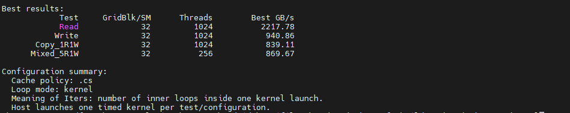

- `cg`:
  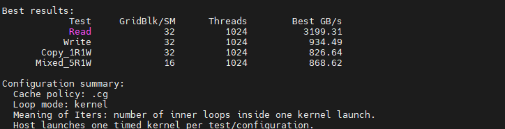

观察发现：
  - 在 READ 测试中，无论采用 `cs`, `cg` 和 `cv`，测得的 DRAM 实际带宽均超出其物理带宽上限，这不合常理，表明存在缓存干扰。
  - 此外，`cg` 测得的带宽显著高于 `cs`，证明 `cs` 的“优先逐出”（evict-first）缓存策略确实在生效。

结论：**为了避免缓存干扰 DRAM 带宽测量，测量 DRAM 带宽必须 `launch`**。


## 测量结果

`cs` + `launch` 配置下，warmup_iters 为 0，measured_iters 为 10。测得结果：

- scalar float

  

- vector float4
  
  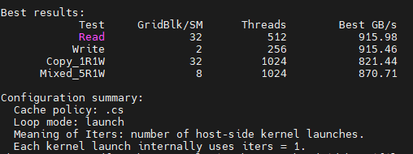

可见，两者的带宽差距都不大。根据 [RTX 5080 GPU 架构白皮书](https://images.nvidia.cn/aem-dam/Solutions/geforce/blackwell/nvidia-rtx-blackwell-gpu-architecture.pdf)，其 DRAM 物理带宽为 960 GB/s。实测带宽已接近该物理带宽，说明此时性能瓶颈主要在于物理带宽限制。

---

# 结果分析

分析 scalar float 与 vector float4 在单次搬运数据量相差四倍的情况下，为何 DRAM 实测带宽却依然接近。

首先引出 Little's Laws，然后进行结果分析。

## Little's Laws

Little’s Law（利特定律）的形式是

$$
 N = \lambda \cdot T 
$$

其中：

- $ N $：系统中的平均在途任务数；
- $ \lambda $：吞吐率；
- $ T $：平均停留时间，也就是延迟。

映射到内存系统：

- $ N $：在途内存请求数量，或者在途字节数；
- $ \lambda $：内存吞吐率，也就是带宽；
- $ T $：内存访问延迟。

所以：

$$
 \text{in-flight bytes} = \text{bandwidth} \times \text{latency} 
$$

也就是：

$$
 N_{\text{bytes}} = B \cdot L 
$$

如果你想达到峰值带宽 $ B $，就必须维持 $ B \cdot L $ 这么多在途数据。$ B \cdot L $ 常称为***延迟带宽积***[^3]。

[^3]: 可以把内存系统想象成一条管道。带宽 $B$ 为管道每秒流多少水；延迟 $L$ 为水从入口到出口要留多久；$B \cdot L$ 则是为了让管道出口满速出水，管道中必须已经装着多少水。<br>
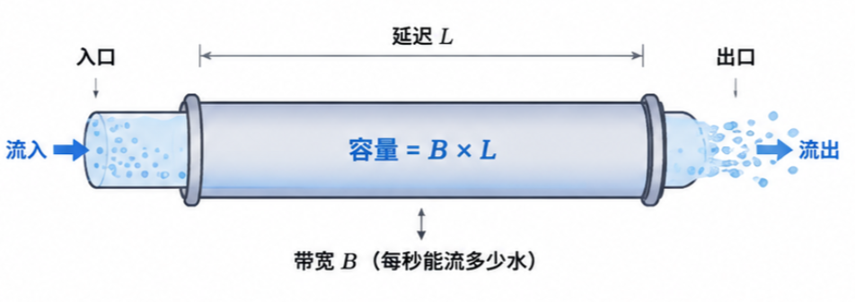

## 结果分析

以 READ 最优配置为例：
- 每个 SM 总分配的 block 数 GridBlk/SM = 32
- 每个 block 的线程数 Threads/block = 512
- Best = 907.99 GB/s

GPU 参数：

- 物理带宽 B_peak = 960 GB/s
- SM 数量 = 84
- GPU 频率 = 2947 MHz[^4]
- DRAM 访问延迟（相对于 GPU 频率） = 920 cycles

[^4]: GPU 频率和对应的 DRAM 访问延迟测量参考 [GPU 内存子系统分析--延迟分析](https://my-webpage-adu.pages.dev/posts/gpu%E9%80%86%E5%90%91%E5%B7%A5%E7%A8%8B/2026-05-14-gpu-%E5%86%85%E5%AD%98%E5%AD%90%E7%B3%BB%E7%BB%9F%E5%88%86%E6%9E%90-%E5%BB%B6%E8%BF%9F%E5%88%86%E6%9E%90/)

将物理带宽换算成每个 GPU core cycle 的带宽：

$$
B_{\text{peak,cycle}} = \frac{960 \times 10^9}{2.947 \times 10^9} \approx 325.75 \text{ bytes/cycle}
$$

也就是说，整个 GPU 想打满 960 GB/s，相当于每个 core cycle 要从 DRAM 返回：

$$
\approx 326 \text{ bytes/cycle}
$$

DRAM 延迟：

$$
L = 920 \text{ cycles}
$$

所以全 GPU 为了打满 960 GB/s，需要的 in-flight 数据量是：

$$
N_{\text{bytes}} = 325.75 \times 920 \approx 299690 \text{ bytes}
$$

说明，想让 960 GB/s 的 DRAM 管道持续满速流出数据，整个 GPU 至少要让 299690 bytes 的读请求同时处于 in-flight 状态。

SM 数量是 84，所以每个 SM 平均需要贡献：

$$
\frac{299690}{84} \approx 3568 \text{ bytes/SM}
$$

换句话说，虽然全 GPU 的 DRAM 延迟很高，但是从每个 SM 的角度看，想打满全局带宽，每个 SM 平均只需要维持大约 3568 Bytes 的 DRAM 请求在路上。

对于 scalar float，代码中一个 warp 的一次 load 指令对应的有效数据量为 $32 \times 4 = 128$ bytes（vector float4 则为 $512 \text{ bytes}$）。由于循环内部的访问模式是同一个 warp 的 32 个 lane 访问连续地址，因此可以实现内存合并访问，从而粗略认为：

$$
\text{每个 warp load instruction 访存} \approx 128 \text{ bytes}
$$

由于打满 DRAM 带宽要求每个 SM 平均需要贡献 $3568 \text{ byte}$，也就是:
$$
\frac{3568}{128} \approx 28\text{ 个 warp-level load 请求/SM}
$$

在我的最优配置中，每个 block 的 warp 数：

$$
\frac{512}{32} = 16 \text{ warps/block}
$$

平均到每个 SM 的 grid warp 数：

$$
32 \times 16 = 512 \text{ warps/SM}
$$

注意：这 512 warps/SM **不是**同时 resident 的 warps 数量，而是每个 SM 分到的总工作量。真正同时 resident 的 warp 数会受线程数、寄存器、block 上限等限制。满足 28 个 warp-level load 请求/SM轻而易举。

此外，我们找到个 $32\text{ 个 warp-level load 请求/SM}$ 的案例，它的 Read 案例实测带宽也应该接近物理带宽，结果如图：

- scalar float, 配置 `cg` 和 `launch`
  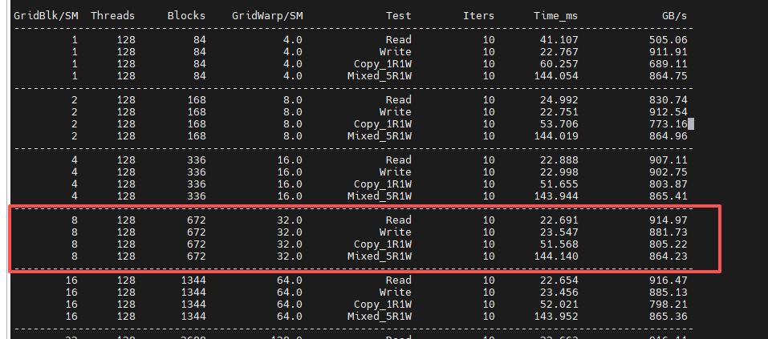

观察到：
- `Gridblk/SM < 14, Threads = 64` 时，Read 实测带宽变化幅度比较大。因为此时每个 SM 最多只能分配 16 个 warps，小于打满 DRAM 带宽需要 28 个 warps 的要求。


再次回顾 scalar float 的测量结果：


另一个现象是：**单独 READ 和单独 WRITE 的实测带宽最高，Mixed（5R1W）次之，而 Copy（1R1W）相比前三者显著下降。这表明底层读写资源存在共享，读写操作会相互竞争，并引入读写切换等调度开销。**


## 推论

- **白皮书中并未给出 L1 和 L2 的物理带宽数据。不过，若二者的物理带宽足够充裕，vector float4 的实测带宽应达到 scalar float 的 4 倍。若实际倍数远低于此，则表明 vector float4 已触碰到物理带宽上限**。

---

# 额外的测试

load 有 `.cv` 缓存操作符，所以额外增加一组测试： 

## `kernel`

这里展示 `kernel` + vector float4：

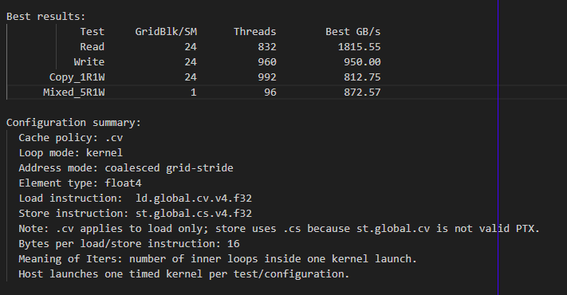

使用以下 ncu 命令分析：

```bash
ncu --metrics \
l1tex__t_requests_pipe_lsu_mem_global_op_ld.sum,\
l1tex__t_sectors_pipe_lsu_mem_global_op_ld.sum,\
lts__t_requests_srcunit_tex_op_read.sum,\
lts__t_sectors_srcunit_tex_op_read.sum,\
l1tex__t_sector_hit_rate.pct,\
lts__t_sector_hit_rate.pct \
--csv  --log-file  "result.csv" \
./bench_l1_cache
```

发现在 `kernel` 模式下，存在显著的 L2 缓存命中，但仍未能解决该问题。

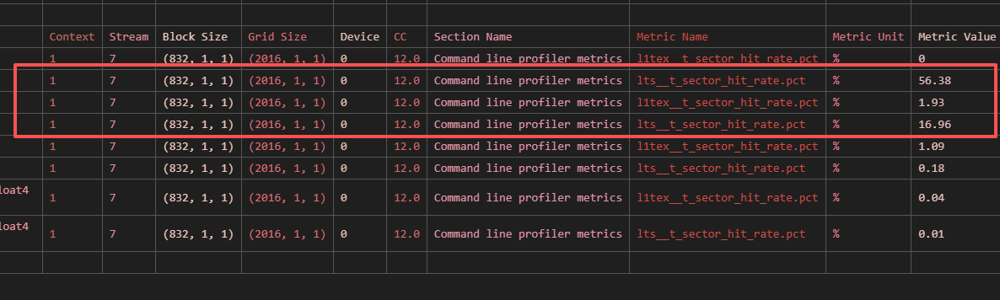

但是如果使用 `launch`， ncu 分析结果显示 L1 和 L2 缓存命中率几乎为 0。说明测量的正是 DRMA 带宽。

## `launch`

### `launch` + scalar float

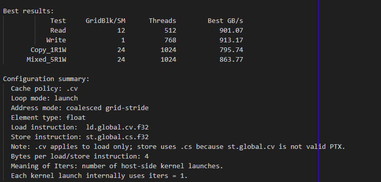

`GridBlk/SM: 12;  Threads: 512` 结果：
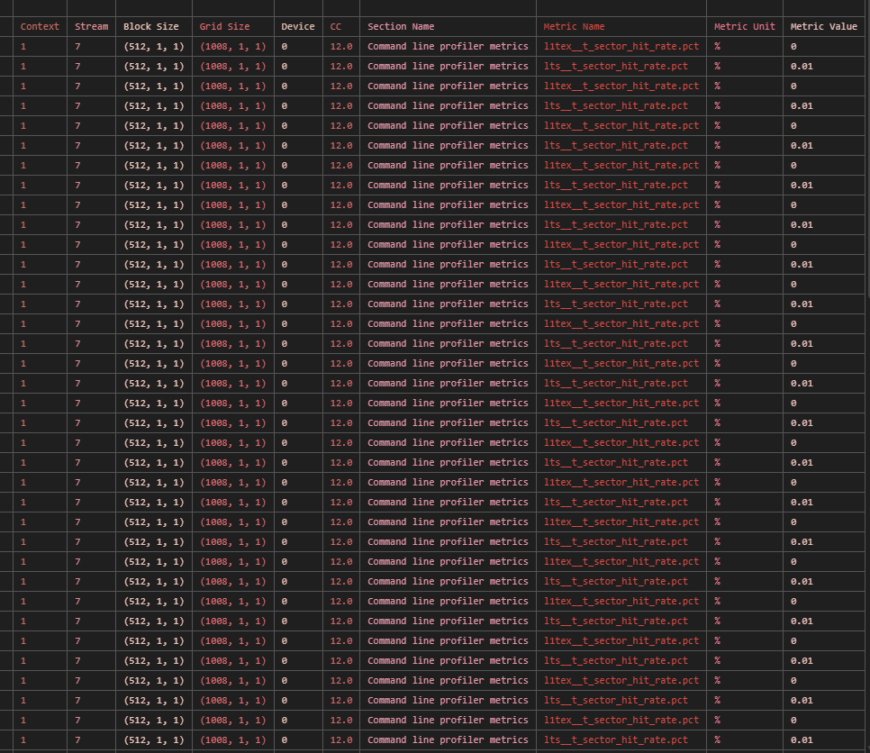

### `launch` + vector float4

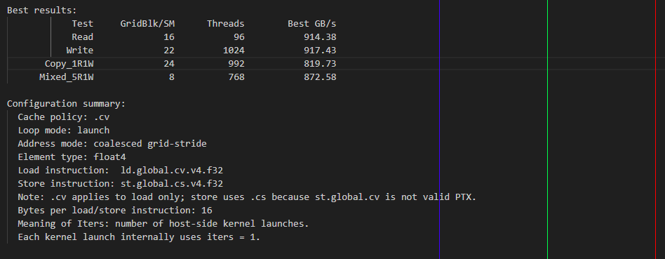

`GridBlk/SM: 16;  Threads: 96` 结果：
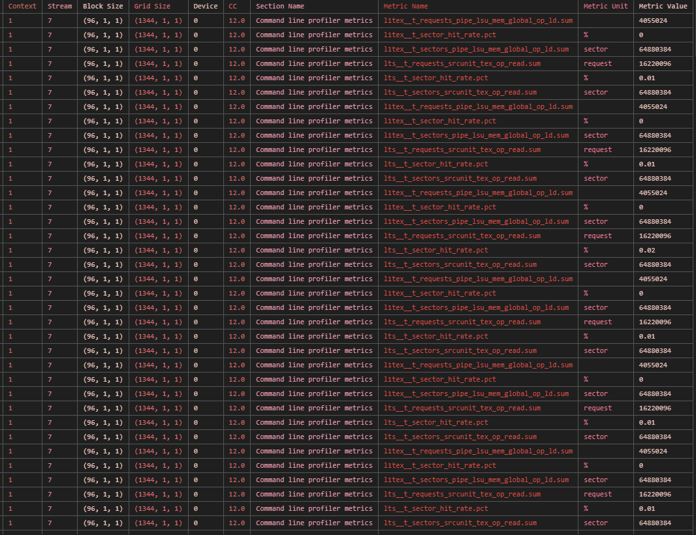


# 代码和脚本

<a name="all-code"></a>

[代码和脚本](attach/dram.zip)


