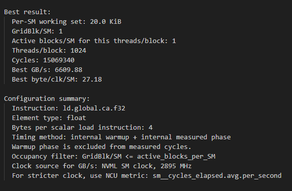
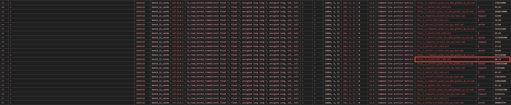
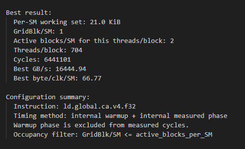
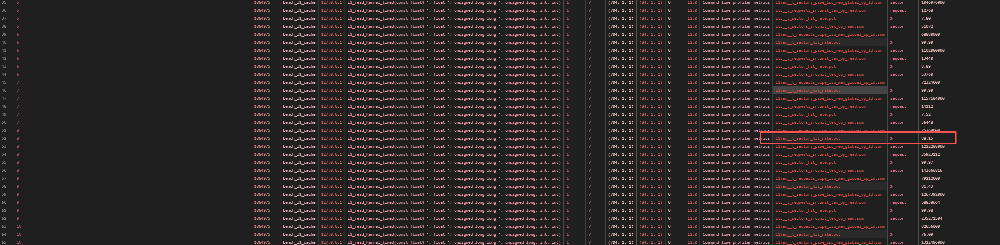

# 与 DRAM 带宽测量区别

L1 和 L2 缓存带宽的测量使用 device 端计时，方便只统计 kernel 内的 measured 阶段，不统计 warmup 阶段，代码如下：

```c++
__global__ void l2_read_kernel_timed(
    const float4* __restrict__ data,
    float* __restrict__ sink,
    unsigned long long* __restrict__ block_cycles,
    size_t elems,
    int warmup_iters,
    int measured_iters
) {
    size_t tid =
        static_cast<size_t>(blockIdx.x) * blockDim.x + threadIdx.x;

    size_t stride =
        static_cast<size_t>(gridDim.x) * blockDim.x;

    float acc = 0.0f;

    __shared__ unsigned long long start_cycle;

    // --------------------------------------------------------
    // Phase 1: warmup，不计时
    // --------------------------------------------------------
    for (int it = 0; it < warmup_iters; ++it) {
        for (size_t i = tid; i < elems; i += stride) {
            float4 v = load_cg_float4(data + i);
            acc += v.x + v.y + v.z + v.w;
        }
    }

    __syncthreads();

    if (threadIdx.x == 0) {
        start_cycle = clock64();   // <-------------- device 端计时方便只统计 measured 阶段而不统计 warmup 阶段
    }

    __syncthreads();

    // --------------------------------------------------------
    // Phase 2: measured，只统计这个阶段
    // --------------------------------------------------------
    for (int it = 0; it < measured_iters; ++it) {
        for (size_t i = tid; i < elems; i += stride) {
            float4 v = load_cg_float4(data + i);
            acc += v.x + v.y + v.z + v.w;
        }
    }

    __syncthreads();

    if (threadIdx.x == 0) {
        unsigned long long stop_cycle = clock64();
        block_cycles[blockIdx.x] = stop_cycle - start_cycle;
    }

    // 防止编译器优化掉 load。
    sink[tid] = acc;
}

```

特别注意，**这种情况下就必须使用单 wave**。因为这份 L2 测试代码是在 kernel 内部用 clock64() 计时：
```c++
if (threadIdx.x == 0) {
    start_cycle = clock64();
}

...

if (threadIdx.x == 0) {
    unsigned long long stop_cycle = clock64();
    block_cycles[blockIdx.x] = stop_cycle - start_cycle;
}
```

每个 block 记录的是这个 block 自己从 measured phase 开始到结束经历的 cycles。host 端再取所有 block 中的最大值：

```c++
unsigned long long max_cycles = 0;

for (int i = 0; i < blocks; ++i) {
    max_cycles = std::max(max_cycles, h_block_cycles[i]);
}
```
也就是说，最终用来算带宽的是所有 block 的最大单 block 执行时间。这在单 wave 下通常是合理的，因为所有 block 大致同时开始、同时结束。此时 max block cycles 大致等于 整个 kernel measured phase 的 wall time

# L1 带宽测量

选择的工作集大小为：

0. 4 KiB
1. 8 KiB
2. 16 KiB
3. 17 KiB
4. 18 KiB
5. 19 KiB
6. 20 KiB
7. 21 KiB
8. 22 KiB
9. 23 KiB
10. 24 KiB
11. 32 KiB

测量的结果为：

- scalar float





- vector float4




在 scalar float 和 vector float4 的情况下，都在 ID 为 8，即工作集大小为 22 KiB 时，L1 缓存命中率不再是几乎为 100%，说明此时已经发生了 L1 缓存竞争。


# L2 带宽测量

0. 4 KiB
1. 8 KiB
2. 16 KiB
3. 24 KiB
4. 32 KiB

xxx
