> 所有测试脚本和代码：[l2c-test-tangyuhan.zip](attach/l2c-test-tangyuhan.zip)


# NVIDIA RTX 5080 L2 缓存微体系结构测量

本文以 **NVIDIA GeForce RTX 5080** 作为实验平台，基于一套 CUDA 微基准测试程序，系统评估了流式多处理器（Streaming Multiprocessor, SM）至 L2 缓存的访问延迟、L2 有效容量、缓存行空间占用特性、硬件预取粒度提示、L2 持久缓存（Persisting L2 Cache）行为，以及访存与计算吞吐的饱和特性。实验方法借鉴并扩展了既有工作 [1] 中针对 NVIDIA L40 的非均匀 L2 延迟测量框架；GPU 架构参数参考 NVIDIA 官方技术文档 [2]；底层指令优化则基于 PTX ISA 9.3 [3] 实现。

需要特别指出的是，本文中所有访存请求均由 SM 发起。此外，拓扑实验中所称的“L2 slice”实质上为按固定地址步长选取的**地址探针**。鉴于公开资料尚未披露 RTX 5080 的 L2 物理分片数量、地址映射函数及片上互连拓扑，故某一地址探针并不等同于一个物理 L2 slice。

**局限性**：本文的所有推导结论均建立于访存延迟的测量分析之上，其准确性直接取决于延迟测量值的正确性。因此，实验平台须以串行方式执行测试程序，禁止并发负载，且在基准测试期间需独占该设备，以排除外部干扰。


**参考文献：**
- [1] [Non-Uniform L2 Cache Latency Across the Streaming Multiprocessors of an NVIDIA L40](https://arxiv.org/abs/2606.22588). 2026.
- [2] [NVIDIA RTX BLACKWELL GPU ARCHITECTURE](https://images.nvidia.com/aem-dam/Solutions/geforce/blackwell/nvidia-rtx-blackwell-gpu-architecture.pdf). 2026.
- [3] [Parallel Thread Execution ISA Version 9.3](https://docs.nvidia.com/cuda/parallel-thread-execution/index.html). 2026.

---

## 1. SM–L2 访问延迟测量

### 1. 运行脚本

1. 生成 SM->L2 延迟数据：

```bash
python3 scripts/run_topology.py --config config/topology_5080.json
```

2. 运行分析脚本：

```bash
python3 scripts/analyze_topology_enhanced.py results/raw/rtx5080_topology_20260731T035638Z/ --figures ../figures/topology --processed results/processed/topology --gpcs 7 --tpcs 42
```
  - `--gpcs` 和 `--tpcs` 对应 GPU 的 GPC 和 TPC 数量，请根据 NVIDIA 官方架构白皮书确认。

### 2. 测量原理

`l2_topology.cu` 用于量化各 SM 对一组地址探针执行依赖式全局内存加载（dependent global load）时的平均访存延迟。该程序在每个 SM 上仅部署一个线程块，且每个线程块仅由线程 0 执行测量。为避免多 SM 并发访问 L2 引发的资源争用，内核通过全局锁对各线程块的测量时段进行串行化，确保任一时刻仅有一个 SM 上的线程块 0 的线程 0 处于活跃测量状态，其余 SM 均处于等待状态。

在访存模式上，全局内存加载通过严格的数据依赖链构造：下一次加载的地址由前一次加载的返回值决定。该结构有效抑制了内存级并行与指令重排，使得测得的延迟主要反映串行依赖加载的可见延迟。需指出的是，计时结果仍包含加载指令本身、地址依赖更新以及循环控制等少量额外开销。

此外，加载指令采用 `ld.global.cg` 语义，其中 `.cg` 修饰符指定绕过 L1 数据缓存、直接在全局缓存层级（即 L2）进行访问，以排除 L1 命中对延迟测量的干扰。

`l2_topology.cu` 的实验设计包含三种测量模式：

1. **`single` 模式**：测量每个 SM 到单个固定地址的精确延迟。
2. **`chain` 模式**：测量所有 SM 对同一条随机地址链的平均延迟。
3. **`fingerprint` 模式**：测量每个 SM 到 $P$ 个不同地址的延迟向量，从而构建一个 $SM \times P$ 的延迟矩阵。

注意，若 `single` 模式对多个地址进行逐点测量，且这些地址恰好与 `chain` 模式所访问的随机地址链中的地址相同，则各 SM 在 `single` 模式下对多个地址测得的延迟取平均，应与 `chain` 模式的平均延迟一致。为了验证这一点，计算 single 模式与 chain 模式各个 SM 平均延迟的 Pearson 相关性（最高为 1，代表完全线性相关），结果如 [topology_stats.json](../anc/results/processed/topology/topology_stats.json) 中 `cross_experiment_r=0.9999983635034929`，说明两种模式得到的各个 SM 平均延迟近乎完全线性相关，符合预期。

### 3. 主要结论分析

#### 3.1 SM 相关的非均匀访问延迟

统计各个 SM 到 L2 的平均延迟，并画出延迟轮廓。如下图所示，观察到，延迟轮廓在 SM 标识符的前、后两个区间之间表现出很强的相似性。这一现象支持 GPU 中所有 SM 的物理布局可能符合**双半区结构假设**，即芯片可能被物理划分为两个完全对称的区域。


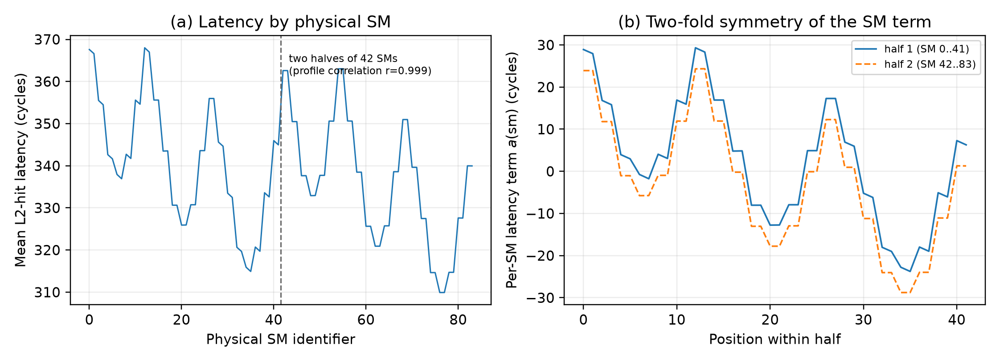

> **结论：** 5080 GPU 上的 L2 依赖加载延迟呈现与双半区组织一致的重复轮廓，推测 SM 的真实物理布局可能存在对称结构。但是对于 SM 数量无法均分为两组的 GPU，此类对称性结果预计不复现。

#### 3.2 加性 NUCA 模型

为区分 SM 与地址探针对延迟的独立贡献，分析脚本使用 **加性非均匀缓存访问模型（Additive Non-Uniform Cache Access model, Additive NUCA model）**。对于延迟矩阵 $L_{ij}$，其中 $i$ 表示 SM，$j$ 表示地址探针，定义

$$
\mu = \overline{L}, \qquad
a_i = \overline{L}_{i\cdot}-\mu, \qquad
b_j = \overline{L}_{\cdot j}-\mu,
$$

并以

$$
\widehat{L}_{ij}=\mu+a_i+b_j
$$

预测每个 SM–地址组合的延迟。$a_i$ 表示 SM 主效应，$b_j$ 表示地址探针主效应，残差 $L_{ij}-\widehat{L}_{ij}$ 则表示模型未能解释的 SM–地址交互及测量扰动。

模型的决定系数为

$$
R^2=1-\frac{\sum_{i,j}(L_{ij}-\widehat{L}_{ij})^2}
{\sum_{i,j}(L_{ij}-\mu)^2}.
$$

本次数据上的 $R^2=0.9973$，且实测值与模型预测值基本沿对角线分布。这表明当前延迟矩阵的大部分变异可以由 SM 主效应和地址探针主效应的线性叠加解释，SM–地址交互相对于总变异较弱。该结果验证了加性分解作为延迟描述模型的有效性，但高 $R^2$ 并不能证明片上网络不存在拥塞、特殊路由或其他微体系结构机制；它只说明这些因素没有在当前实验条件下形成显著的非加性交互。

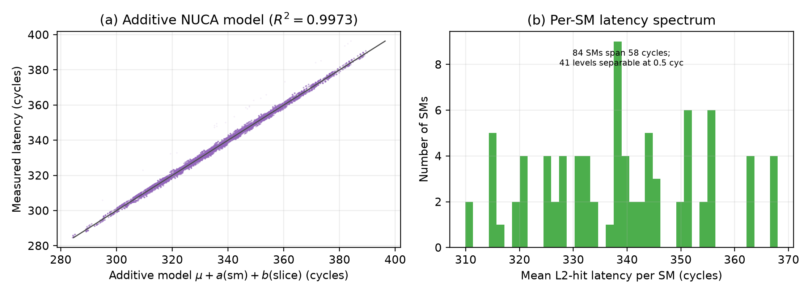

> **结论：** 5080 GPU 内 SM 与地址探针各自具有稳定的延迟主效应，加性 NUCA 模型能够较好地描述二者的组合；模型拟合结果不等同于对具体物理路由机制的唯一解释。

#### 3.3 TPC/GPC 候选分组

分析脚本首先依据依赖加载延迟矩阵中延迟的相似性，将 SM 强制分成已知数量的 TPC 候选组；随后在给定 GPC 和 TPC 数量的约束下，对 TPC 级特征执行容量受限聚类。

图中标注的 `confidence` 实际是候选 GPC 分组在每 SM 平均延迟上的方差分析 F 统计量，即组间离散程度与组内离散程度之比。该值较大说明所构造分组在当前特征上分离明显，聚类结果越可信。此时结果为 `confidence = 361.42`，说明聚类结果高度可信。

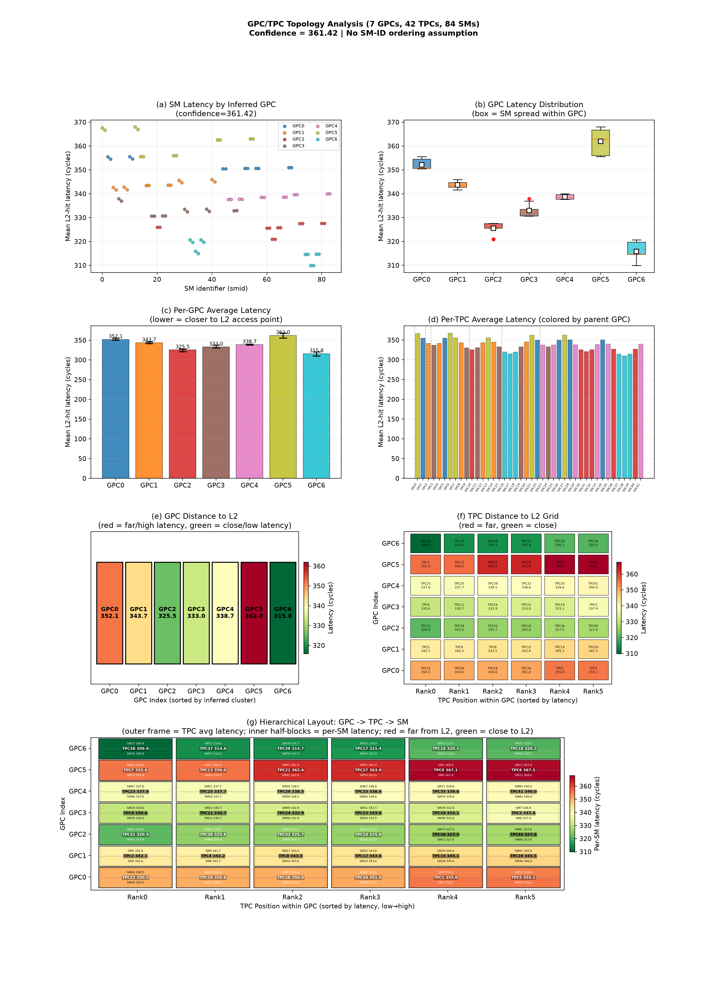

> **结论：** 5080 GPU 通过延迟矩阵能够构造内部一致、分离明显的 TPC/GPC 候选分组，可用于提出拓扑假设。

#### 3.4 L2 地址周期性模式分析

自相关分析可用于判别时域信号中是否蕴含周期性结构。对于理想周期信号，其自相关函数在低置信区间外呈现显著峰值，峰值间隔即对应信号周期；对于纯噪声信号，除零滞后处的峰值外，其余峰值均落入置信带内，表明不存在周期性。即便信号被强噪声污染，自相关分析仍可能检出显著峰值（尽管周期估计可能失真），但足以判断信号中是否蕴含某种周期性成分，如下图所示。

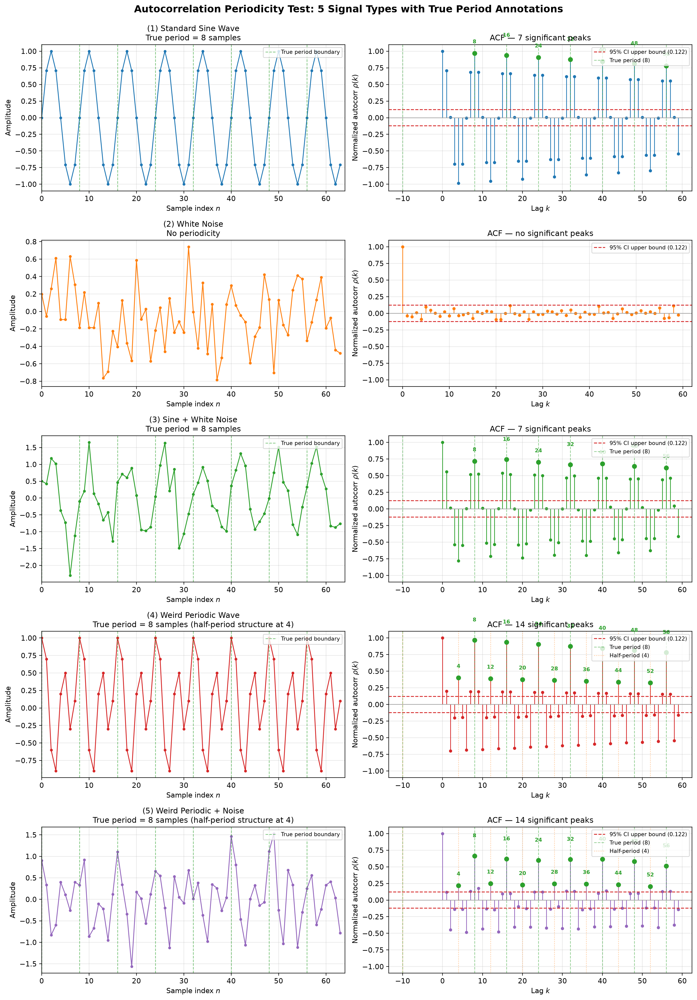


基于上述原理，本文对地址探针延迟序列的主效应项进行自相关分析，旨在检测地址到 L2 slice 的映射中是否存在周期性模式，进而推断 128B 偏移的探针地址在 L2 slice 间是否遵循某种确定性的交错排布规律。结果如下图所示。分析表明，自相关函数在低置信带外存在显著峰值，证实延迟序列中确实存在某种周期性结构；然而，相邻峰值间隔不相同，故无法根据峰值位置准确判定具体周期值。此外，周期性的存在仅表明地址映射遵循某种确定性的分片规律，尚不足以区分该规律源于哈希函数还是其他周期性映射策略。

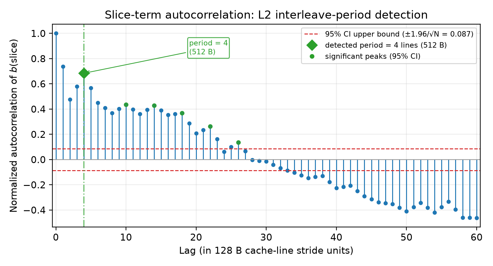

> **结论**：延迟序列的周期性特征表明，地址到 L2 slice 的映射并非均匀随机，而是遵循某种具有周期性的地址映射规律；但仅凭延迟信息无法区分该规律具体源于哈希函数还是其他映射策略。

---

## 2. L2 缓存容量测量

### 1. 运行脚本

1. 生成 SM->L2 延迟数据：

```bash
python3 scripts/run_experiments.py --config config/pilot_5080.json
```

2. 运行分析脚本：

```bash
python3 scripts/analyze_capacity.py results/raw/rtx5080_l2_capacity_pilot_20260731T080810Z/l2_latency.csv --figures ../figures/capacity_pilot --processed results/processed/capacity_pilot
```

### 2. 测量原理

`l2_latency.cu` 旨在量化单个 SM 上单个线程执行随机指针链依赖加载时的访存延迟。该程序通过调节工作集大小，系统测量 L2 命中与 L2 未命中状态下的延迟差异，以刻画缓存层次的行为特征。此外，该程序利用 PTX L2 预取指令修饰符，评估不同预取粒度对依赖加载延迟的影响。具体而言，加载指令采用 `ld.global.cg.L2::xxB` 语义，其中 `xxB` 用于向硬件声明 L2 预取粒度。需要指出的是，该修饰符仅为编译器向硬件发出的预取提示，其实际行为取决于硬件的具体实现，并不保证一定生效。

### 3. 主要结论分析

下图给出了工作集递增时，单个 SM 上单个线程执行随机指针链依赖加载的平均访存延迟测量结果。延迟曲线呈现典型的双平台特征：在较小工作集下，延迟稳定于低水平平台，表明访存请求主要命中 L2；当工作集逼近标称 L2 容量时，延迟进入过渡区；随着工作集进一步增大，延迟跃升并稳定于更高平台，此时发生 L2 容量缺失，访存请求主要落入显存。该趋势符合由 L2 命中主导逐步转向容量缺失与显存访问主导的预期行为。


> **结论：** RTX 5080 的依赖加载延迟曲线在标称 L2 容量（64 MiB）附近出现由低延迟平台向高延迟平台的显著转折，验证了本实验对 L2 有效容量边界的识别能力。

---

## 3. 唯一缓存行占用缩放测试

### 1. 运行脚本

1. 生成 SM->L2 延迟数据：

```bash
python3 scripts/run_experiments.py --config config/tag_scaling_5080.json
```

2. 运行分析脚本：

```bash
python3 scripts/analyze_tag_scaling.py results/raw/rtx5080_l2_tag_scaling_20260731T110132Z/l2_latency.csv --figures ../figures/tag_scaling --processed results/processed/tag_scaling
```

### 2. 测量原理


该实验仍基于 `l2_latency.cu`，通过联合调节工作集大小与相邻地址探针间的访问步长，验证 L2 缓存占用取决于实际访问所覆盖的缓存行数量，而非分配但未实际访问的地址空间大小。

实验的核心逻辑在于：若 L2 以缓存行为分配与占用粒度，则当实际访问的缓存行总数相同时，延迟曲线应趋于一致。例如，设置两组对照：

- 第一组：步长为 128 B（每步恰好访问一个独立的缓存行），工作集为 2 MiB；第二组：步长为 256 B（每步间隔一个缓存行），工作集为 4 MiB。两组实验实际访问的缓存行总数均为 2 MiB / 128 B，因此若将第二组延迟数据按缓存行数量归一化（等效于将横轴缩放至原来的 1/2），两条延迟曲线应完全重合。

- 另一组对照将步长分别设为 128 B 与 64 B，工作集保持不变。由于 L2 缓存行大小为 128 B，64 B 步长下相邻探针通常落入同一缓存行，故实际占用的缓存行总数与 128 B 步长情形相同。因此，两条延迟曲线亦应一致。


### 3. 主要结论分析

如右图所示，将左图各延迟曲线按实际访问的缓存行数量进行归一化后，各曲线呈现高度一致性。该结果表明，L2 缓存占用由实际访问所覆盖的缓存行数量决定，而非由已分配但未实际访问的地址空间大小决定。

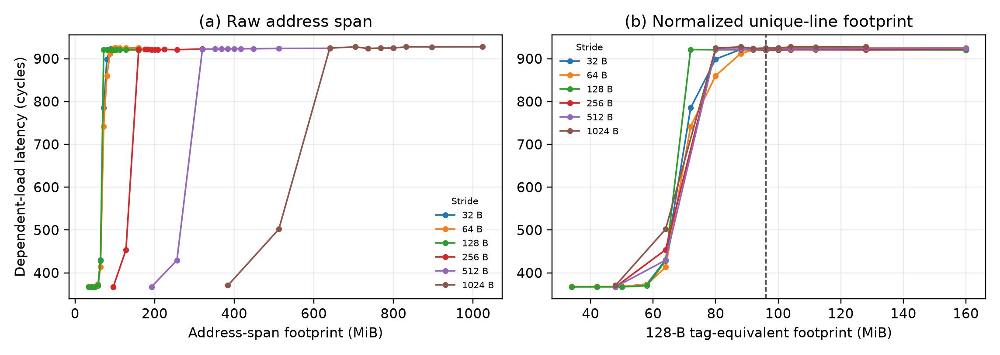


> **结论：** RTX 5080 的 L2 容量转折边界随实际访问的唯一 128 B 缓存行数量呈比例变化，而不随已分配但未访问的地址跨度变化。


---

## 4. L2 预取粒度提示测试

### 1. 运行脚本

1. 生成 SM->L2 延迟数据：

```bash
python3 scripts/run_experiments.py --config config/prefetch_granularity_5080.json
```

2. 运行分析脚本：

```bash
python3 scripts/analyze_capacity_enhanced.py results/raw/rtx5080_l2_prefetch_granularity_20260731T081422Z/l2_latency.csv --figures ../figures/prefetch_granularity --processed results/processed/prefetch_granularity
```

### 2. 测量原理

该实验仍基于 `l2_latency.cu`，通过调节 PTX L2 预取指令修饰符（`L2::xxB`），系统评估不同预取粒度提示对依赖加载延迟的影响。

### 3. 主要结论分析

在固定访问步长条件下，不同预取提示模式对应的延迟曲线具有相近的容量转折位置，未呈现随预取粒度增大而容量边界持续左移的趋势。相较之下，步长变化导致转折位置发生显著的比例性偏移。上述结果表明，本实验中容量边界仍由实际占用的唯一缓存行数量主导，预取粒度提示未改变 L2 的有效容量边界。

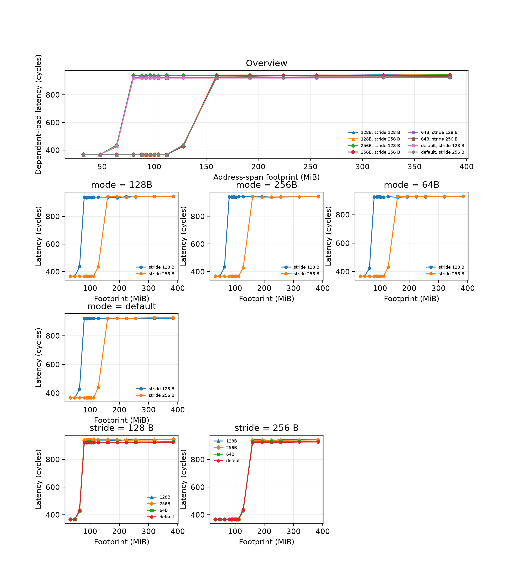


> **结论：** 在本次 5080 GPU 实验中，PTX L2 预取粒度提示未引起可辨识的容量边界偏移；上述修饰符本质上仍为硬件提示，其实际效果受具体访问模式制约，不宜据此推断其普遍失效。


---

## 5. 持久化 L2 缓存保留能力测试

### 1. 运行脚本

1. 生成 SM->L2 延迟数据：

```bash
python3 scripts/run_retention.py --config config/retention_hotset_5080.json

python3 scripts/run_retention.py --config config/retention_pilot.json
```

2. 运行分析脚本：

```bash
python3 scripts/analyze_retention_hotset_enhanced.py results/raw/rtx5080_l2_retention_hotset_20260801T103808Z/l2_retention.csv --processed results/processed/retention_hotset --figures ../figures/retention_hotset

python3 scripts/analyze_retention.py results/raw/rtx5080_l2_retention_pilot_20260801T105609Z/l2_retention.csv --processed results/processed/retention_pilot --figures ../figures/retention_pilot
```

### 2. 测量原理

`l2_retention.cu` 通过隔离的内存区域、差异化的访问模式及受控的执行时序，区分热集（hot set）与冷流（cold stream）行为。实验设计包含两类互补的 kernel：

- **热集 kernel**：在单个 SM 上仅分配一个线程，执行依赖式随机指针链加载，以测量 L2 访存延迟。热集数据被显式标记为 persisting 属性，优先驻留于持久化 L2 缓存区域，从而获得抗逐出（eviction-resistant）特性。
- **冷流 kernel**：启动多线程并行负载，通过大规模顺序访存流量冲刷 L2，进而模拟缓存"污染"效应。

持久化 L2 缓存是 L2 缓存的一个可编程分区，允许程序显式指定特定数据驻留其中以降低逐出概率。在 NVIDIA GPU 架构中，持久化 L2 缓存最高可配置为 L2 总容量的 50%。

### 3. 主要结论分析

在热集规模固定、冷流规模递增的条件下，默认策略的延迟迅速跃升至较高平台，而 Persisting 策略的延迟在整个测试范围内始终接近低延迟基线。上述对照结果表明，当热集规模处于有效预留范围内时，Persisting 机制可有效抑制冷流引发的 L2 缓存逐出。

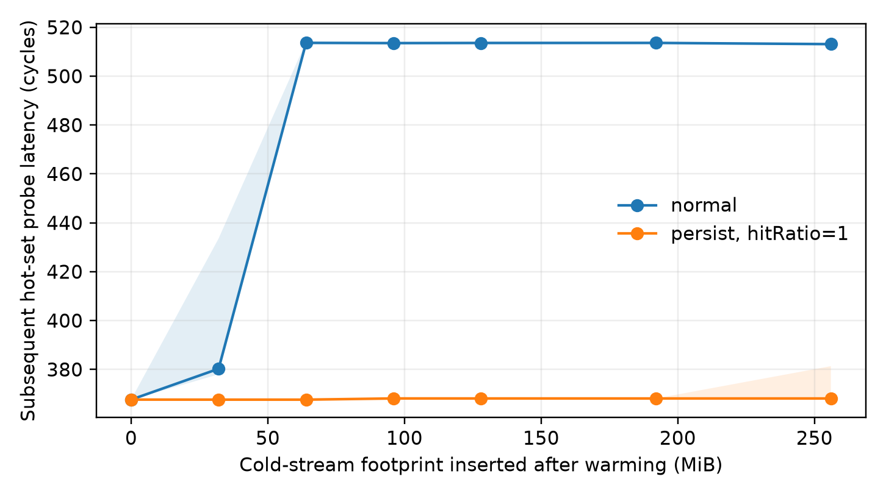

在冷流污染强度固定的条件下，默认策略下热集探测延迟随热集规模扩大呈逐步上升趋势。启用 Persisting 后，较小规模热集仍维持接近无污染基线的低延迟，表明访问策略窗口确实增强了这些缓存行抵御后续容量污染的能力。当热集规模超出设备所允许的有效范围后，Persisting 策略与默认策略的延迟曲线趋于重合，其保护优势逐渐丧失。

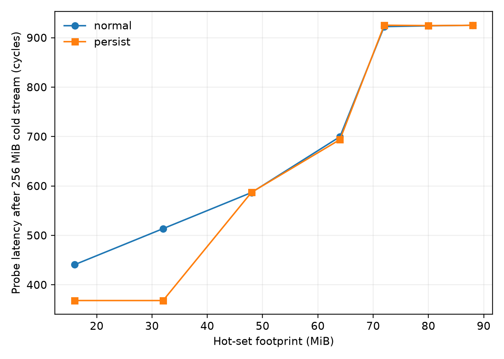


> **结论：** RTX 5080 的 Persisting L2 访问策略可在设备支持的预留容量范围内显著提升热集数据的驻留能力；一旦热集规模超出 L2 持久化缓存的物理容量上限，该保护机制即失效，热集数据同样面临逐出风险。

---

## 6. 内存带宽与计算吞吐饱和测量

### 1. 运行脚本

1. 生成 SM->L2 延迟数据：

```bash
python3 scripts/run_saturation.py --config config/roofline_saturation_5080.json
```

2. 运行分析脚本：

```bash
python3 scripts/analyze_saturation.py results/raw/rtx5080_roofline_saturation_20260801T111612Z/ \
        --processed results/processed/saturation \
        --figures ../figures/saturation
```

### 2. 测量原理

`memory_saturation.cu` 在 GPU 的全部 SM 上部署大量线程，每个线程在循环中对多个 float4 元素依次执行读-改-写（read-modify-write）事务，该事务由固定的 1 次全局内存读取、1 次全局内存写入以及可配置的 FMA（乘加）运算构成。

当 FMA 运算次数置零时，程序退化为纯内存带宽测试：线程不参与计算，SM 大部分时间处于等待全局内存数据返回的停滞状态，此时测得的吞吐率对应于 GPU 进行读-写事务的峰值内存带宽。随着 FMA 运算次数递增，负载同时对内存子系统与 FP32 计算单元施加压力，从而可用于评估 GPU 在计算-访存混合负载下的综合吞吐特性。

### 3. 主要结论分析

在低算术强度区间，FMA 运算次数的增加对有效读写带宽影响甚微，而计算吞吐率随算术强度呈近似线性增长。这表明执行时间仍由数据搬运主导，额外计算开销尚未构成主要瓶颈，此时 kernel 处于访存受限（memory-bound）区域。

随着算术强度进一步增大，有效读写带宽显著下降，而计算吞吐率逐渐趋于饱和。此时，FMA 依赖链的延长占据了更多的执行周期，数据搬运不再主导总执行时间，kernel 随之转入计算受限（compute-bound）区域。

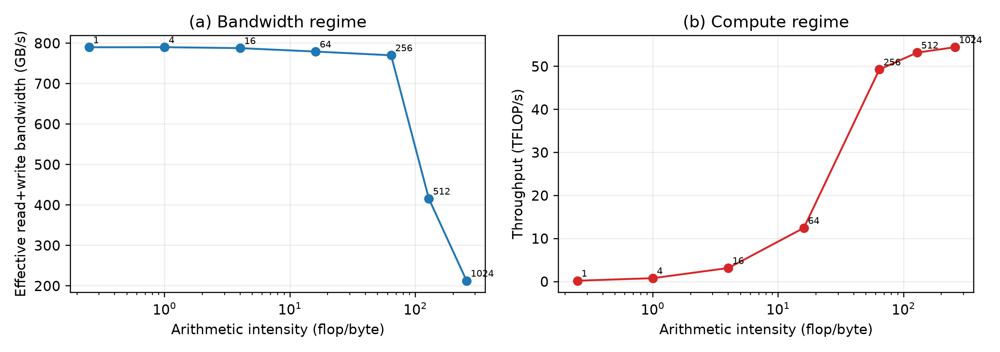


> **结论：** 该可调算术强度微基准清晰呈现了从访存受限到计算受限的过渡特征，可用于标定 RTX 5080 GPU 的实际可达内存带宽与 FP32 计算强度。

---

## 7. 基于 L2 延迟指纹的 SM 标识模型

### 1. 运行脚本

```bash
python3 scripts/run_topology.py --config config/oracle_5080.json
```

```bash
python3 scripts/train_oracle_enhanced.py results/raw/rtx5080_oracle_20260801T113627Z/ \
    --models ./models \
    --figures ../figures/train_oracle \
    --processed results/processed/train_oracle
```

### 2. 测量原理

该实验基于 `l2_topology.cu` 的 `fingerprint` 模式，为每个 SM 采集其至 $P$ 个不同地址探针的延迟向量，进而构建 $SM \times P$ 的延迟矩阵，作为各 SM 的"延迟指纹"（latency fingerprint）。在此基础上，训练监督式分类模型，使模型能够依据各 SM 的延迟指纹推断其对应的 SM 标识符。

#### 2.1 指纹采集

`fingerprint` 模式为每个 SM 测量一组固定地址偏移下的访存延迟。每个探针均采用自引用指针节点并通过 `ld.global.cg` 执行依赖式加载，且在同一个串行化轮次内依次完成预热与计时。单次 kernel 启动定义为一次 `shot`，其中包含所有 SM 的带标签样本；通过重复执行多个 shot，可观测延迟指纹在不同启动批次间的波动特征。

对于第 $s$ 个样本，其输入特征向量定义为

$$
\mathbf{x}^{(s)}=
\left[\ell_1^{(s)},\ell_2^{(s)},\ldots,\ell_N^{(s)}\right],
$$

式中，$\ell_k^{(s)}$ 表示第 $k$ 个地址探针的平均依赖加载周期，标签 $y^{(s)}$ 为测量线程实际驻留的 SM 标识符。模型旨在学习如下映射

$$
f:\mathbb{R}^{N}\rightarrow\{0,1,\ldots,M-1\}.
$$

#### 2.2 防止批次泄漏的数据划分

训练脚本首先对 `shot` 标识符进行去重与随机重排，随后按 shot 将数据集划分为训练集与测试集。同一次 kernel 启动中的所有 SM 样本仅被分配至其中一个集合，从而防止训练集数据泄露到测试集。

#### 2.3 分类模型与评价指标

分类模型采用随机森林，其通过 bootstrap 采样与随机特征子空间构建多棵决策树，并以各树输出的类别概率均值作为最终预测。实验采用以下三项评价指标：

1. **精确 SM 识别准确率（Exact SM Accuracy）**：预测标识符与真实 `%smid` 是否完全一致。
2. **Top-5 识别准确率**：真实 `%smid` 是否位于预测概率最高的 5 个标识符中。
3. **二分类组准确率（Binary-group Accuracy）**：仅判断 SM 属于标识符编号的前半区抑或后半区。

此外，为检验随机森林是否学习到超越简单模板匹配的判别性结构，实验同时引入以下两项基线方法：

1. **最近质心基线（Nearest Centroid Baseline）**：将测试样本的延迟指纹分配至欧氏距离最近的类别均值中心，作为非参数模板匹配基准。
2. **随机猜测基线**：以均匀分布随机选取 SM 标识符，作为理论下界基准。

### 3. 主要结论分析

最近质心基线（无需训练）的评估结果如 [oracle_eval.json](./results/processed/train_oracle/oracle_eval.json) 所示，其 `exact_acc` 集中分布于 0.7 附近。该结果表明，仅凭简单的最近质心基线方法即可有约 70% 的概率依据延迟指纹正确推断 SM 标识符。

进一步地，最近质心基线与随机森林的精确 SM 分类准确率均显著高于随机猜测基线（$\frac{1}{N_{\text{SM}}} = \frac{1}{84} \approx 0.012$），表明各 SM 的延迟指纹蕴含可区分的身份信息。

此外，随机森林的 Top-5 识别准确率与二分类组准确率均达到 100%。该结果说明，模型的误分类主要集中于少数延迟特征相似的候选 SM 之间，而非在全部 SM 类别中随机分布。

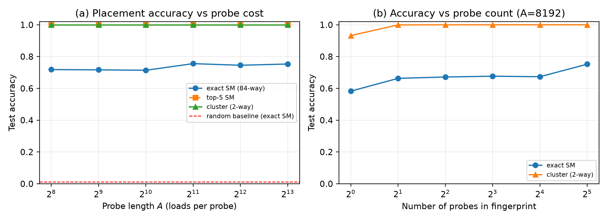


> **结论：** 
- L2 延迟指纹可在同设备上有效识别 SM 标识符，并能以较低探针成本稳定判别预设编号半区及 Top-5 候选集。
- 各 SM 的延迟指纹蕴含可重复且可区分的身份信息，为基于延迟的 SM 指纹识别提供了实验依据。
- 在 RTX 5080 平台上，随机森林的精确 SM 识别准确率相较于最近质心基线未呈现显著提升。
