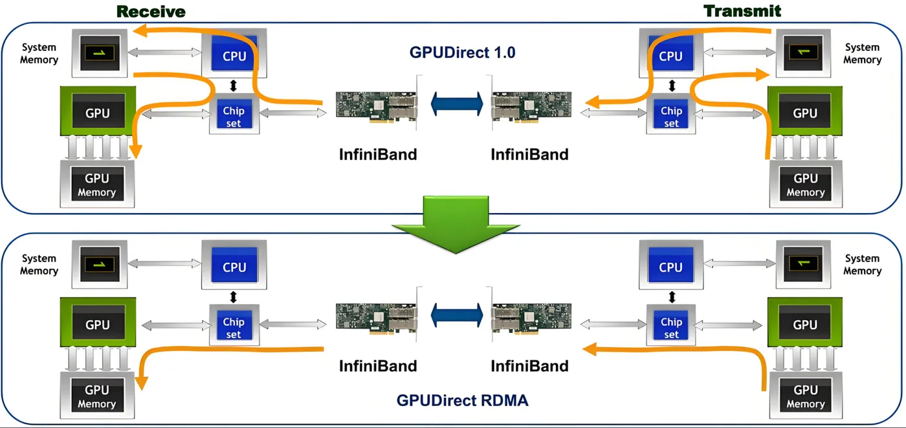
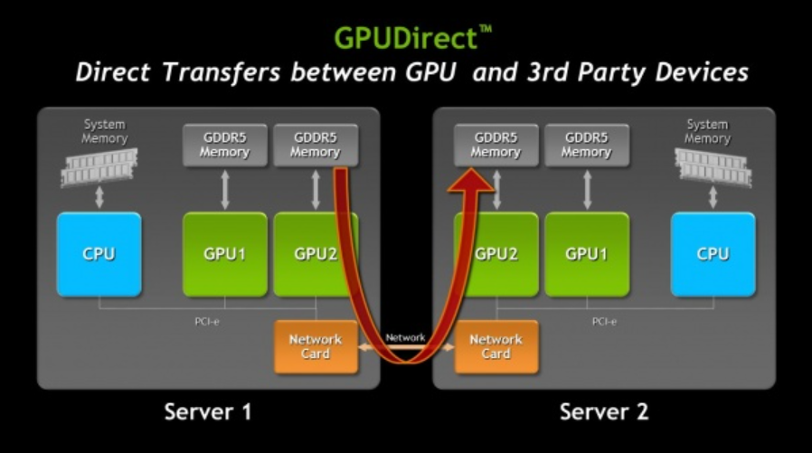
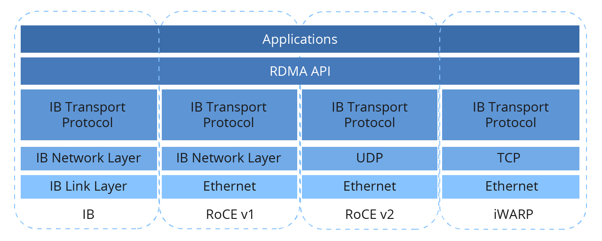
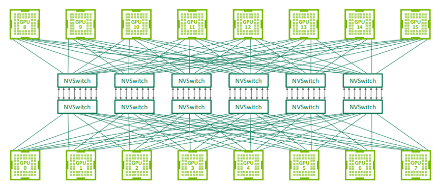
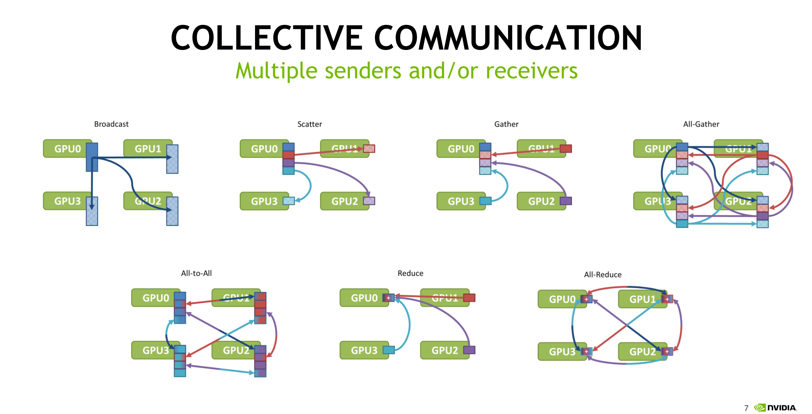
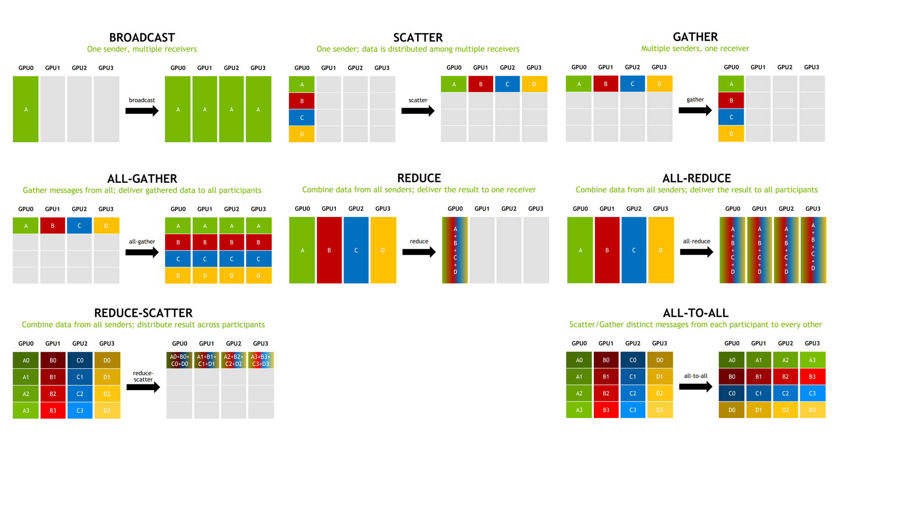
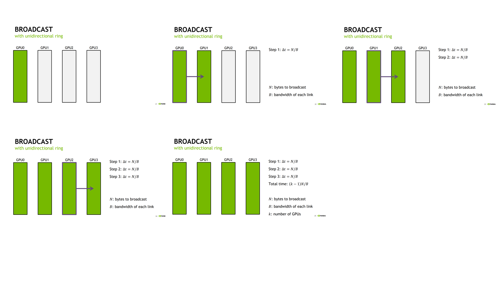
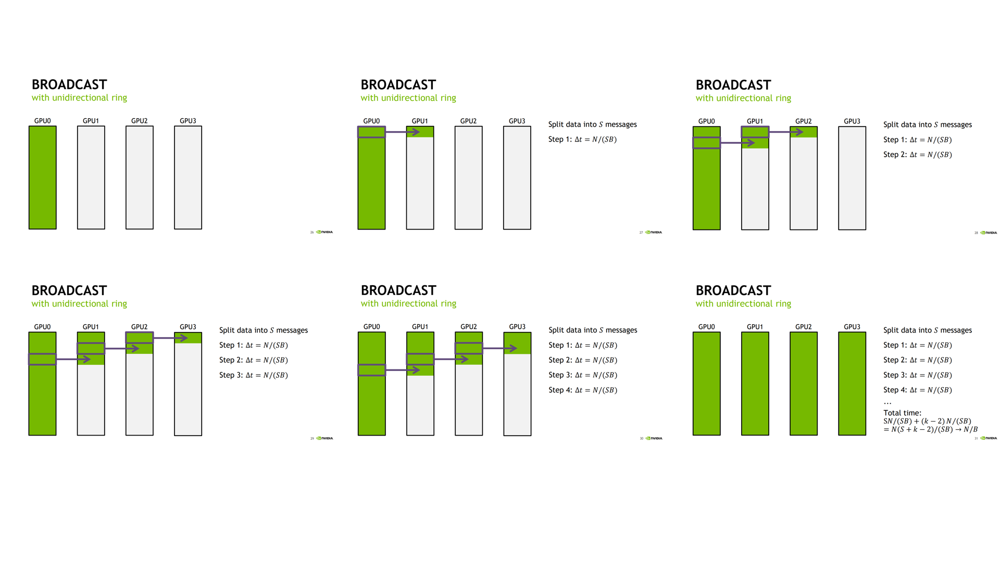
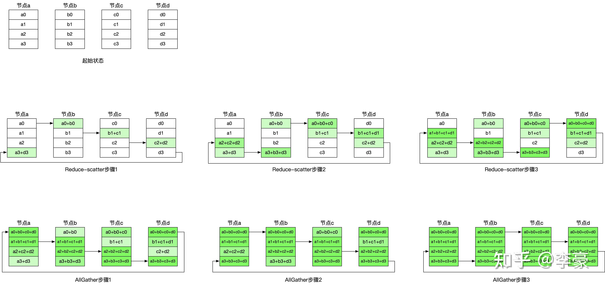

## 互联网络

AI 加速卡的互联介绍。

AI 加速卡的互联技术仍然还处于快速进步的过程。


## 重要 metrics

| 术语 | 全称 | 类别 | 定义 | 数值换算 |
|------|------|------|------|----------|
| **GB** | Gigabyte（吉字节） | 存储容量单位（十进制） | 1 GB = 10⁹ 字节 = 1,000,000,000 字节 | 1 GB ≈ 0.93 GiB<br>1 GiB ≈ 1.074 GB |  
| **GiB** | Gibibyte（吉比字节） | 存储容量单位（二进制） | 1 GiB = 2³⁰ 字节 = 1,073,741,824 字节 | 1 GiB = 1.074 GB |  |
| **Gbps** | Gigabits per second（吉比特每秒） | 数据传输速率单位 | 每秒钟传输 10⁹ 比特（b） | **1 GB/s = 8 Gbps**<br>1 Gbps = 0.125 GB/s | 

当表达为 GB 时，可能是 Gigabyte 或 Gibibyte，需要结合具体的上下文。


## Node 

一个 Node = 一台服务器。

一个 Node 内部可以包含若干个 CPU、Memory、GPU、NIC、存储、PCIE、NVSwitch 等组件。


## inter-node 通信

即不同 node 之间的通信。

术语：

- NIC: Network Interface Card, 网卡
- RDMA: Remote Direct Memory Access
- RoCE: RDMA over Converged Ethernet 





inter-node 通信分为传统和 RDMA 两种。

- 传统路径：GPU Memory -> CPU Memory -> NIC -> Network Switch -> NIC -> CPU Memory -> GPU Memory

- RDMA 路径：GPU Memory -> PCIe -> NIC -> Network Switch -> NIC -> PCIe -> GPU Memory

传统路径需要 CPU Memory 中转；而 RMDA 路径可通过 PCIe 直接访问 GPU Memory，避免 CPU Memory 中转。

图中的 InfiniBand 为 RDMA Network Switch 的一种技术。现有的 RDMA Network Switch 常用技术包括 InfiniBand、RoCE、iWARP。三者介绍如下：




- InfiniBand：专为 RDMA 构建，提供超低延迟、高吞吐量和无损传输。

- RoCE：将 RDMA 引入标准以太网，提供低延迟和低 CPU 开销，但需要无损以太网特性（PFC/ECN）才能达到最佳性能。

- iWARP：基于 TCP/IP 的 RDMA，内置可靠性，但与 InfiniBand 和 RoCE 相比，延迟较高、效率较低。


## Intra-node 通信

即 node 内 GPUs 之间的通信。

### NVLINK 和 NVSwitch

NVLink 实现 GPU - GPU 或者 CPU - GPU 的 P2P 通信。

然而，当一个 node（服务器） 内的 GPU 数量过多时，采用 P2P 的 NVLINK 不再合适，这个时候就引入 NVSwitch：



值得注意，一般讲的 Switch 都是用于 node 之间的通信，而 NVSwitch 是用于 node 内部，多个 GPUs （不包括 CPU）之间的通信。

但是 NVLink 和 NVSwitch 仍然还在进步，所以以后怎么样也说不准。

**定义对比**

| 项目 | NVLink | NVSwitch |
|------|--------|-----------|
| **定义** | 一种高速互联协议/物理通道，用于实现两个 GPU 或 CPU-GPU 之间的点对点（P2P）高速通信。 | 一种专用交换芯片，用于连接多个 GPU，通过 NVLink 协议实现大规模 GPU 的全互连（All-to-All）。 |

**维度对比**

| 维度 | NVLink | NVSwitch |
|------|--------|-----------|
| 类型 | 通信协议 / 物理链路 | 专用交换芯片 |
| 主要作用 | 实现设备间高速点对点通信 | 实现多 GPU 全互连拓扑 |
| 带宽单位 | 单链路带宽（如 50 GB/s） | 聚合带宽（可达 3.2 TB/s） |
| 设备连接数 | 通常 2 个 | 支持 8~16 个 GPU |
| 是否必需 | 是基础通信手段 | 在大规模多 GPU 系统中必需 |
| 出现场景 | 所有支持 NVLink 的 GPU | 主要在 DGX、HGX 等服务器平台 |


## 通信模式

### 各类集合通信模式





### Broadcast

情况 1：GPU 每次都把所有数据发送到下一个 GPU。

易得所有 GPUs 都获得数据所需要的时间为 `Total Time = (k-1)*N/B`



情况 2：将所有数据切分为 `S` 个 chunk ，GPU 每次都把单个 chunk 发送到下一个 GPU。

所有 GPUs 都获得数据所需要的时间分为`注入数据时间`和`流水线排空时间`两部分计算：

- `注入数据时间`：GPU0 需要把 S 个 chunk 依次送入 ring。每个 chunk 需要一个 step，每个 step 的时间是 `N / (S * B)`，所以注入数据时间是 `S × N / (S * B)`
- `流水线排空时间`: 当 GPU0 发完最后一个 chunk 之后，最后一个 chunk 还没有立刻到达所有 GPU。它还需要继续沿着 ring 往后传。对于 k 个 GPU, 最远的 GPU 是 `GPU(k-1)`。但是注意：最后一个 chunk 被 GPU0 发出的那一步，已经算在前面的 S steps 里面了。所以还需要额外等待 `(k - 1) - 1 = k - 2`

所以得到图中的所有 GPUs 都获得数据所需要的时间公式。

当划分的 `S` 个数很多时，即 `S>>K`, 此时该公式近似为 `Total Time -> N/B`

可见，情况 2 所需的时间为情况 1 的 `1/(k-1)`。



### All Reduce with unidirectional ring

All reduce with unidirectional ring 非常类似 Broadcast 情况 2。分为 Reduce-Scatter 和 All-Gather 两个阶段。




我们沿用 Broadcast 中的参数：

- `N`: bytes to operate
- `B`: bandwidth of each link
- `k`: number of GPUs

### 第一个阶段：Reduce-Scatter

对于 `k` 个 GPUs，Reduce-Scatter 需要 `k-1` 步。

每一步每个节点发送的数据大小是 `N/k`，对应的通信时间为 `N/(k * B)`

所以 Reduce-Scatter 的时间为 `(k - 1) * N/(k * B)`

### 第二个阶段：All-reduce

Reduce-Scatter 之后，每个节点只有一块归约后的结果。

例如 4 个节点时：

```
节点a 有 chunk0 的求和结果
节点b 有 chunk1 的求和结果
节点c 有 chunk2 的求和结果
节点d 有 chunk3 的求和结果
All-Gather 要把这些 chunk 分发给所有节点。
```

同样需要：`k - 1`步。

每一步每个节点发送：`N / k`
所以 All-Gather 的时间是： `(k - 1) * N / (k * B)`

所以，整个 All Reduce 的时间为 Reduce-Scatter 和 All-Gather 时间相加，即  `Total time = 2 * (k - 1) * N / (k * B)`.

当 k 很大时，近似有`Total time->2 * N / B`。

### Ring-All-Reduce v.s. 中心化节点
假设有一个中心节点负责聚合，其他 `k - 1` 个 GPU 都和它通信。

1. `k - 1` 个 GPU 把各自的 `N` bytes 数据发送给中心节点；
2. 中心节点聚合；
3. 中心节点把结果再发送回 `k - 1` 个 GPU。

中心节点需要接收： `(k - 1)N`

中心节点需要发送：`(k - 1)N`

所以中心节点总通信量是：`2(k - 1)N`

如果中心节点的总出口/入口带宽瓶颈等价为 `B`，则通信时间近似为：

`Total time -> 2 * (k - 1) * N / B`

可见，Ring-All-reduce 所需的通信时间中心化节点的 `1/(k-1)`。

