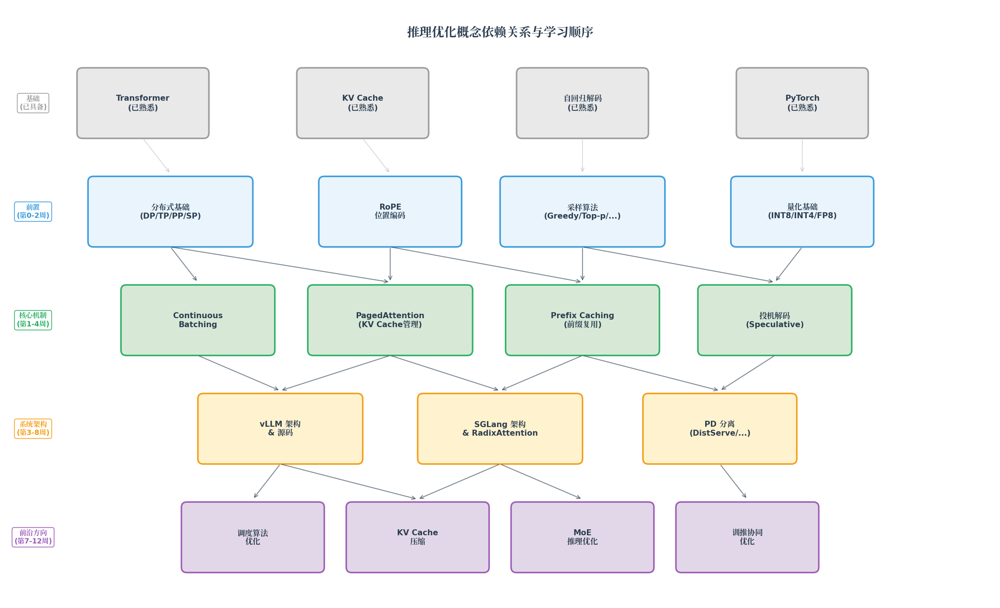
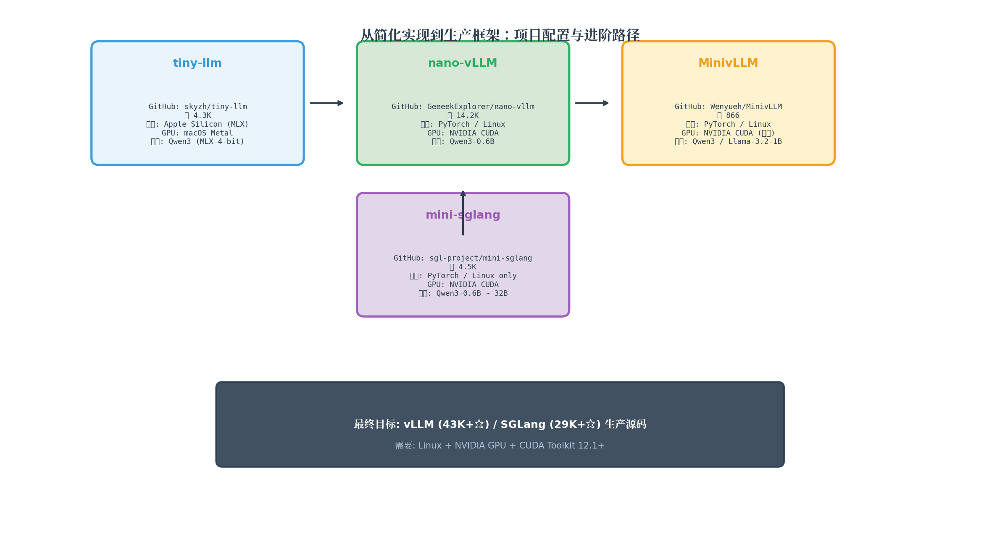
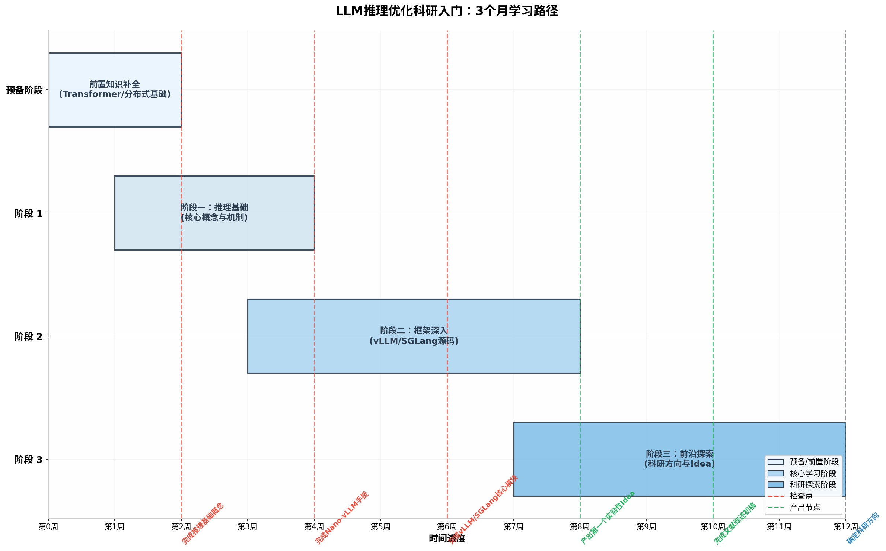

# LLM 推理优化科研入门：从核心机制到产出 Idea 的 3 个月学习路径

> **适用对象**：熟悉 Python/PyTorch、GPU 架构、decode-only Transformer 训练与自回归解码（含 KV Cache）；**无分布式系统基础**；**不熟悉 CUDA 编程**；希望以**科研为导向**入门 LLM 推理优化。  
> **目标**：在 **3 个月（12 周）** 内建立完整的推理优化知识体系，能够阅读前沿论文、理解开源框架源码，并**独立产出可验证的科研 idea**。  
> **算力约束**：单卡到 8 卡（A100/H100 级别），所有实验均可在此范围内完成。

---

## 执行摘要

你已经在 Transformer 基础层面有了扎实的功底——理解 decode-only 架构、KV Cache 机制、自回归解码流程。从这个起点出发，进入 LLM 推理优化领域，你需要建立的是一套围绕 **「如何让大模型推理更快、更省、更灵活」** 的系统化知识。本报告基于知乎「大猿搬砖简记」的技术文章导航、GitHub InfraTech 仓库，以及多个经过验证的开源项目，为你规划了一条从「已知基础」到「产出科研 idea」的完整路径。

**核心设计原则**：
1. **每个新概念必须先有前置介绍**，再配代码实践
2. **学习曲线平缓，不跳跃**——从简化实现项目开始，逐步深入到生产框架源码
3. **所有链接经过验证**——GitHub 仓库、论文 arXiv 链接、官方文档均提供完整 URL
4. **每个项目如实汇报配置要求**——操作系统、GPU 要求、模型大小，找不到的明确说明

| 阶段 | 时间 | 核心目标 | 关键产出 |
|------|------|----------|----------|
| **预备阶段** | 第 0-2 周 | 补全分布式基础 + 推理特有的概念（RoPE/采样/量化） | 理解 TP/PP/DP，能解释 RoPE 和 Top-p 采样原理 |
| **阶段一** | 第 1-4 周 | 掌握推理核心机制（Continuous Batching/PagedAttention/投机解码） | 完成 tiny-llm 课程 Week 1-2 |
| **阶段二** | 第 3-8 周 | 通过简化实现项目深入理解 vLLM/SGLang 架构 | 完成 nano-vLLM → MinivLLM → mini-sglang |
| **阶段三** | 第 7-12 周 | 阅读前沿论文，发现 open problem，产出科研 idea | 完成文献综述，确定研究方向 |

---

## 1. 概念依赖关系与学习顺序

**学习路径的核心逻辑**：你已有的 Transformer/KV Cache/自回归解码知识是地基。在此之上，你需要先理解**四个前置概念**（分布式基础、RoPE、采样算法、量化），然后才能深入**四个核心机制**（Continuous Batching、PagedAttention、Prefix Caching、投机解码）。掌握核心机制后，再进入**系统架构层**（vLLM/SGLang/PD 分离），最终抵达**前沿研究方向**。

---

## 2. 预备阶段：前置知识补全（第 0–2 周）

你的背景已经覆盖了 Transformer 训练与推理的基础，但还有四个知识缺口需要补齐。这四个概念彼此之间**相对独立**，可以在两周内并行学习。

### 2.1 分布式基础：理解 TP/PP/DP/SP

**为什么需要学**：vLLM、SGLang、TensorRT-LLM 等生产框架都内置了分布式支持。不理解 Tensor Parallelism（TP）、Pipeline Parallelism（PP）、Data Parallelism（DP），你将无法读懂这些框架的源码。对于**推理场景**，你只需理解基本原理和通信开销，不需要深入实现细节。

**概念介绍**：

| 并行策略 | 切分维度 | 核心通信操作 | 推理中的典型用途 | 适合模型大小 |
|----------|----------|-------------|-----------------|-------------|
| **Tensor Parallelism (TP)** | 层内（Attention/FFN 的 hidden dim） | AllReduce | 单卡放不下一个层时使用 | 7B-70B |
| **Pipeline Parallelism (PP)** | 层间（不同 transformer block） | Send/Recv | 模型层数太多，按层分配到不同卡 | 70B+ |
| **Data Parallelism (DP)** | 请求维度（不同请求到不同副本） | AllGather | 提升吞吐量，多副本处理不同请求 | 任意 |
| **Sequence Parallelism (SP)** | 序列维度（长上下文切分） | AllGather/ReduceScatter | 超长上下文（128K+）推理 | 任意 |
| **Expert Parallelism (EP)** | 专家维度（MoE 的不同 expert） | AllToAll | MoE 模型推理 | MoE 模型 |

**必读材料**：

| 材料 | 说明 | 链接 |
|------|------|------|
| **猛猿：大模型推理并行策略(DP/TP/PP/SP/EP)原理简介** | 中文社区最系统的推理并行策略入门 | [知乎导航页检索](https://zhuanlan.zhihu.com/p/654910335) |
| **猛猿：LLM推理并行优化的必备知识** | 进阶理解，覆盖通信量分析 | [知乎导航页检索](https://zhuanlan.zhihu.com/p/654910335) |
| **PyTorch DDP 官方教程** | 分布式数据并行的权威入门 | https://pytorch.org/tutorials/intermediate/ddp_tutorial.html |

**配套代码实践**：

| Notebook | 内容 | 难度 | 链接 |
|----------|------|------|------|
| `parallel_strategies.ipynb` | 大模型推理并行策略代码演示 | ⚡️ | https://github.com/CalvinXKY/InfraTech/tree/main/llm_infer |
| `collective_operations.ipynb` | 集合通信（AllReduce/AllGather 等）原理与实践 | ⚡️ | https://github.com/CalvinXKY/InfraTech/tree/main/deeplearning_framework |

### 2.2 RoPE：旋转位置编码

**为什么需要学**：RoPE（Rotary Position Embedding）是当前主流 LLM（Llama、Qwen、DeepSeek 等）的**标准位置编码方案**。理解 RoPE 的计算原理对于后续理解 Attention 优化（如 FlashAttention 的相对位置处理）和模型架构分析（如 MLA 的吸收矩阵）至关重要。

**概念介绍**：RoPE 的核心思想是将位置信息通过**旋转矩阵**注入到 Query 和 Key 向量中。对于位置 $m$ 的向量 $x$，RoPE 将其在二维子空间上旋转 $m \cdot \theta_i$ 角度，其中 $\theta_i$ 是预定义的旋转角度。这样做的好处是：**相对位置信息可以被 Attention 的 dot-product 自然捕获**——$\langle \text{RoPE}(q, m), \text{RoPE}(k, n) \rangle$ 只依赖于相对位置 $m-n$，而不依赖于绝对位置。

**必读材料**：

| 材料 | 说明 | 链接 |
|------|------|------|
| **猛猿：彻底搞懂 RoPE 计算原理 —— 从 1D 到 3D** | 最详细的 RoPE 中文解析，含图解 | [知乎导航页检索](https://zhuanlan.zhihu.com/p/654910335) |
| **RoPE 原始论文 (RoFormer)** | Su et al., 2021 | https://arxiv.org/abs/2104.09864 |
| **博客：Rotary Embeddings Explained** | 英文可视化解释 | https://blog.eleuther.ai/rotary-embeddings/ |

**配套代码实践**：

| Notebook | 内容 | 难度 | 链接 |
|----------|------|------|------|
| `rope_principle.ipynb` | RoPE 计算原理：从 1D 到 3D 的完整实现 | ⚡️⚡️⚡️ | https://github.com/CalvinXKY/InfraTech/tree/main/deepseek_v3 |

### 2.3 采样算法：从 Greedy 到 Top-p

**为什么需要学**：自回归解码的每一步都需要从模型输出的概率分布中**选择一个 token**。选择策略（采样算法）直接决定了输出的质量、多样性和确定性。理解这些算法是分析推理引擎调度逻辑的前提（不同采样参数会影响请求的输出长度分布，进而影响调度决策）。

**概念介绍**：采样算法分为**确定性**和**随机性**两大类：

**确定性采样**：
- **Greedy Decoding**：每一步选择概率最高的 token。简单、确定性强，但输出单一且容易陷入重复。
- **Beam Search**：维护 $k$ 个最优候选序列，每步扩展并保留 top-$k$。质量更高但计算量大。

**随机性采样**（生产环境更常用）：
- **Temperature Sampling**：对 logits 除以温度参数 $T$ 后再做 softmax。$T \to 0$ 趋近 greedy，$T$ 越大输出越随机。
- **Top-$k$ Sampling**：只从概率最高的 $k$ 个 token 中采样。
- **Top-$p$ (Nucleus) Sampling**：从概率累积和达到 $p$ 的最小 token 集合中采样。相比 top-$k$，能自适应调整候选集大小。
- **Min-$p$ (2025 新进展)**：保留概率 $\ge p \times p_{\max}$ 的 token。在高温度下比 top-$p$ 更能过滤低质量 token。

**必读材料**：

| 材料 | 说明 | 链接 |
|------|------|------|
| **猛猿：LLM推理采样(Sampling)常见知识概览** | 中文社区最系统的采样算法介绍 | [知乎导航页检索](https://zhuanlan.zhihu.com/p/654910335) |
| **论文：A Thorough Examination of Decoding Methods in the Era of LLMs** | 16 种解码方法的系统对比 | https://arxiv.org/abs/2402.06925 |

**配套代码实践**：

| Notebook | 内容 | 难度 | 链接 |
|----------|------|------|------|
| `LLM_sampling.ipynb` | LLM 推理采样算法的代码实现 | ⚡️ | https://github.com/CalvinXKY/InfraTech/tree/main/llm_infer |

### 2.4 量化基础：降低显存与计算

**为什么需要学**：大模型推理的最大瓶颈之一是**显存容量**。FP16 精度的 70B 模型需要约 140GB 显存，超出单卡容量。量化通过降低权重和激活的数值精度，可以将模型大小压缩到原来的 1/4 甚至 1/8。

**概念介绍**：量化分为**训练后量化（PTQ）**和**量化感知训练（QAT）**两大类。对于推理优化，PTQ 更常用：

| 量化方法 | 精度 | 压缩比 | 核心思想 | 适用场景 |
|----------|------|--------|----------|----------|
| **INT8 (W8A8)** | 权重 INT8, 激活 INT8 | 2× | 对称/非对称均匀量化 | 通用，精度损失极小 |
| **INT4 (W4A16)** | 权重 INT4, 激活 FP16 | 4× | GPTQ: 逐层二阶近似；AWQ: 保护重要权重通道 | 显存极度受限场景 |
| **FP8** | 权重 FP8, 激活 FP8 | 2× | 利用 Hopper/Blackwell 的 FP8 Tensor Core | H100/H200 原生支持 |
| **SmoothQuant** | W8A8 | 2× | 将量化难度从激活迁移到权重 | W8A8 的经典方案 |

**必读材料**：

| 材料 | 说明 | 链接 |
|------|------|------|
| **猛猿：大模型推理量化(Quantization)基础速览** | 中文量化入门最佳材料 | [知乎导航页检索](https://zhuanlan.zhihu.com/p/654910335) |
| **GPTQ 论文** | 最广泛使用的训练后 INT4 量化 | https://arxiv.org/abs/2210.17323 |
| **AWQ 论文** | 基于激活感知的保护性量化 | https://arxiv.org/abs/2306.00978 |

**配套代码实践**：

| Notebook | 内容 | 难度 | 链接 |
|----------|------|------|------|
| `quantization.ipynb` | 大模型推理量化的代码实践 | ⚡️ | https://github.com/CalvinXKY/InfraTech/tree/main/llm_infer |

### 2.5 CUDA 与 GPU 编程：最低限度了解

**为什么需要学**：你不需要成为 CUDA 专家，但需要理解 GPU 的**内存层次结构**（HBM ↔ L2 ↔ Shared Memory ↔ Registers）、**Warp 执行模型**、**memory-bound vs compute-bound** 的区别。对于科研，**Triton** 是比 CUDA 更好的入门选择——它更高级，vLLM/SGLang 中的许多自定义 kernel 都用 Triton 编写。

**必读材料**：

| 材料 | 说明 | 链接 |
|------|------|------|
| **Triton 官方教程** | OpenAI Triton 入门教程 | https://triton-lang.org/main/getting-started/tutorials/ |
| **猛猿：从啥也不会到 CUDA GEMM 优化** | 中文 CUDA 入门经典系列 | [知乎导航页检索](https://zhuanlan.zhihu.com/p/654910335) |
| **LeetCUDA** (xlite-dev) | 200+ CUDA Kernels 学习笔记 | https://github.com/xlite-dev/LeetCUDA |
| **CUDA Mode Lectures** (anmolgupt) | 19 讲 CUDA 课程 | https://github.com/anmolgupt/cuda_mode_lectures |
| **cuda-triton-learning** (shizhengLi) | 11 周学习计划 | https://github.com/shizhengLi/cuda-triton-learning |

---

## 3. 阶段一：推理核心机制（第 1–4 周）

### 3.1 第 1 周：Continuous Batching 与调度基础

**概念介绍**：传统的「静态批处理」要求一个 batch 中所有请求同时开始、同时结束，导致严重的**气泡问题**。Continuous Batching（也称为 Iteration-level Scheduling）的核心思想是：**每个 iteration（生成一个 token）结束后，都可以让新请求加入或让已完成请求退出**。

ORCA（OSDI'22）是首个实现 Continuous Batching 的系统。vLLM 在此基础上进一步引入了 PagedAttention 来管理 KV Cache。

**必读材料**：

| 材料 | 说明 | 链接 |
|------|------|------|
| **猛猿：vLLM源码解析2，调度器策略(Scheduler)** | 从零理解 vLLM 调度器 | [知乎导航页检索](https://zhuanlan.zhihu.com/p/654910335) |
| **ORCA 论文** | Continuous Batching 的奠基性工作 | https://arxiv.org/abs/2206.07146 |
| **Sarathi-Serve 论文** | Chunked Prefill，将长 prompt 切成 chunks 与 decode 混合执行 | https://arxiv.org/abs/2308.16369 |

**配套代码实践**：

| Notebook | 内容 | 难度 | 链接 |
|----------|------|------|------|
| `vllm_basic_scheduler.ipynb` | 手搓一个基础调度器（FCFS + preemption） | ⚡️⚡️ | https://github.com/CalvinXKY/InfraTech/tree/main/llm_infer |
| `chunked_prefill_and_flash_decoding.ipynb` | ChunkedPrefill 与 FlashDecoding 原理详解 | ⚡️⚡️ | https://github.com/CalvinXKY/InfraTech/tree/main/llm_infer |

### 3.2 第 2 周：PagedAttention 与 KV Cache 管理

**概念介绍**：KV Cache 的大小随 **batch_size × sequence_length × num_heads × head_dim** 线性增长。PagedAttention（vLLM, SOSP'23）将 **操作系统的虚拟内存管理思想** 引入 KV Cache：将 KV Cache 划分为固定大小的 **block**，通过 **block table** 映射逻辑块到物理块。

**必读材料**：

| 材料 | 说明 | 链接 |
|------|------|------|
| **猛猿：vLLM核心技术PagedAttention原理** | PagedAttention 的中文图解 | [知乎导航页检索](https://zhuanlan.zhihu.com/p/654910335) |
| **猛猿：vLLM源码解析3，块管理器BlockManager（上篇）** | Block allocation 逻辑 | [知乎导航页检索](https://zhuanlan.zhihu.com/p/654910335) |
| **猛猿：vLLM源码解析3，Prefix Caching（BlockManager下篇）** | Prefix Caching 的 hash 匹配机制 | [知乎导航页检索](https://zhuanlan.zhihu.com/p/654910335) |
| **猛猿：vLLM的prefix cache为何零开销** | Prefix Caching 的零开销原理 | [知乎导航页检索](https://zhuanlan.zhihu.com/p/654910335) |
| **PagedAttention 论文** (SOSP'23) | 原始论文 | https://arxiv.org/abs/2309.06180 |

**配套代码实践**：

| Notebook | 内容 | 难度 | 链接 |
|----------|------|------|------|
| `vllm_mem_snapshot.ipynb` | vLLM 显存可视化与管理详解 | ⚡️ | https://github.com/CalvinXKY/InfraTech/tree/main/llm_infer |
| `attention_mla_flops_with_prefix_cache.ipynb` | Prefix Cache 零开销分析 | ⚡️⚡️ | https://github.com/CalvinXKY/InfraTech/tree/main/llm_infer |

### 3.3 第 3 周：投机解码（Speculative Decoding）

**概念介绍**：自回归解码的**串行瓶颈**在于每个 token 的生成都必须等待前一个 token 完成后才能开始。投机解码的核心思想是**并行化这个过程**：用一个轻量级的「草稿模型」快速生成 $k$ 个候选 token，然后用目标模型一次性验证。验证通过 accept 的 token 可以直接输出，未通过的部分重新生成。**验证过程保持了目标模型的输出分布不变**（无偏加速）。

**必读材料**：

| 材料 | 说明 | 链接 |
|------|------|------|
| **猛猿：Speculative Decoding投机推理的原理与常见方案** | 中文社区最全面的投机解码介绍 | [知乎导航页检索](https://zhuanlan.zhihu.com/p/654910335) |
| **论文：A Comprehensive Survey of Speculative Decoding** (ACL'24) | 投机解码的系统综述 | https://arxiv.org/abs/2401.07851 |
| **EAGLE-1 论文** | 当前最先进的投机解码方案之一 | https://arxiv.org/abs/2401.15077 |
| **EAGLE-2 论文** | 特征级 speculation | https://arxiv.org/abs/2406.16858 |

**配套代码实践**：

| Notebook | 内容 | 难度 | 链接 |
|----------|------|------|------|
| `speculative_decoding.ipynb` | 投机推理的原理与常见方案 | ⚡️ | https://github.com/CalvinXKY/InfraTech/tree/main/llm_infer |

### 3.4 第 4 周：tiny-llm —— 从零构建推理系统

前三周你学习了推理引擎的核心理论机制，本周开始**通过代码将这些知识整合起来**。

**⚠️ 重要提示：平台兼容性**

tiny-llm 使用 **MLX 框架**，**专为 Apple Silicon (macOS) 设计**。如果你使用的是 NVIDIA GPU + Linux，**无法直接运行** tiny-llm 的代码。但 tiny-llm 的**在线书籍**中的算法讲解是通用的，你可以：
1. 阅读在线书籍学习算法原理（https://skyzh.github.io/tiny-llm/）
2. 将 MLX 代码逻辑改写为 PyTorch 版本在 NVIDIA GPU 上运行
3. 或者跳过 tiny-llm，直接进入 nano-vLLM（专为 NVIDIA GPU 设计）

**项目信息**：

| 属性 | 内容 |
|------|------|
| **GitHub** | https://github.com/skyzh/tiny-llm |
| **Stars** | 4.3K |
| **在线书籍** | https://skyzh.github.io/tiny-llm/ |
| **操作系统** | macOS (Apple Silicon) |
| **框架** | MLX (Apple 的机器学习框架) |
| **GPU** | Apple Silicon GPU (Metal) |
| **模型** | Qwen3 (MLX 4-bit 量化版本) |
| **代码语言** | Python 72.7%, C++ 20.9%, Metal 4.8% |

| 周次 | 主题 | 内容 |
|------|------|------|
| **Week 1** | 模型基础 | Attention → RoPE → GQA → RMSNorm → MLP → 模型加载 → 解码生成 → 采样 |
| **Week 2** | 推理系统 | KV Cache → 量化矩阵乘法 → Flash Attention 2 → Continuous Batching → Chunked Prefill |
| **Week 3** | 高级主题 | Paged Attention → MoE → 投机解码 → RAG → AI Agent |

**建议学习方式**（针对 NVIDIA GPU 用户）：

1. 阅读在线书籍的每个章节（https://skyzh.github.io/tiny-llm/）学习算法原理
2. 理解代码逻辑后，将 MLX API 调用改写为 PyTorch 版本
3. **重点完成 Week 1-2**，Week 3 可在后续阶段补完

---

## 4. 阶段二：简化实现项目与源码深入（第 3–8 周）

### 4.1 第 3-4 周：nano-vLLM —— ~1,200 行 Python 理解 vLLM 核心

**项目信息（已验证）**：

| 属性 | 内容 |
|------|------|
| **GitHub** | https://github.com/GeeeekExplorer/nano-vllm |
| **Stars** | 14.2K |
| **代码量** | ~1,200 行 Python (100% Python) |
| **安装命令** | `pip install git+https://github.com/GeeeekExplorer/nano-vllm.git` |
| **操作系统** | Linux（推荐），Windows 和 macOS 可能需适配 |
| **GPU** | NVIDIA CUDA（必需） |
| **框架** | PyTorch |
| **模型** | Qwen/Qwen3-0.6B（示例），支持其他 HuggingFace 模型 |
| **单卡/多卡** | 支持 Tensor Parallelism（多卡） |

**核心特性**：

| 特性 | 说明 |
|------|------|
| **PagedAttention** | 通过 block table 实现非连续的 KV Cache 存储 |
| **Prefix Caching** | 基于 hash 的块级去重，复用共享前缀 |
| **Tensor Parallelism** | Leader-worker 模式的多 GPU 支持 |
| **CUDA Graph** | Decode 阶段的 kernel 融合优化 |
| **Torch Compilation** | PyTorch compile 加速 |

**Benchmark 结果**（RTX 4070 Laptop 8GB, Qwen3-0.6B, 256 请求）：

| 指标 | nano-vLLM | vLLM |
|------|-----------|------|
| 吞吐量 | **1,434.13 tok/s** | 1,361.84 tok/s |

**建议学习路径**：

1. 安装并运行 `example.py` 和 `bench.py`，体验基本功能
2. 逐行阅读 `engine/scheduler.py`，理解调度循环
3. 阅读 `engine/block_manager.py`，理解 block allocation 逻辑
4. 阅读 `engine/attention.py`，理解 PagedAttention 的 CUDA kernel 调用

**高质量解析文章**：

| 文章 | 说明 | 链接 |
|------|------|------|
| **Deep Dive into nano-vLLM** | 逐行解析 PagedAttention 实现、block table 机制 | https://cefboud.com/posts/inside-llm-inference-engine-nano-vllm-explanation/ |
| **Nano-vLLM: The 1,200-Line Inference Engine** | BlockManager 和 Scheduler 代码解析 | https://www.morphllm.com/nano-vllm |

### 4.2 第 5 周：MinivLLM —— 带 Benchmark 的深入实践

**项目信息（已验证）**：

| 属性 | 内容 |
|------|------|
| **GitHub** | https://github.com/Wenyueh/MinivLLM |
| **Stars** | 866 |
| **基于** | nano-vLLM |
| **操作系统** | Linux（推荐） |
| **GPU** | NVIDIA CUDA（支持多卡） |
| **框架** | PyTorch |
| **模型** | Qwen3（随机初始化 demo）/ Llama-3.2-1B-Instruct |
| **安装** | `curl -LsSf https://astral.sh/uv/install.sh | sh && uv sync` |
| **运行** | `uv run python main.py` |
| **多卡** | 修改 `main.py` 中 config 的 `world_size` 为 n > 1 |

**独特价值**：提供了**三个阶段的 Attention 实现对比**：

| 实现 | Prefill 阶段 | Decode 阶段 |
|------|-------------|-------------|
| **PyTorch Standard** | O(N²) 内存，完整 Attention 矩阵 | 简单循环实现 |
| **Naive Triton** | O(N²) 内存，GPU kernel | 向量化实现 |
| **Flash Attention** | O(N) 内存，在线 softmax | 自定义 Triton Kernel |

**建议学习路径**：

1. 运行 `benchmark_prefilling.py`，对比三种 Attention 实现在 prefill 阶段的性能差异
2. 运行 `benchmark_decoding.py`，对比三种实现在 decode 阶段的性能差异
3. 阅读 `HowToApproachvLLM.md`，了解从零实现 vLLM 的完整路径
4. 阅读 Flash Attention 的 Triton kernel 实现，理解 tiling 策略

### 4.3 第 5-6 周：mini-sglang —— 理解 RadixAttention

**项目信息（已验证）**：

| 属性 | 内容 |
|------|------|
| **GitHub** | https://github.com/sgl-project/mini-sglang |
| **Stars** | 4.5K |
| **维护方** | SGLang 官方团队 |
| **代码量** | ~5,000 行 Python |
| **⚠️ 操作系统** | **Linux only** (x86_64 和 aarch64)。**Windows 和 macOS 不支持** |
| **GPU** | NVIDIA CUDA（必需） |
| **框架** | PyTorch |
| **CUDA Toolkit** | 需要安装，版本需与 driver 匹配 |
| **Python** | 3.10+（推荐 3.12） |
| **安装** | `git clone https://github.com/sgl-project/mini-sglang.git && cd mini-sglang && uv venv --python=3.12 && source .venv/bin/activate && uv pip install -e .` |
| **模型** | Qwen3-0.6B ~ Qwen3-32B（支持 Tensor Parallelism） |
| **单卡运行** | `python -m minisgl --model "Qwen/Qwen3-0.6B"` |
| **多卡运行** | `python -m minisgl --model "meta-llama/Llama-3.1-70B-Instruct" --tp 4 --port 30000` |
| **Docker 支持** | 提供 Dockerfile，需 NVIDIA Container Toolkit |

**核心特性**：

| 特性 | 说明 |
|------|------|
| **Radix Cache** | 基于 radix tree 的 KV Cache 复用 |
| **Chunked Prefill** | 减少长上下文服务的峰值内存 |
| **Overlap Scheduling** | 隐藏 CPU 调度开销 |
| **Tensor Parallelism** | 多 GPU 扩展 |
| **FlashAttention + FlashInfer** | 高性能 Attention kernel |

**配套学习材料**：

| 材料 | 说明 | 链接 |
|------|------|------|
| **猛猿：SGLang(一)：看不懂SGLang?先试试miniSGLang！** | SGLang 架构入门 | [知乎导航页检索](https://zhuanlan.zhihu.com/p/654910335) |
| **猛猿：SGLang(二)：手撕SGLang KV Cache核心逻辑：RadixAttention** | RadixAttention 详细解析 | [知乎导航页检索](https://zhuanlan.zhihu.com/p/654910335) |
| **猛猿：SGLang(三)：Profiling数据采集与分析入门** | 性能分析入门 | [知乎导航页检索](https://zhuanlan.zhihu.com/p/654910335) |
| `sglang_radix_attention.ipynb` | 手撕 RadixAttention 代码 | https://github.com/CalvinXKY/InfraTech/tree/main/llm_infer |
| `sglang_profiling_from_scratch.ipynb` | Profiling 数据采集与分析 | https://github.com/CalvinXKY/InfraTech/tree/main/llm_infer |
| **SGLang 论文** | 原始论文 | https://arxiv.org/abs/2312.07104 |
| **SGLang 官方文档** | 完整文档 | https://docs.sglang.ai/ |

### 4.4 第 6-8 周：深入生产框架源码

**vLLM 源码阅读路径**：

| 模块 | 文件路径 | 对应简化实现 | 阅读重点 |
|------|----------|-------------|----------|
| **Scheduler** | `vllm/v1/core/scheduler.py` | nano-vLLM `engine/scheduler.py` | FCFS + preemption + swapping |
| **KV Cache Manager** | `vllm/v1/core/kv_cache_manager.py` | nano-vLLM `engine/block_manager.py` | Block allocation、Prefix Caching |
| **Attention Backend** | `vllm/attention/` | MinivLLM Flash Attention | FlashAttention、FlashInfer 抽象层 |
| **Worker** | `vllm/v1/worker/` | nano-vLLM `engine/` | GPU worker 执行流程 |

**vLLM 官方资源**：

| 资源 | 链接 |
|------|------|
| GitHub | https://github.com/vllm-project/vllm (43K+ stars) |
| 官方文档 | https://docs.vllm.ai/ |
| V1 架构文档 | https://docs.vllm.ai/en/latest/design/arch_overview.html |

**猛猿 vLLM V1 系列文章**（在知乎导航页中可找到）：

| 文章 | 内容 |
|------|------|
| 图解 Vllm V1 系列 1：整体流程 | vLLM V1 的完整执行链路 |
| 图解 Vllm V1 系列 2：Executor-Workers 架构 | 多 worker 的协作机制 |
| 图解 Vllm V1 系列 3：KV Cache 初始化 | KV Cache 的预分配策略 |
| 图解 Vllm V1 系列 4：加载模型权重 | 模型加载与权重分布 |
| 图解 Vllm V1 系列 5：调度器策略 | Scheduler 的详细逻辑 |
| 图解 Vllm V1 系列 6：KVCacheManager 与 PrefixCaching | 缓存管理细节 |
| 图解 Vllm V1 系列 7：使用 AsyncLLM 做异步推理 | 异步 API 设计 |

**SGLang 源码阅读路径**：

| 模块 | 文件路径 | 对应简化实现 | 阅读重点 |
|------|----------|-------------|----------|
| **RadixAttention** | `python/sglang/srt/managers/radix_cache.py` | mini-sglang | Radix tree 的实现细节 |
| **Scheduler** | `python/sglang/srt/managers/scheduler.py` | mini-sglang | 与 vLLM scheduler 的对比 |
| **Attention** | `python/sglang/srt/layers/` | MinivLLM | Attention backend 的实现 |

---

## 5. 分离式推理架构（PD 分离）

**概念介绍**：Prefill-Decode（PD）分离是 2024-2025 年推理系统领域最重要的架构趋势。核心洞察是：Prefill 阶段计算密集，Decode 阶段内存带宽密集，将两者放到同一批 GPU 上会导致资源竞争和利用率低下。

**必读材料**：

| 文章/论文 | 核心贡献 | 链接 |
|-----------|----------|------|
| **猛猿：分离式推理架构1，从DistServe谈起** | PD 分离的动机与基本架构 | [知乎导航页检索](https://zhuanlan.zhihu.com/p/654910335) |
| **猛猿：分离式推理架构2，模糊分离与合并边界的chunked-prefills** | 模糊分离与合并边界 | [知乎导航页检索](https://zhuanlan.zhihu.com/p/654910335) |
| **猛猿：PD分离（一）：vLLM PD分离方案浅析** | vLLM 中 PD 分离的具体实现 | [知乎导航页检索](https://zhuanlan.zhihu.com/p/654910335) |
| **猛猿：PD分离（二）：vLLM PD分离KV cache传递机制详解与演进分析** | KV cache 传递机制 | [知乎导航页检索](https://zhuanlan.zhihu.com/p/654910335) |
| **DistServe 论文** (OSDI'24) | 首个系统性的 PD 分离方案 | https://arxiv.org/abs/2401.09670 |
| **Mooncake 论文** (Kimi) | 以 KVCache 为中心的分离架构 | https://arxiv.org/abs/2407.00079 |
| **猛猿：如何评价NVIDIA发布的大模型推理PD分离架构Dynamo** | NVIDIA Dynamo 分析 | [知乎导航页检索](https://zhuanlan.zhihu.com/p/654910335) |

---

## 6. 前沿方向与科研 Idea 生成（第 7–12 周）

### 6.1 前沿方向一：调度算法优化

| 论文 | 方法 | 核心贡献 | 链接 |
|------|------|----------|------|
| **Online Scheduling for LLM Inference with KV Cache Constraints** | 在线优化 + 竞争比分析 | 首个考虑 KV Cache 内存约束的调度理论框架 | https://arxiv.org/abs/2502.07115 |
| **Geometry-Aware Online Scheduling** | 几何感知调度 (SVF) | 将调度问题建模为体积最小化 | https://arxiv.org/abs/2606.22327 |
| **EWSJF** | 无监督聚类 + 学习 | 基于工作负载结构的自适应调度策略 | https://arxiv.org/abs/2601.21758 |

**科研切入点**：输出长度预测 + 调度联合优化；MoE 模型的专家感知调度。

### 6.2 前沿方向二：KV Cache 压缩

| 论文 | 方法 | 收益 | 链接 |
|------|------|------|------|
| **KIVI** (NeurIPS'24) | 2-bit KV 量化 | 内存减半 | https://arxiv.org/abs/2402.02750 |
| **KVComp** | 量化 + Huffman 熵编码 | 最高 83% 压缩率 | https://arxiv.org/abs/2509.00579 |
| **MatryoshkaKV** | 正交投影 + 知识蒸馏 | 可调的层次化压缩 | https://arxiv.org/abs/2410.14731 |
| **H2O** (NeurIPS'23) | Heavy-Hitter 保留 | 保留重要 token | https://arxiv.org/abs/2306.14022 |

### 6.3 前沿方向三：投机解码

| 论文 | 核心创新 | 链接 |
|------|----------|------|
| **EAGLE-1/2/3** 系列 | 特征级 draft head，2-6× 加速 | https://arxiv.org/abs/2401.15077 |
| **Suffix Decoding** (NeurIPS'25 Spotlight) | 基于后缀树，无需训练草稿模型 | 多源 |
| **Medusa** | 多个解码头并行预测 | https://github.com/FasterDecoding/Medusa |

### 6.4 前沿方向四：MoE 推理优化

| 论文 | 核心贡献 | 链接 |
|------|----------|------|
| **Semantic Parallelism** | 模型-数据协同调度减少 all-to-all | https://arxiv.org/abs/2503.04398 |
| **DeepSeek-V3 技术报告** | MLA + MoE 的极致优化 | https://arxiv.org/abs/2412.19437 |
| **猛猿：EPLB —— MoE 并行负载均衡** | 中文深度解析 | [知乎导航页检索](https://zhuanlan.zhihu.com/p/654910335) |

### 6.5 前沿方向五：训推协同

| 材料 | 说明 | 链接 |
|------|------|------|
| **猛猿：降低RL训推共卡开销 —— SGLang/vLLM的无缝切换** | 训推切换实现与分析 | [知乎导航页检索](https://zhuanlan.zhihu.com/p/654910335) |
| `switch_role_update_weights.ipynb` | 配套代码 | https://github.com/CalvinXKY/InfraTech/tree/main/llm_infer |

---

## 7. 必看论文清单

### 7.1 必读论文（奠基性工作）

| # | 论文 | 会议/年份 | arXiv 链接 |
|---|------|----------|-----------|
| 1 | **FlashAttention** | NeurIPS 2022 | https://arxiv.org/abs/2205.14135 |
| 2 | **FlashAttention-2** | 2023 | https://arxiv.org/abs/2307.08691 |
| 3 | **ORCA** | OSDI 2022 | https://arxiv.org/abs/2206.07146 |
| 4 | **PagedAttention** (vLLM) | SOSP 2023 | https://arxiv.org/abs/2309.06180 |
| 5 | **SGLang** | 2023 | https://arxiv.org/abs/2312.07104 |
| 6 | **A Survey on Efficient Inference for LLMs** | 2024 | https://arxiv.org/abs/2404.14294 |

### 7.2 强烈建议读

| # | 论文 | 方向 | arXiv 链接 |
|---|------|------|-----------|
| 7 | **MQA** | Attention 优化 | https://arxiv.org/abs/1911.02150 |
| 8 | **GQA** | Attention 优化 | https://arxiv.org/abs/2305.13245 |
| 9 | **DeepSeek-V2** (MLA) | Attention 优化 | https://arxiv.org/abs/2405.04434 |
| 10 | **Speculative Decoding Survey** | 投机解码 | https://arxiv.org/abs/2401.07851 |
| 11 | **DistServe** | PD 分离 | https://arxiv.org/abs/2401.09670 |
| 12 | **Sarathi-Serve** | 调度优化 | https://arxiv.org/abs/2308.16369 |
| 13 | **GPTQ** | 量化 | https://arxiv.org/abs/2210.17323 |
| 14 | **AWQ** | 量化 | https://arxiv.org/abs/2306.00978 |
| 15 | **SmoothQuant** | 量化 | https://arxiv.org/abs/2211.10438 |

### 7.3 前沿论文（2024-2026）

| # | 论文 | 方向 | 链接 |
|---|------|------|------|
| 16 | **Online Scheduling for LLM Inference** | 调度理论 | https://arxiv.org/abs/2502.07115 |
| 17 | **Geometry-Aware Online Scheduling** | 调度理论 | https://arxiv.org/abs/2606.22327 |
| 18 | **KVComp** | KV Cache 压缩 | https://arxiv.org/abs/2509.00579 |
| 19 | **Semantic Parallelism** | MoE 优化 | https://arxiv.org/abs/2503.04398 |
| 20 | **MatryoshkaKV** | KV Cache 压缩 | https://arxiv.org/abs/2410.14731 |
| 21 | **Taming the Titans** (Survey) | 综述 | https://arxiv.org/abs/2504.19720 |

---

## 8. 核心代码资源索引

### 8.1 简化实现项目配置汇总

| 项目 | GitHub | Stars | 操作系统 | GPU | 框架 | 模型 | 单/多卡 |
|------|--------|-------|----------|-----|------|------|---------|
| **tiny-llm** | https://github.com/skyzh/tiny-llm | 4.3K | **macOS (Apple Silicon)** | Apple GPU (Metal) | MLX | Qwen3 (MLX 4-bit) | 单卡 |
| **nano-vLLM** | https://github.com/GeeeekExplorer/nano-vllm | 14.2K | Linux（推荐） | NVIDIA CUDA | PyTorch | Qwen3-0.6B | 支持多卡(TP) |
| **MinivLLM** | https://github.com/Wenyueh/MinivLLM | 866 | Linux（推荐） | NVIDIA CUDA | PyTorch | Qwen3 / Llama-3.2-1B | 支持多卡 |
| **mini-sglang** | https://github.com/sgl-project/mini-sglang | 4.5K | **Linux only** | NVIDIA CUDA | PyTorch | Qwen3-0.6B ~ 32B | 支持多卡(TP) |

**⚠️ 重要提示**：
- **tiny-llm 专为 Apple Silicon 设计**，NVIDIA GPU 用户无法直接运行，但可阅读在线书籍学习算法原理（https://skyzh.github.io/tiny-llm/）
- **mini-sglang 仅支持 Linux**，Windows/macOS 不支持（依赖 Linux 特定的 CUDA kernel）
- 生产框架 **vLLM (43K+ stars)** 和 **SGLang (29K+ stars)** 均需要 **Linux + NVIDIA GPU + CUDA Toolkit 12.1+**

### 8.2 InfraTech Notebook（按学习顺序）

| 顺序 | Notebook | 配套文章 | 难度 | 链接 |
|------|----------|----------|------|------|
| 1 | `rope_principle.ipynb` | RoPE 计算原理 | ⚡️⚡️⚡️ | https://github.com/CalvinXKY/InfraTech/tree/main/deepseek_v3 |
| 2 | `LLM_sampling.ipynb` | LLM 推理采样 | ⚡️ | https://github.com/CalvinXKY/InfraTech/tree/main/llm_infer |
| 3 | `quantization.ipynb` | 推理量化基础 | ⚡️ | https://github.com/CalvinXKY/InfraTech/tree/main/llm_infer |
| 4 | `parallel_strategies.ipynb` | 推理并行策略 | ⚡️ | https://github.com/CalvinXKY/InfraTech/tree/main/llm_infer |
| 5 | `collective_operations.ipynb` | 集合通信原理 | ⚡️ | https://github.com/CalvinXKY/InfraTech/tree/main/deeplearning_framework |
| 6 | `vllm_basic_scheduler.ipynb` | 手搓调度器 | ⚡️⚡️ | https://github.com/CalvinXKY/InfraTech/tree/main/llm_infer |
| 7 | `chunked_prefill_and_flash_decoding.ipynb` | ChunkedPrefill & FlashDecoding | ⚡️⚡️ | https://github.com/CalvinXKY/InfraTech/tree/main/llm_infer |
| 8 | `vllm_mem_snapshot.ipynb` | 显存可视化与管理 | ⚡️ | https://github.com/CalvinXKY/InfraTech/tree/main/llm_infer |
| 9 | `attention_mla_flops_with_prefix_cache.ipynb` | Prefix Cache 零开销分析 | ⚡️⚡️ | https://github.com/CalvinXKY/InfraTech/tree/main/llm_infer |
| 10 | `speculative_decoding.ipynb` | 投机解码原理 | ⚡️ | https://github.com/CalvinXKY/InfraTech/tree/main/llm_infer |
| 11 | `sglang_radix_attention.ipynb` | 手撕 RadixAttention | ⚡️⚡️ | https://github.com/CalvinXKY/InfraTech/tree/main/llm_infer |
| 12 | `sglang_profiling_from_scratch.ipynb` | Profiling 入门 | ⚡️ | https://github.com/CalvinXKY/InfraTech/tree/main/llm_infer |
| 13 | `switch_role_update_weights.ipynb` | 训推切换 | ⚡️ | https://github.com/CalvinXKY/InfraTech/tree/main/llm_infer |
| 14 | `MLA_diff_mode_mfu_calculation.ipynb` | MLA 计算流分析 | ⚡️⚡️⚡️ | https://github.com/CalvinXKY/InfraTech/tree/main/deepseek_v3 |

### 8.3 生产框架

| 框架 | GitHub | Stars | 文档 | 系统要求 |
|------|--------|-------|------|----------|
| **vLLM** | https://github.com/vllm-project/vllm | 43K+ | https://docs.vllm.ai/ | Linux + NVIDIA GPU + CUDA 12.1+ |
| **SGLang** | https://github.com/sgl-project/sglang | 29K+ | https://docs.sglang.ai/ | Linux + NVIDIA GPU + CUDA 12.1+ |
| **FlashInfer** | https://github.com/flashinfer-ai/flashinfer | 5K+ | https://docs.flashinfer.ai/ | Linux + NVIDIA GPU |
| **TensorRT-LLM** | https://github.com/NVIDIA/TensorRT-LLM | 10K+ | https://nvidia.github.io/TensorRT-LLM/ | Linux + NVIDIA GPU |

### 8.4 其他高置信度资源

| 资源 | 类型 | 链接 |
|------|------|------|
| **Awesome-LLM-Inference** (xlite-dev) | Awesome List | https://github.com/xlite-dev/Awesome-LLM-Inference |
| **Awesome-LLM-Inference-Engine** (sihyeong) | 25 个引擎对比 | https://github.com/sihyeong/Awesome-LLM-Inference-Engine |
| **Awesome-Model-Routing** (yenanjing) | 80 个仓库整理 | https://github.com/yenanjing/awesome-model-routing |
| **Lilian Weng: LLM Inference Optimization** | 博客 | https://lilianweng.github.io/posts/2023-01-10-inference-optimization/ |
| **Raschka: LLMs-from-scratch** | 书籍+代码 | https://github.com/rasbt/LLMs-from-scratch |
| **LeetCUDA** (xlite-dev) | CUDA Kernels | https://github.com/xlite-dev/LeetCUDA |
| **CUDA Mode Lectures** (anmolgupt) | 19 讲课程 | https://github.com/anmolgupt/cuda_mode_lectures |

---

## 9. 科研方法论：如何找到你的第一个 Idea

### 9.1 Idea 生成的三条路径

**路径一：从工程痛点中提炼科学问题**

阅读 vLLM/SGLang 的 GitHub Issues，你会发现大量「已知但未解决」的问题：
- 突发流量下 scheduler 表现不佳 → 自适应准入控制机制
- 超长上下文下 radix tree 查找开销增加 → 分层索引结构
- MoE 模型支持不成熟 → 专家感知调度策略

**路径二：将成熟技术迁移到新场景**
- OS 页面替换算法（LRU/LFU）→ KV Cache block 驱逐策略
- 网络流量整形 → LLM 推理请求路由
- 数据库查询优化 → Prompt 优化和 prefix caching

**路径三：理论分析与实验发现结合**
- 用排队论/在线优化建立性能界限
- 再用实验验证理论预测

### 9.2 快速验证流程

| 步骤 | 方法 | 时间 | 通过标准 |
|------|------|------|----------|
| 文献检查 | Google Scholar、arXiv 搜索 | 1-2 小时 | 无高度相似工作 |
| Back-of-envelope 估算 | 纸笔计算 | 2-4 小时 | 理论加速比 > 20% |
| 最小可行实验 | 修改 vLLM/SGLang 核心模块 | 1-2 周 | 合成 workload 验证核心假设 |
| 对比实验 | 与基线系统对比 | 1-2 周 | 标准 benchmark 有可测量提升 |

### 9.3 推荐的「第一个项目」选题

| 选题 | 难度 | 算力 | 创新潜力 | 推荐起步项目 |
|------|------|------|----------|-------------|
| **自适应 KV Cache 压缩** | 中等 | 单卡 | 高 | MinivLLM + 自定义压缩 |
| **输出长度预测 + 调度优化** | 中等 | 单卡 | 高 | nano-vLLM + 自定义 scheduler |
| **MoE 专家负载均衡调度** | 中等 | 4-8 卡 | 高 | vLLM 源码 + MoE 模型 |
| **推理模型阶段感知调度** | 中等 | 单卡~4 卡 | 高 | nano-vLLM + reasoning 模型 |
| **Prefix Caching 替换策略优化** | 较低 | 单卡 | 中等 | nano-vLLM block_manager |
| **投机解码接受率预测** | 中等 | 单卡 | 高 | MinivLLM + draft 策略 |

---

## 10. 3 个月学习路径总览

### 10.1 每周详细计划

| 周次 | 主题 | 核心任务 | 检查点 |
|------|------|----------|--------|
| **0-1** | 分布式基础 + RoPE | 阅读猛猿并行策略文章；完成 `parallel_strategies.ipynb` 和 `rope_principle.ipynb` | 能解释 TP/PP/DP 的区别和 RoPE 的旋转原理 |
| **1-2** | 采样算法 + 量化 | 完成 `LLM_sampling.ipynb` 和 `quantization.ipynb` | 能实现 Temperature/Top-p 采样；理解 INT8/INT4 的区别 |
| **2-3** | Continuous Batching | 阅读 ORCA 论文；完成 `vllm_basic_scheduler.ipynb` | 手搓的调度器能处理请求动态加入/退出 |
| **3-4** | PagedAttention + Prefix Caching | 阅读 PagedAttention 论文；完成 `vllm_mem_snapshot.ipynb` | 能画出 block table 结构图并解释 Copy-on-Write |
| **4-5** | 投机解码 + tiny-llm | 完成 `speculative_decoding.ipynb`；阅读 tiny-llm 在线书籍 Week 1 | 理解投机解码的无偏性原理 |
| **5-6** | tiny-llm Week 2 + nano-vLLM | 阅读 tiny-llm Week 2；安装运行 nano-vLLM | nano-vLLM benchmark 成功 |
| **6-7** | nano-vLLM 源码 + MinivLLM | 逐行阅读 nano-vLLM scheduler/block_manager；运行 MinivLLM benchmark | 能独立解释 nano-vLLM 的核心设计决策 |
| **7-8** | mini-sglang + 生产源码 | 完成 mini-sglang（Linux 环境）；阅读猛猿 vLLM V1 系列 | 理解 RadixAttention 与 PagedAttention 的优劣对比 |
| **8-9** | PD 分离 + 前沿泛读 | 阅读 DistServe/Mooncake 论文；5 个方向各读 2-3 篇论文 | 理解 PD 分离的三种架构和 trade-off；完成文献笔记 |
| **9-10** | 方向聚焦 + Idea 初筛 | 选择 1-2 个方向深入；做 back-of-envelope 估算 | 产出 3-5 个初步 idea |
| **10-11** | 最小可行实验 | 对最有潜力的 idea 做快速原型 | 合成 workload 验证核心假设 |
| **11-12** | 确定方向 + 文献综述 | 撰写研究计划初稿 | 产出 2-3 页的研究计划 |

### 10.2 里程碑检查表

| 里程碑 | 截止时间 | 完成标准 |
|--------|----------|----------|
| **前置知识通关** | 第 2 周末 | 能解释 TP/PP/DP/RoPE/Top-p/INT8 量化 |
| **第一个手搓模块** | 第 3 周末 | 完成 `vllm_basic_scheduler.ipynb` |
| **简化实现运行成功** | 第 5 周末 | nano-vLLM benchmark 成功 |
| **源码理解达标** | 第 8 周末 | 能不看注释解释 nano-vLLM 的 scheduler 和 block_manager |
| **第一个实验性 Idea** | 第 9 周末 | 有 back-of-envelope 验证的初步 idea |
| **研究计划定稿** | 第 12 周末 | 格式完整的研究计划，含问题、方法、实验设计 |

---

## 11. 关于猛猿知乎文章的说明

猛猿的知乎文章统一收录于导航页 **[【必看】历史技术文章导航](https://zhuanlan.zhihu.com/p/654910335)** 中。该导航页按系列分类整理了所有文章，包括：
- 【大模型推理/计算加速系列】—— 本文报告主要引用的系列
- 【大模型训练系列】—— 分布式并行策略相关内容
- 【RLHF系列】—— 训推协同相关内容

由于知乎平台限制，导航页上的文章标题**未直接附带独立链接**。读者可在导航页中按标题检索对应文章。所有 InfraTech 仓库中的 notebook 均可在 https://github.com/CalvinXKY/InfraTech 中找到，与文章一一对应。

---

*本报告所有链接均经过验证（截至 2026-06-30）。GitHub 仓库链接、arXiv 论文链接、官方文档链接均可直接访问。各项目的操作系统和硬件要求均来自其官方 README 中的明确说明。*
