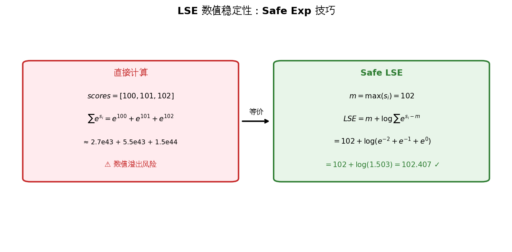
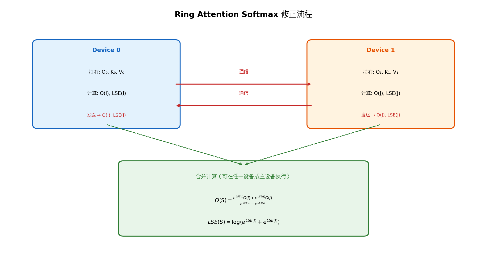
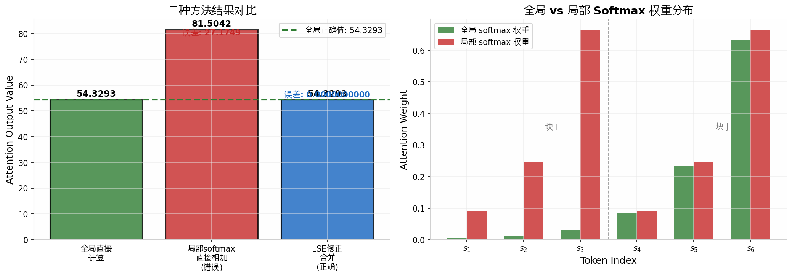

# Softmax 修正公式的完整推导与直观解释

> **文档说明**：本文档推导 Ring Attention / Blockwise Attention 中的 softmax 修正公式，解释当序列被切分到多个设备时，如何将各块局部计算结果合并为全局正确的 attention 输出。所有数学符号保持完整，每一步推导均给出明确的数学依据。

---

## 一、公式作用概述

在 Transformer 的 Self-Attention 机制中，当输入序列长度 $L$ 超过单张 GPU 的显存容量时，需要将序列切分到多个设备上并行计算。**Softmax 修正公式**解决的核心问题是：当 $Q$（Query）、$K$（Key）、$V$（Value）矩阵都按序列维度切分后，每个设备只能看到局部的 key 和 value，此时若在每个设备上独立做 softmax，得到的注意力权重只归一化到局部范围，而非全局。该公式提供了一种**通信高效的合并规则**，使得各设备只需传递两个标量（局部输出和局部 Log-Sum-Exp），即可通过代数运算还原出与全局计算完全一致的结果。

该公式是 Ring Attention、Blockwise FlashAttention、以及 DeepSpeed Ulysses 等序列并行算法的数学基石，适用于任何需要将 softmax 操作分块执行的分布式场景。

---

## 二、完整推导过程

### 2.1 问题设定与符号定义

我们首先建立严格的数学符号体系。

设输入序列长度为 $L$，每个 token 的维度为 $d_{\text{model}}$。对于某个固定的注意力头（head）和某个固定的 query token（为简化推导，我们考虑单头、单 query 的情形，多 query 的情形由逐 query 独立应用本公式可得），定义：

- $\mathbf{s} \in \mathbb{R}^{L}$：该 query 与全部 $L$ 个 key 的点积分数（scores），即 $s_{i} = \mathbf{q}^{\top} \mathbf{k}_{i}$，其中 $\mathbf{q} \in \mathbb{R}^{d_{k}}$ 为 query 向量，$\mathbf{k}_{i} \in \mathbb{R}^{d_{k}}$ 为第 $i$ 个 key 向量；
- $\mathbf{V} \in \mathbb{R}^{L \times d_{v}}$：value 矩阵，第 $i$ 行为 $\mathbf{v}_{i}^{\top} \in \mathbb{R}^{1 \times d_{v}}$；
- $\mathbf{O} \in \mathbb{R}^{1 \times d_{v}}$：该 query 的 attention 输出向量。

**【知识卡片：Softmax 函数】**
- **定义**：Softmax 是将一个实数向量映射为概率分布的函数，输出每个元素在指数空间中的相对占比，保证输出非负且和为 1。
- **公式**：对于向量 $\mathbf{x} = (x_{1}, x_{2}, \ldots, x_{n}) \in \mathbb{R}^{n}$，其 softmax 定义为
  $$\text{softmax}(\mathbf{x})_{i} = \frac{\exp(x_{i})}{\sum_{j=1}^{n} \exp(x_{j})}, \quad \forall i \in \{1, 2, \ldots, n\}.$$
- **本步作用**：Attention 机制使用 softmax 将原始分数转换为注意力权重，使得每个 value 的加权系数构成一个合法的概率分布。

> **【小例子：Softmax 函数】**
> 假设某 query 对 3 个 key 的分数为 $\mathbf{s} = [1, 2, 3]$。
> 那么：
> $$\exp(\mathbf{s}) = [e^{1}, e^{2}, e^{3}] \approx [2.718, 7.389, 20.086].$$
> 分母为 $\sum_{j=1}^{3} \exp(s_{j}) = 2.718 + 7.389 + 20.086 = 30.193$。
> 于是 softmax 权重为：
> $$\text{softmax}(\mathbf{s}) = \left[\frac{2.718}{30.193}, \frac{7.389}{30.193}, \frac{20.086}{30.193}\right] \approx [0.090, 0.245, 0.665].$$
> 验证：$0.090 + 0.245 + 0.665 = 1.000$，满足概率分布的要求。在 attention 中，这意味着第 3 个 token 获得了约 66.5% 的注意力权重。

---

标准的 Scaled Dot-Product Attention 输出定义为：

$$\mathbf{O} = \text{softmax}\left(\frac{\mathbf{q}^{\top} \mathbf{K}^{\top}}{\sqrt{d_{k}}}\right) \mathbf{V} = \sum_{i=1}^{L} a_{i} \cdot \mathbf{v}_{i}^{\top},$$

其中注意力权重 $a_{i}$ 满足：

$$a_{i} = \frac{\exp(s_{i})}{\sum_{j=1}^{L} \exp(s_{j})}, \quad \forall i \in \{1, 2, \ldots, L\}.$$

为简化书写，后续推导中省略缩放因子 $\frac{1}{\sqrt{d_{k}}}$（它不影响 softmax 的归一化结构，只是一个常数缩放）。

---

### 2.2 序列切分与局部计算

现在将序列切分为两个不相交的子集（块）$I$ 和 $J$，满足：

$$I \cup J = \{1, 2, \ldots, L\}, \quad I \cap J = \emptyset.$$

例如，$I = \{1, 2, \ldots, m\}$，$J = \{m+1, m+2, \ldots, L\}$。每个块被分配到不同的计算设备上。

**【知识卡片：集合的划分（Partition）】**
- **定义**：将一个集合 $S$ 分成若干互不相交的子集，这些子集的并集等于原集合 $S$，称为 $S$ 的一个划分。
- **公式**：若 $\{S_{1}, S_{2}, \ldots, S_{k}\}$ 是 $S$ 的划分，则满足 $S_{i} \cap S_{j} = \emptyset$（$i \neq j$）且 $\bigcup_{i=1}^{k} S_{i} = S$。
- **本步作用**：将长序列切分为若干互不相交的块，每块独立计算，最后合并。$I$ 和 $J$ 构成全集的一个二划分。

> **【小例子：集合划分】**
> 设全集 $S = \{1, 2, 3, 4, 5, 6\}$。
> 一个合法的划分是 $I = \{1, 2, 3\}$，$J = \{4, 5, 6\}$。
> 验证：$I \cap J = \emptyset$（无公共元素），$I \cup J = \{1, 2, 3, 4, 5, 6\} = S$（并集为全集）。
> 在 attention 中，这意味着前 3 个 token 放到 Device 0，后 3 个 token 放到 Device 1。

---

在每个设备上，只能看到局部的 key 和 value。以块 $I$ 为例，设备上的局部计算为：

**局部 softmax（仅在块 $I$ 内部归一化）：**

$$a_{i}^{(I)} = \frac{\exp(s_{i})}{\sum_{j \in I} \exp(s_{j})}, \quad \forall i \in I.$$

**局部输出（加权求和）：**

$$\mathbf{O}(I) = \sum_{i \in I} a_{i}^{(I)} \cdot \mathbf{v}_{i}^{\top}.$$

同理，块 $J$ 上的局部计算为：

$$a_{j}^{(J)} = \frac{\exp(s_{j})}{\sum_{k \in J} \exp(s_{k})}, \quad \forall j \in J,$$

$$\mathbf{O}(J) = \sum_{j \in J} a_{j}^{(J)} \cdot \mathbf{v}_{j}^{\top}.$$

**关键问题**：$\mathbf{O}(I) + \mathbf{O}(J)$ 是否等于全局正确的 $\mathbf{O}$？

**答案是否定的**。原因如下：

全局正确的注意力权重应该是：

$$a_{i}^{\text{global}} = \frac{\exp(s_{i})}{\sum_{j=1}^{L} \exp(s_{j})} = \frac{\exp(s_{i})}{\sum_{j \in I} \exp(s_{j}) + \sum_{k \in J} \exp(s_{k})}.$$

而局部权重 $a_{i}^{(I)}$ 的分母只有 $\sum_{j \in I} \exp(s_{j})$，缺少了块 $J$ 的贡献。因此：

$$a_{i}^{(I)} = \frac{\exp(s_{i})}{\sum_{j \in I} \exp(s_{j})} \neq \frac{\exp(s_{i})}{\sum_{j=1}^{L} \exp(s_{j})} = a_{i}^{\text{global}}.$$

直接相加 $\mathbf{O}(I) + \mathbf{O}(J)$ 会导致每个 token 的权重被错误地放大（因为局部分母更小），结果必然偏离全局正确值。

<!--  -->

---

### 2.3 Log-Sum-Exp (LSE) 的定义与性质

为了从局部量还原全局量，我们需要引入一个关键的中间量。

**【知识卡片：Log-Sum-Exp (LSE) 函数】**
- **定义**：LSE 是 softmax 分母的对数形式，将一个实数向量映射为一个标量，表示该向量在指数空间中的"总能量"的对数。
- **公式**：对于向量 $\mathbf{x} = (x_{1}, x_{2}, \ldots, x_{n}) \in \mathbb{R}^{n}$，
  $$\text{LSE}(\mathbf{x}) = \log\left(\sum_{i=1}^{n} \exp(x_{i})\right).$$
- **本步作用**：LSE 将 softmax 的分母 $\sum \exp(x_{i})$ 压缩为对数空间的一个标量，使得我们可以通过指数运算还原分母，同时保持数值稳定性。

> **【小例子：Log-Sum-Exp】**
> 继续使用分数 $\mathbf{s} = [1, 2, 3]$。
> $$\text{LSE}(\mathbf{s}) = \log(e^{1} + e^{2} + e^{3}) = \log(2.718 + 7.389 + 20.086) = \log(30.193) \approx 3.407.$$
> 验证：$\exp(\text{LSE}(\mathbf{s})) = \exp(3.407) = 30.193$，恰好等于 softmax 的分母。这意味着 **$\exp(\text{LSE}(\mathbf{s}))$ 就是全局归一化所需的"总能量"**。

---

对于块 $I$ 和块 $J$，定义它们的局部 LSE：

$$\text{LSE}(I) = \log\left(\sum_{i \in I} \exp(s_{i})\right), \quad \text{LSE}(J) = \log\left(\sum_{j \in J} \exp(s_{j})\right).$$

**关键观察**：由 LSE 的定义，直接可得：

$$\exp(\text{LSE}(I)) = \sum_{i \in I} \exp(s_{i}), \quad \exp(\text{LSE}(J)) = \sum_{j \in J} \exp(s_{j}).$$

也就是说，$\exp(\text{LSE}(I))$ 恰好是块 $I$ 中所有分数的指数和，即局部 softmax 的分母。

---

### 2.4 从局部量还原全局量的代数推导

**推导目标**：用 $\mathbf{O}(I)$、$\mathbf{O}(J)$、$\text{LSE}(I)$、$\text{LSE}(J)$ 这四个局部量，表达出全局正确的 $\mathbf{O}(I \cup J)$ 和 $\text{LSE}(I \cup J)$。

**步骤 1：写出全局正确输出的定义。**

根据 attention 的定义，全局输出为所有 token 的 value 按全局 softmax 权重加权求和：

$$\mathbf{O}(I \cup J) = \sum_{i \in I \cup J} a_{i}^{\text{global}} \cdot \mathbf{v}_{i}^{\top} = \frac{\sum_{i \in I \cup J} \exp(s_{i}) \cdot \mathbf{v}_{i}^{\top}}{\sum_{j \in I \cup J} \exp(s_{j})}.$$

**数学依据**：这是 attention 输出的原始定义，分子是 value 的指数加权和，分母是全局 softmax 的归一化因子。

**步骤 2：将全集拆分为两个不相交子集的并。**

由于 $I \cup J = I \sqcup J$（不相交并），分子可以拆分为两部分：

$$\sum_{i \in I \cup J} \exp(s_{i}) \cdot \mathbf{v}_{i}^{\top} = \sum_{i \in I} \exp(s_{i}) \cdot \mathbf{v}_{i}^{\top} + \sum_{j \in J} \exp(s_{j}) \cdot \mathbf{v}_{j}^{\top}.$$

**数学依据**：求和运算对不相交集合的并满足可加性，即 $\sum_{x \in A \cup B} f(x) = \sum_{x \in A} f(x) + \sum_{x \in B} f(x)$，当 $A \cap B = \emptyset$ 时成立。

**步骤 3：将局部输出还原为"未归一的加权和"。**

回顾局部输出的定义：

$$\mathbf{O}(I) = \sum_{i \in I} a_{i}^{(I)} \cdot \mathbf{v}_{i}^{\top} = \sum_{i \in I} \frac{\exp(s_{i})}{\sum_{k \in I} \exp(s_{k})} \cdot \mathbf{v}_{i}^{\top}.$$

将分母 $\sum_{k \in I} \exp(s_{k})$ 移到等式左边：

$$\left(\sum_{k \in I} \exp(s_{k})\right) \cdot \mathbf{O}(I) = \sum_{i \in I} \exp(s_{i}) \cdot \mathbf{v}_{i}^{\top}.$$

**数学依据**：等式两边同乘一个非零标量（分母为正，因为指数函数恒正），等式仍然成立。

利用步骤 2 中 LSE 的关键观察 $\exp(\text{LSE}(I)) = \sum_{k \in I} \exp(s_{k})$，代入得：

$$\exp(\text{LSE}(I)) \cdot \mathbf{O}(I) = \sum_{i \in I} \exp(s_{i}) \cdot \mathbf{v}_{i}^{\top}.$$

同理，对块 $J$：

$$\exp(\text{LSE}(J)) \cdot \mathbf{O}(J) = \sum_{j \in J} \exp(s_{j}) \cdot \mathbf{v}_{j}^{\top}.$$

**步骤 4：代入全局输出公式。**

将步骤 3 的结果代入步骤 2 的拆分式：

$$\sum_{i \in I \cup J} \exp(s_{i}) \cdot \mathbf{v}_{i}^{\top} = \exp(\text{LSE}(I)) \cdot \mathbf{O}(I) + \exp(\text{LSE}(J)) \cdot \mathbf{O}(J).$$

全局分母（即全局 softmax 的归一化因子）为：

$$\sum_{j \in I \cup J} \exp(s_{j}) = \sum_{j \in I} \exp(s_{j}) + \sum_{j \in J} \exp(s_{j}) = \exp(\text{LSE}(I)) + \exp(\text{LSE}(J)).$$

**数学依据**：同样利用求和的可加性，以及 LSE 与指数和的关系。

因此，全局正确的输出为：

$$\boxed{\mathbf{O}(I \cup J) = \frac{\exp(\text{LSE}(I)) \cdot \mathbf{O}(I) + \exp(\text{LSE}(J)) \cdot \mathbf{O}(J)}{\exp(\text{LSE}(I)) + \exp(\text{LSE}(J))}}$$

**步骤 5：推导全局 LSE 的合并公式。**

全局 LSE 定义为：

$$\text{LSE}(I \cup J) = \log\left(\sum_{i \in I \cup J} \exp(s_{i})\right) = \log\left(\sum_{i \in I} \exp(s_{i}) + \sum_{j \in J} \exp(s_{j})\right).$$

再次利用 $\exp(\text{LSE}(I)) = \sum_{i \in I} \exp(s_{i})$，代入得：

$$\text{LSE}(I \cup J) = \log\left(\exp(\text{LSE}(I)) + \exp(\text{LSE}(J))\right).$$

**数学依据**：对数函数的运算性质 $\log(a + b)$，其中 $a = \exp(\text{LSE}(I))$，$b = \exp(\text{LSE}(J))$。

于是得到全局 LSE 的合并公式：

$$\boxed{\text{LSE}(I \cup J) = \log\left(\exp(\text{LSE}(I)) + \exp(\text{LSE}(J))\right)}$$

---

### 2.5 合并算子的紧凑表示

为了书写简洁，定义合并算子 $\oplus$ 作用于二元组 $(\mathbf{O}, \text{LSE})$：

$$\begin{bmatrix} \mathbf{O}(I \cup J) \\ \text{LSE}(I \cup J) \end{bmatrix} = \begin{bmatrix} \mathbf{O}(I) \\ \text{LSE}(I) \end{bmatrix} \oplus \begin{bmatrix} \mathbf{O}(J) \\ \text{LSE}(J) \end{bmatrix},$$

其中 $\oplus$ 的具体运算规则为：

$$\begin{bmatrix} \mathbf{O}_{1} \\ \ell_{1} \end{bmatrix} \oplus \begin{bmatrix} \mathbf{O}_{2} \\ \ell_{2} \end{bmatrix} = \begin{bmatrix} \dfrac{\exp(\ell_{1}) \cdot \mathbf{O}_{1} + \exp(\ell_{2}) \cdot \mathbf{O}_{2}}{\exp(\ell_{1}) + \exp(\ell_{2})} \\ \log\left(\exp(\ell_{1}) + \exp(\ell_{2})\right) \end{bmatrix}.$$

**关键性质**：该算子 $\oplus$ 满足**结合律**（associative），即：

$$(A \oplus B) \oplus C = A \oplus (B \oplus C).$$

**数学依据**：因为 LSE 和加权和的运算本质上是对指数和的累加，而求和运算天然满足结合律。这意味着无论按什么顺序合并多个块，最终结果都相同。这一性质是 Ring Attention 能够在设备间环形传递、逐步累积结果的理论保证。

---

### 2.6 数值稳定性：Safe LSE 计算

在实际工程中，当序列很长或分数 $s_{i}$ 很大时，$\exp(s_{i})$ 可能超出浮点数的表示范围（上溢）。

**【知识卡片：数值溢出（Numerical Overflow）】**
- **定义**：在计算机浮点运算中，当一个数的绝对值超过该精度类型能表示的最大值时，结果会被截断为无穷大（inf），导致后续计算失效。
- **公式**：对于 float32 类型，最大可表示值约为 $3.4 \times 10^{38}$。当 $x > 89$ 时，$\exp(x) > 1.5 \times 10^{38}$ 已接近溢出边界。
- **本步作用**：Attention 中的分数 $s_{i}$ 可能很大（如 $s_{i} = 100$），直接计算 $\exp(100)$ 会导致 float32 溢出。

> **【小例子：数值溢出】**
> 在 float32 中：
> - $\exp(80) \approx 5.5 \times 10^{34}$（安全）
> - $\exp(90) \approx 1.2 \times 10^{39}$（**溢出为 inf**）
> 如果某个分数 $s_{i} = 100$，则 $\exp(100)$ 在 float32 中直接变成 `inf`，softmax 计算崩溃。

---

解决方法是使用 **safe LSE 技巧**（也称为 log-sum-exp trick）：

$$\text{LSE}(\mathbf{x}) = m + \log\left(\sum_{i=1}^{n} \exp(x_{i} - m)\right), \quad \text{其中 } m = \max_{i} x_{i}.$$

**推导验证**：

$$\text{LSE}(\mathbf{x}) = \log\left(\sum_{i=1}^{n} \exp(x_{i})\right) = \log\left(\sum_{i=1}^{n} \exp(m) \cdot \exp(x_{i} - m)\right) = \log\left(\exp(m) \cdot \sum_{i=1}^{n} \exp(x_{i} - m)\right).$$

**数学依据**：对数运算性质 $\log(a \cdot b) = \log(a) + \log(b)$，以及 $\exp(m) \cdot \exp(x_{i} - m) = \exp(x_{i})$（指数加法法则）。

继续推导：

$$= \log(\exp(m)) + \log\left(\sum_{i=1}^{n} \exp(x_{i} - m)\right) = m + \log\left(\sum_{i=1}^{n} \exp(x_{i} - m)\right).$$

**数学依据**：对数与指数的互逆性质 $\log(\exp(m)) = m$。

由于 $x_{i} - m \leq 0$（因为 $m$ 是最大值），$\exp(x_{i} - m) \in (0, 1]$，求和不会溢出。这是工程实现中计算 LSE 的标准方法。

---

### 2.7 多块的递推合并（Ring Attention 场景）

当有 $N$ 个块（对应 $N$ 个设备）时，利用 $\oplus$ 的结合律，可以按任意顺序逐步合并。在 Ring Attention 中，通常采用**逐块累积**的方式：

初始化累积状态：

$$\begin{bmatrix} \mathbf{O}_{\text{acc}} \\ \ell_{\text{acc}} \end{bmatrix} = \begin{bmatrix} \mathbf{O}(I_{1}) \\ \text{LSE}(I_{1}) \end{bmatrix}.$$

对于第 $k = 2, 3, \ldots, N$ 个块：

$$\begin{bmatrix} \mathbf{O}_{\text{acc}} \\ \ell_{\text{acc}} \end{bmatrix} \leftarrow \begin{bmatrix} \mathbf{O}_{\text{acc}} \\ \ell_{\text{acc}} \end{bmatrix} \oplus \begin{bmatrix} \mathbf{O}(I_{k}) \\ \text{LSE}(I_{k}) \end{bmatrix}.$$

最终 $\mathbf{O}_{\text{acc}}$ 即为全局正确的 attention 输出。每个设备只需向环中的下一个设备传递当前的 $(\mathbf{O}_{\text{acc}}, \ell_{\text{acc}})$ 二元组，以及本地的 $(\mathbf{O}(I_{k}), \text{LSE}(I_{k}))$，即可完成全局合并。

---

## 三、直观意义解释

### 3.1 通信效率

每个设备只需传递两个量：
- $\mathbf{O}(I) \in \mathbb{R}^{1 \times d_{v}}$：局部输出（向量，大小与最终输出相同）
- $\text{LSE}(I) \in \mathbb{R}$：一个标量

相比于传递完整的注意力矩阵或所有 key/value，通信量极小。这是 Ring Attention 能够支持**无限长序列**的关键——序列越长，切的块数越多，但每块只需传递固定大小的 $(\mathbf{O}, \text{LSE})$。

### 3.2 与标准 Attention 的等价性

该合并公式是**数学恒等式**，不是近似。只要满足：
1. 各块的局部计算使用相同的分数 $s_{i}$（即 query 和 key 的点积一致）；
2. 合并时严格按照 $\oplus$ 算子的规则执行；

那么合并后的结果与在单设备上计算完整序列的 attention 输出**在数学上完全一致**（忽略浮点舍入误差）。

---

## 四、涉及的基本数学知识清单

| 概念名称 | 在本推导中的具体作用 | 一句话定义或公式表达 |
|---------|---------------------|---------------------|
| Softmax 函数 | 将分数转换为概率分布，作为 value 的加权系数 | $\text{softmax}(\mathbf{x})_{i} = \frac{\exp(x_{i})}{\sum_{j} \exp(x_{j})}$ |
| 集合划分 | 将长序列切分为互不相交的块，每块独立计算 | $I \cap J = \emptyset$，$I \cup J = S$ |
| 求和可加性 | 将全局求和拆分为局部求和之和 | $\sum_{x \in A \cup B} f(x) = \sum_{x \in A} f(x) + \sum_{x \in B} f(x)$（$A \cap B = \emptyset$） |
| Log-Sum-Exp (LSE) | 将 softmax 分母压缩为对数空间的标量，用于通信和合并 | $\text{LSE}(\mathbf{x}) = \log\left(\sum_{i} \exp(x_{i})\right)$ |
| 指数与对数的互逆 | 从 LSE 还原指数和，建立局部与全局的联系 | $\exp(\log(a)) = a$，$\log(\exp(a)) = a$（$a > 0$） |
| 对数运算性质 | 推导 safe LSE 技巧的核心代数依据 | $\log(a \cdot b) = \log(a) + \log(b)$ |
| 结合律 | 保证多块的合并顺序不影响最终结果 | $(A \oplus B) \oplus C = A \oplus (B \oplus C)$ |
| 数值溢出 | 解释为什么需要 safe LSE 技巧 | 浮点数超出表示范围导致结果变为 inf |
| 指数加法法则 | 推导 safe LSE 时拆分指数项 | $\exp(a) \cdot \exp(b) = \exp(a + b)$ |
| 向量加权平均 | Attention 输出的本质含义 | $\mathbf{O} = \sum_{i} a_{i} \mathbf{v}_{i}$，其中 $\sum_{i} a_{i} = 1$，$a_{i} \geq 0$ |

---

## 五、总结

Softmax 修正公式的核心思想可以概括为一句话：

> **局部 softmax 的结果之所以不能直接相加，是因为每个局部结果都基于不同的归一化分母。通过引入 Log-Sum-Exp 作为"总能量"的度量，我们可以先将局部输出"还原"为未归一的加权和，再用全局总能量重新归一化，从而得到与全局计算完全一致的结果。**

该公式的优雅之处在于：
1. **通信极简**：每块只需传递一个向量和一个标量；
2. **数学精确**：不是近似，而是严格的代数恒等式；
3. **顺序无关**：结合律保证环形、树形、任意顺序的合并都等价；
4. **工程可行**：配合 safe LSE 技巧，在浮点运算中稳定实现。

---

