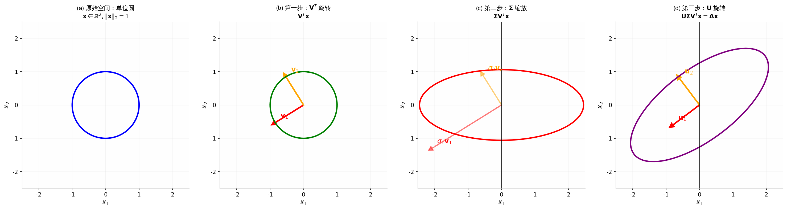
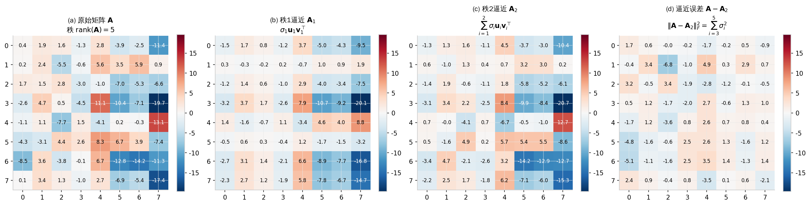
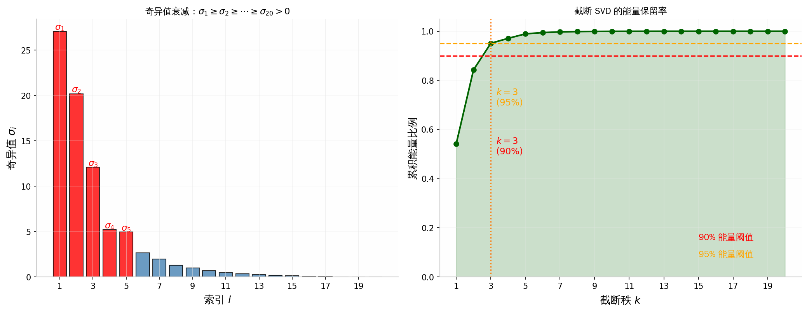
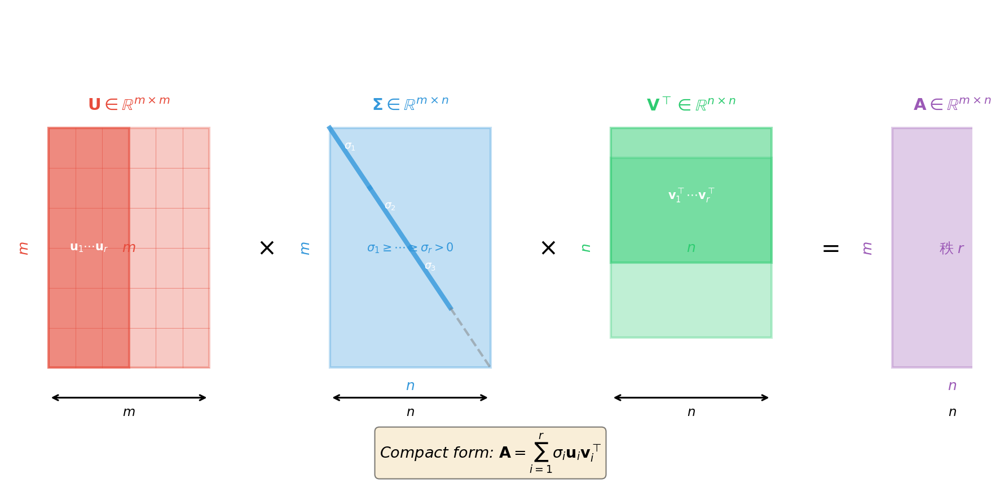

# 奇异值分解（SVD）存在性证明与低秩逼近完整推导

---

## 一、公式作用概述

**奇异值分解（Singular Value Decomposition, SVD）** 是线性代数中最强大的矩阵分解工具之一。它证明了：**任意实矩阵** $\mathbf{A} \in \mathbb{R}^{m \times n}$（无论方阵、长方阵、满秩或秩亏）**都必然存在**分解 $\mathbf{A} = \mathbf{U}\mathbf{\Sigma}\mathbf{V}^{\top}$，其中 $\mathbf{U}$ 和 $\mathbf{V}$ 是正交矩阵，$\mathbf{\Sigma}$ 是非负对角矩阵。当矩阵 $\mathbf{A}$ 是**不满秩矩阵（Rank-deficient Matrix）**——即秩 $r < \min(m,n)$ 时——其 SVD 中只有前 $r$ 个奇异值非零，其余均为零。这意味着我们可以用仅含 $r$ 个非零分量的紧凑分解来**完全等价地**表示原矩阵，或者用更少的 $k < r$ 个分量构造**最优低秩逼近** $\mathbf{A}_k$，在控制误差的前提下大幅降低存储与计算开销。这一性质是数据降维、图像压缩、推荐系统、噪声过滤以及大模型低秩适配（LoRA）等技术的数学基石。

---

## 二、完整推导过程

### 步骤 0：问题设定与目标

**已知**：给定任意实矩阵 $\mathbf{A} \in \mathbb{R}^{m \times n}$，其中 $m$ 为行数，$n$ 为列数。不失一般性，先假设 $m \geq n$；若 $m < n$，只需对转置矩阵 $\mathbf{A}^{\top} \in \mathbb{R}^{n \times m}$ 完成分解后再转置即可。

**目标**：严格证明存在正交矩阵 $\mathbf{U} \in \mathbb{R}^{m \times m}$（满足 $\mathbf{U}^{\top}\mathbf{U} = \mathbf{I}_m$）、正交矩阵 $\mathbf{V} \in \mathbb{R}^{n \times n}$（满足 $\mathbf{V}^{\top}\mathbf{V} = \mathbf{I}_n$），以及对角矩阵 $\mathbf{\Sigma} \in \mathbb{R}^{m \times n}$（其对角线元素 $\sigma_1 \geq \sigma_2 \geq \cdots \geq \sigma_r > 0$，且 $r = \mathrm{rank}(\mathbf{A})$），使得：

$$
\mathbf{A} = \mathbf{U} \mathbf{\Sigma} \mathbf{V}^{\top}
$$

> **【知识卡片：矩阵转置】**
> - **定义**：矩阵 $\mathbf{A}$ 的转置 $\mathbf{A}^{\top}$ 是将 $\mathbf{A}$ 的行与列互换得到的新矩阵。若 $\mathbf{A} \in \mathbb{R}^{m \times n}$，则 $\mathbf{A}^{\top} \in \mathbb{R}^{n \times m}$，其元素满足 $(\mathbf{A}^{\top})_{j,i} = A_{i,j}$。
> - **公式**：$\mathbf{A}^{\top}$ 的第 $j$ 行第 $i$ 列元素等于 $\mathbf{A}$ 的第 $i$ 行第 $j$ 列元素。
> - **本步作用**：通过转置将任意矩阵 $\mathbf{A}$ 转化为方阵 $\mathbf{A}^{\top}\mathbf{A}$，从而可以应用特征值理论。

> **【小例子：矩阵转置】**
> 假设 $\mathbf{A} = \begin{pmatrix} 3 & 1 \\ 0 & 2 \\ 1 & 1 \end{pmatrix} \in \mathbb{R}^{3 \times 2}$。
> 则 $\mathbf{A}^{\top} = \begin{pmatrix} 3 & 0 & 1 \\ 1 & 2 & 1 \end{pmatrix} \in \mathbb{R}^{2 \times 3}$。
> 例如原矩阵第 2 行第 1 列的元素是 $0$，转置后它出现在第 1 行第 2 列。这对应了推导中从 $\mathbf{A}$ 构造对称方阵的操作。

---

### 步骤 1：构造对称半正定矩阵 $\mathbf{A}^{\top}\mathbf{A}$

**为什么要做这一步**：任意矩阵 $\mathbf{A}$ 本身不一定是方阵，无法直接求特征值。但 $\mathbf{A}^{\top}\mathbf{A}$ 一定是 $n \times n$ 的方阵，且具有良好的对称性，可以应用谱定理。

**计算**：
$$
\mathbf{C} \triangleq \mathbf{A}^{\top}\mathbf{A} \in \mathbb{R}^{n \times n}
$$

**验证对称性**：
$$
\mathbf{C}^{\top} = (\mathbf{A}^{\top}\mathbf{A})^{\top} = \mathbf{A}^{\top}(\mathbf{A}^{\top})^{\top} = \mathbf{A}^{\top}\mathbf{A} = \mathbf{C}
$$
**依据**：矩阵转置的逆序律 $(\mathbf{XY})^{\top} = \mathbf{Y}^{\top}\mathbf{X}^{\top}$，以及 $(\mathbf{A}^{\top})^{\top} = \mathbf{A}$。

**验证半正定性**：对任意向量 $\mathbf{x} \in \mathbb{R}^{n}$，
$$
\mathbf{x}^{\top}\mathbf{C}\mathbf{x} = \mathbf{x}^{\top}\mathbf{A}^{\top}\mathbf{A}\mathbf{x} = (\mathbf{A}\mathbf{x})^{\top}(\mathbf{A}\mathbf{x}) = \|\mathbf{A}\mathbf{x}\|_2^2 \geq 0
$$
**依据**：向量 2-范数的平方非负，即 $\|\mathbf{y}\|_2^2 \geq 0$。

> **【知识卡片：对称矩阵】**
> - **定义**：若方阵 $\mathbf{M} \in \mathbb{R}^{n \times n}$ 满足 $\mathbf{M}^{\top} = \mathbf{M}$，则称 $\mathbf{M}$ 为对称矩阵。对称矩阵的元素关于主对角线镜像相等，即 $M_{i,j} = M_{j,i}$。
> - **公式**：$\mathbf{M}$ 对称 $\Leftrightarrow \mathbf{M}^{\top} = \mathbf{M}$。
> - **本步作用**：对称矩阵保证特征向量可以选为标准正交的，且特征值都是实数，这是应用谱定理的前提。

> **【知识卡片：半正定矩阵】**
> - **定义**：对称矩阵 $\mathbf{M}$ 称为半正定（Positive Semi-Definite, PSD），若对所有向量 $\mathbf{x} \in \mathbb{R}^{n}$ 都有 $\mathbf{x}^{\top}\mathbf{M}\mathbf{x} \geq 0$。其几何含义是：以 $\mathbf{M}$ 为二次型的"能量"永不取负值。
> - **公式**：$\mathbf{M} \succeq \mathbf{0} \Leftrightarrow \forall \mathbf{x} \in \mathbb{R}^{n}, \mathbf{x}^{\top}\mathbf{M}\mathbf{x} \geq 0$。
> - **本步作用**：保证 $\mathbf{A}^{\top}\mathbf{A}$ 的所有特征值 $\lambda_i \geq 0$，从而可以开平方得到非负的奇异值 $\sigma_i = \sqrt{\lambda_i}$。

> **【小例子：对称与半正定验证】**
> 假设 $\mathbf{A} = \begin{pmatrix} 3 & 1 \\ 0 & 2 \\ 1 & 1 \end{pmatrix}$，则
> $$
> \mathbf{A}^{\top}\mathbf{A} = \begin{pmatrix} 10 & 4 \\ 4 & 6 \end{pmatrix}
> $$
> 验证对称：$(\mathbf{A}^{\top}\mathbf{A})_{1,2} = 4 = (\mathbf{A}^{\top}\mathbf{A})_{2,1}$，确实对称。
> 验证半正定：对任意 $\mathbf{x} = \begin{pmatrix} x_1 \\ x_2 \end{pmatrix}$，
> $$
> \mathbf{x}^{\top}\mathbf{A}^{\top}\mathbf{A}\mathbf{x} = 10x_1^2 + 8x_1x_2 + 6x_2^2 = (3x_1+x_2)^2 + (2x_2)^2 + (x_1+x_2)^2 \geq 0
> $$
> 这正好对应了推导中 $\|\mathbf{A}\mathbf{x}\|_2^2 \geq 0$ 的结论。

---

### 步骤 2：对 $\mathbf{A}^{\top}\mathbf{A}$ 应用谱定理进行特征值分解

**依据**：**谱定理（Spectral Theorem）**——任何实对称矩阵 $\mathbf{C} \in \mathbb{R}^{n \times n}$ 都可以被正交对角化。即存在由标准正交特征向量组成的正交矩阵 $\mathbf{V} \in \mathbb{R}^{n \times n}$ 和实对角矩阵 $\mathbf{\Lambda} \in \mathbb{R}^{n \times n}$，使得：

$$
\mathbf{A}^{\top}\mathbf{A} = \mathbf{V} \mathbf{\Lambda} \mathbf{V}^{\top}
$$

其中：
- $\mathbf{V} = [\mathbf{v}_1, \mathbf{v}_2, \dots, \mathbf{v}_n]$，列向量 $\mathbf{v}_i \in \mathbb{R}^{n}$ 满足 $\mathbf{v}_i^{\top}\mathbf{v}_j = \delta_{i,j}$（克罗内克 delta，当 $i=j$ 时为 1，否则为 0）。
- $\mathbf{\Lambda} = \mathrm{diag}(\lambda_1, \lambda_2, \dots, \lambda_n)$，且 $\lambda_1 \geq \lambda_2 \geq \cdots \geq \lambda_n \geq 0$。
- 由于 $\mathrm{rank}(\mathbf{A}) = r$，恰好有 $\lambda_1 \geq \cdots \geq \lambda_r > 0$ 且 $\lambda_{r+1} = \cdots = \lambda_n = 0$。

> **【知识卡片：特征值与特征向量】**
> - **定义**：对于方阵 $\mathbf{M}$，若存在标量 $\lambda$ 和非零向量 $\mathbf{v}$ 使得 $\mathbf{M}\mathbf{v} = \lambda\mathbf{v}$，则称 $\lambda$ 为 $\mathbf{M}$ 的特征值，$\mathbf{v}$ 为对应的特征向量。几何上，特征向量是经 $\mathbf{M}$ 变换后**方向不变**（或反向）的特殊向量，仅被伸缩了 $\lambda$ 倍。
> - **公式**：$\mathbf{M}\mathbf{v} = \lambda\mathbf{v}$，其中 $\mathbf{v} \neq \mathbf{0}$。
> - **本步作用**：将 $\mathbf{A}^{\top}\mathbf{A}$ 的"作用方向"分解为 $n$ 个互相垂直的主轴方向 $\mathbf{v}_i$，每个方向上的伸缩倍率为 $\lambda_i$。

> **【知识卡片：谱定理（对称矩阵的正交对角化）】**
> - **定义**：任何实对称矩阵都存在一组标准正交的特征向量基，使得矩阵在该基下表现为对角矩阵。这是线性代数中最强大的分解定理之一。
> - **公式**：$\mathbf{M} = \mathbf{V}\mathbf{\Lambda}\mathbf{V}^{\top} = \sum_{i=1}^{n} \lambda_i \mathbf{v}_i \mathbf{v}_i^{\top}$，其中 $\mathbf{V}^{\top}\mathbf{V} = \mathbf{I}_n$。
> - **本步作用**：保证 $\mathbf{A}^{\top}\mathbf{A}$ 一定能分解成旋转矩阵 $\mathbf{V}$ 与对角伸缩矩阵 $\mathbf{\Lambda}$ 的乘积，为定义奇异值奠定基础。

> **【小例子：对称矩阵的特征值分解】**
> 假设 $\mathbf{A}^{\top}\mathbf{A} = \begin{pmatrix} 10 & 4 \\ 4 & 6 \end{pmatrix}$（接上一个例子）。
> 求解特征方程 $\det(\mathbf{A}^{\top}\mathbf{A} - \lambda\mathbf{I}) = 0$：
> $$
> \det\begin{pmatrix} 10-\lambda & 4 \\ 4 & 6-\lambda \end{pmatrix} = (10-\lambda)(6-\lambda) - 16 = \lambda^2 - 16\lambda + 44 = 0
> $$
> 解得 $\lambda_1 = 8 + 2\sqrt{5} \approx 12.47$，$\lambda_2 = 8 - 2\sqrt{5} \approx 3.53$。
> 对应特征向量经归一化后约为 $\mathbf{v}_1 \approx \begin{pmatrix} 0.85 \\ 0.53 \end{pmatrix}$，$\mathbf{v}_2 \approx \begin{pmatrix} -0.53 \\ 0.85 \end{pmatrix}$，且 $\mathbf{v}_1 \perp \mathbf{v}_2$（内积约为 $0$）。
> 这验证了谱定理：对称矩阵的特征值是实数，特征向量正交。

---

### 步骤 3：定义奇异值与右奇异向量

**为什么要做这一步**：$\mathbf{A}^{\top}\mathbf{A}$ 的特征值 $\lambda_i$ 是 $\mathbf{A}$ 在方向 $\mathbf{v}_i$ 上伸缩倍率的平方。我们需要开方得到 $\mathbf{A}$ 本身的伸缩倍率。

**定义**：
- **右奇异向量（Right Singular Vectors）**：直接取 $\mathbf{V}$ 的列向量 $\mathbf{v}_1, \dots, \mathbf{v}_n$。
- **奇异值（Singular Values）**：对 $i = 1, \dots, n$，定义
  $$
  \sigma_i \triangleq \sqrt{\lambda_i}
  $$
  由半正定性知 $\lambda_i \geq 0$，故 $\sigma_i$ 为非负实数。按降序排列：
  $$
  \sigma_1 \geq \sigma_2 \geq \cdots \geq \sigma_r > 0, \quad \sigma_{r+1} = \cdots = \sigma_n = 0
  $$

> **【知识卡片：奇异值】**
> - **定义**：奇异值 $\sigma_i$ 是矩阵 $\mathbf{A}$ 沿其右奇异向量方向 $\mathbf{v}_i$ 的"伸缩强度"的度量，数学上定义为 $\mathbf{A}^{\top}\mathbf{A}$ 对应特征值 $\lambda_i$ 的算术平方根。
> - **公式**：$\sigma_i = \sqrt{\lambda_i}$，其中 $\lambda_i$ 是 $\mathbf{A}^{\top}\mathbf{A}$ 的第 $i$ 大特征值。
> - **本步作用**：将 $\mathbf{A}^{\top}\mathbf{A}$ 的"平方伸缩率"转换为 $\mathbf{A}$ 本身的伸缩率，为后续构造对角矩阵 $\mathbf{\Sigma}$ 做准备。

> **【小例子：奇异值计算】**
> 接上一个例子，$\lambda_1 \approx 12.47$，$\lambda_2 \approx 3.53$。
> 则 $\sigma_1 = \sqrt{12.47} \approx 3.53$，$\sigma_2 = \sqrt{3.53} \approx 1.88$。
> 这两个数值分别量化了原矩阵 $\mathbf{A}$ 在两个正交方向 $\mathbf{v}_1, \mathbf{v}_2$ 上的"拉伸强度"。
> 若原矩阵秩 $r=1$（即 $\lambda_2 = 0$），则 $\sigma_2 = 0$，表示在方向 $\mathbf{v}_2$ 上没有任何拉伸——矩阵在该方向上"塌陷"了。

---

### 步骤 4：定义左奇异向量并验证正交性

**为什么要做这一步**：目前我们只有 $\mathbf{V}$（输入空间 $\mathbb{R}^n$ 中的旋转），还需要构造 $\mathbf{U}$（输出空间 $\mathbb{R}^m$ 中的旋转），使得 $\mathbf{A}\mathbf{v}_i$ 的方向恰好与 $\mathbf{u}_i$ 对齐，且长度被缩放了 $\sigma_i$ 倍。

**定义左奇异向量（Left Singular Vectors）**：对 $i = 1, \dots, r$（仅对非零奇异值），定义：
$$
\mathbf{u}_i \triangleq \frac{1}{\sigma_i} \mathbf{A}\mathbf{v}_i \in \mathbb{R}^{m}
$$

**验证 $\{\mathbf{u}_i\}_{i=1}^{r}$ 是标准正交组**：
对任意 $i, j \in \{1, \dots, r\}$，计算内积：
$$
\mathbf{u}_i^{\top}\mathbf{u}_j = \frac{1}{\sigma_i \sigma_j} (\mathbf{A}\mathbf{v}_i)^{\top}(\mathbf{A}\mathbf{v}_j) = \frac{1}{\sigma_i \sigma_j} \mathbf{v}_i^{\top}\mathbf{A}^{\top}\mathbf{A}\mathbf{v}_j
$$
**依据**：矩阵乘法结合律与转置的逆序律 $(\mathbf{AB})^{\top} = \mathbf{B}^{\top}\mathbf{A}^{\top}$。

由步骤 2 知 $\mathbf{A}^{\top}\mathbf{A}\mathbf{v}_j = \lambda_j \mathbf{v}_j = \sigma_j^2 \mathbf{v}_j$，代入得：
$$
\mathbf{u}_i^{\top}\mathbf{u}_j = \frac{1}{\sigma_i \sigma_j} \mathbf{v}_i^{\top} (\sigma_j^2 \mathbf{v}_j) = \frac{\sigma_j^2}{\sigma_i \sigma_j} \mathbf{v}_i^{\top}\mathbf{v}_j = \frac{\sigma_j}{\sigma_i} \delta_{i,j}
$$
**依据**：$\mathbf{v}_i^{\top}\mathbf{v}_j = \delta_{i,j}$（谱定理保证的标准正交性）。

当 $i = j$ 时，$\frac{\sigma_j}{\sigma_i} = 1$，故 $\mathbf{u}_i^{\top}\mathbf{u}_i = 1$（单位长度）；当 $i \neq j$ 时，$\delta_{i,j} = 0$，故 $\mathbf{u}_i^{\top}\mathbf{u}_j = 0$（互相垂直）。

因此 $\{\mathbf{u}_1, \dots, \mathbf{u}_r\}$ 是 $\mathbb{R}^m$ 中一组标准正交向量。

> **【知识卡片：标准正交基与正交矩阵】**
> - **定义**：一组向量 $\{\mathbf{q}_1, \dots, \mathbf{q}_k\}$ 称为标准正交（Orthonormal），若满足 $\mathbf{q}_i^{\top}\mathbf{q}_j = \delta_{i,j}$（即彼此垂直且长度均为 1）。若方阵 $\mathbf{Q}$ 的列向量构成标准正交组，则 $\mathbf{Q}$ 称为正交矩阵，满足 $\mathbf{Q}^{\top}\mathbf{Q} = \mathbf{I}$ 且 $\mathbf{Q}^{\top} = \mathbf{Q}^{-1}$。
> - **公式**：$\mathbf{Q}^{\top}\mathbf{Q} = \mathbf{I}$；几何上，正交矩阵保持向量长度和夹角不变，仅做旋转或反射。
> - **本步作用**：证明 $\mathbf{u}_i$ 之间两两正交且长度为 1，保证后续构造的 $\mathbf{U}$ 是正交矩阵。

> **【小例子：左奇异向量的正交性验证】**
> 假设 $\mathbf{A} = \begin{pmatrix} 3 & 1 \\ 0 & 2 \\ 1 & 1 \end{pmatrix}$，已求得 $\mathbf{v}_1 \approx \begin{pmatrix} 0.85 \\ 0.53 \end{pmatrix}$，$\sigma_1 \approx 3.53$。
> 计算 $\mathbf{A}\mathbf{v}_1 \approx \begin{pmatrix} 3(0.85)+1(0.53) \\ 0(0.85)+2(0.53) \\ 1(0.85)+1(0.53) \end{pmatrix} = \begin{pmatrix} 3.08 \\ 1.06 \\ 1.38 \end{pmatrix}$。
> 则 $\mathbf{u}_1 = \frac{1}{3.53}\begin{pmatrix} 3.08 \\ 1.06 \\ 1.38 \end{pmatrix} \approx \begin{pmatrix} 0.87 \\ 0.30 \\ 0.39 \end{pmatrix}$，其长度 $\|\mathbf{u}_1\|_2 \approx \sqrt{0.87^2+0.30^2+0.39^2} \approx 1.00$。
> 这验证了左奇异向量确实是单位向量。

---

### 步骤 5：扩展为标准正交基并构造矩阵 $\mathbf{U}$ 和 $\mathbf{\Sigma}$

**为什么要做这一步**：目前 $\{\mathbf{u}_1, \dots, \mathbf{u}_r\}$ 只有 $r$ 个向量，而 $\mathbf{U}$ 需要是 $m \times m$ 的正交矩阵，必须有 $m$ 个列向量。我们需要把它们"补全"为 $\mathbb{R}^m$ 的完整标准正交基。

**操作**：
1. 将 $\{\mathbf{u}_1, \dots, \mathbf{u}_r\}$ 通过**格拉姆-施密特正交化（Gram-Schmidt）** 或任意标准方法，扩展为 $\mathbb{R}^m$ 的完整标准正交基 $\{\mathbf{u}_1, \dots, \mathbf{u}_r, \mathbf{u}_{r+1}, \dots, \mathbf{u}_m\}$。
2. 构造矩阵：
   $$
   \mathbf{U} \triangleq [\mathbf{u}_1, \mathbf{u}_2, \dots, \mathbf{u}_m] \in \mathbb{R}^{m \times m}
   $$
3. 构造对角矩阵 $\mathbf{\Sigma} \in \mathbb{R}^{m \times n}$，其前 $r$ 个对角元为 $\sigma_1, \dots, \sigma_r$，其余位置为 0：
   $$
   \Sigma_{i,j} = \begin{cases} \sigma_i, & i = j \leq r \\ 0, & \text{其他} \end{cases}
   $$

**依据**：任何欧几里得空间 $\mathbb{R}^m$ 中的标准正交向量组都可以扩展为一组标准正交基（基的扩展定理）。

---

### 步骤 6：验证 $\mathbf{A} = \mathbf{U}\mathbf{\Sigma}\mathbf{V}^{\top}$

**为什么要做这一步**：我们需要证明构造出的三个矩阵确实恢复了原矩阵 $\mathbf{A}$。

**验证策略**：证明线性变换 $\mathbf{U}\mathbf{\Sigma}\mathbf{V}^{\top}$ 与 $\mathbf{A}$ 在 $\mathbb{R}^n$ 的一组基（即 $\mathbf{V}$ 的列向量）上的作用完全相同。由于线性变换由其在基上的作用唯一确定，二者必然相等。

**对 $j = 1, \dots, r$（非零奇异值）**：
$$
(\mathbf{U}\mathbf{\Sigma}\mathbf{V}^{\top})\mathbf{v}_j = \mathbf{U}\mathbf{\Sigma}(\mathbf{V}^{\top}\mathbf{v}_j)
$$
由于 $\mathbf{V}$ 是正交矩阵，$\mathbf{V}^{\top}\mathbf{v}_j = \mathbf{e}_j$（第 $j$ 个标准基向量，第 $j$ 个分量为 1，其余为 0）。
**依据**：$\mathbf{V} = [\mathbf{v}_1, \dots, \mathbf{v}_n]$，故 $\mathbf{V}^{\top}\mathbf{v}_j = (0, \dots, 1, \dots, 0)^{\top} = \mathbf{e}_j$。

于是：
$$
\mathbf{U}\mathbf{\Sigma}\mathbf{e}_j = \sigma_j \mathbf{u}_j = \sigma_j \cdot \frac{1}{\sigma_j}\mathbf{A}\mathbf{v}_j = \mathbf{A}\mathbf{v}_j
$$
**依据**：步骤 4 中 $\mathbf{u}_j$ 的定义。

**对 $j = r+1, \dots, n$（零奇异值）**：
由 $\mathbf{A}^{\top}\mathbf{A}\mathbf{v}_j = \lambda_j \mathbf{v}_j = \mathbf{0}$（因为 $\lambda_j = 0$），两边左乘 $\mathbf{v}_j^{\top}$ 得：
$$
\mathbf{v}_j^{\top}\mathbf{A}^{\top}\mathbf{A}\mathbf{v}_j = \|\mathbf{A}\mathbf{v}_j\|_2^2 = 0
$$
故 $\mathbf{A}\mathbf{v}_j = \mathbf{0}$。

另一方面：
$$
(\mathbf{U}\mathbf{\Sigma}\mathbf{V}^{\top})\mathbf{v}_j = \mathbf{U}\mathbf{\Sigma}\mathbf{e}_j = \mathbf{0}
$$
因为 $\mathbf{\Sigma}$ 的第 $j$ 个对角元 $\sigma_j = 0$。

**结论**：对所有基向量 $\mathbf{v}_j$（$j=1,\dots,n$），都有 $(\mathbf{U}\mathbf{\Sigma}\mathbf{V}^{\top})\mathbf{v}_j = \mathbf{A}\mathbf{v}_j$。由于 $\{\mathbf{v}_1, \dots, \mathbf{v}_n\}$ 是 $\mathbb{R}^n$ 的一组基，对任意 $\mathbf{x} \in \mathbb{R}^n$ 都有 $(\mathbf{U}\mathbf{\Sigma}\mathbf{V}^{\top})\mathbf{x} = \mathbf{A}\mathbf{x}$。因此：

$$
\mathbf{A} = \mathbf{U}\mathbf{\Sigma}\mathbf{V}^{\top}
$$

**推导完毕。** 这严格证明了**任意矩阵**（无论满秩或不满秩、方阵或长方阵）都存在 SVD。

---

### 步骤 7：几何直观——旋转-缩放-旋转

SVD 的分解式 $\mathbf{A} = \mathbf{U}\mathbf{\Sigma}\mathbf{V}^{\top}$ 可以按从右到左的顺序解读为对输入向量 $\mathbf{x} \in \mathbb{R}^n$ 的三步几何操作：

1. **$\mathbf{V}^{\top}\mathbf{x}$**：正交矩阵 $\mathbf{V}^{\top}$ 对 $\mathbf{x}$ 做旋转或反射（保持长度和夹角），将 $\mathbf{x}$ 对齐到 $\mathbf{A}^{\top}\mathbf{A}$ 的特征基上。
2. **$\mathbf{\Sigma}(\mathbf{V}^{\top}\mathbf{x})$**：对角矩阵 $\mathbf{\Sigma}$ 沿新的坐标轴进行伸缩（缩放），第 $i$ 个轴被缩放 $\sigma_i$ 倍。若 $m \neq n$，还会嵌入或投影到不同维度。
3. **$\mathbf{U}(\mathbf{\Sigma}\mathbf{V}^{\top}\mathbf{x})$**：正交矩阵 $\mathbf{U}$ 再做一次旋转或反射，将伸缩后的椭球轴对齐到输出空间 $\mathbb{R}^m$ 的最终方向。

**直观图像**：单位球面 $\|\mathbf{x}\|_2 = 1$ 经 $\mathbf{A}$ 映射后变成椭球。该椭球的第 $i$ 个主轴方向为 $\mathbf{u}_i$，半轴长度为 $\sigma_i$。SVD 就是把这个"球变椭球"的过程拆解为三个简单变换。

> **【知识卡片：正交矩阵的几何意义】**
> - **定义**：正交矩阵 $\mathbf{Q}$ 满足 $\mathbf{Q}^{\top}\mathbf{Q} = \mathbf{I}$，其行列式为 $\pm 1$。几何上，它代表纯粹的旋转（行列式 $=+1$）或带反射的旋转（行列式 $=-1$），不改变任何向量的长度，也不改变任意两个向量之间的夹角。
> - **公式**：$\|\mathbf{Q}\mathbf{x}\|_2 = \|\mathbf{x}\|_2$；$(\mathbf{Q}\mathbf{x})^{\top}(\mathbf{Q}\mathbf{y}) = \mathbf{x}^{\top}\mathbf{y}$。
> - **本步作用**：解释为什么 $\mathbf{U}$ 和 $\mathbf{V}$ 不"扭曲"空间，只负责"转向"；而所有的伸缩变形都集中在 $\mathbf{\Sigma}$ 中。

---

### 步骤 8：不满秩矩阵的低秩替代——Eckart-Young-Mirsky 定理

**为什么要做这一步**：当矩阵 $\mathbf{A}$ 不满秩（$r < \min(m,n)$）时，其 SVD 中仅有 $r$ 个非零奇异值。这意味着原矩阵的全部信息可以被压缩到仅含 $r$ 个分量的紧凑表示中。更进一步，即使矩阵满秩，若其奇异值快速衰减，我们也可以用 $k < r$ 个分量构造**最优近似**。

**定义截断 SVD**：对 $k \leq r$，定义
$$
\mathbf{A}_k \triangleq \sum_{i=1}^{k} \sigma_i \mathbf{u}_i \mathbf{v}_i^{\top} = \mathbf{U}_k \mathbf{\Sigma}_k \mathbf{V}_k^{\top}
$$
其中 $\mathbf{U}_k = [\mathbf{u}_1, \dots, \mathbf{u}_k] \in \mathbb{R}^{m \times k}$，$\mathbf{\Sigma}_k = \mathrm{diag}(\sigma_1, \dots, \sigma_k) \in \mathbb{R}^{k \times k}$，$\mathbf{V}_k = [\mathbf{v}_1, \dots, \mathbf{v}_k] \in \mathbb{R}^{n \times k}$。

**定理（Eckart-Young-Mirsky）**：在所有秩不超过 $k$ 的矩阵中，$\mathbf{A}_k$ 是 $\mathbf{A}$ 在 Frobenius 范数（以及谱范数）意义下的最佳逼近：
$$
\mathbf{A}_k = \arg\min_{\mathrm{rank}(\mathbf{B}) \leq k} \|\mathbf{A} - \mathbf{B}\|_F
$$
且最小误差为：
$$
\|\mathbf{A} - \mathbf{A}_k\|_F^2 = \sum_{i=k+1}^{r} \sigma_i^2
$$

**简要证明思路**：Frobenius 范数在正交变换下不变，即 $\|\mathbf{A} - \mathbf{B}\|_F = \|\mathbf{U}^{\top}(\mathbf{A} - \mathbf{B})\mathbf{V}\|_F = \|\mathbf{\Sigma} - \mathbf{U}^{\top}\mathbf{B}\mathbf{V}\|_F$。由于 $\mathrm{rank}(\mathbf{B}) \leq k$，$\mathbf{U}^{\top}\mathbf{B}\mathbf{V}$ 的秩也不超过 $k$。在对角矩阵 $\mathbf{\Sigma}$ 上用秩 $k$ 矩阵逼近，最优策略显然是保留前 $k$ 个对角元，舍去其余。误差即为被舍去奇异值的平方和。

> **【知识卡片：Frobenius 范数】**
> - **定义**：矩阵的 Frobenius 范数是矩阵所有元素平方和的平方根，相当于将矩阵"拉平"成向量后的欧几里得长度。
> - **公式**：$\|\mathbf{M}\|_F = \sqrt{\sum_{i=1}^{m}\sum_{j=1}^{n} M_{i,j}^2} = \sqrt{\mathrm{tr}(\mathbf{M}^{\top}\mathbf{M})}$。
> - **本步作用**：量化矩阵逼近的误差；它在正交变换下保持不变，使得我们可以直接在 $\mathbf{\Sigma}$ 的对角线上分析最优截断。

> **【知识卡片：矩阵的秩】**
> - **定义**：矩阵 $\mathbf{A}$ 的秩 $\mathrm{rank}(\mathbf{A})$ 是其列向量组（或行向量组）中极大线性无关组的向量个数，也等于 $\mathbf{A}$ 的非零奇异值的个数。当 $r < \min(m,n)$ 时，称 $\mathbf{A}$ 为不满秩矩阵（Rank-deficient）。
> - **公式**：$\mathrm{rank}(\mathbf{A}) = r \Leftrightarrow \sigma_1 \geq \cdots \geq \sigma_r > 0, \sigma_{r+1} = \cdots = 0$。
> - **本步作用**：解释为什么不满秩矩阵可以用低秩分解完全等价表示；秩就是矩阵的"有效自由度"。

> **【小例子：Frobenius 范数与低秩逼近】**
> 假设某矩阵经 SVD 后奇异值为 $\sigma_1 = 10, \sigma_2 = 3, \sigma_3 = 1, \sigma_4 = 0.5$。
> 用秩 2 逼近时，误差平方为 $\|\mathbf{A} - \mathbf{A}_2\|_F^2 = \sigma_3^2 + \sigma_4^2 = 1 + 0.25 = 1.25$。
> 若改用秩 1 逼近，误差平方为 $3^2 + 1^2 + 0.5^2 = 10.25$。
> 若矩阵不满秩且 $r=2$（即 $\sigma_3 = \sigma_4 = 0$），则秩 2 逼近的误差为 $0$——低秩分解**完全等价**于原矩阵！
> 可见保留最大的几个奇异值即可捕获矩阵的绝大部分"能量"。

---

### 步骤 9：奇异值的能量解释与截断策略

在实际应用中（如 PCA、图像压缩），我们常常观察奇异值的衰减曲线。若前 $k$ 个奇异值的平方和占全部平方和的比例超过某个阈值（如 90% 或 95%），则秩 $k$ 截断即可在极小误差下实现大幅压缩。

$$
\text{能量保留率} = \frac{\sum_{i=1}^{k} \sigma_i^2}{\sum_{i=1}^{r} \sigma_i^2}
$$

---

## 三、SVD 分解结构总览

下图展示了 SVD 分解中各矩阵的维度关系与紧凑形式：

---

## 四、涉及的基本数学知识清单

| 概念名称 | 在本推导中的具体作用 | 一句话定义或公式表达 |
|---------|---------------------|---------------------|
| 矩阵转置 | 构造对称方阵 $\mathbf{A}^{\top}\mathbf{A}$ | $(\mathbf{A}^{\top})_{j,i} = A_{i,j}$ |
| 矩阵乘法 | 定义线性复合变换与内积表达 | $(\mathbf{XY})_{i,j} = \sum_{k} X_{i,k}Y_{k,j}$ |
| 对称矩阵 | 保证谱定理适用，特征值为实数、特征向量正交 | $\mathbf{M}^{\top} = \mathbf{M}$ |
| 半正定矩阵 | 保证 $\mathbf{A}^{\top}\mathbf{A}$ 的特征值非负，可开方得奇异值 | $\forall \mathbf{x}, \mathbf{x}^{\top}\mathbf{M}\mathbf{x} \geq 0$ |
| 特征值与特征向量 | 分解 $\mathbf{A}^{\top}\mathbf{A}$ 的作用方向与伸缩倍率 | $\mathbf{M}\mathbf{v} = \lambda\mathbf{v}$ |
| 谱定理 | 将对称矩阵正交对角化，得到 $\mathbf{V}$ 与 $\mathbf{\Lambda}$ | $\mathbf{M} = \mathbf{V}\mathbf{\Lambda}\mathbf{V}^{\top}$ |
| 奇异值 | 量化 $\mathbf{A}$ 在各主轴方向的拉伸强度 | $\sigma_i = \sqrt{\lambda_i}$ |
| 矩阵的秩 | 确定非零奇异值个数，定义不满秩矩阵 | $\mathrm{rank}(\mathbf{A}) = r$ |
| 标准正交基 | 构造正交矩阵 $\mathbf{U}$ 与 $\mathbf{V}$，保证 $\mathbf{U}^{\top}\mathbf{U}=\mathbf{I}$ | $\mathbf{q}_i^{\top}\mathbf{q}_j = \delta_{i,j}$ |
| 正交矩阵 | 几何上代表旋转/反射，保持长度与角度不变 | $\mathbf{Q}^{\top}\mathbf{Q} = \mathbf{I}$ |
| Frobenius 范数 | 度量低秩逼近的误差大小 | $\|\mathbf{M}\|_F = \sqrt{\sum_{i,j} M_{i,j}^2}$ |
| Eckart-Young-Mirsky 定理 | 证明截断 SVD 是最优低秩逼近 | $\min_{\mathrm{rank}(\mathbf{B})\leq k}\|\mathbf{A}-\mathbf{B}\|_F = \sqrt{\sum_{i>k}\sigma_i^2}$ |
| 线性变换唯一性 | 由基上的作用确定整个变换，验证 $\mathbf{U}\mathbf{\Sigma}\mathbf{V}^{\top}=\mathbf{A}$ | 若两变换在基上相等，则处处相等 |

---

## 五、总结

SVD 的推导核心在于**将任意矩阵 $\mathbf{A}$ 通过 $\mathbf{A}^{\top}\mathbf{A}$ 转化为对称矩阵问题**，从而借助谱定理获得正交特征基 $\mathbf{V}$ 与非负特征值 $\lambda_i$。开方得到奇异值 $\sigma_i$ 后，通过 $\mathbf{u}_i = \frac{1}{\sigma_i}\mathbf{A}\mathbf{v}_i$ 构造出输出空间的正交基 $\mathbf{U}$。最终验证 $\mathbf{U}\mathbf{\Sigma}\mathbf{V}^{\top}$ 与 $\mathbf{A}$ 在完整基上的作用一致，从而严格证明了**任意矩阵（无论满秩或不满秩）都存在 SVD**。

当矩阵不满秩（$r < \min(m,n)$）时，仅有 $r$ 个非零奇异值，这意味着：
1. **完全等价替代**：原矩阵可以被精确表示为仅含 $r$ 个分量的紧凑形式 $\mathbf{A} = \sum_{i=1}^{r} \sigma_i \mathbf{u}_i \mathbf{v}_i^{\top}$，存储量从 $m \times n$ 降至 $r(m+n+1)$。
2. **最优低秩逼近**：即使需要进一步压缩到 $k < r$，Eckart-Young-Mirsky 定理保证截断 SVD 是 Frobenius 范数下的最佳逼近，误差由被截断的奇异值平方和精确量化。

几何上，SVD 把矩阵的复杂线性变换拆解为**两次旋转夹一次伸缩**；代数上，它给出了矩阵的最优低秩逼近。这使得 SVD 成为连接理论分析与工程实践的桥梁，在数据科学、机器学习、信号处理与数值计算中具有不可替代的地位。
