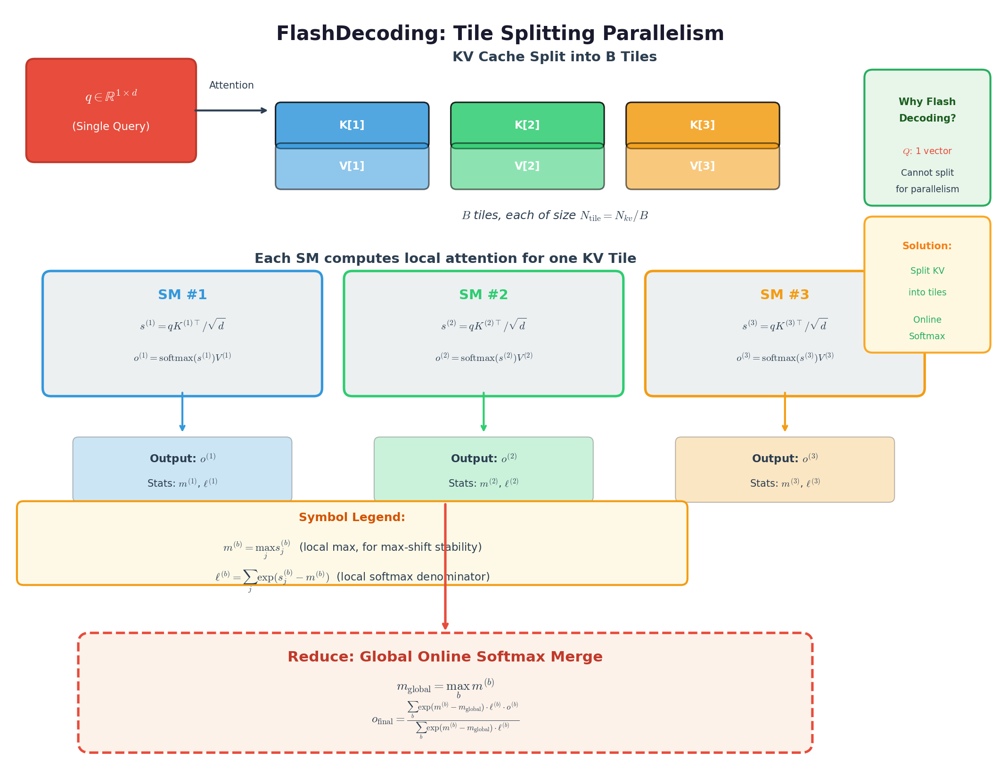
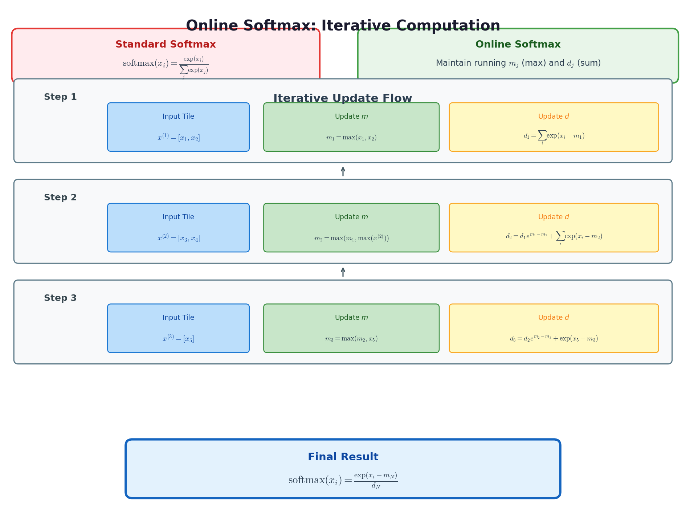
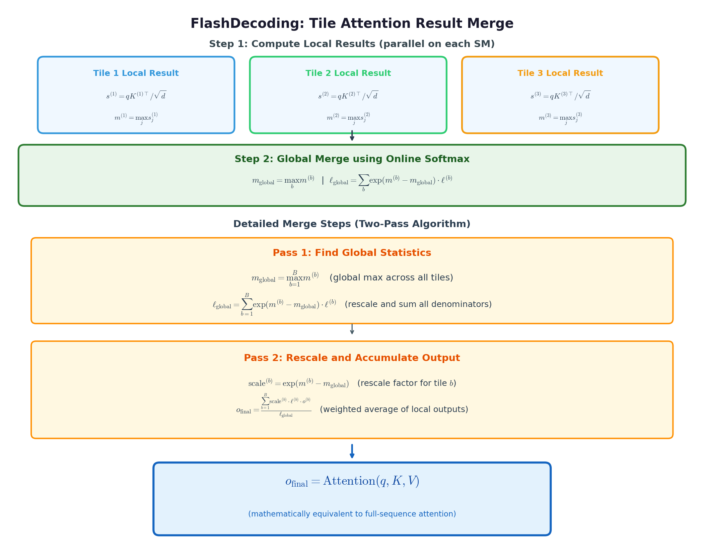
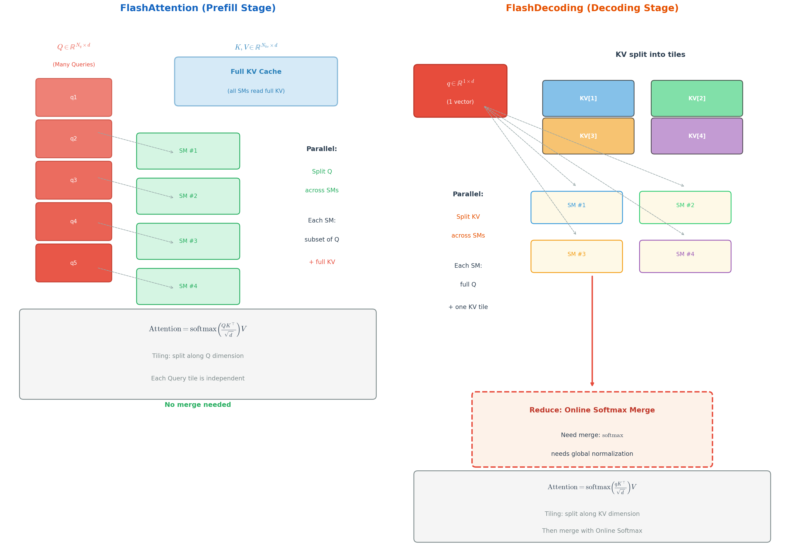

# FlashDecoding 数学推导

> 参考网页：https://zhuanlan.zhihu.com/p/1988996116017086993

---

## 一、公式作用概述

FlashDecoding 是一种用于**大语言模型（LLM）推理解码阶段（Decoding Stage）** 的高效注意力计算算法。在 Decoding 阶段，模型每次只生成一个新 token，因此 Query 的长度为 1，这导致 GPU 的并行度严重不足（大量流式多处理器 SM 处于空闲状态）。FlashDecoding 的核心思想是：**将 KV Cache（键值缓存）沿序列维度切分为多个 Tile（子块），分配到不同的 SM 上并行计算局部注意力结果，最后通过 Online Softmax 技术将各局部结果合并为全局正确的输出**。这种方法在不改变计算结果精度的前提下，显著提升了长序列解码的 GPU 利用率，实现了高达 8 倍的加速。

---

## 二、完整推导过程

### 2.1 问题背景与动机

#### 2.1.1 标准 Attention 的定义

给定单个 Query 向量 $\mathbf{q} \in \mathbb{R}^{1 \times d}$（解码阶段 Query 序列长度为 1），以及 Key 矩阵 $\mathbf{K} \in \mathbb{R}^{N_{kv} \times d}$ 和 Value 矩阵 $\mathbf{V} \in \mathbb{R}^{N_{kv} \times d}$，其中 $N_{kv}$ 是 KV Cache 的序列长度（可能很长），$d$ 是注意力头维度。标准的缩放点积注意力（Scaled Dot-Product Attention）定义为：

$$
\mathrm{Attention}(\mathbf{q}, \mathbf{K}, \mathbf{V}) = \mathrm{softmax}\left(\frac{\mathbf{q}\mathbf{K}^{\top}}{\sqrt{d}}\right) \mathbf{V}
$$

**为什么要除以 $\sqrt{d}$？** 这是因为当维度 $d$ 较大时，点积的数值会变得非常大，导致 softmax 函数的梯度变得非常小（梯度消失问题）。除以 $\sqrt{d}$ 可以将点积的方差缩放到约 1，保持数值稳定性。

> **【知识卡片：Softmax 函数】**
> - **定义**：Softmax 函数将一个实数向量转换为概率分布，使得所有输出值在 $(0, 1)$ 之间且和为 1。
> - **公式**：对于向量 $\mathbf{x} = [x_1, x_2, \ldots, x_n]$，$\mathrm{softmax}(x_i) = \frac{\exp(x_i)}{\sum_{j=1}^{n} \exp(x_j)}$。
> - **本步作用**：将注意力分数转换为权重分布，使得所有位置的重要性之和为 1。

#### 2.1.2 解码阶段的并行度瓶颈

在**预填充阶段（Prefill Stage）**，输入序列长度 $N_q$ 较大，Query 矩阵 $\mathbf{Q} \in \mathbb{R}^{N_q \times d}$ 有很多行。FlashAttention 的做法是：将 $\mathbf{Q}$ 沿行维度切分为多个 Tile，不同 Tile 分配给不同的 SM 并行计算。**每个 SM 处理一部分 Query，但需要使用完整的 $\mathbf{K}$ 和 $\mathbf{V}$**。

然而，在**解码阶段（Decoding Stage）**，模型正在自回归地生成新 token，每次只需要计算**一个 Query**（即新 token 的 Query），所以 $\mathbf{q} \in \mathbb{R}^{1 \times d}$。这意味着：

- **无法通过切分 Query 来获得并行度**（Query 只有一行）。
- 如果使用 FlashAttention 的原版策略，只有一个 SM（或少量 SM）在工作，**大量 SM 空闲**。
- 同时，KV Cache 的序列长度 $N_{kv}$ 可能非常长（例如 32K、64K 甚至更长），读取 KV Cache 成为瓶颈。

#### 2.1.3 FlashDecoding 的核心思想

FlashDecoding 的解决方案是**反转并行策略**：

1. **不再切分 Query**（因为 Query 只有一行）。
2. **改为切分 KV Cache**：将 $\mathbf{K}$ 和 $\mathbf{V}$ 沿序列维度切分为 $B$ 个 Tile：
   $$\mathbf{K} = [\mathbf{K}^{(1)}; \mathbf{K}^{(2)}; \ldots; \mathbf{K}^{(B)}], \quad \mathbf{V} = [\mathbf{V}^{(1)}; \mathbf{V}^{(2)}; \ldots; \mathbf{V}^{(B)}]$$
   其中每个 $\mathbf{K}^{(b)}, \mathbf{V}^{(b)} \in \mathbb{R}^{N_{\text{tile}} \times d}$，$N_{\text{tile}} = N_{kv} / B$。

3. **每个 SM 处理一个 KV Tile**：SM $b$ 计算 $\mathbf{q}$ 与 $\mathbf{K}^{(b)}, \mathbf{V}^{(b)}$ 的局部注意力结果。

4. **使用 Online Softmax 合并局部结果**：由于 softmax 涉及全局归一化（需要知道所有位置的 exp 之和），各 SM 的局部结果不能直接相加，需要通过 Online Softmax 技巧进行归一化合并。

---

### 2.2 分块 Attention 的局部计算

将 KV Cache 切分为 $B$ 个 Tile 后，第 $b$ 个 Tile（$b = 1, 2, \ldots, B$）的局部注意力计算为：

$$
\mathbf{s}^{(b)} = \frac{\mathbf{q} \mathbf{K}^{(b)\top}}{\sqrt{d}} \in \mathbb{R}^{1 \times N_{\text{tile}}}
$$

其中 $\mathbf{s}^{(b)}$ 是第 $b$ 个 Tile 上的注意力分数向量。

---

### 2.3 Online Softmax：核心数学工具

FlashDecoding 的关键挑战在于：**如何将各 SM 计算的局部 softmax 结果合并为全局正确的 softmax 输出？**

#### 2.3.1 标准 Softmax 的数值稳定版本

标准 softmax 定义：

$$
\mathrm{softmax}(x_i) = \frac{\exp(x_i)}{\sum_{j=1}^{N} \exp(x_j)}
$$

在数值计算中，直接使用这个公式会有数值溢出的风险：如果某个 $x_i$ 很大，$\exp(x_i)$ 会超出浮点数表示范围。**数值稳定的 softmax** 实现利用了以下恒等式：

$$
\mathrm{softmax}(x_i) = \frac{\exp(x_i)}{\sum_{j=1}^{N} \exp(x_j)} = \frac{\exp(x_i - m)}{\sum_{j=1}^{N} \exp(x_j - m)}
$$

分子分母同乘 $\exp(-m)$ 即可得该恒等式。其中 $m = \max_{j=1}^{N} x_j$ 是输入向量的最大值。

#### 2.3.2 Online Softmax 的递推公式

Online Softmax 的核心观察是：**可以将 softmax 的计算分解为增量更新**。假设我们已经处理了前 $j-1$ 个元素，现在要加入第 $j$ 个元素 $x_j$，可以维护两个状态变量：

- **$m_j$**：前 $j$ 个元素中的最大值（running maximum）
- **$d_j$**：前 $j$ 个元素的 $\exp$ 之和（running sum of exponentials）: $d_j = \sum_{i=1}^{j} \exp(x_i - m_j)$

初始状态：$m_1 = x_1$，$d_1 = \exp(x_1 - m_1) = \exp(0) = 1$。

递推更新（对于 $j = 2, 3, \ldots, N$）：

$$
m_j = \max(m_{j-1}, x_j)
$$

$$
d_j = d_{j-1} \cdot \exp(m_{j-1} - m_j) + \exp(x_j - m_j)
$$

处理完全部 $N$ 个元素后，状态为 $(m_N, d_N)$。对任意 $x_i$：
$$
\mathrm{softmax}(x_i) = \frac{\exp(x_i - m_N)}{d_N} = \frac{\exp(x_i - m_N)}{\sum_{j=1}^{N} \exp(x_j - m_N)}
$$

即 Online Softmax 与 标准 Softmax **数学等价**。

> **【Online Softmax 推导】**
> 
> 将 $d_j$ 拆分为历史项与新项：
> $$
d_j = \underbrace{\sum_{i=1}^{j-1} \exp(x_i - m_j)}_{\text{历史 } j-1 \text{ 项}} + \underbrace{\exp(x_j - m_j)}_{\text{新项 } x_j}$$
> 对任意历史项 $i \le j-1$，做基准平移：
> $$
\exp(x_i - m_j) = \exp(x_i - m_{j-1} + m_{j-1} - m_j) = \exp(x_i - m_{j-1}) \cdot \exp(m_{j-1} - m_j)$$
> 对 $i = 1, \dots, j-1$ 求和：
> $$
\sum_{i=1}^{j-1} \exp(x_i - m_j) = \exp(m_{j-1} - m_j) \cdot \underbrace{\sum_{i=1}^{j-1} \exp(x_i - m_{j-1})}_{= d_{j-1}} $$
> 合并得到递推式：
> $$
d_j = d_{j-1} \cdot \exp(m_{j-1} - m_j) + \exp(x_j - m_j) $$

> **【小例子：Online Softmax 和标准 Softmax 数学等价】**
> 设 $\mathbf{x} = [1.0, 2.0, 0.5]$。
>
> **初始化**（$j=1$）：$m_1 = 1.0$，$d_1 = \exp(1.0 - 1.0) = 1.0$。
>
> **第 2 步**（$j=2$，$x_2 = 2.0$）：
> - $m_2 = \max(1.0, 2.0) = 2.0$
> - $d_2 = 1.0 \cdot \exp(1.0 - 2.0) + \exp(2.0 - 2.0) = \exp(-1.0) + \exp(0) = 0.368 + 1.0 = 1.368$
>
> **第 3 步**（$j=3$，$x_3 = 0.5$）：
> - $m_3 = \max(2.0, 0.5) = 2.0$
> - $d_3 = 1.368 \cdot \exp(2.0 - 2.0) + \exp(0.5 - 2.0) = 1.368 \cdot 1.0 + \exp(-1.5) = 1.368 + 0.223 = 1.591$
>
> **最终结果**：
> - $\mathrm{softmax}(x_1) = \exp(1.0 - 2.0) / 1.591 = 0.368 / 1.591 = 0.231$
> - $\mathrm{softmax}(x_2) = \exp(2.0 - 2.0) / 1.591 = 1.0 / 1.591 = 0.629$
> - $\mathrm{softmax}(x_3) = \exp(0.5 - 2.0) / 1.591 = 0.223 / 1.591 = 0.140$
>
> **验证**（直接计算）：
> $\exp(1.0) = 2.718$，$\exp(2.0) = 7.389$，$\exp(0.5) = 1.649$，和 = $11.756$。
> - $\mathrm{softmax}(x_1) = 2.718 / 11.756 = 0.231$ ✓
> - $\mathrm{softmax}(x_2) = 7.389 / 11.756 = 0.629$ ✓
> - $\mathrm{softmax}(x_3) = 1.649 / 11.756 = 0.140$ ✓

---

### 2.4 FlashDecoding 的分块合并推导

#### 2.4.0 关键符号约定

在深入推导之前，先明确三个**核心符号**的含义。这些符号是理解 FlashDecoding 分块合并机制的关键：

| 符号 | 名称 | 含义 | 在 Online Softmax 中的作用 |
|------|------|------|------------------------|
| $m^{(b)}$ | 局部最大值 | 第 $b$ 个 Tile 中所有注意力分数的最大值 | 用于数值稳定：计算 $\exp(s_j - m^{(b)})$ 时避免指数溢出 |
| $\ell^{(b)}$（或写作 $l^{(b)}$） | 局部指数和 | 第 $b$ 个 Tile 中所有 $\exp(s_j - m^{(b)})$ 的和 | 作为该 Tile 局部 softmax 的归一化分母 |
| $\mathbf{o}^{(b)}$ | 局部输出 | 第 $b$ 个 Tile 的局部注意力结果 | 该 Tile 内部做 softmax 后的加权平均值 |

#### 2.4.1 每个 Tile 的局部计算

对于第 $b$ 个 KV Tile（$b = 1, 2, \ldots, B$），SM $b$ 并行计算以下四个量：

1. **注意力分数**：$\mathbf{s}^{(b)} = \frac{\mathbf{q} \mathbf{K}^{(b)\top}}{\sqrt{d}} \in \mathbb{R}^{1 \times N_{\text{tile}}}$
   - 这是 Query $\mathbf{q}$ 与 Tile $b$ 中所有 Key 的相似度分数向量。

2. **局部最大值**（running max）：$m^{(b)} = \max_{j=1}^{N_{\text{tile}}} s_j^{(b)}$
   - 该 Tile 中最大的注意力分数，用于数值稳定。

3. **局部指数和**（running sum）：$\ell^{(b)} = \sum_{j=1}^{N_{\text{tile}}} \exp\bigl(s_j^{(b)} - m^{(b)}\bigr)$
   - 该 Tile 内所有（经数值稳定后的）指数值之和，充当局部 softmax 的分母。

4. **局部加权输出**：$\mathbf{o}^{(b)} = \frac{\sum_{j=1}^{N_{\text{tile}}} \exp\bigl(s_j^{(b)} - m^{(b)}\bigr) \cdot \mathbf{V}_j^{(b)}}{\ell^{(b)}} \in \mathbb{R}^{1 \times d}$
   - 该 Tile 的局部 softmax 结果，即 Value 的加权平均，权重来自局部 softmax。

> **重要说明**：这里的 $\mathbf{o}^{(b)}$ 是**局部 softmax 结果**——它只考虑了 Tile $b$ 内部的归一化。如果直接将所有 $\mathbf{o}^{(b)}$ 相加，结果不等于全局 Attention，因为每个 Tile 的 softmax 分母 $\ell^{(b)}$ 只包含了该 Tile 内的指数和，而非全局所有位置的指数和。**必须通过 2.4.2 节的全局合并公式才能得到正确结果**。

#### 2.4.2 全局合并公式推导

**目标**：给定所有 Tile 的局部统计量 $\{(m^{(b)}, \ell^{(b)}, \mathbf{o}^{(b)})\}_{b=1}^{B}$，求全局正确的注意力输出 $\mathbf{o}_{\text{final}}$。

**步骤 1：求全局最大值**

全局最大值是所有 Tile 最大值的再取最大：

$$
m_{\text{global}} = \max_{b=1}^{B} m^{(b)}
$$

**为什么要这一步？** 因为每个 Tile 的局部计算已经减去了自己的局部最大值 $m^{(b)}$，但全局 softmax 需要减去全局最大值 $m_{\text{global}}$。我们需要找到所有分数中的真正最大值。

**步骤 2：计算全局归一化因子**

全局的指数和需要将每个 Tile 的局部指数和 "重新缩放" 到全局最大值的尺度上：

$$
\ell_{\text{global}} = \sum_{b=1}^{B} \exp(m^{(b)} - m_{\text{global}}) \cdot \ell^{(b)}
$$

> **推导依据**：
> $$
> \ell_{\text{global}} =\sum_{b=1}^{B} \sum_{j=1}^{N_{\text{tile}}} \exp(s_j^{(b)} - m_{\text{global}}) = \\
\sum_{b=1}^{B} \exp(m^{(b)} - m_{\text{global}}) \sum_{j=1}^{N_{\text{tile}}} \exp(s_j^{(b)} - m^{(b)}) = \\
\sum_{b=1}^{B} \exp(m^{(b)} - m_{\text{global}}) \cdot \ell^{(b)}$$

> **【知识卡片：指数乘法恒等式】**
> - **定义**：指数函数满足 $\exp(a + b) = \exp(a) \cdot \exp(b)$。
> - **公式**：$\exp(x - m_{\text{global}}) = \exp(x - m^{(b)}) \cdot \exp(m^{(b)} - m_{\text{global}})$。
> - **本步作用**：将局部坐标系（以 $m^{(b)}$ 为参考）的指数值转换到全局坐标系（以 $m_{\text{global}}$ 为参考），使得来自不同 Tile 的数值可以在同一尺度上相加。

> **【小例子：尺度转换】**
> 假设 Tile 1 的最大值 $m^{(1)} = 5.0$，Tile 2 的最大值 $m^{(2)} = 8.0$，则 $m_{\text{global}} = 8.0$。
> 对于 Tile 1 中的某个分数 $s_j^{(1)} = 3.0$：
> - 局部坐标：$\exp(s_j^{(1)} - m^{(1)}) = \exp(3.0 - 5.0) = \exp(-2.0) = 0.135$
> - 全局坐标：$\exp(s_j^{(1)} - m_{\text{global}}) = \exp(3.0 - 8.0) = \exp(-5.0) = 0.00674$
> - 用恒等式：$\exp(3.0 - 5.0) \cdot \exp(5.0 - 8.0) = 0.135 \cdot 0.0498 = 0.00674$ ✓

**步骤 3：合并局部输出**

全局的输出向量是所有 Tile 局部输出的加权平均，权重包含了重新缩放因子：

$$
\mathbf{o}_{\text{final}} = \frac{\sum_{b=1}^{B} \exp(m^{(b)} - m_{\text{global}}) \cdot \ell^{(b)} \cdot \mathbf{o}^{(b)}}{\ell_{\text{global}}}
$$

> **推导依据**：
> $$
> \mathbf{o}_{\text{final}} = \frac{\sum_{b=1}^{B} \sum_{j=1}^{N_{\text{tile}}} \exp(s_j^{(b)} - m_{\text{global}}) \cdot \mathbf{V}_j^{(b)}}{\sum_{b=1}^{B} \sum_{j=1}^{N_{\text{tile}}} \exp(s_j^{(b)} - m_{\text{global}})}
> $$
>
> 分子展开：
> $$
> \sum_{b=1}^{B} \sum_{j=1}^{N_{\text{tile}}} \exp(s_j^{(b)} - m_{\text{global}}) \cdot \mathbf{V}_j^{(b)} = \\
\sum_{b=1}^{B} \exp(m^{(b)} - m_{\text{global}}) \sum_{j=1}^{N_{\text{tile}}} \exp(s_j^{(b)} - m^{(b)}) \cdot \mathbf{V}_j^{(b)}
> $$
>
> 注意到 $\mathbf{o}^{(b)} = \frac{\sum_{j=1}^{N_{\text{tile}}} \exp(s_j^{(b)} - m^{(b)}) \cdot \mathbf{V}_j^{(b)}}{\ell^{(b)}}$，所以 $\sum_{j=1}^{N_{\text{tile}}} \exp(s_j^{(b)} - m^{(b)}) \cdot \mathbf{V}_j^{(b)} = \ell^{(b)} \cdot \mathbf{o}^{(b)}$。
>
> 代入即得：
> $$
> \mathbf{o}_{\text{final}} = \frac{\sum_{b=1}^{B} \exp(m^{(b)} - m_{\text{global}}) \cdot \ell^{(b)} \cdot \mathbf{o}^{(b)}}{\ell_{\text{global}}}
> $$

---

### 2.5 完整算法流程

综合以上推导，FlashDecoding 的完整算法流程如下：

**输入**：Query 向量 $\mathbf{q} \in \mathbb{R}^{1 \times d}$，Key 矩阵 $\mathbf{K} \in \mathbb{R}^{N_{kv} \times d}$，Value 矩阵 $\mathbf{V} \in \mathbb{R}^{N_{kv} \times d}$，Tile 大小 $N_{\text{tile}}$。

**输出**：全局注意力结果 $\mathbf{o}_{\text{final}} \in \mathbb{R}^{1 \times d}$。

---

**阶段 1：各 SM 并行计算局部结果（步骤 (2a)-(2d) 对每个 Tile 并行执行）**

对每个 Tile $b = 1, 2, \ldots, B$（其中 $B = \lceil N_{kv} / N_{\text{tile}} \rceil$）：

(2a) 提取 KV Tile：

$$
\mathbf{K}^{(b)} = \mathbf{K}[(b-1) \cdot N_{\text{tile}} \;:\; \min(b \cdot N_{\text{tile}}, N_{kv}), \; :] \in \mathbb{R}^{N_{\text{tile}}^{(b)} \times d}
$$

$$
\mathbf{V}^{(b)} = \mathbf{V}[(b-1) \cdot N_{\text{tile}} \;:\; \min(b \cdot N_{\text{tile}}, N_{kv}), \; :] \in \mathbb{R}^{N_{\text{tile}}^{(b)} \times d}
$$

(2b) 计算注意力分数：

$$
\mathbf{s}^{(b)} = \frac{\mathbf{q} \mathbf{K}^{(b)\top}}{\sqrt{d}} \in \mathbb{R}^{1 \times N_{\text{tile}}^{(b)}}
$$

(2c) 计算局部统计量（数值稳定的 Online Softmax）：

$$
m^{(b)} = \max_{j=1}^{N_{\text{tile}}^{(b)}} s_j^{(b)}
$$

$$
\ell^{(b)} = \sum_{j=1}^{N_{\text{tile}}^{(b)}} \exp(s_j^{(b)} - m^{(b)})
$$

$$
\mathbf{o}^{(b)} = \frac{\sum_{j=1}^{N_{\text{tile}}^{(b)}} \exp(s_j^{(b)} - m^{(b)}) \cdot \mathbf{V}_j^{(b)}}{\ell^{(b)}} \in \mathbb{R}^{1 \times d}
$$

---

**阶段 2：全局归约合并（一个轻量级的 Reduce Kernel）**

(3a) 求全局最大值：

$$
m_{\text{global}} = \max_{b=1}^{B} m^{(b)}
$$

(3b) 计算全局归一化因子：

$$
\ell_{\text{global}} = \sum_{b=1}^{B} \exp(m^{(b)} - m_{\text{global}}) \cdot \ell^{(b)}
$$

(3c) 合并局部输出：

$$
\mathbf{o}_{\text{final}} = \frac{\sum_{b=1}^{B} \exp(m^{(b)} - m_{\text{global}}) \cdot \ell^{(b)} \cdot \mathbf{o}^{(b)}}{\ell_{\text{global}}}
$$

---

### 2.6 等价性证明

**定理**：FlashDecoding 的分块计算结果与全序列直接计算的 Attention 结果完全等价。

**证明**：

全序列直接计算的注意力输出为：

$$
\mathbf{o}_{\text{direct}} = \frac{\sum_{j=1}^{N_{kv}} \exp(s_j - m_{\text{global}}) \cdot \mathbf{V}_j}{\sum_{j=1}^{N_{kv}} \exp(s_j - m_{\text{global}})}
$$

其中 $s_j = \frac{\mathbf{q} \cdot \mathbf{K}_j}{\sqrt{d}}$，$m_{\text{global}} = \max_j s_j$。

将序列按 Tile 划分后，分子和分母都可以按 Tile 分解：

$$
\sum_{j=1}^{N_{kv}} \exp(s_j - m_{\text{global}}) \cdot \mathbf{V}_j = \sum_{b=1}^{B} \sum_{j \in \text{Tile } b} \exp(s_j - m_{\text{global}}) \cdot \mathbf{V}_j
$$

对于 Tile $b$ 内部的元素，利用 $m^{(b)}$ 进行分解：

$$
\exp(s_j - m_{\text{global}}) = \exp(s_j - m^{(b)}) \cdot \exp(m^{(b)} - m_{\text{global}})
$$

因此：

$$
\sum_{j \in \text{Tile } b} \exp(s_j - m_{\text{global}}) \cdot \mathbf{V}_j = \exp(m^{(b)} - m_{\text{global}}) \sum_{j \in \text{Tile } b} \exp(s_j - m^{(b)}) \cdot \mathbf{V}_j = \\

\exp(m^{(b)} - m_{\text{global}}) \cdot \ell^{(b)} \cdot \mathbf{o}^{(b)}
$$

同理，分母：

$$
\sum_{j=1}^{N_{kv}} \exp(s_j - m_{\text{global}}) = \sum_{b=1}^{B} \exp(m^{(b)} - m_{\text{global}}) \cdot \ell^{(b)} = \ell_{\text{global}}
$$

因此：

$$
\mathbf{o}_{\text{direct}} = \frac{\sum_{b=1}^{B} \exp(m^{(b)} - m_{\text{global}}) \cdot \ell^{(b)} \cdot \mathbf{o}^{(b)}}{\ell_{\text{global}}} = \mathbf{o}_{\text{final}}
$$

**证毕。** 

---

### 2.7 与 FlashAttention 的对比

| 特性 | FlashAttention（Prefill） | FlashDecoding（Decoding） |
|------|---------------------------|---------------------------|
| Query 长度 | $N_q \gg 1$（长序列） | $N_q = 1$（单个 token） |
| 切分维度 | 沿 Query 维度切分 | 沿 KV Cache 维度切分 |
| 并行来源 | 多个 Query Tile 并行 | 多个 KV Tile 并行 |
| 每个 SM 的工作 | 处理部分 Query + 完整 KV | 处理完整 Query + 部分 KV |
| 是否需要合并 | 不需要（各 SM 结果独立） | 需要 Online Softmax 合并 |
| 适用阶段 | Prefill（编码阶段） | Decoding（解码阶段） |

---

## 三、涉及的基本数学知识清单

| 概念名称 | 在本推导中的具体作用 | 一句话定义或公式表达 |
|---------|---------------------|---------------------|
| Softmax 函数 | 将注意力分数转换为概率分布 | $\mathrm{softmax}(x_i) = \frac{\exp(x_i)}{\sum_j \exp(x_j)}$ |
| 缩放点积注意力 | 定义 Query 与 KV 的交互方式 | $\mathrm{Attention}(Q,K,V) = \mathrm{softmax}(QK^T/\sqrt{d})V$ |
| Max-Shift 数值稳定 | 避免 softmax 计算中的指数溢出 | $\mathrm{softmax}(x_i) = \frac{\exp(x_i - m)}{\sum_j \exp(x_j - m)}$，$m = \max_j x_j$ |
| Online Softmax | 支持增量式 softmax 计算，是分块合并的核心 | 递推维护 $m_j = \max(m_{j-1}, x_j)$ 和 $d_j = d_{j-1} \cdot \exp(m_{j-1} - m_j) + \exp(x_j - m_j)$ |
| 指数乘法恒等式 | 将局部坐标系的指数值转换到全局坐标系 | $\exp(a - c) = \exp(a - b) \cdot \exp(b - c)$ |
| 矩阵乘法 | 计算 Query 与 Key 的相似度分数 | $(\mathbf{A}\mathbf{B}^{\top})_{i,j} = \sum_{k} A_{i,k} \cdot B_{j,k}$ |
| GPU SM（流式多处理器） | FlashDecoding 要充分利用的并行计算资源 | GPU 的核心计算单元，多个 SM 可同时执行不同任务 |
| 递推关系 | 描述 Online Softmax 的逐步累积过程 | $a_n = f(a_{n-1}, \text{new\_input})$ |
| 最大值运算 | 确定全局 softmax 的参考点 | $m_{\text{global}} = \max_b m^{(b)}$ |
| 加权平均 | 合并各 Tile 的局部输出为全局输出 | $\mathbf{o}_{\text{final}} = \frac{\sum_b w_b \cdot \mathbf{o}^{(b)}}{\sum_b w_b}$ |

---

## 四、总结

FlashDecoding 是一种针对 LLM 推理**解码阶段**的高效注意力算法。其核心创新在于：

1. **反转并行策略**：Prefill 阶段切分 Query，Decoding 阶段切分 KV Cache。
2. **Online Softmax 合并**：通过维护每个 Tile 的局部最大值 $m^{(b)}$ 和局部指数和 $\ell^{(b)}$，在全局归约阶段将各局部结果正确合并。
3. **数学等价性**：分块计算的结果与全序列直接计算的结果完全等价（已在 2.6 节证明）。

FlashDecoding 的完整公式可以概括为：

**局部计算（每个 Tile 并行）**：

$$
\mathbf{s}^{(b)} = \frac{\mathbf{q} \mathbf{K}^{(b)\top}}{\sqrt{d}}, \quad m^{(b)} = \max_j s_j^{(b)}, \quad \ell^{(b)} = \sum_j \exp(s_j^{(b)} - m^{(b)}), \\

\quad \mathbf{o}^{(b)} = \frac{\sum_j \exp(s_j^{(b)} - m^{(b)}) \mathbf{V}_j^{(b)}}{\ell^{(b)}}
$$

**全局合并**：

$$
m_{\text{global}} = \max_b m^{(b)}, \quad \mathbf{o}_{\text{final}} = \frac{\sum_{b=1}^{B} \exp(m^{(b)} - m_{\text{global}}) \cdot \ell^{(b)} \cdot \mathbf{o}^{(b)}}{\sum_{b=1}^{B} \exp(m^{(b)} - m_{\text{global}}) \cdot \ell^{(b)}}
$$

该算法已被集成到 FlashAttention 2.2+、xFormers、FlashInfer 等主流推理加速库中，成为长序列 LLM 推理的标准优化技术。

---

