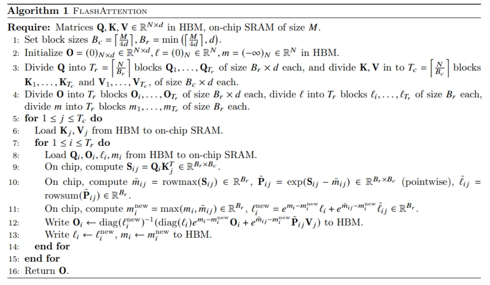
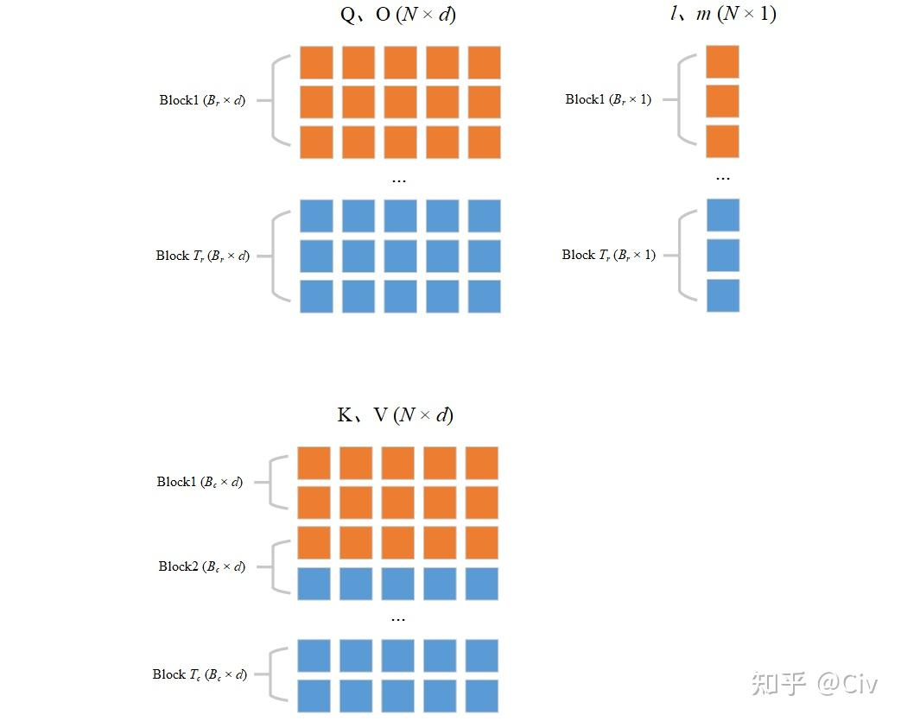
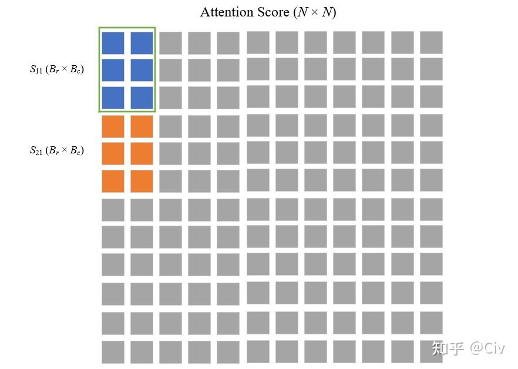

> 上一篇：[解析 FlashAttention（1）：从标准 Attention 讲起](https://my-webpage-adu.pages.dev/posts/llm%E6%8E%A8%E7%90%86%E6%A1%86%E6%9E%B6/2026-08-20-%E8%A7%A3%E6%9E%90-flashattention-1-%E4%BB%8E%E6%A0%87%E5%87%86-attention-%E8%AE%B2%E8%B5%B7/)
>
> 参考：[万字长文详解FlashAttention v1/v2](https://zhuanlan.zhihu.com/p/642962397)

---

## 1. 背景 & 动机

### 1.1 标准 Attention 的核心矛盾

对于标准 Attention，公式如下：

$$
\mathrm{Attention}(\mathbf{Q}, \mathbf{K}, \mathbf{V}) = \mathrm{softmax}\left(\frac{\mathbf{Q}\mathbf{K}^{\top}}{\sqrt{d}}\right) \mathbf{V}
$$

它具体的计算过程为：

$$
\mathbf{S} = \mathbf{Q}\mathbf{K}^\top \rightarrow \mathbf{P} = \text{softmax}(\mathbf{S}) \rightarrow \mathbf{O} = \mathbf{P}\mathbf{V}
$$

涉及的内存操作如下，它主要使用了 HBM：

图中一共包含八次 HBM 的矩阵读写操作。这八次读写操作分别为：

- **Line 1**: 对 $Q$, $K$ 的读取共两次，对 $S$ 的写入一次，读写总共三次；
- **Line 2**: 对 $S$ 读取一次，对 $P$ 写入一次，读写总共两次；
- **Line 3**: 对 $P$, $V$ 的读取共两次，对 $O$ 的写入一次，读写总共三次。

### 1.2 FlashAttention 的核心思路

FlashAttention 的动机建立在三个观察上：

| 观察 | 含义 |
|------|------|
| **1. 内存层级差异巨大** | GPU 的 SRAM（如 Shared Memory）比 HBM 快约 10–100 倍，但容量极小（如 A100 每 SM 仅 192KB）。标准 Attention 无视这一层级，把中间矩阵 $\mathbf{S}, \mathbf{P}$ 放在 HBM 中反复读写，导致算法受限于 HBM 带宽，成为 **memory-bound**。 |
| **2. Attention 本不需要 $O(N^2)$ 显存** | 最终输出 $\mathbf{O}$ 只有 $N \times d$，理论额外内存可以是 $O(N)$。存储巨大的 $\mathbf{S}, \mathbf{P}$ 是**实现方式**的浪费，不是算法必需。 |
| **3. Softmax 可以"在线"算** | 以前认为 softmax 必须看到全部数字才能归一化。但实际上可以通过维护一个**滑动最大值和累加和**，在流式看到数据时增量地得到正确结果（Online Softmax）。 |

具体怎么做：

**（1）Tiling（分块）**

把 $\mathbf{Q}, \mathbf{K}, \mathbf{V}$ 切成足够小的块，使得一小块 $\mathbf{Q}_i$ 和 $\mathbf{K}_j$ 能在 SRAM 里完成矩阵乘法。这样 $\mathbf{S}_{ij}$ 的每个块在 SRAM 里生成，用完即弃，**从不写回 HBM**。

**（2）Online Softmax（在线归一化）**

Softmax 需要全局信息（最大值、指数和），分块计算时怎么办？  
技巧是维护两个统计量：
- $m$：当前见过的最大值（用于数值稳定性）
- $\ell$：当前指数和

当新的数据块进来时，用这两个量**修正**之前的结果，逐步逼近全局 softmax。这样不需要等所有 $\mathbf{S}$ 算完就能开始归一化。

**（3）反向传播的重计算（Recomputation）**

训练时反向传播需要 $\mathbf{P}$ 的梯度。既然 $\mathbf{P}$ 没存，FlashAttention 在反向时**重新计算** $\mathbf{P}$——但它只需要重新加载 $\mathbf{Q}, \mathbf{K}$ 的小块，在 SRAM 里快速重算，成本远低于存储和读取巨大的 $\mathbf{P}$ 矩阵。

整个 FlashAttention v1 的分块运算可视化过程如下:

[flash_attention_visualization.html](attach/flash_attention_visualization.html)

下面正式开始介绍 [FlashAttention v1](https://arxiv.org/pdf/2205.14135) 版本的实现。

---

## 2. 前向传播: 标准 softmax 及其数值稳定版本

### 2.1 标准 softmax 数值稳定版本

以一维向量举例，标准 softmax 对向量 $x \in \mathbb{R}^B$ 的第 $i$ 个分量计算如下：

$$\text{softmax}(x_i) = \frac{e^{x_i}}{\sum_{j=1}^{B} e^{x_j}} \quad (1)$$

由于分子和分母均包含指数项，当 $x_i$ 较大时 $e^{x_i}$ 容易上溢，当 $x$ 中各元素均为较大负值时 $e^{x_i}$ 容易下溢导致分母为零。因此引入稳定版本。设 $m(x) = \max_{j} x_j$，在公式 (1) 的分子和分母上同乘 $e^{-m(x)}$，数学等价：

$$\text{softmax}(x_i) = \frac{e^{x_i} \cdot e^{-m(x)}}{\sum_{j=1}^{B} e^{x_j} \cdot e^{-m(x)}} = \frac{e^{x_i - m(x)}}{\sum_{j=1}^{B} e^{x_j - m(x)}} \quad (2)$$

基于该等价形式，定义平移后的指数向量：

$$f(x) = \left[e^{x_1 - m(x)},\ e^{x_2 - m(x)},\ \dots,\ e^{x_B - m(x)}\right] \quad (3)$$

再定义 EXP 求和项：

$$l(x) = \sum_{j=1}^{B} f(x)_j = \sum_{j=1}^{B} e^{x_j - m(x)} \quad (4)$$

最终稳定版 softmax 写为：

$$\text{softmax}(x) = \frac{f(x)}{l(x)} \quad (5)$$

此版本中分子最大项为 $e^{x_{\max} - m(x)} = e^0 = 1$，分母至少为 $1$，彻底消除了数值溢出的风险。

### 2.2 分块策略

设待计算 softmax 的向量 $x \in \mathbb{R}^{2B}$，将其按列一切为二：

$$x = \left[x^{(1)},\ x^{(2)}\right] \quad (6)$$

其中 $x^{(1)} \in \mathbb{R}^B$ 为第 1 个分块，$x^{(2)} \in \mathbb{R}^B$ 为第 2 个分块。上标 $(1)$ 与 $(2)$ 表示分块序号，下标 $1, 2, \dots, B$ 表示该分块内的元素索引。目标是先处理 $x^{(1)}$，再处理 $x^{(2)}$，最终得到与全局一次性计算完全一致的 softmax 结果。

### 2.3 第一块的局部 softmax 与全局统计量初始化

处理 $x^{(1)}$，计算其局部统计量。局部最大值：

$$m(x^{(1)}) = \max_{j=1}^{B} x^{(1)}_j \quad (7)$$

局部平移指数向量：

$$f(x^{(1)}) = \left[e^{x^{(1)}_1 - m(x^{(1)})},\ e^{x^{(1)}_2 - m(x^{(1)})},\ \dots,\ e^{x^{(1)}_B - m(x^{(1)})}\right] \quad (8)$$

局部 EXP 求和项：

$$l(x^{(1)}) = \sum_{j=1}^{B} f(x^{(1)})_j = \sum_{j=1}^{B} e^{x^{(1)}_j - m(x^{(1)})} \quad (9)$$

局部 softmax：

$$\text{softmax}(x^{(1)}) = \frac{f(x^{(1)})}{l(x^{(1)})} \quad (10)$$

此时 $\text{softmax}(x^{(1)})$ 是局部的而非全局的，原因有二：其一，分子减去的最大值是 $m(x^{(1)})$ 而非全局 $m(x)$，导致平移基准不一致；其二，分母是 $l(x^{(1)})$ 而非全局求和项，导致归一化因子只是局部和而非全体和。处理完 $x^{(1)}$ 后，初始化两个全局标量。当前全局最大值：

$$m_{\max} = m(x^{(1)}) \quad (11)$$

当前全局 EXP 求和项：

$$l_{all} = l(x^{(1)}) \quad (12)$$

### 2.4 第二块的局部 softmax

处理 $x^{(2)}$，同样计算局部统计量。局部最大值：

$$m(x^{(2)}) = \max_{j=1}^{B} x^{(2)}_j \quad (13)$$

局部平移指数向量：

$$f(x^{(2)}) = \left[e^{x^{(2)}_1 - m(x^{(2)})},\ e^{x^{(2)}_2 - m(x^{(2)})},\ \dots,\ e^{x^{(2)}_B - m(x^{(2)})}\right] \quad (14)$$

局部 EXP 求和项：

$$l(x^{(2)}) = \sum_{j=1}^{B} f(x^{(2)})_j = \sum_{j=1}^{B} e^{x^{(2)}_j - m(x^{(2)})} \quad (15)$$

局部 softmax：

$$\text{softmax}(x^{(2)}) = \frac{f(x^{(2)})}{l(x^{(2)})} \quad (16)$$

### 2.5 更新全局统计量

处理完 $x^{(2)}$ 后，需要利用 $x^{(2)}$ 的信息更新此前保存的两个全局标量 $m_{\max}$ 与 $l_{all}$，以便后续将各局部 softmax 合并为全局 softmax。

更新全局最大值：

$$m_{\max}^{\text{new}} = \max\left(m_{\max},\ m(x^{(2)})\right) \quad (17)$$

其含义为更新后的全局最大值是此前全局最大值与当前分块最大值中较大的那一个。

接下来更新全局 EXP 求和项。目标是得到以新的全局最大值 $m_{\max}^{\text{new}}$ 为基准的全体指数和。对于此前全局求和项 $l_{all}$，其当前以 $m_{\max}$ 为指数基准，即：

$$l_{all} = \sum_{k=1}^{B} e^{x^{(1)}_k - m_{\max}}$$

要将其基准由 $m_{\max}$ 调整至 $m_{\max}^{\text{new}}$，需对每一项同乘 $e^{m_{\max} - m_{\max}^{\text{new}}}$：

$$l_{all} \cdot e^{m_{\max} - m_{\max}^{\text{new}}} = \sum_{k=1}^{B} e^{x^{(1)}_k - m_{\max}} \cdot e^{m_{\max} - m_{\max}^{\text{new}}} = \sum_{k=1}^{B} e^{x^{(1)}_k - m_{\max}^{\text{new}}} \quad (18)$$

同理，对于当前分块 $x^{(2)}$ 的局部求和项 $l(x^{(2)})$，其当前以 $m(x^{(2)})$ 为基准：

$$l(x^{(2)}) = \sum_{k=1}^{B} e^{x^{(2)}_k - m(x^{(2)})}$$

要将其基准调整至 $m_{\max}^{\text{new}}$，需同乘 $e^{m(x^{(2)}) - m_{\max}^{\text{new}}}$：

$$l(x^{(2)}) \cdot e^{m(x^{(2)}) - m_{\max}^{\text{new}}} = \sum_{k=1}^{B} e^{x^{(2)}_k - m(x^{(2)})} \cdot e^{m(x^{(2)}) - m_{\max}^{\text{new}}} = \sum_{k=1}^{B} e^{x^{(2)}_k - m_{\max}^{\text{new}}} \quad (19)$$

将调整后的两部分求和相加，即得到以 $m_{\max}^{\text{new}}$ 为基准的全体指数和：

$$l_{all}^{\text{new}} = e^{m_{\max} - m_{\max}^{\text{new}}} \cdot l_{all} + e^{m(x^{(2)}) - m_{\max}^{\text{new}}} \cdot l(x^{(2)}) \quad (20)$$

为理解第二项 $e^{m(x^{(2)}) - m_{\max}^{\text{new}}} \cdot l(x^{(2)})$ 的来源，先将 $l(x^{(2)})$ 展开：

$$l(x^{(2)}) = \sum_{k=1}^{B} e^{x^{(2)}_k - m(x^{(2)})} \quad (21)$$

将其变换为以新的全局最大值 $m_{\max}^{\text{new}}$ 为基准：

$$\begin{aligned} l^{\text{new}}(x^{(2)}) &= l(x^{(2)}) \cdot e^{m(x^{(2)}) - m_{\max}^{\text{new}}} \\ &= \sum_{k=1}^{B} e^{x^{(2)}_k - m(x^{(2)})} \cdot e^{m(x^{(2)}) - m_{\max}^{\text{new}}} \\ &= \sum_{k=1}^{B} e^{x^{(2)}_k - m(x^{(2)}) + m(x^{(2)}) - m_{\max}^{\text{new}}} \\ &= \sum_{k=1}^{B} e^{x^{(2)}_k - m_{\max}^{\text{new}}} \end{aligned} \quad (22)$$

此时 $l(x^{(2)})$ 更新为全局的。也就是说，通过对 $l(x^{(2)})$ 乘上额外的项 $e^{m(x^{(2)}) - m_{\max}^{\text{new}}}$ 即可把 $l(x^{(2)})$ 更新为全局的 $l^{\text{new}}(x^{(2)})$。简而言之，当需要把某个 EXP 求和项 $l$ 更新为全局的时，只要将其乘以 $e^{m - m_{\max}^{\text{new}}}$ 即可，其中 $m$ 表示当前 $l$ 对应的最大值，$m_{\max}^{\text{new}}$ 表示当前全局最大值。

回到公式 (20)，$l_{all}$ 对应的最大值是 $m_{\max}$，当前全局最大值是 $m_{\max}^{\text{new}}$，所以可以乘以项 $e^{m_{\max} - m_{\max}^{\text{new}}}$ 来更新 $l_{all}$（参考公式 (20) 等式右方的第一项）。同理再使用 $e^{m(x^{(2)}) - m_{\max}^{\text{new}}}$ 来更新 $l(x^{(2)})$（参考公式 (20) 等式右方的第二项）。最后将更新后的两项求和得到当前的 EXP 求和项 $l_{all}^{\text{new}}$。

### 2.6 将局部 softmax 更新为全局

为什么要将局部 softmax 更新为全局？因为 softmax 的分母必须是对整个向量 $x$（包含所有分块）的指数求和，分子必须是每个元素相对于全局最大值的指数。如果不更新为全局，那么每个分块内的 softmax 值只是基于该分块内部归一化的，无法反映元素在整个向量中的相对权重。因此，在处理完当前分块后，必须将此前各分块与当前分块的 softmax 值都重新归一化到统一的全局基准上。

基于上述更新 $l$ 的方法，也能直接更新 softmax 值。参考公式 (16)，可知当前的分子和分母都是局部的，所以需要将它们分别更新至全局。

先看分子部分 $f(x^{(2)})$。$f(x^{(2)})$ 由公式 (14) 定义，可将其做如下更新：

$$\begin{aligned} f^{\text{new}}(x^{(2)}) &= f(x^{(2)}) \cdot e^{m(x^{(2)}) - m_{\max}^{\text{new}}} \\ &= \left[e^{x^{(2)}_1 - m(x^{(2)})},\ \dots,\ e^{x^{(2)}_B - m(x^{(2)})}\right] \cdot e^{m(x^{(2)}) - m_{\max}^{\text{new}}} \\ &= \left[e^{x^{(2)}_1 - m_{\max}^{\text{new}}},\ \dots,\ e^{x^{(2)}_B - m_{\max}^{\text{new}}}\right] \end{aligned} \quad (23)$$

此时 $f^{\text{new}}(x^{(2)})$ 中的每一项都是全局的。很容易发现，更新 $f(x^{(2)})$ 的方法与更新 $l(x^{(2)})$ 其实是一样的，都是乘以项 $e^{m(x^{(2)}) - m_{\max}^{\text{new}}}$。

基于公式 (23) 的结果，可以首先将公式 (16) 的分子乘以 $e^{m(x^{(2)}) - m_{\max}^{\text{new}}}$ 来将分子更新为全局的：

$$\text{softmax}^{\text{temp}}(x^{(2)}) = \text{softmax}(x^{(2)}) \cdot e^{m(x^{(2)}) - m_{\max}^{\text{new}}} = \frac{f(x^{(2)})}{l(x^{(2)})} \cdot e^{m(x^{(2)}) - m_{\max}^{\text{new}}} = \frac{f^{\text{new}}(x^{(2)})}{l(x^{(2)})} \quad (24)$$

注意公式 (24) 中的 $\text{softmax}^{\text{temp}}(x^{(2)})$ 仅仅是更新了分子，还没有更新分母，所以它不是最终结果。$\text{softmax}^{\text{temp}}(x^{(2)})$ 离最终结果只有一步之差：分母中的局部 EXP 求和项 $l(x^{(2)})$ 需要被替换成全局 EXP 求和项 $l_{all}^{\text{new}}$，而 $l_{all}^{\text{new}}$ 已经在公式 (20) 中计算出来了。

将分母替换为全局求和项 $l_{all}^{\text{new}}$，得到最终全局 softmax：

$$\text{softmax}^{\text{new}}(x^{(2)}) = \text{softmax}^{\text{temp}}(x^{(2)}) \cdot \frac{l(x^{(2)})}{l_{all}^{\text{new}}} = \frac{f^{\text{new}}(x^{(2)})}{l_{all}^{\text{new}}} \quad (25)$$

将上述步骤合并，直接写出从局部 softmax 到全局 softmax 的更新式：

$$\text{softmax}^{(\text{new})}(x^{(2)}) = \frac{\text{softmax}(x^{(2)}) \cdot l(x^{(2)}) \cdot e^{m(x^{(2)}) - m_{\max}^{\text{new}}}}{l_{all}^{\text{new}}} \quad (26)$$

同理，对 $x^{(1)}$ 也执行相同的全局化更新。$x^{(1)}$ 的分子 $f(x^{(1)})$ 当前以 $m_{\max}$ 为基准，需调整至 $m_{\max}^{\text{new}}$：

$$f^{\text{new}}(x^{(1)})_k = f(x^{(1)})_k \cdot e^{m_{\max} - m_{\max}^{\text{new}}} = e^{x^{(1)}_k - m_{\max}} \cdot e^{m_{\max} - m_{\max}^{\text{new}}} = e^{x^{(1)}_k - m_{\max}^{\text{new}}}$$

因此：

$$\text{softmax}^{(\text{new})}(x^{(1)}) = \frac{\text{softmax}(x^{(1)}) \cdot l(x^{(1)}) \cdot e^{m_{\max} - m_{\max}^{\text{new}}}}{l_{all}^{\text{new}}} \quad (27)$$

**把 $\text{softmax}^{(\text{new})}(x^{(1)})$ 和 $\text{softmax}^{(\text{new})}(x^{(2)})$ 直接拼接，就是整个向量 $x$ 的 softmax。**

所有更新均不需要重新访问 $x^{(1)}$ 或 $x^{(2)}$ 的原始向量值，仅需之前保存的局部统计量与全局统计量。

### 2.7 全局统计量最终赋值

在当前的示例中，待计算 softmax 的向量为 $x \in \mathbb{R}^{2B} = \{x^{(1)}, x^{(2)}\}$，所以此时把 $\text{softmax}^{(\text{new})}(x^{(1)})$ 和 $\text{softmax}^{(\text{new})}(x^{(2)})$ 直接拼接，就是整个向量 $x$ 的 softmax。

但是，如果切分的块更多，那么处理完当前分块后，将需要新的全局统计量赋值给全局变量，为下一分块做准备：

$$m_{\max} = m_{\max}^{\text{new}} \quad (28)$$

以及：

$$l_{all} = l_{all}^{\text{new}} \quad (29)$$

**这里的一维向量 $x$ ，放到 FlashAttention 里就是注意力分数矩阵 $S=QK^T$ 的某一行。**

---

## 3. Attention 输出的分块增量更新

### 3.1 问题设定

设单头维度为 $N=2$，特征维度为 $d$。输入矩阵按行切分为 $B_r=B_c=1$ 的块：

$$\mathbf{Q}=\begin{bmatrix}\mathbf{q}_1\\\mathbf{q}_2\end{bmatrix}\in\mathbb{R}^{2\times d},\quad\mathbf{K}=\begin{bmatrix}\mathbf{k}_1\\\mathbf{k}_2\end{bmatrix}\in\mathbb{R}^{2\times d},\quad\mathbf{V}=\begin{bmatrix}\mathbf{v}_1\\\mathbf{v}_2\end{bmatrix}\in\mathbb{R}^{2\times d}$$

其中 $\mathbf{q}_i,\mathbf{k}_j,\mathbf{v}_j\in\mathbb{R}^{1\times d}$ 均为行向量。记注意力分数：

$$s_{ij}=\mathbf{q}_i\mathbf{k}_j^\top\in\mathbb{R}$$

为**第 $i$ 个 query 向量与第 $j$ 个 key 向量的内积**。

对于输出矩阵 $\mathbf{O}\in\mathbb{R}^{2\times d}$，其**每一行**都是对应 query 向量与**所有** key 向量和 value 向量的 Attention 结果。以下以第 $1$ 行 $\mathbf{o}_1$（对应 $\mathbf{q}_1$）为例，展示其输出如何通过分块增量方式逐步构造。

### 3.2 数值稳定的标准 Attention

对第 $i$ 个 query，其最终输出应为全部 $N$ 个 key/value 的数值稳定加权和：

$$
\mathbf{o}_i=\frac{\displaystyle\sum_{t=1}^{N}e^{s_{it}-m_i}\mathbf{v}_t}{\displaystyle\sum_{t=1}^{N}e^{s_{it}-m_i}}=\frac{\displaystyle\sum_{t=1}^{N}e^{s_{it}-m_i}\mathbf{v}_t}{\ell_i}
$$

其中：
- **全局最大值** $m_i=\max_{1\le t\le N}s_{it}$，用于数值稳定性；
- **分母** 为全局 EXP 求和项，记为 $\ell_i=\sum_{t=1}^{N}e^{s_{it}-m_i}$；
- **分子各项** 为 $e^{s_{it}-m_i}\mathbf{v}_t$，即每个 value 向量按指数权重缩放后的结果。

可简写为：

$$\mathbf{o}_i=\frac{1}{\ell_i}\sum_{t=1}^{N}e^{s_{it}-m_i}\mathbf{v}_t$$

由于 key/value 按行被切分为多个块（每行若干个 key/value 行向量），无法一次性加载全部 key/value 计算上述求和。因此，$\mathbf{o}_i$ 必须**增量构造**：维护一个“当前已处理 key 的累积输出”，每处理一个新块就将其纳入，同时保持与全局计算完全一致的数值稳定性。

如果没看懂这一部分，则参看 [解析 FlashAttention（1）：从标准 Attention 讲起](https://my-webpage-adu.pages.dev/posts/llm%E6%8E%A8%E7%90%86%E6%A1%86%E6%9E%B6/2026-08-20-%E8%A7%A3%E6%9E%90-flashattention-1-%E4%BB%8E%E6%A0%87%E5%87%86-attention-%E8%AE%B2%E8%B5%B7/) 详细了解 Attention 计算过程的含义。

### 3.3 增量更新推导

设当前已处理前 $j-1$ 个 key/value 对（即 $\mathbf{k}_1,\dots,\mathbf{k}_{j-1}$ 和 $\mathbf{v}_1,\dots,\mathbf{v}_{j-1}$），累积状态为 $(m,\ell,\mathbf{o}_i)$。此时 $\mathbf{o}_i$ 已是这 $j-1$ 个 key 的精确 Attention 输出。现在加入第 $j$ 个 key/value 对 $(\mathbf{k}_j,\mathbf{v}_j)$，**需要更新 $\mathbf{o}_i$ 使其覆盖前 $j$ 个 key/value**。

### 3.4 目标形式

覆盖前 $j$ 个 key/value 的正确输出应为：

$$\mathbf{o}_i^{\text{(target)}}=\frac{1}{\ell^{\text{new}}}\sum_{t=1}^{j}e^{s_{it}-m^{\text{new}}}\mathbf{v}_t \quad (30)$$

其中新的全局最大值与全局 EXP 求和项分别为：

$$m^{\text{new}}=\max\bigl(m,\;s_{ij}\bigr),\qquad \ell^{\text{new}}=\sum_{t=1}^{j}e^{s_{it}-m^{\text{new}}} \quad (31)$$

式 (30) 的分子为下面两类项的求和：
- **旧项**：$\sum_{t=1}^{j-1}e^{s_{it}-m^{\text{new}}}\mathbf{v}_t$（前 $j-1$ 个 key/value 的贡献，需用存量 $\mathbf{o}_i$ 还原）
- **新项**：$e^{s_{ij}-m^{\text{new}}}\mathbf{v}_j$（第 $j$ 个 key/value 的贡献）

### 3.5 旧项的还原与基准修正

由处理前状态的定义，$\mathbf{o}_i$ 是前 $j-1$ 个 key/value 在旧全局最大值 $m$ 下的精确输出：

$$\mathbf{o}_i=\frac{1}{\ell}\sum_{t=1}^{j-1}e^{s_{it}-m}\mathbf{v}_t$$

其中 $\ell=\sum_{t=1}^{j-1}e^{s_{it}-m}$。
反解未归一化的加权和：

$$\sum_{t=1}^{j-1}e^{s_{it}-m}\mathbf{v}_t=\ell\cdot\mathbf{o}_i \quad (32)$$

将式 (32) 的指数基准从 $m$ 修正至新的全局最大值 $m^{\text{new}}$，两边同乘 $e^{m-m^{\text{new}}}$：

$$\sum_{t=1}^{j-1}e^{s_{it}-m^{\text{new}}}\mathbf{v}_t=\ell\cdot e^{m-m^{\text{new}}}\cdot\mathbf{o}_i \quad (33)$$

式 (33) 即为目标分子中的**旧项**。其含义为：将已归一化的旧输出还原为未归一化加权和，并将指数基准统一修正至 $m^{\text{new}}$。

### 3.6 新项的基准对齐

由于 $B_c=1$，第 $j$ 个 key/value 块 $(\mathbf{k}_j,\mathbf{v}_j)$ 仅含**单个 $1\times d$ 的 key/value 向量**（即仅有一行）。因此该块的局部最大值即为该 key 向量与 query 的内积本身：

$$m_j=s_{ij}$$

局部指数定义为该分数相对于局部最大值的指数：

$$
p_{ij}=e^{s_{ij}-m_j} \\
=e^{s_{ij}-s_{ij}} \\
=e^0=1
$$

目标分子中的新项为 $e^{s_{ij}-m^{\text{new}}}\mathbf{v}_j$。利用局部统计量将其基准从 $m_j$ 对齐至 $m^{\text{new}}$：

$$e^{s_{ij}-m^{\text{new}}}\mathbf{v}_j=e^{s_{ij}-m_j}\cdot e^{m_j-m^{\text{new}}}\mathbf{v}_j=p_{ij}\cdot e^{m_j-m^{\text{new}}}\mathbf{v}_j \quad (34)$$

式 (34) 即为目标分子中的**新项**。其中 $p_{ij}$ 是局部指数（此处恒为 $1$），$e^{m_j-m^{\text{new}}}$ 是将局部基准对齐到全局基准的修正因子。

>  **附：$B_c \neq 1 的情况：$**
>
> 第 $j$ 个 key/value 块 $(\mathbf{K}_j, \mathbf{V}_j)$ 包含 $B_c$ 个 $1 \times d$ 的 key/value 向量（即 $B_c$ 行）。该块的**局部最大值**为块内所有 score 的最大值：
>
> $$m_j = \max_{1 \leq k \leq B_c} s_{ijk}$$
>
> 其中 $s_{ijk}$ 表示 query $i$ 与第 $j$ 个块中第 $k$ 个 key 的内积。
>
> **局部指数**定义为每个 score 相对于该块局部最大值的指数：
>
> $$p_{ijk} = e^{s_{ijk} - m_j}$$

### 3.7 分母的更新

根据公式 (31)，得覆盖前 $j$ 个 key/value 的全局 EXP 求和项为：

$$
\ell^{\text{new}}=\sum_{t=1}^{j}e^{s_{it}-m^{\text{new}}} = \sum_{t=1}^{j-1}e^{s_{it}-m^{\text{new}}} + e^{s_{ij}-m^{\text{new}}}
$$

上文已得：

$$
\ell=\sum_{t=1}^{j-1}e^{s_{it}-m_i}
$$

$$
p_{ij}=e^{s_{ij}-m_j}
$$

进行对应项的替换，即得新的全局 EXP 求和项：

$$\ell^{\text{new}}=\underbrace{\ell\cdot e^{m-m^{\text{new}}}}_{\text{前 }j-1\text{ 个 key 的指数和修正}}+\underbrace{p_{ij}\cdot e^{m_j-m^{\text{new}}}}_{\text{第 }j\text{ 个 key 的指数和对齐}} \quad (35)$$

### 3.8 增量更新式

将式 (33)、(34)、(35) 代入目标形式 (30)，得到第 $j$ 轮后 $\mathbf{o}_i$ 的增量更新：

$$\mathbf{o}_i\leftarrow\frac{\ell\cdot e^{m-m^{\text{new}}}\mathbf{o}_i+e^{m_j-m^{\text{new}}}p_{ij}\mathbf{v}_j}{\ell\cdot e^{m-m^{\text{new}}}+p_{ij}\cdot e^{m_j-m^{\text{new}}}} \quad (36)$$

随后赋值全局状态：

$$m\leftarrow m^{\text{new}},\qquad\ell\leftarrow\ell^{\text{new}}$$

式 (36) 中：
- **分子第一项** $\ell\cdot e^{m-m^{\text{new}}}\mathbf{o}_i$：前 $j-1$ 个 key 的加权和经基准修正后的结果；
- **分子第二项** $e^{m_j-m^{\text{new}}}p_{ij}\mathbf{v}_j$：第 $j$ 个 key 的加权贡献经基准对齐后的结果；
- **分母** $\ell^{\text{new}}$：前 $j$ 个 key 在统一基准 $m^{\text{new}}$ 下的指数和，作为新的归一化因子。

遍历全部 $N$ 个 key/value 块后，$\mathbf{o}_i$ 即精确等于第 2 节中定义的标准 Attention 输出。

### 3.9 从标量更新式到矩阵形式的扩展

当块尺寸 $B_r,B_c>1$ 时，$\mathbf{Q}_i\in\mathbb{R}^{B_r\times d}$，$\mathbf{K}_j,\mathbf{V}_j\in\mathbb{R}^{B_c\times d}$。此时：

$$\mathbf{S}_{ij}=\mathbf{Q}_i\mathbf{K}_j^\top\in\mathbb{R}^{B_r\times B_c}$$

由于 softmax 是**逐行独立**的，$\mathbf{O}_i$ 的 $B_r$ 行各自维护独立的标量统计量。将式 (36) 的标量运算按行并行打包，即得到矩阵形式。

### 3.10 局部统计量的向量化

对 $\mathbf{S}_{ij}$ 逐行计算：
- **局部行最大值**：$\tilde{\mathbf{m}}_{ij}=\mathrm{rowmax}(\mathbf{S}_{ij})\in\mathbb{R}^{B_r}$
- **局部指数矩阵**：$\tilde{\mathbf{P}}_{ij}=\exp(\mathbf{S}_{ij}-\tilde{\mathbf{m}}_{ij})\in\mathbb{R}^{B_r\times B_c}$（逐行广播减法）
- **局部行指数和**：$\tilde{\boldsymbol{\ell}}_{ij}=\mathrm{rowsum}(\tilde{\mathbf{P}}_{ij})\in\mathbb{R}^{B_r}$

### 3.11 全局统计量的向量化

下标 $i$ 表示第 $i$ 个 query 块 $\mathbf{Q}_i$，该块包含 $B_r$ 个 query，每行拥有独立的统计量：

$$\mathbf{m}_i^{\text{new}}=\max(\mathbf{m}_i,\;\tilde{\mathbf{m}}_{ij})\in\mathbb{R}^{B_r}\quad\text{（逐元素取最大）}$$

$$\boldsymbol{\ell}_i^{\text{new}}=\boldsymbol{\ell}_i\odot e^{\mathbf{m}_i-\mathbf{m}_i^{\text{new}}}+\tilde{\boldsymbol{\ell}}_{ij}\odot e^{\tilde{\mathbf{m}}_{ij}-\mathbf{m}_i^{\text{new}}}\in\mathbb{R}^{B_r}\quad\text{（逐元素运算）}$$

其中 $\odot$ 为 Hadamard 积。此式即为式 (35) 在 $B_r$ 行上的并行版本。

### 3.12 输出更新的矩阵化与对角矩阵的作用

对标量式 (36) 的分子两项分别作矩阵化：

**第一项（旧输出修正）**：  
标量形式为 $\ell\cdot e^{m-m^{\text{new}}}\mathbf{o}_i$。在 $B_r>1$ 时，$\boldsymbol{\ell}_i$ 与 $e^{\mathbf{m}_i-\mathbf{m}_i^{\text{new}}}$ 均为 $B_r$ 维向量，每行 query 拥有独立的标量统计量。为了对 $B_r$ 行**分别**进行缩放而不互相干扰，需要构造对角矩阵：

$$\mathrm{diag}(\boldsymbol{\ell}_i)=\begin{bmatrix}\ell_{i,1}& & \\ & \ddots & \\ & & \ell_{i,B_r}\end{bmatrix}\in\mathbb{R}^{B_r\times B_r}$$

**左乘对角矩阵的含义**：对任意矩阵 $\mathbf{X}\in\mathbb{R}^{B_r\times d}$，左乘 $\mathrm{diag}(\boldsymbol{\ell}_i)$ 的结果为：

$$\mathrm{diag}(\boldsymbol{\ell}_i)\mathbf{X}=\begin{bmatrix}\ell_{i,1}\cdot\mathbf{X}_{1*}\\ \vdots\\ \ell_{i,B_r}\cdot\mathbf{X}_{B_r*}\end{bmatrix}$$

即第 $r$ 行被乘以 $\ell_{i,r}$，各行之间完全独立。这正是式 (36) 中 $\ell\cdot\mathbf{o}_i$ 在 $B_r$ 行上的并行实现。同理，$\mathrm{diag}(\boldsymbol{\ell}_i)^{-1}$ 左乘相当于对每一行分别除以 $\ell_{i,r}$，实现逐行归一化。

因此，旧输出修正项的矩阵形式为：

$$\mathrm{diag}(\boldsymbol{\ell}_i)\,e^{\mathbf{m}_i-\mathbf{m}_i^{\text{new}}}\mathbf{O}_i\in\mathbb{R}^{B_r\times d}$$

其第 $r$ 行为 $\ell_{i,r}\cdot e^{m_{i,r}-m_{i,r}^{\text{new}}}\mathbf{O}_{i,r*}$，与标量形式完全一致。

**第二项（新块贡献对齐）**：  
标量形式为 $e^{m_j-m^{\text{new}}}p_{ij}\mathbf{v}_j$。在矩阵形式中，新块对 $B_r$ 个 query 的未归一化加权和为 $\tilde{\mathbf{P}}_{ij}\mathbf{V}_j\in\mathbb{R}^{B_r\times d}$。将其逐行乘以基准对齐因子 $e^{\tilde{\mathbf{m}}_{ij}-\mathbf{m}_i^{\text{new}}}\in\mathbb{R}^{B_r}$（向量与矩阵相乘时逐行广播）：

$$e^{\tilde{\mathbf{m}}_{ij}-\mathbf{m}_i^{\text{new}}}\odot(\tilde{\mathbf{P}}_{ij}\mathbf{V}_j)\in\mathbb{R}^{B_r\times d}$$

其第 $r$ 行为 $e^{\tilde{m}_{ij,r}-m_{i,r}^{\text{new}}}\cdot(\tilde{\mathbf{P}}_{ij}\mathbf{V}_j)_{r*}$，对应标量形式的第二项。

**合并归一化**：  
将两项相加后，逐行除以新的全局和 $\boldsymbol{\ell}_i^{\text{new}}$。同样使用对角矩阵实现逐行独立归一化：

$$\mathbf{O}_i\leftarrow\mathrm{diag}(\boldsymbol{\ell}_i^{\text{new}})^{-1}\left(\mathrm{diag}(\boldsymbol{\ell}_i)\,e^{\mathbf{m}_i-\mathbf{m}_i^{\text{new}}}\mathbf{O}_i+e^{\tilde{\mathbf{m}}_{ij}-\mathbf{m}_i^{\text{new}}}\odot(\tilde{\mathbf{P}}_{ij}\mathbf{V}_j)\right) \quad (37)$$

式 (37) 即为论文 Algorithm 1 中的增量更新公式。遍历所有 key/value 块后，$\mathbf{O}_i$ 即为 $B_r$ 个 query 对全部 key 的精确全局 Attention 输出，且全程无需将 $\mathbf{S}_{ij}$ 或 $\tilde{\mathbf{P}}_{ij}$ 写回 HBM。

---

## 4. 映射到 Attention 矩阵形式与 Algorithm 1 逐行详解

上述标量推导直接映射到 FlashAttention 前向伪代码 Algorithm 1。

在 Attention 中，Score 矩阵定义为：

$$\mathbf{S} = \mathbf{Q}\mathbf{K}^\top \in \mathbb{R}^{N \times N}$$

其中第 $i$ 行第 $j$ 列元素 $S_{ij} = q_i^\top k_j$。**softmax 沿行方向进行，即每行独立归一化**。因此第 $i$ 行 $S_{i:} = [q_i^\top k_1,\ q_i^\top k_2,\ \dots,\ q_i^\top k_N]$ 即为上述标量推导中的向量 $x$。由于不同行之间的 softmax 计算完全独立（无交互），为便于理解，可先考虑 $B_r = 1$ 的简化情形，即每次只处理一行，再推广到 $B_r > 1$ 的 Batch 情形。

Algorithm 1 的输入为 $\mathbf{Q}, \mathbf{K}, \mathbf{V} \in \mathbb{R}^{N \times d}$ 存储在 HBM，SRAM 容量为 $M$。

**第 1 行**：设置块大小

$$B_c = \left\lceil \frac{M}{4d} \right\rceil, \quad B_r = \min\left(\left\lceil \frac{M}{4d} \right\rceil,\ d\right)$$

这里分母取 $4d$ 是因为 SRAM 需要同时容纳 $\mathbf{K}_j$（$B_c \times d$）、$\mathbf{V}_j$（$B_c \times d$）、$\mathbf{Q}_i$（$B_r \times d$）、$\mathbf{O}_i$（$B_r \times d$）以及 $\mathbf{S}_{ij}$（$B_r \times B_c$），元素个数总共为 $2B_c d + 2B_r d + B_r B_c$。我们限制：

$$
2B_c d + 2B_r d + B_r B_c \leq M
$$

然而，实际上代入 $B_c$ 和 $B_r$ 的值会发现 $2B_c d + 2B_r d + B_r B_c$ 略大于 $M$，所以论文中设置的 $B_c$ 和 $B_r$ 值只是工程上的启发式方法，并不是严格的。

**第 2 行**：初始化输出与全局统计量

$$\mathbf{O} = \mathbf{0}_{N \times d} \in \mathbb{R}^{N \times d}, \quad \boldsymbol{\ell} = \mathbf{0}_N \in \mathbb{R}^N, \quad \mathbf{m} = (-\boldsymbol{\infty})_N \in \mathbb{R}^N$$

三者均存储在 HBM 中。$\mathbf{O}$ 是最终输出矩阵，$\boldsymbol{\ell}$ 是每行的全局 EXP 求和项，$\mathbf{m}$ 是每行的全局最大值。初始时 $\mathbf{O}$ 为零矩阵，$\boldsymbol{\ell}$ 为零向量，$\mathbf{m}$ 为负无穷向量，表示尚未处理任何分块。

**第 3 行**：输入矩阵分块

将 $\mathbf{Q}$ 沿行方向分为 $T_r = \lceil N / B_r \rceil$ 块 $\mathbf{Q}_1, \dots, \mathbf{Q}_{T_r}$，每块尺寸 $B_r \times d$。将 $\mathbf{K}$ 和 $\mathbf{V}$ 沿行方向分为 $T_c = \lceil N / B_c \rceil$ 块 $\mathbf{K}_1, \dots, \mathbf{K}_{T_c}$ 和 $\mathbf{V}_1, \dots, \mathbf{V}_{T_c}$，每块尺寸 $B_c \times d$。

**第 4 行**：输出与统计量分块

将 $\mathbf{O}$ 沿行方向分为 $T_r$ 块 $\mathbf{O}_1, \dots, \mathbf{O}_{T_r}$，每块尺寸 $B_r \times d$。将 $\boldsymbol{\ell}$ 分为 $T_r$ 块 $\ell_1, \dots, \ell_{T_r}$，每块尺寸 $B_r \times 1$。将 $\mathbf{m}$ 分为 $T_r$ 块 $m_1, \dots, m_{T_r}$，每块尺寸 $B_r\times 1$。这些分块与 $\mathbf{Q}$ 的分块一一对应，便于逐块加载到 SRAM。

下图展示了各个分块的切分和维度：

**关键点是：**
1. $K$ 和 $V$ 的切分相同。
2. $Q$ 和 $O$ 的切分相同。
3. $Q$ 有多少行，则 $l$ 和 $m$ 的维度就是多少。因为它们对应 $Q$ 每一行的 online softmax 统计量。

如果还是没看懂，则参看 [解析 FlashAttention（1）：从标准 Attention 讲起](https://my-webpage-adu.pages.dev/posts/llm%E6%8E%A8%E7%90%86%E6%A1%86%E6%9E%B6/2026-08-20-%E8%A7%A3%E6%9E%90-flashattention-1-%E4%BB%8E%E6%A0%87%E5%87%86-attention-%E8%AE%B2%E8%B5%B7/) 详细了解 Attention 计算过程的含义。

**第 5 行**：外层循环开始

过程展示：[flash_attention_visualization.html](attach/flash_attention_visualization.html)

$$\text{for } j = 1 \text{ to } T_c \text{ do}$$

外层循环遍历 $\mathbf{K}$ 和 $\mathbf{V}$ 的分块。每轮迭代处理一个 $\mathbf{K}_j$ 和一个 $\mathbf{V}_j$。

**第 6 行**：加载 $\mathbf{K}_j, \mathbf{V}_j$ 到 SRAM

将 $\mathbf{K}_j$（$B_c \times d$）和 $\mathbf{V}_j$（$B_c \times d$）从 HBM 加载到 on-chip SRAM。这一步在整个内层循环中只执行一次，意味着同一个 $\mathbf{K}_j$ 和 $\mathbf{V}_j$ 会被所有 $\mathbf{Q}_i$ 块复用，显著减少 HBM 读取次数。

**第 7 行**：内层循环开始

$$\text{for } i = 1 \text{ to } T_r \text{ do}$$

内层循环遍历 $\mathbf{Q}$ 的分块。每轮迭代处理一个 $\mathbf{Q}_i$ 块，并更新对应的 $\mathbf{O}_i, \ell_i, m_i$。

**第 8 行**：加载 $\mathbf{Q}_i, \mathbf{O}_i, \ell_i, m_i$ 到 SRAM

将 $\mathbf{Q}_i$（$B_r \times d$）、$\mathbf{O}_i$（$B_r \times d$）、$\ell_i$（$B_r$）、$m_i$（$B_r$）从 HBM 加载到 SRAM。注意 $\mathbf{O}_i, \ell_i, m_i$ 是上一次内层迭代更新后的值；在首次迭代时，它们分别为零矩阵、零向量、负无穷向量。

**第 9 行**：在 SRAM 中计算局部 score 矩阵

$$\mathbf{S}_{ij} = \mathbf{Q}_i \mathbf{K}_j^\top \in \mathbb{R}^{B_r \times B_c}$$

这是矩阵乘法：$\mathbf{Q}_i$（$B_r \times d$）乘以 $\mathbf{K}_j^\top$（$d \times B_c$），得到 $\mathbf{S}_{ij}$（$B_r \times B_c$）。该块仅在 SRAM 中临时存在，**绝不写入 HBM**，这是 FlashAttention 节省内存的核心。

**第 10 行**：在 SRAM 中计算局部 softmax 统计量

$$\tilde{m}_{ij} = \text{rowmax}(\mathbf{S}_{ij}) \in \mathbb{R}^{B_r}, \quad \tilde{\mathbf{P}}_{ij} = \exp(\mathbf{S}_{ij} - \tilde{m}_{ij}) \in \mathbb{R}^{B_r \times B_c}, \quad \tilde{\ell}_{ij} = \text{rowsum}(\tilde{\mathbf{P}}_{ij}) \in \mathbb{R}^{B_r}$$

$\tilde{m}_{ij}$ 是 $\mathbf{S}_{ij}$ 每行的最大值，即局部最大值。$\tilde{\mathbf{P}}_{ij}$ 是每行减去该行最大值后的逐元素指数，即局部未归一化指数矩阵。$\tilde{\ell}_{ij}$ 是 $\tilde{\mathbf{P}}_{ij}$ 每行的和，即局部 EXP 求和项。

**第 11 行**：在 SRAM 中更新全局统计量

$$m_i^{\text{new}} = \max(m_i, \tilde{m}_{ij}) \in \mathbb{R}^{B_r}, \quad \ell_i^{\text{new}} = e^{m_i - m_i^{\text{new}}} \ell_i + e^{\tilde{m}_{ij} - m_i^{\text{new}}} \tilde{\ell}_{ij} \in \mathbb{R}^{B_r}$$

$m_i^{\text{new}}$ 逐元素比较此前全局最大值 $m_i$ 与当前分块局部最大值 $\tilde{m}_{ij}$，取较大者。$\ell_i^{\text{new}}$ 将此前全局求和项 $\ell_i$ 和当前分块局部求和项 $\tilde{\ell}_{ij}$ 分别用指数因子调整到新的全局最大值 $m_i^{\text{new}}$ 基准下，再相加。

**第 12 行**：在 SRAM 中增量更新输出并写回 HBM

$$\mathbf{O}_i \leftarrow \text{diag}(\ell_i^{\text{new}})^{-1} \left( \text{diag}(\ell_i) e^{m_i - m_i^{\text{new}}} \mathbf{O}_i + e^{\tilde{m}_{ij} - m_i^{\text{new}}} \tilde{\mathbf{P}}_{ij} \mathbf{V}_j \right) \quad (30)$$

**推导过程见上文。**

**第 13 行**：将更新后的全局统计量写回 HBM

$$\ell_i \leftarrow \ell_i^{\text{new}}, \quad m_i \leftarrow m_i^{\text{new}}$$

这两个 $B_r$ 维向量写回 HBM，供下一次内层迭代或反向传播使用。

**第 14 行**：end for（内层循环结束）

**第 15 行**：end for（外层循环结束）

**第 16 行**：Return $\mathbf{O}$

最终返回的 $\mathbf{O}$ 就是精确的 Attention 输出 $\mathbf{O} = \text{softmax}(\mathbf{Q}\mathbf{K}^\top)\mathbf{V}$。

---

