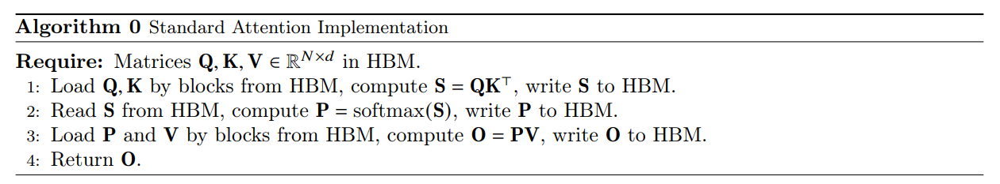

## 1. 背景 & 动机

**FlashAttention的目标是降低 MAC （Memory Access Cost，内存访问开销）。**

如下图所示，标准 Attention 的计算可以抽象为如下过程，它主要使用了 HBM：

图中一共包含八次 HBM 的矩阵读写操作。这八次读写操作分别为：
- aa1

---

## 一、前向传播

### 1.1 标准 softmax 及其数值稳定版本

标准 softmax 对向量 $x \in \mathbb{R}^B$ 的第 $i$ 个分量计算如下：

$$\text{softmax}(x_i) = \frac{e^{x_i}}{\sum_{j=1}^{B} e^{x_j}} \quad (1)$$

由于分子和分母均包含指数项，当 $x_i$ 较大时 $e^{x_i}$ 容易上溢，当 $x$ 中各元素均为较大负值时 $e^{x_i}$ 容易下溢导致分母为零。因此引入稳定版本。设 $m(x) = \max_{j} x_j$，在公式 (1) 的分子和分母上同乘 $e^{-m(x)}$，数学等价：

$$\text{softmax}(x_i) = \frac{e^{x_i} \cdot e^{-m(x)}}{\sum_{j=1}^{B} e^{x_j} \cdot e^{-m(x)}} = \frac{e^{x_i - m(x)}}{\sum_{j=1}^{B} e^{x_j - m(x)}} \quad (2)$$

基于该等价形式，定义平移后的指数向量：

$$f(x) = \left[e^{x_1 - m(x)},\ e^{x_2 - m(x)},\ \dots,\ e^{x_B - m(x)}\right] \quad (3)$$

再定义 EXP 求和项：

$$l(x) = \sum_{j=1}^{B} f(x)_j = \sum_{j=1}^{B} e^{x_j - m(x)} \quad (4)$$

最终稳定版 softmax 写为：

$$\text{softmax}(x) = \frac{f(x)}{l(x)} \quad (5)$$

此版本中分子最大项为 $e^{x_{\max} - m(x)} = e^0 = 1$，分母至少为 $1$，彻底消除了数值溢出的风险。

### 1.2 分块策略

设待计算 softmax 的向量 $x \in \mathbb{R}^{2B}$，将其按列一切为二：

$$x = \left[x^{(1)},\ x^{(2)}\right] \quad (6)$$

其中 $x^{(1)} \in \mathbb{R}^B$ 为第 1 个分块，$x^{(2)} \in \mathbb{R}^B$ 为第 2 个分块。上标 $(1)$ 与 $(2)$ 表示分块序号，下标 $1, 2, \dots, B$ 表示该分块内的元素索引。目标是先处理 $x^{(1)}$，再处理 $x^{(2)}$，最终得到与全局一次性计算完全一致的 softmax 结果。

### 1.3 第一块的局部 softmax 与全局统计量初始化

处理 $x^{(1)}$，计算其局部统计量。局部最大值：

$$m(x^{(1)}) = \max_{j=1}^{B} x^{(1)}_j \quad (7)$$

局部平移指数向量：

$$f(x^{(1)}) = \left[e^{x^{(1)}_1 - m(x^{(1)})},\ e^{x^{(1)}_2 - m(x^{(1)})},\ \dots,\ e^{x^{(1)}_B - m(x^{(1)})}\right] \quad (8)$$

局部 EXP 求和项：

$$l(x^{(1)}) = \sum_{j=1}^{B} f(x^{(1)})_j = \sum_{j=1}^{B} e^{x^{(1)}_j - m(x^{(1)})} \quad (9)$$

局部 softmax：

$$\text{softmax}(x^{(1)}) = \frac{f(x^{(1)})}{l(x^{(1)})} \quad (10)$$

此时 $\text{softmax}(x^{(1)})$ 是局部的而非全局的，原因有二：其一，分子减去的最大值是 $m(x^{(1)})$ 而非全局 $m(x)$，导致平移基准不一致；其二，分母是 $l(x^{(1)})$ 而非全局求和项，导致归一化因子只是局部和而非全体和。处理完 $x^{(1)}$ 后，初始化两个全局标量。当前全局最大值：

$$m_{\max} = m(x^{(1)}) \quad (11)$$

当前全局 EXP 求和项：

$$l_{all} = l(x^{(1)}) \quad (12)$$

### 1.4 第二块的局部 softmax

处理 $x^{(2)}$，同样计算局部统计量。局部最大值：

$$m(x^{(2)}) = \max_{j=1}^{B} x^{(2)}_j \quad (13)$$

局部平移指数向量：

$$f(x^{(2)}) = \left[e^{x^{(2)}_1 - m(x^{(2)})},\ e^{x^{(2)}_2 - m(x^{(2)})},\ \dots,\ e^{x^{(2)}_B - m(x^{(2)})}\right] \quad (14)$$

局部 EXP 求和项：

$$l(x^{(2)}) = \sum_{j=1}^{B} f(x^{(2)})_j = \sum_{j=1}^{B} e^{x^{(2)}_j - m(x^{(2)})} \quad (15)$$

局部 softmax：

$$\text{softmax}(x^{(2)}) = \frac{f(x^{(2)})}{l(x^{(2)})} \quad (16)$$

### 1.5 更新全局统计量

处理完 $x^{(2)}$ 后，需要利用 $x^{(2)}$ 的信息更新此前保存的两个全局标量 $m_{\max}$ 与 $l_{all}$，以便后续将各局部 softmax 合并为全局 softmax。

更新全局最大值：

$$m_{\max}^{\text{new}} = \max\left(m_{\max},\ m(x^{(2)})\right) \quad (17)$$

其含义为更新后的全局最大值是此前全局最大值与当前分块最大值中较大的那一个。

接下来更新全局 EXP 求和项。目标是得到以新的全局最大值 $m_{\max}^{\text{new}}$ 为基准的全体指数和。对于此前全局求和项 $l_{all}$，其当前以 $m_{\max}$ 为指数基准，即：

$$l_{all} = \sum_{k=1}^{B} e^{x^{(1)}_k - m_{\max}}$$

要将其基准由 $m_{\max}$ 调整至 $m_{\max}^{\text{new}}$，需对每一项同乘 $e^{m_{\max} - m_{\max}^{\text{new}}}$：

$$l_{all} \cdot e^{m_{\max} - m_{\max}^{\text{new}}} = \sum_{k=1}^{B} e^{x^{(1)}_k - m_{\max}} \cdot e^{m_{\max} - m_{\max}^{\text{new}}} = \sum_{k=1}^{B} e^{x^{(1)}_k - m_{\max}^{\text{new}}} \quad (18)$$

同理，对于当前分块 $x^{(2)}$ 的局部求和项 $l(x^{(2)})$，其当前以 $m(x^{(2)})$ 为基准：

$$l(x^{(2)}) = \sum_{k=1}^{B} e^{x^{(2)}_k - m(x^{(2)})}$$

要将其基准调整至 $m_{\max}^{\text{new}}$，需同乘 $e^{m(x^{(2)}) - m_{\max}^{\text{new}}}$：

$$l(x^{(2)}) \cdot e^{m(x^{(2)}) - m_{\max}^{\text{new}}} = \sum_{k=1}^{B} e^{x^{(2)}_k - m(x^{(2)})} \cdot e^{m(x^{(2)}) - m_{\max}^{\text{new}}} = \sum_{k=1}^{B} e^{x^{(2)}_k - m_{\max}^{\text{new}}} \quad (19)$$

将调整后的两部分求和相加，即得到以 $m_{\max}^{\text{new}}$ 为基准的全体指数和：

$$l_{all}^{\text{new}} = e^{m_{\max} - m_{\max}^{\text{new}}} \cdot l_{all} + e^{m(x^{(2)}) - m_{\max}^{\text{new}}} \cdot l(x^{(2)}) \quad (20)$$

为理解第二项 $e^{m(x^{(2)}) - m_{\max}^{\text{new}}} \cdot l(x^{(2)})$ 的来源，先将 $l(x^{(2)})$ 展开：

$$l(x^{(2)}) = \sum_{k=1}^{B} e^{x^{(2)}_k - m(x^{(2)})} \quad (21)$$

将其变换为以新的全局最大值 $m_{\max}^{\text{new}}$ 为基准：

$$\begin{aligned} l^{\text{new}}(x^{(2)}) &= l(x^{(2)}) \cdot e^{m(x^{(2)}) - m_{\max}^{\text{new}}} \\ &= \sum_{k=1}^{B} e^{x^{(2)}_k - m(x^{(2)})} \cdot e^{m(x^{(2)}) - m_{\max}^{\text{new}}} \\ &= \sum_{k=1}^{B} e^{x^{(2)}_k - m(x^{(2)}) + m(x^{(2)}) - m_{\max}^{\text{new}}} \\ &= \sum_{k=1}^{B} e^{x^{(2)}_k - m_{\max}^{\text{new}}} \end{aligned} \quad (22)$$

此时 $l(x^{(2)})$ 更新为全局的。也就是说，通过对 $l(x^{(2)})$ 乘上额外的项 $e^{m(x^{(2)}) - m_{\max}^{\text{new}}}$ 即可把 $l(x^{(2)})$ 更新为全局的 $l^{\text{new}}(x^{(2)})$。简而言之，当需要把某个 EXP 求和项 $l$ 更新为全局的时，只要将其乘以 $e^{m - m_{\max}^{\text{new}}}$ 即可，其中 $m$ 表示当前 $l$ 对应的最大值，$m_{\max}^{\text{new}}$ 表示当前全局最大值。

回到公式 (20)，$l_{all}$ 对应的最大值是 $m_{\max}$，当前全局最大值是 $m_{\max}^{\text{new}}$，所以可以乘以项 $e^{m_{\max} - m_{\max}^{\text{new}}}$ 来更新 $l_{all}$（参考公式 (20) 等式右方的第一项）。同理再使用 $e^{m(x^{(2)}) - m_{\max}^{\text{new}}}$ 来更新 $l(x^{(2)})$（参考公式 (20) 等式右方的第二项）。最后将更新后的两项求和得到当前的 EXP 求和项 $l_{all}^{\text{new}}$。

### 1.6 将局部 softmax 更新为全局

为什么要将局部 softmax 更新为全局？因为 softmax 的分母必须是对整个向量 $x$（包含所有分块）的指数求和，分子必须是每个元素相对于全局最大值的指数。如果不更新为全局，那么每个分块内的 softmax 值只是基于该分块内部归一化的，无法反映元素在整个向量中的相对权重。因此，在处理完当前分块后，必须将此前各分块与当前分块的 softmax 值都重新归一化到统一的全局基准上。

基于上述更新 $l$ 的方法，也能直接更新 softmax 值。参考公式 (16)，可知当前的分子和分母都是局部的，所以需要将它们分别更新至全局。

先看分子部分 $f(x^{(2)})$。$f(x^{(2)})$ 由公式 (14) 定义，可将其做如下更新：

$$\begin{aligned} f^{\text{new}}(x^{(2)}) &= f(x^{(2)}) \cdot e^{m(x^{(2)}) - m_{\max}^{\text{new}}} \\ &= \left[e^{x^{(2)}_1 - m(x^{(2)})},\ \dots,\ e^{x^{(2)}_B - m(x^{(2)})}\right] \cdot e^{m(x^{(2)}) - m_{\max}^{\text{new}}} \\ &= \left[e^{x^{(2)}_1 - m_{\max}^{\text{new}}},\ \dots,\ e^{x^{(2)}_B - m_{\max}^{\text{new}}}\right] \end{aligned} \quad (23)$$

此时 $f^{\text{new}}(x^{(2)})$ 中的每一项都是全局的。很容易发现，更新 $f(x^{(2)})$ 的方法与更新 $l(x^{(2)})$ 其实是一样的，都是乘以项 $e^{m(x^{(2)}) - m_{\max}^{\text{new}}}$。

基于公式 (23) 的结果，可以首先将公式 (16) 的分子乘以 $e^{m(x^{(2)}) - m_{\max}^{\text{new}}}$ 来将分子更新为全局的：

$$\text{softmax}^{\text{temp}}(x^{(2)}) = \text{softmax}(x^{(2)}) \cdot e^{m(x^{(2)}) - m_{\max}^{\text{new}}} = \frac{f(x^{(2)})}{l(x^{(2)})} \cdot e^{m(x^{(2)}) - m_{\max}^{\text{new}}} = \frac{f^{\text{new}}(x^{(2)})}{l(x^{(2)})} \quad (24)$$

注意公式 (24) 中的 $\text{softmax}^{\text{temp}}(x^{(2)})$ 仅仅是更新了分子，还没有更新分母，所以它不是最终结果。$\text{softmax}^{\text{temp}}(x^{(2)})$ 离最终结果只有一步之差：分母中的局部 EXP 求和项 $l(x^{(2)})$ 需要被替换成全局 EXP 求和项 $l_{all}^{\text{new}}$，而 $l_{all}^{\text{new}}$ 已经在公式 (20) 中计算出来了。

将分母替换为全局求和项 $l_{all}^{\text{new}}$，得到最终全局 softmax：

$$\text{softmax}^{\text{new}}(x^{(2)}) = \text{softmax}^{\text{temp}}(x^{(2)}) \cdot \frac{l(x^{(2)})}{l_{all}^{\text{new}}} = \frac{f^{\text{new}}(x^{(2)})}{l_{all}^{\text{new}}} \quad (25)$$

将上述步骤合并，直接写出从局部 softmax 到全局 softmax 的更新式：

$$\text{softmax}^{(\text{new})}(x^{(2)}) = \frac{\text{softmax}(x^{(2)}) \cdot l(x^{(2)}) \cdot e^{m(x^{(2)}) - m_{\max}^{\text{new}}}}{l_{all}^{\text{new}}} \quad (26)$$

同理，对 $x^{(1)}$ 也执行相同的全局化更新。$x^{(1)}$ 的分子 $f(x^{(1)})$ 当前以 $m_{\max}$ 为基准，需调整至 $m_{\max}^{\text{new}}$：

$$f^{\text{new}}(x^{(1)})_k = f(x^{(1)})_k \cdot e^{m_{\max} - m_{\max}^{\text{new}}} = e^{x^{(1)}_k - m_{\max}} \cdot e^{m_{\max} - m_{\max}^{\text{new}}} = e^{x^{(1)}_k - m_{\max}^{\text{new}}}$$

因此：

$$\text{softmax}^{(\text{new})}(x^{(1)}) = \frac{\text{softmax}(x^{(1)}) \cdot l(x^{(1)}) \cdot e^{m_{\max} - m_{\max}^{\text{new}}}}{l_{all}^{\text{new}}} \quad (27)$$

现在解释为什么要更新 $\text{softmax}(x^{(1)})$。在处理完 $x^{(2)}$ 后，全局最大值从 $m_{\max}$ 更新为 $m_{\max}^{\text{new}}$，全局求和项从 $l_{all}$ 更新为 $l_{all}^{\text{new}}$。而 $\text{softmax}(x^{(1)})$ 此前是基于旧的全局统计量 $m_{\max}$ 和 $l_{all}$ 归一化的，其分母 $l(x^{(1)})$ 只是前 $B$ 个元素的局部和，并非全体 $2B$ 个元素的和。如果不更新 $\text{softmax}(x^{(1)})$，那么 $x^{(1)}$ 各元素的 softmax 值仍然只反映其在 $x^{(1)}$ 内部的相对权重，而非在整个 $x$ 中的相对权重。具体而言，假设 $m_{\max}^{\text{new}} = m(x^{(2)}) > m_{\max}$，则 $x^{(1)}$ 中所有元素的指数 $e^{x^{(1)}_k - m_{\max}}$ 都需要调整为 $e^{x^{(1)}_k - m_{\max}^{\text{new}}}$，即整体乘以 $e^{m_{\max} - m_{\max}^{\text{new}}}$；同时分母必须从 $l_{all}$ 更新为 $l_{all}^{\text{new}}$。因此必须将 $\text{softmax}(x^{(1)})$ 也重新归一化到新的全局基准上，使其分母变为 $l_{all}^{\text{new}}$，分子指数基准变为 $m_{\max}^{\text{new}}$。

所有更新均不需要重新访问 $x^{(1)}$ 或 $x^{(2)}$ 的原始向量值，仅需之前保存的局部统计量与全局统计量。

### 1.7 全局统计量最终赋值

处理完当前分块后，将新的全局统计量赋值给全局变量，为下一分块做准备：

$$m_{\max} = m_{\max}^{\text{new}} \quad (28)$$

以及：

$$l_{all} = l_{all}^{\text{new}} \quad (29)$$

### 1.8 映射到 Attention 矩阵形式与 Algorithm 1 逐行详解

上述标量推导直接映射到 FlashAttention 前向伪代码 Algorithm 1。在 Attention 中，Score 矩阵定义为：

$$\mathbf{S} = \mathbf{Q}\mathbf{K}^\top \in \mathbb{R}^{N \times N}$$

其中第 $i$ 行第 $j$ 列元素 $S_{ij} = q_i^\top k_j$。softmax 沿行方向进行，即每行独立归一化。因此第 $i$ 行 $S_{i:} = [q_i^\top k_1,\ q_i^\top k_2,\ \dots,\ q_i^\top k_N]$ 即为上述标量推导中的向量 $x$。由于不同行之间的 softmax 计算完全独立（无交互），为便于理解，可先考虑 $B_r = 1$ 的简化情形，即每次只处理一行，再推广到 $B_r > 1$ 的 Batch 情形。

Algorithm 1 的输入为 $\mathbf{Q}, \mathbf{K}, \mathbf{V} \in \mathbb{R}^{N \times d}$ 存储在 HBM，SRAM 容量为 $M$。

**第 1 行**：设置块大小

$$B_c = \left\lceil \frac{M}{4d} \right\rceil, \quad B_r = \min\left(\left\lceil \frac{M}{4d} \right\rceil,\ d\right)$$

这里分母取 $4d$ 是因为 SRAM 需要同时容纳 $\mathbf{K}_j$（$B_c \times d$）、$\mathbf{V}_j$（$B_c \times d$）、$\mathbf{Q}_i$（$B_r \times d$）、$\mathbf{O}_i$（$B_r \times d$）以及 $\mathbf{S}_{ij}$（$B_r \times B_c$），总共约 $2B_c d + 2B_r d + B_r B_c \leq M$。当 $B_r = B_c = M/(4d)$ 时，上述各项之和近似等于 $M$，因此该设置是保守且安全的上界。

**第 2 行**：初始化输出与全局统计量

$$\mathbf{O} = \mathbf{0}_{N \times d} \in \mathbb{R}^{N \times d}, \quad \boldsymbol{\ell} = \mathbf{0}_N \in \mathbb{R}^N, \quad \mathbf{m} = (-\boldsymbol{\infty})_N \in \mathbb{R}^N$$

三者均存储在 HBM 中。$\mathbf{O}$ 是最终输出矩阵，$\boldsymbol{\ell}$ 是每行的全局 EXP 求和项，$\mathbf{m}$ 是每行的全局最大值。初始时 $\mathbf{O}$ 为零矩阵，$\boldsymbol{\ell}$ 为零向量，$\mathbf{m}$ 为负无穷向量，表示尚未处理任何分块。

**第 3 行**：输入矩阵分块

将 $\mathbf{Q}$ 沿行方向分为 $T_r = \lceil N / B_r \rceil$ 块 $\mathbf{Q}_1, \dots, \mathbf{Q}_{T_r}$，每块尺寸 $B_r \times d$。将 $\mathbf{K}$ 和 $\mathbf{V}$ 沿行方向分为 $T_c = \lceil N / B_c \rceil$ 块 $\mathbf{K}_1, \dots, \mathbf{K}_{T_c}$ 和 $\mathbf{V}_1, \dots, \mathbf{V}_{T_c}$，每块尺寸 $B_c \times d$。

**第 4 行**：输出与统计量分块

将 $\mathbf{O}$ 沿行方向分为 $T_r$ 块 $\mathbf{O}_1, \dots, \mathbf{O}_{T_r}$，每块 $B_r \times d$。将 $\boldsymbol{\ell}$ 分为 $T_r$ 块 $\ell_1, \dots, \ell_{T_r}$，每块 $B_r$。将 $\mathbf{m}$ 分为 $T_r$ 块 $m_1, \dots, m_{T_r}$，每块 $B_r$。这些分块与 $\mathbf{Q}$ 的分块一一对应，便于逐块加载到 SRAM。

**第 5 行**：外层循环开始

$$\text{for } j = 1 \text{ to } T_c \text{ do}$$

外层循环遍历 $\mathbf{K}$ 和 $\mathbf{V}$ 的分块。每轮迭代处理一个 $\mathbf{K}_j$ 和一个 $\mathbf{V}_j$。

**第 6 行**：加载 $\mathbf{K}_j, \mathbf{V}_j$ 到 SRAM

将 $\mathbf{K}_j$（$B_c \times d$）和 $\mathbf{V}_j$（$B_c \times d$）从 HBM 加载到 on-chip SRAM。这一步在整个内层循环中只执行一次，意味着同一个 $\mathbf{K}_j$ 和 $\mathbf{V}_j$ 会被所有 $\mathbf{Q}_i$ 块复用，显著减少 HBM 读取次数。

**第 7 行**：内层循环开始

$$\text{for } i = 1 \text{ to } T_r \text{ do}$$

内层循环遍历 $\mathbf{Q}$ 的分块。每轮迭代处理一个 $\mathbf{Q}_i$ 块，并更新对应的 $\mathbf{O}_i, \ell_i, m_i$。

**第 8 行**：加载 $\mathbf{Q}_i, \mathbf{O}_i, \ell_i, m_i$ 到 SRAM

将 $\mathbf{Q}_i$（$B_r \times d$）、$\mathbf{O}_i$（$B_r \times d$）、$\ell_i$（$B_r$）、$m_i$（$B_r$）从 HBM 加载到 SRAM。注意 $\mathbf{O}_i, \ell_i, m_i$ 是上一次内层迭代更新后的值；在首次迭代时，它们分别为零矩阵、零向量、负无穷向量。

**第 9 行**：在 SRAM 中计算局部 score 矩阵

$$\mathbf{S}_{ij} = \mathbf{Q}_i \mathbf{K}_j^\top \in \mathbb{R}^{B_r \times B_c}$$

这是矩阵乘法：$\mathbf{Q}_i$（$B_r \times d$）乘以 $\mathbf{K}_j^\top$（$d \times B_c$），得到 $\mathbf{S}_{ij}$（$B_r \times B_c$）。该块仅在 SRAM 中临时存在，**绝不写入 HBM**，这是 FlashAttention 节省内存的核心。

**第 10 行**：在 SRAM 中计算局部 softmax 统计量

$$\tilde{m}_{ij} = \text{rowmax}(\mathbf{S}_{ij}) \in \mathbb{R}^{B_r}, \quad \tilde{\mathbf{P}}_{ij} = \exp(\mathbf{S}_{ij} - \tilde{m}_{ij}) \in \mathbb{R}^{B_r \times B_c}, \quad \tilde{\ell}_{ij} = \text{rowsum}(\tilde{\mathbf{P}}_{ij}) \in \mathbb{R}^{B_r}$$

$\tilde{m}_{ij}$ 是 $\mathbf{S}_{ij}$ 每行的最大值，即局部最大值。$\tilde{\mathbf{P}}_{ij}$ 是每行减去该行最大值后的逐元素指数，即局部未归一化指数矩阵。$\tilde{\ell}_{ij}$ 是 $\tilde{\mathbf{P}}_{ij}$ 每行的和，即局部 EXP 求和项。这三者对应标量推导中的公式 (13)、(14)、(15)。

**第 11 行**：在 SRAM 中更新全局统计量

$$m_i^{\text{new}} = \max(m_i, \tilde{m}_{ij}) \in \mathbb{R}^{B_r}, \quad \ell_i^{\text{new}} = e^{m_i - m_i^{\text{new}}} \ell_i + e^{\tilde{m}_{ij} - m_i^{\text{new}}} \tilde{\ell}_{ij} \in \mathbb{R}^{B_r}$$

$m_i^{\text{new}}$ 逐元素比较此前全局最大值 $m_i$ 与当前分块局部最大值 $\tilde{m}_{ij}$，取较大者。$\ell_i^{\text{new}}$ 将此前全局求和项 $\ell_i$ 和当前分块局部求和项 $\tilde{\ell}_{ij}$ 分别用指数因子调整到新的全局最大值 $m_i^{\text{new}}$ 基准下，再相加。这直接对应标量推导中的公式 (17) 与 (20)。

**第 12 行**：在 SRAM 中增量更新输出并写回 HBM

$$\mathbf{O}_i \leftarrow \text{diag}(\ell_i^{\text{new}})^{-1} \left( \text{diag}(\ell_i) e^{m_i - m_i^{\text{new}}} \mathbf{O}_i + e^{\tilde{m}_{ij} - m_i^{\text{new}}} \tilde{\mathbf{P}}_{ij} \mathbf{V}_j \right) \quad (30)$$

以下从 Attention Score 矩阵的视角，以 $B_r = 1$ 的简化情形为例，逐步推导公式 (30) 的来源。取 $B_r = 1$ 是因为 softmax 沿行进行，不同行之间完全独立，每行的计算逻辑相同，只是 Batch 处理多行以提高效率。

考虑第 $i$ 个 query，其 Attention Score 为第 $i$ 行 $\mathbf{S}_{i:} = [q_i^\top k_1,\ q_i^\top k_2,\ \dots,\ q_i^\top k_N]$。将这一行按列分成 $T_c$ 个块，第 $j$ 块包含 $B_c$ 个元素，记为 $\mathbf{S}_{ij} \in \mathbb{R}^{1 \times B_c}$。对应的 Value 也按行分成 $T_c$ 个块，第 $j$ 块为 $\mathbf{V}_j \in \mathbb{R}^{B_c \times d}$。

设当前已处理完前 $j-1$ 个块，状态如下：
- $O_i \in \mathbb{R}^{1 \times d}$：已累积的归一化输出
- $m_i \in \mathbb{R}$：当前全局最大值（前 $j-1$ 个块的最大值）
- $\ell_i \in \mathbb{R}$：当前全局 EXP 和（前 $j-1$ 个块以 $m_i$ 为基准的指数和）

由输出定义，$O_i$ 是前 $j-1$ 个块的 softmax 加权 value 和：

$$O_i = \sum_{k \in \text{前 } j-1 \text{ 块}} \frac{e^{q_i^\top k_k - m_i}}{\ell_i} \mathbf{v}_k = \frac{1}{\ell_i} \sum_{k \in \text{前 } j-1 \text{ 块}} e^{q_i^\top k_k - m_i} \mathbf{v}_k \quad (30.1)$$

定义前 $j-1$ 个块的未归一化加权和为：

$$\mathbf{F}^{\text{prev}} = \sum_{k \in \text{前 } j-1 \text{ 块}} e^{q_i^\top k_k - m_i} \mathbf{v}_k \in \mathbb{R}^{1 \times d} \quad (30.2)$$

则由公式 (30.1) 可得：

$$\mathbf{F}^{\text{prev}} = \ell_i \cdot O_i \quad (30.3)$$

现在处理第 $j$ 个块 $\mathbf{S}_{ij}$。计算局部统计量：
- 局部最大值 $\tilde{m}_{ij} = \max_{k \in \text{第 } j \text{ 块}} q_i^\top k_k$
- 局部未归一化指数 $\tilde{\mathbf{P}}_{ij} = \exp(\mathbf{S}_{ij} - \tilde{m}_{ij}) \in \mathbb{R}^{1 \times B_c}$
- 局部 EXP 和 $\tilde{\ell}_{ij} = \sum \tilde{\mathbf{P}}_{ij}$

更新全局统计量：
- $m_i^{\text{new}} = \max(m_i, \tilde{m}_{ij})$
- $\ell_i^{\text{new}} = e^{m_i - m_i^{\text{new}}} \ell_i + e^{\tilde{m}_{ij} - m_i^{\text{new}}} \tilde{\ell}_{ij}$

接下来需要更新输出 $O_i$。更新分为两部分：旧部分（前 $j-1$ 个块）和新部分（第 $j$ 个块）。

**旧部分调整**：前 $j-1$ 个块的未归一化加权和 $\mathbf{F}^{\text{prev}}$ 当前以 $m_i$ 为指数基准。由于全局最大值已更新为 $m_i^{\text{new}}$，需要将指数基准从 $m_i$ 调整到 $m_i^{\text{new}}$。对 $\mathbf{F}^{\text{prev}}$ 中每一项 $e^{q_i^\top k_k - m_i} \mathbf{v}_k$，调整为 $e^{q_i^\top k_k - m_i^{\text{new}}} = e^{q_i^\top k_k - m_i} \cdot e^{m_i - m_i^{\text{new}}}$。因此整体乘以标量 $e^{m_i - m_i^{\text{new}}}$：

$$\mathbf{F}^{\text{prev, new}} = e^{m_i - m_i^{\text{new}}} \cdot \mathbf{F}^{\text{prev}} = e^{m_i - m_i^{\text{new}}} \cdot \ell_i \cdot O_i \quad (30.4)$$

**新部分加入**：第 $j$ 个块的未归一化加权和为 $\tilde{\mathbf{P}}_{ij} \mathbf{V}_j$。注意 $\tilde{\mathbf{P}}_{ij} = \exp(\mathbf{S}_{ij} - \tilde{m}_{ij})$ 的指数基准为局部最大值 $\tilde{m}_{ij}$，需要调整到全局最大值 $m_i^{\text{new}}$。对 $\tilde{\mathbf{P}}_{ij}$ 中每一项 $e^{q_i^\top k_k - \tilde{m}_{ij}}$，调整为 $e^{q_i^\top k_k - m_i^{\text{new}}} = e^{q_i^\top k_k - \tilde{m}_{ij}} \cdot e^{\tilde{m}_{ij} - m_i^{\text{new}}}$。因此整体乘以标量 $e^{\tilde{m}_{ij} - m_i^{\text{new}}}$：

$$\mathbf{F}^{\text{new}} = e^{\tilde{m}_{ij} - m_i^{\text{new}}} \cdot \tilde{\mathbf{P}}_{ij} \mathbf{V}_j \quad (30.5)$$

**合并与归一化**：将调整后的旧部分与新部分相加，得到全体 key 的未归一化加权和：

$$\mathbf{F}^{\text{total}} = \mathbf{F}^{\text{prev, new}} + \mathbf{F}^{\text{new}} = e^{m_i - m_i^{\text{new}}} \ell_i O_i + e^{\tilde{m}_{ij} - m_i^{\text{new}}} \tilde{\mathbf{P}}_{ij} \mathbf{V}_j \quad (30.6)$$

最后，用新的全局 EXP 和 $\ell_i^{\text{new}}$ 进行归一化，得到更新后的输出：

$$O_i^{\text{new}} = \frac{\mathbf{F}^{\text{total}}}{\ell_i^{\text{new}}} = \frac{e^{m_i - m_i^{\text{new}}} \ell_i O_i + e^{\tilde{m}_{ij} - m_i^{\text{new}}} \tilde{\mathbf{P}}_{ij} \mathbf{V}_j}{\ell_i^{\text{new}}} \quad (30.7)$$

将公式 (30.7) 写成矩阵形式，即 Algorithm 1 第 12 行的表达式。当 $B_r > 1$ 时，上述逻辑对 $B_r$ 行同时执行，行与行之间完全独立（因为 softmax 按行进行，不同 query 之间无交互）。此时需要说明为什么标量公式中的乘 $\ell_i$ 变成了左乘 $\text{diag}(\ell_i)$。

在 $B_r = 1$ 时，$\ell_i$ 是标量，第 $r$ 行的未归一化加权和恢复为 $\mathbf{F}^{\text{prev}}_{r,:} = \ell_i \cdot \mathbf{O}_{i,r,:}$。当 $B_r > 1$ 时，$\ell_i$ 变为 $B_r$ 维向量，其第 $r$ 个分量 $\ell_{i,r}$ 是第 $r$ 行的全局 EXP 和。第 $r$ 行的未归一化加权和恢复为 $\mathbf{F}^{\text{prev}}_{r,:} = \ell_{i,r} \cdot \mathbf{O}_{i,r,:}$。对 $B_r$ 行同时执行这一操作，即每行各自乘以自己的 $\ell_{i,r}$，用矩阵语言描述就是左乘一个对角矩阵：

$$\mathbf{F}^{\text{prev}} = \text{diag}(\ell_i) \mathbf{O}_i \quad (30.8)$$

其中 $\text{diag}(\ell_i) \in \mathbb{R}^{B_r \times B_r}$ 是对角矩阵，第 $(r,r)$ 个元素为 $\ell_{i,r}$。左乘 $\mathbf{O}_i \in \mathbb{R}^{B_r \times d}$ 后，第 $r$ 行被缩放 $\ell_{i,r}$ 倍，恰好实现每行各自恢复未归一化加权和的效果。

同理，标量除法 $/ \ell_i^{\text{new}}$ 推广为左乘 $\text{diag}(\ell_i^{\text{new}})^{-1}$，实现对 $B_r$ 行各自的逐行归一化。

因此标量公式 (30.7) 的矩阵形式为：

$$\mathbf{O}_i \leftarrow \text{diag}(\ell_i^{\text{new}})^{-1} \left( \text{diag}(\ell_i) e^{m_i - m_i^{\text{new}}} \mathbf{O}_i + e^{\tilde{m}_{ij} - m_i^{\text{new}}} \tilde{\mathbf{P}}_{ij} \mathbf{V}_j \right) \quad (30)$$

其中：
- $\text{diag}(\ell_i) e^{m_i - m_i^{\text{new}}} \mathbf{O}_i$：对应公式 (30.4)，将前 $j-1$ 个块的已归一化输出恢复为未归一化加权和，再调整指数基准到新的全局最大值
- $e^{\tilde{m}_{ij} - m_i^{\text{new}}} \tilde{\mathbf{P}}_{ij} \mathbf{V}_j$：对应公式 (30.5)，将当前块的局部未归一化指数调整到新的全局最大值基准，再与 $\mathbf{V}_j$ 相乘得到加权贡献
- $\text{diag}(\ell_i^{\text{new}})^{-1}$：对应公式 (30.7) 的除以 $\ell_i^{\text{new}}$，用新的全局 EXP 和逐行归一化

更新后的 $\mathbf{O}_i$ 被写回 HBM。

**第 13 行**：将更新后的全局统计量写回 HBM

$$\ell_i \leftarrow \ell_i^{\text{new}}, \quad m_i \leftarrow m_i^{\text{new}}$$

这两个 $B_r$ 维向量写回 HBM，供下一次内层迭代或反向传播使用。

**第 14 行**：end for（内层循环结束）

**第 15 行**：end for（外层循环结束）

**第 16 行**：Return $\mathbf{O}$

最终返回的 $\mathbf{O}$ 就是精确的 Attention 输出 $\mathbf{O} = \text{softmax}(\mathbf{Q}\mathbf{K}^\top)\mathbf{V}$。

---

