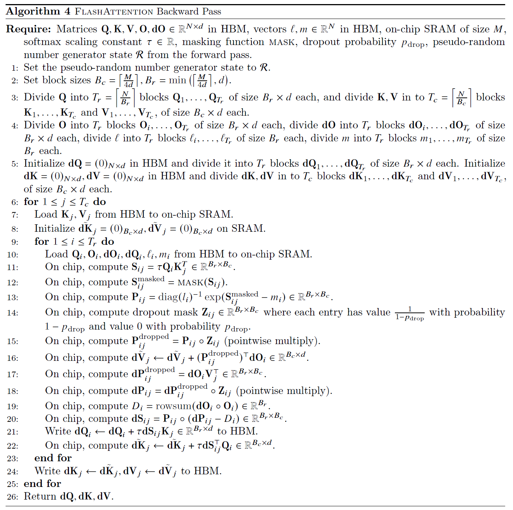

# 解析 FlashAttention（3）：FlashAttention-v1 反向传播

> 前置阅读：[解析 FlashAttention（2）：FlashAttention-v1 前向传播](https://my-webpage-adu.pages.dev/posts/llm%E6%8E%A8%E7%90%86%E6%A1%86%E6%9E%B6/2026-08-20-%E8%A7%A3%E6%9E%90-flashattention-2-flashattention-v1-%E5%89%8D%E5%90%91%E4%BC%A0%E6%92%AD/)
>
> 可视化代码：[flashattention_backward.html](attach/flashattention_backward.html)

* * *

## 1. 背景 & 动机

### 1.1 标准反向传播的内存瓶颈

标准 Attention 的前向计算链条为：

$$
\mathbf{S} = \mathbf{Q}\mathbf{K}^\top, \quad \mathbf{P} = \text{softmax}(\mathbf{S}), \quad \mathbf{O} = \mathbf{P}\mathbf{V}
$$

其中 $\mathbf{Q}, \mathbf{K}, \mathbf{V} \in \mathbb{R}^{N \times d}$，$\mathbf{S}, \mathbf{P} \in \mathbb{R}^{N \times N}$，$\mathbf{O} \in \mathbb{R}^{N \times d}$。

训练时，损失函数 $\mathcal{L}$ 对输出 $\mathbf{O}$ 的梯度 $\mathbf{dO} = \frac{\partial \mathcal{L}}{\partial \mathbf{O}} \in \mathbb{R}^{N \times d}$ 由下游层反向传播而来。为求 $\mathbf{dQ}, \mathbf{dK}, \mathbf{dV} \in \mathbb{R}^{N \times d}$，需根据多元函数的链式法则，依次求出 $\mathcal{L}$ 对 $\mathbf{V}, \mathbf{P}, \mathbf{S}, \mathbf{Q}, \mathbf{K}$ 的梯度。

首先给出完整的反向链条，后续第 2 节从 $N=2, d=2$ 的具体例子出发逐步推导：

- $\mathbf{dV} = \mathbf{P}^\top \cdot \mathbf{dO}$，来自 $\mathbf{O} = \mathbf{P}\mathbf{V}$ 对 $\mathbf{V}$ 的链式求导；
- $\mathbf{dP} = \mathbf{dO} \cdot \mathbf{V}^\top$，来自 $\mathbf{O} = \mathbf{P}\mathbf{V}$ 对 $\mathbf{P}$ 的链式求导；
- $\mathbf{dS} = \mathbf{P} \circ (\mathbf{dP} - \mathbf{D}\mathbf{1}^\top)$，来自 softmax 的 Jacobian，其中 $\mathbf{D} \in \mathbb{R}^{N}$，$\circ$ 表示 Hadamard 积（逐元素相乘），$\mathbf{1}^\top \in \mathbb{R}^{1 \times N}$ 为全 1 行向量；
- $\mathbf{dQ} = \tau \cdot \mathbf{dS} \cdot \mathbf{K}$，来自 $\mathbf{S} = \tau\mathbf{Q}\mathbf{K}^\top$ 对 $\mathbf{Q}$ 的求导；
- $\mathbf{dK} = \tau \cdot \mathbf{dS}^\top \cdot \mathbf{Q}$，来自 $\mathbf{S} = \tau\mathbf{Q}\mathbf{K}^\top$ 对 $\mathbf{K}$ 的求导。

式中的 $\cdot$ 表示常规矩阵乘法。

**核心矛盾**：标准实现必须在 HBM 中保存前向的中间矩阵 $\mathbf{S}$ 或 $\mathbf{P}$（或两者），供反向传播使用。这导致：

- **内存**：额外需要 $O(N^2)$ 显存存储 $\mathbf{P} \in \mathbb{R}^{N \times N}$；
- **IO**：反向时需要多次从 HBM 读取 $\mathbf{P}$（大小 $N \times N$）和 $\mathbf{dP}$，HBM 访问量同样为 $O(N^2)$。

当序列长度 $N$ 很大时（如 4K、16K、64K），$N^2$ 的内存与 IO 开销成为不可承受的瓶颈。

### 1.2 FlashAttention 反向传播的核心思路

FlashAttention 解决这一问题的思路与前向传播一脉相承——**IO 感知 + 重计算（Recomputation）**。具体建立在三个观察之上：

**观察一：不保存 $\mathbf{P}$，而是重计算 $\mathbf{P}_{ij}$。** 前向传播仅保存 $\mathbf{O} \in \mathbb{R}^{N \times d}$、逐行统计量 $(\mathbf{m}, \boldsymbol{\ell}) \in \mathbb{R}^{N}$、以及随机数种子 $\mathcal{R}$。反向时，将 $\mathbf{Q}_i, \mathbf{K}_j$ 的小块重新加载到 SRAM，利用 $(\mathbf{m}_i, \boldsymbol{\ell}_i)$ 在片上快速恢复出 $\mathbf{P}_{ij}$。

**观察二：分块累加梯度。** $\mathbf{dK}_j, \mathbf{dV}_j$ 需要累加所有 $\mathbf{Q}_i$ 带来的贡献。将 $\mathbf{K}_j, \mathbf{V}_j$ 置于外层循环，其梯度可在 SRAM 中局部累加，内层循环结束后再一次性写回 HBM。

**观察三：Softmax 梯度的关键简化。** 反向 softmax 通常需要遍历整行 $\mathbf{P}_{i:}$ 计算。FlashAttention 通过代数变形，将这一操作简化为 $\mathbf{D}_i = \text{rowsum}(\mathbf{dO}_i \circ \mathbf{O}_i)$，完全避免了对 $N$ 维向量的存储与遍历。

* * *

## 2. 标准 Attention 反向传播推导

本节从 $N=2, d=2$ 的具体例子出发，写出所有矩阵的具体元素，展示链式法则中每个求和符号的来源，最后推广到一般维度。

### 2.1 符号定义与具体例子设定

设序列长度 $N=2$，特征维度 $d=2$。所有矩阵维度如下：

- $\mathbf{Q}, \mathbf{K}, \mathbf{V}, \mathbf{O}, \mathbf{dO}, \mathbf{dQ}, \mathbf{dK}, \mathbf{dV} \in \mathbb{R}^{2 \times 2}$
- $\mathbf{P}, \mathbf{S}, \mathbf{dS}, \mathbf{dP} \in \mathbb{R}^{2 \times 2}$
- $\mathbf{D} \in \mathbb{R}^{2}$（列向量）

记 $\mathbf{dP} = \frac{\partial \mathcal{L}}{\partial \mathbf{P}} \in \mathbb{R}^{N \times N}$，$\mathbf{dS} = \frac{\partial \mathcal{L}}{\partial \mathbf{S}} \in \mathbb{R}^{N \times N}$。

### 2.2 矩阵乘法 $\mathbf{O} = \mathbf{P}\mathbf{V}$ 的反向传播

设

$$
\mathbf{P} = \begin{bmatrix} p_{11} & p_{12} \\ p_{21} & p_{22} \end{bmatrix} \in \mathbb{R}^{2 \times 2}, \quad \mathbf{V} = \begin{bmatrix} v_{11} & v_{12} \\ v_{21} & v_{22} \end{bmatrix} \in \mathbb{R}^{2 \times 2}
$$

则

$$
\mathbf{O} = \mathbf{P}\mathbf{V} = \begin{bmatrix} p_{11}v_{11} + p_{12}v_{21} & p_{11}v_{12} + p_{12}v_{22} \\ p_{21}v_{11} + p_{22}v_{21} & p_{21}v_{12} + p_{22}v_{22} \end{bmatrix} \in \mathbb{R}^{2 \times 2}
$$

即

$$
\begin{aligned}
O_{11} &= p_{11}v_{11} + p_{12}v_{21} \\
O_{12} &= p_{11}v_{12} + p_{12}v_{22} \\
O_{21} &= p_{21}v_{11} + p_{22}v_{21} \\
O_{22} &= p_{21}v_{12} + p_{22}v_{22}
\end{aligned}
$$

故

$$
\mathbf{dO} = \begin{bmatrix} dO_{11} & dO_{12} \\ dO_{21} & dO_{22}\end{bmatrix} = \begin{bmatrix} \frac{\partial \mathcal{L}}{\partial O_{11}} & \frac{\partial \mathcal{L}}{\partial O_{12}} \\ \frac{\partial \mathcal{L}}{\partial O_{21}} & \frac{\partial \mathcal{L}}{\partial O_{22}}\end{bmatrix} \in \mathbb{R}^{2 \times 2}
$$

**推导 $\mathbf{dV}$。** 元素 $v_{11}$ 仅出现在 $O_{11}$ 与 $O_{21}$ 中。根据链式法则，损失函数 $\mathcal{L}$ 对 $v_{11}$ 的梯度通过这两条路径传递：

$$
\frac{\partial \mathcal{L}}{\partial v_{11}} = \frac{\partial \mathcal{L}}{\partial O_{11}} \cdot \frac{\partial O_{11}}{\partial v_{11}} + \frac{\partial \mathcal{L}}{\partial O_{21}} \cdot \frac{\partial O_{21}}{\partial v_{11}}
$$

由 $O_{11} = p_{11}v_{11} + p_{12}v_{21}$，得 $\frac{\partial O_{11}}{\partial v_{11}} = p_{11}$。由 $O_{21} = p_{21}v_{11} + p_{22}v_{21}$，得 $\frac{\partial O_{21}}{\partial v_{11}} = p_{21}$。代入：

$$
\frac{\partial \mathcal{L}}{\partial v_{11}} = dO_{11} \cdot p_{11} + dO_{21} \cdot p_{21}
$$

同理，对 $v_{12}$, $v_{21}$, $v_{22}$ 分别计算梯度：

$$
\frac{\partial \mathcal{L}}{\partial v_{12}} = dO_{12} \cdot p_{11} + dO_{22} \cdot p_{21}
$$

$$
\frac{\partial \mathcal{L}}{\partial v_{21}} = dO_{11} \cdot p_{12} + dO_{21} \cdot p_{22}
$$

$$
\frac{\partial \mathcal{L}}{\partial v_{22}} = dO_{12} \cdot p_{12} + dO_{22} \cdot p_{22}
$$

注意到

$$
\mathbf{P}^\top = \begin{bmatrix} p_{11} & p_{21} \\ p_{12} & p_{22} \end{bmatrix} \in \mathbb{R}^{2 \times 2}
$$

而

$$
\mathbf{dV} = \begin{bmatrix} \frac{\partial \mathcal{L}}{\partial v_{11}} & \frac{\partial \mathcal{L}}{\partial v_{12}} \\ \frac{\partial \mathcal{L}}{\partial v_{21}} & \frac{\partial \mathcal{L}}{\partial v_{22}} \end{bmatrix}
$$

因此得到矩阵形式：

$$
\mathbf{dV} = \mathbf{P}^\top \cdot \mathbf{dO} \in \mathbb{R}^{2 \times 2} \tag{1}
$$

**推导 $\mathbf{dP}$。** 元素 $p_{11}$ 仅出现在 $O_{11}$ 与 $O_{12}$ 中：

$$
\frac{\partial \mathcal{L}}{\partial p_{11}} = dO_{11} \cdot \frac{\partial O_{11}}{\partial p_{11}} + dO_{12} \cdot \frac{\partial O_{12}}{\partial p_{11}} = dO_{11} \cdot v_{11} + dO_{12} \cdot v_{12}
$$

该式为 $\mathbf{dO}$ 的第 1 行与 $\mathbf{V}^\top$ 的第 1 列的内积。因此：

$$
\mathbf{dP} = \mathbf{dO} \cdot \mathbf{V}^\top \in \mathbb{R}^{2 \times 2} \tag{2}
$$

### 2.3 Softmax 的反向传播（单行情形）

Softmax 的反向是最复杂的一步。首先考虑单行情形，设输入行向量 $\mathbf{s} = [s_1, s_2] \in \mathbb{R}^{1 \times 2}$，softmax 输出行向量 $\mathbf{p} = [p_1, p_2] \in \mathbb{R}^{1 \times 2}$：

$$
p_1 = \frac{\exp(s_1)}{\exp(s_1) + \exp(s_2)}, \quad p_2 = \frac{\exp(s_2)}{\exp(s_1) + \exp(s_2)}
$$

已知上游梯度行向量 $\mathbf{dp} = [dp_1, dp_2] \in \mathbb{R}^{1 \times 2}$，待求 $\mathbf{ds} = [ds_1, ds_2] \in \mathbb{R}^{1 \times 2}$。

**计算偏导数 $\frac{\partial p_k}{\partial s_j}$。**

当 $j = k = 1$ 时：

$$
\frac{\partial p_1}{\partial s_1} = \frac{\exp(s_1)(\exp(s_1)+\exp(s_2)) - \exp(s_1)\exp(s_1)}{(\exp(s_1)+\exp(s_2))^2} = p_1(1 - p_1)
$$

当 $j = 2, k = 1$ 时：

$$
\frac{\partial p_1}{\partial s_2} = \frac{0 \cdot (\exp(s_1)+\exp(s_2)) - \exp(s_1)\exp(s_2)}{(\exp(s_1)+\exp(s_2))^2} = -p_1 p_2
$$

同理：

$$
\frac{\partial p_2}{\partial s_1} = -p_2 p_1, \quad \frac{\partial p_2}{\partial s_2} = p_2(1 - p_2)
$$

**组装 Jacobian 矩阵 $\mathbf{J} = \frac{\partial p}{\partial s}$。** 将所有偏导数排列成矩阵 $\mathbf{J} \in \mathbb{R}^{2 \times 2}$，其中第 $k$ 行第 $j$ 列为 $\frac{\partial p_k}{\partial s_j}$：

$$
\mathbf{J} = \begin{bmatrix} \frac{\partial p_1}{\partial s_1} & \frac{\partial p_1}{\partial s_2} \\ \frac{\partial p_2}{\partial s_1} & \frac{\partial p_2}{\partial s_2} \end{bmatrix}= \begin{bmatrix} p_1(1-p_1) & -p_1 p_2 \\ -p_2 p_1 & p_2(1-p_2) \end{bmatrix} = \text{diag}(\mathbf{p}) - \mathbf{p}^\top \mathbf{p}
$$

其中 $\text{diag}(\mathbf{p}) \in \mathbb{R}^{2 \times 2}$ 为以 $\mathbf{p}$ 元素为对角元的对角矩阵，$\mathbf{p}^\top \mathbf{p} \in \mathbb{R}^{2 \times 2}$ 为列向量与行向量的外积。

**应用链式法则：**

$$
\frac{\partial \mathcal{L}}{\partial s} = \frac{\partial \mathcal{L}}{\partial p} \cdot \frac{\partial \mathcal{p}}{\partial s}
$$

即

$$
\mathbf{ds} = \mathbf{dp} \cdot \mathbf{J} = [dp_1, dp_2] \cdot \begin{bmatrix} p_1(1-p_1) & -p_1 p_2 \\ -p_2 p_1 & p_2(1-p_2) \end{bmatrix}
$$

计算第一个分量 $ds_1$：

$$
ds_1 = dp_1 \cdot p_1(1-p_1) + dp_2 \cdot (-p_2 p_1) = p_1(dp_1 - p_1 dp_1 - p_2 dp_2)
$$

定义标量

$$
D = p_1 dp_1 + p_2 dp_2 = \mathbf{dp} \cdot \mathbf{p}^\top \in \mathbb{R} \tag{3}
$$

则

$$
ds_1 = p_1(dp_1 - D), \quad ds_2 = p_2(dp_2 - D)
$$

合并为向量形式：

$$
\mathbf{ds} = \mathbf{p} \circ (\mathbf{dp} - D \cdot \mathbf{1}^\top) \in \mathbb{R}^{1 \times 2} \tag{4}
$$

其中 $\circ$ 表示 Hadamard 积（逐元素相乘），$\mathbf{1}^\top = [1, 1] \in \mathbb{R}^{1 \times 2}$，标量 $D$ 通过广播机制扩展到每个位置。

**推广到矩阵形式。** Attention 的 softmax 是逐行独立的，每行具有独立的 $\mathbf{s}_i, \mathbf{p}_i, D_i$。对第 $i$ 行，定义

$$
D_i = \sum_{j=1}^{N} dP_{ij} \cdot P_{ij}
$$

令 $\mathbf{D} = [D_1, D_2]^\top \in \mathbb{R}^{2}$，则矩阵形式的 softmax 梯度为：

$$
\mathbf{dS} = \mathbf{P} \circ (\mathbf{dP} - \mathbf{D}\mathbf{1}^\top) \in \mathbb{R}^{2 \times 2} \tag{5}
$$

其中 $\mathbf{D}\mathbf{1}^\top \in \mathbb{R}^{2 \times 2}$ 为外积，第 $i$ 行第 $j$ 列元素为 $D_i$。

### 2.4 $D_i$ 的关键简化

式 (3) 定义的 $D_i$ 看似需要遍历整行 $\mathbf{p}_i$（长度 $N$），但 FlashAttention 利用前向输出 $\mathbf{O}$ 做了代数简化。以下在 $N=2, d=2$ 的例子上验证。

由式 (2)，$\mathbf{dP} = \mathbf{dO} \cdot \mathbf{V}^\top$。写出元素形式：

$$
dp_{11} = dO_{11} \cdot v_{11} + dO_{12} \cdot v_{12}
$$

$$
dp_{12} = dO_{11} \cdot v_{21} + dO_{12} \cdot v_{22}
$$

代入 $D_1$ 的定义：

$$
\begin{aligned}
D_1 &= p_{11} \cdot dp_{11} + p_{12} \cdot dp_{12} \\
&= p_{11}(dO_{11} v_{11} + dO_{12} v_{12}) + p_{12}(dO_{11} v_{21} + dO_{12} v_{22}) \\
&= dO_{11}(p_{11}v_{11} + p_{12}v_{21}) + dO_{12}(p_{11}v_{12} + p_{12}v_{22})
\end{aligned}
$$

由 2.2 节，$O_{11} = p_{11}v_{11} + p_{12}v_{21}$，$O_{12} = p_{11}v_{12} + p_{12}v_{22}$。因此：

$$
D_1 = dO_{11} \cdot O_{11} + dO_{12} \cdot O_{12}
$$

同理，对第 2 行：

$$
D_2 = dO_{21} \cdot O_{21} + dO_{22} \cdot O_{22}
$$

上式表明：计算 $D_i$ 无需访问 $\mathbf{P}$，仅需 $\mathbf{dO}$ 的第 $i$ 行与 $\mathbf{O}$ 的第 $i$ 行做逐元素乘积后求和。

写成矩阵形式：

$$
\mathbf{D} = \text{rowsum}(\mathbf{dO} \circ \mathbf{O}) \in \mathbb{R}^{2} \tag{6}
$$

其中 $\text{rowsum}(\cdot)$ 表示对矩阵的每一行求和，结果为一个列向量。第 $i$ 个元素为 $\sum_{k=1}^{d} dO_{ik} \cdot O_{ik}$。

**该简化的意义**：原本计算 $D_i$ 需要存储并遍历 $N$ 维向量 $\mathbf{p}_i$；现在仅需两个长度为 $d$ 的向量逐元素乘积后求和，复杂度为 $O(d)$，且无需访问 $\mathbf{P}$。

### 2.5 $\mathbf{dQ}$ 与 $\mathbf{dK}$ 的推导

> 与 **2.2 节** 中 $\mathbf{dV}$ 的推导类似。

由 $\mathbf{S} = \tau \mathbf{Q}\mathbf{K}^\top$。继续使用 $N=2, d=2$ 的例子。设

$$
\mathbf{Q} = \begin{bmatrix} q_{11} & q_{12} \\ q_{21} & q_{22} \end{bmatrix} \in \mathbb{R}^{2 \times 2}, \quad \mathbf{K} = \begin{bmatrix} k_{11} & k_{12} \\ k_{21} & k_{22} \end{bmatrix} \in \mathbb{R}^{2 \times 2}
$$

则 $\mathbf{K}^\top = \begin{bmatrix} k_{11} & k_{21} \\ k_{12} & k_{22} \end{bmatrix} \in \mathbb{R}^{2 \times 2}$，且

$$
\begin{aligned}
S_{11} &= \tau(q_{11}k_{11} + q_{12}k_{12}) \\
S_{12} &= \tau(q_{11}k_{21} + q_{12}k_{22}) \\
S_{21} &= \tau(q_{21}k_{11} + q_{22}k_{12}) \\
S_{22} &= \tau(q_{21}k_{21} + q_{22}k_{22})
\end{aligned}
$$

**推导 $\mathbf{dQ}$。** 元素 $q_{11}$ 仅出现在 $S_{11}$ 与 $S_{12}$ 中。根据链式法则：

$$
\frac{\partial \mathcal{L}}{\partial q_{11}} = \frac{\partial \mathcal{L}}{\partial S_{11}} \cdot \frac{\partial S_{11}}{\partial q_{11}} + \frac{\partial \mathcal{L}}{\partial S_{12}} \cdot \frac{\partial S_{12}}{\partial q_{11}} = dS_{11} \cdot \tau k_{11} + dS_{12} \cdot \tau k_{21}
$$

该式为 $\mathbf{dS}$ 的第 1 行 $[dS_{11}, dS_{12}]$ 与 $\mathbf{K}$ 的第 1 列 $[k_{11}, k_{21}]^\top$ 的内积。因此：

$$
\mathbf{dQ} = \tau \cdot \mathbf{dS} \cdot \mathbf{K} \in \mathbb{R}^{2 \times 2} \tag{7}
$$

**推导 $\mathbf{dK}$。** 元素 $k_{11}$ 仅出现在 $S_{11}$ 与 $S_{21}$ 中：

$$
\frac{\partial \mathcal{L}}{\partial k_{11}} = dS_{11} \cdot \frac{\partial S_{11}}{\partial k_{11}} + dS_{21} \cdot \frac{\partial S_{21}}{\partial k_{11}} = dS_{11} \cdot \tau q_{11} + dS_{21} \cdot \tau q_{21}
$$

该式为 $\mathbf{dS}^\top$ 的第 1 行 $[dS_{11}, dS_{21}]$ 与 $\mathbf{Q}$ 的第 1 列 $[q_{11}, q_{21}]^\top$ 的内积。因此：

$$
\mathbf{dK} = \tau \cdot \mathbf{dS}^\top \cdot \mathbf{Q} \in \mathbb{R}^{2 \times 2} \tag{8}
$$

### 2.6 推广到一般维度

以上推导在 $N=2, d=2$ 的例子中完全成立。推广到任意 $N$ 和 $d$：

- $\mathbf{dV} = \mathbf{P}^\top \cdot \mathbf{dO} \in \mathbb{R}^{N \times d}$：$\mathbf{V}$ 的第 $j$ 行通过 $\mathbf{P}$ 的第 $j$ 列影响所有 $N$ 个输出，因此对 $i$ 求和。
- $\mathbf{dP} = \mathbf{dO} \cdot \mathbf{V}^\top \in \mathbb{R}^{N \times N}$：$\mathbf{P}$ 的 $(i,j)$ 元素通过 $\mathbf{V}$ 的第 $j$ 行影响 $d$ 个输出通道，因此对 $k$ 求和。
- $\mathbf{D} = \text{rowsum}(\mathbf{dO} \circ \mathbf{O}) \in \mathbb{R}^{N}$：第 $i$ 行的 $D_i$ 由 $\mathbf{dO}_i \in \mathbb{R}^{1 \times d}$ 与 $\mathbf{O}_i \in \mathbb{R}^{1 \times d}$ 的逐元素乘积之和得到。
- $\mathbf{dS} = \mathbf{P} \circ (\mathbf{dP} - \mathbf{D}\mathbf{1}^\top) \in \mathbb{R}^{N \times N}$：softmax 的逐行 Jacobian 推广。
- $\mathbf{dQ} = \tau \cdot \mathbf{dS} \cdot \mathbf{K} \in \mathbb{R}^{N \times d}$：$\mathbf{Q}$ 的 $(i,k)$ 元素通过 $K_{jk}$ 影响所有 $N$ 个 $S_{ij}$，因此对 $j$ 求和。
- $\mathbf{dK} = \tau \cdot \mathbf{dS}^\top \cdot \mathbf{Q} \in \mathbb{R}^{N \times d}$：$\mathbf{K}$ 的 $(j,k)$ 元素通过 $Q_{ik}$ 影响所有 $N$ 个 $S_{ij}$，因此对 $i$ 求和。

### 2.7 标准反向传播的总结

将上述链条串联，标准反向传播的计算流程为：

1. $\mathbf{dV} = \mathbf{P}^\top \cdot \mathbf{dO} \in \mathbb{R}^{N \times d}$
2. $\mathbf{dP} = \mathbf{dO} \cdot \mathbf{V}^\top \in \mathbb{R}^{N \times N}$
3. $\mathbf{D} = \text{rowsum}(\mathbf{dO} \circ \mathbf{O}) \in \mathbb{R}^{N}$
4. $\mathbf{dS} = \mathbf{P} \circ (\mathbf{dP} - \mathbf{D}\mathbf{1}^\top) \in \mathbb{R}^{N \times N}$
5. $\mathbf{dQ} = \tau \cdot \mathbf{dS} \cdot \mathbf{K} \in \mathbb{R}^{N \times d}, \quad \mathbf{dK} = \tau \cdot \mathbf{dS}^\top \cdot \mathbf{Q} \in \mathbb{R}^{N \times d}$

**内存瓶颈**：步骤 1、2、4 都需要完整的 $\mathbf{P} \in \mathbb{R}^{N \times N}$。若 $N=4096$，FP16 下 $\mathbf{P}$ 占用约 32MB；若 $N=65536$，则占用约 8GB，这仅仅是中间矩阵。

* * *

## 3. FlashAttention 反向传播：分块与重计算

FlashAttention 的解决策略是**不在 HBM 中保存 $\mathbf{P}$**，而是将上述推导链条拆解到小块上，在 SRAM 中重计算所需的局部 $\mathbf{P}_{ij}$。

### 3.1 分块策略的直觉

观察式 (7)：$\mathbf{dQ} = \tau \mathbf{dS}\mathbf{K}$。将 $\mathbf{K}$ 按行切分为 $\mathbf{K}_1, \dots, \mathbf{K}_{T_c}$，则：

$$
\mathbf{dQ} = \tau \sum_{j=1}^{T_c} \mathbf{dS}_{:j} \mathbf{K}_j
$$

其中 $\mathbf{dS}_{:j} \in \mathbb{R}^{N \times B_c}$ 是 $\mathbf{dS}$ 的第 $j$ 列块。这意味着 $\mathbf{dQ}$ 可逐块累加得到。

同理：

$$
\mathbf{dK}_j = \tau \mathbf{dS}_{:j}^\top \mathbf{Q} \in \mathbb{R}^{B_c \times d}, \quad \mathbf{dV}_j = \sum_{i=1}^{T_r} \mathbf{P}_{ij}^\top \mathbf{dO}_i \in \mathbb{R}^{B_c \times d}
$$

$\mathbf{dK}_j$ 和 $\mathbf{dV}_j$ 仅依赖于第 $j$ 个 key/value 块与所有 query 块的交互。因此：

> **外层循环遍历 $\mathbf{K}_j, \mathbf{V}_j$**，在 SRAM 中为 $\mathbf{dK}_j, \mathbf{dV}_j$ 维护局部累加器；**内层循环遍历 $\mathbf{Q}_i$**，重计算 $\mathbf{P}_{ij}$，更新 $\mathbf{dQ}_i, \mathbf{dK}_j, \mathbf{dV}_j$。

这与前向传播中 $\mathbf{K}_j, \mathbf{V}_j$ 放在外层循环的逻辑完全一致——**都是为了让某个块的梯度在 SRAM 中做局部累加，减少 HBM 写回次数**。

### 3.2 在 SRAM 中重计算 $\mathbf{P}_{ij}$

前向传播保存了逐行的全局 softmax 统计量 $(\mathbf{m}_i, \boldsymbol{\ell}_i) \in \mathbb{R}^{B_r}$。反向时，加载 $\mathbf{Q}_i \in \mathbb{R}^{B_r \times d}, \mathbf{K}_j \in \mathbb{R}^{B_c \times d}$ 到 SRAM，重计算局部 score：

$$
\mathbf{S}_{ij} = \tau \mathbf{Q}_i \mathbf{K}_j^\top \in \mathbb{R}^{B_r \times B_c}
$$

应用 mask 后，利用前向保存的 $(\mathbf{m}_i, \boldsymbol{\ell}_i)$ 恢复全局概率：

$$
\mathbf{P}_{ij} = \text{diag}(\boldsymbol{\ell}_i)^{-1} \exp(\mathbf{S}_{ij}^{\text{masked}} - \mathbf{m}_i) \in \mathbb{R}^{B_r \times B_c} \tag{9}
$$

**与前向博客的衔接**：前向博客式 (37) 中，$\mathbf{m}_i$ 和 $\boldsymbol{\ell}_i$ 是处理完所有 key 块后的全局统计量。式 (9) 正是利用它们，将局部 score 矩阵 $\mathbf{S}_{ij} \in \mathbb{R}^{B_r \times B_c}$ 恢复为全局归一化后的概率矩阵 $\mathbf{P}_{ij} \in \mathbb{R}^{B_r \times B_c}$。这里的 $\mathbf{P}_{ij}$ 与前向博客中 $\tilde{\mathbf{P}}_{ij}$ 的区别在于：$\tilde{\mathbf{P}}_{ij}$ 是局部指数（未归一化到全局），而反向重计算的 $\mathbf{P}_{ij}$ 已经是全局 softmax 的精确结果。

### 3.3 Dropout 的重播

若前向应用了 dropout，标准实现需要保存 $N \times N$ 的 dropout mask。FlashAttention 改为：

1. 前向保存伪随机数生成器状态 $\mathcal{R}$；
2. 反向时恢复 $\mathcal{R}$，在 SRAM 中重新生成与前向完全相同的 dropout mask $\mathbf{Z}_{ij} \in \mathbb{R}^{B_r \times B_c}$；
3. 应用 dropout：$\mathbf{P}_{ij}^{\text{dropped}} = \mathbf{P}_{ij} \circ \mathbf{Z}_{ij} \in \mathbb{R}^{B_r \times B_c}$。

这样无需保存巨大的 mask 矩阵，额外内存仅为 $O(1)$。

### 3.4 $\mathbf{dV}$ 的分块累加

由式 (1)，$\mathbf{dV} = \mathbf{P}^\top \mathbf{dO} \in \mathbb{R}^{N \times d}$。在分块形式下，第 $j$ 个 key/value 块对 $\mathbf{dV}$ 的贡献为：

$$
\mathbf{dV}_j = \sum_{i=1}^{T_r} (\mathbf{P}_{ij}^{\text{dropped}})^\top \mathbf{dO}_i \in \mathbb{R}^{B_c \times d}
$$

因此在内层循环中，对当前 $\mathbf{Q}_i$ 块计算：

$$
\tilde{\mathbf{dV}}_j \leftarrow \tilde{\mathbf{dV}}_j + (\mathbf{P}_{ij}^{\text{dropped}})^\top \mathbf{dO}_i \in \mathbb{R}^{B_c \times d} \tag{10}
$$

其中 $\tilde{\mathbf{dV}}_j \in \mathbb{R}^{B_c \times d}$ 是 SRAM 中的局部累加器。

### 3.5 $\mathbf{dP}$ 与 $\mathbf{dS}$ 的分块计算

由式 (2)，$\mathbf{dP} = \mathbf{dO}\mathbf{V}^\top \in \mathbb{R}^{N \times N}$。在分块形式下：

$$
\mathbf{dP}_{ij}^{\text{dropped}} = \mathbf{dO}_i \mathbf{V}_j^\top \in \mathbb{R}^{B_r \times B_c} \tag{11}
$$

还原 dropout 梯度（因为前向 $\mathbf{P}_{ij}^{\text{dropped}} = \mathbf{P}_{ij} \circ \mathbf{Z}_{ij}$）：

$$
\mathbf{dP}_{ij} = \mathbf{dP}_{ij}^{\text{dropped}} \circ \mathbf{Z}_{ij} \in \mathbb{R}^{B_r \times B_c} \tag{12}
$$

由式 (6)，$\mathbf{D}_i$ 仅依赖于 $\mathbf{dO}_i \in \mathbb{R}^{B_r \times d}$ 和 $\mathbf{O}_i \in \mathbb{R}^{B_r \times d}$，与 $j$ 无关：

$$
\mathbf{D}_i = \text{rowsum}(\mathbf{dO}_i \circ \mathbf{O}_i) \in \mathbb{R}^{B_r} \tag{13}
$$

最后由式 (5)，softmax 梯度的分块形式为：

$$
\mathbf{dS}_{ij} = \mathbf{P}_{ij} \circ (\mathbf{dP}_{ij} - \mathbf{D}_i) \in \mathbb{R}^{B_r \times B_c} \tag{14}
$$

其中 $\mathbf{D}_i \in \mathbb{R}^{B_r}$ 通过广播逐行相减。

### 3.6 $\mathbf{dQ}$ 与 $\mathbf{dK}$ 的分块累加

由式 (7) 和 (8)，对当前块 $(i,j)$：

$$
\mathbf{dQ}_i \leftarrow \mathbf{dQ}_i + \tau \mathbf{dS}_{ij} \mathbf{K}_j \in \mathbb{R}^{B_r \times d} \tag{15}
$$

$$
\tilde{\mathbf{dK}}_j \leftarrow \tilde{\mathbf{dK}}_j + \tau \mathbf{dS}_{ij}^\top \mathbf{Q}_i \in \mathbb{R}^{B_c \times d} \tag{16}
$$

**累加的原因**：
- $\mathbf{dQ}_i \in \mathbb{R}^{B_r \times d}$：第 $i$ 个 query 块与所有 key 块交互，因此每个内层循环 $j$ 只贡献一部分梯度，必须用 $\leftarrow$ 累加；
- $\tilde{\mathbf{dK}}_j \in \mathbb{R}^{B_c \times d}$：第 $j$ 个 key 块与所有 query 块交互，因此在内层循环中持续累加，直到内层循环结束才写回 HBM。

* * *

## 4. Algorithm 4 逐行详解

基于第 2、3 节的推导，以下完整解释论文 Algorithm 4 的每一行。

**输入**：$\mathbf{Q}, \mathbf{K}, \mathbf{V}, \mathbf{O}, \mathbf{dO} \in \mathbb{R}^{N \times d}$（HBM）；$\boldsymbol{\ell}, \mathbf{m} \in \mathbb{R}^N$（HBM，前向保存的 softmax 统计量）；SRAM 容量 $M$；softmax 缩放常数 $\tau$；mask 函数；dropout 概率 $p_{\text{drop}}$；前向保存的伪随机数生成器状态 $\mathcal{R}$。

**第 1 行**：`Set RNG state to R`

将伪随机数生成器状态恢复为 $\mathcal{R}$。这一步确保反向传播中重新生成的 dropout mask 与前向传播完全一致，从而无需保存 $N \times N$ 的 dropout mask 矩阵。

**第 2 行**：`Set block sizes`

$$
B_c = \left\lceil \frac{M}{4d} \right\rceil, \quad B_r = \min\left(\left\lceil \frac{M}{4d} \right\rceil, d\right)
$$

块大小设置与前向 Algorithm 1 完全一致。SRAM 需要同时容纳 $\mathbf{K}_j, \mathbf{V}_j \in \mathbb{R}^{B_c \times d}$，$\mathbf{Q}_i, \mathbf{O}_i, \mathbf{dO}_i, \mathbf{dQ}_i \in \mathbb{R}^{B_r \times d}$，以及重计算的 $\mathbf{S}_{ij}, \mathbf{P}_{ij} \in \mathbb{R}^{B_r \times B_c}$ 等。

**第 3 行**：输入矩阵分块

将 $\mathbf{Q} \in \mathbb{R}^{N \times d}$ 沿行分为 $T_r = \lceil N / B_r \rceil$ 块 $\mathbf{Q}_1, \dots, \mathbf{Q}_{T_r}$，每块 $\mathbf{Q}_i \in \mathbb{R}^{B_r \times d}$。将 $\mathbf{K}, \mathbf{V} \in \mathbb{R}^{N \times d}$ 沿行分为 $T_c = \lceil N / B_c \rceil$ 块 $\mathbf{K}_1, \dots, \mathbf{K}_{T_c}$ 和 $\mathbf{V}_1, \dots, \mathbf{V}_{T_c}$，每块 $\mathbf{K}_j, \mathbf{V}_j \in \mathbb{R}^{B_c \times d}$。

**第 4 行**：输出与梯度分块

将 $\mathbf{O} \in \mathbb{R}^{N \times d}$ 沿行分为 $T_r$ 块 $\mathbf{O}_1, \dots, \mathbf{O}_{T_r}$，每块 $\mathbf{O}_i \in \mathbb{R}^{B_r \times d}$。将 $\mathbf{dO} \in \mathbb{R}^{N \times d}$ 沿行分为 $T_r$ 块 $\mathbf{dO}_1, \dots, \mathbf{dO}_{T_r}$，每块 $\mathbf{dO}_i \in \mathbb{R}^{B_r \times d}$。将 $\boldsymbol{\ell} \in \mathbb{R}^N$ 分为 $T_r$ 块 $\boldsymbol{\ell}_1, \dots, \boldsymbol{\ell}_{T_r}$，每块 $\boldsymbol{\ell}_i \in \mathbb{R}^{B_r}$。将 $\mathbf{m} \in \mathbb{R}^N$ 分为 $T_r$ 块 $\mathbf{m}_1, \dots, \mathbf{m}_{T_r}$，每块 $\mathbf{m}_i \in \mathbb{R}^{B_r}$。

**第 5 行**：初始化梯度矩阵并分块

$$
\mathbf{dQ} = \mathbf{0}_{N \times d}, \quad \mathbf{dK} = \mathbf{0}_{N \times d}, \quad \mathbf{dV} = \mathbf{0}_{N \times d}
$$

三者均存储在 HBM 中。将 $\mathbf{dQ} \in \mathbb{R}^{N \times d}$ 沿行分为 $T_r$ 块 $\mathbf{dQ}_1, \dots, \mathbf{dQ}_{T_r}$，每块 $\mathbf{dQ}_i \in \mathbb{R}^{B_r \times d}$。将 $\mathbf{dK}, \mathbf{dV} \in \mathbb{R}^{N \times d}$ 沿行分为 $T_c$ 块 $\mathbf{dK}_1, \dots, \mathbf{dK}_{T_c}$ 和 $\mathbf{dV}_1, \dots, \mathbf{dV}_{T_c}$，每块 $\mathbf{dK}_j, \mathbf{dV}_j \in \mathbb{R}^{B_c \times d}$。

**第 6 行**：`for j = 1 to T_c do`

外层循环遍历 $\mathbf{K}$ 和 $\mathbf{V}$ 的分块。每轮迭代处理一个 $\mathbf{K}_j \in \mathbb{R}^{B_c \times d}$ 和一个 $\mathbf{V}_j \in \mathbb{R}^{B_c \times d}$，计算它们对 $\mathbf{dK}$ 和 $\mathbf{dV}$ 的贡献。

**第 7 行**：加载 $\mathbf{K}_j, \mathbf{V}_j$ 到 SRAM

将 $\mathbf{K}_j \in \mathbb{R}^{B_c \times d}$ 和 $\mathbf{V}_j \in \mathbb{R}^{B_c \times d}$ 从 HBM 加载到 on-chip SRAM。这一步在整个内层循环中只执行一次。

**第 8 行**：初始化局部梯度块

$$
\tilde{\mathbf{dK}}_j = \mathbf{0}_{B_c \times d}, \quad \tilde{\mathbf{dV}}_j = \mathbf{0}_{B_c \times d}
$$

在 SRAM 中为当前 $\mathbf{K}_j$ 和 $\mathbf{V}_j$ 对应的梯度累加器分配空间并初始化为零。$\tilde{\mathbf{dK}}_j, \tilde{\mathbf{dV}}_j \in \mathbb{R}^{B_c \times d}$。

**第 9 行**：`for i = 1 to T_r do`

内层循环遍历 $\mathbf{Q}$ 的分块。每轮迭代处理一个 $\mathbf{Q}_i \in \mathbb{R}^{B_r \times d}$，重计算对应的局部 $\mathbf{P}_{ij} \in \mathbb{R}^{B_r \times B_c}$，并更新 $\mathbf{dQ}_i, \tilde{\mathbf{dK}}_j, \tilde{\mathbf{dV}}_j$。

**第 10 行**：加载 $\mathbf{Q}_i, \mathbf{O}_i, \mathbf{dO}_i, \mathbf{dQ}_i, \boldsymbol{\ell}_i, \mathbf{m}_i$ 到 SRAM

将 $\mathbf{Q}_i \in \mathbb{R}^{B_r \times d}$、$\mathbf{O}_i \in \mathbb{R}^{B_r \times d}$、$\mathbf{dO}_i \in \mathbb{R}^{B_r \times d}$、$\mathbf{dQ}_i \in \mathbb{R}^{B_r \times d}$、$\boldsymbol{\ell}_i \in \mathbb{R}^{B_r}$、$\mathbf{m}_i \in \mathbb{R}^{B_r}$ 从 HBM 加载到 SRAM。

**第 11 行**：在 SRAM 中重计算局部 score 矩阵

$$
\mathbf{S}_{ij} = \tau \mathbf{Q}_i \mathbf{K}_j^\top \in \mathbb{R}^{B_r \times B_c}
$$

在 SRAM 中重新计算 $\mathbf{Q}_i \in \mathbb{R}^{B_r \times d}$ 与 $\mathbf{K}_j \in \mathbb{R}^{B_c \times d}$ 的 score。该块仅在 SRAM 中临时存在，**绝不写入 HBM**。

**第 12 行**：在 SRAM 中应用 mask

$$
\mathbf{S}_{ij}^{\text{masked}} = \text{mask}(\mathbf{S}_{ij}) \in \mathbb{R}^{B_r \times B_c}
$$

对 score 矩阵应用 mask（如 causal mask 或 padding mask），将需要屏蔽的位置设为 $-\infty$。

**第 13 行**：在 SRAM 中重计算概率矩阵 $\mathbf{P}_{ij}$

$$
\mathbf{P}_{ij} = \text{diag}(\boldsymbol{\ell}_i)^{-1} \exp(\mathbf{S}_{ij}^{\text{masked}} - \mathbf{m}_i) \in \mathbb{R}^{B_r \times B_c}
$$

对应第 3.2 节的式 (9)。利用前向保存的统计量 $(\boldsymbol{\ell}_i \in \mathbb{R}^{B_r}, \mathbf{m}_i \in \mathbb{R}^{B_r})$ 在 SRAM 中精确恢复出概率矩阵 $\mathbf{P}_{ij} \in \mathbb{R}^{B_r \times B_c}$。其中 $\mathbf{m}_i$ 通过广播机制逐行相减，$\text{diag}(\boldsymbol{\ell}_i)^{-1} \in \mathbb{R}^{B_r \times B_r}$ 实现逐行归一化。

**第 14 行**：在 SRAM 中重计算 dropout mask

$$
\mathbf{Z}_{ij} \in \mathbb{R}^{B_r \times B_c}, \quad Z_{ij,r,c} = \begin{cases} \frac{1}{1-p_{\text{drop}}} & \text{with prob. } 1-p_{\text{drop}} \\ 0 & \text{with prob. } p_{\text{drop}} \end{cases}
$$

利用恢复的随机数种子 $\mathcal{R}$，生成与前向完全相同的 dropout mask。

**第 15 行**：在 SRAM 中应用 dropout

$$
\mathbf{P}_{ij}^{\text{dropped}} = \mathbf{P}_{ij} \circ \mathbf{Z}_{ij} \in \mathbb{R}^{B_r \times B_c}
$$

其中 $\circ$ 表示 Hadamard 积（逐元素相乘）。这是前向 dropout 操作的精确重播。

**第 16 行**：在 SRAM 中累加 $\mathbf{dV}_j$

$$
\tilde{\mathbf{dV}}_j \leftarrow \tilde{\mathbf{dV}}_j + (\mathbf{P}_{ij}^{\text{dropped}})^\top \mathbf{dO}_i \in \mathbb{R}^{B_c \times d}
$$

对应第 3.4 节的式 (10)。由 $\mathbf{O}_i = \sum_{j'} \mathbf{P}_{ij'}^{\text{dropped}} \mathbf{V}_{j'}$，因此 $\mathbf{V}_j$ 对 $\mathbf{O}_i$ 的梯度贡献为 $(\mathbf{P}_{ij}^{\text{dropped}})^\top \mathbf{dO}_i$。遍历所有 $i$ 块后，即得到完整的 $\mathbf{dV}_j$。

**第 17 行**：在 SRAM 中计算 $\mathbf{dP}_{ij}^{\text{dropped}}$

$$
\mathbf{dP}_{ij}^{\text{dropped}} = \mathbf{dO}_i \mathbf{V}_j^\top \in \mathbb{R}^{B_r \times B_c}
$$

对应第 3.5 节的式 (11)。由 $\mathbf{O}_i = \mathbf{P}_{ij}^{\text{dropped}} \mathbf{V}_j + \text{other blocks}$，对 $\mathbf{P}_{ij}^{\text{dropped}}$ 求导得 $\frac{\partial \mathcal{L}}{\partial \mathbf{P}_{ij}^{\text{dropped}}} = \mathbf{dO}_i \mathbf{V}_j^\top$。

**第 18 行**：在 SRAM 中还原 dropout 梯度

$$
\mathbf{dP}_{ij} = \mathbf{dP}_{ij}^{\text{dropped}} \circ \mathbf{Z}_{ij} \in \mathbb{R}^{B_r \times B_c}
$$

对应第 3.5 节的式 (12)。由于前向时 $\mathbf{P}_{ij}^{\text{dropped}} = \mathbf{P}_{ij} \circ \mathbf{Z}_{ij}$，反向传播需要乘回相同的 mask $\mathbf{Z}_{ij}$。注意 $\mathbf{Z}_{ij}$ 中非零元素为 $\frac{1}{1-p_{\text{drop}}}$，因此这一步同时完成了梯度缩放。

**第 19 行**：在 SRAM 中计算标量 $\mathbf{D}_i$

$$
\mathbf{D}_i = \text{rowsum}(\mathbf{dO}_i \circ \mathbf{O}_i) \in \mathbb{R}^{B_r}
$$

对应第 2.4 节的式 (13) 和第 3.5 节的推导。这是反向 softmax 梯度的核心简化——**完全避免了对 $N$ 维向量 $\mathbf{P}_{i:}$ 的存储与遍历**，仅需两个长度为 $d$ 的向量逐元素乘积后求和。

**第 20 行**：在 SRAM 中计算 $\mathbf{dS}_{ij}$

$$
\mathbf{dS}_{ij} = \mathbf{P}_{ij} \circ (\mathbf{dP}_{ij} - \mathbf{D}_i) \in \mathbb{R}^{B_r \times B_c}
$$

对应第 3.5 节的式 (14)。其中 $\mathbf{D}_i \in \mathbb{R}^{B_r}$ 通过广播机制逐行相减：对第 $r$ 行，$\mathbf{dP}_{ij,r,:} - D_{i,r}$，再逐元素乘以 $\mathbf{P}_{ij,r,:}$。这直接对应式 (5) 的矩阵形式，是 softmax 梯度的分块实现。

**第 21 行**：在 SRAM 中更新 $\mathbf{dQ}_i$ 并写回 HBM

$$
\mathbf{dQ}_i \leftarrow \mathbf{dQ}_i + \tau \mathbf{dS}_{ij} \mathbf{K}_j \in \mathbb{R}^{B_r \times d}
$$

对应第 3.6 节的式 (15)。由 $\mathbf{S}_{ij} = \tau \mathbf{Q}_i \mathbf{K}_j^\top$，对 $\mathbf{Q}_i$ 求导得 $\frac{\partial \mathcal{L}}{\partial \mathbf{Q}_i} = \tau \mathbf{dS}_{ij} \mathbf{K}_j$。由于 $\mathbf{Q}_i$ 参与所有 $j$ 块的计算，因此使用累加 $\leftarrow$。计算完成后写回 HBM。

**第 22 行**：在 SRAM 中更新 $\tilde{\mathbf{dK}}_j$

$$
\tilde{\mathbf{dK}}_j \leftarrow \tilde{\mathbf{dK}}_j + \tau \mathbf{dS}_{ij}^\top \mathbf{Q}_i \in \mathbb{R}^{B_c \times d}
$$

对应第 3.6 节的式 (16)。由 $\mathbf{S}_{ij} = \tau \mathbf{Q}_i \mathbf{K}_j^\top$，对 $\mathbf{K}_j$ 求导得 $\frac{\partial \mathcal{L}}{\partial \mathbf{K}_j} = \tau \mathbf{dS}_{ij}^\top \mathbf{Q}_i$。由于 $\mathbf{K}_j$ 参与所有 $i$ 块的计算，因此使用累加。注意 $\tilde{\mathbf{dK}}_j \in \mathbb{R}^{B_c \times d}$ 暂存在 SRAM 中，待内层循环结束后再统一写回 HBM。

**第 23 行**：`end for`（内层循环结束）

**第 24 行**：将 $\tilde{\mathbf{dK}}_j, \tilde{\mathbf{dV}}_j$ 写回 HBM

$$
\mathbf{dK}_j \leftarrow \tilde{\mathbf{dK}}_j, \quad \mathbf{dV}_j \leftarrow \tilde{\mathbf{dV}}_j
$$

内层循环结束后，当前 $\mathbf{K}_j$ 和 $\mathbf{V}_j$ 对应的完整梯度已计算完毕，从 SRAM 写回 HBM。

**第 25 行**：`end for`（外层循环结束）

**第 26 行**：`Return dQ, dK, dV`

最终返回三个梯度矩阵 $\mathbf{dQ}, \mathbf{dK}, \mathbf{dV} \in \mathbb{R}^{N \times d}$。
