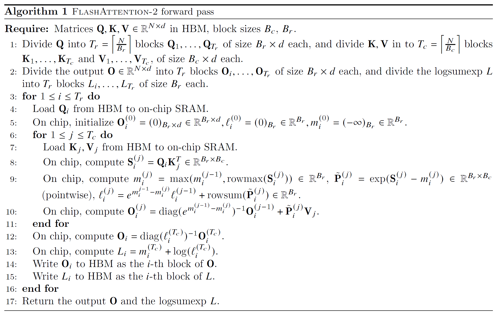
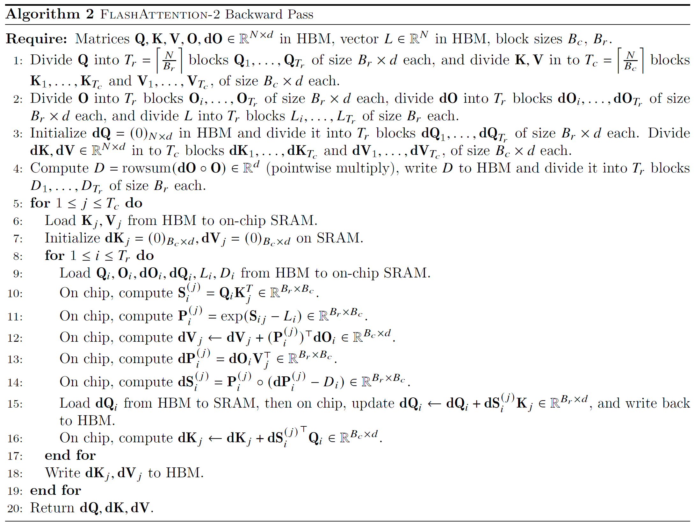
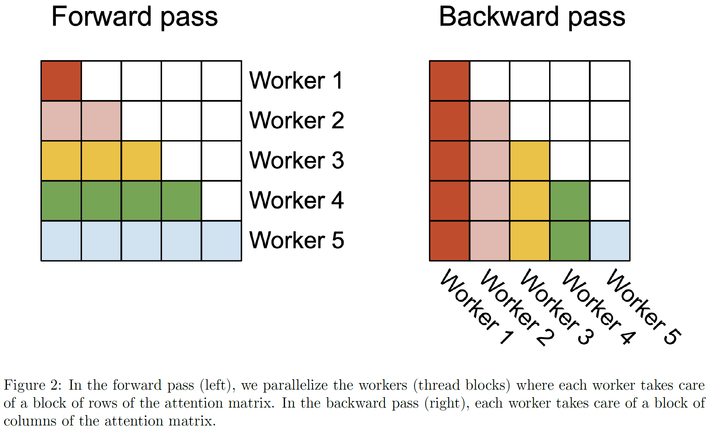
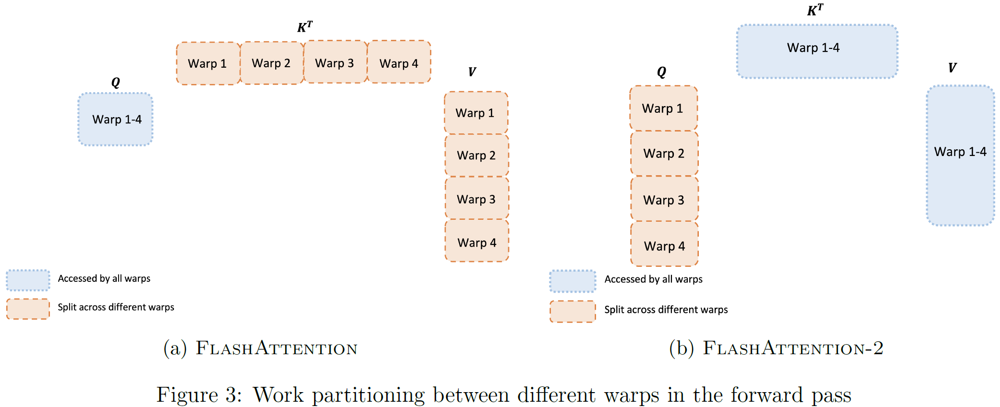

**论文链接：**
- FlashAttention v1：*FlashAttention: Fast and Memory-Efficient Exact Attention with IO-Awareness* (NeurIPS 2022) —— https://arxiv.org/abs/2205.14135
- FlashAttention v2：*FlashAttention-2: Faster Attention with Better Parallelism and Work Partitioning* (arXiv 2023) —— https://arxiv.org/abs/2307.08691

> ***这些写 html****

---

## 一、符号约定（与论文一致）

$N$ 为序列长度，$d$ 为特征维度。$B_r$ 为每个 query 块包含的 query 向量行数，$B_c$ 为每个 key/value 块包含的 key/value 向量行数。$T_r = \lceil N / B_r \rceil$ 为 query 块数，$T_c = \lceil N / B_c \rceil$ 为 key/value 块数。

$Q, K, V \in \mathbb{R}^{N \times d}$ 为输入矩阵。$O \in \mathbb{R}^{N \times d}$ 为输出。$dO \in \mathbb{R}^{N \times d}$ 为损失函数对 $O$ 的梯度。

分块矩阵：
- $Q_i \in \mathbb{R}^{B_r \times d}$：第 $i$ 个 query 块。
- $K_j, V_j \in \mathbb{R}^{B_c \times d}$：第 $j$ 个 key/value 块。
- $O_i, dO_i \in \mathbb{R}^{B_r \times d}$：第 $i$ 个输出块及其梯度。
- $dQ_i \in \mathbb{R}^{B_r \times d}$，$dK_j, dV_j \in \mathbb{R}^{B_c \times d}$：梯度块。

**具体实例：** $N=4, d=3, B_r=2, B_c=2$，则 $T_r = 2, T_c = 2$。

$$Q_1 = \begin{bmatrix} \mathbf{q}_1 \\ \mathbf{q}_2 \end{bmatrix} \in \mathbb{R}^{2 \times 3},\quad Q_2 = \begin{bmatrix} \mathbf{q}_3 \\ \mathbf{q}_4 \end{bmatrix} \in \mathbb{R}^{2 \times 3}$$

$$K_1 = \begin{bmatrix} \mathbf{k}_1 \\ \mathbf{k}_2 \end{bmatrix} \in \mathbb{R}^{2 \times 3},\quad K_2 = \begin{bmatrix} \mathbf{k}_3 \\ \mathbf{k}_4 \end{bmatrix} \in \mathbb{R}^{2 \times 3}$$

$$V_1 = \begin{bmatrix} \mathbf{v}_1 \\ \mathbf{v}_2 \end{bmatrix} \in \mathbb{R}^{2 \times 3},\quad V_2 = \begin{bmatrix} \mathbf{v}_3 \\ \mathbf{v}_4 \end{bmatrix} \in \mathbb{R}^{2 \times 3}$$

其中 $\mathbf{q}_n, \mathbf{k}_m, \mathbf{v}_m \in \mathbb{R}^{1 \times 3}$ 均为行向量。

---

## 二、前置原理：Online Softmax 的数学推导

FlashAttention 的核心是 Online Softmax。

### 2.1 问题设定与目标

考虑单个 query 行向量（省略行下标），其标准 Attention 输出为：
$$o = \frac{\sum_{m=1}^{N} \exp(s_m) v_m}{\sum_{m=1}^{N} \exp(s_m)} \in \mathbb{R}^{1 \times d}$$

其中 $s_m = q k_m^\top \in \mathbb{R}$ 为第 $m$ 个 key 行向量的分数，$v_m \in \mathbb{R}^{1 \times d}$ 为第 $m$ 个 value 行向量。

由于 HBM 容量限制，无法一次性载入全部 $N$ 个 key/value 行向量。将 $N$ 个 key 行向量按每块 $B_c$ 个分成 $T_c$ 个块，第 $j$ 块包含：
$$\text{Key}_j = \{k_{(j-1)B_c+1}, \dots, k_{jB_c}\}, \quad \text{Value}_j = \{v_{(j-1)B_c+1}, \dots, v_{jB_c}\}$$

**目标：** 顺序处理第 $1, 2, \dots, T_c$ 块，每处理完第 $j$ 块后维护三个统计量，使得处理完所有块后，无需重新从头计算，即可得到与上式完全相同的结果。

---

### 2.2 统计量的严格定义

单个 query 行向量处理完前 $j$ 个 key/value 块后，定义以下三个统计量：

**定义 1（全局最大值）：**
$$m^{(j)} = \max_{\substack{1 \le t \le j \\ 1 \le c \le B_c}} s_{(t-1)B_c+c} \in \mathbb{R}$$

其中，$1 \le t \le j$ 是遍历前 $j$ 个 key 块（共 $T_{c}$ 个 key 块)，$1 \le c \le B_c$ 是遍历单个 key 块内的行向量（每个 key 块内有 $B_c$ 个 key 行向量）。合起来的表示就是遍历前 $j$ 个 key 块内的所有 key 行向量。

$m^{(j)}$ 是前 $j$ 个块中所有 key 行向量对应的分数 $s_m$ 的最大值。它是数值稳定性的基准，后续所有指数运算均以此最大值为参考点。

---

**定义 2（全局指数和）：**
$$\ell^{(j)} = \sum_{t=1}^{j} \sum_{c=1}^{B_c} \exp\left(s_{(t-1)B_c+c} - m^{(j)}\right) \in \mathbb{R}$$

$\ell^{(j)}$ 是以当前全局最大值 $m^{(j)}$ 为基准，前 $j$ 个块中所有分数的指数和。注意分母中的 $m^{(j)}$ 确保了每一项指数均不超过 $1$（因为 $s_{(t-1)B_c+c} \le m^{(j)}$），从而避免数值溢出。

---

**定义 3（未归一化加权和）：**
$$o^{(j)} = \sum_{t=1}^{j} \sum_{c=1}^{B_c} \exp\left(s_{(t-1)B_c+c} - m^{(j)}\right) v_{(t-1)B_c+c} \in \mathbb{R}^{1 \times d}$$

$o^{(j)}$ 是以当前全局最大值 $m^{(j)}$ 为基准，前 $j$ 个块中所有 value 的加权累加和，权重为平移后的指数。

---

**关键观察：** 若上述定义成立，则：
$$\frac{o^{(j)}}{\ell^{(j)}} = \frac{\sum_{t=1}^{j} \sum_{c=1}^{B_c} \exp\left(s_{(t-1)B_c+c} - m^{(j)}\right) v_{(t-1)B_c+c}}{\sum_{t=1}^{j} \sum_{c=1}^{B_c} \exp\left(s_{(t-1)B_c+c} - m^{(j)}\right)}$$

分子分母同乘 $\exp(m^{(j)})$：
$$\frac{o^{(j)}}{\ell^{(j)}} = \frac{\sum_{t=1}^{j} \sum_{c=1}^{B_c} \exp\left(s_{(t-1)B_c+c}\right) v_{(t-1)B_c+c}}{\sum_{t=1}^{j} \sum_{c=1}^{B_c} \exp\left(s_{(t-1)B_c+c}\right)}$$

当 $j = T_c$ 时，上式恰好等于标准 Attention 输出 $o$。因此，**只要我们能增量维护 $m^{(j)}, \ell^{(j)}, o^{(j)}$，最终相除即得正确结果**。

---

### 2.3 增量更新公式的推导

仍然是单个 query 行向量。假设已处理前 $j-1$ 个 key/value 块，当前维护的统计量为 $m^{(j-1)}, \ell^{(j-1)}, o^{(j-1)}$。现处理第 $j$ 个 key/value 块，该块包含分数 $\{s_{(j-1)B_c+1}, \dots, s_{jB_c}\}$ 和 value $\{v_{(j-1)B_c+1}, \dots, v_{jB_c}\}$。

**Step 1：更新全局最大值**

第 $j$ 个 key 块的局部最大值为：
$$\tilde{m} = \max_{1 \le c \le B_c} s_{(j-1)B_c+c} \in \mathbb{R}$$

新的全局最大值必须在"旧全局最大值"和"新块局部最大值"之间取最大：
$$m^{(j)} = \max\left(m^{(j-1)}, \tilde{m}\right) \in \mathbb{R}$$

这直接来自定义 1：全局最大值是前 $j$ 个 key 块中所有分数的最大值。

---

**Step 2：更新全局指数和**

由定义 2，新的全局指数和应为：
$$\ell^{(j)} = \sum_{t=1}^{j} \sum_{c=1}^{B_c} \exp\left(s_{(t-1)B_c+c} - m^{(j)}\right)$$

将求和拆分为旧块（前 $j-1$ 个 key 块）和新块（第 $j$ 个 key 块）：
$$\ell^{(j)} = \underbrace{\sum_{t=1}^{j-1} \sum_{c=1}^{B_c} \exp\left(s_{(t-1)B_c+c} - m^{(j)}\right)}_{\text{旧块贡献}} + \underbrace{\sum_{c=1}^{B_c} \exp\left(s_{(j-1)B_c+c} - m^{(j)}\right)}_{\text{新块贡献}}$$

**处理旧块贡献：**

对任意旧项 $s_{(t-1)B_c+c}$（其中 $t \le j-1$），利用指数性质 $\exp(a - b) = \exp(a - c) \cdot \exp(c - b)$，令 $a = s_{(t-1)B_c+c}$，$b = m^{(j)}$，$c = m^{(j-1)}$：
$$\exp\left(s_{(t-1)B_c+c} - m^{(j)}\right) = \exp\left(s_{(t-1)B_c+c} - m^{(j-1)}\right) \cdot \exp\left(m^{(j-1)} - m^{(j)}\right)$$

注意 $\exp(m^{(j-1)} - m^{(j)})$ 与 $t, c$ 无关，可提出求和符号外。因此旧块贡献为：
$$\exp\left(m^{(j-1)} - m^{(j)}\right) \cdot \sum_{t=1}^{j-1} \sum_{c=1}^{B_c} \exp\left(s_{(t-1)B_c+c} - m^{(j-1)}\right) = \exp\left(m^{(j-1)} - m^{(j)}\right) \cdot \ell^{(j-1)}$$

**处理新块贡献：**

新块各项直接以新基准 $m^{(j)}$ 计算：
$$\sum_{c=1}^{B_c} \exp\left(s_{(j-1)B_c+c} - m^{(j)}\right)$$

**合并：**
$$\ell^{(j)} = \exp\left(m^{(j-1)} - m^{(j)}\right) \cdot \ell^{(j-1)} + \sum_{c=1}^{B_c} \exp\left(s_{(j-1)B_c+c} - m^{(j)}\right)$$

---

**Step 3：更新未归一化加权和**

由定义 3，新的未归一化加权和应为：
$$o^{(j)} = \sum_{t=1}^{j} \sum_{c=1}^{B_c} \exp\left(s_{(t-1)B_c+c} - m^{(j)}\right) v_{(t-1)B_c+c}$$

同样拆分为旧块和新块：
$$o^{(j)} = \underbrace{\sum_{t=1}^{j-1} \sum_{c=1}^{B_c} \exp\left(s_{(t-1)B_c+c} - m^{(j)}\right) v_{(t-1)B_c+c}}_{\text{旧块贡献}} + \underbrace{\sum_{c=1}^{B_c} \exp\left(s_{(j-1)B_c+c} - m^{(j)}\right) v_{(j-1)B_c+c}}_{\text{新块贡献}}$$

**处理旧块贡献：**

对任意旧项，利用相同的指数性质：
$$\exp\left(s_{(t-1)B_c+c} - m^{(j)}\right) v_{(t-1)B_c+c} = \exp\left(m^{(j-1)} - m^{(j)}\right) \cdot \exp\left(s_{(t-1)B_c+c} - m^{(j-1)}\right) v_{(t-1)B_c+c}$$

提出公因子 $\exp(m^{(j-1)} - m^{(j)})$：
$$\exp\left(m^{(j-1)} - m^{(j)}\right) \cdot \sum_{t=1}^{j-1} \sum_{c=1}^{B_c} \exp\left(s_{(t-1)B_c+c} - m^{(j-1)}\right) v_{(t-1)B_c+c} = \exp\left(m^{(j-1)} - m^{(j)}\right) \cdot o^{(j-1)}$$

**处理新块贡献：**

直接以新基准 $m^{(j)}$ 计算：
$$\sum_{c=1}^{B_c} \exp\left(s_{(j-1)B_c+c} - m^{(j)}\right) v_{(j-1)B_c+c}$$

**合并：**
$$o^{(j)} = \exp\left(m^{(j-1)} - m^{(j)}\right) \cdot o^{(j-1)} + \sum_{c=1}^{B_c} \exp\left(s_{(j-1)B_c+c} - m^{(j)}\right) v_{(j-1)B_c+c}$$

---

### 2.4 统一更新公式与正确性证明

引入**局部平移指数**以简化表达：
$$\tilde{p}_{c}^{(j)} = \exp\left(s_{(j-1)B_c+c} - m^{(j)}\right) \in \mathbb{R}, \quad c = 1, \dots, B_c$$

$\tilde{p}_{c}^{(j)}$ 的含义：第 $j$ 个 key 块中第 $c$ 个 key 行向量的分数，相对于当前全局最大值 $m^{(j)}$ 的指数值。

则更新公式统一写为：
$$m^{(j)} = \max\left(m^{(j-1)}, \max_{1 \le c \le B_c} s_{(j-1)B_c+c}\right)$$
$$\ell^{(j)} = \exp\left(m^{(j-1)} - m^{(j)}\right) \cdot \ell^{(j-1)} + \sum_{c=1}^{B_c} \tilde{p}_{c}^{(j)}$$
$$o^{(j)} = \exp\left(m^{(j-1)} - m^{(j)}\right) \cdot o^{(j-1)} + \sum_{c=1}^{B_c} \tilde{p}_{c}^{(j)} v_{(j-1)B_c+c}$$

**正确性证明：**

由 2.3 节的推导过程，上述递推严格保持了定义 2 和定义 3 所要求的：
$$\ell^{(j)} = \sum_{t=1}^{j} \sum_{c=1}^{B_c} \exp\left(s_{(t-1)B_c+c} - m^{(j)}\right)$$
$$o^{(j)} = \sum_{t=1}^{j} \sum_{c=1}^{B_c} \exp\left(s_{(t-1)B_c+c} - m^{(j)}\right) v_{(t-1)B_c+c}$$

因此当 $j = T_c$ 时：
$$\frac{o^{(T_c)}}{\ell^{(T_c)}} = \frac{\sum_{m=1}^{N} \exp(s_m - m^{(T_c)}) v_m}{\sum_{m=1}^{N} \exp(s_m - m^{(T_c)})} = \frac{\sum_{m=1}^{N} \exp(s_m) v_m}{\sum_{m=1}^{N} \exp(s_m)} = o$$

最后一步分子分母同乘 $\exp(m^{(T_c)})$。证毕。

---

**关于定标因子 $\exp(m^{(j-1)} - m^{(j)})$：**

该因子的作用是将旧累积量从旧基准 $m^{(j-1)}$ 转换到新基准 $m^{(j)}$。
- 当 $m^{(j)} = m^{(j-1)}$（新块未产生更大分数）时，该因子为 $1$，旧累积量 $\ell^{(j-1)}$ 和 $o^{(j-1)}$ 无需调整。
- 当 $m^{(j)} > m^{(j-1)}$（新块产生更大分数）时，该因子小于 $1$，旧累积量按比例收缩，以确保所有项均以新的更大基准 $m^{(j)}$ 为参考点。

---

## 三、从标量到矩阵块：$N=4, d=3, B_r=2, B_c=2$

第二节展示了单个 query 块（若干个 query 行向量）对多个 key 块的标量运算。在 GPU 上，需将多个标量运算组织成矩阵块，由 Tensor Core 批量执行。以下展示这种组织方式。

**目标：** 计算第 $i=1$ 个 query 块的输出 $O_1 \in \mathbb{R}^{2 \times 3}$，即同时计算 $\mathbf{q}_1$ 和 $\mathbf{q}_2$ 的 Attention 输出。

这本质上是将第二节的标量运算，对 $2$ 个 query 行和 $2$ 个 key/value 块并行执行。

---

### 3.1 初始化

对**第 $i=1$ 个 query 块**，维护以下变量：

- $O_1^{(0)} = \mathbf{0}^{2 \times 3} \in \mathbb{R}^{2 \times 3}$：**未归一化累积输出矩阵**。第 $r$ 行 $O_1^{(0)}[r,:] \in \mathbb{R}^{1 \times 3}$ 对应第 $r$ 个 query 行向量的未归一化加权和 $o^{(0)}$ 的向量形式。初始为零矩阵，因为尚未处理任何 key/value。

- $m_1^{(0)} = \begin{bmatrix} -\infty \\ -\infty \end{bmatrix} \in \mathbb{R}^{2}$：**全局行最大值向量**。第 $r$ 个元素 $m_1^{(0)}[r] \in \mathbb{R}$ 对应第 $r$ 个 query 行向量的全局最大值 $m^{(0)}$。初始为负无穷，表示尚未处理任何 key。

- $\ell_1^{(0)} = \begin{bmatrix} 0 \\ 0 \end{bmatrix} \in \mathbb{R}^{2}$：**全局行指数和向量**。第 $r$ 个元素 $\ell_1^{(0)}[r] \in \mathbb{R}$ 对应第 $r$ 个 query 行向量的全局指数和 $\ell^{(0)}$。初始为零，因为尚未累加任何指数。

---

### 3.2 第 1 轮循环（$j=1$，处理 $K_1, V_1 \in \mathbb{R}^{2 \times 3}$）

**Step 1：计算局部分数矩阵。**

$$S_1^{(1)} = Q_1 K_1^\top = \begin{bmatrix} \mathbf{q}_1 \mathbf{k}_1^\top & \mathbf{q}_1 \mathbf{k}_2^\top \\ \mathbf{q}_2 \mathbf{k}_1^\top & \mathbf{q}_2 \mathbf{k}_2^\top \end{bmatrix} \in \mathbb{R}^{2 \times 2}$$

$S_1^{(1)}[r,c] = \mathbf{q}_{r} \mathbf{k}_c^\top \in \mathbb{R}$ 是标量内积。$S_1^{(1)}$ 的第 $r$ 行包含第 $r$ 个 query 行向量与第 $j=1$ 块中所有 $B_c=2$ 个 key 行向量的分数。

**用途：** $S_1^{(1)}$ 是当前 query 块与当前 key 块的所有两两内积，是 softmax 的输入。

---

**Step 2：更新全局行最大值。**

$$m_1^{(1)} = \max\left(m_1^{(0)},\ \text{rowmax}\left(S_1^{(1)}\right)\right) \in \mathbb{R}^{2}$$

其中 $\text{rowmax}(S_1^{(1)}) \in \mathbb{R}^{2}$ 对 $S_1^{(1)}$ 每行取最大，输出长度为 $2$ 的列向量。由于 $m_1^{(0)} = -\infty$，故：
$$m_1^{(1)} = \text{rowmax}\left(S_1^{(1)}\right) = \begin{bmatrix} \max(S_1^{(1)}[1,1], S_1^{(1)}[1,2]) \\ \max(S_1^{(1)}[2,1], S_1^{(1)}[2,2]) \end{bmatrix}$$

$m_1^{(1)}[r] \in \mathbb{R}$ 的含义：第 $r$ 个 query 行向量在处理完第 $1$ 个 key 块后，与**所有已处理 key** 的分数中的最大值。

**用途：** $m_1^{(1)}$ 用于数值稳定性，后续指数运算将以此最大值为基准进行平移。

---

**Step 3：计算局部平移指数矩阵。**

$$\tilde{P}_1^{(1)} = \exp\left(S_1^{(1)} - m_1^{(1)}\right) \in \mathbb{R}^{2 \times 2}$$

**定义：** $\tilde{P}_1^{(1)}$ 称为**局部平移指数矩阵**。其元素 $\tilde{P}_1^{(1)}[r,c] = \exp(S_1^{(1)}[r,c] - m_1^{(1)}[r])$ 表示：第 $r$ 个 query 行向量与第 $c$ 个 key 行向量的分数，相对于当前全局最大值 $m_1^{(1)}[r]$ 的指数值。

**运算说明：** 此处减法为**逐行广播**。$S_1^{(1)} \in \mathbb{R}^{2 \times 2}$ 的第 $r$ 行减去 $m_1^{(1)} \in \mathbb{R}^{2}$ 的第 $r$ 个元素，得到平移后的分数，再逐元素取指数。

**用途：** $\tilde{P}_1^{(1)}$ 是当前 key 块对当前 query 块的**未归一化注意力权重**。由于减去了行最大值，最大元素值为 $\exp(0) = 1$，避免了指数溢出。这些权重将用于加权累加 value。

---

**Step 4：更新全局行指数和。**

$$\ell_1^{(1)} = \exp\left(m_1^{(0)} - m_1^{(1)}\right) \odot \ell_1^{(0)} + \text{rowsum}\left(\tilde{P}_1^{(1)}\right) \in \mathbb{R}^{2}$$

**分解说明：**
- $\text{rowsum}(\tilde{P}_1^{(1)}) \in \mathbb{R}^{2}$ 对 $\tilde{P}_1^{(1)}$ 每行求和，输出长度为 $2$ 的列向量。第 $r$ 个元素是第 $r$ 个 query 行向量对当前 key 块中所有 key 行向量的平移指数之和。
- $\exp(m_1^{(0)} - m_1^{(1)}) \in \mathbb{R}^{2}$ 是逐元素的定标因子。由于 $m_1^{(0)} = -\infty$，该项为 $\mathbf{0}$。
- $\odot$ 为逐元素乘法。

因此：
$$\ell_1^{(1)} = \text{rowsum}\left(\tilde{P}_1^{(1)}\right) = \begin{bmatrix} \sum_{c=1}^{2} \exp(S_1^{(1)}[1,c] - m_1^{(1)}[1]) \\ \sum_{c=1}^{2} \exp(S_1^{(1)}[2,c] - m_1^{(1)}[2]) \end{bmatrix}$$

$\ell_1^{(1)}[r] \in \mathbb{R}$ 的含义：第 $r$ 个 query 行向量在处理完第 $1$ 个 key 块后，以当前全局最大值 $m_1^{(1)}[r]$ 为基准，与**所有已处理 key** 块的分数的指数和。

**用途：** $\ell_1^{(1)}$ 是分母的局部近似。循环结束后，$\ell_1^{(T_c)}$ 将等于标准 softmax 的分母。

---

**Step 5：更新未归一化输出。**

$$O_1^{(1)} = \text{diag}\left(\exp\left(m_1^{(0)} - m_1^{(1)}\right)\right)^{-1} O_1^{(0)} + \tilde{P}_1^{(1)} V_1 \in \mathbb{R}^{2 \times 3}$$

> 根据指数函数的倒数性质，存在
> $$\exp(a)^{-1} = \frac{1}{\exp(a)} = \exp(-a)$$
> 而**对角矩阵的逆，就是对每个对角元取倒数**，故
> $$O^{(j)} = \underbrace{\text{diag}\left(\exp\left(m^{(j-1)} - m^{(j)}\right)\right)^{-1}}_{\text{等价于 } \text{diag}(\exp(m^{(j)}-m^{(j-1)}))} O^{(j-1)} + \tilde{P}^{(j)}V_j$$

**分解说明：**
- $\text{diag}(\exp(m_1^{(0)} - m_1^{(1)}))^{-1} \in \mathbb{R}^{2 \times 2}$ 是以定标因子为对角元的对角矩阵的逆。由于 $m_1^{(0)} = -\infty$，该对角矩阵为零矩阵，其逆无意义，但乘以 $O_1^{(0)} = \mathbf{0}$ 后该项整体为零矩阵。
- $\tilde{P}_1^{(1)} \in \mathbb{R}^{2 \times 2}$，$V_1 \in \mathbb{R}^{2 \times 3}$，矩阵乘法结果 $\in \mathbb{R}^{2 \times 3}$。

因此：
$$O_1^{(1)} = \tilde{P}_1^{(1)} V_1 = \begin{bmatrix} \sum_{c=1}^{2} \tilde{P}_1^{(1)}[1,c] \cdot \mathbf{v}_c \\ \sum_{c=1}^{2} \tilde{P}_1^{(1)}[2,c] \cdot \mathbf{v}_c \end{bmatrix} \in \mathbb{R}^{2 \times 3}$$

$O_1^{(1)}[r,:] \in \mathbb{R}^{1 \times 3}$ 的含义：第 $r$ 个 query 行向量在处理完第 $1$ 个 key 块后，以当前全局最大值 $m_1^{(1)}[r]$ 为基准，对**所有已处理 key** 的 value 的加权累加和。权重为平移后的指数 $\tilde{P}_1^{(1)}[r,c]$。

**用途：** $O_1^{(1)}$ 是分子的局部近似。循环结束后，$O_1^{(T_c)} / \ell_1^{(T_c)}$ 将等于标准 softmax attention 的输出。

---

### 3.3 第 2 轮循环（$j=2$，处理 $K_2, V_2 \in \mathbb{R}^{2 \times 3}$）

**Step 1：计算局部分数矩阵。**

$$S_1^{(2)} = Q_1 K_2^\top = \begin{bmatrix} \mathbf{q}_1 \mathbf{k}_3^\top & \mathbf{q}_1 \mathbf{k}_4^\top \\ \mathbf{q}_2 \mathbf{k}_3^\top & \mathbf{q}_2 \mathbf{k}_4^\top \end{bmatrix} \in \mathbb{R}^{2 \times 2}$$

$S_1^{(2)}[r,c]$ 是第 $r$ 个 query 行向量与第 $j=2$ 块中第 $c$ 个 key 行向量的标量内积。

---

**Step 2：更新全局行最大值。**

$$m_1^{(2)} = \max\left(m_1^{(1)},\ \text{rowmax}\left(S_1^{(2)}\right)\right) \in \mathbb{R}^{2}$$

$m_1^{(2)}[r] \in \mathbb{R}$ 的含义：第 $r$ 个 query 行向量在处理完前 $2$ 个 key 块后，与**所有已处理 key** 的分数中的最大值。

此处必须分两种情况，因为 $m_1^{(2)}$ 的值决定了旧统计量是否需要重新定标。

---

**情况 A：第 $r$ 行最大值未更新，$m_1^{(2)}[r] = m_1^{(1)}[r]$。**

**Step 3：局部平移指数。**

$$\tilde{P}_1^{(2)}[r,c] = \exp\left(S_1^{(2)}[r,c] - m_1^{(2)}[r]\right) = \exp\left(S_1^{(2)}[r,c] - m_1^{(1)}[r]\right)$$

$\tilde{P}_1^{(2)}[r,c]$ 的含义：第 $r$ 个 query 行向量与第 $c$ 个新 key 行向量的分数，相对于当前全局最大值 $m_1^{(2)}[r]$ 的指数值。

**Step 4：更新全局行指数和。**

$$\ell_1^{(2)}[r] = \exp\left(m_1^{(1)}[r] - m_1^{(2)}[r]\right) \cdot \ell_1^{(1)}[r] + \sum_{c=1}^{2} \tilde{P}_1^{(2)}[r,c] = 1 \cdot \ell_1^{(1)}[r] + \sum_{c=1}^{2} \tilde{P}_1^{(2)}[r,c]$$

**来源：** 第二节统一更新公式的向量化。由于基准未变（$m_1^{(2)}[r] = m_1^{(1)}[r]$），定标因子 $\exp(m_1^{(1)}[r] - m_1^{(2)}[r]) = 1$，旧指数和 $\ell_1^{(1)}[r]$ 无需调整。新全局指数和为旧和加上新块的平移指数之和。

**Step 5：更新未归一化输出。**

$$O_1^{(2)}[r,:] = \exp\left(m_1^{(1)}[r] - m_1^{(2)}[r]\right) \cdot O_1^{(1)}[r,:] + \sum_{c=1}^{2} \tilde{P}_1^{(2)}[r,c] \cdot \mathbf{v}_{2+c} = O_1^{(1)}[r,:] + \sum_{c=1}^{2} \tilde{P}_1^{(2)}[r,c] \cdot \mathbf{v}_{2+c}$$

**来源：** 第二节统一更新公式的向量化。由于基准未变，旧加权和 $O_1^{(1)}[r,:]$ 无需调整。新未归一化加权和为旧和加上新块的加权 value 之和。

---

**情况 B：第 $r$ 行最大值更新，$m_1^{(2)}[r] > m_1^{(1)}[r]$。**

**Step 3：局部平移指数。**

$$\tilde{P}_1^{(2)}[r,c] = \exp\left(S_1^{(2)}[r,c] - m_1^{(2)}[r]\right)$$

**Step 4：更新全局行指数和。**

$$\ell_1^{(2)}[r] = \exp\left(m_1^{(1)}[r] - m_1^{(2)}[r]\right) \cdot \ell_1^{(1)}[r] + \sum_{c=1}^{2} \tilde{P}_1^{(2)}[r,c]$$

**来源：** 第二节统一更新公式的向量化。由于基准提升，旧指数和 $\ell_1^{(1)}[r]$ 必须乘以定标因子 $\exp(m_1^{(1)}[r] - m_1^{(2)}[r]) < 1$ 进行收缩，以转换为新基准下的表示，再加上新块的贡献。

**Step 5：更新未归一化输出。**

$$O_1^{(2)}[r,:] = \exp\left(m_1^{(1)}[r] - m_1^{(2)}[r]\right) \cdot O_1^{(1)}[r,:] + \sum_{c=1}^{2} \tilde{P}_1^{(2)}[r,c] \cdot \mathbf{v}_{2+c}$$

**来源：** 第二节统一更新公式的向量化。旧加权和 $O_1^{(1)}[r,:]$ 是以旧基准 $m_1^{(1)}[r]$ 计算的，必须乘以相同定标因子 $\exp(m_1^{(1)}[r] - m_1^{(2)}[r])$ 收缩后，才表示新基准下的加权和，再加上新块的贡献。

---

### 3.4 最终归一化与 logsumexp

循环结束（$j=T_c=2$），执行统一归一化：
$$O_1 = \text{diag}\left(\ell_1^{(2)}\right)^{-1} O_1^{(2)} \in \mathbb{R}^{2 \times 3}$$

对第 $r$ 行：
$$O_1[r,:] = \frac{1}{\ell_1^{(2)}[r]} O_1^{(2)}[r,:] = \frac{\sum_{j=1}^{2} \sum_{c=1}^{2} \exp\left(S_{1,rc}^{(j)} - m_{1,r}^{(2)}\right) \mathbf{v}_{(j-1)2+c}}{\sum_{j=1}^{2} \sum_{c=1}^{2} \exp\left(S_{1,rc}^{(j)} - m_{1,r}^{(2)}\right)}$$

分子为以最终全局最大值 $m_{1,r}^{(2)}$ 为基准的加权和，分母为对应指数和，与标准 softmax attention 完全一致。

保存 logsumexp：
$$L_1 = m_1^{(2)} + \log\left(\ell_1^{(2)}\right) \in \mathbb{R}^{2}$$

**定义：** $L_1$ 为**对数指数和向量**。第 $r$ 个元素 $L_1[r] = m_{1,r}^{(2)} + \log(\ell_{1,r}^{(2)})$ 是第 $r$ 个 query 的 logsumexp。

**用途：** 反向传播时，利用 $L_1$ 可恢复全局 softmax 概率，无需分别保存 $m_1^{(2)}$ 和 $\ell_1^{(2)}$。由 $\exp(S_1^{(j)} - L_1) = \exp(S_1^{(j)} - m_1^{(2)}) / \ell_1^{(2)}$，恰为全局 softmax 概率。

---

## 四、FlashAttention-2 前向传播的一般形式（Algorithm 1）

对第 $i$ 个 query 块，定义：
- $S_i^{(j)} = Q_i K_j^\top \in \mathbb{R}^{B_r \times B_c}$：第 $i$ 个 query 块与第 $j$ 个 key 块的**局部分数矩阵**。元素 $S_i^{(j)}[r,c]$ 是第 $r$ 个 query 与第 $c$ 个 key 的标量内积。
- $m_i^{(j)} \in \mathbb{R}^{B_r}$：**全局行最大值向量**。第 $r$ 个元素是第 $r$ 个 query 行向量在处理完前 $j$ 个 key 块后的全局最大值。初始 $m_i^{(0)} = (-\infty)^{B_r}$。
- $\ell_i^{(j)} \in \mathbb{R}^{B_r}$：**全局行指数和向量**。第 $r$ 个元素是第 $r$ 个 query 行向量在处理完前 $j$ 个 key 块后，以 $m_i^{(j)}[r]$ 为基准的指数和。初始 $\ell_i^{(0)} = \mathbf{0}^{B_r}$。
- $O_i^{(j)} \in \mathbb{R}^{B_r \times d}$：**未归一化累积输出矩阵**。第 $r$ 行是第 $r$ 个 query 行向量在处理完前 $j$ 个 key 块后，以 $m_i^{(j)}[r]$ 为基准的 value 加权累加和。初始 $O_i^{(0)} = \mathbf{0}^{B_r \times d}$。

对 $j = 1, \dots, T_c$，依次执行：

1. $S_i^{(j)} = Q_i K_j^\top \in \mathbb{R}^{B_r \times B_c}$
2. $m_i^{(j)} = \max\left(m_i^{(j-1)},\ \text{rowmax}\left(S_i^{(j)}\right)\right) \in \mathbb{R}^{B_r}$
3. $\tilde{P}_i^{(j)} = \exp\left(S_i^{(j)} - m_i^{(j)}\right) \in \mathbb{R}^{B_r \times B_c}$（逐行广播减法）

   **定义：** $\tilde{P}_i^{(j)}$ 为**局部平移指数矩阵**。元素 $\tilde{P}_i^{(j)}[r,c] = \exp(S_i^{(j)}[r,c] - m_i^{(j)}[r])$ 表示第 $r$ 个 query 行向量与第 $c$ 个 key 的分数相对于当前全局最大值 $m_i^{(j)}[r]$ 的指数值。

   **用途：** $\tilde{P}_i^{(j)}$ 是当前 key 块对当前 query 块的未归一化注意力权重。减去行最大值确保数值稳定性，最大元素值为 $1$。

4. $\ell_i^{(j)} = \exp\left(m_i^{(j-1)} - m_i^{(j)}\right) \odot \ell_i^{(j-1)} + \text{rowsum}\left(\tilde{P}_i^{(j)}\right) \in \mathbb{R}^{B_r}$

   **来源：** 第二节统一更新公式的向量化。$\exp(m_i^{(j-1)} - m_i^{(j)}) \in \mathbb{R}^{B_r}$ 是逐元素的定标因子。当某行基准提升时，对应元素小于 $1$，对该行的旧指数和进行收缩；当基准不变时，对应元素为 $1$，旧指数和保持不变。

5. $O_i^{(j)} = \text{diag}\left(\exp\left(m_i^{(j-1)} - m_i^{(j)}\right)\right)^{-1} O_i^{(j-1)} + \tilde{P}_i^{(j)} V_j \in \mathbb{R}^{B_r \times d}$

   **来源：** 第二节统一更新公式的向量化。左侧项将旧加权和按相同定标因子收缩，右侧项加入新块的加权 value 贡献。

6. 循环结束后，统一归一化：
   $$O_i = \text{diag}\left(\ell_i^{(T_c)}\right)^{-1} O_i^{(T_c)} \in \mathbb{R}^{B_r \times d}$$

   **用途：** $O_i^{(T_c)}$ 是未归一化的加权和，$\ell_i^{(T_c)}$ 是全局指数和。逐行相除得到标准 softmax attention 输出。

7. 保存 logsumexp：
   $$L_i = m_i^{(T_c)} + \log\left(\ell_i^{(T_c)}\right) \in \mathbb{R}^{B_r}$$

   **用途：** $L_i$ 用于反向传播时恢复全局 softmax 概率，替代了分别保存 $m_i^{(T_c)}$ 和 $\ell_i^{(T_c)}$。

---

## 五、反向传播的梯度推导

### 5.1 Softmax 梯度的完整推导

设 $p \in \mathbb{R}^N$ 为 softmax 输出，$s \in \mathbb{R}^N$ 为输入：
$$p_m = \frac{\exp(s_m)}{\sum_{k=1}^{N} \exp(s_k)}, \quad m = 1, \dots, N$$

对 $p_m$ 关于 $s_n$ 求偏导：

**当 $m = n$ 时：**
$$\frac{\partial p_n}{\partial s_n} = \frac{\exp(s_n) \cdot \sum_k \exp(s_k) - \exp(s_n) \cdot \exp(s_n)}{\left(\sum_k \exp(s_k)\right)^2} = p_n (1 - p_n)$$

**当 $m \neq n$ 时：**
$$\frac{\partial p_m}{\partial s_n} = \frac{0 - \exp(s_m) \cdot \exp(s_n)}{\left(\sum_k \exp(s_k)\right)^2} = -p_m p_n$$

合并得：
$$\frac{\partial p_m}{\partial s_n} = p_m (\delta_{mn} - p_n)$$

由链式法则：

$$(ds)_n = \frac{\partial L}{\partial s_n} = \sum_{m=1}^{N} \underbrace{\frac{\partial L}{\partial p_m}}_{(dp)_m} \cdot \underbrace{\frac{\partial p_m}{\partial s_n}}_{\text{Jacobian}}$$

代入得：

$$(ds)_n = \sum_{m=1}^{N} p_m (\delta_{mn} - p_n) (dp)_m = p_n (dp)_n - p_n \sum_{m=1}^{N} p_m (dp)_m$$

定义标量 $D_n = \sum_{m=1}^{N} p_m (dp)_m = p^\top dp \in \mathbb{R}$，则：
$$ds = p \odot (dp - D_n \cdot \mathbf{1}_N) \in \mathbb{R}^N$$

**定义：** $D_n$ 为**softmax 梯度修正项**。它是输出梯度 $dp$ 与概率 $p$ 的内积，表示当前 query 行向量对所有 key 的加权梯度贡献。

**用途：** $D_n$ 用于修正 softmax 的梯度。由于 softmax 的归一化特性，增大某个分数会通过分母影响其他分数，$D_n$ 正是这一耦合效应的量化。

---

### 5.2 $D_i$ 的代数简化（Algorithm 2 第 4 行）

对第 $n$ 个 query 行，需计算 $D_n = \sum_{m=1}^{N} P_{n,m} (dP)_{n,m} \in \mathbb{R}$。

**Step 1：求 $(dP)_{n,m}$。**

由 $O_{n,t} = \sum_{m=1}^{N} P_{n,m} V_{m,t}$，对 $P_{n,m}$ 求偏导得 $\frac{\partial O_{n,t}}{\partial P_{n,m}} = V_{m,t}$。由链式法则：
$$(dP)_{n,m} = \sum_{t=1}^{d} \frac{\partial \mathcal{L}}{\partial O_{n,t}} \frac{\partial O_{n,t}}{\partial P_{n,m}} = \sum_{t=1}^{d} (dO)_{n,t} V_{m,t}$$

**定义：** $(dP)_{n,m}$ 为**概率梯度**。它是损失函数通过输出 $O_n$ 的所有维度回传到概率 $P_{n,m}$ 的梯度之和。

**Step 2：代入 $D_n$。**

$$D_n = \sum_{m=1}^{N} P_{n,m} \left(\sum_{t=1}^{d} (dO)_{n,t} V_{m,t}\right)$$

交换求和顺序：
$$D_n = \sum_{t=1}^{d} (dO)_{n,t} \left(\sum_{m=1}^{N} P_{n,m} V_{m,t}\right)$$

**Step 3：识别 $O_{n,t}$。**

括号内正是 $O_{n,t} = \sum_{m=1}^{N} P_{n,m} V_{m,t}$，因此：
$$D_n = \sum_{t=1}^{d} (dO)_{n,t} O_{n,t}$$

**分块表达：**

对第 $i$ 个 query 块，$dO_i, O_i \in \mathbb{R}^{B_r \times d}$，则：
$$D_i = \text{rowsum}\left(dO_i \odot O_i\right) \in \mathbb{R}^{B_r}$$

**定义：** $D_i$ 为**分块 softmax 梯度修正向量**。第 $r$ 个元素 $D_i[r]$ 对应第 $i$ 块中第 $r$ 个 query 行向量的修正项。

**用途：** 计算 $D_i$ 无需访问 $P$ 的任何元素，仅需 $dO_i$ 与 $O_i$ 的逐元素乘积，复杂度 $O(B_r d)$，完全在 SRAM 内完成。

---

### 5.3 具体实例：$N=4, d=3, B_r=2, B_c=2$ 的反向传播

**预计算（Algorithm 2 第 4 行）：**
$$D = \text{rowsum}(dO \odot O) \in \mathbb{R}^{4}$$

**定义：** $D \in \mathbb{R}^{4}$ 为全局修正向量，第 $n$ 个元素 $D[n] = \sum_{t=1}^{d} dO_{n,t} O_{n,t}$。

分块为 $D_1 \in \mathbb{R}^{2}$（对应 $O_1, dO_1$）和 $D_2 \in \mathbb{R}^{2}$（对应 $O_2, dO_2$）。

---

**外层循环 $j=1$**（加载 $K_1, V_1 \in \mathbb{R}^{2 \times 3}$ 到 SRAM）：

初始化局部累加器：
- $dK_1 = \mathbf{0}^{2 \times 3} \in \mathbb{R}^{2 \times 3}$：第 $1$ 个 key 块的梯度累加器。
- $dV_1 = \mathbf{0}^{2 \times 3} \in \mathbb{R}^{2 \times 3}$：第 $1$ 个 value 块的梯度累加器。

---

**内层循环 $i=1$**（加载 $Q_1, O_1, dO_1 \in \mathbb{R}^{2 \times 3}$，$L_1 \in \mathbb{R}^{2}$，$D_1 \in \mathbb{R}^{2}$）：

1. **重算概率（Algorithm 2 第 11 行）：**

   $$S_1^{(1)} = Q_1 K_1^\top \in \mathbb{R}^{2 \times 2}$$
   $$P_1^{(1)} = \exp\left(S_1^{(1)} - L_1\right) \in \mathbb{R}^{2 \times 2}$$

   **定义：** $P_1^{(1)}$ 为**重算概率矩阵**。元素 $P_1^{(1)}[r,c] = \exp(S_1^{(1)}[r,c] - L_1[r])$。

   **来源：** 由 $L_1 = m_1^{(T_c)} + \log(\ell_1^{(T_c)})$，有 $\exp(S_1^{(1)}[r,c] - L_1[r]) = \exp(S_1^{(1)}[r,c] - m_1^{(T_c)}[r]) / \ell_1^{(T_c)}[r]$，恰为全局 softmax 概率。

   **用途：** $P_1^{(1)}$ 用于后续梯度计算，替代了存储完整的 $N \times N$ 概率矩阵。

2. **累加 $dV_1$（Algorithm 2 第 12 行）：**

   $$dV_1 \leftarrow dV_1 + \left(P_1^{(1)}\right)^\top dO_1 \in \mathbb{R}^{2 \times 3}$$

   **来源：** 由 $d\mathbf{v}_m = \sum_{n} P_{n,m} d\mathbf{o}_n$，对块内所有行同时计算。$\left(P_1^{(1)}\right)^\top \in \mathbb{R}^{2 \times 2}$ 的转置使得行索引从 query 变为 key，与 $dO_1 \in \mathbb{R}^{2 \times 3}$ 相乘后，得到每个 key 行向量对所有 query 行向量的加权梯度贡献。

   **用途：** $dV_1$ 累加第 $j=1$ 个 value 块受到的所有 query 块的梯度影响。

3. **计算 $dP_1^{(1)}$（Algorithm 2 第 13 行）：**

   $$dP_1^{(1)} = dO_1 V_1^\top \in \mathbb{R}^{2 \times 2}$$

   **定义：** $dP_1^{(1)}$ 为**分块概率梯度矩阵**。元素 $dP_1^{(1)}[r,c] = \sum_{t=1}^{d} (dO_1)_{r,t} (V_1)_{c,t}$ 是第 $r$ 个 query 行向量对第 $c$ 个 key 行向量的概率梯度。

   **来源：** 由 $(dP)_{n,m} = \sum_{t} (dO)_{n,t} V_{m,t}$，对块内所有行同时计算即得矩阵乘法 $dO_1 V_1^\top$。

4. **计算 $dS_1^{(1)}$（Algorithm 2 第 14 行）：**

   $$dS_1^{(1)} = P_1^{(1)} \odot \left(dP_1^{(1)} - D_1 \mathbf{1}_{2}^\top\right) \in \mathbb{R}^{2 \times 2}$$

   **定义：** $dS_1^{(1)}$ 为**分块分数梯度矩阵**。元素 $dS_1^{(1)}[r,c]$ 是损失函数对分数 $S_1^{(1)}[r,c]$ 的梯度。

   **来源：** 5.1 节 softmax 梯度公式 $ds = p \odot (dp - D \cdot \mathbf{1})$ 的直接分块实现。$D_1 \mathbf{1}_{2}^\top \in \mathbb{R}^{2 \times 2}$ 的每一行均为 $D_1$ 的对应元素，实现对 $dP_1^{(1)}$ 的逐行广播减法。

   **用途：** $dS_1^{(1)}$ 将用于通过链式法则回传到 $Q$ 和 $K$ 的梯度。

5. **更新 $dQ_1$（Algorithm 2 第 15 行）：**

   $$dQ_1 \leftarrow dQ_1 + dS_1^{(1)} K_1 \in \mathbb{R}^{2 \times 3}$$

   **来源：** 由 $S_{n,m} = \mathbf{q}_n \mathbf{k}_m^\top$，链式法则给出 $d\mathbf{q}_n = \sum_{m} (dS)_{n,m} \mathbf{k}_m$。对块内所有行同时计算即得矩阵乘法 $dS_1^{(1)} K_1$。

   **用途：** $dQ_1$ 累加第 $i=1$ 个 query 块受到的所有 key/value 块的梯度影响。由于多个外层循环可能同时更新 $dQ_1$，v2 中使用 atomic adds。

6. **累加 $dK_1$（Algorithm 2 第 16 行）：**

   $$dK_1 \leftarrow dK_1 + \left(dS_1^{(1)}\right)^\top Q_1 \in \mathbb{R}^{2 \times 3}$$

   **来源：** 由 $d\mathbf{k}_m = \sum_{n} (dS)_{n,m} \mathbf{q}_n$，对块内所有行同时计算。转置 $\left(dS_1^{(1)}\right)^\top \in \mathbb{R}^{2 \times 2}$ 使得行索引从 query 变为 key，与 $Q_1 \in \mathbb{R}^{2 \times 3}$ 相乘后，得到每个 key 行向量对所有 query 行向量的梯度贡献。

   **用途：** $dK_1$ 累加第 $j=1$ 个 key 块受到的所有 query 块的梯度影响。

---

**内层循环 $i=2$**（加载 $Q_2, O_2, dO_2 \in \mathbb{R}^{2 \times 3}$，$L_2 \in \mathbb{R}^{2}$，$D_2 \in \mathbb{R}^{2}$）：

1. $S_2^{(1)} = Q_2 K_1^\top \in \mathbb{R}^{2 \times 2}$，$P_2^{(1)} = \exp(S_2^{(1)} - L_2) \in \mathbb{R}^{2 \times 2}$。
2. $dV_1 \leftarrow dV_1 + \left(P_2^{(1)}\right)^\top dO_2 \in \mathbb{R}^{2 \times 3}$。
3. $dP_2^{(1)} = dO_2 V_1^\top \in \mathbb{R}^{2 \times 2}$。
4. $dS_2^{(1)} = P_2^{(1)} \odot (dP_2^{(1)} - D_2 \mathbf{1}_{2}^\top) \in \mathbb{R}^{2 \times 2}$。
5. $dQ_2 \leftarrow dQ_2 + dS_2^{(1)} K_1 \in \mathbb{R}^{2 \times 3}$。
6. $dK_1 \leftarrow dK_1 + \left(dS_2^{(1)}\right)^\top Q_2 \in \mathbb{R}^{2 \times 3}$。

内层循环结束，将 $dK_1 \in \mathbb{R}^{2 \times 3}$ 和 $dV_1 \in \mathbb{R}^{2 \times 3}$ 写回 HBM。

---

**外层循环 $j=2$**（加载 $K_2, V_2 \in \mathbb{R}^{2 \times 3}$）：

初始化 $dK_2 = \mathbf{0}^{2 \times 3} \in \mathbb{R}^{2 \times 3}$，$dV_2 = \mathbf{0}^{2 \times 3} \in \mathbb{R}^{2 \times 3}$。

内层循环 $i=1$：
- $S_1^{(2)} = Q_1 K_2^\top \in \mathbb{R}^{2 \times 2}$，$P_1^{(2)} = \exp(S_1^{(2)} - L_1) \in \mathbb{R}^{2 \times 2}$。
- $dV_2 \leftarrow dV_2 + (P_1^{(2)})^\top dO_1 \in \mathbb{R}^{2 \times 3}$。
- $dP_1^{(2)} = dO_1 V_2^\top \in \mathbb{R}^{2 \times 2}$。
- $dS_1^{(2)} = P_1^{(2)} \odot (dP_1^{(2)} - D_1 \mathbf{1}_{2}^\top) \in \mathbb{R}^{2 \times 2}$。
- $dQ_1 \leftarrow dQ_1 + dS_1^{(2)} K_2 \in \mathbb{R}^{2 \times 3}$。
- $dK_2 \leftarrow dK_2 + (dS_1^{(2)})^\top Q_1 \in \mathbb{R}^{2 \times 3}$。

内层循环 $i=2$：
- $S_2^{(2)} = Q_2 K_2^\top \in \mathbb{R}^{2 \times 2}$，$P_2^{(2)} = \exp(S_2^{(2)} - L_2) \in \mathbb{R}^{2 \times 2}$。
- $dV_2 \leftarrow dV_2 + (P_2^{(2)})^\top dO_2 \in \mathbb{R}^{2 \times 3}$。
- $dP_2^{(2)} = dO_2 V_2^\top \in \mathbb{R}^{2 \times 2}$。
- $dS_2^{(2)} = P_2^{(2)} \odot (dP_2^{(2)} - D_2 \mathbf{1}_{2}^\top) \in \mathbb{R}^{2 \times 2}$。
- $dQ_2 \leftarrow dQ_2 + dS_2^{(2)} K_2 \in \mathbb{R}^{2 \times 3}$。
- $dK_2 \leftarrow dK_2 + (dS_2^{(2)})^\top Q_2 \in \mathbb{R}^{2 \times 3}$。

内层循环结束，将 $dK_2, dV_2 \in \mathbb{R}^{2 \times 3}$ 写回 HBM。

---

### 5.4 一般形式（Algorithm 2）

对 $j = 1, \dots, T_c$（外层循环），$i = 1, \dots, T_r$（内层循环）：

1. **重算概率（Algorithm 2 第 11 行）：**

   $$S_i^{(j)} = Q_i K_j^\top \in \mathbb{R}^{B_r \times B_c}$$
   $$P_i^{(j)} = \exp\left(S_i^{(j)} - L_i\right) \in \mathbb{R}^{B_r \times B_c}$$

   **定义：** $P_i^{(j)}$ 为**重算概率矩阵**。由前向保存的 $L_i \in \mathbb{R}^{B_r}$ 和当前分数 $S_i^{(j)}$ 恢复全局 softmax 概率。

   **来源：** $\exp(S_i^{(j)} - L_i) = \exp(S_i^{(j)} - m_i^{(T_c)}) / \ell_i^{(T_c)}$，恰为全局 softmax 概率。

2. **累加 $dV_j$（Algorithm 2 第 12 行）：**

   $$dV_j \leftarrow dV_j + \left(P_i^{(j)}\right)^\top dO_i \in \mathbb{R}^{B_c \times d}$$

   **来源：** $d\mathbf{v}_m = \sum_{n} P_{n,m} d\mathbf{o}_n$ 的分块矩阵形式。SRAM 内维护局部累加器，内层循环结束后写回 HBM。

3. **计算 $dP_i^{(j)}$（Algorithm 2 第 13 行）：**

   $$dP_i^{(j)} = dO_i V_j^\top \in \mathbb{R}^{B_r \times B_c}$$

   **定义：** $dP_i^{(j)}$ 为**分块概率梯度矩阵**。

   **来源：** $(dP)_{n,m} = \sum_{t} (dO)_{n,t} V_{m,t}$ 的分块矩阵形式。

4. **计算 $dS_i^{(j)}$（Algorithm 2 第 14 行）：**

   $$dS_i^{(j)} = P_i^{(j)} \odot \left(dP_i^{(j)} - D_i \mathbf{1}_{B_c}^\top\right) \in \mathbb{R}^{B_r \times B_c}$$

   **定义：** $dS_i^{(j)}$ 为**分块分数梯度矩阵**。

   **来源：** 5.1 节 softmax 梯度公式 $ds = p \odot (dp - D \cdot \mathbf{1})$ 的分块形式。$D_i \mathbf{1}_{B_c}^\top \in \mathbb{R}^{B_r \times B_c}$ 实现逐行广播减法。

5. **更新 $dQ_i$（Algorithm 2 第 15 行）：**

   $$dQ_i \leftarrow dQ_i + dS_i^{(j)} K_j \in \mathbb{R}^{B_r \times d}$$

   **来源：** $d\mathbf{q}_n = \sum_{m} (dS)_{n,m} \mathbf{k}_m$ 的分块矩阵形式。使用 atomic adds 支持序列长度维度的并行化。

6. **累加 $dK_j$（Algorithm 2 第 16 行）：**

   $$dK_j \leftarrow dK_j + \left(dS_i^{(j)}\right)^\top Q_i \in \mathbb{R}^{B_c \times d}$$

   **来源：** $d\mathbf{k}_m = \sum_{n} (dS)_{n,m} \mathbf{q}_n$ 的分块矩阵形式。SRAM 内维护局部累加器，内层循环结束后写回 HBM。

---

## 六、FlashAttention（v1）与 FlashAttention-2（v2）的核心区别

**前向传播。** 论文 Section 2.3.1 描述 FlashAttention（v1）的 online softmax 技巧；论文 Algorithm 1 是 FlashAttention-2（v2）的前向传播。v2 的关键调整：第一，延迟输出归一化至循环结束，维护未归一化输出 $O_i^{(j)}$ 而非每轮都除以 $\ell_i^{(j)}$；第二，只保存 logsumexp $L_i$ 而非分开保存 $m_i$ 和 $\ell_i$。

**反向传播。** 论文 Algorithm 2 是 FlashAttention-2（v2）的反向传播。v2 使用 $L_i$ 代替 $(m_i, \ell_i)$ 来重算概率，其余分块累加逻辑与 v1 类似，但配合了序列长度维度的并行化。

**非 matmul FLOPs。** v1 每轮内层循环都执行完整的输出 rescaling（除以当前 $\ell$）；v2 将除法延迟到循环结束后，循环内仅保留逐元素指数修正，大幅减少了非 matmul 操作。

**并行维度。** v1 仅在 batch 和 heads 维度并行；v2 额外增加序列长度维度的并行化，前向将 query 行块分配到不同 thread block，反向将 key/value 列块分配到不同 thread block，通过 atomic adds 协调 $dQ$ 的更新。

**Warp 划分。** v1 采用 Split-K 策略（$K, V$ 切分到不同 warp），需通过 shared memory 通信累加中间结果；v2 改为 Split-Q 策略（$Q$ 切分到不同 warp，$K, V$ 共享），warp 间无需通信，消除了 shared memory 读写瓶颈。

**理论峰值利用率。** v1 前向约为 30–50%，反向约为 25–35%；v2 前向可达 50–73%，反向可达 63%，单 A100 在 GPT 训练中可达 225 TFLOPs/s。
