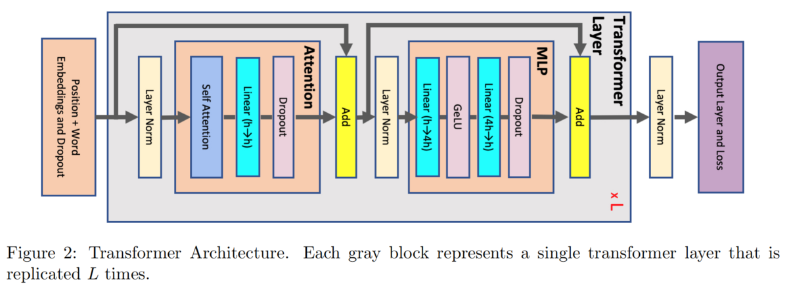
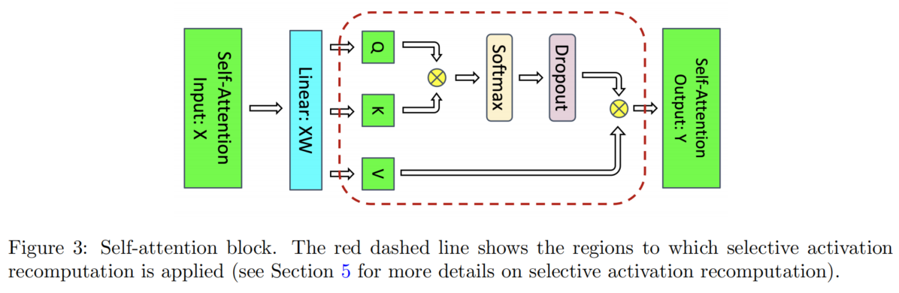
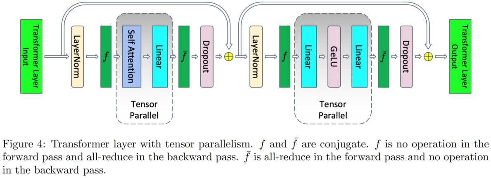
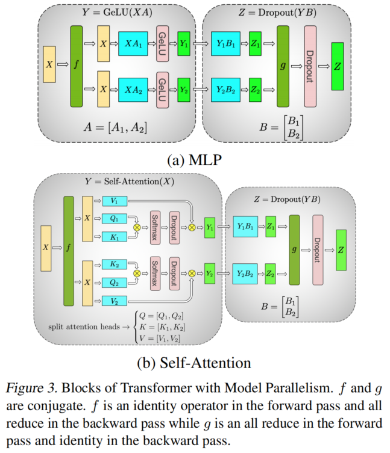

原始论文 [Reducing Activation Recomputation in Large Transformer Models](https://arxiv.org/abs/2205.05198)

# 序列并行

序列并行是在张量并行的基础上进行的进一步深度优化，旨在减少“中间值”带来的显存占用(“中间值”是反向传播所必需的。如果不保存这些中间值，在反向传播过程中就必须重新执行前向计算来生成它们，这会显著增加训练的时间开销)。[^1](一些文章把“中间值”称为“激活(activations)”，但是我感觉这种称呼容易造成歧义。。)

关于 Transformer 各层的显存占用分析，请参考我的文章：

* [Transformer 模型 GPU 显存分析（三）：反向传播需要保存哪些中间结果？](https://my-webpage-adu.pages.dev/admin/#/collections/posts/entries/%E5%A4%A7%E6%A8%A1%E5%9E%8B%E6%98%BE%E5%AD%98%E5%92%8Cflops%E5%88%86%E6%9E%90/transformer%E6%A8%A1%E5%9E%8B%E7%9A%84gpu%E6%98%BE%E5%AD%98%E4%BD%BF%E7%94%A8%E5%88%86%E6%9E%90%EF%BC%88%E4%B8%89%EF%BC%89%EF%BC%9A%E5%8F%8D%E5%90%91%E4%BC%A0%E6%92%AD%E5%88%B0%E5%BA%95%E9%9C%80%E8%A6%81%E5%93%AA%E4%BA%9B%E4%B8%AD%E9%97%B4%E7%BB%93%E6%9E%9C/index)

关于张量并行，请参考我的文章：

* [Tensor Parallelism张量并行（一）](https://my-webpage-adu.pages.dev/posts/mode-parallelism/tensor-parallelism%E5%BC%A0%E9%87%8F%E5%B9%B6%E8%A1%8C%EF%BC%88%E4%B8%80%EF%BC%89/)
* [Tensor Parallelism张量并行（二）](https://my-webpage-adu.pages.dev/posts/mode-parallelism/tensor-parallelism%E5%BC%A0%E9%87%8F%E5%B9%B6%E8%A1%8C%EF%BC%88%E4%BA%8C%EF%BC%89/)
* [Tensor Parallelism张量并行（三）](https://my-webpage-adu.pages.dev/posts/mode-parallelism/tensor-parallelism%E5%BC%A0%E9%87%8F%E5%B9%B6%E8%A1%8C%EF%BC%88%E4%B8%89%EF%BC%89/)

# “中间值”显存占用分析

## 符号约定

| 符号  | 含义                           | 符号  | 含义                     |
| --- | ---------------------------- | --- | ---------------------- |
| $a$ | number of attention heads    | $p$ | pipeline parallel size |
| $b$ | microbatch size              | $s$ | sequence length        |
| $h$ | hidden dimension size        | $t$ | tensor parallel size   |
| $L$ | number of transformer layers | $v$ | vocabulary size        |

## 未采用并行机制的 Transformer 架构

架构如下图，我们主要关注图中灰色部分的 `Transformer Layer`，因为它会重复 $L$ 层，占显存开销的大头。

假设采用 FP16 / BF16 精度，下面我们对中间值的显存占用进行拆解分析。

### Attention Block

| 中间值                          | 大小       |
| ---------------------------- | -------- |
| Q/K/V projection 共享输入        | $2sbh$   |
| $QK^\top$ 需要存 Q 和 K          | $4sbh$   |
| Softmax 输出                   | $2as^2b$ |
| Softmax dropout mask         | $as^2b$  |
| Attention over V: dropout 输出 | $2as^2b$ |
| V          | $2sbh$   |
| Output linear projection 输入  | $2sbh$   |
| Attention dropout mask       | $sbh$    |

中间值合计占用：

$$
 \text{Attention} = 11sbh + 5as^2b 
$$

### MLP Block

| 项                | 大小     |
| ---------------- | ------ |
| 第一个 linear 输入    | $2sbh$ |
| 第二个 linear 输入    | $8sbh$ |
| GeLU 输入          | $8sbh$ |
| MLP dropout mask | $sbh$  |

中间值合计占用：

$$
 \text{MLP} = 11sbh + 5as^2b 
$$

### LayerNorm

两个 LayerNorm，每个存输入 $2sbh$，所以

$$
\text{LayerNorms}=4sbh
$$

### 合计

$$
\text{Total}=sbh(34+\frac{5as}{h})
$$

## 采用张量并行机制的 Transformer 架构

采用张量并行机制的 Transformer 架构如下图：

引入张量并行度为 $t$，进行中间值占用的显存分析：

### Attention Block
| 项 | 原大小 | Tensor Parallel 后 |
|---|---:|---:|
| Q/K/V projection 共享输入 | $2sbh$ | 不切，仍是 $2sbh$ |
| $QK^\top$ 需要存 Q 和 K | $4sbh$ | 切，变成 $\frac{4sbh}{t}$ |
| Softmax 输出                   | $2as^2b$ | 切，变成 $\frac{2as^2b}{t}$ |
| Softmax dropout mask         | $as^2b$  | 切，变成 $\frac{as^2b}{t}$ |
| Attention over V: dropout 输出 | $2as^2b$ | 切，变成 $\frac{2as^2b}{t}$ |
| $V$ | $2sbh$ | 切，变成 $\frac{2sbh}{t}$ |
| Output linear projection 输入 | $2sbh$ | 切，变成 $\frac{2sbh}{t}$ |
| Attention dropout mask | $sbh$ | 不切，仍是 $sbh$ |

因此 attention 部分变成：

$$
\text{Attention} = 3sbh + \frac{8sbh}{t} + \frac{5as^2b}{t}
$$

### MLP Block

| 项                | 原大小     | Tensor Parallel 后|
| ---------------- | ------ | ------ |
| 第一个 linear 输入    | $2sbh$ | 不切，仍是 $2sbh$  |
| 第二个 linear 输入    | $8sbh$ | 切，变成 $\frac{8sbh}{t}$ |
| GeLU 输入          | $8sbh$ | 切，变成 $\frac{8sbh}{t}$ |
| MLP dropout mask | $sbh$  | 不切，仍是 $sbh$ |

因此 MLP 部分变成：

$$
\text{MLP}=3sbh+\frac{16sbh}{t}
$$

### LayerNorm

张量并行未应用到 LayerNorm，故存储的中间值不变，即两个 LayerNorm，每个存输入 $2sbh$：

$$
\text{LayerNorms}=4sbh
$$

### 合计

$$
\text{Total}=sbh(10+\frac{24}{t}+\frac{5as}{ht})
$$

## 采用序列并行 + 张量并行的 Transformer 架构

序列并行进一步将公式中的 $10sbh$ 进行并行化。

