## Data Parallelism (DP)

数据并行（Data Parallelism, DP）可以分为以下三种形式：

1. [Single Data Parallelism](#single-data-parallelism)
2. [Distributed Data Parallelism (DDP)](#distributed-data-parallelism-ddp)
3. [ZeRO Data Parallelism (ZeRO-DP)](#zero-data-parallelism)

这三种方法的共同思想是：将一个非常大的输入数据切分成若干份，并在多个 GPU 上并行完成前向传播和反向传播。

对于参数效率[^1]极高的模型，数据并行尤为有效，比如 CNNs。

<u>ShallowSpeed</u>[^2] 通过 python + MPI 实现了简单的数据并行。

### Naive Data Parallelism

### 整体架构

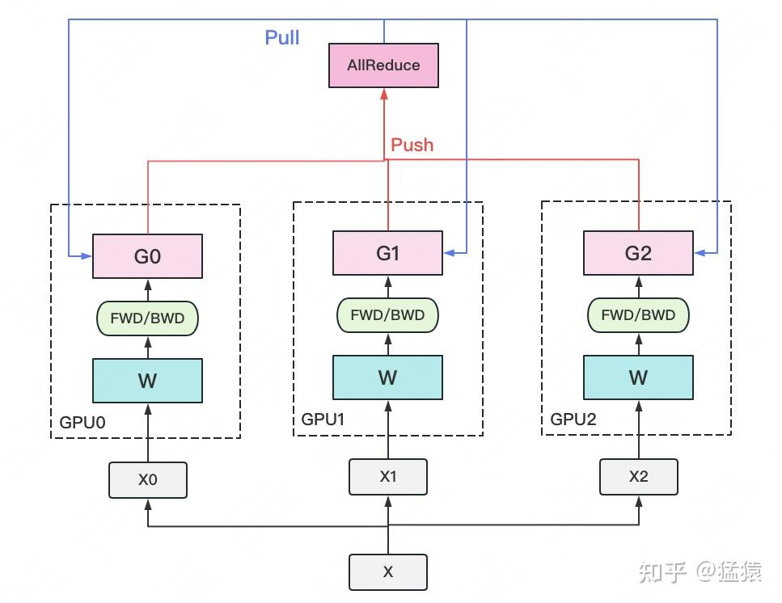

一个经典的数据并行流程如下：

- 有若干块用于计算的 GPU，例如图中的 GPU 0 ~ GPU 2。
- 还有 1 块用于梯度收集的 GPU，即执行 All-Reduce 的 GPU。
- 每块计算 GPU 上都会拷贝一份完整的模型参数。
- 将一份数据 $X$（例如一个 batch）均匀分配到不同的计算 GPU 上。
- 每块计算 GPU 完成一轮前向传播（FWD）和反向传播（BWD）后，得到各自的梯度 $G$。
- 每块计算 GPU 将自己的梯度发送到梯度收集 GPU，由其进行聚合。这里的聚合通常指梯度累加，当然也可以支持用户自定义逻辑。
- 梯度收集 GPU 完成聚合后，再将完整的梯度结果下发给各个计算 GPU，用于更新模型参数 $W$。更新完成后，各个计算 GPU 上的模型参数仍然保持一致。
- 这种“先聚合、再下发”的梯度通信过程，就称为 **All-Reduce**。

实现 DP 的一种经典编程框架叫做 **参数服务器（Parameter Server）**。在这个框架中：

- 计算 GPU 称为 **Worker**
- 梯度聚合 GPU 称为 **Server**

在实际应用中，为了尽量减少通信开销，通常会选择某一个 Worker 同时充当 Server。比如，可以把所有梯度都发送到 GPU 0 上进行聚合。这里还需要补充两点：

1. 一个 Worker 或 Server 下可以包含不止 1 块 GPU。
2. Server 不仅可以只做梯度聚合，也可以同时负责 **梯度聚合 + 全量参数更新**。下图展示了这种过程：

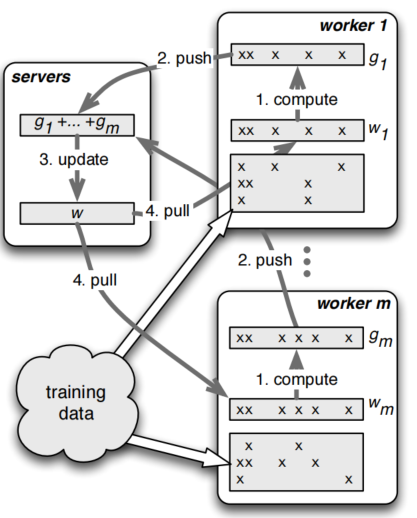

在参数服务器的语境下，DP 的流程也可以表示为下图所示的形式：

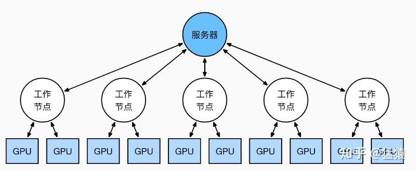

### 缺陷

Single Data Parallelism 的主要问题有三个：

- **存储开销大**：每块 GPU 上都保存了一份完整模型，造成显存冗余。这个问题将在后文的 ZeRO 部分进一步优化。
- **通信开销大**：Server 需要与每个 Worker 进行梯度传输。当 Server 和 Worker 不在同一台机器上时，Server 的带宽会成为整个系统的瓶颈。这个问题将在后文 [DDP](#distributed-data-parallelism-ddp) 部分说明。
- **同步开销大**：当 Server 正在搬运数据、计算梯度时，Workers 往往处于空闲状态。为了解决这一问题，后来提出了梯度异步更新机制，可参考[知乎](https://zhuanlan.zhihu.com/p/617133971)和[论文](https://www.usenix.org/conference/osdi14/technical-sessions/presentation/li_mu)。本文不展开讨论。

### Distributed Data Parallelism (DDP)

受通信负载不均衡的影响，简单的 DP 通常只适用于单机多卡场景。为了适配更通用的训练环境，DDP 被提出出来，它既支持多机，也支持单机。

DDP 首先要解决的是通信问题：将原本集中在 Server 上的通信压力，均匀分摊到各个 Worker 上。完成这一步之后，就可以进一步去掉 Server，仅保留 Worker。

在 [Interconnect](../../interconnect/) 一节中提到，Ring-All-Reduce 的通信时间仅为中心化节点方案的 $1/(k-1)$，其中 $k$ 是 GPU 数量。

前文提到，聚合梯度并下发梯度这一轮操作称为 **All-Reduce**。DDP 的核心就是使用 **Ring-All-Reduce** 来替代 DP 中中心化的梯度更新流程（或者连同参数更新一起替代），从而显著降低通信时间。

### ZeRO Data Parallelism

### 存储分类

ZeRO 的本质，是在数据并行的基础上，对冗余空间进行深度优化。

大模型训练中的显存占用可以分为两类：

1. **Model States**：与模型本身直接相关、必须保存的内容，包括：
   - **Optimizer States**：优化器在进行梯度更新时所需要的数据。例如 Adam 需要额外保存状态信息，如梯度的一阶动量和二阶动量。
   - **Model Parameters**：显存中的模型权重和偏置项。
   - **Gradients**：反向传播过程中计算得到的梯度，用于更新模型参数。

2. **Residual States**：并非模型必须，但在训练过程中会额外产生的内容，包括：
   - **Activations**：有了它可以更快地计算梯度，但它并不是必须长期保存的，因为可以通过重新执行 Forward Pass 来重算。
   - **Temporary Buffers**：例如把梯度发送到某块 GPU 上进行聚合时产生的临时缓存。
   - **Unusable Fragment Memory**：虽然总显存足够，但如果无法申请到连续的内存空间，相关请求也会失败。这类碎片化浪费可以通过内存整理来缓解。

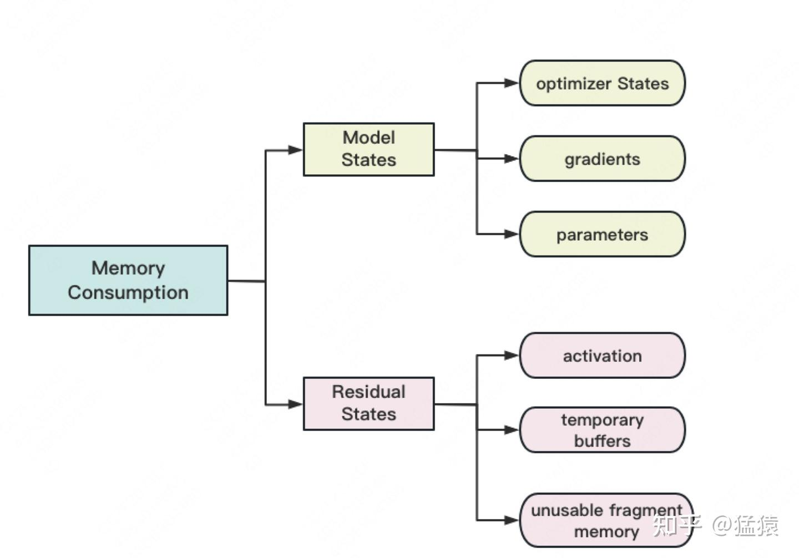

### 混合精度训练

对于模型参数，我们通常希望尽可能精确，因此会使用 FP32（单精度浮点数，4 byte）来表示参数 $W$。但在 forward 和 backward 过程中，FP32 的计算开销也非常大。

因此，人们引入了 FP16 或 BF16（半精度浮点数，2 byte）来降低计算压力，这就形成了 **混合精度训练**。

其基本流程如下图所示：

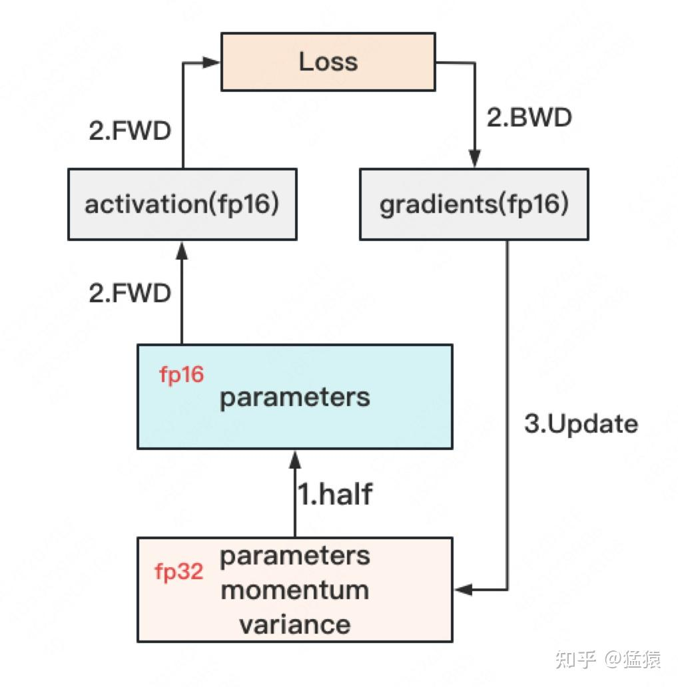

你可能会问：如果还要保留 FP32 的参数、Momentum 和 Variance，那为什么显存还能减少？

原因是：这些 FP32 状态通常会被 offload 到 CPU 内存中，只在需要时再加载到 GPU 上，因此 GPU 显存占用会明显降低。

### ZeRO 的整体思路

[微软官方介绍](https://www.microsoft.com/en-us/research/blog/zero-deepspeed-new-system-optimizations-enable-training-models-with-over-100-billion-parameters/)

[相关博客](https://www.cnblogs.com/whiteBear/p/18341975)

在传统数据并行下，每个进程都会持有一份相同的模型参数和优化器状态，显存开销非常大。以混合精度场景下、参数量为 $\Psi$ 的模型和 Adam Optimizer 为例，Adam 需要保存：

- **FP16 参数和梯度备份**：分别占用 $2\Psi$ 和 $2\Psi$ 字节。
- **FP32 参数、Momentum、Variance 备份**：对应 3 份 $4\Psi$ 字节。

因此，总显存开销约为：

$$
2\Psi + 2\Psi + 3 \times 4\Psi = 16\Psi \text{ Bytes}
$$

也就是说，一个 7.5B 参数的模型，至少需要约 120GB 显存才能装下这些 Model States。  
在数据并行场景下，这些重复的 Model States 会在 $N$ 个 GPU 上复制 $N$ 份，显存浪费非常明显。

ZeRO 则在数据并行的基础上，对冗余的 Model States 进行切分优化。使用 ZeRO 后，各个进程只保存完整状态的 $1/\text{GPUs}$，彼此之间不重叠，因此不再存在大量重复存储。

下面以 7.5B 参数模型为例，量化 ZeRO 各级别的内存优化效果。

### ZeRO 的三个级别

相比传统数据并行中的简单复制，ZeRO 通过将模型的 **参数（Parameters）**、**梯度（Gradients）** 和 **优化器状态（Optimizer States）** 分散到不同进程中，消除冗余显存占用。

ZeRO 一共有三个级别，分别对应 Model States 不同程度的分割（Partition）：

- **ZeRO-1**：分割 Optimizer States
- **ZeRO-2**：分割 Optimizer States 和 Gradients
- **ZeRO-3**：分割 Optimizer States、Gradients 和 Parameters

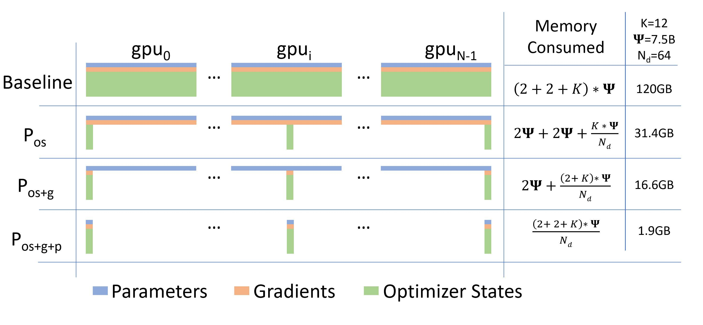

其中：

- $K$ 表示优化器状态占用的字节数，不同优化器对应的 $K$ 不同。
- $N_d$ 表示 GPU 数量。

### ZeRO-1

在模型训练中，正向传播和反向传播并不会使用优化器状态，只有在梯度更新时，才会利用梯度和优化器状态计算新的参数。

因此，ZeRO-1 的核心思想是：让每个进程只保存一部分优化器状态，并在各自完成参数更新后，再将结果合并成完整模型。

假设有 $N_d$ 个并行进程，ZeRO-1 会将完整的优化器状态平均切分为 $N_d$ 份，分别存储在不同进程中。  
当反向传播完成后，每个进程只对自己持有的那一部分优化器状态进行更新，包括 Momentum、Variance 以及 FP32 Master Parameters。

通过 ZeRO-1 对优化器状态进行分段存储，7.5B 参数模型的内存占用可以从原始数据并行下的 120GB 降到 31.4GB。

### ZeRO-2

在第二阶段中，梯度也被拆分了。

通过 ZeRO-2 对梯度和优化器状态进行分段存储，7.5B 参数模型的内存占用可以进一步从 ZeRO-1 的 31.4GB 降到 16.6GB。

### ZeRO-3

第三阶段进一步将 **模型参数** 也拆分掉。

在 ZeRO-3 中，模型的每一层都会被切片，每个进程只存储权重张量的一部分。在前向传播和反向传播过程中，各进程根据需要交换自己持有的部分参数，并计算激活值和梯度。

### 全过程展示

<!-- Markdown 内部无法拖动进度条，建议直接观看下面的视频。

<video width="640" height="360" controls>
  <source src="./video/Turing-Animation.mp4" type="video/mp4">
  原视频：https://www.microsoft.com/en-us/research/blog/zero-deepspeed-new-system-optimizations-enable-training-models-with-over-100-billion-parameters/
</video> -->

  <video controls style="position: absolute; top: 0; left: 0; width: 100%; height: 100%;">
    <source src="./video/Turing-Animation.mp4" type="video/mp4">
    您的浏览器不支持 video 标签。原视频：<a href="https://www.microsoft.com/en-us/research/blog/zero-deepspeed-new-system-optimizations-enable-training-models-with-over-100-billion-parameters/">Microsoft Research</a>
  </video>

### 图解

1. 首先我们有一个 16 个 Transformer 块构成的模型，每一个块都是一个 Transformer 块。

    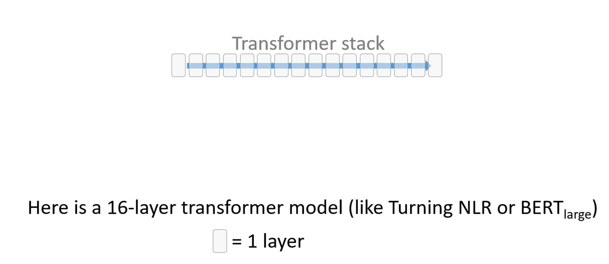

2. 有一个很大的数据集和 4 个 GPU

    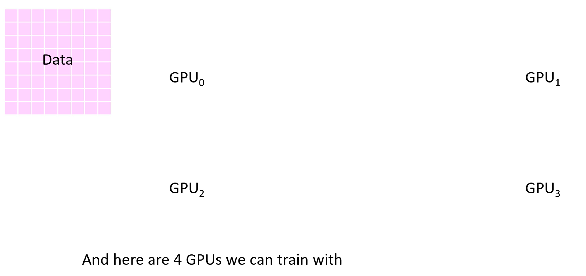

3. 使用 3 -stage 策略，将 OPG 和数据都进行拆分放在 4 张卡上

    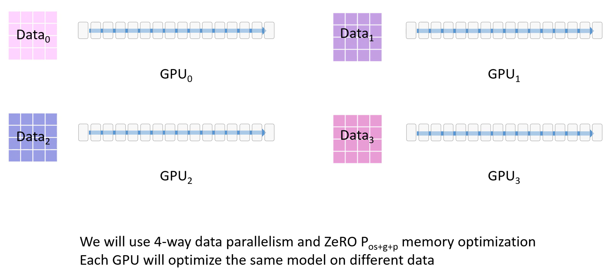

4. 每个模块下的格子代表模块占用的显存。

    第一行是 FP16 版本的模型权重参数

    第二行是 FP16 的梯度，用来反向传播时更新权重，

    剩下的大部分绿色部分是优化器使用的显存部分，包含（FP32 梯度，FP32 方差，FP32 动量，FP32 参数），它只有在 FP16 梯度计算后才会被使用。

    ZeRO 3 使用了混合精度，因此前向传播中使用了半精度的参数。

    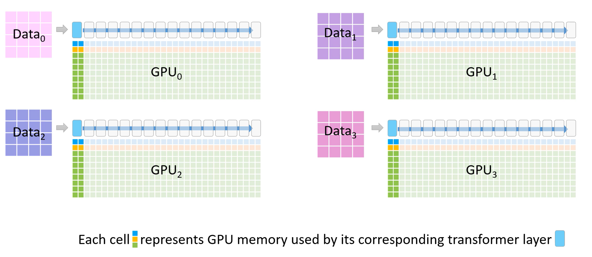

5. 每个模块还需要一部分空间用于存放激活值，也就是上面蓝色的部分。

    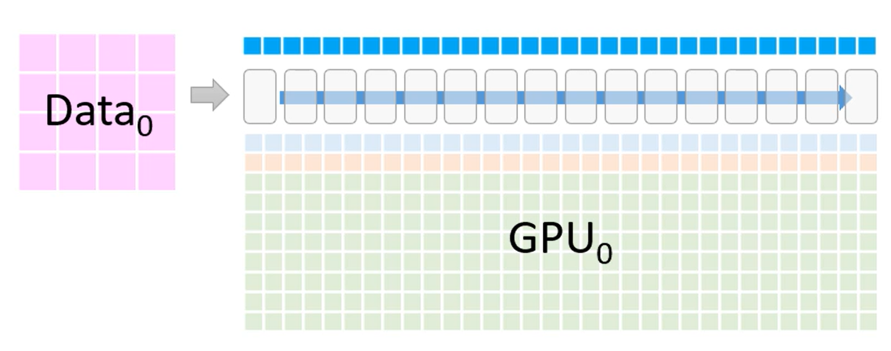

6. 每个 GPU 都会负责模型的一部分，也就是图中的 $M_0 - M_3$

    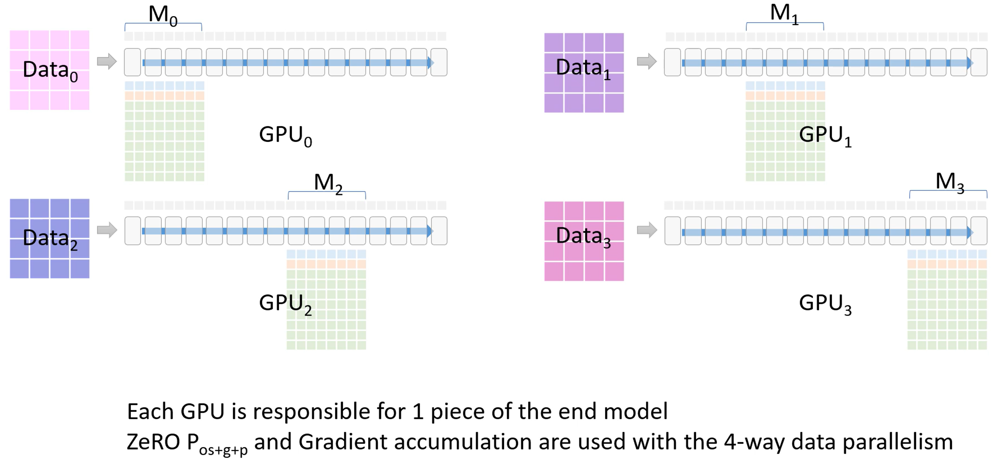

7. 现在进入 ZeRO -3 的一个分布式训练流程:

    - 首先，GPU_0 将自身已经有的模型部分权重 $M_0$ 通过 broadcast 发送到其他 GPU。

    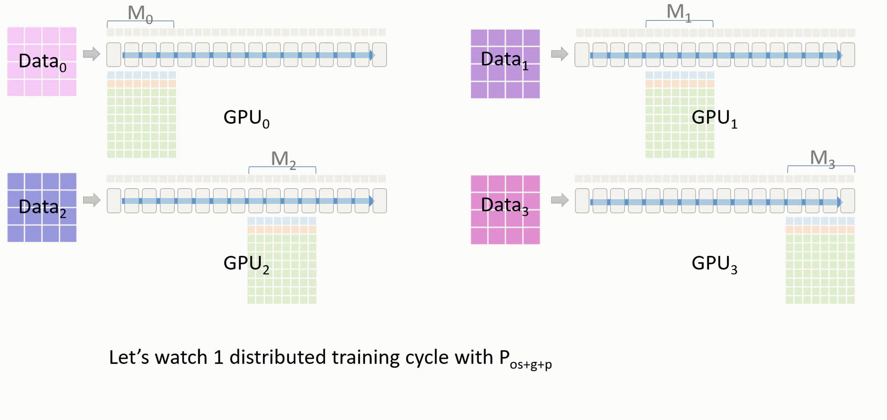

    - 当所有 GPU 都有了权重 $W_0$ 后，除了 GPU_0 以外的 GPU 会将它们存储在一个临时缓存中

    - 进行前向传播，每个 GPU 都会使用 $M_0$ 的参数在自己的进程的数据上进行前向传播，只有每个层的激活值会被保留

    - $M_0$ 计算完成后，其他 GPU 删除这部分的模型参数

    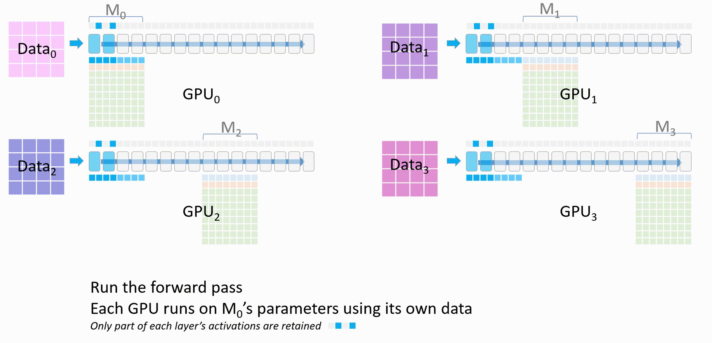

    - 接下来，GPU_1 将自己的模型权重 $M_1$ 广播发送到其他 GPU。所有 GPU 上使用 $M_1$ 进行前向传播

    - $M_1$ 计算完成后，其他 GPU 删除这部分的模型参数。

    - 以此类推，将每个 GPU 上的各自的模型权重都训练完。

    - 前向传播结束后，每个 GPU 都根据自己数据集计算一个损失

    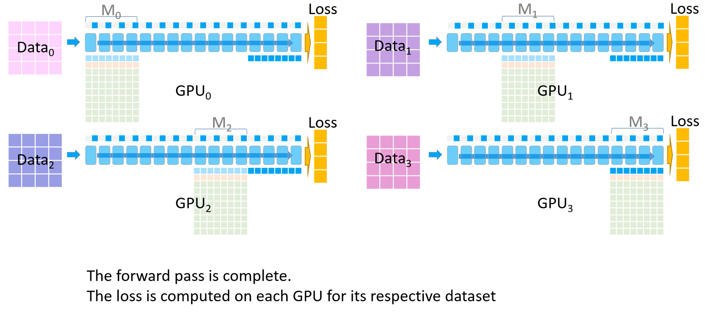

    - 开始反向传播。首先所有 GPU 都会拿到最后一个模型分块(也就是 $M_3$ )的损失。反向传播会在这块模型上进行，$M_3$ 的激活值会从保存好的激活值上进行计算。

    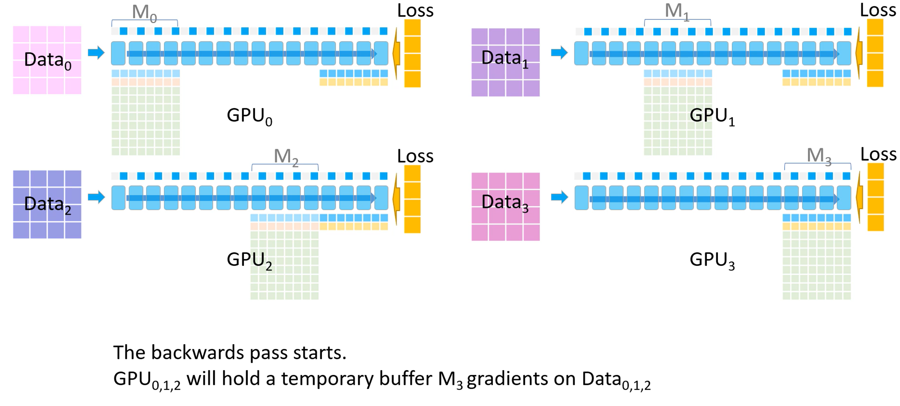

    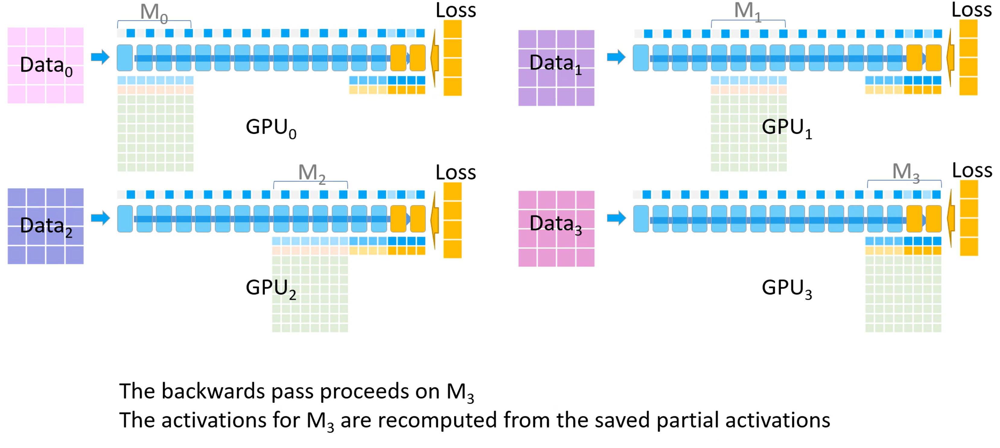

    - 其他 GPU 将自己计算的 $M_3$ 的梯度发送给 GPU_3 进行梯度累积，最后在 GPU_3 上更新并保存最终的 $M_3$ 权重参数。

    备注：梯度累积，将几个小批次的数据的梯度累积，累加够一个大批次后更新模型权重。

    

    - 其他 GPU 删除临时存储的 $M_3$ 权重参数和梯度，所有 GPU 都删除 $M_3$ 的激活值

    - GPU_2 发送 $M_2$ 参数到其他 GPU，以便它们进行反向传播并计算梯度

    - 以此类推，直到每个 GPU 上自己部分的模型参数更新完。

    - 现在每个 GPU 都有自己的梯度了，开始计算参数更新

    - 优化器部分在每个 GPU 上开始并行

    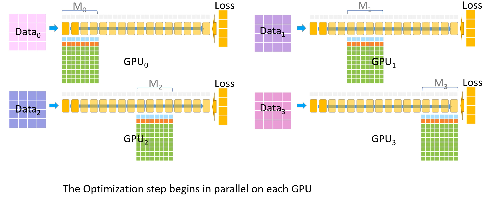

    - 优化器会生成 FP32 精度的模型权重，然后转换至 FP16 精度

    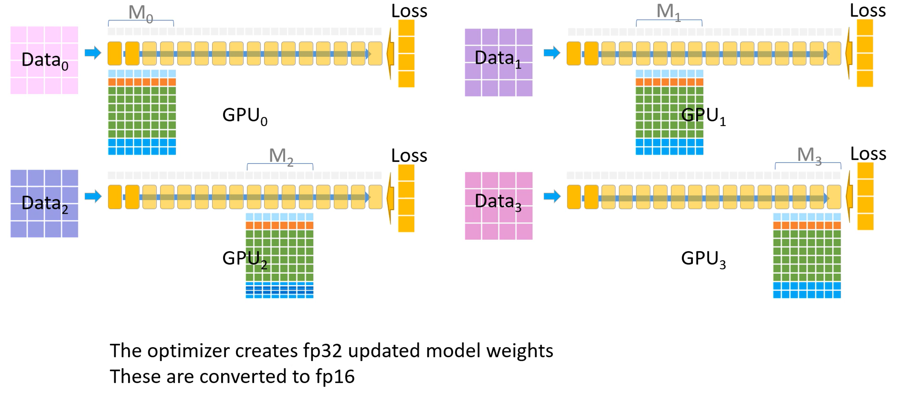

    - FP16 精度的权重成为了下一个迭代开始时的模型参数，至此一个训练迭代完成

[^1]: "参数效率（parameter efficient）为模型单次前向传播中浮点操作数（FLOPs）与参数量的比值，越大代表模型的计算密度越高

[^2]: https://github.com/siboehm/shallowspeed
