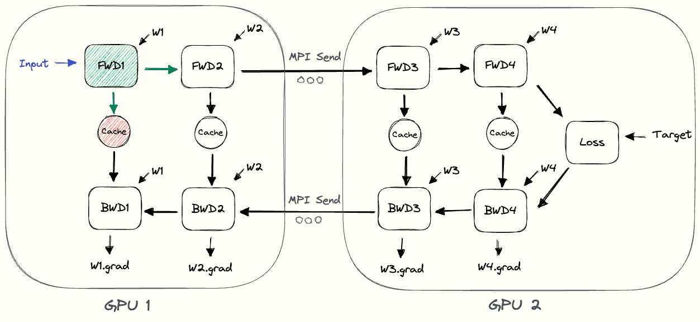
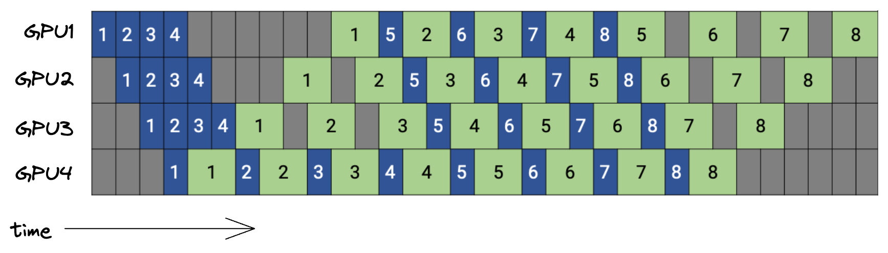
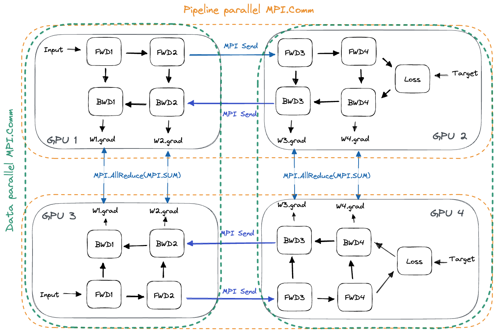
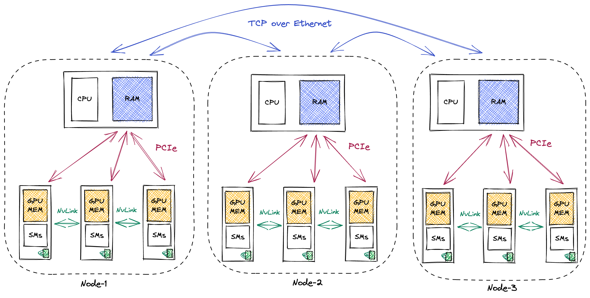
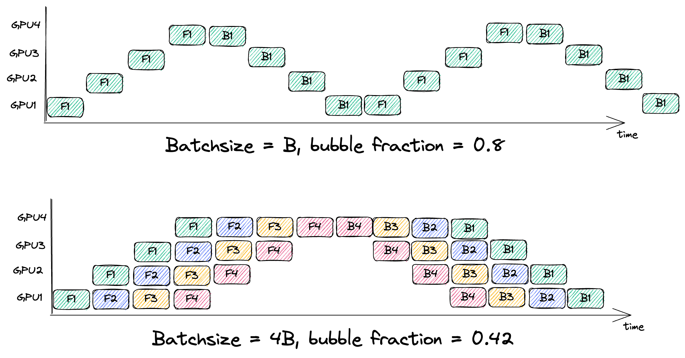
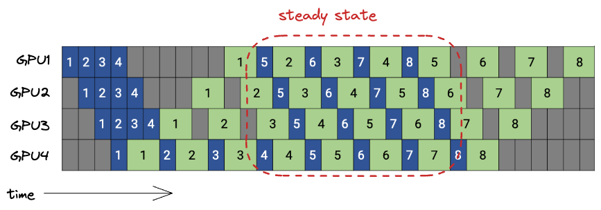
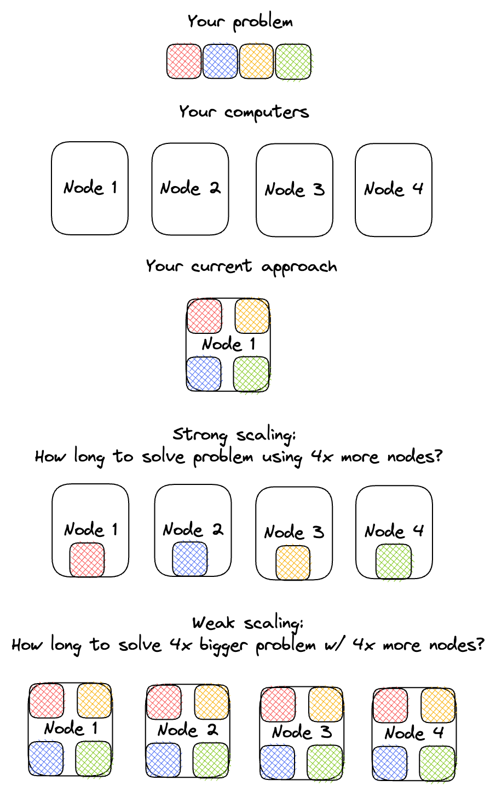

[Pipeline-Parallelism: Distributed Training via Model Partitioning](https://siboehm.com/articles/22/pipeline-parallel-training) 的中文翻译版本。


## Pipeline-Parallelism: Distributed Training via Model Partitioning

流水线并行（Pipeline Parallelism）使得训练那些无法放入单个 GPU 显存的大模型成为可能。[^1] 其实现原理是将模型的不同层分配到不同的 GPU 上，这个过程称为模型划分（Model Partitioning）。如果采用朴素的方式实现，模型划分会导致 GPU 利用率较低。在这篇文章中，我们首先会讨论朴素流水线并行的实现方式及其存在的一些问题。然后，我们会介绍 GPipe 和 PipeDream，这两个较新的算法能够缓解朴素流水线并行中的部分问题。


本文是我关于大规模深度学习模型分布式训练系列文章的第二部分。第一部分涵盖了数据并行训练，可以在[此处](../data-parallelism-2/)找到。

## 朴素模型并行

朴素模型并行是实现流水线并行训练最直接的方法。我们将模型拆分成多个部分，把每个部分分配到不同的 GPU 上。然后在各个小批次上运行常规训练，并在模型被切分的边界处插入通信步骤。

以这个 4 层的顺序模型为例：

$$output = L_4(L_3(L_2(L_1(input))))$$

我们把计算分配到两个 GPU 上，具体如下：

- **GPU1** 计算：  
  $$\text{intermediate} = L_2(L_1(\text{input}))$$  
  
- **GPU2** 计算：  
  $$output = L_4(L_3(\text{intermediate}))$$

要完成一次前向传播，我们首先在 GPU1 上计算出 $intermediate$，然后把得到的张量传给 GPU2。GPU2 接着计算出模型的输出，并开始反向传播。在反向传播过程中，我们将关于 $intermediate$ 的梯度从 GPU2 发送回 GPU1。然后 GPU1 根据收到的梯度完成剩余的反向传播。这样一来，模型并行训练得到的输出和梯度与单节点训练是完全相同的。[^2]


下图中的 pebble 图[^3] 展示了朴素模型并行的过程。GPU1 执行其前向计算，并缓存激活值（图中红色部分）。然后它通过 MPI 将 $L_2$ 的输出发送给下一个 GPU，即 GPU2。GPU2 完成前向计算，根据目标值计算损失，然后开始反向传播。GPU2 完成后，关于 $L_2$ 输出的梯度被发送给 GPU1，由 GPU1 完成剩下的反向传播。请注意，这里只使用了节点到节点的通信（`MPI.Send` 和 `MPI.Recv`），并不需要任何集合通信原语（因此不会像数据并行那样用到 `MPI.AllReduce`）。




通过观察 pebble 图，我们可以发现朴素模型并行存在的一些低效问题。

1. **GPU 利用率低**：在任何给定时刻，只有一块 GPU 在工作，而其他 GPU 处于空闲状态。如果我们增加更多 GPU，每块 GPU 的忙碌时间只占总时间的 $\frac{1}{\\#\mathrm{GPUs}}$（忽略通信开销）。低利用率意味着我们或许可以通过让空闲的 GPU 执行有用的计算来加速训练。

2. **计算与通信无法重叠**：当通过网络发送中间输出（前向）和梯度（反向）时，所有 GPU 都没有执行任何计算。在讨论数据并行时我们已经看到，计算与通信的重叠能带来巨大的收益。

3. **内存需求高**：GPU1 会一直缓存整个小批次的所有激活值，直到训练结束。如果批次大小较大，这会造成内存问题。后面我们会讨论如何结合数据并行与流水线并行来解决这个问题，但同时也有其他方法可以减少内存需求。

现在让我们来看看如何缓解朴素模型并行的这些低效问题。首先要介绍的是 GPipe 算法，与朴素模型并行算法相比，它能够实现高得多的 GPU 利用率。

## GPipe 算法：将小批次拆分为微批次

GPipe 通过将每个小批次（minibatch）进一步拆分成更小的、大小相等的微批次（microbatch）来提高效率。  
然后我们可以独立地对每个微批次进行前向和反向传播。[^4] 如果我们将每个微批次的梯度累加起来，就能得到整个批次的梯度。[^5] 这个过程称为**梯度累加**（gradient accumulation）。由于每一层只存在于一块 GPU 上，因此微批次梯度的累加可以在本地执行，无需任何通信。[^6]


考虑一个模型被划分到 4 块 GPU 上的情况。[^7] 对于朴素流水线并行，其调度结果如下所示：


<div style="overflow-x: auto;">

| 时间步 | 0   | 1   | 2   | 3   | 4   | 5   | 6   | 7   |
|---|---|---|---|---|---|---|---|---|
| GPU3  |     |     |     | FWD | BWD |     |     |     |
| GPU2  |     |     | FWD |     |     | BWD |     |     |
| GPU1  |     | FWD |     |     |     |     | BWD |     |
| GPU0  | FWD |     |     |     |     |     |     | BWD |

</div>

如前所述，在任何给定时刻，只有一块 GPU 处于忙碌状态。而且，这些时间步中的每一个都会耗时相当长，因为 GPU 需要针对整个小批次运行一次前向传播。

使用 GPipe 后，我们将小批次拆分成微批次，假设拆分成 4 个微批次。

<div style="overflow-x: auto;">

| 时间步 | 0   | 1   | 2   | 3   | 4   | 5   | 6   | 7   | 8   | 9   | 10  | 11  | 12  | 13  |
|---|---|---|---|---|---|---|---|---|---|---|---|---|---|---|
| GPU3 |   |   |   | F1 | F2 | F3 | F4 | B4 | B3 | B2 | B1 |   |   |   |
| GPU2 |   |   | F1 | F2 | F3 | F4 |   |   | B4 | B3 | B2 | B1 |   |   |
| GPU1 |   | F1 | F2 | F3 | F4 |   |   |   |   | B4 | B3 | B2 | B1 |   |
| GPU0 | F1 | F2 | F3 | F4 |   |   |   |   |   |   | B4 | B3 | B2 | B1 |

</div>

这里 F1 表示使用当前 GPU 上存储的层划分，对微批次 1 执行前向传播。重要的是，GPipe 调度中的每个时间步会比朴素模型并行调度中的每个时间步更短，因为在 GPipe 中，一块 GPU 每次只处理一个小批次的四分之一数据。[^8]

总体而言，GPipe 及其微批次方案相比朴素流水线并行有了很大的改进，因为现在可以有多块 GPU 同时执行有用的计算。接下来我们看看 GPipe 仍然存在的一些低效问题，以及如何解决它们：通信与计算的重叠、流水线气泡（pipeline bubble）以及内存需求。


## GPipe：计算与通信的重叠

遗憾的是，如果每个 GPU 上前向和反向传播所需的时间相同，那么能够实现通信与计算重叠的机会并不多。从上文的调度表中可以看出这一点，因为每个 GPU 必须等到前一个 GPU 处理完同一个微批次之后，才能开始处理该微批次。如果所有阶段的计算时间都相同，那么通信和计算仍然会处于不同的时间段。

提出 GPipe 的原始论文并未涉及这个问题，但一个可选方案是将每个小批次拆分成两半。这样，我们可以将前半部分的通信与后半部分的计算进行重叠。这种做法在实际中是否合理，将取决于内核计算时间和网络通信时间。

下面是一个重叠版本的 GPipe 示意：


箭头展示了第一个微批次中前半部分计算的依赖关系。

接下来我们来看 GPipe 的主要低效问题：流水线气泡的大小。

## GPipe：流水线气泡

气泡（Bubble）指的是流水线中没有执行任何有用计算的时间段。它们是由操作之间的依赖关系引起的。例如，GPU4 必须等到 GPU3 执行完 `F1` 并传输结果之后，才能执行 `F1`。


气泡所浪费的时间比例取决于流水线深度 `n` 和微批次数量 `m`：[^9]


$$1 - \frac{2nm}{2n(m+n-1)} = 1 - \frac{m}{m+n-1}$$

因此，要使气泡占比变小，必须增大每个小批次的大小，从而增加微批次数量 $m$。[^10]较大的小批次规模需要谨慎地进行学习率缩放，[^11] 并且会增加缓存激活值的内存需求，接下来我们就会讨论这一点。


## GPipe：内存需求

增大批次规模会使缓存的激活值所需的内存需求线性增加。[^12] 在 GPipe 中，我们需要从每个微批次执行前向传播开始，到对应的反向传播结束为止，一直缓存其激活值。以 GPU0 为例，看上文的调度表，微批次1的激活值从时间步0一直保留在内存中，直到时间步13。


在 GPipe 论文中，作者利用梯度检查点（gradient checkpointing）[^13] 来降低内存需求。在梯度检查点中，我们不再缓存计算梯度所需的全部激活值，而是在反向传播过程中按需重新计算这些激活值。这降低了内存需求，但增加了计算开销。


假设所有层的大小大致相同。每个 GPU 上缓存激活值所需的内存需求为：

$$O(\text{batchsize} \cdot \frac{\\#\text{total layers}}{\\#\text{GPUs}})$$

[^14] 相反，我们可以采用梯度检查点，只缓存在层边界上的输入（即缓存从上一个 GPU 发送给我们的张量）。这样可以将每个 GPU 的峰值内存需求降低到：


$$O(\text{batchsize} + \frac{\\#\text{total layers}}{\\#\text{GPUs}} \cdot \frac{\text{batchsize}}{\\#\text{microbatches}})$$

为什么呢？$O(\text{batchsize})$ 是缓存边界激活值所需的空间。当对某个微批次执行反向传播时，我们需要重新计算出计算该微批次梯度所必需的激活值。这需要为每个 GPU 上的 $O(\frac{\\#\text{total layers}}{\\#\text{GPUs}})$ 层中的每一层提供 $O(\frac{\text{batchsize}}{\\#\text{microbatches}})$ 的空间。下图展示了使用梯度检查点的 GPipe 的内存需求。图中显示了反向传播过程中的两个 GPU。GPU3 已经为微批次3重新计算了激活值，而 GPU4 已经为微批次2重新计算了激活值。在 GPU 边界处，整个批次的激活值会从前向传播开始一直缓存到反向传播结束。


接下来，我将介绍 PipeDream，这是一种不同的流水线并行训练算法。PipeDream 为我们提供了另一种降低微批次训练内存需求的方法，该方法与梯度检查点是正交的。

## PipeDream 算法：对不同微批次的前向和反向传播进行交错

PipeDream 一旦最后一个流水线阶段完成了某个微批次对应的前向传播，就会立即开始该微批次的反向传播。一旦我们执行完对应的反向传播，就可以丢弃缓存的第 $m$ 个微批次的激活值。在 PipeDream 中，反向传播的发生时间比 GPipe 更早，从而降低了内存需求。

下图展示了 PipeDream 的调度情况，使用 4 个 GPU 和 8 个微批次。[^15] 蓝色方框表示前向传播，并标有对应的微批次编号，而绿色方框表示反向传播。




我们来思考一下内存需求。对于 GPipe 和 PipeDream 两者而言，缓存激活值的内存需求（不使用梯度检查点）可以形式化为：

$$O(\\#\text{max microbatches in flight} \cdot \text{microbatch-size} \cdot \frac{\\#\text{total layers}}{\\#\text{GPUs}})$$

在上述 PipeDream 调度中，处于飞行状态[^16]的微批次数量最多等于流水线的深度。[^17][^18] 相比之下，在 GPipe 中，调度过程中的某个时刻所有微批次都处于飞行状态，这导致缓存激活值的内存需求更高。以上述例子为例，使用 PipeDream 时，我们最多有 4 个微批次处于飞行状态，而使用 GPipe 时则有 8 个微批次，[^19] 这使得缓存激活值的内存需求翻倍。

[^16]: 如果一个微批次已经开始或完成了前向传播，但它对应的反向传播尚未全部完成，那么这个微批次就处于”在处理中”（<em>in-flight</em>）的状态。

[^17]: <em>”流水线深度”</em>指的是一个微批次从进入流水线开始，到完成其所有梯度计算为止，所经过的流水线阶段数量。若每个阶段对应一张 GPU，那么它也等于该微批次沿模型维度经过的 GPU 数量。


在气泡占比方面，PipeDream 和 GPipe 之间没有区别。气泡是由微批次上操作之间的内在依赖关系造成的，PipeDream 并没有改变这种依赖关系。[^20]


PipeDream 的调度有很多变体，我不能说我全都理解了。上述调度被称为 1f1b，因为在稳定状态下，每个节点在前向传播和反向传播之间交替执行。请注意，上述调度仍然是顺序一致的（sequentially consistent）。

在 [PipeDream](https://arxiv.org/abs/1806.03377) 原始论文以及 [Megatron LM](https://arxiv.org/abs/2104.04473) 论文中，还有更多的变体。通过避免每个批次处理结束时的流水线刷新（pipeline flush）[^21]，可以降低气泡占比，从而提高效率。然而，这意味着算法不再具有顺序一致性，这可能会损害收敛速度。收敛速度变慢会迫使你训练更长的时间，因此非顺序一致的 PipeDream 调度实际上可能无助于减少训练时间和成本。我不确定非顺序一致版本的 PipeDream 因此被广泛使用到什么程度。


接下来，我们简要分析一下实现流水线并行所需的网络通信量。这个分析对于 GPipe 和 PipeDream 都是相同的。

## 流水线并行：通信量

为简单起见，假设模型只包含全连接层，且所有层的维度 $N$ 都相同。在前向传播过程中，每个 GPU 将发送和接收大小为 $\text{batchsize} \cdot N$ 的数据。反向传播过程同样如此，因此总的通信量为 $(\\#\text{GPUs} - 1) \cdot 2 \cdot \text{batchsize} \cdot N$ 个浮点数。[^22]


相比之下，在数据并行中，每个 GPU 需要对其所有层的梯度执行 AllReduce。在我们这个全连接模型的例子中，使用环形 AllReduce（Ring AllReduce），每个 GPU 需要传输大约 $2 \cdot \frac{\\#\text{layers} \cdot N^2}{\\#\text{GPUs}}$ 个浮点数。根据模型配置和训练设置的不同，数据并行可能具有更大的通信量。然而，正如我们所见，数据并行的通信可以较好地实现重叠，而流水线并行则无法做到这一点。

到目前为止，我们已经探讨了实现流水线并行的三种方式：朴素模型并行、GPipe 和 PipeDream。接下来，我将展示如何将流水线并行与数据并行结合起来，从而在不产生内存溢出问题的情况下使用更大的批次规模。

## 结合数据并行与流水线并行

数据并行和流水线并行是相互正交的，只要批次大小足够大，能够产生合理的微批次大小，两者就可以同时使用。

- 对于流水线并行，每个 GPU 需要与下一流水线阶段（在前向传播期间）以及上一流水线阶段（在反向传播期间）进行通信。
- 对于数据并行，每个 GPU 需要与分配了相同模型层的所有其他 GPU 进行通信。在流水线刷新之后，我们需要在所有层副本之间对梯度执行 AllReduce。[^23]


在实际实现中，流水线并行和数据并行的正交通信伙伴是通过 [MPI 通信器（MPI Communicators）](https://mpitutorial.com/tutorials/introduction-to-groups-and-communicators/)来实现的。通信器会在所有 GPU 中形成子组，并允许仅在子组内部执行集合通信。任意一个 GPU-X 将属于两个通信器：一个包含所有与 GPU-X 持有相同层切片的 GPU（数据并行），另一个包含持有 GPU-X 所在模型副本的其他层切片的 GPU（流水线并行）。如下图所示：



针对给定的 GPU 资源池，结合不同粒度的数据并行和流水线并行需要模块化的软件架构，接下来我将介绍这一点。

## 流水线并行：GPipe 的实现

下面的代码片段取自我在 [ShallowSpeed](https://github.com/siboehm/shallowspeed) 库中实现的数据并行和流水线并行代码。

与数据并行相反，流水线并行不需要集合通信，因此也不需要工作节点之间显式的同步。微软的 [DeepSpeed](https://github.com/microsoft/DeepSpeed) 库采用了一种软件设计，其中每个 GPU 包含一个独立的工作节点（worker），该工作节点按照调度给出的指令执行任务。DeepSpeed 的工作节点模型很有吸引力，因为调度是静态的。这意味着每个工作节点的调度在其启动时就已经计算完毕，然后在每个小批次中重复执行，训练过程中工作节点之间无需进行关于调度的通信。PyTorch 的[流水线设计](https://pytorch.org/docs/stable/pipeline.html)则大不相同，它使用队列在工作节点之间进行通信，工作节点之间相互转发任务。

在我 [ShallowSpeed](https://github.com/siboehm/shallowspeed) 库的 GPipe 实现中，我遵循了工作节点模型。

在开始处理一个小批次之前，我们首先将当前梯度清零。小批次处理完成后，我们通过优化器步骤更新权重。

```python
def minibatch_steps(self):
    yield [ZeroGrad()]

    # 阶段 1：首先，对所有微批次执行前向传播
    for microbatch_id in range(self.num_micro_batches):
        yield self.steps_FWD_microbatch(microbatch_id)

    # 此时，所有微批次都处于处理中状态，
    # 内存需求达到最高

    # 阶段 2：然后，对所有微批次执行反向传播
    for microbatch_id in reversed(range(self.num_micro_batches)):
        yield from self.steps_BWD_microbatch(microbatch_id)

    # 更新权重是处理任意一个批次的最后一步
    yield [OptimizerStep()]
```

该调度流程的各个步骤是通过 Python 生成器实现的。下面我们来看一下，对一个微批次执行前向传播需要哪些步骤：

```python
def steps_FWD_microbatch(self, microbatch_id):
    cmds = []
    if self.is_first_stage:
        # 第一个流水线阶段从磁盘加载数据
        cmds.append(LoadMicroBatchInput(microbatch_id=microbatch_id))
    else:
        # 其他流水线阶段从前一个流水线阶段接收激活值
        cmds.append(RecvActivations())

    cmds.append(Forward(microbatch_id=microbatch_id))

    if not self.is_last_stage:
        # 除最后一个流水线阶段外，其余阶段都会将输出发送给下一个阶段
        cmds.append(SendActivations())
    return cmds
```

我们会把微批次 ID 传给所有需要写入激活缓存的操作。这是因为，对于某个微批次 X，我们需要在该微批次 X 的反向传播过程中，取回它在前向传播时缓存下来的激活值。

最后，我们来看一下单个微批次执行反向传播时需要哪些步骤：

```python
def steps_BWD_microbatch(self, microbatch_id):
    cmds = []
    if self.is_last_stage:
        # 最后一个流水线阶段从磁盘加载目标数据
        cmds.append(LoadMicroBatchTarget(microbatch_id=microbatch_id))
    else:
        # 其他阶段等待接收来自后一个阶段的梯度
        cmds.append(RecvOutputGrad())

    # 第一个微批次是最后一个完成反向传播的微批次
    if self.is_first_microbatch(microbatch_id):
        # 在最后一个微批次的反向传播过程中，
        # 将反向传播与 AllReduce 交错执行
        cmds.append(BackwardGradAllReduce(microbatch_id=microbatch_id))
    else:
        cmds.append(BackwardGradAcc(microbatch_id=microbatch_id))

    if not self.is_first_stage:
        # 除第一个流水线阶段外，其余阶段都会将输入梯度发送给前一个阶段
        cmds.append(SendInputGrad())

    yield cmds
```

## 结论与总结

以上就是对流水线并行的介绍。流水线并行是一种训练那些无法放入单个 GPU 显存的大模型的方法，它通过将模型的各层划分到不同的 GPU 上来实现。在前向传播（发送激活值）和反向传播（发送梯度）过程中，我们在模型划分的边界处执行 GPU 之间的通信。我们看到，朴素模型并行存在 GPU 利用率低的问题。GPipe 通过将小批次拆分成更小的微批次，使多个 GPU 在任何时刻都能保持忙碌，从而缓解了这一问题。我们还看到，另一种流水线并行算法 PipeDream 通过更早地启动反向传播，实现了比 GPipe 更小的内存占用。流水线并行可以与数据并行相结合，进一步降低每个工作节点的内存需求。

为了更好地理解流水线并行，可以查阅 [GPipe](https://arxiv.org/pdf/1811.06965.pdf) 和 [PipeDream](https://cs.stanford.edu/~matei/papers/2019/sosp_pipedream.pdf) 的论文。PipeDream 的论文还解释了其在 GPU 之间公平划分任意模型的分析策略。这篇 [Megatron-LM](https://arxiv.org/abs/2104.04473) 文章也很值得一读，它讨论了如何有效地结合数据并行、PipeDream 和张量并行，同时保持顺序一致性。

我在 [ShallowSpeed](https://github.com/siboehm/shallowspeed) 中从零开始在 CPU 上实现了 GPipe 并行训练。我尽量让代码保持可读性，欢迎自行尝试。

## 更多链接

- [Lilian Weng 关于在多 GPU 上训练模型的文章](https://lilianweng.github.io/posts/2021-09-25-train-large/)
- [Huggingface 关于 BLOOM 训练背后技术的文章](https://huggingface.co/blog/bloom-megatron-deepspeed)


## 附录

### 通用硬件设置

需要时刻牢记这些模型所训练的硬件系统。用于训练的普通 GPU 集群由多个计算节点组成，这些节点通过[高速以太网](https://en.wikipedia.org/wiki/100_Gigabit_Ethernet)或专门的通信后端（如 [InfiniBand](https://en.wikipedia.org/wiki/InfiniBand)）相互连接。每个计算节点包含多个 GPU。GPU 通过 [PCIe](https://en.wikipedia.org/wiki/PCI_Express) 与 CPU 及 CPU 内存进行通信。单个计算节点内的多个 GPU 通常通过高速互连（如 Nvidia 的 [NVLink](https://en.wikipedia.org/wiki/NVLink)）连接在一起。



# 附录

## 通用硬件设置

需要时刻牢记这些模型所训练的硬件系统。用于训练的普通 GPU 集群由多个计算节点组成，这些节点通过高速以太网或专门的通信后端（如 InfiniBand）相互连接。每个计算节点包含多个 GPU。GPU 通过 PCIe 与 CPU 及 CPU 内存进行通信。单个计算节点内的多个 GPU 通常通过高速互连（如 Nvidia 的 NVLink）连接在一起。

在评估不同的训练分布式方案时，这种层次结构非常重要，因为同一计算节点内的 GPU 之间的通信速度远快于位于不同节点上的 GPU 之间的通信速度。[^24] 各层级的带宽粗略估计如下（这些估计都偏乐观，实际带宽往往更低而非更高）：[^25]


- **NVLink（GPU 到 GPU）**：上下行各约 450GB/s，总带宽约 900GB/s。
- **PCIe（GPU 内存到 CPU 内存）**：上下行各约 25GB/s（对于 16 通道 PCIe 4.0 连接）。
- **以太网（节点到节点，在同一数据中心内）**：约 10GB/s。另一种选择是 InfiniBand，速度更快，约 50GB/s。对于 NVLink 和 PCIe，带宽随连接通道数线性扩展。

## 分布式训练术语表

- **强扩展（Strong scaling[^26]）**  
  回答的是：在保持模型大小不变的情况下，增加 GPU 数量后训练时间能缩短多少。例如：如果你想知道用 10 块 GPU 而不是 1 块来训练 ResNet50 能快多少，那你关心的就是强扩展。


- **弱扩展（Weak scaling）**  
  回答的是：在保持每块 GPU 上模型大小不变的情况下，增加 GPU 数量后训练需要多长时间。例如：你怀疑模型表现不佳是因为模型太小，但你的 GPU 显存已经用满。弱扩展特性会告诉你，用 2 块 GPU 训练两倍大小的模型需要多花多少时间。

- 如果一个分布式算法计算出的梯度与在单台机器上进行顺序训练计算出的梯度相同，我就称该算法具有**顺序一致性（sequentially consistent）**[^27]。


- **统计效率（Statistical efficiency）** 衡量的是某种分布式训练算法对你模型最终准确率的影响程度。如果算法是顺序一致的，那么它就具有完美的统计效率。

- **算法效率（Algorithmic efficiency）** 衡量的是某种分布式算法会消耗多少计算量、内存或时间[^28]。

[^1]: 示例：Hugging Face 的 [BLOOM](https://huggingface.co/bigscience/bloom) 是一个约 176B 参数的 Transformer 模型。仅以 bfloat16 存储模型权重就需要约 352GB 显存，而训练时除了权重之外，还需要存储梯度、优化器状态和激活值等。因此，即使训练所用的单张 GPU 有 80GB 显存，也远远无法容纳完整训练状态。BLOOM 最终是在 384 张 GPU 上进行分布式训练的。

[^2]: 与数据并行不同，朴素的模型并行通常不会改变计算的数学顺序：通信过程只是把张量从一个设备传到另一个设备，并不会修改其中的比特。因此，在忽略硬件和算子非确定性的前提下，朴素模型并行可以与单设备顺序训练保持比特等价，这也让调试变得容易得多。

[^3]: 如果你觉得 pebble 图不太直观，可以参考我关于[数据并行的文章](../data-parallelism-2/)，那里对这类图有更详细的解释。

[^4]: 这里的结论有一个前提：模型中没有批量归一化（batch normalization）。BatchNorm 可以与 GPipe 结合使用，例如在每个微批次上分别计算归一化统计量；这种做法在实践中通常可行，但它不再与原始的顺序训练严格等价。

[^5]: 原因与数据并行中的梯度累加相同：在损失函数缩放方式一致的前提下，总损失的梯度等于各部分损失梯度之和。

[^6]: 从数学上看，局部梯度累加与顺序训练是等价的。但由于浮点加法不满足结合律，不同的累加顺序可能导致结果在比特级别上不完全一致。不过，这种差异在实践中通常很少成为问题。

[^7]: 将任意模型划分到多个 GPU 上，同时做到计算负载均衡并最小化通信量，是一个相当困难的问题，通常需要结合性能剖析来完成。对于 Transformer 来说，这个问题相对容易一些，因为它主要由一系列结构相同的 Transformer block 组成，而这些 block 通常具有相同的计算量和张量维度。

[^8]: 不过，将一个小批次拆分成多个更小的微批次也会带来额外开销，其中一个原因是需要启动更多 GPU kernel。如果层本身很小，微批次也很小，那么单次计算可能无法提供足够的 GPU 内部并行度，从而难以获得较高的 CUDA 核心利用率。

[^9]: 解释公式中的各项：假设有 $n$ 个流水线阶段和 $m$ 个微批次，并且一次前向或反向传播的单位计算时间为 1。那么总有效计算量为 $2mn$，因为每个流水线阶段都要对 $m$ 个微批次执行一次前向传播和一次反向传播。总设备时间为 $2n(m+n-1)$：每个阶段都需要完成 $m$ 次有效工作，同时还会因为流水线填充和排空产生 $n-1$ 个时间步的气泡。因此利用率为 $ \frac{2mn}{2n(m+n-1)} = \frac{m}{m+n-1} $。

[^10]: <p>下面给出一些具体计算示例，对比单个小批次只包含 1 个微批次和包含 4 个微批次时的情况。</p>
    

[^11]: 相关方法还包括一些专门用于大批量训练的学习率调度或优化技术，例如 [LARS](https://arxiv.org/abs/1708.03888v3) 和 [LAMB](https://arxiv.org/abs/1904.00962v5)。

[^12]: 关于神经网络训练内存需求的更详细分析，可以参考我关于[数据并行的文章](../data-parallelism-2/)附录。

[^13]: 关于梯度检查点，也可以参考其[原始论文](https://arxiv.org/abs/1604.06174v2)以及相关的[优秀博客文章](https://github.com/cybertronai/gradient-checkpointing)。

[^14]: 解释公式：对于每一层，我们通常需要缓存其输入，以便在反向传播时计算梯度。如果假设每一层的宽度保持不变，那么单个缓存输入的大小与 batch size 成正比，即为 $O(\text{batch size})$。

[^15]: 图片取自 [Megatron-LM](https://arxiv.org/abs/2104.04473) 论文。严格来说，图中展示的调度方式称为 PipeDream-Flush 1F1B，后文会进一步解释。

[^18]: <p>观察上图中的 GPU1 可以很清楚地看到这一点：在稳定状态下，GPU1 通常是在完成一次反向传播之后，才会对新的微批次执行前向传播。稳定状态也是内存使用达到峰值的阶段，它发生在流水线的预热阶段之后。</p>
    

[^19]: 在这个例子中，每个小批次包含 8 个微批次。GPipe 会先完成所有微批次的前向传播，然后才开始第一次反向传播。可以参考前面的 [GPipe 表格](https://siboehm.com/articles/22/pipeline-parallel-training#gpipe_sched)，但需要注意，那个表格假设每个小批次只有 4 个微批次。

[^20]: 从视觉上看，如果观察前面的 PipeDream 图，并将蓝色的前向传播操作整体向左移动、绿色的反向传播操作整体向右移动，就会得到类似 GPipe 的调度模式。这也解释了为什么二者的气泡比例相同。

[^21]: 刷新流水线指的是：在当前已经调度的所有操作完成之前，不再向流水线中调度新的操作。一旦流水线被刷新，我们就可以确定当前小批次的梯度已经通过微批次累加完整计算出来，并且与顺序训练在数学上保持一致。随后就可以执行优化器更新。

[^22]: 公式中的 $-1$ 项来自流水线边界：第一个 GPU 不需要从前一个阶段接收激活值，最后一个 GPU 也不需要把激活值发送给下一个阶段。

[^23]: 与常规数据并行训练类似，我们可以将 AllReduce 与最后一个微批次的反向传播交错执行，从而隐藏一部分通信开销并减少总训练时间。

[^24]: 举一个具体例子：BLOOM 是在 48 个计算节点上训练的，每个节点包含 8 张 GPU，总共 384 张 GPU。([source](https://huggingface.co/blog/bloom-megatron-deepspeed#overview))

[^25]: 这些数字只是经过四舍五入后的粗略估计，主要用于帮助理解数量级。实际性能会高度依赖具体的集群配置、网络拓扑、通信库和实现细节。作为参考，可以查阅 [NVLink](https://en.wikipedia.org/wiki/NVLink) 和 [InfiniBand](https://en.wikipedia.org/wiki/InfiniBand) 的相关资料。

[^26]: <p>下图展示了强扩展与弱扩展之间的直观对比。</p>
    

[^27]: 正如我在关于数据并行的文章中所提到的，由于浮点数运算的非结合性，顺序一致性并不意味着实际结果会完全相等。

[^28]: 这些定义非常宽泛，但我仍然认为它们对于区分不同的流水线并行算法是有用的。
