在 [Data Parallelism 数据并行 （一）](../data-parallelism-1/) 中已经详细描述了数据并行。

奈何 [Data-Parallel Distributed Training of Deep Learning Models](https://siboehm.com/articles/22/data-parallel-training) 中关于数据并行的介绍非常好，故进行翻译，与 [Data Parallelism 数据并行 （一）](../data-parallelism-1/) 互为补充。

## 深度学习模型的数据并行分布式训练

在这篇文章中，我想探讨一种常见的分布式模型训练技术：数据并行。它通过在多个计算节点上复制模型，并将数据集分割到这些节点中，从而让你能够更快地训练模型。数据并行对于参数效率<sup class="footnote-ref"><a href="#fn1">[1]</a></sup>极高的模型（如 CNN）尤为有效。在文章末尾，我们将分析一些来自我的小型 Python 库 <u>[ShallowSpeed](https://github.com/siboehm/shallowspeed)</u>中用于高效实现数据并行的代码。

<aside id="fn1" class="footnote">
  <p>"参数效率（parameter efficient）为模型单次前向传播中浮点操作数（FLOPs）与参数量的比值，越大代表模型的计算密度越高</p>
</aside>

## 反向传播中的依赖关系与 Pebble-graph

理解数据并行需要对标准的顺序反向传播以及每个步骤的依赖关系有一个清晰的思维模型<sup class="footnote-ref"><a href="#fn2">[2]</a></sup>。为了简化问题，我将只讨论顺序模型，即 `output = LayerN(LayerN-1(...(Layer1(Input))))`。

<aside id="fn2" class="footnote">
  <p> 想要深入了解反向传播，我可以推荐以下资源：[Michael Nielson 的这本电子书](http://neuralnetworksanddeeplearning.com/) 和 [Mathematics for Machine Learning](https://mml-book.github.io/)。这两本书都可以在网上免费获取。就我个人而言，仅使用 Numpy 从零实现反向传播让我受益匪浅。</p>
</aside>

在下图中，我展示了用于实现反向传播的函数构建块。每个块从左侧接收输入，并将其转换为右侧的输出。`Cache` 块的作用是存储其输入数据，直到下次被检索。


运行反向传播计算出梯度后，我们使用优化器来更新权重。

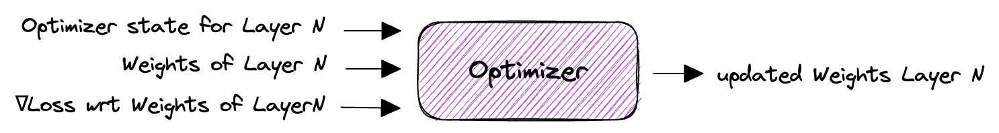

一般来说，训练过程中需要保存的状态主要来自以下几个方面：

1. 层权重。
2. 缓存的层输出，也称为*激活值*。
3. 关于权重的梯度，通常简称为*梯度*。
4. 关于输入的梯度，也称为*误差*。<sup class="footnote-ref"><a href="#fn3">[3]</a></sup>
5. 优化器状态。<sup class="footnote-ref"><a href="#fn4">[4]</a></sup>

将这些构建块组合在一起，我们就可以清楚地看到在前向传播和反向传播过程中缓存是如何使用的。我们把这个结构称为反向传播的 **pebble graph**。理解这个图非常有用：只要搞懂了它，你再去理解分布式训练中的很多概念就会容易很多。<sup class="footnote-ref"><a href="#fn5">[5]</a></sup>

<aside id="fn3" class="footnote">
  <p> 输入梯度在计算显存需求时基本可以忽略，因为我们在做反向传播时，是直接把误差“往回传”，整个过程是原地操作，每次只需要保存一个误差值就行。</p>
</aside>

<aside id="fn4" class="footnote">
  <p> 除非你用的是像随机梯度下降这种无状态优化器。</p>
</aside>

<aside id="fn5" class="footnote">
  <p> pebble graph 这个概念最早来自一篇介绍 OpenAI 梯度检查点实现的[文章](https://medium.com/tensorflow/fitting-larger-networks-into-memory-583e3c758ff9)。</p>
</aside>

下图展示了在前向传播过程中，缓存的激活值是如何逐步累积的，以及在执行完对应层的反向传播后，这些缓存又是如何被释放的。图中可以看到，在完成某一层的反向传播之后，关于该层权重的梯度（紫色部分）就已经计算出来了。

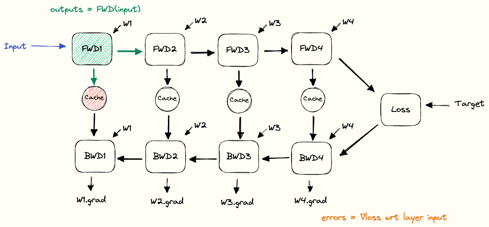

## 数据并行训练（DP）

上面我们描述的反向传播是用于顺序训练的场景，即只有单个计算节点，模型加载在该节点的内存中。在每一轮训练迭代中，我们加载下一个小批量数据，执行一次前向传播，并缓存每一层的输出。接着，我们计算损失，再运行反向传播来计算梯度。下图以 **MNIST** 图像作为示例输入数据，展示了这一过程。

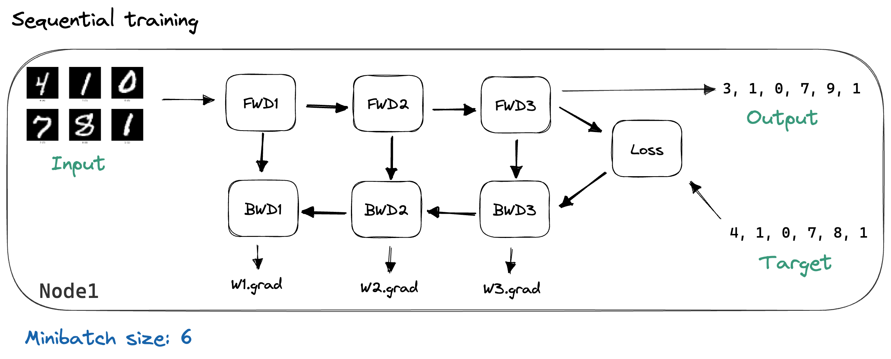

数据并行的做法是将模型复制到 N 台机器上，同时把小批量数据<sup class="footnote-ref"><a href="#fn6">[6]</a></sup>分成 N 份，让每台机器处理其中一份。

<aside id="fn6" class="footnote">
  <p> 这里的叫法有时候不太统一，minibatch 很多时候就直接叫作 batch。</p>
</aside>

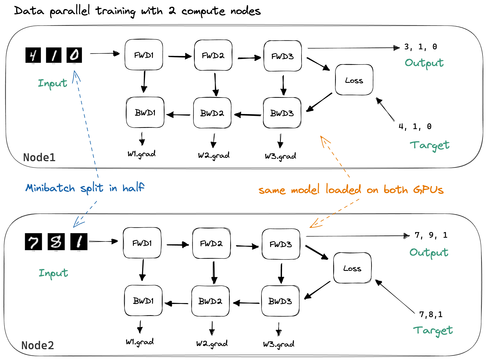

通过将数据拆分到多个节点上，每个节点的计算量减少了。如果忽略通信开销，训练速度应该能提升 2 倍。批量中的各个样本可以独立处理，<sup class="footnote-ref"><a href="#fn7">[7]</a></sup> 因此前向传播（计算每个样本的输出）和反向传播（计算单个样本损失对权重的梯度）期间都不需要通信。

<aside id="fn7" class="footnote">
  <p> 一个值得注意的例外是 [Batch Norm](https://en.wikipedia.org/wiki/Batch_normalization)。</p>
</aside>

为了达到顺序一致性，<sup class="footnote-ref"><a href="#fn8">[8]</a></sup> 我们需要在更新权重之前同步梯度。最常用的损失函数是各个样本损失的平均值：

<aside id="fn8" class="footnote">
  <p> 如果一个分布式算法算出来的梯度，和单机顺序训练算出来的完全一样，我就称它是顺序一致的（<em>sequentially consistent</em>）。</p>
</aside>

$$
\text{loss(batch)} = \frac{1}{N} \sum_{i=0}^{\text{batchsize}} \text{loss(input}_i, \text{target}_i)
$$

很方便的是，和的梯度等于各分项梯度的和。因此，我们可以在每台机器上独立计算样本的梯度，然后在更新权重之前将它们累加起来。<sup class="footnote-ref"><a href="#fn9">[9]</a></sup> 同步之后，我们希望每个节点上的梯度都是一样的：

<aside id="fn9" class="footnote">
  <p> 如果用的是 SGD，那同步权重和同步梯度其实是一样的，因为 $\frac{1}{N}\sum_{i}(W + \lambda\nabla W_i) = W + \frac{\lambda}{N}\sum_{i}\nabla W_i$。但对 [Adam](https://ruder.io/optimizing-gradient-descent/) 这种有状态优化器就不行了，因为状态更新是梯度的非线性函数。如果使用 Adam 但只同步权重不同步梯度，各节点上的优化器状态就会不一致，顺序一致性也就没了。</p>
</aside>

$$
\nabla W^{\text{sync'd}} = \frac{1}{\text{\\#Nodes}} \sum_{i=0}^{\text{\\#Nodes}} \nabla W_i^{\text{local}}
$$

同步完成后，我们就可以进行权重更新并更新优化器状态。将分布式梯度累加并使每个节点都拿到这个累加和，是通过 `MPI.AllReduce` 操作实现的。<sup class="footnote-ref"><a href="#fn10">[10]</a></sup>

<aside id="fn10" class="footnote">
  <p>[MPI](https://www.mpi-forum.org/docs/) 全称是消息传递接口，它不是某个具体实现，而是一套通信原语的规范，用来完成分布式系统里常见的通信任务，比如把数据广播到所有节点、从节点1发给节点2、把所有节点的数据汇总到节点0等。这里附一篇我觉得写得特别好的 [MPI 教程](https://pdc-support.github.io/introduction-to-mpi/)。</p>
</aside>

从数学上讲，数据并行训练是顺序一致的。但这并不意味着在实际中顺序训练和数据并行训练会得到完全相同的输出。为了累加梯度，我们需要使用 MPI 的 AllReduce 操作，它收集每个节点的计算结果，对它们进行归约（这里是对小批量梯度求和），然后将结果广播回所有节点。AllReduce 会为我们选择梯度的求和顺序，比如选择 $(Node1 + Node2) + Node3$ 而不是 $Node1 + (Node2 + Node3)$。如果求和运算满足交换律和结合律，这本来不是问题。可惜的是，浮点数运算**不满足结合律**，<sup class="footnote-ref"><a href="#fn11">[11]</a></sup> 因此结果不会和顺序训练完全一致。在实际系统中，顺序训练得到的期望梯度与数据并行训练得到的梯度之间的差异很小，我们可以忽略这个问题。不过最好还是记住：梯度不会完全一致，调试时会稍微麻烦一些。

<aside id="fn11" class="footnote">
  <p>[维基百科](https://en.wikipedia.org/wiki/Associative_property#Nonassociativity_of_floating_point_calculation)有讲浮点数加法的非结合性，另外再贴一个我最喜欢的浮点数位级表示的[可视化讲解](https://fabiensanglard.net/floating_point_visually_explained/)。</p>
</aside>

## 数据并行训练中 AllReduce 的更多细节

我们再稍微讨论一下数据并行训练中使用的 AllReduce。我不会过多介绍 AllReduce 本身，而是推荐两篇关于 DNN 训练中 AllReduce 算子实现细节的优秀博客文章：一篇是关于[百度 Ring-AllReduce](https://andrew.gibiansky.com/blog/machine-learning/baidu-allreduce/) 的，另一篇是关于 [Ring- 和 Tree-AllReduce](https://marek.ai/allreduce-the-basis-of-multi-device-communication-for-neural-network-training.html) 的。<sup class="footnote-ref"><a href="#fn12">[12]</a></sup> 不过，我们还是简单聊一下 Ring AllReduce（实现 AllReduce 最常用的算法之一）的带宽和延迟。

<aside id="fn12" class="footnote">
  <p>[MPI 规范](https://www.mpi-forum.org/docs/)要求 AllReduce 在每个节点上的结果必须完全相同。但因为浮点数计算不满足结合律，这件事没那么简单。所以我们必须保证各节点做局部归约时的顺序一致。比如下面这个最简单的实现方式就达不到规范要求，因为不同节点上局部求和的顺序不一样：</p>
  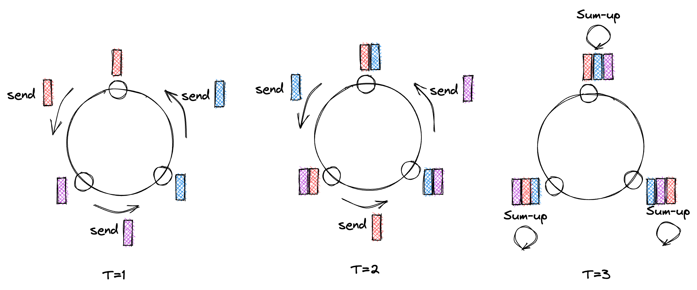
  <p><code>(a + b) + c</code>  和  <code>a + (b + c)</code> 在实数里相等，但在浮点数里不一定完全相等。</p>
</aside>

- **带宽**：使用 Ring AllReduce 时，每个节点需要与其两个环邻居之间传输 $2(\\#nodes - 1)\frac{\\#params}{\\#nodes}$ 个浮点数。当 $\\#nodes$ 足够多时，这个公式等同于 $2\\#params$。此外，Ring AllReduce 在带宽上是最优的，意味着没有其他方法可以用更少的数据传输完成同样的任务。<sup class="footnote-ref"><a href="#fn13">[13]</a></sup>

<aside id="fn13" class="footnote">
  <p>在全双工连接下，我们可以把通信时间的下限估计为$\frac{模型大小}{带宽}$，因为在 Ring AllReduce 过程中，每个节点都在同时收发数据。</p>
</aside>

- **延迟**：同样对于 Ring AllReduce，我们需要执行 $\\#nodes-1$ 步的 `MPI.ReduceScatter` 和 $\\#nodes-1$ 步的 `MPI.AllGather`。这意味着虽然增加节点数不会增加数据传输量，但会线性增加通信轮数。这对整体运行时间的影响取决于节点之间的延迟。

下面我们可以直观地看到 AllReduce 是如何使用的。当梯度计算完成后，使用 `MPI.Communicator` 中的所有节点执行 AllReduce。

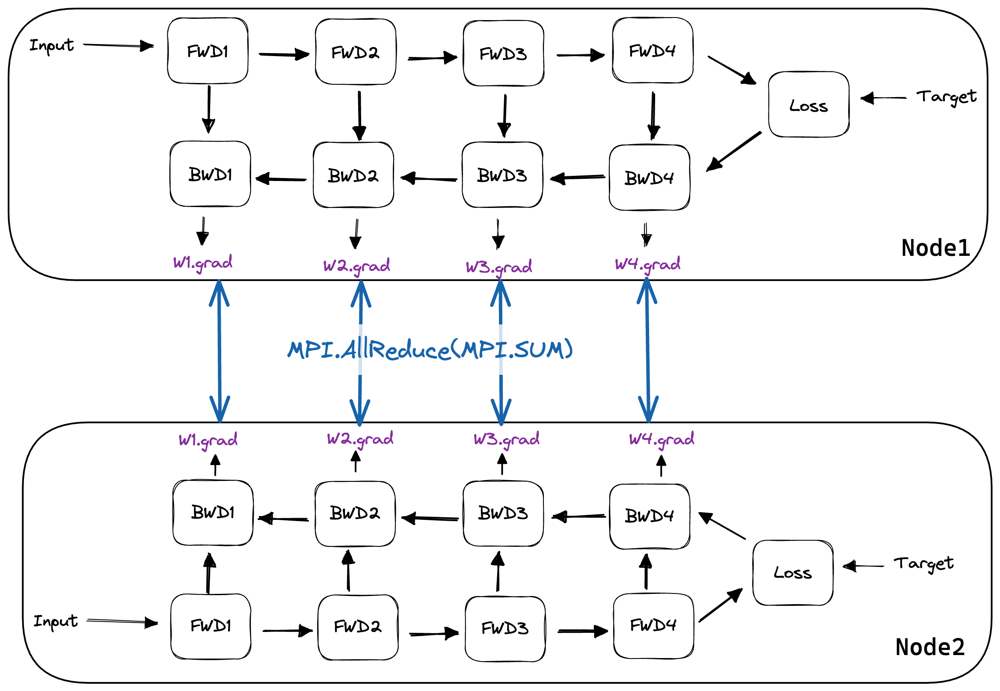

## 将数据并行集成到反向传播中

现在我们来看一下 [ShallowSpeed](https://github.com/Allreduce/MPI-IP) 中的部分代码，以便更好地理解上述概念。实现数据并行分布式训练最直接的方法是：运行完整的前向和反向传播，然后在调用 `optimizer.step()` 之前同步梯度。在 PyTorch 中，代码大致如下：<sup class="footnote-ref"><a href="#fn14">[14]</a></sup>

<aside id="fn14" class="footnote">
  <p>因为我们会在梯度 AllReduce 完成之前一直阻塞，所以可以直接在原地做归约，不需要额外申请显存。</p>
</aside>


```python
for param in model.parameters():
    comm.Allreduce(MPI.IN_PLACE, param.grad, op=MPI.SUM)
```

这种做法并不理想，因为它把训练分成了两个阶段。在第一阶段（前向和反向传播），我们等待处理器完成计算，而此时网络处于空闲状态。在第二阶段（AllReduce），网络以尽可能快的速度进行通信，而处理器则只是在空转。

下图展示了这种训练方式：

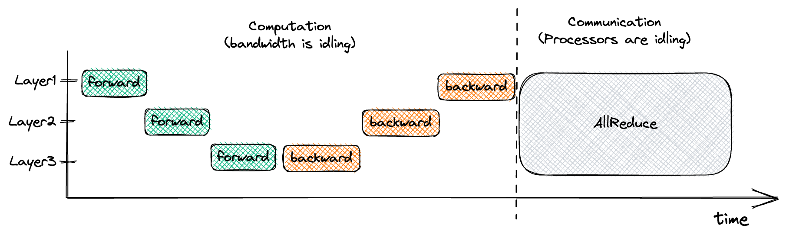

但请注意，在上图中，一旦我们完成了第 3 层的反向传播，该层的梯度就立即可用。如果我们在这部分梯度一准备好时就启动一个非阻塞的 AllReduce，那么网络就会忙碌地执行有用的通信工作，同时处理器也在独立计算第 2 层的梯度。这种策略被称为**通信与计算的交错**，它能够优化我们的训练过程。下图展示了这种交错式数据并行训练的实现方式：

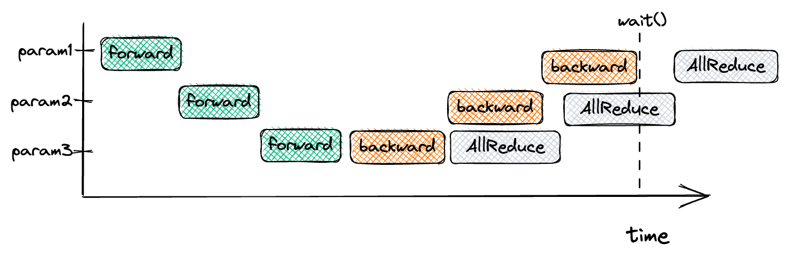


通常，这是通过挂钩（hook）到 Autograd 系统来实现的：<sup class="footnote-ref"><a href="#fn15">[15]</a></sup>

<aside id="fn15" class="footnote">
  <p>PyTorch 并没有暴露实现交错数据并行所需要的钩子函数。但它在内部实现的 [<code>DistributedDataParallel</code>](https://pytorch.org/docs/stable/generated/torch.nn.parallel.DistributedDataParallel.html) 模块，其实和我这里描述的方式是一致的。</p>
</aside>

```python
def backprop_allreduce_gradient(comm, param):
    # 在 AllReduce 完成之前我们不会触碰 param.grad，所以原地操作
    param._request = comm.Iallreduce(
        sendbuf=MPI.IN_PLACE, recvbuf=param.grad, op=MPI.SUM
    )

autograd.register_grad_hook(backprop_allreduce_gradient)
```
一旦某个参数的梯度准备就绪，这个钩子就会被触发：<sup class="footnote-ref"><a href="#fn16">[16]</a></sup>

<aside id="fn16" class="footnote">
  <p>这种做法会带来不小的通信开销，尤其是在参数量比较小的时候。所以 PyTorch 的 DDP 会把梯度先收集到不同大小的桶里，等桶里所有参数的梯度都算好了，再对整个桶做一次 AllReduce。桶设得越大，通信开销越小，但通信和计算之间的交错程度也会下降。</p>
</aside>

```python
def backward(self, dout):
    result = dout
    for layer in reversed(self.layers):
        result = layer.backward(result)
    for hook in self._grad_hooks:
        for param in layer.parameters():
            hook(param)
```

为了确保在更新权重之前所有 AllReduce 操作都已完成，我们会阻塞直到所有通信结束：

```python
def wait_for_comms(params):
    requests = [param._request for param in params]
    MPI.Request.Waitall(requests)

```

在关于 [PyTorch 的 `DistributedDataParallel`](https://arxiv.org/abs/2006.15704) 模块的论文中，他们证明这种交错方式能带来相当可观的性能提升。下图比较了非交错式分布式数据并行训练与交错式训练在两个模型上的运行时间，这两种模型使用了两种不同的 AllReduce 实现：[NCCL](https://developer.nvidia.com/nccl) 和 [GLOO](https://github.com/facebookincubator/gloo)。每个 ResNet 和 BERT 的前向传播时间与 AllReduce 实现无关，因此他们对 y 轴进行了归一化处理。

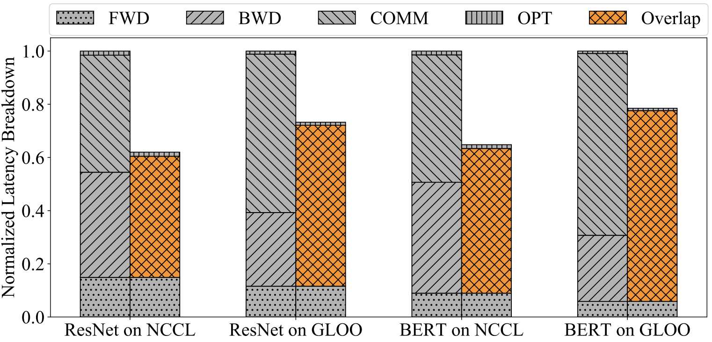

## 结论与总结

以上就是对数据并行的一个快速介绍。在拥有多个计算节点的情况下，数据并行是加速深度学习模型训练的一种常见方法。如果你的网络参数效率高（因为每个批次都需要通过网络传输全部模型权重<sup class="footnote-ref"><a href="#fn17">[17]</a></sup>）且批次大小较大，数据并行的效果会特别好。批次大小是数据并行度的上限。<sup class="footnote-ref"><a href="#fn18">[18]</a></sup> 批次大小过小意味着输入数据少，会降低矩阵乘法的运算强度，从而导致计算效率低下。

<aside id="fn17" class="footnote">
  <p>数据并行通常被理解成一种“要么全用、要么不用”的方式，但理论上也可以只在网络的一部分上做数据并行（比如计算量最大的前几层 CNN），而让网络的其余部分在另一个节点上顺序执行。</p>
</aside>

<aside id="fn18" class="footnote">
  <p>能够支撑更大的 batch size，是 [LARS](https://arxiv.org/abs/1708.03888v3)、[LAMB](https://arxiv.org/abs/1904.00962v5) 这类学习率调度器出现的主要动机。</p>
</aside>

想要更深入地理解数据并行，可以查阅 [PyTorch DDP](https://arxiv.org/abs/2006.15704) 论文（其中详细介绍了 PyTorch 中数据并行的实现以及更多优化），以及我的 [ShallowSpeed](https://github.com/siboehm/shallowspeed) 库。ShallowSpeed 从零开始实现了本文所描述的数据并行。我尽量让代码保持高度可读，欢迎大家动手尝试。

在[第二部分](https://siboehm.com/articles/22/pipeline-parallel-training)中，我将介绍流水线并行，它使得训练那些无法放入单个计算节点内存中的模型成为可能。


## 附录

### DNN 训练的内存需求

这里我考虑的是使用 Adam 优化器的 `bfloat16` 混合精度训练<sup class="footnote-ref"><a href="#fn19">[19]</a></sup>。内存需求包括模型状态、优化器状态以及激活状态。对于每个参数，我们需要存储其模型状态和优化器状态。激活状态由前向传播过程中缓存的激活值组成。

<aside id="fn19" class="footnote">
  <p>混合精度训练就是用更低精度（一般是 fp16 或 bfloat16）来做前向和反向传播。这样做可以节省显存（缓存的激活值更小）和带宽（需要传到处理器的数据量减少）。现在越来越多的硬件也开始支持快速的 fp16 / bfloat16 运算，比如 Nvidia 的张量核心、[x86 的 AMX 指令](https://en.wikipedia.org/wiki/Advanced_Matrix_Extensions)。更详细的可以参考 [Mixed Precision Training（arXiv）](https://arxiv.org/abs/1710.03740)。</p>
</aside>

#### 1. 模型状态：

- 参数：fp32 源副本 + bfloat16 副本<sup class="footnote-ref"><a href="#fn20">[20]</a></sup>
- 参数的梯度：bfloat16<sup class="footnote-ref"><a href="#fn21">[21]</a></sup>

<aside id="fn20" class="footnote">
  <p>其实没必要在不同精度下同时保留两份参数副本。因为对于一个 fp32 值来说，只取它的前两个字节，就等价于它在 bfloat16 下的表示。</p>
  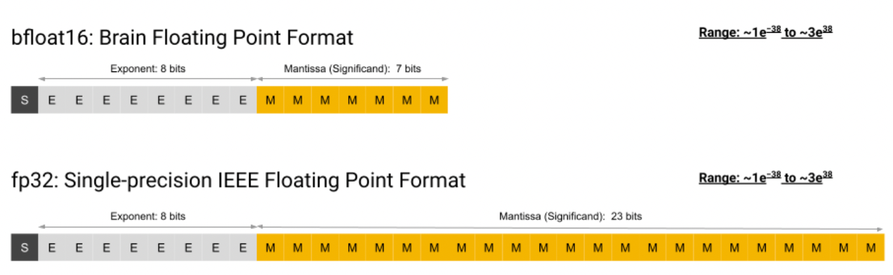
  <p>我猜大多数库还是选择保留 bfloat16 副本，是因为对 float32 张量做步长访问会严重影响缓存效率。</p>
</aside>

<aside id="fn21" class="footnote">
  <p>每个参数只传2个字节，相当于把数据并行梯度 AllReduce 需要的带宽直接砍掉一半。</p>
</aside>

#### 2. Adam 优化器状态：

- 动量（Momentum）：fp32
- 方差（Variance）：fp32

#### 3. 激活状态：

激活状态包括在前向传播和反向传播之间需要缓存的张量。对于一个 MLP，我们可以估算为：<sup class="footnote-ref"><a href="#fn22">[22]</a></sup>

<aside id="fn22" class="footnote">
  <p>用不同激活函数时，额外显存开销可能不一样。比如对 ReLU 做反向传播，理论上可以利用下一层的缓存输入来计算梯度，所以不需要额外多存东西。</p>
</aside>

$$
\mathrm{batchsize} \cdot \sum_{i \in \\#layers} \mathrm{input\\_size}_i
$$


我们以16位精度存储激活值。

总计：每个模型参数需要16字节用于模型状态和优化器状态，再加上缓存的激活值，其大小取决于具体的模型架构。<sup class="footnote-ref"><a href="#fn23">[23]</a></sup>

<aside id="fn23" class="footnote">
  <p>注意，缓存的激活值大小是随着 batch size 线性增长的。如果想降低这方面的显存占用，可以用[“梯度检查点”](https://arxiv.org/abs/1604.06174v2)技术，只缓存部分激活值，其他的等用的时候再重新计算。</p>
</aside>


## 数据并行训练的带宽优化

在我写这篇文章时所查看的数据并行实现中，每个实现都使用 AllReduce 来同步梯度。然而，对于权重矩阵而言，存在另一种不同的同步策略。

关于 $W$ 的梯度计算为下一层传来的梯度与缓存输入的外积。下图展示了这一操作以及操作数的大小：

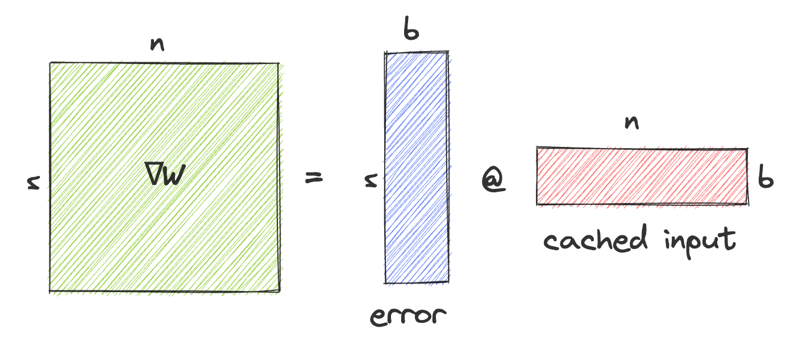

相比对 $\nabla W$ 执行 AllReduce，另一种做法是对误差和缓存的激活值执行 AllGather，然后在每个节点上通过外积计算得到 $\nabla W$。对于一个方阵 $W$，这会将每个节点传输的数据量从 $n^2$ 减少到 $2nb$（其中 $b$ 是批次大小）。因此，当 $b < \frac{1}{2}n$ 时，可以节省带宽。

其缺点在于增加了代码复杂度，并且每个节点会多出 $O(b \cdot n^2)$ 的额外计算量。

