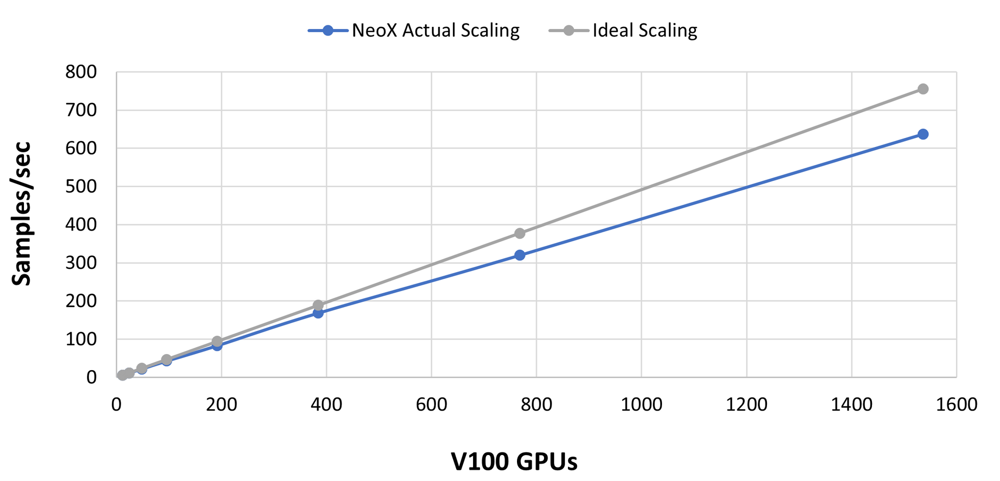
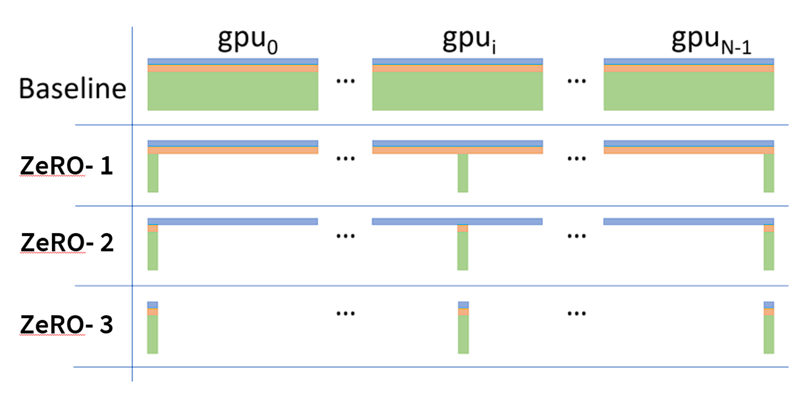
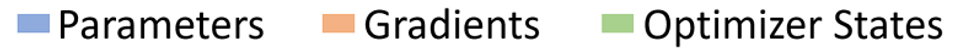
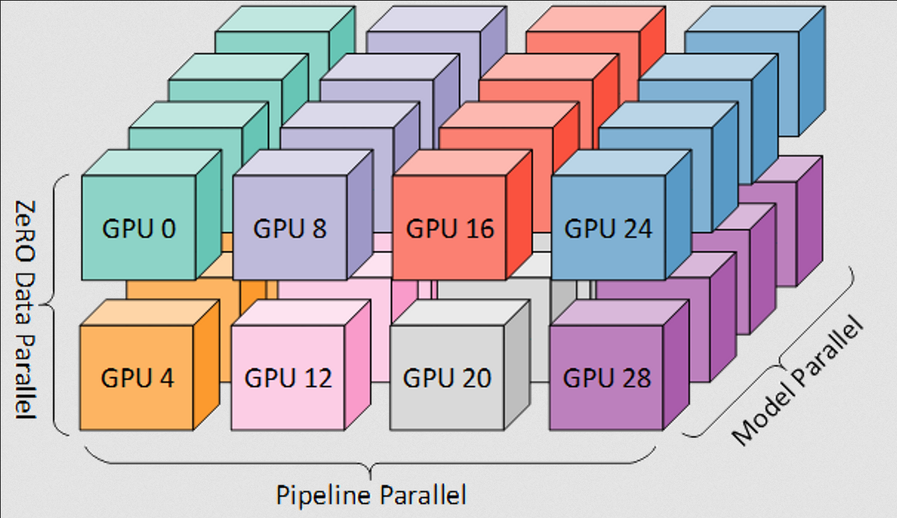
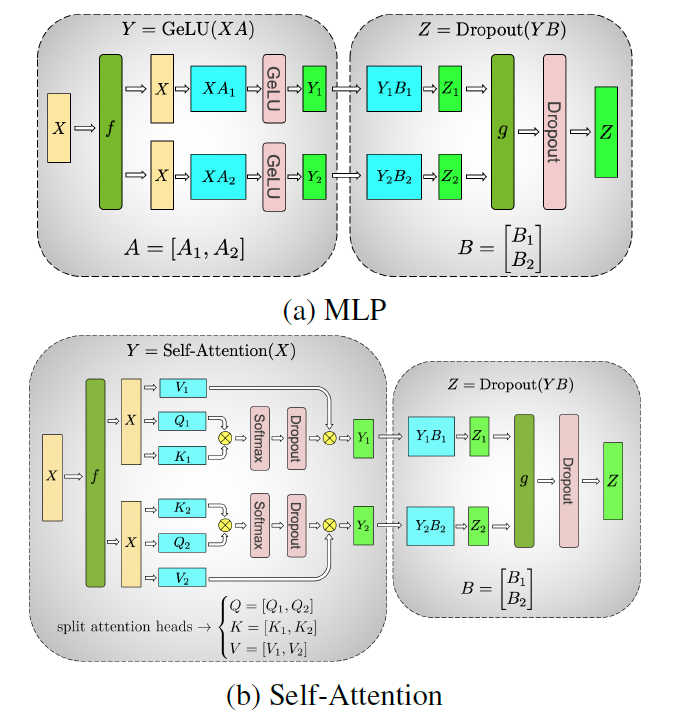

本文讲述 transformer 模型训练阶段的显存（VRAM）占用情况分析。主要参考 [Transformer Math 101](https://blog.eleuther.ai/transformer-math/)。

# 计算需求

训练一个 Transformer 模型的基本成本方程如下：

$$C \approx \tau T = 6PD$$

其中：

- $C$ 是训练 Transformer 模型所需的计算量，单位为总浮点运算次数
- $C = C_{\text{forward}} + C_{\text{backward}}$
- $C_{\text{forward}} \approx 2PD$
- $C_{\text{backward}} \approx 4PD$
- $\tau$ 是你的硬件设置的聚合吞吐量（$\tau = (\text{GPU 数量}) \times (\text{每 GPU 实际 FLOPS})$），单位为 FLOPS
- $T$ 是训练模型所用的时间，单位为秒
- $P$ 是 Transformer 模型的参数数量
- $D$ 是数据集的大小，单位为 token

这些方程由 [OpenAI 的缩放定律论文](https://arxiv.org/abs/2203.15556) 和 [DeepMind 的缩放定律论文](https://arxiv.org/abs/2203.15556) 提出并经过实验验证。更多信息请参阅各论文。

这里有必要讨论一下 $C$ 的单位。$C$ 是总计算量的度量，可以用多种单位来衡量，例如：

- FLOP-秒，单位为 $\frac{\text{浮点运算次数}}{\text{秒}} \times \text{秒}$
- GPU-小时，单位为 $[\text{GPU 数量}] \times [\text{小时}]$
- 缩放定律论文通常以 PetaFLOP-天 为单位，即 $10^{15} \times 24 \times 3600$ 次总浮点运算

一个值得记住的有用区别是 **实际 FLOPS** 这一概念。虽然 GPU 加速器的白皮书通常会宣传它们的理论 FLOPS，但在实际中（尤其是在分布式环境下）这些数值从未被达到。在下面的“计算成本”部分中，会报告一些在分布式训练环境中常见的 **实际 FLOPS** 数值。

注意，我们使用的是成本方程的吞吐量-时间版本，这与这篇 [关于大语言模型训练成本的精彩博文](https://medium.com/@dzmitrybahdanau/the-flops-calculus-of-language-model-training-3b19c1f025e4) 中所用的版本一致。

# 参数与数据集的权衡

虽然严格来说，你可以用任意多的 token 来训练一个 Transformer 模型，但训练的 token 数量会显著影响计算成本和最终模型性能，因此找到合适的平衡点非常重要。

**先来谈谈房间里的大象：“计算最优”的语言模型。** 这类模型通常被称为“Chinchilla 缩放定律”[^1]，源于那篇论文中提出关于参数数量当前认知的模型系列。一个计算最优的语言模型，其**参数数量** ($P$) 和 **数据集大小** ($D$) 满足近似关系 $D = 20P$。这在一个非常特定的意义上是最优的：在使用 1000 块 GPU 训练 1 小时与使用 1 块 GPU 训练 1000 小时成本相同的资源环境下，如果你的目标是最大化性能同时最小化训练模型的 GPU 小时成本，那么你应该使用上述公式。

**我们不建议在少于 2000 亿 token 的情况下训练大语言模型。** 尽管对于许多模型而言这是“Chinchilla 最优”的，但由此得到的模型通常质量相当差。对于几乎所有应用，我们建议先确定你的用例可接受的推理成本，然后在你能够承受的推理成本范围内，训练尽可能大的模型，并使用尽可能多的 token。

---

# 计算成本的工程要点

Transformer 的计算成本通常以 GPU 小时或 FLOP 秒为单位列出。

- GPT-NeoX 在普通注意力机制下达到 150 TFLOP/s/A100，在使用 Flash Attention 时达到 180 TFLOP/s/A100。这与其它大规模高度优化的库（例如 Megatron-DS 报告的 137 到 163 TFLOP/s/A100）水平相当。
- 作为一般经验法则，你应该始终能够达到大约 120 TFLOP/s/A100。如果你看到的数值低于 115 TFLOP/s/A100，那么你的模型或硬件配置可能存在问题。
- 使用高质量的互连（如 InfiniBand）时，你可以在数据并行维度上实现线性或亚线性扩展（即增加数据并行度应使总吞吐量接近线性增长）。下图展示了在橡树岭国家实验室的 Summit 超算上测试 GPT-NeoX 库的结果。请注意，x 轴上是 V100，而文中大多数数值示例是针对 A100 的。

# 训练阶段的内存需求

Transformer 模型通常以其**参数大小**来描述。然而，在确定哪些模型可以适配到给定的计算资源上时，你需要知道模型将占用**多少字节的空间**。训练所需的内存总是比推理多，而且通常要多得多！

## 模型参数

首先，模型可以以纯 fp32 或 fp16 格式进行训练：

- 纯 fp32：$memory_{\text{model}} = (4\ \text{字节/参数}) \times (\text{参数数量})$
- 纯 fp16：$memory_{\text{model}} = (2\ \text{字节/参数}) \times (\text{参数数量})$

除了推理中讨论的常见模型权重数据类型外，训练还引入了**混合精度**训练，例如 AMP。该技术旨在最大化 GPU 张量核心的吞吐量，同时保持收敛性。现代深度学习训练经常使用混合精度训练，原因是：1) fp32 训练稳定，但内存开销大，且无法利用 NVIDIA GPU 张量核心；2) fp16 训练稳定，但难以收敛。有关混合精度训练的更多信息，我们推荐阅读这本 [由 tunib-ai 编写的 notebook](https://nbviewer.org/github/tunib-ai/large-scale-lm-tutorials/blob/main/notebooks/08_zero_redundancy_optimization.ipynb)。请注意，混合精度需要在内存中存储模型的 fp16/bf16 和 fp32 版本，因此需要：

- 混合精度（fp16/bf16 和 fp32）：$memory_{\text{model}} = (2\ \text{字节/参数}) \times (\text{参数数量})$

再加上一个额外的 $(4\ \text{字节/参数}) \times (\text{参数数量})$ 大小的模型副本，**这个副本将在我们的优化器状态中计算**。

## 优化器状态

Adam 很神奇，但它的内存效率非常低。除了需要保存模型参数和梯度参数的副本外，你还需要额外保存三份梯度参数的副本。因此：

- 对于普通 AdamW：$memory_{\text{optimizer}} = (12\ \text{字节}/\text{参数}) \times (\text{参数数量})$
  - 参数的 fp32 副本：$4\ \text{字节/参数}$
  - 动量：$4\ \text{字节/参数}$
  - 方差：$4\ \text{字节/参数}$

- 对于像 bitsandbytes 这样的 8 位优化器：$memory_{\text{optimizer}} = (6\ \text{字节}/\text{参数}) \times (\text{参数数量})$
  - 参数的 fp32 副本：$4\ \text{字节/参数}$
  - 动量：$1\ \text{字节/参数}$
  - 方差：$1\ \text{字节/参数}$

- 对于带动量的 SGD 类优化器：$memory_{\text{optimizer}} = (8\ \text{字节}/\text{参数}) \times (\text{参数数量})$
  - 参数的 fp32 副本：$4\ \text{字节/参数}$
  - 动量：$4\ \text{字节/参数}$

# 梯度

梯度可以以 fp32 或 fp16 格式存储（注意，梯度的数据类型通常与模型的数据类型一致。因此，在 fp16 混合精度训练中，梯度也是以 fp16 存储的），它们对内存开销的贡献如下：

- 在 fp32 下，$memory_{\text{gradients}} = (4\ \text{字节}/\text{参数}) \times (\text{参数数量})$
- 在 fp16 下，$memory_{\text{gradients}} = (2\ \text{字节}/\text{参数}) \times (\text{参数数量})$

# 激活值与批量大小

在大语言模型训练中，现代 GPU 的瓶颈通常是内存，而不是 FLOPs。因此，激活值重计算/检查点是一种非常流行的技术，它用额外的计算成本来换取内存成本的降低。激活值重计算/检查点的原理是：重新计算某些层的激活值，而不是将其存储在 GPU 内存中。内存的减少量取决于我们在决定清除哪些层时的选择程度。Megatron 的选择性重计算方案如下图所示：

其中虚线红线表示 A100-80GB GPU 的内存容量，“present work”表示应用选择性激活重计算后的内存需求。详细信息以及下方公式的推导请参阅《Reducing Activation Recomputation in Large Transformer Models》。

存储 Transformer 模型激活值所需内存的基本公式如下：

$$
\text{memory}_{\text{No Recomputation activations}} = \text{sbh}L\left(10 + \frac{24}{t} + 5\frac{a \cdot s}{h \cdot t}\right) \text{ bytes}
$$

$$
\text{memory}_{\text{Selective Recomputation activations}} = \text{sbh}L\left(10 + \frac{24}{t}\right) \text{ bytes}
$$

$$
\text{memory}_{\text{Full Recomputation activations}} = 2 \cdot \text{sbhL} \text{ bytes}
$$ 
[^2]

其中：

- $s$ 是序列长度，以 token 为单位
- $b$ 是每块 GPU 的批量大小
- $h$ 是每个 Transformer 层中的隐藏层维度
- $L$ 是 Transformer 模型的层数
- $a$ 是 Transformer 模型中的注意力头数
- $t$ 是使用的张量并行度（如果不使用则为 1）
- 我们假设没有使用序列并行
- 我们假设激活值以 fp16 格式存储

所需的重计算额外开销也取决于方法的选择性，但其上限为一次完整的额外前向传播。因此，更新后的前向传播成本为：

$$
2PD \leq C_{\text{forward}} \leq 4PD
$$
[^3]

# 总训练内存

因此，对于“这个模型能放进去训练吗”这个问题的一个良好启发式答案是：

$$
\text{Total Memory}_{\text{Training}} = \text{Model Memory} + \text{Optimizer Memory} + \text{Activation Memory} + \text{Gradient Memory}
$$

# 分布式训练

## 分片优化器

优化器巨大的内存开销是使用分片优化器（如 ZeRO 和 ESDP）的主要动机。这种分片策略可以将优化器开销降低到原来的 $\frac{1}{\text{GPU 数量}}$，这就是为什么某个模型配置在大规模集群上可以运行，但在小规模集群上却会出现内存不足（OOM）的原因。如果你想计算使用分片优化器训练所需的内存开销，你需要用到下图中给出的公式。关于分片优化的一些示例计算，请参见 ZeRO 论文中的下图（注意，$P_{os}$、$P_{os+g}$ 和 $P_{os+g+p}$ 通常分别称为 ZeRO-1、ZeRO-2、ZeRO-3。ZeRO-0 通常表示“禁用 ZeRO”）：

按照这篇博文的术语（假设使用混合精度和 Adam 优化器）：

- 对于 ZeRO-1：
  

  $$
  \text{Total Memory}_{\text{Training}} \approx \text{Model Memory} + \frac{\text{Optimizer Memory}}{\text{(GPU 数量)}} + \text{Activation Memory} + \text{Gradient Memory}
  $$
  

- 对于 ZeRO-2：
  

  $$
  \text{Total Memory}_{\text{Training}} \approx \text{Model Memory} + \text{Activation Memory} + \frac{\text{Optimizer Memory} + \text{Gradient Memory}}{\text{(GPU 数量)}} + 
  $$
  

- 对于 ZeRO-3：
  

  $$
  \text{Total Memory}_{\text{Training}} \approx \text{Activation Memory} + \frac{\text{Model Memory} + \text{Optimizer Memory} + \text{Gradient Memory}}{\text{(GPU 数量)}} + (\text{ZeRO-3 存活参数})
  $$
  

其中，数据并行度（DP Degree）在未使用流水线并行和/或张量并行时即为 GPU 数量。详细信息请参见[分片优化器和3D 并行](https://www.notion.so/Sharded-Optimizers-3D-Parallelism-9c476d020d7641a299fb6be6ae82e9f8)部分。

请注意，ZeRO-3 引入了一组“存活参数”。这是因为 ZeRO-3 提供了一系列配置选项（**stage3_max_live_parameters**、**stage3_max_reuse_distance**、**stage3_prefetch_bucket_size**、**stage3_param_persistence_threshold**），用于控制同一时刻 GPU 内存中保留的参数数量（取值越大，内存占用越多，但通信开销越小）。这些参数会对总 GPU 内存产生显著影响。

另外注意，ZeRO 还可以通过 **ZeRO-R** 在数据并行进程上对激活值进行分区。这会使上面的激活值内存项除以张量并行度 $t$。更多细节请阅读相关的 [ZeRO 论文](https://arxiv.org/abs/1910.02054) 和 [配置选项](https://www.deepspeed.ai/docs/config-json/#activation-checkpointing)（在 GPT-NeoX 中，对应的是 **partition_activations** 标志）。如果你正在训练一个超大模型，你可能希望用一些内存开销换取额外的通信成本，此时激活值会成为瓶颈。以下是将 ZeRO-R 与 ZeRO-1 结合使用的示例：

$$
\text{Total Memory}_{\text{Training}} \approx \text{Model Memory} + \frac{\text{Optimizer Memory}}{\text{(GPU 数量)}} + \text{Activation Memory} + \text{Gradient Memory}
$$

# 3D 并行

大语言模型的并行化主要有三种形式：

**数据并行：** 在模型的（可能已进行模型并行的）副本之间拆分数据。

**流水线并行或张量/模型并行：** 这些并行方案将模型的参数拆分到多个 GPU 上。这类方案需要大量的通信开销，但它们减少内存的效果近似为：

$$
\text{memory}_{\text{w/ parallelism model}} \approx \frac{\text{Model Memory}}{\text{Pipe-Parallel-Size} \times \text{Tensor-Parallel-Size}}
$$

$$
\text{memory}_{\text{w/ parallelism gradients}} \approx \frac{\text{Gradient Memory}}{\text{Pipe-Parallel-Size}}
$$
[^4]

需要注意的是，这个方程是近似的，原因在于：(1) 流水线并行不会减少激活值的内存占用；(2) 流水线并行要求所有 GPU 存储所有正在执行的微批次的激活值，这对于大模型来说会变得非常显著；(3) GPU 需要临时存储并行方案所需的额外通信缓冲区。

# 分片优化器 + 3D 并行

## 3D 并行

当 ZeRO 与张量并行和/或流水线并行结合时，形成的并行策略会构成如下所示的网格结构：

一个重要的补充说明：数据并行度对于计算训练的全局批量大小至关重要。数据并行度取决于完整模型副本的数量：

$$
\text{DP Degree} = \frac{\text{GPU 数量}}{(\text{Pipe-Parallel-Size}) \times (\text{Tensor-Parallel-Size})}
$$

流水线并行和张量并行与 ZeRO 的所有阶段都是兼容的。然而，将流水线并行与 ZeRO-2/3 的梯度分片结合时，很难保持效率（因为 ZeRO-2 会对梯度进行分片，而流水线并行会累积梯度。虽然可以通过精心定义流水线调度和重叠通信来维持效率，但这非常困难，以至于 DeepSpeed 目前禁止这样做：
[参考](https://github.com/deepspeedai/DeepSpeed/blob/v0.10.1/deepspeed/runtime/pipe/engine.py#L71)。

然而，张量并行与 ZeRO 的各阶段是互补的，因为在每个 rank 上：
- ZeRO-3 从其他 rank 收集完整的层**参数**，在现在本地的完整层上处理一个**完整**的输入，然后释放为存储其他 rank 参数而分配的内存。
- 张量并行从其他 rank 收集本地输入的远程**激活值**，使用本地的层分片处理输入的一个**分片**，然后将下一层的激活值发送到远程 rank。

在 Eleuther 的大部分工作中，我们使用流水线并行和张量并行以及 ZeRO-1 进行训练。这是因为我们发现 ZeRO-3 在大规模硬件上的通信开销过大，因此我们改用跨节点的流水线并行配合节点内的张量并行。

将所有这些综合起来，对于一个典型的使用激活分区的 3D 并行 ZeRO-1 运行：

$$
\text{Total Memory}_\text{Training} \approx \frac{\text{Model Memory}}{\text{Pipe-Parallel-Size} + \text{Tensor-Parallel-Size}} + \frac{\text{Optimizer Memory}}{\text{GPU 数量}} + \frac{\text{Activation Memory}}{\text{Tensor-Parallel-Size}} + \frac{\text{Gradient Memory}}{\text{Pipe-Parallel-Size}}
$$

# 相关链接

[VRAM Estimator 估算 VRAM 占用](https://vram.asmirnov.xyz/)

[^1]: [Chinchilla 缩放定律](https://arxiv.org/abs/2203.15556) 的核心思想就是，参数数量 ($P$) 和 数据集大小 ($D$) 越大，模型训练的效果就越好:

[^2]: 一般隐藏层尺寸就是<code>[b, s, h]</code>；FP16 占 2 bytes

[^3]: 如果没激活重计算，那么计算量就是 $2PD$；如果开启Full激活重计算，那么就额外多 $2PD$，共 $4PD$

[^4]: 
下图展示了 tensor parallelism，可见并未减少每个 GPU 上梯度占用的内存大小

    
