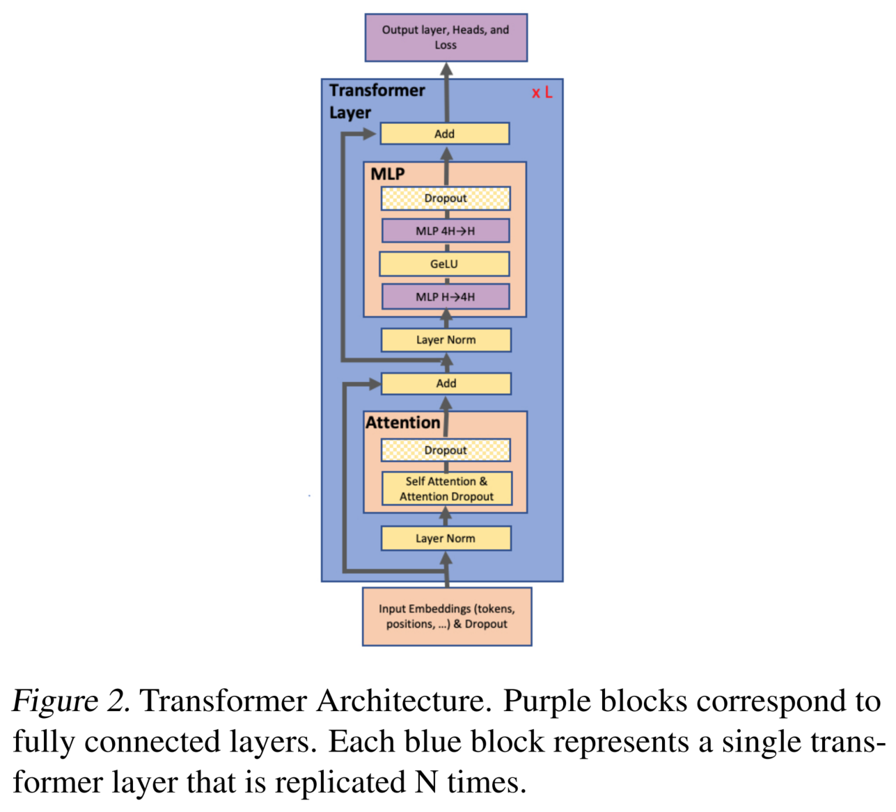
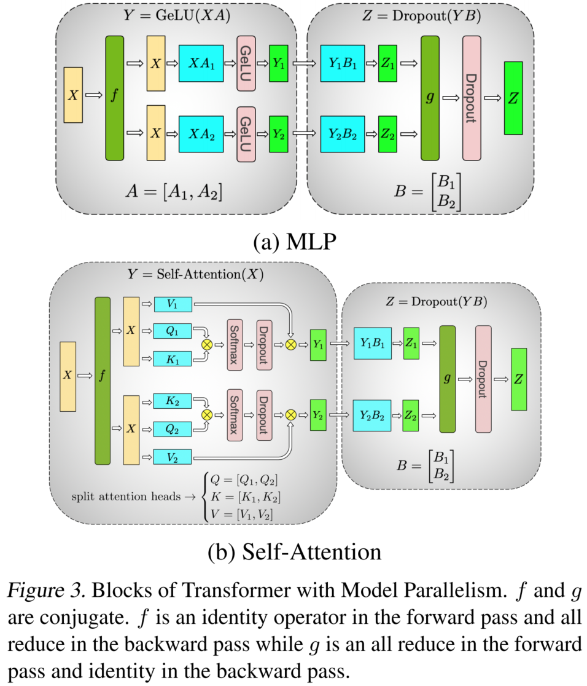
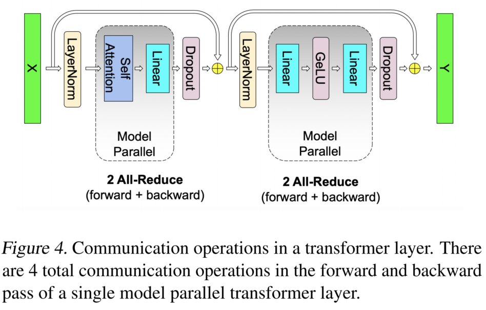

论文来自 [Megatron-LM: Training Multi-Billion Parameter Language Models Using Model Parallelism](https://arxiv.org/abs/1909.08053)。

# 什么是 Tensor Parallelism（张量并行）

大模型训练通常面临两个核心问题：

1. **显存压力大**：当模型参数规模达到数十亿甚至更高时，在每张 GPU 上都完整保存一份模型参数往往不可行。
2. **通信开销高**：多 GPU 训练需要频繁进行集合通信，如果并行策略设计不合理，通信开销会严重影响训练效率。

**张量并行的核心思想**是：将模型中的大矩阵参数沿某个维度切分，并分布到不同 GPU 上分别计算；同时通过合理设计切分方式，尽量减少不必要的集合通信开销。

论文中的 Transformer 结构如下图所示。

以 Transformer 中的 MLP 模块为例，第一层线性变换及激活可以表示为：

$$
Y = \operatorname{GELU}(XA)
$$

假设现在有 2 张 GPU，需要将权重矩阵 $A$ 切分到两张 GPU 上，常见的切分方式包括**行切分**和**列切分**。

## 行切分

如果对权重矩阵 $A$ 进行行切分，则为了完成矩阵乘法，输入 $X$ 也需要按列进行切分：

$$
X = [X_1, X_2], \quad
A =
\begin{bmatrix}
A_1 \\
A_2
\end{bmatrix}
$$

此时：

- GPU 1 保存 $X_1$ 和 $A_1$；
- GPU 2 保存 $X_2$ 和 $A_2$。

矩阵乘法结果为：

$$
XA = X_1A_1 + X_2A_2
$$

因此完整输出为：

$$
Y = \operatorname{GELU}(X_1A_1 + X_2A_2)
$$

由于 $\operatorname{GELU}$ 是非线性激活函数，一般有：

$$
\operatorname{GELU}(X_1A_1 + X_2A_2)
\neq
\operatorname{GELU}(X_1A_1) + \operatorname{GELU}(X_2A_2)
$$

所以在执行 GELU 之前，必须先把各 GPU 上的部分结果相加，得到完整的 $XA$。这通常需要一次 **All-Reduce** 通信。

## 列切分

为避免上述行切分在激活函数之前引入通信，可以对权重矩阵 $A$ 进行列切分：

$$
A = [A_1, A_2]
$$

此时每张 GPU 都持有完整输入 $X$，并分别计算一部分输出：

$$
Y = [Y_1, Y_2] =
[\operatorname{GELU}(XA_1), \operatorname{GELU}(XA_2)]
$$

其中：

- GPU 1 保存 $X$ 和 $A_1$，计算 $Y_1 = \operatorname{GELU}(XA_1)$；
- GPU 2 保存 $X$ 和 $A_2$，计算 $Y_2 = \operatorname{GELU}(XA_2)$。

因为 GELU 是逐元素作用在各自的输出分片上的，所以这里不需要在激活函数之前进行集合通信。

# 张量并行应用于 MLP 和 Attention

在 Megatron-LM 中，MLP 通常包含两个线性层。设第一层权重为 $A$，第二层权重为 $B$，则 MLP 可以表示为：

$$
Y = \operatorname{GELU}(XA)
$$

$$
Z = YB
$$

如下图 3(a) 所示，Megatron-LM 对 MLP 采用如下切分策略：

- 对第一层权重矩阵 $A$ 进行**列切分**；
- 对第二层权重矩阵 $B$ 进行**行切分**。

具体来说，第一层权重按列切分：

$$
A = [A_1, A_2]
$$

于是各 GPU 分别计算：

$$
Y_1 = \operatorname{GELU}(XA_1), \quad
Y_2 = \operatorname{GELU}(XA_2)
$$

第二层权重 $B$ 按行切分：

$$
B =
\begin{bmatrix}
B_1 \\
B_2
\end{bmatrix}
$$

因此最终输出为：

$$
Z = YB = Y_1B_1 + Y_2B_2
$$

此时：

- GPU 1 只能得到局部结果 $Y_1B_1$；
- GPU 2 只能得到局部结果 $Y_2B_2$。

为了得到完整的 $Z$，需要将各 GPU 上的局部结果相加，因此这里需要一次 **All-Reduce** 通信。

## 算子 f 和 g

为了描述前向传播和反向传播中的通信行为，Megatron-LM 引入了两个共轭算子：$f$ 和 $g$。

它们的作用分别是：

- $f$：前向传播时直接透传，反向传播时执行 All-Reduce；
- $g$：前向传播时执行 All-Reduce，反向传播时直接透传。

也就是说，$f$ 和 $g$ 将通信操作分别放在反向传播和前向传播中，从而配合张量切分策略，保证计算结果和梯度都是正确的。

以 MLP 中第一层的列切分为例：

$$
Y = [Y_1, Y_2] =
[\operatorname{GELU}(XA_1), \operatorname{GELU}(XA_2)]
$$

由于输入 $X$ 在各张 GPU 上是共享的，在反向传播时，每张 GPU 都会根据自己持有的权重分片和输出分片，计算出对 $X$ 的一部分梯度：

$$
\nabla X_1, \quad \nabla X_2
$$

完整的输入梯度应为各部分梯度之和[^1]：

[^1]: 如果一个变量通过多条路径影响最终 loss，那么根据链式法则，loss 对这个变量的总梯度等于所有路径上传回来的梯度之和。

$$
\nabla X = \nabla X_1 + \nabla X_2
$$

因此，在反向传播中需要通过 All-Reduce 将各 GPU 上的梯度相加。这正是算子 $f$ 的作用。

对于 Attention 模块，张量并行的划分方式如图 3(b) 所示。其基本思路是：

- 对 Query、Key、Value 的线性投影矩阵进行列切分；
- 不同 GPU 计算不同的 attention head 或 attention head 的一部分；
- 对最后的输出投影矩阵进行行切分；
- 在需要合并完整输出的位置执行 All-Reduce。

这种设计使得 Attention 模块也能在大部分计算过程中保持局部计算，只在必要位置进行集合通信。

# 张量并行的通信开销

对于每个 Transformer 层，Megatron-LM 的张量并行策略大致需要以下通信：

- 前向传播：
  - Attention 模块需要一次 All-Reduce；
  - MLP 模块需要一次 All-Reduce。

- 反向传播：
  - Attention 模块需要一次 All-Reduce；
  - MLP 模块需要一次 All-Reduce。

因此，每个 Transformer 层在一次完整的前向和反向传播过程中，总共需要 **4 次 All-Reduce** 通信。

