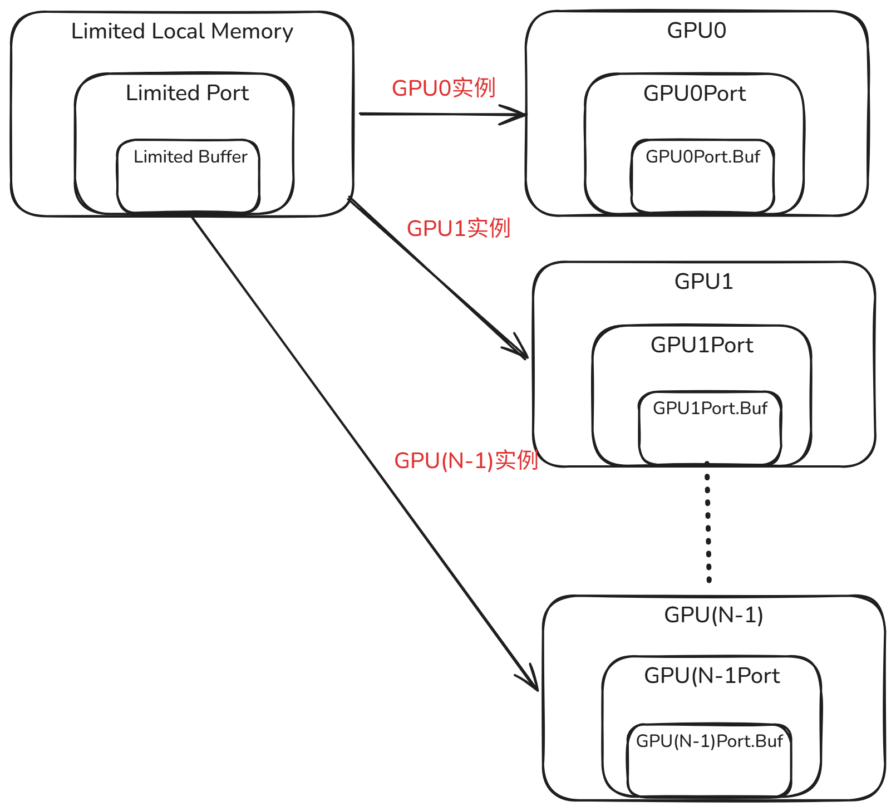
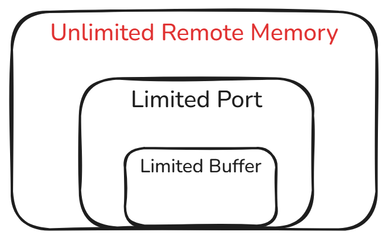

# 内存模型

以 `main.cpp` 中 `PlayTrace()` 函数为例：

```c++
void PlayTrace(triosim::Trace& trace,
               akita::sim::SerialEngine* engine,
               triosim::TimeEstimator* timeEstimator) {

...
    // 构建硬件平台：GPU MemoryRegions + Remote Memory + 网络
    auto [remoteMemRegion, remotePort, gpuPorts] = BuildHardwarePlatform(tracePlayer, engine);
        
    // 设置默认内存区域为 Remote（GPU 本地内存不足时使用）
    tracePlayer->SetDefaultMemoryRegion(remoteMemRegion);  
    // 将 tensors 加入 default_memory_region_
    tracePlayer->SetTrace(trace, config.batch_size_sim);
...
}
```

这段代码同时完成了内存模型的建模。

---

## 内存建模细节

内存模型由多个 GPU 本地内存（显存）和一份远程内存组成。

程序根据运行时用户指定的 GPU 数量，为每个 GPU 分配独立的本地内存；远程内存则全局共享一份。整体架构如下图所示。

### GPU 本地内存



- 容量有限
- 端口带宽有限
- 初始状态为空，不含任何张量数据（trace）

### 远程内存



- 容量视为无限
- 端口带宽有限
- 初始张量数据（trace）全部存放于此

---

# 网络模型

TrioSim 模拟器可用选用两种网络模型：

- **电气网络**
- **光学网络**

它们区别主要在两个层面：**构建拓扑的方式不同**，以及 **发送消息时的路由和带宽模型不同**。

## 电气网络

### 电气网络构建方式

代码入口是 main.cpp 的 `SetupPacketSwitchingNetwork`。

它做了两件事：

```cpp
networkModel->AddLink(gpuPorts[i], remotePort, config.bandwidth * 1e9, 1e-7);
networkModel->AddLink(gpuPorts[i], gpuPorts[(i + 1) % gpuPorts.size()], ptp_bandwidth * 1e9, 1e-7);
```

含义是：

每个 GPU 都连到 `RemotePort`：

```text
GPU0 -- Remote
GPU1 -- Remote
GPU2 -- Remote
...
```

GPU 之间再构成一个 ring：

```text
GPU0 -- GPU1 -- GPU2 -- ... -- GPU(N-1) -- GPU0
```

所以电气网络是直接用 `AddLink()` 建真实链路。链路存在于：

```cpp
std::map<std::string, std::vector<PSLink*>> links_;
```

也就是 `PacketSwitchingNetworkModel` 里的 `links_`。

### 电气网络路由算法

当两个端口通信时，例如：

```text
GPU0Port -> GPU3Port
```

消息会进入 packetswitching.cpp 的：

```cpp
PacketSwitchingNetworkModel::Send()
```

核心流程是：

```cpp
Route* route = findRoute(msg);
UpdateProgressNextHappenEvent(route);
scheduleNextHappenEvent();
```

`findRoute()` 会：

1. 从 `links_` 构建图。
2. 调用 `calculateShortestPath()` 找路径。
3. 把路径上的每条 `PSLink` 保存到 `Route`。
4. 把这个 route 挂到每条链路上，方便做带宽竞争计算。

路由算法在 packetswitching.cpp：

```cpp
calculateShortestPath()
```

它类似 Dijkstra，不过当前代码的边权是：

```cpp
double weight = ps_link->link->byte_per_second;
double alt = dist[min_node] + weight;
```


电气网络还有一个重要特征：**共享链路会均分带宽**。

在 packetswitching.cpp：

```cpp
current_bw = bw / msg_count;
```

如果同一条链路上有 2 条活动 route，每条 route 拿到一半带宽；如果有 4 条，就每条拿 1/4。

## 光学网络

### 光学网络构建方式

代码入口是 main.cpp。

它不是直接简单建 ring，而是分两步：

```cpp
networkModel->InitHardwareNetwork("mesh", config.num_rows, config.num_cols);
networkModel->InitLogicalNetwork("ring", config.num_rows, config.num_cols);
```

也就是说光学网络有两层：

```text
物理拓扑 hardware network: mesh
逻辑通信拓扑 logical network: ring
```
物理层由 optical.cpp 的 `initHardwareNetworkMesh()` 构建。

例如 `numRows=2, numCols=2`，物理 mesh 是：

```text
GPU0 -- GPU1
 |       |
GPU2 -- GPU3
```

逻辑层由 optical.cpp 的 `buildRing()` 构建。它会先 DFS 生成一个遍历顺序，然后按这个顺序形成 ring。

所以光学网络内部维护了三类图：

```cpp
hardware_links_      // 物理 mesh 链路
logical_links_       // 受端口数量约束后的可用物理链路
logical_channels_    // 逻辑通信关系，例如 ring / butterfly
```

这和电气网络很不一样。电气网络的 `links_` 基本就是实际可走的链路；光学网络则区分“物理能不能连”和“逻辑上谁和谁通信”。


### 光学网络的路由算法


光学网络发送消息时进入 optical.cpp：


```cpp
OpticalNetworkModel::Send()
```


核心代码是：


```cpp
std::vector<std::string> path = getPassbyLinksOrChannels(src, dst, "channel");
```


也就是说，当前 `Send()` 是在 `logical_channels_` 上找路径，而不是直接在 `hardware_links_` 上找路径。


寻路函数是 optical.cpp：


```cpp
getPassbyLinksOrChannels()
```


它用的是 BFS：


```text
从 src 开始
一层一层访问邻居
直到找到 dst
```


如果图中每条边权重相同，BFS 找到的是最少 hop 路径。


光学网络发送时间计算是：


```cpp
latency = channel_path->latency * num_hops;
transfer_time = traffic_bytes / byte_per_second;
evt_time = now + latency + transfer_time;
```

也就是：

```text
完成时间 = 当前时间 + 每跳延迟 * hop 数 + 数据大小 / 带宽
```

当前光学 `Send()` 没有像电气网络那样做“链路并发均分带宽”。它更像端到端估算。


