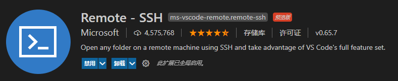

# VSCode 安装插件



# 如何免密连接

## 生成公钥和私钥文件

在本机（即 Windows 系统）中生成 SSH 公钥文件和私钥文件：

```bash

# 方法1: 生成 ed25519 格式公钥和私钥文件
ssh-keygen

# 方法2: 生成 rsa 格式公钥和私钥文件
ssh-keygen -t rsa -b 2048

```

在 Windows 系统中，生成的公钥和私钥文件默认位于 `C:\Users\用户名\.ssh\` 目录下。

## 公钥文件复制到远程服务器

在远程服务器上，`authorized_keys` 文件通常存储在用户的 `.ssh` 目录中。具体路径可能为 `~/.ssh/authorized_keys`。如果没有该文件，新建即可。

将公钥中的内容复制到 `~/.ssh/authorized_keys` 文件中即可。


# VSCode config 文件

VSCode 远程连接服务器时，可以配置相应的 config。如下：


## 参考格式

```
Host 任意用户名
  HostName 主机的IP地址/域名
  User 主机上的用户名
  Port 端口号
  IdentityFile 私钥文件
```

## 举例

```bash
Host my_device1
  HostName 10.7.124.11
  User yiyang
  Port 22
  IdentityFile C:\Users\i26298\.ssh\id_ed25519

Host my_device2
  HostName 10.7.124.11
  User i26298
  Port 22
  IdentityFile C:\Users\i26298\.ssh\id_ed25519
```
