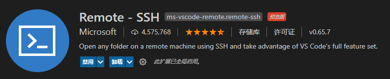
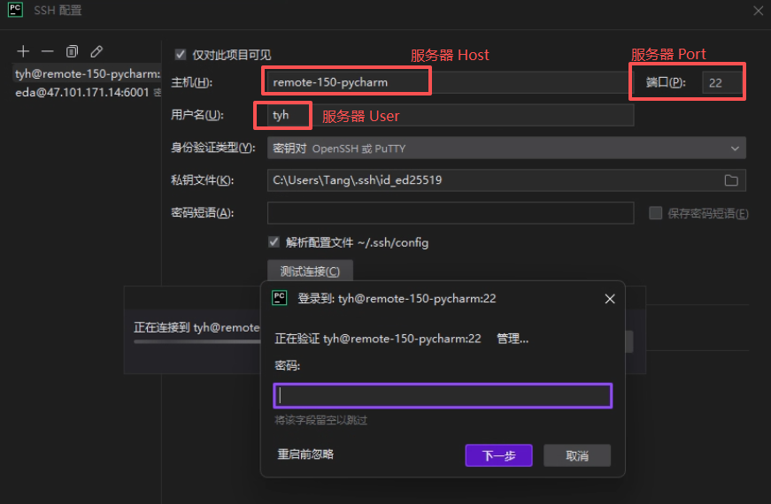

# VSCODE 远程连接

## VSCode 安装插件



## 如何免密连接

### 生成公钥和私钥文件

在本机（即 Windows 系统）中生成 SSH 公钥文件和私钥文件：

```bash

# 方法1: 生成 ed25519 格式公钥和私钥文件
ssh-keygen

# 方法2: 生成 rsa 格式公钥和私钥文件
ssh-keygen -t rsa -b 2048

```

在 Windows 系统中，生成的公钥和私钥文件默认位于 `C:\Users\用户名\.ssh\` 目录下。

### 公钥文件复制到远程服务器

在远程服务器上，`authorized_keys` 文件通常存储在用户的 `.ssh` 目录中。具体路径可能为 `~/.ssh/authorized_keys`。如果没有该文件，新建即可。

将公钥中的内容复制到 `~/.ssh/authorized_keys` 文件中。


## VSCode config 文件

VSCode 远程连接服务器时，可以配置相应的 config。如下：


### 参考格式

```
Host 任意用户名
  HostName 主机的IP地址/域名
  User 主机上的用户名
  Port 端口号
  IdentityFile 私钥文件
```

### 举例

```bash
Host my_device1
  HostName 10.7.124.11
  User yiyang
  Port 22
  IdentityFile C:\Users\i26298\.ssh\id_ed25519

Host my_device2
  HostName 10.7.124.11
  User i26298
  Port 22
  IdentityFile C:\Users\i26298\.ssh\id_ed25519
```

# Pycharm SSH 远程连接

**注意只有 Pycharm 专业版才能进行 SSH 远程连接**。

首先，配置相应的 config 文件，即前面说的 **vscode config**：

```bash
# 跳板机
Host eda
  HostName 47.101.171.14
  Port 6001
  User eda
  IdentityFile C:\Users\Tang\.ssh\id_ed25519

# 服务器 
Host remote-150-pycharm
  HostName 202.197.4.150
  User tyh
  ProxyCommand ssh -W %h:%p eda
  IdentityFile C:\Users\i26298\.ssh\id_ed25519_bastion_i26298

```
特别注意，**此处使用的跳板命令是：`ProxyCommand ssh -W %h:%p eda`**。

然后，在 Pycharm 的部署中，增加 ssh 配置如下图：



即可远程连接。
