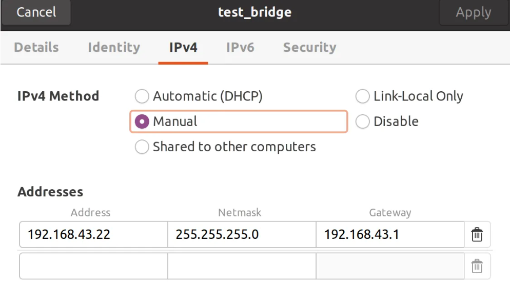

# 参考

[玩转Ubuntu SSH：从零开始开启远程连接大门](https://zhuanlan.zhihu.com/p/1905805744403637197)

[Ubuntu设置静态IP地址的几种方法（亲测有效）](https://blog.csdn.net/fun_tion/article/details/126750615)

[ubuntu20.04和22.04关闭自动休眠，息屏](https://blog.csdn.net/qq_29103181/article/details/139408264)

[Ubuntu修改DNS方法（临时和永久修改DNS）](https://blog.csdn.net/weixin_44304605/article/details/135850791)

[Linux 如何将用户设为管理员（Admin）：详细指南](https://geek-blogs.com/blog/linux-make-user-admin/)

---

# 环境

- **服务器**：Ubuntu 20.04，带图形化 UI
- **主机**：windows 11

---

# 配置过程

> 以下的全部配置操作，均基于 Ubuntu 20.04 服务器进行。

## 获取 sudo 权限

一个有 sudo 权限的用户，可以给其他用户配置 sudo 权限。

### 添加用户到特权组

```bash
usermod -aG <特权组名称> <用户名>
```
- `a`：追加到组（避免覆盖原有组）。
- `G`：指定附加组。

假设创建了用户 bob，需将其设为管理员：

```bash
# 切换到 root（或使用 sudo）
su - 
 
# 添加 bob 到 sudo 组
usermod -aG sudo bob
 
# 验证用户组（应显示 sudo）
groups bob  # 输出：bob : bob sudo
```

无需额外配置，bob 现在已拥有 sudo 权限（注销并重新登录后生效）。

## 配置 SSH 运行远程连接

### Step 1: 更新软件包列表

```bash
sudo apt update
```
若在执行更新时遇到源错误，可更换镜像源解决，详见 [Ubuntu 20.04 换国内源](https://zhuanlan.zhihu.com/p/421178143)。请注意，源的版本需与系统版本严格对应。

### Step 2: 安装 SSH 服务核心组件 (OpenSSH Server)

Ubuntu桌面版默认可能只有 SSH 客户端，想让别人连进来，服务端 (openssh-server) 必须装上。

```bash
sudo apt install openssh-server
```

测试安装是否成功：

```bash
sudo systemctl status ssh
```

如果一切正常，你会看到 Active: active (running) 的字样:

```bash
● ssh.service - OpenBSD Secure Shell server
     Loaded: loaded (/lib/systemd/system/ssh.service; enabled; vendor preset: enabled)
     Active: active (running) since Tue 2025-05-13 13:20:05 CDT; 5s ago
       Docs: man:sshd(8)
             man:sshd_config(5)
   Main PID: 5678 (sshd)
      Tasks: 1 (limit: 4600)
     Memory: 1.3M
        CPU: 6ms
     CGroup: /system.slice/ssh.service
             └─5678 /usr/sbin/sshd -D

May 13 13:20:05 your-hostname systemd[1]: Starting OpenBSD Secure Shell server...
May 13 13:20:05 your-hostname sshd[5678]: Server listening on 0.0.0.0 port 22.
May 13 13:20:05 your-hostname sshd[5678]: Server listening on :: port 22.
May 13 13:20:05 your-hostname systemd[1]: Started OpenBSD Secure Shell server.
```

如果显示 `inactive (dead)`，那就手动启动一下：
```bash
sudo systemctl start ssh
```

然后开启 SSH 开机自启：

```bash
sudo systemctl enable ssh
```

### Step 3: 防火墙放行 SSH

当 UFW（Uncomplicated Firewall）防火墙开启时，必须为 SSH 手动放行，否则远程连接会被拦截。SSH 服务默认使用 22 号端口。

首先检查是否开启 UFW:
```bash
sudo ufw status
```
- 如果输出 `Status: inactive`，则 UFW 是关闭的。
- 如果输出 `Status: active`，则 UFW 是开启的，进行后续操作。

允许 SSH 流量：
```bash
sudo ufw allow ssh
```
或者精确指定端口和协议：
```bash
sudo ufw allow 22/tcp
```
终端会告诉你规则已添加：
```bash
Rule added
Rule added (v6)
```
检查一下UFW状态，确保规则生效：
```bash
sudo ufw status
```
你应该能看到类似这样的输出，表明22端口（SSH）已经被允许了：
```bash
Status: active

To                         Action      From
--                         ------      ----
22/tcp                     ALLOW       Anywhere
22/tcp (v6)                ALLOW       Anywhere (v6)
```
> **注意：** 如果你的 UFW 之前是关闭的 (Status: inactive)，想启用它，记得先执行 `sudo ufw allow ssh`，再执行 `sudo ufw enable`。不然，一旦启用 UFW，你可能就立刻失去 SSH 访问权限了，远程访问会断开。

### Step 3：关闭电脑自动休眠

查看自动休眠状态：

```bash
systemctl status sleep.target
```

如显示下面的内容则表示已关闭自动休眠:

```bash
● sleep.target
     Loaded: masked (Reason: Unit sleep.target is masked.)
     Active: inactive (dead)
```

如果没有关闭则执行以下命令关闭自动休眠，执行后再查询自动休眠状态看一下是否成功:

```bash
sudo systemctl mask sleep.target suspend.target hibernate.target hybrid-sleep.target
```


### Step 4: 设置静态 IP 地址

如果服务器不设置静态 IP 地址，每次重启服务器，它都会通过 DHCP 获取动态 IP 地址，从而造成无法访问。

#### 先查服务器的 IP 地址

```bash
hostname -I
```

`hostname -I` 通常会直接显示一个或多个 IP 地址：
```bash
10.7.104.195 172.17.0.1
```
一般局域网内用那个 `192.168.x.x` 或者 `10.x.x.x` 格式的。

#### 再通过路由表查服务器的网关

```bash
route -n
```

输出类似：

```bash
Kernel IP routing table
Destination     Gateway         Genmask         Flags Metric Ref    Use Iface
0.0.0.0         10.7.104.1      0.0.0.0         UG    100    0        0 eno1
10.7.104.0      0.0.0.0         255.255.255.0   U     100    0        0 eno1
169.254.0.0     0.0.0.0         255.255.0.0     U     1000   0        0 eno1
172.17.0.0      0.0.0.0         255.255.0.0     U     0      0        0 docker0
```

`Destination` 为 `0.0.0.0` 对应的 `Gateway` 就是网关，此处为 `10.7.104.1`。

#### 图形化界面配置静态 IP 地址

打开网络连接的界面，打开手动配置 IP 地址。



根据之前的信息，配置如下：

- **Address**: `10.7.104.195`
- **Gateway**: `10.7.104.1`
- **Netmask**: `255.255.255.0`
- **DNS**: `8.8.8.8 114.114.115.115`

> Network 和 DNS 的配置都是固定的。

此时就可以通过 IP 地址 `10.7.104.195` 连接这台服务器。

连接方法参考 [VSCode SSH 免密远程连接配置](https://my-webpage-adu.pages.dev/posts/%E5%A4%87%E5%BF%98%E5%BD%95/2026-05-17-vscode-ssh-%E5%85%8D%E5%AF%86%E8%BF%9C%E7%A8%8B%E8%BF%9E%E6%8E%A5%E9%85%8D%E7%BD%AE/)。


