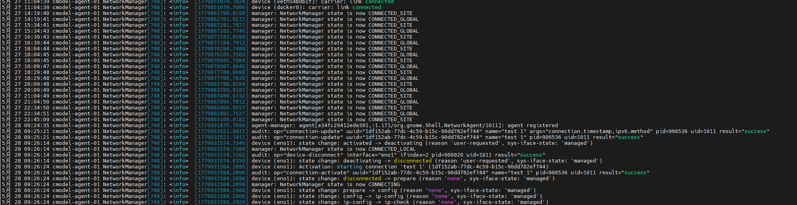

# 参考

[玩转Ubuntu SSH：从零开始开启远程连接大门](https://zhuanlan.zhihu.com/p/1905805744403637197)

[Ubuntu设置静态IP地址的几种方法（亲测有效）](https://blog.csdn.net/fun_tion/article/details/126750615)

[ubuntu20.04和22.04关闭自动休眠，息屏](https://blog.csdn.net/qq_29103181/article/details/139408264)

[Ubuntu修改DNS方法（临时和永久修改DNS）](https://blog.csdn.net/weixin_44304605/article/details/135850791)

[Linux 如何将用户设为管理员（Admin）：详细指南](https://geek-blogs.com/blog/linux-make-user-admin/)

---

# 环境

- **服务器**：Ubuntu 20.04，带图形化 UI
- **主机**：windows 11

---

# 配置过程

> 以下的全部配置操作，均基于 Ubuntu 20.04 服务器进行。

## 获取 sudo 权限

一个有 sudo 权限的用户，可以给其他用户配置 sudo 权限。

### 添加用户到特权组

```bash
usermod -aG <特权组名称> <用户名>
```
- `-a`：追加到组（避免覆盖原有组）。
- `-G`：指定附加组。

假设创建了用户 bob，需将其设为管理员：

```bash
# 切换到 root（或使用 sudo）
su - 
 
# 添加 bob 到 sudo 组
usermod -aG sudo bob
 
# 验证用户组（应显示 sudo）
groups bob  # 输出：bob : bob sudo
```

无需额外配置，bob 现在已拥有 sudo 权限（**注销并重新登录后生效**）。

## 配置 SSH 运行远程连接

### Step 1: 更新软件包列表

```bash
sudo apt update
```
若在执行更新时遇到源错误，可更换镜像源解决，详见 [Ubuntu 20.04 换国内源](https://zhuanlan.zhihu.com/p/421178143)。请注意，源的版本需与系统版本严格对应。

### Step 2: 安装 SSH 服务核心组件 (OpenSSH Server)

Ubuntu桌面版默认可能只有 SSH 客户端，想让别人连进来，服务端 (openssh-server) 必须装上。

```bash
sudo apt install openssh-server
```

测试安装是否成功：

```bash
sudo systemctl status ssh
```

如果一切正常，你会看到 Active: active (running) 的字样:

```bash
● ssh.service - OpenBSD Secure Shell server
     Loaded: loaded (/lib/systemd/system/ssh.service; enabled; vendor preset: enabled)
     Active: active (running) since Tue 2025-05-13 13:20:05 CDT; 5s ago
       Docs: man:sshd(8)
             man:sshd_config(5)
   Main PID: 5678 (sshd)
      Tasks: 1 (limit: 4600)
     Memory: 1.3M
        CPU: 6ms
     CGroup: /system.slice/ssh.service
             └─5678 /usr/sbin/sshd -D

May 13 13:20:05 your-hostname systemd[1]: Starting OpenBSD Secure Shell server...
May 13 13:20:05 your-hostname sshd[5678]: Server listening on 0.0.0.0 port 22.
May 13 13:20:05 your-hostname sshd[5678]: Server listening on :: port 22.
May 13 13:20:05 your-hostname systemd[1]: Started OpenBSD Secure Shell server.
```

如果显示 `inactive (dead)`，那就手动启动一下：
```bash
sudo systemctl start ssh
```

然后开启 SSH 开机自启：

```bash
sudo systemctl enable ssh
```

### Step 3: 防火墙放行 SSH

当 UFW（Uncomplicated Firewall）防火墙开启时，必须为 SSH 手动放行，否则远程连接会被拦截。SSH 服务默认使用 22 号端口。

首先检查是否开启 UFW:
```bash
sudo ufw status
```
- 如果输出 `Status: inactive`，则 UFW 是关闭的。
- 如果输出 `Status: active`，则 UFW 是开启的，进行后续操作。

允许 SSH 流量：
```bash
sudo ufw allow ssh
```
或者精确指定端口和协议：
```bash
sudo ufw allow 22/tcp
```
终端会告诉你规则已添加：
```bash
Rule added
Rule added (v6)
```
检查一下UFW状态，确保规则生效：
```bash
sudo ufw status
```
你应该能看到类似这样的输出，表明22端口（SSH）已经被允许了：
```bash
Status: active

To                         Action      From
--                         ------      ----
22/tcp                     ALLOW       Anywhere
22/tcp (v6)                ALLOW       Anywhere (v6)
```
> **注意：** 如果你的 UFW 之前是关闭的 (Status: inactive)，想启用它，记得先执行 `sudo ufw allow ssh`，再执行 `sudo ufw enable`。不然，一旦启用 UFW，你可能就立刻失去 SSH 访问权限了，远程访问会断开。

### Step 3：关闭电脑自动休眠

查看自动休眠状态：

```bash
# 检查休眠目标是否被屏蔽
systemctl status sleep.target suspend.target hibernate.target hybrid-sleep.target
```

如果显示 `Loaded: masked`，说明已成功禁用。

如果没有关闭则执行以下命令关闭自动休眠，执行后再查询自动休眠状态看一下是否成功:

```bash
# 禁用休眠（hibernate）、挂起到内存（sleep/suspend）、混合休眠（hybrid-sleep）
sudo systemctl mask sleep.target suspend.target hibernate.target hybrid-sleep.target
```


### Step 4: 设置静态 IP 地址

如果服务器不设置静态 IP 地址，每次重启服务器，它都会通过 DHCP 获取动态 IP 地址，从而造成无法访问。

#### 先查服务器的 IP 地址

```bash
hostname -I
```

`hostname -I` 通常会直接显示一个或多个 IP 地址：
```bash
10.7.104.195 172.17.0.1
```
一般局域网内用那个 `192.168.x.x` 或者 `10.x.x.x` 格式的。

#### 再通过路由表查服务器的网关

```bash
route -n
```

输出类似：

```bash
Kernel IP routing table
Destination     Gateway         Genmask         Flags Metric Ref    Use Iface
0.0.0.0         10.7.104.1      0.0.0.0         UG    100    0        0 eno1
10.7.104.0      0.0.0.0         255.255.255.0   U     100    0        0 eno1
169.254.0.0     0.0.0.0         255.255.0.0     U     1000   0        0 eno1
172.17.0.0      0.0.0.0         255.255.0.0     U     0      0        0 docker0
```

`Destination` 为 `0.0.0.0` 对应的 `Gateway` 就是网关，此处为 `10.7.104.1`。

#### 图形化界面配置静态 IP 地址

打开网络连接的界面，打开手动配置 IP 地址。


根据之前的信息，配置如下：

- **Address**: `10.7.104.195`
- **Gateway**: `10.7.104.1`
- **Netmask**: `255.255.255.0`
- **DNS**: `8.8.8.8 114.114.115.115`

> Network 和 DNS 的配置都是固定的。

此时就可以通过 IP 地址 `10.7.104.195` 连接这台服务器。

连接方法参考 [VSCode SSH 免密远程连接配置](https://my-webpage-adu.pages.dev/posts/%E5%A4%87%E5%BF%98%E5%BD%95/2026-05-17-vscode-ssh-%E5%85%8D%E5%AF%86%E8%BF%9C%E7%A8%8B%E8%BF%9E%E6%8E%A5%E9%85%8D%E7%BD%AE/)。

---

# 故障排除

## 网络突然断开

配置静态 IP 地址后，服务器第一天正常联网，但是第二天就无法联网了。

**临时解决方法：在 UI 图形界面关闭网络，然后重新打开网络，网络就恢复了。**

### 排查过程
查看日志:

```bash
sudo journalctl -u NetworkManager --since "24 hours ago"
```
显示：


其中：
- `CONNECTED_SITE`: 连接到了本地网络/内网，但 NetworkManager 认为还没有确认能访问互联网
- `CONNECTED_GLOBAL`: NetworkManager 认为已经可以访问互联网

即：
```bash
5月 27 22:45:09 cmodel-agent-01 NetworkManager[748]: <info>  [1779893109.8182] manager: NetworkManager state is now CONNECTED_SITE
```
后，网络一直无法访问互联网了。

### 解决方法 1（失败）：

> 下面的设置是一种正确的设置，但是无法解决这个问题。

重新设置 NetworkManager：

```bash
sudo vim /etc/netplan/01-network-manager-all.yaml
```

配置如下：

```bash
network:
  version: 2
  renderer: NetworkManager
  ethernets:
    eno1:
      dhcp4: no
      addresses:
        - 10.7.104.195/24
      routes:
        - to: default
          via: 10.7.104.1
      nameservers:
        addresses:
          - 114.114.115.115
          - 8.8.8.8
      wakeonlan: false
```

其中：
- `10.7.104.195/24`: 静态 IP 地址 / 子网掩码（固定为 24）
- `10.7.104.1`: 网关
- `114.114.115.115` 和 `8.8.8.8`: DNS
- `wakeonlan: false`: 关闭网卡的“网络唤醒”功能。看看这个能不能避免网卡进入某些等待唤醒的省电模式。

保存后，应用网络配置，使修改后的网络设置生效：
```bash
sudo netplan try
sudo netplan apply
```
查看：
```bash
nmcli connection show --active
```

### 解决方法 2（成功）：

查看以太网：

```bash
sudo nmcli device status | grep ethernet
```

假如所用网卡名为 eno1, 则断开该网卡连接和开启连接：
```bash
sudo nmcli device disconnect eno1
sudo nmcli device connect eno1
```

写一个简单脚本检测外网，如果监测到外网不通就重连：
例如：
```bash
sudo vim check_eno1.sh
```
写入：
```bash
#!/usr/bin/env bash

IFACE="eno1" # 根据实际以太网名修改

# 要激活的网络连接名称（根据实际配置名修改）
CONN_AUTO="set_auto"     # auto 配置
CONN_FIXED="set_fixed"   # 静态 IP 配置

# 用于测试外网连通性的地址
# 这里用 1.1.1.1，避免 DNS 问题影响判断
PING_TARGET="1.1.1.1"

# ping 超时时间，单位秒
PING_TIMEOUT=3

log() {
    echo "[$(date '+%F %T')] $*"
}

get_device_state() {
    nmcli -t -f DEVICE,STATE device status | awk -F: -v dev="$IFACE" '$1 == dev {print $2}'
}

connect_iface() {
    log "Trying to connect $IFACE ..."
    nmcli device connect "$IFACE"
}

disconnect_iface() {
    log "Trying to disconnect $IFACE ..."
    nmcli device disconnect "$IFACE"
}

internet_ok() {
    ping -I "$IFACE" -c 2 -W "$PING_TIMEOUT" "$PING_TARGET" >/dev/null 2>&1
}

restart_iface() {
    log "Restarting $IFACE ..."
    disconnect_iface
    sleep 2
    connect_iface
}

# 外网不通时的修复操作
fix_connectivity() {
    log "Internet is NOT reachable through $IFACE. Executing recovery steps..."

    log "Step 1: Restarting NetworkManager..."
    if sudo systemctl restart NetworkManager; then
        log "NetworkManager restarted successfully."
    else
        log "WARNING: Failed to restart NetworkManager."
    fi

    sleep 2

    log "Step 2: Disconnecting device $IFACE..."
    if sudo nmcli device disconnect "$IFACE"; then
        log "Device $IFACE disconnected."
    else
        log "WARNING: Failed to disconnect $IFACE."
    fi

    sleep 2

    log "Step 3: Connecting device $IFACE..."
    if sudo nmcli device connect "$IFACE"; then
        log "Device $IFACE connected."
    else
        log "WARNING: Failed to connect $IFACE."
    fi

    sleep 2

    log "Step 4: Bringing up connection '$CONN_AUTO'..."
    if sudo nmcli connection up "$CONN_AUTO"; then
        log "Connection '$CONN_AUTO' activated."
    else
        log "WARNING: Failed to bring up '$CONN_AUTO'."
    fi

    sleep 20

    log "Step 5: Bringing up connection '$CONN_FIXED'..."
    if sudo nmcli connection up "$CONN_FIXED"; then
        log "Connection '$CONN_FIXED' activated."
    else
        log "WARNING: Failed to bring up '$CONN_FIXED'."
    fi

    # 最后验证是否恢复
    sleep 10
    if internet_ok; then
        log "Recovery successful! Internet is now reachable."
    else
        log "Recovery completed, but internet is still NOT reachable."
    fi
}

main() {
    state="$(get_device_state)"

    if [ -z "$state" ]; then
        log "ERROR: device $IFACE not found."
        exit 1
    fi

    log "$IFACE state: $state"

    case "$state" in
        connected)
            log "$IFACE is connected. Checking internet connectivity..."

            if internet_ok; then
                log "Internet is reachable through $IFACE. Nothing to do."
            else
                fix_connectivity
            fi
            ;;

        disconnected)
            log "$IFACE is disconnected. Connecting..."
            connect_iface
            ;;

        connecting)
            log "$IFACE is already connecting. Nothing to do."
            ;;

        unavailable)
            log "ERROR: $IFACE is unavailable. Please check cable or device status."
            exit 2
            ;;

        unmanaged)
            log "ERROR: $IFACE is unmanaged by NetworkManager."
            exit 3
            ;;

        *)
            log "$IFACE is in state '$state'. Trying to reconnect..."
            restart_iface
            ;;
    esac
}

main "$@"

```
`chmod +x` 授权这个脚本，然后加到 cron:

> 特别注意：一定是 `sudo crontab`，一定要加 `sudo`。<br>
`sudo crontab` 是有 `sudo` 权限的 cron； `crontab` 是没有 `sudo` 权限的 cron，它们两个是不同的两个进程。

```bash
sudo crontab -e
```
会打开 cron，编辑为：

```bash
# 每分钟执行一次
* * * * * /path/to/your/script.sh

# 每5分钟执行一次
*/5 * * * * /path/to/your/script.sh

# 每小时执行一次
0 * * * * /path/to/your/script.sh

# 每天凌晨2点执行
0 2 * * * /path/to/your/script.sh

# 每周一早上8点执行
0 8 * * 1 /path/to/your/script.sh
```

crontab 格式：

```plaintext
分 时 日 月 星期 命令
```

查看是否成功加入 cron：

```bash
sudo  crontab -l
```

```bash
sudo systemctl status cron
# 如果没运行
sudo systemctl start cron
sudo systemctl enable cron  # 开机自启
```

```bash
# Ubuntu 20.04 默认日志
sudo grep CRON /var/log/syslog

# 实时查看
sudo tail -f /var/log/syslog | grep CRON
```

