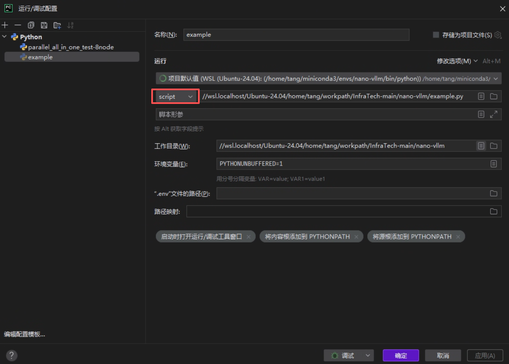
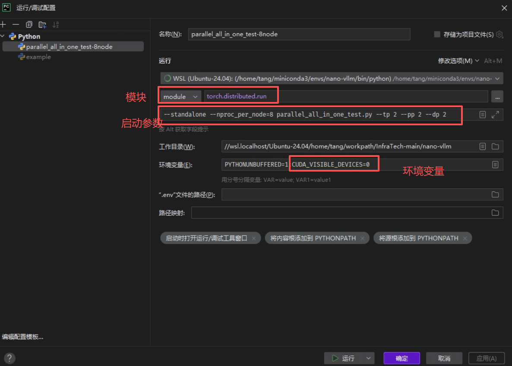

# PyCharm 调试

PyCharm 提供两种主要的调试配置：**Script** 与 **Module**。

## Script 调试

Script 调试即常规的 `python3` 直接运行脚本的方式，同时支持指定命令行参数。

## Module 调试

Module 调试适用于非标准的启动方式，例如通过 `torchrun` 启动：

> ⚠️ **注意**：分布式训练场景下通常不建议使用 PyCharm 调试，因为多进程环境容易引发死锁。此类场景一般通过日志输出进行排查。具体做法可参考 [torch.distributed 分布式训练（02）：基本用法](https://my-webpage-adu.pages.dev/posts/%E8%AE%AD%E7%BB%83%E4%BC%98%E5%8C%96/2026-08-06-torch-distributed-%E5%88%86%E5%B8%83%E5%BC%8F%E8%AE%AD%E7%BB%83-02-%E5%9F%BA%E6%9C%AC%E7%94%A8%E6%B3%95/) 中日志的使用方法。

