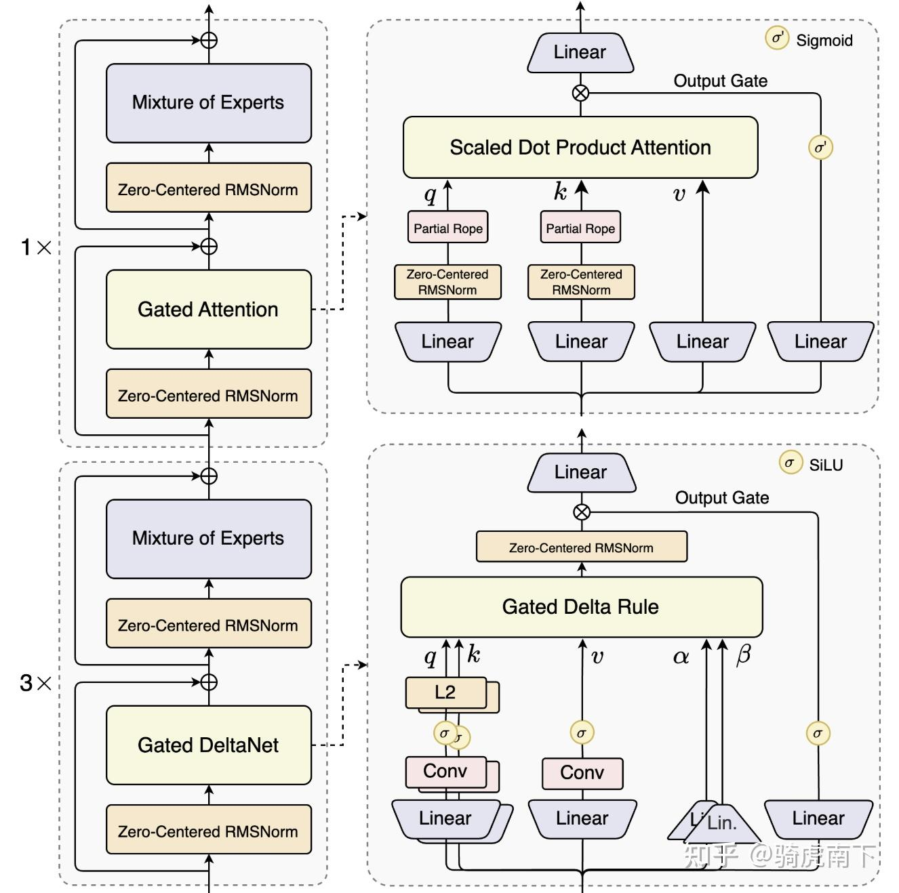
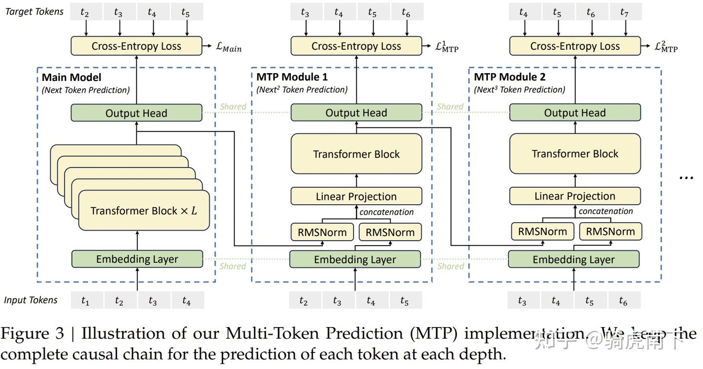
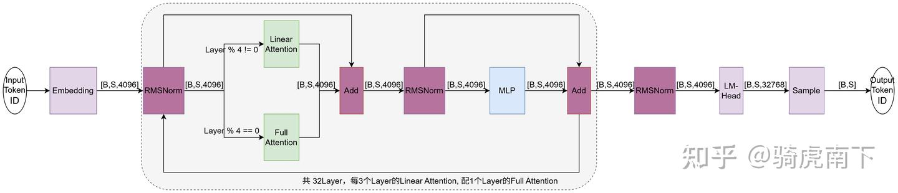
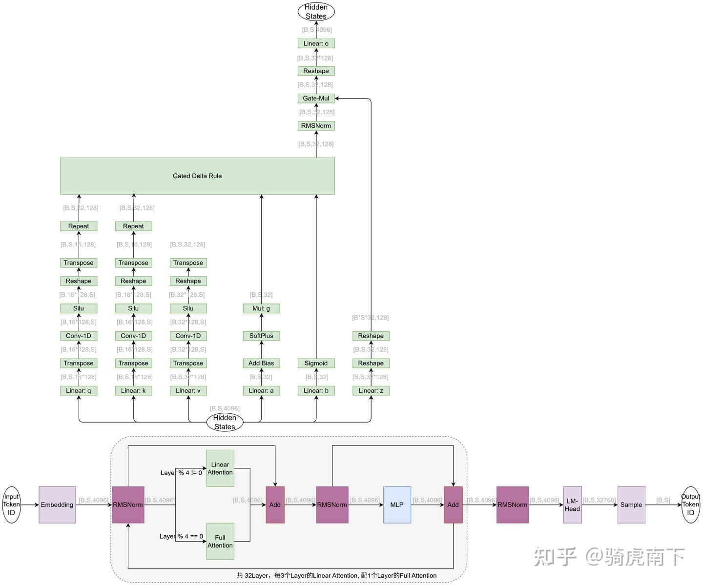
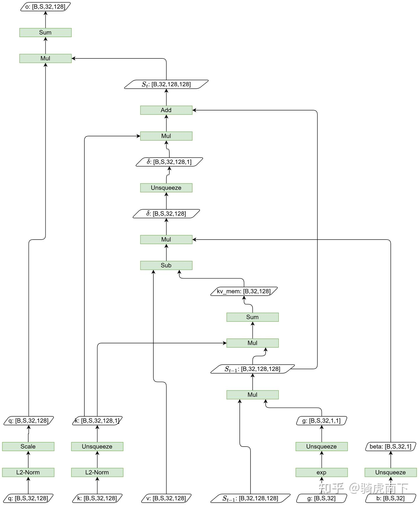

> [Harness 使用 (0)：目录](https://my-webpage-adu.pages.dev/posts/%E5%A4%87%E5%BF%98%E5%BD%95/2026-09-24-harness-%E4%BD%BF%E7%94%A8-0-%E7%9B%AE%E5%BD%95/)

# 1. 模型架构图

对于 LLM 整体架构图，可以使用以下参考图：

# 2. 模型计算流程图

对于 LLM 每个模块内部的计算流程，可以使用以下参考图：

