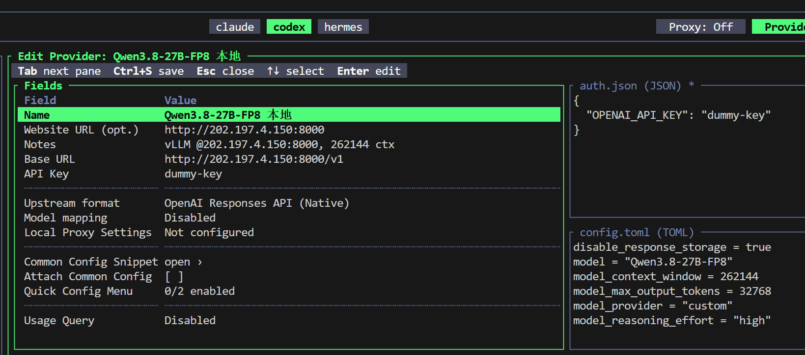
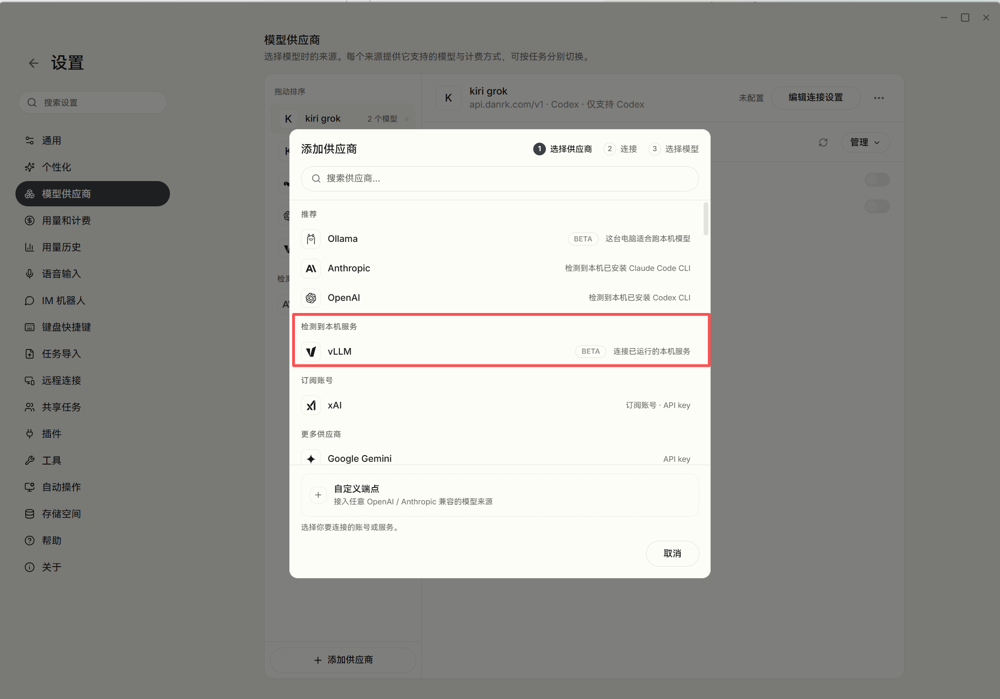
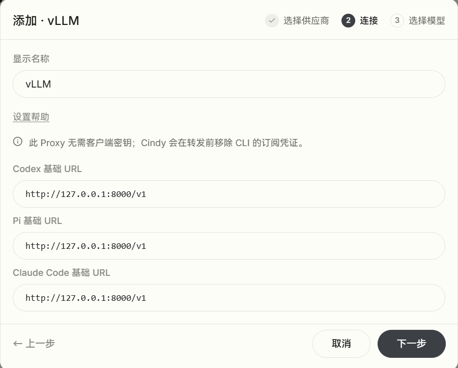
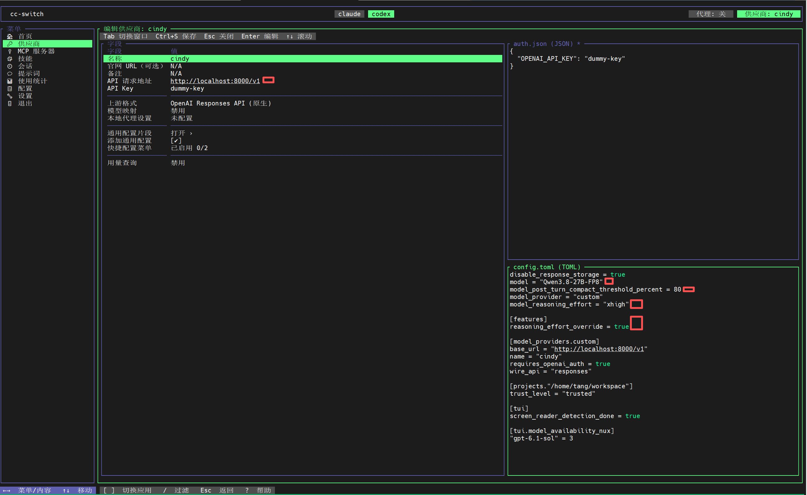

# 0. 适用情况

人在外面、只能走跳板机时：本机电脑到 `202.197.4.150` 没有直连路由，本地会话会连不上。解决办法是保持一条隧道（复用你现成的 `remote-150` 配置，自动经 `ProxyJump eda`）：
```
ssh -N -L 8000:127.0.0.1:8000 remote-150
```
这时给本地会话单独加一个供应商（如 vllm-local，`baseUrl` 填 `http://127.0.0.1:8000/v1`），本地任务选它；远端 H100 会话继续用现在的 vllm（`http://202.197.4.150:8000/v1`），任何位置都通。

# 1. 服务器提前部署

需要先在服务器上完成 `Qwen3.8-27B-FP8` 大模型的部署（本文使用 **vLLM**，部署过程略）。

---

# 2. 服务器使用

部署完成后，服务器内 `CC-switch` 的配置参考如下：



> **注意**：需要在 `config.toml` 最开头增加如下字段，并在其后追加 `[features]` 段落：
>
> ```toml
> model_post_turn_compact_threshold_percent = 80
>
> [features]
> reasoning_effort_override = true
> ```
>
> 否则可能出现在 compact 后会自动降低推理强度。


注意，由于服务器和 `202.197.4.150` 是在同一局域网内，所以配置的 `base_url` 也可以改成 `http://202.197.4.150:8000/v1`，不需要经过跳板机。

---

# 3. 本机和本机 WSL 使用

## 3.1 本机与服务器建立隧道

在本地终端执行以下命令，建立本机到服务器的 SSH 隧道：

```cmd
ssh -N -L 8000:127.0.0.1:8000 remote-150
```

> 这里的 remote-150 是已经在 .ssh 中完成了相应的配置。如下：
> ```
> # 目标机：通过跳板机 eda 中转连接
> Host remote-150
>  HostName 202.197.4.150
>  User tyh
>  ProxyJump eda 
>  IdentityFile C:\Users\tang\.ssh\id_ed25519_bastion
>
> # 跳板机（Bastion）
> Host eda
>  HostName 47.101.171.14
>  Port 6001
>  User eda
>  IdentityFile C:\Users\tang\.ssh\id_ed25519_bastion
> ```

**命令解析：**

- `-N`：不执行远程命令，仅做端口转发。
- `-L 8000:127.0.0.1:8000`：将本地的 `8000` 端口转发到服务器的 `127.0.0.1:8000`。
- `-p SSH端口`（可选）：指定 SSH 服务端口，默认 22，上面命令中已省略。
- `用户名@服务器IP`：SSH 登录信息（如 `tyh@202.197.4.150`）。

> ⚠️ **注意：执行后请保持该窗口运行，不要关闭（可最小化到后台）**，否则隧道会随之断开。

**测试**：另开一个本地终端，执行以下命令，应有 JSON 格式的输出：

```cmd
curl http://127.0.0.1:8000/v1/models
```

---

## 3.2 本机使用

### Cindy Harness 配置

在本地 `Cindy Harness` 中添加模型。由于 SSH 隧道已建立，程序通常能自动识别模型，直接选择即可。





---

## 3.3 在 WSL 中使用

保持 3.1 中的 SSH 隧道运行，进入 WSL 执行：

```bash
curl http://127.0.0.1:8000/v1/models
```

此时会发现请求一直没有响应。

这通常是因为配置了代理环境变量（为了使用梯子）：

```bash
http_proxy=http://127.0.0.1:7897    # 以及 HTTP_PROXY / https_proxy / HTTPS_PROXY 等
```

`curl` 会优先遵循这些变量，把请求转发给 `127.0.0.1:7897` 上的本地代理。但 WSL2 有独立的网络命名空间，WSL 内部的 `127.0.0.1` 并不是 Windows 的 `127.0.0.1`——梯子跑在 Windows 侧，在 WSL 里根本连不上，于是请求挂起、无响应。

解决方法：

```bash
# 方式 1：单次绕过代理
curl --noproxy '*' http://127.0.0.1:8000/v1/models

# 方式 2：改用 localhost（若 no_proxy 中包含 localhost，会命中并绕过代理）
curl http://localhost:8000/v1/models
```

同样地，在 `CC-switch` 中按如下图所示配置：



图中关键配置已用**红框**标出，请确保与你的一致。
