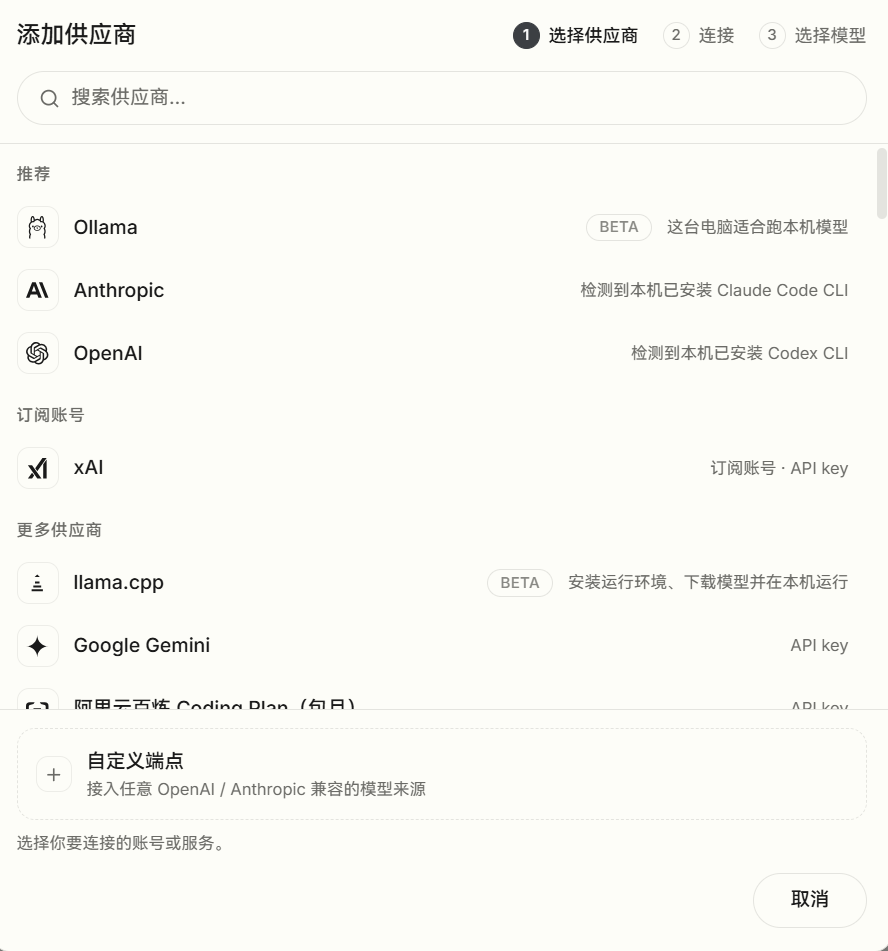
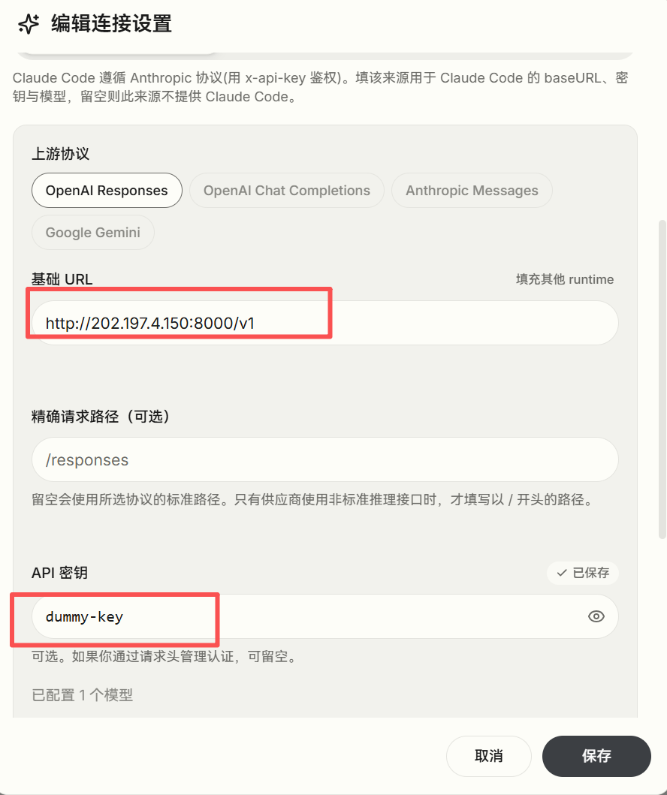

# 0. 适用情况

你的电脑已接入有线内网（可直接访问 `202.197.4.x` 网段）。

# 1. 方案

在 [《vLLM 部署 Qwen3.8-27B-FP8（一）：无有线连接场景下，服务器 / 本地 / WSL 三端的 Harness 使用》](https://my-webpage-adu.pages.dev/posts/%E5%A4%87%E5%BF%98%E5%BD%95/2026-09-29-vllm-%E6%9C%8D%E5%8A%A1%E5%99%A8%E9%83%A8%E7%BD%B2-qwen3-8-27b-fp8-%E6%9C%AC%E5%9C%B0-harness-%E4%BD%BF%E7%94%A8/) 的基础上，由于内网可直接访问 vLLM 所在服务器，**不需要**再额外建立隧道（以下操作不再需要）：


```
ssh -N -L 8000:127.0.0.1:8000 remote-150
```

**只需要**把 `base_url` 改为 vLLM 所在服务器的内网地址：

```
http://202.197.4.150:8000/v1
```

用下面的命令验证是否生效（返回的 JSON 中应包含 `Qwen3.8-27B-FP8`）：

```
curl http://202.197.4.150:8000/v1/models
```

注意：harness 配置中的 `API_Key` 不能留空，填入任意字符（如 `none`）即可——vLLM 服务端不校验密钥，此处仅为满足配置项的必填要求。详细配置过程如下图：





