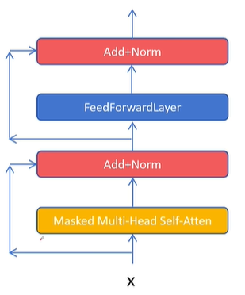
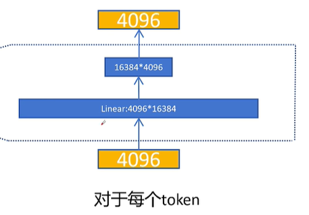
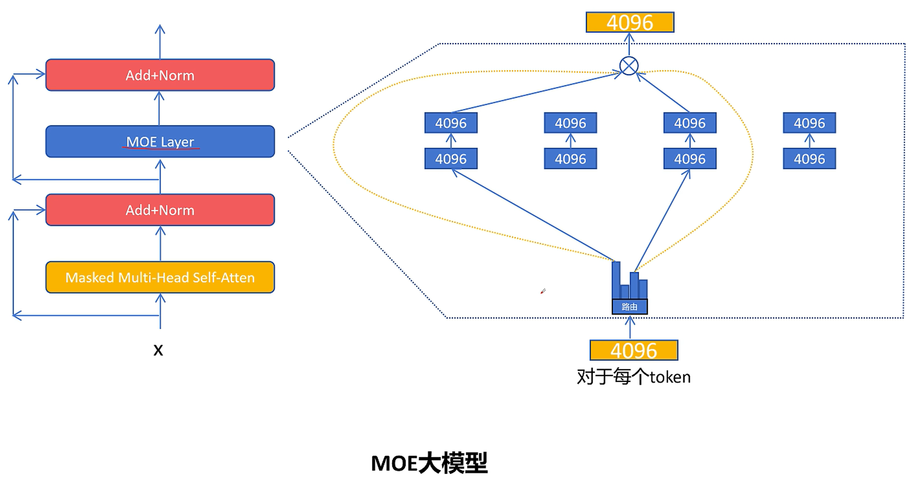

**MoE（混合专家）的核心目标是：在显著降低训练和推理计算代价的同时，保持甚至提升模型的整体能力。**

---

# 从 Dense 模型到 MoE 架构

在标准的 Transformer 中，Attention 机制负责捕捉序列内的长距离依赖关系，而后续的 FeedForward 层则对每个位置的表征进行非线性变换与升维再降维的处理。

MoE 的改造重点正是这个 FeedForward 层。在 Dense 模型中，所有 token 共享同一个巨大的 FeedForward 网络；而在 MoE 架构中，我们将这个单一的 FeedForward 层拆分为多个规模更小的子网络——每一个子网络就是一个**专家（Expert）**。

这样一来，模型在参数总量上得以大幅扩充（因为存在多个专家），但每个 token 在推理时只需激活其中少数几个专家，从而以远低于全量参数的计算成本完成前向传播。

## 路由机制：谁该走哪条路？

既然存在多个专家，就必须有一个**路由网络（Router / Gate）**来决定每个 token 应该交由哪些专家处理。路由网络会为每个 token 输出一组概率值，表示该 token 与各个专家的匹配程度。随后，我们从中挑选出概率最高的前 $k$ 个专家（$k$ 是一个可调的超参数，通常取 1 或 2）。

下图展示了选择两个专家（Top-2）时的数据流：路由网络为当前 token 选出两个最相关的专家，分别计算它们的输出，再按路由权重进行加权求和，最终得到该 token 的 MoE 层输出。

> **关键细节**：专家的选择是**逐 token（per-token）**进行的，而非对整个序列统一路由。同一个序列中不同位置的 token，可能会被分配给完全不同的专家组合。







## 代码实现解析

以下是一段传统 MoE 层的 PyTorch 实现，清晰展示了上述机制的具体落地方式。

### 1. ExpertNetwork —— 单个专家

```python
class ExpertNetwork(nn.Module):
    def __init__(self, hidden_size, intermediate_size):
        self.linear1 = nn.Linear(hidden_size, intermediate_size)
        self.linear2 = nn.Linear(intermediate_size, hidden_size)
    
    def forward(self, x):
        x = self.linear1(x)          # 升维：hidden_size → intermediate_size
        x = nn.functional.relu(x)    # ReLU 激活
        output = self.linear2(x)     # 降维：intermediate_size → hidden_size
        return output
```

每个专家本质上就是一个精简版的 FeedForward 网络：先通过 `linear1` 将特征升维，经 ReLU 激活后，再通过 `linear2` 降维回原始维度。

### 2. Router —— 路由网络

```python
class Router(nn.Module):
    def __init__(self, hidden_size, expert_num, top_k):
        self.router = nn.Linear(hidden_size, expert_num)
    
    def forward(self, x):
        x = x.view(-1, self.hidden_size)      # 展平所有 token
        x = self.router(x)                    # 计算每个专家对当前 token 的分数
        x = nn.functional.softmax(x, dim=-1)  # 转换为概率分布
        
        # 选出分数最高的 top_k 个专家
        topk_weight, topk_idx = torch.topk(x, k=self.top_k, dim=-1, sorted=False)
        
        # 对选出的 top_k 权重重新归一化，使其和为 1
        topk_weight = topk_weight / topk_weight.sum(dim=-1, keepdim=True)
        return topk_weight, topk_idx
```

路由网络首先通过 Softmax 得到所有专家的概率分布，然后利用 `torch.topk` 截取出最相关的 $k$ 个专家。这里有一个关键操作——**重新归一化**：由于我们只保留了 $k$ 个专家的分数，其原始概率之和通常小于 1，直接加权会导致输出幅度衰减；因此需要将这 $k$ 个权重除以其总和，使它们重新构成一个局部的概率分布，保证后续加权求和的信号强度一致。

### 3. MOELayer —— 混合专家层（核心组装）

```python
class MOELayer(nn.Module):
    def __init__(self, hidden_size, intermediate_size, expert_num, top_k):
        self.experts = nn.ModuleList([
            ExpertNetwork(hidden_size, intermediate_size) 
            for _ in range(self.expert_num)
        ])
        self.router = Router(hidden_size, expert_num, top_k)
    
    def forward(self, x):  # x: (batch_size, seq_len, hidden_size)
        batch_size, seq_len, _ = x.size()
        token_num = batch_size * seq_len
        x_flat = x.view(token_num, self.hidden_size)  # 展平为 (N, hidden_size)
        
        # 获取每个 token 的 top-k 专家权重和索引，形状均为 (N, top_k)
        topk_weight, topk_idx = self.router(x_flat)
        
        output = torch.zeros_like(x_flat)  # 初始化输出
        
        # 逐个 token 计算
        for token_idx in range(token_num):
            for expert_idx in range(self.top_k):
                expert = self.experts[topk_idx[token_idx, expert_idx]] # token 经过每个选择的专家
                output[token_idx] += topk_weight[token_idx, expert_idx] * expert(x_flat[token_idx]) # 每个专家的输出按权重加权求和
        
        return output.view(batch_size, seq_len, self.hidden_size)
```

在 `MOELayer` 中，整个流程如下：

1. **展平**：将输入 `(batch, seq_len, hidden)` 展平为 `(N, hidden)`，使每个 token 成为独立的样本；
2. **路由决策**：调用 Router 得到每个 token 对应的 Top-$k$ 专家索引及归一化权重；
3. **稀疏计算**：仅激活被选中的专家，避免全量专家前向传播带来的巨大开销；
4. **加权聚合**：将 $k$ 个专家的输出按权重累加，得到该 token 的最终表征，最后恢复为原始序列形状。

### 4. 使用示例

```python
HIDDEN_SIZE = 4096        # 隐藏层维度
INTERMEDIATE_SIZE = 2048  # 专家内部升维维度
EXPERT_NUM = 8            # 总共 8 个专家
TOP_K = 2                 # 每个 token 激活 2 个专家

inputs = torch.randn((2, 11, 4096))  # batch=2, seq_len=11, hidden=4096
moe_layer = MOELayer(HIDDEN_SIZE, INTERMEDIATE_SIZE, EXPERT_NUM, TOP_K)
outputs = moe_layer(inputs)
print(outputs.size())  # 输出: torch.Size([2, 11, 4096])
```

上述示例中，输入为 2 个序列、每序列 11 个 token、特征维度 4096。经过 MoE 层后，输出形状保持不变，但每个 token 的隐层表征已经由 2 个动态选出的专家协同处理并加权融合完成。这种**参数大量化、计算稀疏化**的设计，正是 MoE 能够在扩大模型容量的同时控制计算成本的关键所在。

## MoE 特点

- 相同计算代价下，可以增大网络参数规模，性能更好。
- 基本可以达到相同参数规模的稠密网络性能。
- 相比同等参数规模的稠密网络，计算代价变小。
- 相比同等参数规模的稠密网络，显存占用不变。
- 可能有专家负载不均衡问题，训练难度增大。
