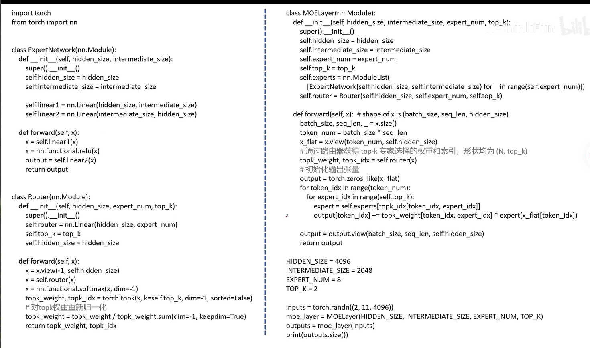
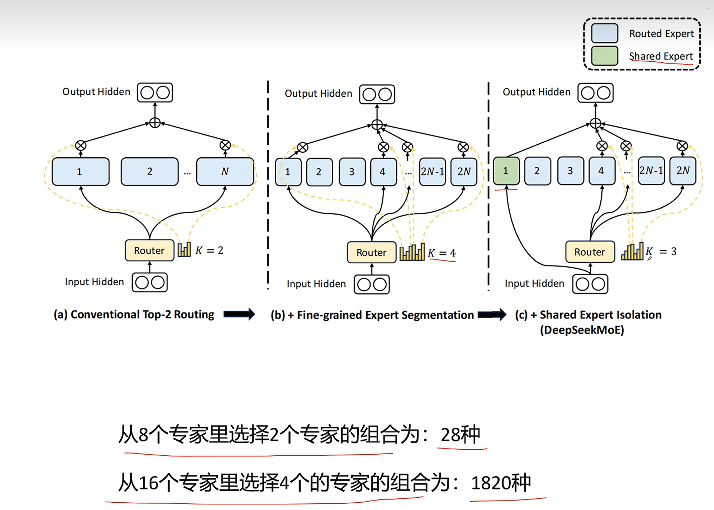
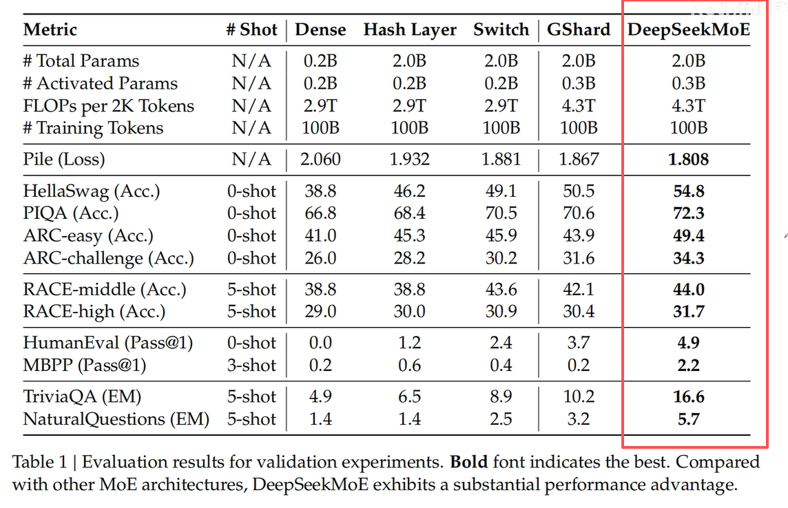
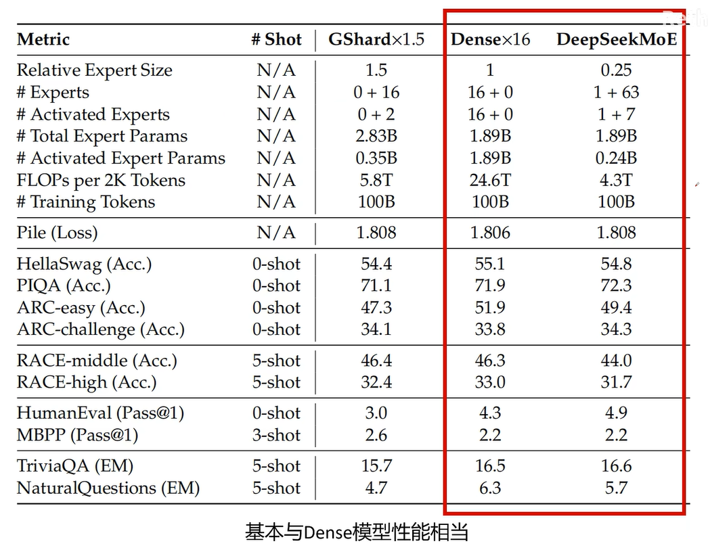
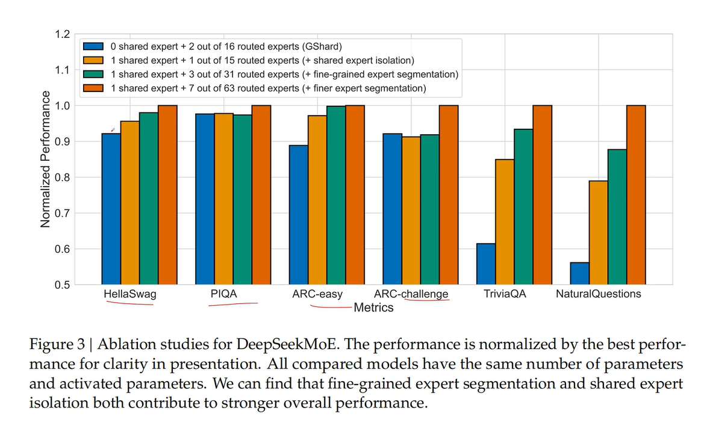
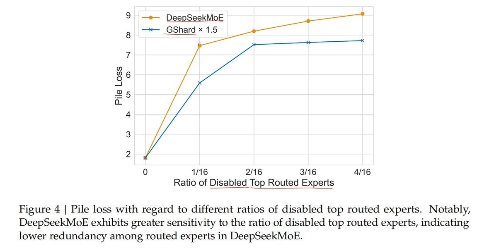
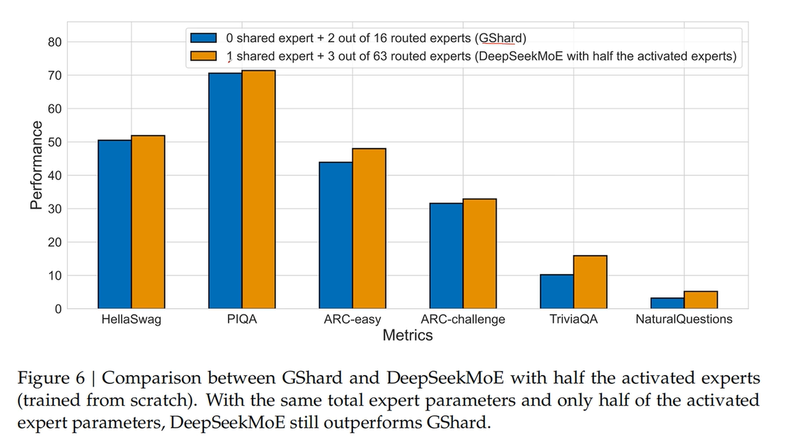
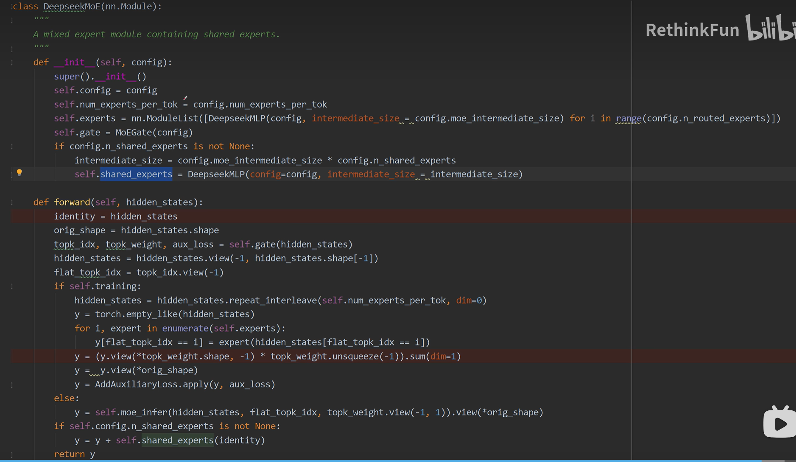

**MoE（混合专家）的核心目标是：在显著降低训练和推理计算代价的同时，保持甚至提升模型的整体能力。**

参考[DeepSeek-MOE 原理讲解](https://www.bilibili.com/video/BV1uUPieDEK1?spm_id_from=333.788.videopod.sections&vd_source=e98b669ccbafff4b5aa59dd6303b722f)

---

# 从 Dense 模型到 MoE 架构

在标准的 Transformer 中，Attention 机制负责捕捉序列内的长距离依赖关系，而后续的 FeedForward 层则对每个位置的表征进行非线性变换与升维再降维的处理。如下图：


MoE 的改造重点正是这个 FeedForward 层。在 Dense 模型中，所有 token 共享同一个巨大的 FeedForward 网络；而在 MoE 架构中，我们将这个单一的 FeedForward 层拆分为多个规模更小的子网络——每一个子网络就是一个**专家（Expert）**。

这样一来，每个 token 在推理时只需激活其中少数几个专家，从而以远低于全量参数的计算成本完成前向传播。

## 路由机制：谁该走哪条路？

既然存在多个专家，就必须有一个 **路由网络（Router / Gate）** 来决定每个 token 应该交由哪些专家处理。路由网络会为每个 token 输出一组概率值，表示该 token 与各个专家的匹配程度。随后，我们从中挑选出概率最高的前 $k$ 个专家（$k$ 是一个可调的超参数，通常取 1 或 2）。

下图展示了选择两个专家（Top-2）时的数据流：路由网络为当前 token 选出两个最相关的专家，分别计算它们的输出，再按路由权重进行加权求和，最终得到该 token 的 MoE 层输出。

> **关键细节**：专家的选择是 **逐 token（per-token）** 进行的，而非对整个序列统一路由。同一个序列中不同位置的 token，可能会被分配给完全不同的专家组合。


## 代码实现解析

以下是一段传统 MoE 层的 PyTorch 实现，清晰展示了上述机制的具体落地方式。



### 1. ExpertNetwork —— 单个专家

```python
class ExpertNetwork(nn.Module):
    def __init__(self, hidden_size, intermediate_size):
        self.linear1 = nn.Linear(hidden_size, intermediate_size)
        self.linear2 = nn.Linear(intermediate_size, hidden_size)
    
    def forward(self, x):
        x = self.linear1(x)          # 升维：hidden_size → intermediate_size
        x = nn.functional.relu(x)    # ReLU 激活
        output = self.linear2(x)     # 降维：intermediate_size → hidden_size
        return output
```

每个专家本质上就是一个精简版的 FeedForward 网络：先通过 `linear1` 将特征升维，经 ReLU 激活后，再通过 `linear2` 降维回原始维度。

### 2. Router —— 路由网络

```python
class Router(nn.Module):
    def __init__(self, hidden_size, expert_num, top_k):
        self.router = nn.Linear(hidden_size, expert_num)
    
    def forward(self, x):
        x = x.view(-1, self.hidden_size)      # 展平所有 token
        x = self.router(x)                    # 计算每个专家对当前 token 的分数
        x = nn.functional.softmax(x, dim=-1)  # 转换为概率分布
        
        # 选出分数最高的 top_k 个专家: 
        # topk_weight 为专家的概率分布；topk_idx 为专家的索引
        topk_weight, topk_idx = torch.topk(x, k=self.top_k, dim=-1, sorted=False)
        
        # 对选出的 top_k 权重重新归一化，使其和为 1
        topk_weight = topk_weight / topk_weight.sum(dim=-1, keepdim=True)
        return topk_weight, topk_idx
```

路由网络首先通过 Softmax 得到所有专家的概率分布，然后利用 `torch.topk` 截取出最相关的 $k$ 个专家。这里有一个关键操作——**重新归一化**：由于我们只保留了 $k$ 个专家的分数，其原始概率之和小于 1，直接加权会导致输出幅度衰减；因此需要将这 $k$ 个权重除以其总和，使它们重新构成一个局部的概率分布，保证后续加权求和的信号强度一致。

### 3. MOELayer —— 混合专家层（核心组装）

```python
class MOELayer(nn.Module):
    def __init__(self, hidden_size, intermediate_size, expert_num, top_k):
        self.experts = nn.ModuleList([
            ExpertNetwork(hidden_size, intermediate_size) 
            for _ in range(self.expert_num)
        ])
        self.router = Router(hidden_size, expert_num, top_k)
    
    def forward(self, x):  # x: (batch_size, seq_len, hidden_size)
        batch_size, seq_len, _ = x.size()
        token_num = batch_size * seq_len
        x_flat = x.view(token_num, self.hidden_size)  # 展平为 (N, hidden_size)
        
        # 获取每个 token 的 top-k 专家权重和索引，形状均为 (N, top_k)
        topk_weight, topk_idx = self.router(x_flat)
        
        output = torch.zeros_like(x_flat)  # 初始化输出
        
        # 逐个 token 计算
        for token_idx in range(token_num):
            for expert_idx in range(self.top_k):
                expert = self.experts[topk_idx[token_idx, expert_idx]] # token 经过每个选择的专家
                output[token_idx] += topk_weight[token_idx, expert_idx] * expert(x_flat[token_idx]) # 每个专家的输出按权重加权求和
        
        return output.view(batch_size, seq_len, self.hidden_size)
```

在 `MOELayer` 中，整个流程如下：

1. **展平**：将输入 `(batch, seq_len, hidden)` 展平为 `(N, hidden)`，使每个 token 成为独立的样本；
2. **路由决策**：调用 Router 得到每个 token 对应的 Top-$k$ 专家索引及归一化权重；
3. **稀疏计算**：仅激活被选中的专家，避免全量专家前向传播带来的巨大开销；
4. **加权聚合**：将 $k$ 个专家的输出按权重累加，得到该 token 的最终表征，最后恢复为原始序列形状。

### 4. 使用示例

```python
HIDDEN_SIZE = 4096        # 隐藏层维度
INTERMEDIATE_SIZE = 2048  # 专家内部升维维度
EXPERT_NUM = 8            # 总共 8 个专家
TOP_K = 2                 # 每个 token 激活 2 个专家

inputs = torch.randn((2, 11, 4096))  # batch=2, seq_len=11, hidden=4096
moe_layer = MOELayer(HIDDEN_SIZE, INTERMEDIATE_SIZE, EXPERT_NUM, TOP_K)
outputs = moe_layer(inputs)
print(outputs.size())  # 输出: torch.Size([2, 11, 4096])
```

上述示例中，输入为 2 个序列、每序列 11 个 token、特征维度 4096。经过 MoE 层后，输出形状保持不变，但每个 token 的隐层表征已经由 2 个动态选出的专家协同处理并加权融合完成。这种**参数大量化、计算稀疏化**的设计，正是 MoE 能够在扩大模型容量的同时控制计算成本的关键所在。

## MoE 特点

- 相同计算代价下，可以增大网络参数规模，性能更好。
- 基本可以达到相同参数规模的稠密网络性能。
- 相比同等参数规模的稠密网络，计算代价变小。
- 相比同等参数规模的稠密网络，显存占用不变。
- 可能有专家负载不均衡问题，训练难度增大。

## 专家负载均衡

在 MoE（混合专家）模型的训练过程中，为了防止所有 token 都涌向少数几个"热门"专家、导致其他专家闲置，必须引入**专家负载均衡**机制。通常从以下三个层面进行设计：

### 1. 最少选择两个专家（Top-1 + 概率采样）

训练时，要求每个 token 至少要选择 **2 个专家**。具体做法是：先由路由网络选出得分最高的 **Top-1** 专家，然后在剩余的专家中，按照路由概率再采样选择一个专家。这种设计既保证了对最优专家的优先利用，又通过强制引入第二个专家来增加负载的分散程度，避免路由网络过早"坍缩"到单一专家。

### 2. 专家容量限制与残差兜底

为每个专家设置一个 **token 容量上限**。当某个专家接收到的 token 数量达到容量上限后，后续被路由到该专家的 token 将被 **跳过处理**，其输出直接置为全 0。为了避免信息丢失，这些被跳过的 token 会通过 **残差连接** 直接传递到下一层，从而保证模型训练的稳定性与梯度回传的有效性。

### 3. 负载均衡损失

理想情况下，我们希望每个专家被调用的频率大致相等。为此定义专家调用频率：

$$
f_i = \frac{\text{专家 } i \text{ 被调用的次数}}{\text{所有专家被调用的总次数}}
$$

并构造负载均衡损失：

$$
\text{loss}\_{balance} = \sum_{i=1}^{N} (f_i)^2
$$

该损失衡量了专家调用频率的均衡程度——值越小，说明负载越均匀。以 **2 个专家**为例：

| 调用频率 | 损失计算 | 均衡程度 |
|---------|---------|---------|
| $f_1=1,\; f_2=0$ | $1^2 + 0^2 = 1$ | 完全失衡（最大值） |
| $f_1=0.8,\; f_2=0.2$ | $0.8^2 + 0.2^2 = 0.68$ | 轻度失衡 |
| $f_1=0.5,\; f_2=0.5$ | $0.5^2 + 0.5^2 = 0.5$ | 完全均衡（最小值） |

通过最小化该损失，可以促使路由网络更均匀地分配 token 到各个专家[^1]。

[^1]: 可以通过柯西不等式严格证明，为什么只有负载均衡时，loss 能取到最小值。证明过程见 [MoE 负载均衡损失的数学推导：从损失函数下界到 MoE 可微辅助损失](https://my-webpage-adu.pages.dev/posts/%E6%95%B0%E5%AD%A6%E5%8E%9F%E7%90%86/2026-05-30-moe-%E8%B4%9F%E8%BD%BD%E5%9D%87%E8%A1%A1%E6%8D%9F%E5%A4%B1%E7%9A%84%E6%95%B0%E5%AD%A6%E6%8E%A8%E5%AF%BC-%E4%BB%8E%E6%8D%9F%E5%A4%B1%E5%87%BD%E6%95%B0%E4%B8%8B%E7%95%8C%E5%88%B0-moe-%E5%8F%AF%E5%BE%AE%E8%BE%85%E5%8A%A9%E6%8D%9F%E5%A4%B1/#1-f-i)

### 4. 辅助负载均衡损失（可微近似）

然而，上述基于调用次数的负载均衡损失存在一个关键问题：**是否调用某个专家是通过 `torch.topk` 操作决定的，而 `topk` 操作不可微，无法通过梯度下降直接优化。**

因此，需要引入一个**可微的辅助负载均衡损失**作为替代：

$$
\text{loss}\_{balance} = \sum_{i=1}^{N} f_i \cdot p_i
$$

其中：
- $f_i$ 仍为专家 $i$ 被调用的频率占比（作为目标分布，越均匀越好）；
- $p_i$ 是一个批次（batch）中**所有 token 对专家 $i$ 的路由概率的平均值**（由 Router 的 Softmax 输出计算得到，完全可微）。

这个辅助损失通过路由概率的梯度来间接调节负载分布，使得负载均衡可以在端到端的梯度下降中被有效优化，从而解决 `topk` 不可导带来的训练瓶颈。

---

# DeepSeekMoE

[DeepSeekMoE: Towards Ultimate Expert Specialization in Mixture-of-Experts Language Models](https://aclanthology.org/2024.acl-long.70)

## 演化过程

DeepSeekMoE 的演进逻辑是：先把专家"切得更碎"以获得更灵活的组合（Fine-grained），再把"人人都会的常识"抽离出来交给一个共享专家统一处理（Shared Expert Isolation），从而让路由专家们专注于学习真正差异化的知识，实现参数利用效率的最大化。注意，这个过程中，MoE 层的参数总量不变。



## 实验结果

### 性能比较



DeepSeekMoE 性能提升最高。

### 消融实验



消融实验证明，细分专家和提取共享专家都有利于性能提升。



实验通过按不同比例屏蔽权重最高的专家并监测损失变化，结果显示：随着屏蔽比例的增加，DeepSeekMoE 的性能衰减显著强于对比模型。这表明 DeepSeekMoE 中的专家具有更高的专业化程度，其功能分工更为独特且不可替代。



这张图展示了 GShard（传统 MoE）与 DeepSeekMoE 在相同总专家参数量、但 DeepSeekMoE 仅使用一半激活参数量条件下的性能对比。

# DeepSeekMoE 代码




## 1. 初始化 `__init__`：三大核心组件

```python
class DeepseekMoE(nn.Module):
    def __init__(self, config):
        super().__init__()
        self.config = config
        self.num_experts_per_tok = config.num_experts_per_tok  # K：每个token激活几个路由专家
        
        # 组件一：路由专家列表（Routed Experts）
        self.experts = nn.ModuleList([
            DeepseekMLP(config, intermediate_size=config.moe_intermediate_size) 
            for i in range(config.n_routed_experts)  # 如 63 个
        ])
        
        # 组件二：门控网络（Gate / Router）
        self.gate = MoEGate(config)
        
        # 组件三：共享专家（Shared Expert）—— DeepSeekMoE 的核心创新
        if config.n_shared_experts is not None:
            # 共享专家的中间层维度 = 单个路由专家的中间维度 × 共享专家数量
            intermediate_size = config.moe_intermediate_size * config.n_shared_experts
            self.shared_experts = DeepseekMLP(config, intermediate_size=intermediate_size)
```

**关键点解析**：

| 组件 | 作用 | 特殊设计 |
|------|------|---------|
| `self.experts` | 存放所有**路由专家**（蓝色块），仅部分被激活 | 共 `n_routed_experts` 个（如63个），每个都是标准 FFN |
| `self.gate` | 路由决策网络 | 输出每个 token 的 Top-K 专家索引、权重、以及**辅助损失 aux_loss** |
| `self.shared_experts` | **共享专家**（绿色块），**所有 token 强制通过** | 其 `intermediate_size` 是单个专家的整数倍，容量更大，用于吸收通用知识 |

---

## 2. 前向传播 `forward`：六步数据流

```python
def forward(self, hidden_states):
    identity = hidden_states                    # 保留原始输入，用于共享专家和残差
    orig_shape = hidden_states.shape          # 如 (batch, seq_len, hidden_dim)
    
    # --- 步骤1：路由决策 ---
    # topk_idx 和 topk_weight 维度都是 (T, K)
    topk_idx, topk_weight, aux_loss = self.gate(hidden_states)
    
    # 展平：将 (batch, seq_len, hidden) → (token_num, hidden)
    hidden_states = hidden_states.view(-1, hidden_states.shape[-1])
    flat_topk_idx = topk_idx.view(-1)         # 展平为 (token_num × K,)
```

**`gate` 输出解读**：
- `topk_idx`：形状 `(token_num, K)`，每个 token 选中的 K 个专家索引（如 K=3）。
- `topk_weight`：形状 `(token_num, K)`，对应的 K 个归一化权重（和为1）。
- `aux_loss`：**负载均衡辅助损失**，后续会挂载到计算图上，用于训练 Router。

---

## 3. 训练路径（`if self.training`）：稀疏激活的精妙实现

训练时不能使用高效的 CUDA fused kernel（因为需要保留计算图求梯度），所以用 **Python 循环 + 掩码索引** 模拟稀疏计算：

```python
if self.training:
    # 核心操作：将每个 token 复制 K 份
    # 假设有 T 个 token，复制后从 (T, H) → (T×K, H)
    hidden_states = hidden_states.repeat_interleave(self.num_experts_per_tok, dim=0)
    
    y = torch.empty_like(hidden_states)  # 初始化输出缓冲区 (T×K, H)
    
    # 遍历所有路由专家
    for i, expert in enumerate(self.experts):
        # flat_topk_idx == i：找出所有被分配给当前专家 i 的 token 副本
        y[flat_topk_idx == i] = expert(hidden_states[flat_topk_idx == i]) 

    # 原生 Python 列表不支持这种语法
    # lst = [1, 2, 3, 4]
    # mask = [True, False, True, False]
    # lst[mask]  # TypeError: list indices must be integers or slices, not list
    # PyTorch Tensor 支持这种语法
    # t = torch.tensor([1, 2, 3, 4])
    # mask = torch.tensor([True, False, True, False])
    # t[mask]  # tensor([1, 3])
```

**`repeat_interleave` 的作用**（极易混淆，重点解释）：

假设有 3 个 token，`num_experts_per_tok = K = 2`：
- 原始 `hidden_states`：`[t0, t1, t2]`，形状 `(3, H)`
- `repeat_interleave(2)` 后：`[t0, t0, t1, t1, t2, t2]`，形状 `(6, H)`
- `flat_topk_idx` 可能是：`[3, 7, 1, 5, 2, 4]`（表示：t0→专家3, t0→专家7, t1→专家1...）

这样，每个 token 的 K 个副本可以分别送入不同的专家。`flat_topk_idx == i` 这个布尔掩码能精确筛选出属于专家 `i` 的那部分 token 副本，实现**批量稀疏计算**且兼容 PyTorch autograd。

---

## 4. 加权聚合：维度变换的"魔术"

```python
    # 将 (T×K, H) 恢复为 (T, K, H)，然后乘以权重并沿 K 维度求和
    y = (y.view(*topk_weight.shape, -1) * topk_weight.unsqueeze(-1)).sum(dim=1)
    y = y.view(*orig_shape)  # 恢复 (batch, seq_len, hidden)
```

**维度拆解**（假设 `topk_weight.shape = (T, K)`）：

| 操作 | 输入形状 | 输出形状 | 作用 |
|------|---------|---------|------|
| `y.view(*topk_weight.shape, -1)` | `(T×K, H)` | `(T, K, H)` | 将每个 token 的 K 个专家输出分开 |
| `topk_weight.unsqueeze(-1)` | `(T, K)` | `(T, K, 1)` | 权重增加维度，便于广播到 hidden 维度 |
| `*` | `(T, K, H) × (T, K, 1)` | `(T, K, H)` | 每个专家的输出乘以其对应权重 |
| `.sum(dim=1)` | `(T, K, H)` | `(T, H)` | 沿 K 维度求和，聚合 K 个专家的加权输出 |

这一步等价于教学版代码中的双重 `for` 循环累加，但完全**向量化**，效率更高。

---

## 5. 辅助损失挂载

```python
    y = AddAuxiliaryLoss.apply(y, aux_loss)
```

`AddAuxiliaryLoss` 是一个自定义的 `torch.autograd.Function`。它在前向传播时将 `aux_loss` 以极小系数加到 `y` 上（不影响输出数值），但在反向传播时**将 aux_loss 的梯度回传到 Gate 网络**，使得负载均衡损失可以通过梯度下降优化 Router 的参数。

---

## 6. 推理路径（`else`）：高效 CUDA Kernel

```python
else:
    y = self.moe_infer(hidden_states, flat_topk_idx, topk_weight.view(-1, 1)).view(*orig_shape)
```

推理时不需要梯度，因此调用 `moe_infer`——这通常是**高度优化的 CUDA 内核**（如 grouped GEMM、fused scatter-gather 等）。它将稀疏路由计算密集化，避免 Python 循环开销，是 MoE 模型高效推理的关键。

---

## 7. 共享专家融合：残差式相加

```python
if self.config.n_shared_experts is not None:
    y = y + self.shared_experts(identity)
```

**这是 DeepSeekMoE 的灵魂**：
- `identity` 是原始输入 `(batch, seq, hidden)`，**所有 token** 都会送入 `shared_experts`。
- 共享专家的输出直接与路由专家的加权输出 **相加**（类似残差连接）。
- 这意味着：
  - **通用知识**（语法、基础语义、停用词等）由共享专家统一处理。
  - **专业知识**（特定领域、稀有模式）由路由专家动态选择处理。
  - 两者是**并行 + 相加**的关系，而非串联。

---

