# 多头潜在注意力 MLA：从 KV Cache 到 DeepSeek 的低秩压缩方案

来源：
- [DeepSeek-v2 MLA 原理讲解](https://www.bilibili.com/video/BV1BYXRYWEMj/?spm_id_from=333.788.videopod.sections&vd_source=e98b669ccbafff4b5aa59dd6303b722f)

- [MLA原理讲解](https://www.cnblogs.com/gongzb/p/19169352)

## 1. 为什么先从标准多头注意力说起

在大模型自回归生成中，模型每次根据已有 token 预测下一个 token。以某一层 Transformer block 为例，当前 token 的隐藏状态记为 $H$。标准多头注意力会用三组投影矩阵生成 Query、Key、Value：

$$
Q = H W_Q,\quad K = H W_K,\quad V = H W_V
$$

随后通过缩放点积注意力得到输出：

$$
O = \operatorname{softmax}\left(\frac{QK^\top}{\sqrt{d}}\right)V
$$

这个输出会继续进入后续模块，例如 DeepSeekMoE 或 FFN，再经过多层 Transformer block 后得到最终隐藏状态，并通过分类头预测下一个 token。

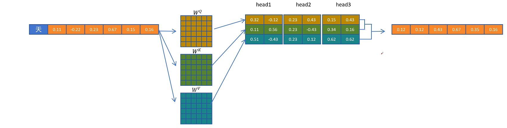

## 2. 自回归生成中的重复计算问题

当模型生成第二个 token 时，输入序列从一个 token 变成两个 token。朴素做法会对这两个 token 都重新计算 Q、K、V。由于因果注意力的限制，第一个 token 仍然只能看见自己，因此它在这一层的注意力输出和上一步相比并没有本质变化。

换句话说，重新计算第一个 token 的注意力结果是浪费的。真正新增的工作主要来自第二个 token：它需要拿自己的 Query 去关注第一个 token 和自己对应的 Key，再用注意力权重加权对应的 Value。

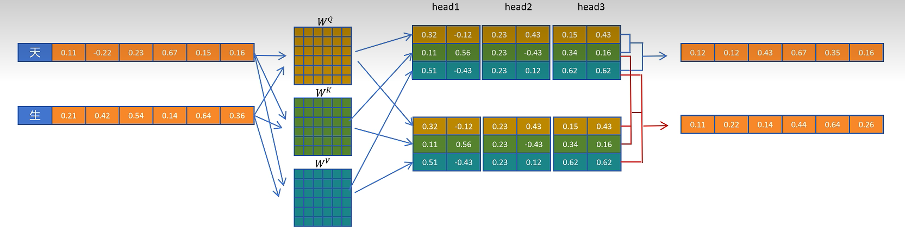

这个观察引出了 KV Cache：既然后续 token 只需要历史 token 的 Key 和 Value，那么就可以把历史 token 的 $K$ 和 $V$ 缓存下来，避免每一步都重复生成它们。

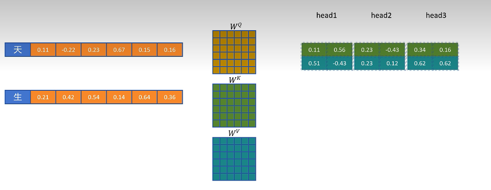

有了 KV Cache 后，生成新 token 时只需要计算当前 token 的 Q/K/V。历史 token 的 K/V 直接从缓存中读取。当前 token 的 K/V 也会被追加写入缓存，供后续 token 使用。

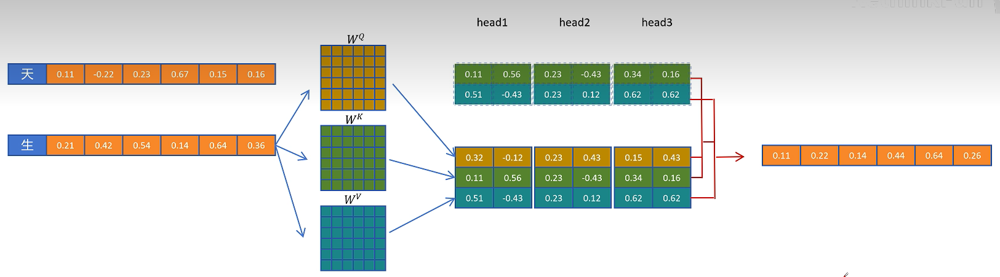

当序列继续增长时，每个新 token 都会读取所有历史 K/V，再把自己的 K/V 加入缓存。因此 KV Cache 会随着生成长度线性增长。

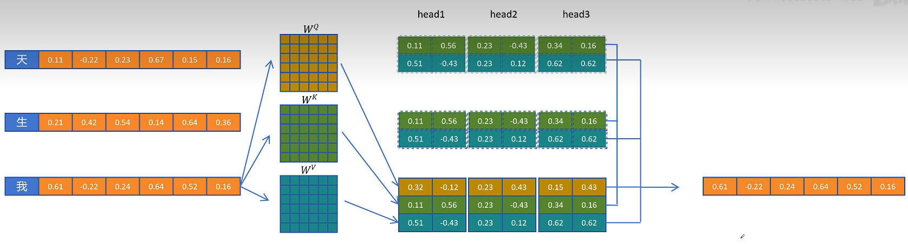

KV Cache 本质上是用显存换计算：它显著减少重复计算，提高解码速度，但代价是显存占用随 batch size、层数、注意力头数、head dimension 和序列长度一起增长。

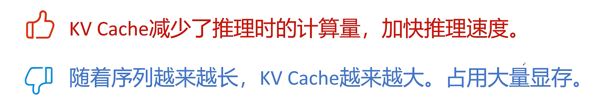

## 3. MHA、MQA 和 GQA 的取舍

标准多头注意力 MHA 中，每个注意力头都有独立的 Query、Key、Value。这样表达能力强，但 KV Cache 也大，因为每一层、每个 token、每个 head 都要缓存一份 K/V。

为了减少 KV Cache，人们提出了 MQA 和 GQA：

- MQA：多个 Query 头共享同一组 K/V。
- GQA：把 Query 头分成若干组，每组共享一组 K/V。

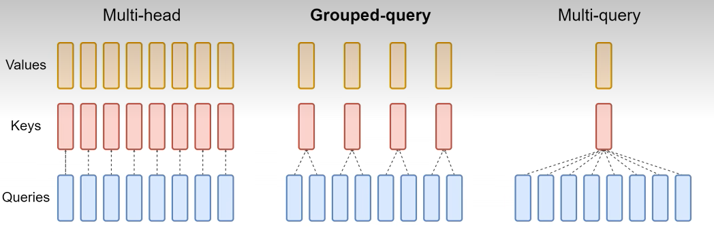

MQA 的压缩最激进。例如有多个 Query 头，但只生成一个 Key 头和一个 Value 头，然后把这组 K/V 共享给所有 Query 头。这样 KV Cache 会大幅减小，但由于 K/V 表达被过度共享，模型效果可能明显下降。

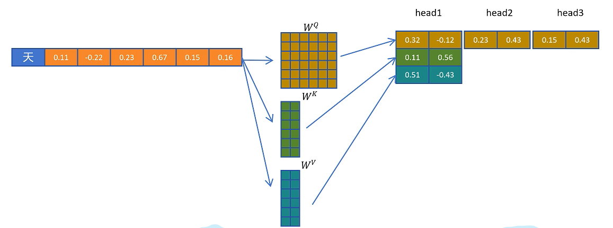

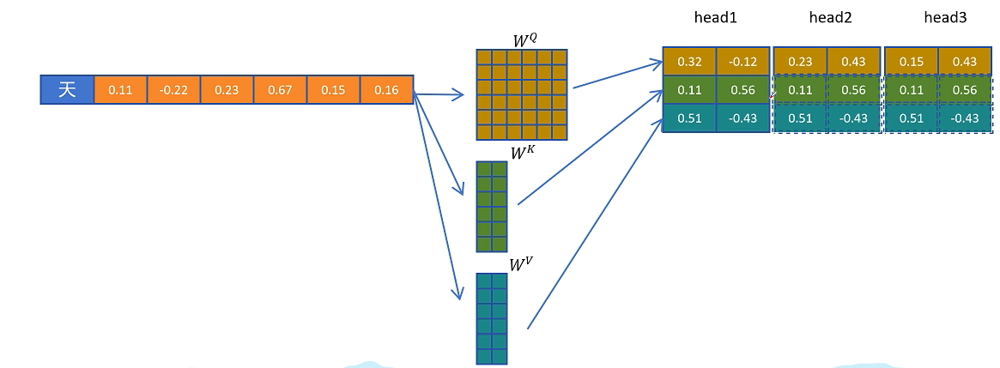

GQA 是折中方案。它不是所有 Query 头共享一组 K/V，而是每组 Query 共享一组 K/V。这样比 MHA 省显存，比 MQA 保留更多表达能力。

为了公平比较 MHA、MQA、GQA，实验中通常会控制总参数量，例如通过调整层数让不同注意力结构处于可比规模。

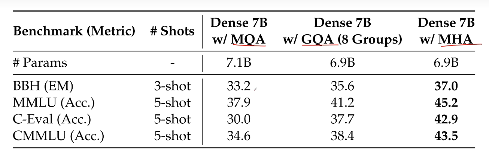

## 4. MLA 的核心想法：缓存低维潜在向量

问题到这里变成：有没有办法既显著减小 KV Cache，又尽量不牺牲模型性能？

DeepSeek 的多头潜在注意力 MLA 给出的答案是：不要直接缓存完整 K/V，而是缓存一个低维潜在向量。需要真实 K/V 时，再由这个低维向量恢复出来。

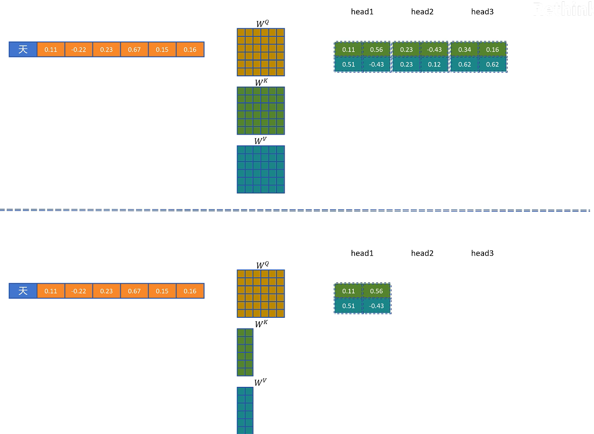

具体来说，输入隐藏状态 $H$ 先通过一个下投影矩阵 $W_{DKV}$ 得到低维的 KV 潜在表示：

$$
C_{KV} = H W_{DKV}
$$

这里的 $D$ 可以理解为 down projection，即降维。$C_{KV}$ 的维度远小于完整 K/V 的维度，因此缓存它比缓存完整 K/V 更省显存。

当需要真正参与注意力计算的 K 和 V 时，再通过两个上投影矩阵恢复：

$$
K = C_{KV} W_{UK},\quad V = C_{KV} W_{UV}
$$

其中 $U$ 可以理解为 up projection，即升维。

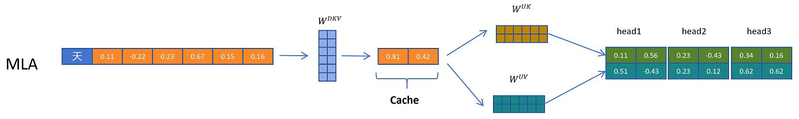

这样，MHA 缓存的是完整多头 K/V，MQA 缓存的是共享 K/V，而 MLA 缓存的是更低维的潜在向量 $C_{KV}$。因此 MLA 的 KV Cache 可以更小。

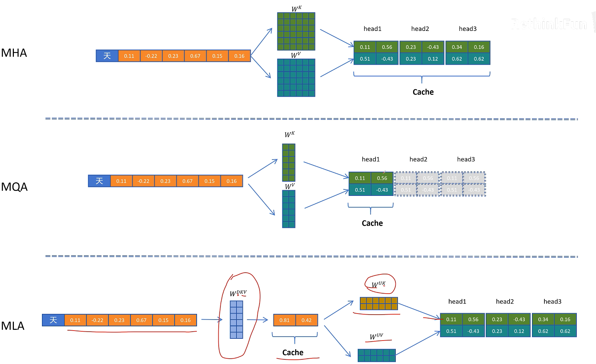

从效果上看，原文提到 DeepSeek 的实验显示 MLA 不仅压缩了 KV Cache，而且模型效果可以优于标准 MHA。这一点很关键：MLA 不是单纯用性能换显存，而是通过低秩结构引入了更有效的参数化方式。

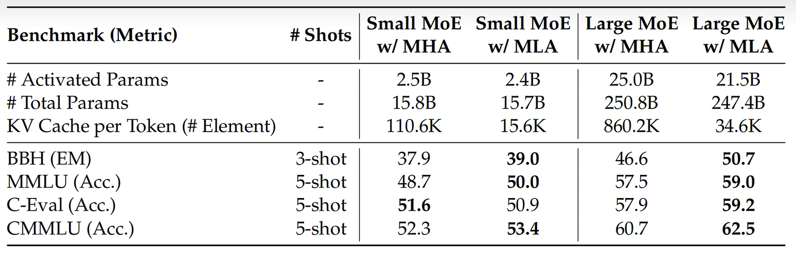

## 5. 一个新问题：解压 K/V 会不会增加推理计算

KV Cache 的初衷是减少推理时的重复计算。MLA 虽然缓存更小，但取出 $C_{KV}$ 后还要经过 $W_{UK}$ 和 $W_{UV}$ 解压成 K/V。直觉上看，这似乎又引入了额外计算。

标准 MHA 的推理过程很直接：

1. 当前 token 计算 Q/K/V。
2. 当前 token 的 K/V 写入 KV Cache。
3. 历史 token 的 K/V 从 KV Cache 直接读取。
4. 当前 Query 与历史 Key 做注意力计算。

MLA 的过程多了一层低维表示：

1. 当前 token 生成 Query。
2. 当前 token 通过 $W_{DKV}$ 生成 $C_{KV}$。
3. 缓存 $C_{KV}$，而不是完整 K/V。
4. 当前和历史 token 的 K/V 由 $C_{KV}$ 经过上投影恢复。

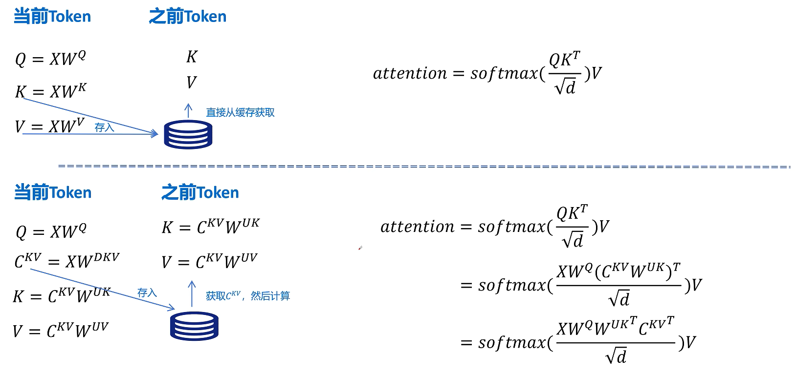

关键优化在于矩阵乘法结合律。注意力打分里主要关注的是 $QK^\top$。如果：

$$
Q = X W_Q,\quad K = C_{KV} W_{UK}
$$

那么：

$$
QK^\top = (XW_Q)(C_{KV}W_{UK})^\top
$$

在推理时，可以把某些投影矩阵提前合并，避免每次显式恢复完整 K。直观理解是：与其先把低维 $C_{KV}$ 解压成高维 K，再与 Q 做点积，不如把和 K 解压相关的线性变换提前吸收到 Query 侧或注意力计算中。

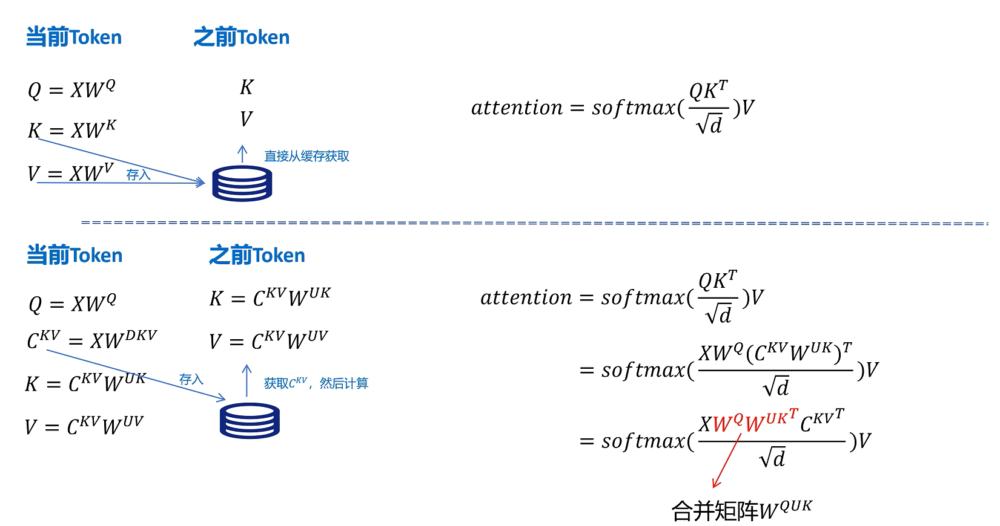

同理，Value 的上投影 $W_{UV}$ 也可以和输出投影 $W_O$ 结合起来。也就是说，MLA 并不是简单地在推理时增加一次解压，而是通过线性层融合，把低秩缓存带来的显存优势保留下来，同时控制计算开销。

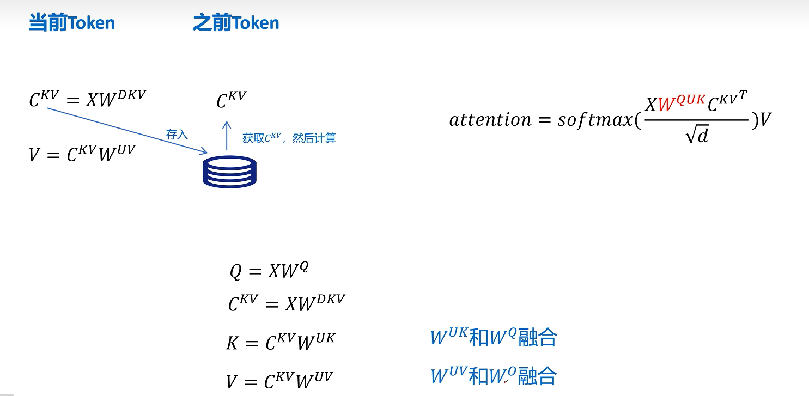

## 6. Query 也可以低秩压缩

MLA 不只对 K/V 做压缩，也可以对 Query 做低秩分解。输入隐藏状态先通过 $W_{DQ}$ 得到低维 Query 潜在表示，再通过 $W_{UQ}$ 恢复成多头 Query：

$$
C_Q = H W_{DQ},\quad Q = C_Q W_{UQ}
$$

但 Query 的潜在表示 $C_Q$ 不需要缓存，因为生成下一个 token 时不会再用到旧 token 的 Query。只有 K/V 会被历史 token 反复访问，因此只有 $C_{KV}$ 进入 KV Cache。

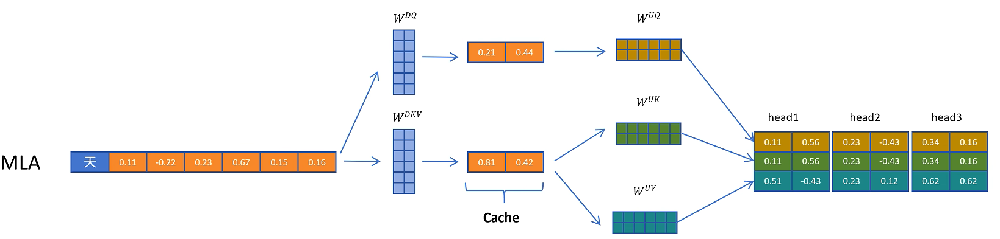

## 7. RoPE 为什么会打破简单的矩阵融合

前面的矩阵融合推导暂时忽略了位置编码。现代大模型普遍使用旋转位置编码 RoPE。RoPE 会对每一层的 Q 和 K 按 token 位置进行旋转：

$$
\tilde Q_i = R_i Q_i,\quad \tilde K_j = R_j K_j
$$

**注意 $R_i$ 和 $R_j$ 与 token 位置有关**。不同位置的旋转矩阵不同，因此它们不是固定参数矩阵，不能像 $W_Q$、$W_{UK}$ 那样在推理前提前融合。

如果直接在完整 Q/K 上应用 RoPE，那么位置相关的旋转会插入到 Query 和 Key 的投影链路之间，破坏前面依赖矩阵结合律的融合方案。

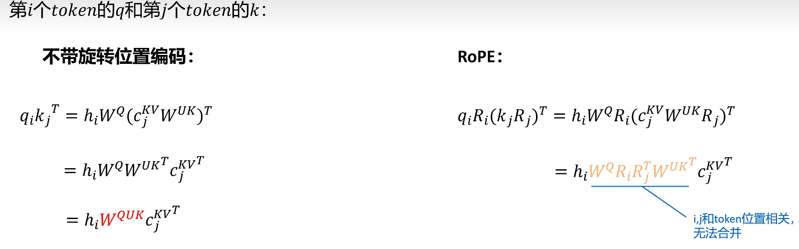

## 8. MLA 的 RoPE 兼容方案：解耦内容维度和位置维度

DeepSeek 的思路是把 Q/K 拆成两部分：

- 内容部分：不带 RoPE，继续使用低秩压缩与矩阵融合。
- 位置部分：额外生成一小段带 RoPE 的向量，用来承载位置信息。

对于 Query，模型通过 $W_{QR}$ 生成每个头对应的位置相关原始特征。这里的 $R$ 可以理解为 RoPE-related feature。

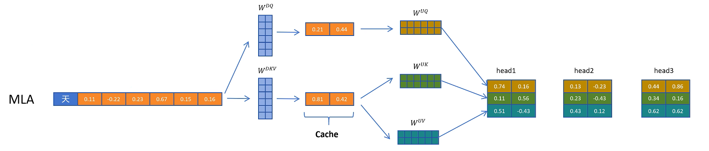

随后对这部分 Query 位置特征应用 RoPE。

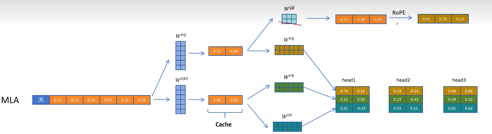

再把带位置信息的 Query 特征拼接到内容 Query 上，形成最终参与注意力计算的 Query。

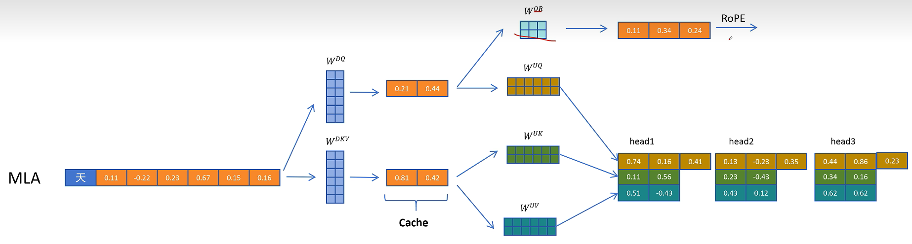

对于 Key，模型通过 $W_{KR}$ 生成一份共享的位置特征，再应用 RoPE。与内容 K 不同，这部分 RoPE Key 通常可以在多个头之间共享。

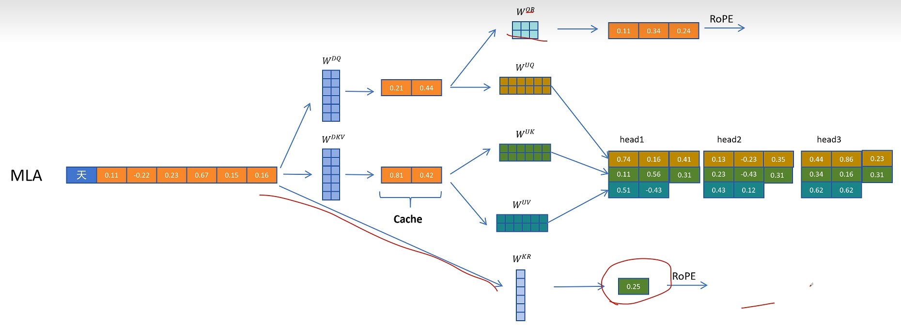

然后把这份带位置编码的 Key 特征复制到多个头中，与内容 Key 一起参与注意力。

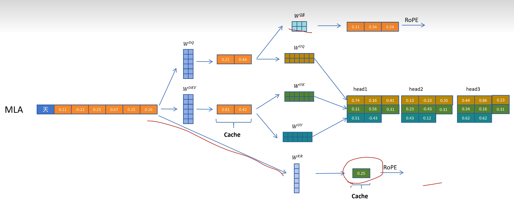

由于历史 token 的位置 Key 以后仍会被访问，所以除了 $C_{KV}$，还需要缓存共享的 RoPE Key 特征。也就是说，MLA 的缓存并不是只有一个压缩 KV 向量，还包括一小段用于位置编码的 Key 向量。

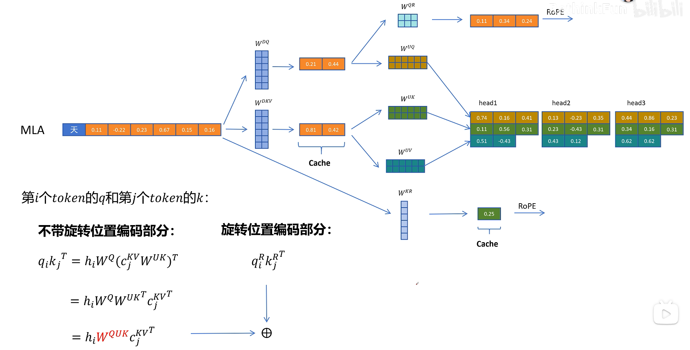

最终注意力打分可以理解成两部分相加：

$$
QK^\top =
Q_C K_C^\top + Q_R K_R^\top
$$

其中：

- $Q_C,K_C$ 是内容部分，不带 RoPE，可以保留低秩压缩和矩阵融合。
- $Q_R,K_R$ 是位置部分，负责注入 RoPE 信息。

这样就同时满足了两个目标：内容部分仍然能通过 MLA 压缩 KV Cache，位置部分又能兼容 RoPE。

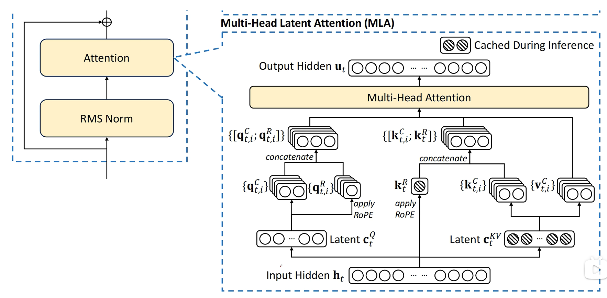

> 注意，Value 就只用有内容 Value 即可，不需要位置 Value。

## 9. 回到 MLA 总图：哪些东西需要缓存

综合起来，DeepSeek MLA 的主线如下：

1. 输入隐藏状态 $H$ 生成压缩 KV 潜在向量 $C_{KV}$。
2. $C_{KV}$ 可以上投影得到内容 Key 和内容 Value。
3. 输入隐藏状态 $H$ 还会生成共享的 RoPE Key 特征 $K_R$。
4. Query 侧先生成压缩 Query，再恢复成内容 Query。
5. Query 侧额外生成 RoPE Query 特征 $Q_R$。
6. 内容 Query 与 RoPE Query 拼接，内容 Key 与 RoPE Key 拼接。
7. 完整 Q/K/V 进入多头注意力计算。

需要进入缓存的只有两类变量：

- **压缩 KV 潜在向量 $C_{KV}$。**
- **共享 RoPE Key 特征 $K_R$。**

完整的 K/V 不需要缓存，这是 MLA 节省显存的核心。

## 10. 总结

MLA 解决的是自回归推理中 KV Cache 过大的问题。它不像 MQA 那样简单减少 K/V 头数，而是把 K/V 表示成低维潜在向量，并缓存这个低维向量。这样能显著降低显存占用。

MLA 的关键并不只是“降维缓存”，还包括两个配套设计：

1. **通过矩阵融合，避免推理时显式解压 K/V 带来的额外开销。**
2. **通过内容维度和 RoPE 位置维度解耦，让低秩压缩与旋转位置编码兼容。**

因此可以把 MLA 理解为一种更精细的 KV Cache 压缩方案：它既保留了多头注意力的表达能力，又降低了长上下文推理时的缓存压力。
