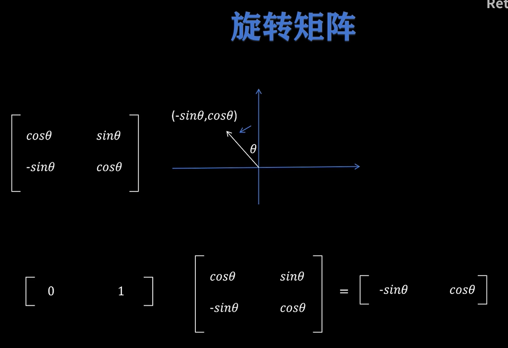
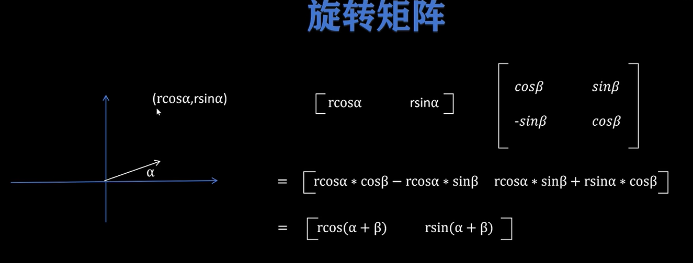
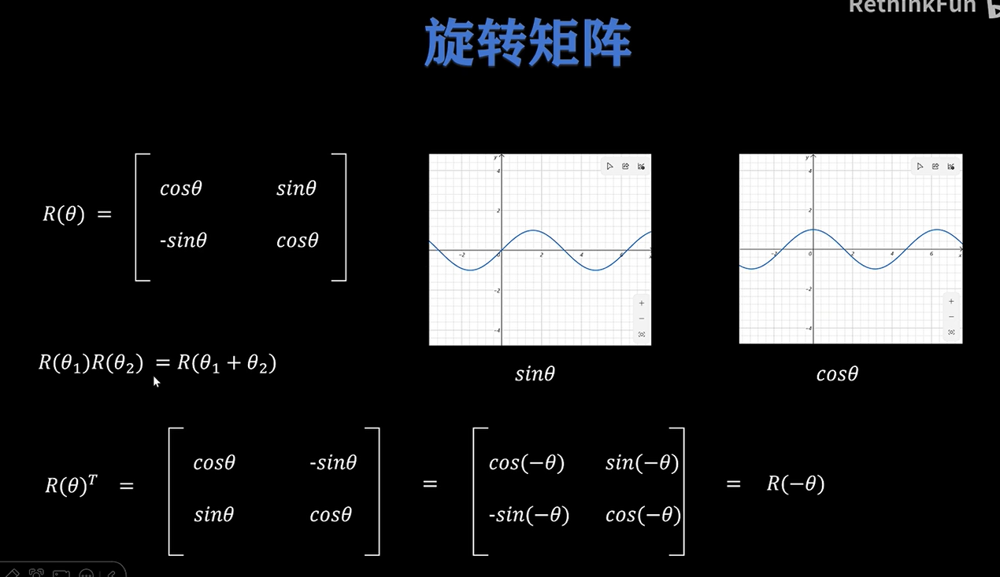
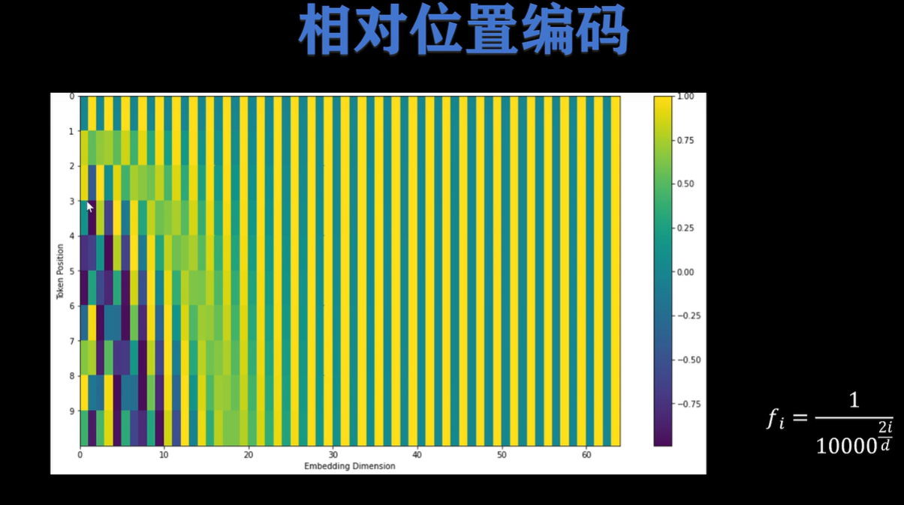
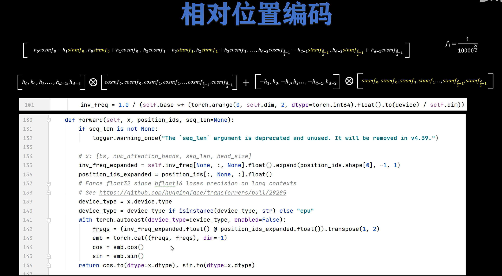
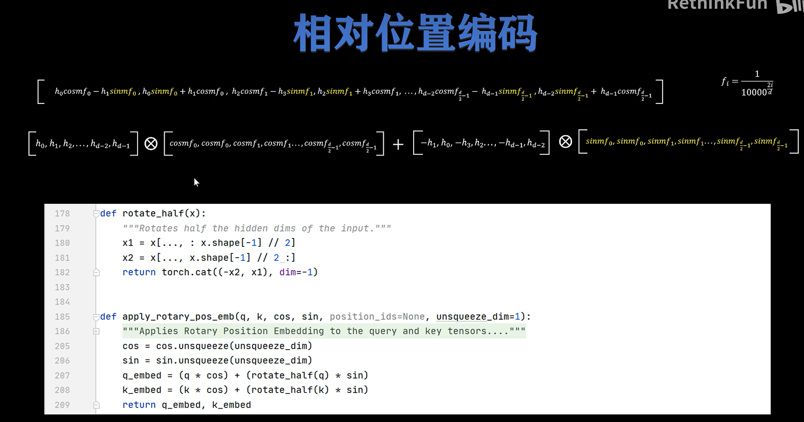

# RoPE 旋转位置编码：从旋转矩阵到 LLaMA 源码实现

> RoPE 还具备远程衰减和外推性，后面有需要再推导。

> 本文的推导过程与 [RoFormer: Enhanced Transformer with Rotary Position Embedding](http://arxiv.org/abs/2104.09864) 中的推导方式有所不同。原论文采用的是复平面展开的分析方法，而本文的推导思路更为直观易懂，主要参考了视频讲解 [你还不懂旋转位置编码吗？](https://www.bilibili.com/video/BV1F1421B7iv/?spm_id_from=333.1387.search.video_card.click&vd_source=e98b669ccbafff4b5aa59dd6303b722f)。


---

# 1. 为什么 Transformer 需要位置编码

Transformer 的 Self-Attention 机制本质上是对一组 token 做两两相关性计算。

给定一个长度为 $N$ 的输入序列：

$$
\mathbb{S}_{N}=\{w_i\}_{i=1}^{N}
$$

其中 $w_i$ 表示第 $i$ 个 token。 

经过 embedding 层后，得到对应的词向量序列：

$$
\mathbb{E}_N = \{ \boldsymbol{x}_i \}_{i=1}^{N}
$$

其中 $\boldsymbol{x}_i \in \mathbb{R}^{d}$ 表示第 $i$ 个 token 的 $d$ 维词向量。

在 Self-Attention 中，每个 token 的 embedding 会被映射成 query、key、value：

$$
\boldsymbol{q}_m = f_q(\boldsymbol{x}_m, m)
$$

$$
\boldsymbol{k}_n = f_k(\boldsymbol{x}_n, n)
$$

$$
\boldsymbol{v}_n = f_v(\boldsymbol{x}_n, n)
$$

其中：

- $\boldsymbol{q}_m$：位置 $m$ 的 query；
- $\boldsymbol{k}_n$：位置 $n$ 的 key；
- $\boldsymbol{v}_n$：位置 $n$ 的 value；
- $m,n$ 表示 token 的位置。

Self-Attention 的核心计算是：

$$
a_{m,n} =
\frac{
\exp\left(
\frac{\boldsymbol{q}_m^T \boldsymbol{k}_n}{\sqrt{d}}
\right)
}{
\sum_{j=1}^{N}
\exp\left(
\frac{\boldsymbol{q}_m^T \boldsymbol{k}_j}{\sqrt{d}}
\right)
}
$$


$$
\boldsymbol{o}_m =
\sum_{n=1}^{N} a_{m,n}\boldsymbol{v}_n
$$

也就是说，attention score 主要由 $\boldsymbol{q}_m^T \boldsymbol{k}_n$ 决定。

但是，如果没有位置编码，那么 attention 只知道 token 的内容相似度，不知道 token 的顺序。

例如：

```text
我 爱 你
你 爱 我
```

这两个句子的 token 集合类似，但语义不同。原因就在于 token 的顺序不同。

所以 Transformer 必须引入位置编码。

---

# 2. 绝对位置编码与相对位置编码

## 2.1 绝对位置编码

经典 Transformer 使用的是绝对位置编码。

常见做法是在 token embedding 上加一个位置向量：

$$
\boldsymbol{x}_i' = \boldsymbol{x}_i + \boldsymbol{p}_i
$$

然后再计算：

$$
\boldsymbol{q}_i = W_q(\boldsymbol{x}_i + \boldsymbol{p}_i)
$$

$$
\boldsymbol{k}_i = W_k(\boldsymbol{x}_i + \boldsymbol{p}_i)
$$

$$
\boldsymbol{v}_i = W_v(\boldsymbol{x}_i + \boldsymbol{p}_i)
$$

经典 Sinusoidal 位置编码定义为：

$$
\boldsymbol{p}_{i,2t} =
\sin
\left(
\frac{i}{10000^{2t/d}}
\right)
$$

$$
\boldsymbol{p}_{i,2t+1} =
\cos
\left(
\frac{i}{10000^{2t/d}}
\right)
$$

其中：

- $i$ 是 token 的位置；
- $d$ 是 embedding 维度;
- $t$：维度索引的分段参数，取值范围为 $ t = 0, 1, 2, \dots, (\frac{d}{2} - 1) $。


这种方法直接告诉模型“当前 token 在第几个位置”，所以称为绝对位置编码。

---

## 2.2 相对位置编码

在语言模型中，相对位置往往比绝对位置更重要。

例如：

```text
位置 5 和位置 6
位置 100 和位置 101
```

它们的绝对位置不同，但相对距离都是：$ 1 $

对于 attention 来说，query 和 key 之间的相对距离：

$$
m-n
$$

通常比它们各自的绝对位置 $m$、$n$ 更重要。

因此，相对位置编码希望 attention score 显式或隐式依赖 $ m-n $

RoPE 的目标就是：

> 让 query 和 key 在计算点积时，自然包含相对位置信息 $m-n$。

---

# 3. RoPE 的核心思想

RoPE，全称 Rotary Position Embedding，即旋转位置编码。

它的核心思想是：

> 不把位置向量加到 embedding 上，而是根据 token 的位置，对 query 和 key 做旋转变换。

也就是说，对于位置 $m$ 的 query：

$$
\boldsymbol{q}_m
\rightarrow
R_m \boldsymbol{q}_m
$$

对于位置 $n$ 的 key：

$$
\boldsymbol{k}_n
\rightarrow
R_n \boldsymbol{k}_n
$$

然后再计算 attention score：

$$
(R_m\boldsymbol{q}_m)^T(R_n\boldsymbol{k}_n)
$$

经过旋转矩阵的性质变换后，这个点积会变成只与相对位置 $n-m$ 或 $m-n$ 有关的形式。

这就是 RoPE 最重要的性质。

---

# 4. 旋转矩阵基础

## 4.1 二维旋转矩阵

在二维平面中，一个向量绕原点旋转角度 $\theta$，可以用旋转矩阵表示。

常见的列向量旋转矩阵为：

$$
R(\theta) =
\begin{bmatrix}
\cos\theta & -\sin\theta \\
\sin\theta & \cos\theta
\end{bmatrix}
$$

如果有二维列向量：

$$
\boldsymbol{x} =
\begin{bmatrix}
x_0 \\
x_1
\end{bmatrix}
$$

那么旋转后为：

$$
R(\theta)\boldsymbol{x}
=
\begin{bmatrix}
\cos\theta & -\sin\theta \\
\sin\theta & \cos\theta
\end{bmatrix}
\begin{bmatrix}
x_0 \\
x_1
\end{bmatrix}
$$

展开得到：

$$
R(\theta)\boldsymbol{x}
=
\begin{bmatrix}
x_0\cos\theta - x_1\sin\theta \\
x_0\sin\theta + x_1\cos\theta
\end{bmatrix}
$$

下图展示了旋转矩阵的两个例子：





---

## 4.2 旋转矩阵的重要性质

旋转矩阵有两个非常关键的性质。

### 性质一：连续旋转可以相加

$$
R(\theta_1)R(\theta_2)=
R(\theta_1+\theta_2)
$$

也就是说，先旋转 $\theta_1$，再旋转 $\theta_2$，等价于一次性旋转 $ \theta_1+\theta_2 $。

---

### 性质二：转置等于反向旋转


$$
R(\theta)^T = R(-\theta)
$$

证明如下：



这两个性质是 RoPE 能够引入相对位置的数学基础。

---

# 5. 二维 RoPE 推导

为了理解 RoPE，可以先从二维情况开始。

假设 query 和 key 都是二维向量：

$$
\boldsymbol{q}_m =
\begin{bmatrix}
q_m^{(1)} \\
q_m^{(2)}
\end{bmatrix}
$$

$$
\boldsymbol{k}_n =
\begin{bmatrix}
k_n^{(1)} \\
k_n^{(2)}
\end{bmatrix}
$$

RoPE 对位置 $m$ 的 query 做旋转：

$$
f_q(\boldsymbol{x}_m,m) =
R(m\theta)\boldsymbol{q}_m
$$

对位置 $n$ 的 key 做旋转：

$$
f_k(\boldsymbol{x}_n,n)
=
R(n\theta)\boldsymbol{k}_n
$$

其中 $ \theta $是旋转频率。

二维旋转后的 query 为：

$$
R(m\theta)\boldsymbol{q}_m
=
\begin{bmatrix}
\cos m\theta & -\sin m\theta \\
\sin m\theta & \cos m\theta
\end{bmatrix}
\begin{bmatrix}
q_m^{(1)} \\
q_m^{(2)}
\end{bmatrix}
$$

展开：

$$
=
\begin{bmatrix}
q_m^{(1)}\cos m\theta - q_m^{(2)}\sin m\theta \\
q_m^{(1)}\sin m\theta + q_m^{(2)}\cos m\theta
\end{bmatrix}
$$

key 同理：

$$
R(n\theta)\boldsymbol{k}_n
=
\begin{bmatrix}
k_n^{(1)}\cos n\theta - k_n^{(2)}\sin n\theta \\
k_n^{(1)}\sin n\theta + k_n^{(2)}\cos n\theta
\end{bmatrix}
$$

这就是“旋转位置编码”名字的来源：

> **位置编码不是加法，而是对 query 和 key 进行旋转。**<br>
**注意 m 和 n 都是对应 token 的位置 id。例如，第 0 个 token 的位置 id 即为 0。**

---

# 6. 从二维 RoPE 扩展到多维 RoPE

真实模型中的 query 和 key 通常是高维向量。

假设 head dimension 为 $d$，并且 $d$ 是偶数：

$$
\boldsymbol{x}
=
[x_0,x_1,x_2,x_3,\cdots,x_{d-2},x_{d-1}]^T
$$

RoPE 的做法是**每两个维度为一组，在每个二维子空间中做旋转。**

> **RoPE 本质是在高维向量空间里选出若干个互不重叠的二维子空间，然后在每个二维子空间里做旋转。<br>
所以，唯一的要求是，每组选择的那两个维度不能跟其他组的重复，除此之外怎么选都行。**

比如，**选择相邻的两个维度**为一组，即：

- $(x_0, x_1)$ 使用频率 $\theta_0$
- $(x_2, x_3)$ 使用频率 $\theta_1$
- $(x_4, x_5)$ 使用频率 $\theta_2$
- ...
- $(x_{d-2}, x_{d-1})$ 使用频率 $\theta_{d/2-1}$

---

## 6.1 多维旋转矩阵

多维 RoPE 的旋转矩阵是一个块对角矩阵：

$$
R_{\Theta,m}^{d} =
\begin{bmatrix}
\cos m\theta_0 & -\sin m\theta_0 & 0 & 0 & \cdots & 0 & 0 \\
\sin m\theta_0 & \cos m\theta_0 & 0 & 0 & \cdots & 0 & 0 \\
0 & 0 & \cos m\theta_1 & -\sin m\theta_1 & \cdots & 0 & 0 \\
0 & 0 & \sin m\theta_1 & \cos m\theta_1 & \cdots & 0 & 0 \\
\vdots & \vdots & \vdots & \vdots & \ddots & \vdots & \vdots \\
0 & 0 & 0 & 0 & \cdots & \cos m\theta_{\frac d2-1} & -\sin m\theta_{\frac d2-1} \\
0 & 0 & 0 & 0 & \cdots & \sin m\theta_{\frac d2-1} & \cos m\theta_{\frac d2-1}
\end{bmatrix}
$$

其中频率集合为：

$$
\Theta
=
\left\{
\theta_i = 10000^{-2i/d},
i = 0,1,\cdots,\frac d2 - 1
\right\}
$$

也可以写成：

$$
\theta_i
=
\frac{1}{10000^{2i/d}}
$$

---

## 6.2 为什么不同维度使用不同频率？

RoPE 沿用了 Sinusoidal 位置编码中的频率设计：

$$
\theta_i
=
\frac{1}{10000^{2i/d}}
$$

不同维度（即 $i$）对应不同频率（即 $\theta$）。由于 $\sin$ 和 $\cos$ 都是周期性函数，所以：

- 低维频率较高，适合捕捉短距离位置变化。
- 高维频率较低，适合捕捉长距离位置变化。

这样可以让模型同时感知短程关系和长程关系。




---

# 7. RoPE 为什么天然包含相对位置信息

这是 RoPE 最核心的部分。

对于位置 $m$ 的 query：

$$
\tilde{\boldsymbol{q}}_m
=
R_m \boldsymbol{q}_m
$$

对于位置 $n$ 的 key：

$$
\tilde{\boldsymbol{k}}_n
=
R_n \boldsymbol{k}_n
$$

其中：

$$
R_m = R(m\theta)
$$

$$
R_n = R(n\theta)
$$

attention score 为：

$$
\tilde{\boldsymbol{q}}_m^T \tilde{\boldsymbol{k}}_n
=
(R_m\boldsymbol{q}_m)^T(R_n\boldsymbol{k}_n)
=
\boldsymbol{q}_m^T R_m^T R_n \boldsymbol{k}_n
$$


由于：

$$
R_m^T = R(-m\theta)
$$

所以：

$$
R_m^T R_n
=
R(-m\theta)R(n\theta)
$$

根据旋转矩阵相加性质：

$$
R(-m\theta)R(n\theta)
=
R((n-m)\theta)
$$

因此：

$$
\tilde{\boldsymbol{q}}_m^T \tilde{\boldsymbol{k}}_n
=
\boldsymbol{q}_m^T R((n-m)\theta)\boldsymbol{k}_n
$$

**这说明 RoPE 之后的 attention score 只依赖相对位置 $n-m$，而不是单独依赖绝对位置 $m$ 和 $n$。所以 RoPE 虽然使用绝对位置生成旋转角度，但最终在 attention score 中体现为相对位置编码。**

---

# 8. RoPE 的高效计算形式

如果直接构造完整的旋转矩阵：

$$
R_{\Theta,m}^{d}
$$

再和 query、key 相乘，计算量和内存开销都很大。

但 RoPE 的旋转矩阵是稀疏块对角矩阵，因此可以高效实现。

对于 head dimension 向量：

$$
\boldsymbol{x}
=
[x_0,x_1,x_2,x_3,\cdots,x_{d-2},x_{d-1}]^T
$$

如果选择相邻维度为一组，则 RoPE 旋转结果为：

$$
R_{\Theta,m}^{d}\boldsymbol{x}
=
\begin{bmatrix}
x_0\cos m\theta_0 - x_1\sin m\theta_0 \\
x_0\sin m\theta_0 + x_1\cos m\theta_0 \\
x_2\cos m\theta_1 - x_3\sin m\theta_1 \\
x_2\sin m\theta_1 + x_3\cos m\theta_1 \\
\vdots \\
x_{d-2}\cos m\theta_{\frac d2-1} - x_{d-1}\sin m\theta_{\frac d2-1} \\
x_{d-2}\sin m\theta_{\frac d2-1} + x_{d-1}\cos m\theta_{\frac d2-1}
\end{bmatrix}
$$

可以写成逐元素运算：

$$
R_{\Theta,m}^{d}\boldsymbol{x}
=
\boldsymbol{x}\odot \boldsymbol{\cos}_m
+
\operatorname{rotate}(\boldsymbol{x})\odot \boldsymbol{\sin}_m
$$

其中：

$$
\boldsymbol{\cos}_m
=
[
\cos m\theta_0,
\cos m\theta_0,
\cos m\theta_1,
\cos m\theta_1,
\cdots,
\cos m\theta_{\frac d2-1},
\cos m\theta_{\frac d2-1}
]
$$

$$
\boldsymbol{\sin}_m
=
[
\sin m\theta_0,
\sin m\theta_0,
\sin m\theta_1,
\sin m\theta_1,
\cdots,
\sin m\theta_{\frac d2-1},
\sin m\theta_{\frac d2-1}
]
$$

并且：

$$
\operatorname{rotate}(\boldsymbol{x})
=
[-x_1,x_0,-x_3,x_2,\cdots,-x_{d-1},x_{d-2}]
$$

这就是 RoPE 的高效实现形式。

---

# 9. HuggingFace LLama 的 RoPE 源码





举例：

```text
3 个 token
hidden 维度 = 10
```

为了方便理解，假设每个 token 的 `q` 向量就是 10 维。RoPE 实际上是作用在 attention 里的 **q 和 k** 上，不是直接作用在原始 token embedding 上。

## 现在有 3 个 token

位置分别是：

```text
token0: position = 0
token1: position = 1
token2: position = 2
```

每个 token 的 hidden 向量是 10 维，例如某个 token 的 q 向量：

```text
q = [h0, h1, h2, h3, h4, h5, h6, h7, h8, h9]
```

RoPE 要做的事是：

> 把这个 10 维向量拆成 5 个二维向量，然后根据 token 的位置旋转它们。

---

## 10 维怎么拆成 5 组？

按照图里的代码：

```python
x1 = x[..., : x.shape[-1] // 2]
x2 = x[..., x.shape[-1] // 2 :]
return torch.cat((-x2, x1), dim=-1)
```

10 维会被分成：

```text
前半部分: [h0, h1, h2, h3, h4]
后半部分: [h5, h6, h7, h8, h9]
```

所以实际配对是：

```text
(h0, h5)
(h1, h6)
(h2, h7)
(h3, h8)
(h4, h9)
```

每一对就是一个二维坐标点。

## 每一组有自己的旋转频率

hidden 维度是 10，所以一共有 5 组二维向量。

RoPE 会生成 5 个频率：

```text
theta0 = 1 / 10000^(0/10) ≈ 1
theta1 = 1 / 10000^(2/10) ≈ 0.1585
theta2 = 1 / 10000^(4/10) ≈ 0.0251
theta3 = 1 / 10000^(6/10) ≈ 0.0040
theta4 = 1 / 10000^(8/10) ≈ 0.0006
```

也就是：

```text
thetas ≈ [1, 0.1585, 0.0251, 0.0040, 0.0006]
```

这些频率对应 5 组二维向量。

---

## 不同位置产生不同旋转角度

旋转角度的计算方式是：

```text
angle = position × theta
```

所以 3 个 token 的角度分别是：

### token0，position = 0

```text
angles0 = 0 × thetas
        = [0, 0, 0, 0, 0]
```

也就是说 token0 不旋转。


### token1，position = 1

```text
angles1 ≈ [1, 0.1585, 0.0251, 0.0040, 0.0006]
```


### token2，position = 2

```text
angles2 ≈ [2, 0.3170, 0.0502, 0.0080, 0.0012]
```

所以：

```text
位置越靠后，旋转角度越大。
```

