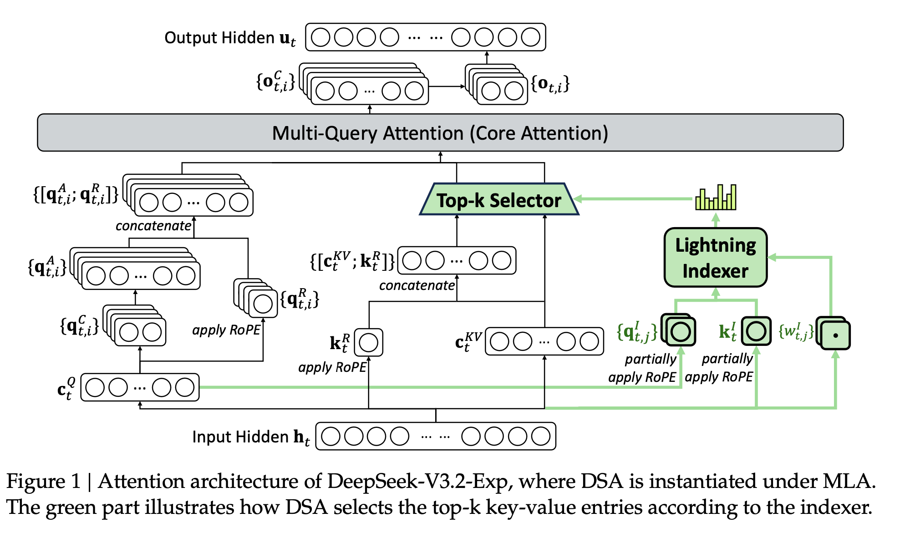

**DeepSeek Sparse Attention, DSA** 可以理解为一个两阶段稀疏注意力系统：

1. 用一个很轻量的 **Lightning Indexer** 近似估计“哪些历史 token 对当前 query 重要”；
2. 再用 **Fine-grained Sparse Attention** 只对被选中的少量 token 做真正的 softmax attention。

其目标是把标准注意力的复杂度从近似

$$
O(n^2 d)
$$

降低到

$$
O(n k d) + O(\text{indexing cost}),
$$

其中 $n$ 是序列长度，$d$ 是 hidden/head 维度，$k \ll n$ 是每个 query 选中的 key/value 数量。DeepSeek-V3.2 技术报告中将 DSA 作为长上下文效率机制引入，并包含 Lightning Indexer 与 fine-grained sparse attention 的训练/部署流程[^1]。后续工作也指出，token-level sparse attention 中 indexer 本身会成为瓶颈，因此专门研究了更高效的层次化 indexer[^2]。

[^1]: *DeepSeek-V3.2: Pushing the Frontier of Open Large Language Models*, 2025. 该技术报告介绍了 DeepSeek Sparse Attention，包括 Lightning Indexer warm-up 与 fine-grained sparse attention 阶段。  

[^2]: *HISA: Efficient Hierarchical Indexing for Fine-Grained Sparse Attention*, 2026. 该工作指出 token-level sparse attention 中 indexer 会成为瓶颈，并研究了用于 DSA 类系统的高效层次化索引。

---

## 1. 标准 dense attention 回顾

设某一层、某一 attention head 中：

$$
Q = XW_Q \in \mathbb{R}^{n \times d}, 
\quad 
K = XW_K \in \mathbb{R}^{n \times d},
\quad 
V = XW_V \in \mathbb{R}^{n \times d}.
$$

第 $i$ 个 query token 对所有历史 key 的注意力为：

$$
\alpha_{ij}
=
\frac{
\exp(q_i^\top k_j / \sqrt d)
}{
\sum_{\ell \le i} \exp(q_i^\top k_\ell / \sqrt d)
},
\quad j \le i.
$$

输出为：

$$
o_i = \sum_{j \le i} \alpha_{ij} v_j.
$$

问题是，对每个 $i$，都要计算 $q_i^\top k_j$，其中 $j = 1,\dots,i$。总复杂度为：

$$
\sum_{i=1}^{n} O(i d)
=
O(n^2 d).
$$

长上下文下，例如 \(n = 128K\)，dense attention 的代价非常高。

---

## 2. DSA 的核心思想

DSA 的核心是：**不要对所有 key 做精确 attention，而是先用便宜的 indexer 找候选 key。**

也就是说，对于每个 query $q_i$，我们不再使用所有历史 token 集合：

$$
\mathcal{P}_i = \{1,2,\dots,i\},
$$

而是选择一个稀疏子集：

$$
\mathcal{S}_i \subset \mathcal{P}_i,
\quad 
|\mathcal{S}_i| = k,
\quad 
k \ll i.
$$

然后只在 $\mathcal{S}_i$ 上做 softmax：

$$
\alpha_{ij}^{\text{sparse}}
=
\frac{
\exp(q_i^\top k_j / \sqrt d)
}{
\sum_{\ell \in \mathcal{S}_i} \exp(q_i^\top k_\ell / \sqrt d)
},
\quad j \in \mathcal{S}_i.
$$

输出：

$$
o_i^{\text{sparse}}
=
\sum_{j \in \mathcal{S}_i}
\alpha_{ij}^{\text{sparse}} v_j.
$$

所以 DSA 的关键数学问题变成：

$$
\mathcal{S}_i
=
\operatorname{TopK}_{j \le i}
\bigl(
\text{score}_{ij}
\bigr),
$$

其中 $\text{score}_{ij}$ 要尽可能接近真实 attention logit：

$$
q_i^\top k_j,
$$

但计算成本必须远低于 $O(nd)$。

---

## 3. Lightning Indexer：用低成本分数近似真实 attention 重要性

### 3.1 标准 attention score

真实 attention 的未归一化分数是：

$$
s_{ij}
=
\frac{q_i^\top k_j}{\sqrt d}.
$$

如果直接对所有 $j$ 计算 $s_{ij}$，那又回到了 dense attention。

因此 Lightning Indexer 引入一个轻量级映射：

$$
\phi_Q(q_i) \in \mathbb{R}^{r},
\quad
\phi_K(k_j) \in \mathbb{R}^{r},
$$

其中

$$
r \ll d.
$$

然后用低维内积估计重要性：

$$
\hat{s}_{ij}
=
\phi_Q(q_i)^\top \phi_K(k_j).
$$

如果 $\hat{s_{ij}}$ 与 $s_{ij}$ 排序一致性较强，那么我们可以用：

$$
\mathcal{S}_i
=
\operatorname{TopK}_{j \le i}
\hat{s}_{ij}
$$

代替

$$
\operatorname{TopK}_{j \le i}
s_{ij}.
$$

这就是 Lightning Indexer 的数学本质：  
**用便宜的近似打分函数预测真实 attention 的 Top-K 支持集。**

---

### 3.2 低秩近似视角

假设真实 attention score 矩阵为：

$$
S = QK^\top \in \mathbb{R}^{n \times n}.
$$

Lightning Indexer 试图构造一个低成本矩阵：

$$
\hat{S} = \tilde{Q}\tilde{K}^\top,
$$

其中：

$$
\tilde{Q} = Q A \in \mathbb{R}^{n \times r},
\quad
\tilde{K} = K B \in \mathbb{R}^{n \times r},
$$

并且 $r \ll d$。

于是：

$$
\hat{S}_{ij}
=
(QA)_i^\top (KB)_j.
$$

如果 $A,B$ 是可学习参数，则 indexer 可以通过训练学习如何预测 dense attention 的重要 token。

理想目标可以写成：

$$
\operatorname{TopK}(S_i)
\approx
\operatorname{TopK}(\hat{S}_i).
$$

这里 $S_i$ 表示第 $i$ 行，也就是第 $i$ 个 query 对所有 key 的真实 attention logits。

---

## 4. Lightning Indexer 的训练目标

为了让 indexer 选出的 token 接近 dense attention，可以设计若干训练目标。DeepSeek-V3.2 报告中提到会先进行 indexer warm-up，然后再引入 fine-grained sparse attention[^1]。从数学上，可以理解为先让 indexer 学会模仿 dense attention 的选择分布。

### 4.1 以 dense attention 为 teacher

设 dense attention 分布为：

$$
p_{ij}
=
\frac{\exp(s_{ij})}{\sum_{\ell \le i}\exp(s_{i\ell})}.
$$

Indexer 产生的近似分布为：

$$
\hat{p}_{ij}
=
\frac{\exp(\hat{s}_{ij})}{\sum_{\ell \le i}\exp(\hat{s}_{i\ell})}.
$$

一个自然的训练目标是 KL 散度：

$$
\mathcal{L}_{\text{index}}
=
\sum_i
\operatorname{KL}
\left(
p_i \;||\; \hat{p}_i
\right).
$$

展开为：

$$
\mathcal{L}_{\text{index}}
=
\sum_i
\sum_{j \le i}
p_{ij}
\log
\frac{p_{ij}}{\hat{p}_{ij}}.
$$

这个目标鼓励 indexer 的排序和 dense attention 接近。

---

### 4.2 Top-K 集合匹配目标

因为 sparse attention 最终关心的是 Top-K 选择，而不是完整分布，所以也可以用集合匹配的思想。

设 dense attention 的真实 Top-K 集合为：

$$
\mathcal{T}_i
=
\operatorname{TopK}_{j \le i}(s_{ij}).
$$

Indexer 选出的集合为：

$$
\mathcal{S}_i
=
\operatorname{TopK}_{j \le i}(\hat{s}_{ij}).
$$

希望最大化 recall：

$$
\operatorname{Recall}_i
=
\frac{
|\mathcal{S}_i \cap \mathcal{T}_i|
}{
|\mathcal{T}_i|
}.
$$

对应的目标是：

$$
\max
\sum_i
\frac{
|\mathcal{S}_i \cap \mathcal{T}_i|
}{
k
}.
$$

实际训练中，Top-K 操作不可微，所以通常会用 soft surrogate，例如 pairwise ranking loss：

$$
\mathcal{L}_{\text{rank}}
=
\sum_i
\sum_{j \in \mathcal{T}_i}
\sum_{m \notin \mathcal{T}_i}
\max
\left(
0,
\gamma - \hat{s}_{ij} + \hat{s}_{im}
\right),
$$

其中 $\gamma > 0$ 是 margin。  
这个损失要求真正重要的 token $j$ 的 indexer score 高于不重要 token $m$。

---

## 5. Fine-grained Sparse Attention

Lightning Indexer 只负责“找候选”。真正输出仍然由标准 attention 公式计算，只不过注意力范围缩小到 $\mathcal{S}_i$。

即：

$$
\mathcal{S}_i
=
\operatorname{TopK}_{j \le i}
\hat{s}_{ij}.
$$

然后在这个集合上计算真实 logit：

$$
s_{ij}
=
\frac{q_i^\top k_j}{\sqrt d},
\quad j \in \mathcal{S}_i.
$$

再做局部 softmax：

$$
\alpha_{ij}^{\text{DSA}}
=
\frac{
\exp(s_{ij})
}{
\sum_{\ell \in \mathcal{S}_i}
\exp(s_{i\ell})
},
\quad j \in \mathcal{S}_i.
$$

输出：

$$
o_i^{\text{DSA}}
=
\sum_{j \in \mathcal{S}_i}
\alpha_{ij}^{\text{DSA}} v_j.
$$

注意这里有一个重要区别：

- **Indexer score** $\hat{s}_{ij}$：只用于选择 token；
- **真实 attention score** $s_{ij}$：用于最终 softmax 和加权求和。

所以 DSA 不是简单地用近似 attention 替代原 attention，而是：

$$
\text{cheap indexer for retrieval}
+
\text{exact attention over retrieved tokens}.
$$

这也是它比纯近似 attention 更稳的原因。

---

## 6. 为什么叫 Fine-grained？

很多 sparse attention 方法是 block-level 的，比如把上下文分成 block：

$$
B_1, B_2, \dots, B_m.
$$

然后选择若干 block：

$$
\mathcal{B}_i
=
\operatorname{TopKBlock}(q_i).
$$

这种方法粒度较粗。如果 block 大小为 $b$，选中一个 block 就必须计算其中所有 $b$ 个 token，即使其中大多数并不重要。

Fine-grained sparse attention 则直接在 token 级别选：

$$
\mathcal{S}_i
=
\{j_1, j_2, \dots, j_k\}.
$$

这比 block-level 更精细：

$$
\text{block-level: select blocks}
$$

$$
\text{fine-grained: select individual tokens}.
$$

好处是：

$$
k_{\text{token}} \ll k_{\text{block}} \cdot b
$$

时，计算更省。

但坏处是 indexer 压力更大：  
因为每个 query 都要在大量历史 token 中找 Top-K。后续 HISA 等工作正是指出 fine-grained token-level sparse attention 中 indexer 会成为新的瓶颈，并提出层次化索引来缓解[^2]。

---

## 7. DSA 的整体计算流程

对于当前 query token $i$：

### Step 1：计算 query/key/value

$$
q_i = x_i W_Q,
\quad
k_j = x_j W_K,
\quad
v_j = x_j W_V.
$$

### Step 2：Lightning Indexer 生成低维表示

$$
\tilde{q}_i = \phi_Q(q_i),
\quad
\tilde{k}_j = \phi_K(k_j).
$$

其中：

$$
\tilde{q}_i,\tilde{k}_j \in \mathbb{R}^{r},
\quad r \ll d.
$$

### Step 3：计算 indexer score

$$
\hat{s}_{ij}
=
\tilde{q}_i^\top \tilde{k}_j.
$$

### Step 4：选出 Top-K token

$$
\mathcal{S}_i
=
\operatorname{TopK}_{j \le i}
\hat{s}_{ij}.
$$

### Step 5：对选中 token 做真实 attention

$$
s_{ij}
=
\frac{q_i^\top k_j}{\sqrt d},
\quad j \in \mathcal{S}_i.
$$

$$
\alpha_{ij}
=
\frac{
\exp(s_{ij})
}{
\sum_{\ell \in \mathcal{S}_i}
\exp(s_{i\ell})
}.
$$

### Step 6：聚合 value

$$
o_i
=
\sum_{j \in \mathcal{S}_i}
\alpha_{ij} v_j.
$$

---

## 8. 复杂度推导

### 8.1 Dense attention

每个 query 对 $i$ 个 key 计算内积，每个内积维度为 $d$：

$$
C_{\text{dense}}
=
\sum_{i=1}^{n} i d
=
\frac{n(n+1)}{2}d
=
O(n^2 d).
$$

---

### 8.2 DSA attention 主体复杂度

如果每个 query 只选 $k$ 个 key：

$$
C_{\text{attn}}
=
\sum_{i=1}^{n} k d
=
O(n k d).
$$

其中 $k \ll n$。

---

### 8.3 Indexer 复杂度

若 Lightning Indexer 使用低维维度 $r$，粗略计算所有 query-key index score 的成本为：

$$
C_{\text{index}}
=
O(n^2 r).
$$

因为 $r \ll d$，它比 dense attention 便宜。

但如果真的计算全量 $n^2$ 个 index score，在极长上下文下仍然很贵。因此实际系统通常还需要结合：

- 分块；
- 层次化索引；
- 缓存；
- 近似 Top-K；
- 局部窗口加全局检索；
- query 分组；
- hardware-aware kernel。

后续研究如 HISA 就指出 DSA 这类 token-level sparse attention 的 indexer 会成为新瓶颈，因此提出 hierarchical indexing 来进一步降低 indexer 代价[^2]。

---

## 9. 误差分析：DSA 近似 dense attention 的条件

Dense attention 输出为：

$$
o_i
=
\sum_{j \le i} p_{ij} v_j.
$$

DSA 输出为：

$$
\hat{o}_i
=
\sum_{j \in \mathcal{S}_i}
\hat{p}_{ij} v_j,
$$

其中：

$$
\hat{p}_{ij}
=
\frac{
\exp(s_{ij})
}{
\sum_{\ell \in \mathcal{S}_i}
\exp(s_{i\ell})
}.
$$

设未被选中的集合为：

$$
\mathcal{R}_i
=
\mathcal{P}_i \setminus \mathcal{S}_i.
$$

dense attention 在被丢弃 token 上的总概率质量为：

$$
\epsilon_i
=
\sum_{j \in \mathcal{R}_i} p_{ij}.
$$

如果 \(\epsilon_i\) 很小，则 sparse attention 近似 dense attention 较好。

换句话说，DSA 成功的关键是：

$$
\sum_{j \notin \mathcal{S}_i} p_{ij}
\approx 0.
$$

也就是 indexer 选中的 token 覆盖了 dense attention 的大部分概率质量。

可以给出一个直觉误差界。假设：

$$
\|v_j\| \le M.
$$

那么丢弃部分导致的误差大致受控于：

$$
\left\|
\sum_{j \in \mathcal{R}_i} p_{ij} v_j
\right\|
\le
\sum_{j \in \mathcal{R}_i} p_{ij} \|v_j\|
\le
M \epsilon_i.
$$

因此，如果 indexer 能让 $\epsilon_i$ 很小，DSA 输出就接近 dense attention。

---

## 10. 为什么需要 warm-up？

如果一开始就让模型使用 sparse attention，indexer 还没学会选 token，可能会漏掉重要上下文，训练不稳定。

所以可以先进行 indexer warm-up：

1. 主模型仍然使用 dense attention；
2. 同时训练 Lightning Indexer 去预测 dense attention 的重要 token；
3. 当 indexer 的 Top-K recall 足够高后，再切换到 fine-grained sparse attention。

数学上就是先优化：

$$
\mathcal{L}_{\text{index}}
$$

让：

$$
\operatorname{TopK}(\hat{s}_{ij})
\approx
\operatorname{TopK}(s_{ij}),
$$

再优化完整语言模型损失：

$$
\mathcal{L}_{\text{LM}}
=
-\sum_t \log p(x_t | x_{<t}).
$$

最终训练目标可以看成：

$$
\mathcal{L}
=
\mathcal{L}_{\text{LM}}
+
\lambda \mathcal{L}_{\text{index}},
$$

其中 $\lambda$ 控制 indexer 监督强度。


---

## 11. 一个简化伪代码

```python
# Q, K, V: [n, d]
# Wq_idx, Wk_idx: indexer projection, d -> r
# k_select: number of selected tokens

Q_idx = Q @ Wq_idx      # [n, r]
K_idx = K @ Wk_idx      # [n, r]

outputs = []

for i in range(n):
    # causal keys: 0 ... i
    idx_scores = Q_idx[i] @ K_idx[:i+1].T      # [i+1]

    # select fine-grained token indices
    S_i = topk(idx_scores, k=k_select)

    # exact attention over selected tokens
    logits = Q[i] @ K[S_i].T / sqrt(d)         # [k]
    attn = softmax(logits)

    out = attn @ V[S_i]                       # [d]
    outputs.append(out)
```

这个伪代码对应数学公式：

$$
\mathcal{S}_i
=
\operatorname{TopK}
\left(
\tilde{q}_i^\top \tilde{k}_j
\right),
$$

$$
o_i
=
\sum_{j \in \mathcal{S}_i}
\operatorname{softmax}
\left(
\frac{q_i^\top k_j}{\sqrt d}
\right)
v_j.
$$

---

## 13. 总结一句话

**DeepSeek Sparse Attention = 学习型 token 级检索器 + 精确子集注意力。**

更形式化地说：

$$
\boxed{
\mathcal{S}_i
=
\operatorname{TopK}_{j \le i}
\left(
\phi_Q(q_i)^\top \phi_K(k_j)
\right)
}
$$

$$
\boxed{
o_i
=
\sum_{j \in \mathcal{S}_i}
\frac{
\exp(q_i^\top k_j / \sqrt d)
}{
\sum_{\ell \in \mathcal{S}_i}
\exp(q_i^\top k_\ell / \sqrt d)
}
v_j
}
$$

Lightning Indexer 负责便宜地找 $\mathcal{S}_i$，Fine-grained Sparse Attention 负责在 $\mathcal{S}_i$ 上做真实 attention。只要 indexer 能保证被丢弃 token 的 attention mass 很小：

$$
\epsilon_i
=
\sum_{j \notin \mathcal{S}_i} p_{ij}
\ll 1,
$$

则 DSA 可以在保持效果的同时把主要 attention 计算从：

$$
O(n^2 d)
$$

降到：

$$
O(n k d) + O(\text{indexer}).
$$

---

