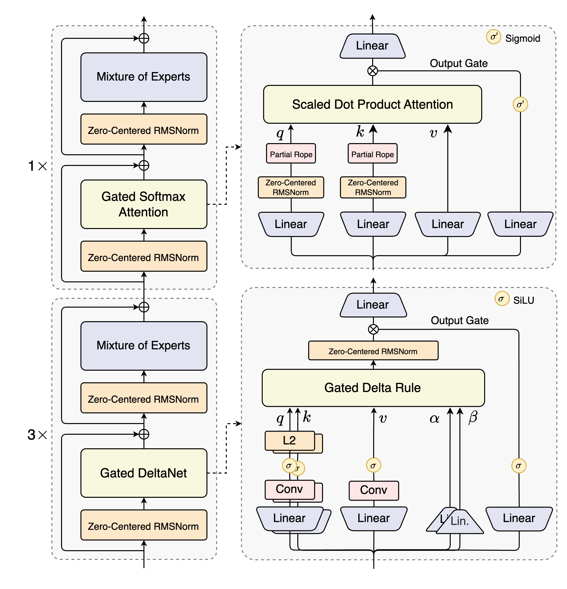

# 1. 总体介绍 Qwen

## 1.1 先看两张图

**官方 Qwen3-Next 架构图**展示了三条主线：**Gated DeltaNet** 作为线性 token mixer、**Gated Softmax Attention** 作为精确的全注意力 token mixer，以及每个 block 后面的 **Mixture of Experts**。图中右下角的 Gated Delta Rule 负责跨时间的递归状态更新，右上角的 Gated Softmax Attention 负责显式的 token-to-token 交互。



下面详细推导 **Gated DeltaNet** 的来龙去脉，并在最后精读 transformers 库中的对应源码。

---

# 2. Linear Attention → Delta Rule → Gated Delta Rule → Gated DeltaNet 的演化

> 参考视频：[【线性注意力】Linear Attention 讲透：核函数替代 softmax，O(n²) 降到 O(n)](https://www.bilibili.com/video/BV1JE826rEVe/?spm_id_from=333.337.search-card.all.click&vd_source=e98b669ccbafff4b5aa59dd6303b722f)

## 2.0 演化总览：一张表先看懂全部逻辑

这三代方法不是三个孤立的发明，而是**同一个骨架上的三次升级**。它们的共同点是：都维护一个矩阵状态 $W$（"矩阵记忆体"），每来一个 token 就做一次**外积更新**，读出让查询去乘这个矩阵。演化只改了两件事：**写入什么**、**何时遗忘**。

| 代际 | 状态递推方程 | 读出 | 写入的是什么 | 相比上一代的改动 |
|---|---|---|---|---|
| **Linear Attention** (2020) | $W_t=W_{t-1}+v_t\,\tilde{k}_t^\top$ | $o_t=W_t\tilde{q}_t$（$+z_t^\top\tilde{q}_t$ 归一化） | 盲目写入 $v_t$：不管旧记忆里已有什么，原样叠加 | 用核函数+结合律把 $O(N^2)$ 降到 $O(N)$，换来矩阵记忆体 |
| **DeltaNet** (2021) | $W_t=W_{t-1}\big(I-\beta_t k_tk_t^\top\big)+\beta_t v_t k_t^\top$ | $o_t=W_t q_t$ | 写入**预测误差** $v_t-W_{t-1}k_t$：先检索、算差、只把差写进去 | 把"写入"改造成**一步在线梯度下降**，记忆可以被定向纠错 |
| **Gated Delta Rule** (2024) | $W_t=\operatorname{Diag}(\alpha_t)W_{t-1}+\beta_t\big(v_t-\operatorname{Diag}(\alpha_t)W_{t-1}k_t\big)k_t^\top$ | $o_t=W_t q_t$ | 遗忘后的误差：先按数据驱动的速率 $\alpha_t$ 冲刷历史，再纠错写入 | 给记忆装上**可学习的遗忘闸门** |
| **Gated DeltaNet** | —— | —— | —— | 把 Gated Delta Rule 装进完整 block：加 conv1d 局部混合、QK L2 归一化、输出门 $z$、RMSNormGated |

**主线**：Linear Attention 用**核函数**（把 softmax 换成特征映射的内积）造出了"矩阵记忆体"，再用**结合律**把查询提出求和号外、把复杂度降到 $O(N)$——但它**只会记、不会改也不会忘**；DeltaNet 把状态更新本身做成对预测损失 $\frac{1}{2}\|Wk-v\|^2$ 的**一步在线梯度下降**，教会记忆体**先检索、只写误差**的定向纠错；Gated Delta Rule 又给记忆体装上**数据驱动的遗忘闸门**，且顺序严格为**先全局遗忘、再基于残存记忆纠错**；Gated DeltaNet 则是这条方程在真实模型里的完整工程形态。

下面逐代展开推导，每代都回答一个问题：**它修的是上一代的什么毛病？**

## 2.1 Linear Attention

### 2.1.1 起点：核化后的因果注意力

标准 attention 的核心是注意力矩阵 $A$，其中每个元素（省略 $\sqrt{d}$）：

$$A_{ti} = \mathbf{softmax}(q_t^\top k_i) = \frac{\exp(q_t^\top k_i)}{\sum_{j=1}^t \exp(q_t^\top k_j)}$$

这个 $A_{ti}$ **同时依赖于 $t$ 和 $i$**，无法拆成"只含 $t$"和"只含 $i$"两部分的乘积，因此对于每个 $t$（共 $N$ 个 token），必须重新遍历所有 $i=1,\dots,t$：

```
for t = 1 to N:           ← N 次
    for i = 1 to t:       ← 平均 N/2 次
        计算 q_t 与 k_i 的相似度
```
总计算量 $= 1 + 2 + \dots + N = \frac{N(N+1)}{2} \sim O(N^2)$。

Linear Attention 论文（Katharopoulos et al., 2020）把标准 softmax 替换成核函数 $\kappa(q,k)=\phi(q)^\top\phi(k)$ [^1]。为了书写简洁，论文用 $\tilde{q}_t:=\phi(q_t)$、$\tilde{k}_i:=\phi(k_i)$ 表示特征映射后的向量，得到论文中的公式 (3)：

[^1]: **核函数性质：任意相似度都可以拆成两个映射的内积**：$
  k(\mathbf q,\mathbf k)=\langle \phi(\mathbf q),\phi(\mathbf k)\rangle
  $。<br>
常用映射:<br>
**ReLU**：$\phi(x)=\max(0,x)$。最简单；<br>
**ELU + 1**：$\phi(x)=\text{elu}(x)+1$。保留负数；    <br>
**随机特征**：Performer FAVOR+。逼近 softmax。

$$o_t=\frac{\displaystyle\sum_{i=1}^{t}(\tilde{q}_t^\top\tilde{k}_i)\,v_i}{\displaystyle\sum_{i=1}^{t}\tilde{q}_t^\top\tilde{k}_i}. \tag{3}$$

注意分子里的 $(\tilde{q}_t^\top\tilde{k}_i)$ 是一个**标量**（1×1），$v_i$ 是一个列向量。

### 2.1.2 分子：结合律如何产生矩阵 $W_t$

我们先看分子，目标是把 $\tilde{q}_t$ 从求和号里**提取**出来。

**第一步**：标量乘法可交换顺序
$$(\tilde{q}_t^\top\tilde{k}_i)\,v_i=v_i\,(\tilde{q}_t^\top\tilde{k}_i).$$

**第二步**：标量等于自身的转置
$$\tilde{q}_t^\top\tilde{k}_i=(\tilde{q}_t^\top\tilde{k}_i)^\top=\tilde{k}_i^\top\tilde{q}_t.$$

于是分子变成：
$$\sum_{i=1}^{t}v_i\,(\tilde{k}_i^\top\tilde{q}_t).$$

**第三步**：利用矩阵乘法结合律
$v_i$ 是 $d_v\times 1$ 的列向量，$\tilde{k}_i^\top\tilde{q}_t$ 是标量。一个列向量乘标量，等于先把列向量和标量里的"行向量部分"结合：

$$v_i\,(\tilde{k}_i^\top\tilde{q}_t)=\underbrace{(v_i\tilde{k}_i^\top)}_{d_v\times d_\phi}\,\tilde{q}_t.$$

这里 $v_i\tilde{k}_i^\top$ 是**外积**（列×行=矩阵），维度为 $d_v\times d_\phi$。

**第四步**：求和号只作用于与 $i$ 有关的部分
$$\sum_{i=1}^{t}(v_i\tilde{k}_i^\top)\tilde{q}_t=\left(\sum_{i=1}^{t}v_i\tilde{k}_i^\top\right)\tilde{q}_t.$$

论文定义：
$$W_t:=\sum_{i=1}^{t}v_i\tilde{k}_i^\top\quad\in\mathbb{R}^{d_v\times d_\phi}. \tag{4}$$

于是分子严格等于：
$$\boxed{W_t\tilde{q}_t}.$$

### 2.1.3 分母：结合律产生向量 $z_t$

分母更简单，全是标量求和：
$$\sum_{i=1}^{t}\tilde{q}_t^\top\tilde{k}_i=\tilde{q}_t^\top\left(\sum_{i=1}^{t}\tilde{k}_i\right).$$

论文定义：
$$z_t:=\sum_{i=1}^{t}\tilde{k}_i\quad\in\mathbb{R}^{d_\phi}.$$

于是分母等于：
$$\tilde{q}_t^\top z_t=z_t^\top\tilde{q}_t$$
（最后一步因为标量转置不变）。

### 2.1.4 公式 (5) 的诞生

把分子分母合起来，即得论文公式 (5)：

$$\boxed{o_t=\frac{W_t\tilde{q}_t}{z_t^\top\tilde{q}_t}}. \tag{5}$$

**关键认知**：这一步没有任何近似，纯粹是**结合律**的代数变形。Linear Attention 通过结合律，把计算拆成了两部分：
```
# 阶段一：只遍历一次历史，累加公共矩阵（O(N)）
W = 0
for i = 1 to N:
    W += v_i * φ(k_i)^T     ← 每个 i 只做一次外积

# 阶段二：每个查询只乘一次 W（O(N)）
for t = 1 to N:
    o_t = W_t * φ(q_t)      ← W_t 是 W 的前缀和
```

因为 $\phi(q_t)$ 被**提取到了求和号外面**，历史信息 $v_i\phi(k_i)^\top$ 的累加不再依赖 $t$ 的具体值。计算复杂度由 full attention 的 $O(N^2)$ 变成了当前 Linear Attention 的 $O(N)$。

### 2.1.5 递推视角：矩阵记忆体的"只增不减"

把公式 (4) 的求和写成**递推形式**（这正是理解后面两代演化的关键）：

$$\boxed{W_t=W_{t-1}+v_t\,\tilde{k}_t^\top},\qquad W_0=0.$$

对照标准 attention 的注意力行 $A_{t,:}$（softmax 后每步重新归一化、旧权重被稀释），Linear Attention 的状态更新有两个性质：

1. **纯累加**：新信息 $v_t\tilde{k}_t^\top$ 永远叠加在旧状态上，没有任何机制修改或删除已有记忆；
2. **写错无法改**：如果某个 $k$ 对应的值写错了，后面只能叠加新的外积去"覆盖"，旧错误永远留在 $W$ 里。

这就是 DeltaNet 要修的第一个毛病：**记忆体只会追加、不会改写**。同时注意这个递推已经完全是 RNN 形态：一个矩阵状态 + 每步秩一更新，这解释了为什么 Linear Attention 类方法都可以 $O(1)$ 解码（只需保存 $W_t$ 一个矩阵）。

> **参考文献**：Katharopoulos et al., *Transformers are RNNs: Fast Autoregressive Transformers with Linear Attention*, ICML 2020.
> [arXiv](https://arxiv.org/abs/2006.16236) / [PMLR](https://proceedings.mlr.press/v119/katharopoulos20a.html)

---

## 2.2 Delta Rule 的梯度推导（指标法）

Linear Attention 的问题：写入是"盲目"的。那怎样让记忆体**写入前先检索、写错能纠错**？DeltaNet 的答案极其漂亮：把状态更新看成对一个在线学习损失做**一步随机梯度下降**——梯度在哪，就往反方向修一点。

### 2.2.1 统一符号：采用 Fast Weight 视角

为了和 DeltaNet 原始论文（Schlag et al., 2021）一致，我们引入 **fast weight matrix** $W\in\mathbb{R}^{d\times d}$。它的作用是把输入 key 直接映射到 value：

$$\hat{v}=Wk.$$

（如果你更熟悉 Linear Attention 里的 $S$，两者的关系很简单：$W=S^\top$，只是转置关系。）

在第 $t$ 步，模型看到输入 $k_t\in\mathbb{R}^d$ 和目标输出 $v_t\in\mathbb{R}^d$，定义平方损失：

$$\mathcal{L}(W)=\frac{1}{2}\|\hat{v}_t-v_t\|^2=\frac{1}{2}(Wk_t-v_t)^\top(Wk_t-v_t). \tag{2}$$

### 2.2.2 把损失写成"带下标"的元素形式

设 $W$ 的第 $a$ 行第 $b$ 列元素为 $W_{ab}$，向量 $k_t$ 的第 $b$ 个元素为 $(k_t)_b$，$v_t$ 的第 $a$ 个元素为 $(v_t)_a$。

预测输出的第 $a$ 个分量：
$$(\hat{v}_t)_a=\sum_{b=1}^{d}W_{ab}(k_t)_b.$$

损失函数展开：
$$\mathcal{L}=\frac{1}{2}\sum_{a=1}^{d}\left[\underbrace{\left(\sum_{b=1}^{d}W_{ab}(k_t)_b\right)}_{(\hat{v}_t)_a}-(v_t)_a\right]^2.$$

### 2.2.3 对 $W_{mn}$ 求偏导数

我们要算的是 $\frac{\partial\mathcal{L}}{\partial W_{mn}}$（第 $m$ 行第 $n$ 列元素的偏导）。

根据链式法则：
$$\frac{\partial\mathcal{L}}{\partial W_{mn}}=

\frac{\partial(\mathcal{L})}{\partial(\hat{v}_t)_a}\frac{\partial(\hat{v}_t)_a}{\partial W_{mn}}=

\sum_{a=1}^{d}\left[(\hat{v}_t)_a-(v_t)_a\right]\cdot\frac{\partial(\hat{v}_t)_a}{\partial W_{mn}}.$$

先看内层偏导 $\frac{\partial(\hat{v}_t)_a}{\partial W_{mn}}$：
$$(\hat{v}_t)_a=\sum_{b}W_{ab}(k_t)_b.$$

对 $W_{mn}$ 求导时，只有当 $a=m$ 且 $b=n$ 时该项才不为零，因此：
$$\frac{\partial(\hat{v}_t)_a}{\partial W_{mn}}=\begin{cases}(k_t)_n,&a=m,\\0,&a\neq m.\end{cases}$$

代回链式法则，求和号里只剩 $a=m$ 这一项：
$$\frac{\partial\mathcal{L}}{\partial W_{mn}}=\left[(\hat{v}_t)_m-(v_t)_m\right]\cdot(k_t)_n=(Wk_t-v_t)_m\cdot(k_t)_n.$$

### 2.2.4 从元素回到矩阵

我们发现，梯度矩阵的第 $(m,n)$ 个元素等于：
$$G_{mn}=(Wk_t-v_t)_m\cdot(k_t)_n.$$

这正是**外积** $(Wk_t-v_t)\,k_t^\top$ 的第 $(m,n)$ 个元素。因为：
- $(Wk_t-v_t)$ 是 $d\times 1$ 列向量，第 $m$ 个元素是 $(Wk_t-v_t)_m$；
- $k_t^\top$ 是 $1\times d$ 行向量，第 $n$ 个元素是 $(k_t)_n$；
- 两者相乘得到 $d\times d$ 矩阵，第 $(m,n)$ 个元素正好是上面的乘积。

因此：
$$\boxed{\nabla_W\mathcal{L}=(Wk_t-v_t)\,k_t^\top}. \tag{梯度公式}$$

**维度检查**：$W$ 是 $d\times d$，$(Wk_t-v_t)$ 是 $d\times 1$，$k_t^\top$ 是 $1\times d$，外积结果恰好是 $d\times d$，与 $W$ 同维度。**维度一致，说明公式正确。**

### 2.2.5 SGD 更新即得 Delta Rule

梯度下降 $W_t=W_{t-1}-\beta_t\nabla_W\mathcal{L}$，代入：

$$W_t=W_{t-1}-\beta_t(W_{t-1}k_t-v_t)k_t^\top.$$

把括号拆开：
$$W_t=W_{t-1}-\beta_t W_{t-1}k_t k_t^\top+\beta_t v_t k_t^\top.$$

提取公因式 $W_{t-1}$：
$$\boxed{W_t=W_{t-1}\big(I-\beta_t k_t k_t^\top\big)+\beta_t v_t k_t^\top}. \tag{DeltaNet}$$

这就是 DeltaNet 核心更新方程的完整来源：**它等价于对线性预测损失做一步随机梯度下降。**

### 2.2.6 从 Linear Attention 到 Delta Rule：到底改了哪一项

把 Delta Rule 按"写入内容"重新整理：

$$W_t=\underbrace{W_{t-1}}_{\text{旧状态}}+\underbrace{\beta_t v_t k_t^\top}_{\text{写入目标}}-\underbrace{\beta_t(W_{t-1}k_t)\,k_t^\top}_{\text{纠错项：把旧状态已预测的部分减掉}}$$

与 Linear Attention 的 $W_t=W_{t-1}+v_t\tilde{k}_t^\top$ 逐项对比：

| | Linear Attention | DeltaNet |
|---|---|---|
| 写入强度 | 恒为 1（不可调） | 可学习的学习率 $\beta_t$ |
| 写入内容 | 盲目写入 $v_t$ | 写入**预测误差** $v_t-W_{t-1}k_t$ |
| 写入方向 | $\tilde{k}_t$（特征映射后的 key） | $k_t$（原始 key，通常配 L2 归一化） |

**物理图像**：Delta Rule 每步执行"先读后写"——用旧记忆检索出 $\hat{v}_t=W_{t-1}k_t$，与真实值 $v_t$ 求差，**只把这个残差沿 $k_t$ 方向写回记忆**。由于更新 $-\beta_t(\hat v_t - v_t)k_t^\top$ 是秩一的、只作用在 $k_t$ 方向上，它修正了这条 key 的记忆，**不扰动其他方向的记忆**——这就是"Surgical Eraser（外科手术式橡皮擦）"这个比喻的含义。

> **注意一个常见误解**：$\beta_t\to 0$ **不是**退化为 Linear Attention。$\beta=0$ 时纠错和写入一起消失，状态什么都不写，记忆永远为零。正确的退化关系见 2.3.4 的退化阶梯。

> **参考文献**：Schlag et al., *Linear Transformers are Secretly Fast Weight Programmers*, NeurIPS 2021.
> [arXiv](https://arxiv.org/abs/2102.11174)

---

## 2.3 Gated Delta Rule 与 Gated DeltaNet

DeltaNet 修好了"写错不能改"，但还剩一个毛病：**记忆永远累积，没有遗忘**。真实语言里信息有时效性，旧上下文应该按数据驱动的速率淡出。Gated DeltaNet（Yang et al., 2024）的方程不是"凭空设计"的，而是遵循一个非常清晰的原则：**先全局遗忘，再局部纠错**。下面展示它的两步构造法。

先澄清两个名字的层次，后文会反复用到：

- **Gated Delta Rule**：指那一条带门控的状态更新**方程**（数学对象）；
- **Gated DeltaNet**：指把这条方程装进完整 transformer block 的**模块**（工程对象，见第 3 节源码）。

### 2.3.1 第一步：输入依赖的全局遗忘

引入门控向量 $\alpha_t\in(0,1)^d$，它由当前输入经一个小型投影网络 + Sigmoid 生成。定义对角衰减矩阵：

$$\Lambda_t:=\operatorname{Diag}(\alpha_t)\in\mathbb{R}^{d\times d}.$$

对历史状态做逐行（逐通道）的指数式衰减：
$$W'_{t-1}=\Lambda_t\,W_{t-1}=\operatorname{Diag}(\alpha_t)\,W_{t-1}.$$

**语义**：如果某个 $\alpha_t$ 的分量接近 0，则状态矩阵对应行的信息被大幅冲刷；接近 1 则基本保留。这个遗忘速率是数据驱动的。

（在 Qwen3-Next / HF 的官方实现里，$\alpha_t$ 取**每个 head 一个标量**的特例，即 $\Lambda_t$ 对角元全相等；Kimi Linear 等变体使用逐通道的完整对角门。）

### 2.3.2 第二步：基于衰减状态做 Delta Rule

遗忘后，我们用**已经衰减过的旧状态** $W'_{t-1}$ 来做检索和纠错：

1. **检索**：$\hat{v}_t=W'_{t-1}k_t=\Lambda_t W_{t-1}k_t$；
2. **误差**：$e_t=v_t-\hat{v}_t=v_t-\Lambda_t W_{t-1}k_t$；
3. **修正**：按 delta rule 写入误差。

更新方程：
$$W_t=W'_{t-1}+\beta_t\,e_t k_t^\top.$$

**注意时序因果性的细节**：检索用的是**遗忘后**的状态 $W'_{t-1}$ 而不是 $W_{t-1}$。这意味着 token $t$ 只能读到"被 $\alpha_t$ 衰减过"的过去——遗忘发生在读取之前，保证了"先遗忘、再基于残存记忆预测"的严格因果顺序。

### 2.3.3 完整方程

把两步合起来，得到 Gated Delta Rule 的核心递推：

$$\boxed{W_t=\operatorname{Diag}(\alpha_t)\,W_{t-1}+\beta_t\left(v_t-\operatorname{Diag}(\alpha_t)\,W_{t-1}k_t\right)k_t^\top}. \tag{Gated DeltaNet}$$

展开括号也可以写成与 DeltaNet 同构的形式：

$$W_t=\operatorname{Diag}(\alpha_t)\,W_{t-1}\big(I-\beta_t k_tk_t^\top\big)+\beta_t v_t k_t^\top.$$

**各项的严格语义**：

| 项 | 数学作用 |
|---|---|
| $\operatorname{Diag}(\alpha_t)W_{t-1}$ | **全局遗忘**：历史状态按输入依赖的速率逐行衰减 |
| $\operatorname{Diag}(\alpha_t)W_{t-1}k_t$ | **衰减后检索**：基于"遗忘后的记忆"做预测，保证时序因果性 |
| $\beta_t(v_t-\dots)k_t^\top$ | **定向纠错**：只沿 $k_t$ 方向修正误差，不扰动其他记忆 |


### 2.3.4 从方程到架构：Gated DeltaNet 模块全家福

方程本身只描述了"状态怎么更新"。要让它在真实模型里工作，Gated DeltaNet 模块还需要一系列配套结构（第 3 节源码逐行对照）：

```
hidden_states
   │
   ├─ in_proj_qkvz ──→ q, k, v, z        # 四个投影：z 是输出门
   ├─ in_proj_ba   ──→ b, a              # b → sigmoid 得 β；a + A_log → softplus 得 log α
   │
   ├─ causal Conv1d(q, k, v) + SiLU      # 短卷积：给 q/k/v 做局部 token 混合（4 token 感受野）
   │
   ├─ L2Norm(q), L2Norm(k)               # 把 key 约束在单位球面上，稳定检索
   │
   ├─ Gated Delta Rule 核心              # 训练走分块并行(chunked)，解码走逐 token 递归(recurrent)
   │
   ├─ RMSNormGated(·, z) = RMSNorm(o) ⊙ SiLU(z)   # 输出门：z 控制每个通道放行的信息量
   │
   └─ out_proj ──→ output
```

**设计意图**：conv1d 负责"空间上"相邻 token 的局部混合，Gated Delta Rule 负责"时间上"的远距离依赖，输出门 $z$ 提供逐通道的输出调控——三者分工，缺一不可。

> **参考文献**：Yang et al., *Gated Delta Networks: Improving Mamba2 with Delta Rule*, ICLR 2025.
> [arXiv](https://arxiv.org/abs/2412.06464) / [OpenReview](https://openreview.net/forum?id=r8H7xhYPwz) / [Code](https://github.com/NVlabs/GatedDeltaNet)

---

# 3. 源码精读：transformers 中 Gated Delta Rule / Gated DeltaNet 的实现

> **代码来源**：Hugging Face transformers 库 `src/transformers/models/qwen3_next/modeling_qwen3_next.py`（Qwen3-Next 官方实现）。线上环境默认调用 FLA（flash-linear-attention）的 CUDA kernel，本文精读的是其中的 **torch fallback 版本**——它们与论文公式逐行对应、不依赖 Triton，最适合学习。（3.5 节附上了本文档全部数值验证的代码与结果。）

## 3.1 维度约定总表

读代码前先统一符号。下文用 $B$=batch，$T$=序列长，$H_k$/$H_v$=key/value head 数，$DK$=key 头维，$DV$=value 头维，$C$=chunk 数，$cs$=chunk 大小（默认 64）。

| 数学符号 | 代码变量 | 张量形状 | 含义 |
|---|---|---|---|
| $q_t$ | `query` | `[B, T, H_k, DK]` | 查询（L2 归一化 + $1/\sqrt{DK}$ 缩放后使用） |
| $k_t$ | `key` | `[B, T, H_k, DK]` | 键（同上归一化） |
| $v_t$ | `value` | `[B, T, H_v, DV]` | 值 |
| $\alpha_t$（log） | `g` / `decay` | `[B, T, H_v]` | 遗忘门，**log 空间**，$\alpha_t=e^{g_t}\in(0,1]$ |
| $\beta_t$ | `beta` | `[B, T, H_v]` | 学习率（sigmoid 输出，$\in(0,1)$） |
| $S_t=W_t^\top$ | `last_recurrent_state` | `[B, H_v, DK, DV]` | 递归状态。**注意转置约定**：代码状态是 $S\in\mathbb{R}^{DK\times DV}$，本笔记推导用 $W=S^\top\in\mathbb{R}^{DV\times DK}$ |
| $o_t$ | `core_attn_out` | `[B, T, H_v, DV]` | 层输出（门控归一化 + out_proj 之前） |
| $z_t$ | `z` | `[B, T, H_v, DV]` | 输出门 |

**实现与论文的两个差异点（都是特例化，不是错误）**：

1. $\alpha_t$ 每 head 一个**标量**（`g` 形状 `[B,T,H_v]`），即 $\operatorname{Diag}(\alpha_t)$ 对角元全相等的特例；论文公式允许逐通道门；
2. 状态存成 $S=W^\top$，所以代码里所有公式相对笔记推导**左右镜像**（检索变成 $S^\top k$ 而不是 $Wk$），数值完全等价。

## 3.2 Gated Delta Rule 递归实现（逐 token，解码用）

对应源码 `torch_recurrent_gated_delta_rule`。它就是把 2.3.3 的 boxed 方程原样翻译成 PyTorch，一个 token 循环一次。逐行注释如下（每行注释给出**对应公式**与**张量维度**）：

```python
def torch_recurrent_gated_delta_rule(
    query, key, value, g, beta,
    initial_state=None, output_final_state=False,
    use_qk_l2norm_in_kernel=False, **kwargs,
):
    # ───────────── 输入形状（见 3.1 维度总表）─────────────
    # query/key: [B, T, H_k, DK]   value: [B, T, H_v, DV]
    # g (log α): [B, T, H_v]       beta:  [B, T, H_v]
    initial_dtype = query.dtype
    batch_size, sequence_length, _, k_head_dim = key.shape
    num_v_heads, v_head_dim = value.shape[-2:]
    decay = g  # 即论文的 log α_t；参数名 g 是为了对齐 FLA 库的 API

    # 全部升精度到 fp32，并把 head 维提前：[B, T, H, D] → [B, H, T, D]
    query, key, value, beta, decay = [
        x.transpose(1, 2).to(torch.float32, memory_format=torch.contiguous_format)
        for x in (query, key, value, beta, decay)
    ]
    # query/key/value: [B, H, T, D]    beta/decay: [B, H, T]

    if use_qk_l2norm_in_kernel:                # Qwen3-Next 恒为 True
        query = l2norm(query, dim=-1, eps=1e-6)  # q̃ = q/‖q‖₂:   [B, H, T, DK]
        key   = l2norm(key,   dim=-1, eps=1e-6)  # k̃ = k/‖k‖₂:   [B, H, T, DK]
    query = query / (query.shape[-1] ** 0.5)   # 论文中的 1/√d 缩放: [B, H, T, DK]

    # ───────────── 状态初始化 ─────────────
    # S ∈ R^{DK×DV}（笔记里的 W = S^T），每个 (batch, value head) 一份
    if initial_state is None:
        recurrent_state_shape = (batch_size, num_v_heads, k_head_dim, v_head_dim)
        last_recurrent_state = torch.zeros(recurrent_state_shape, dtype=value.dtype, device=value.device)
    else:
        last_recurrent_state = initial_state.to(value)      # [B, H_v, DK, DV]
    core_attn_out = torch.zeros_like(value)                 # 输出 o: [B, H_v, T, DV]

    # ═══════════ 主循环：每个 token 严格对应 2.3.3 方程的一步 ═══════════
    for i in range(sequence_length):
        q_t, k_t, v_t = query[:, :, i], key[:, :, i], value[:, :, i]
        # q_t: [B, H_v, DK]    k_t: [B, H_v, DK]    v_t: [B, H_v, DV]

        # ── 第一步：全局遗忘 ──  S ← Diag(α_t)·S
        # α_t = exp(g_t)；此处每个 head 一个标量，[B,H_v,1,1] 与 [B,H_v,DK,DV] 广播
        decay_t = decay[:, :, i].exp()[..., None, None]     # α_t: [B, H_v, 1, 1]
        last_recurrent_state = last_recurrent_state * decay_t   # S: [B, H_v, DK, DV]

        # ── 第二步：局部纠错（delta rule 的一步 SGD）──
        beta_t = beta[:, :, i].unsqueeze(-1)                # β_t: [B, H_v, 1]
        # 检索 v̂_t = Sᵀk_t：
        #   k_t.unsqueeze(-1) → [B,H_v,DK,1]，与 S [B,H_v,DK,DV] 逐元素相乘，
        #   再对 dim=-2(即 DK) 求和 → 结果 [B,H_v,DV]，恰是 (Sᵀ @ k_t[...]) 的第 j 个分量 Σ_i S[i,j]·k[i]
        kv_mem = (last_recurrent_state * k_t.unsqueeze(-1)).sum(dim=-2)   # v̂_t: [B, H_v, DV]
        delta = (v_t - kv_mem) * beta_t                     # β_t(v_t − v̂_t): [B, H_v, DV]
        # 写入 S ← S + k_t δ_tᵀ：
        #   k_t.unsqueeze(-1): [B,H_v,DK,1]（列向量），delta.unsqueeze(-2): [B,H_v,1,DV]（行向量），
        #   外积得 [B,H_v,DK,DV]，正是秩一更新 k_t δ_t^T
        last_recurrent_state = last_recurrent_state + k_t.unsqueeze(-1) * delta.unsqueeze(-2)  # [B, H_v, DK, DV]

        # ── 读出：o_t = S_tᵀq_t（含本 token 的写入，因果性成立）──
        core_attn_out[:, :, i] = (last_recurrent_state * q_t.unsqueeze(-1)).sum(dim=-2)        # o_t: [B, H_v, DV]

    last_recurrent_state = None if not output_final_state else last_recurrent_state
    core_attn_out = core_attn_out.transpose(1, 2).contiguous().to(initial_dtype)  # 还原 [B, T, H_v, DV]
    return core_attn_out, last_recurrent_state
```

**代码 ↔ 公式对照表**（笔记记号 $W=S^\top$）：

| 代码行 | 数学公式 | 维度速查 |
|---|---|---|
| `S = S * decay_t` | $W_t \leftarrow \operatorname{Diag}(\alpha_t)W_{t-1}$（遗忘） | `[B,H,1,1] × [B,H,DK,DV]` |
| `kv_mem = (S * k_t[...,None]).sum(-2)` | $\hat v_t = W'_{t-1}k_t$（衰减后检索） | 对 `DK` 求和 → `[B,H,DV]` |
| `delta = (v_t - kv_mem) * beta_t` | $e_t=\beta_t(v_t-\hat v_t)$（误差×学习率） | `[B,H,DV]` |
| `S = S + k_t[...,None] * delta[...,None,:]` | $W_t = W'_{t-1} + \beta_t e'_t k_t^\top$（秩一写入） | 外积 `[B,H,DK,1]×[B,H,1,DV]` |
| `out = (S * q_t[...,None]).sum(-2)` | $o_t = W_t q_t$（读出） | 对 `DK` 求和 → `[B,H,DV]` |

**易错点**：`kv_mem` 和输出**不是**矩阵乘法 `S @ k_t` 的直觉方向。`S` 是 `[DK, DV]`，直接 `S @ k_t` 维度对不上；代码用"逐元素乘 + 对 DK 求和"实现 $S^\top k$，读代码时脑中始终把 $S$ 想成 $W^\top$ 即可。

**什么时候走这条路**：`seq_len == 1` 且有 KV cache 的**解码阶段**。每步只处理一个新 token，复杂度 $O(1)$（状态矩阵不随历史增长）。

## 3.3 Gated Delta Rule 分块并行实现（chunked，训练 / prefill 用）

对应源码 `torch_chunk_gated_delta_rule`。训练时一次要算整个序列，逐 token 循环在 GPU 上完全无法并行。chunked 版本把序列切成 $C$ 个长度为 $cs$ 的块：

- **块内**（$cs\times cs$ 的小矩阵）用矩阵乘法批量并行；
- **块间**的状态传递无法避免串行，但只有 $C=T/cs$ 步（$T=8192$、$cs=64$ 时只有 128 步，而逐 token 是 8192 步）。

**核心数学工具：UT 变换**。块内连续施加 $cs$ 次 delta rule 更新，可以整理成"先解一个 $cs\times cs$ 的单位下三角方程组，再做几次矩阵乘"——这就是 Schlag et al. 2021 提出的 Upper-Triangular transform。代码里的 `ut_system` 就是这个三角系统。

```python
def torch_chunk_gated_delta_rule(
    query, key, value, g, beta, chunk_size=64,
    initial_state=None, output_final_state=False,
    use_qk_l2norm_in_kernel=False, **kwargs,
):
    # ───────────── 输入形状同 3.2；先转置 + fp32 ─────────────
    initial_dtype = query.dtype
    batch_size, sequence_length, _, k_head_dim = key.shape        # [B, T, H_k, DK]
    num_v_heads, v_head_dim = value.shape[-2:]                    # [B, T, H_v, DV]
    recurrent_state_shape = (batch_size, num_v_heads, k_head_dim, v_head_dim)
    padded_output_shape = (batch_size, num_v_heads, -1, v_head_dim)
    decay = g                                                     # log α_t: [B, T, H_v]

    query, key, value, beta, decay = [
        x.transpose(1, 2).to(torch.float32, memory_format=torch.contiguous_format)
        for x in (query, key, value, beta, decay)
    ]                                                             # → [B, H, T, D] / [B, H, T]
    if use_qk_l2norm_in_kernel:
        query = l2norm(query, dim=-1, eps=1e-6)                   # q̃: [B, H, T, DK]
        key   = l2norm(key,   dim=-1, eps=1e-6)                   # k̃: [B, H, T, DK]
    query = query * (query.shape[-1] ** -0.5)                     # 1/√DK 缩放

    # ───────────── 序列补齐到 cs 的整数倍，然后切成 C 个块 ─────────────
    pad_size = (chunk_size - sequence_length % chunk_size) % chunk_size
    query, key, value = (F.pad(x, (0, 0, 0, pad_size)) for x in (query, key, value))
    beta, decay = (F.pad(x, (0, pad_size)) for x in (beta, decay))
    total_sequence_length = sequence_length + pad_size
    num_chunks = total_sequence_length // chunk_size              # C

    # 预乘 β：β_t 是"学习率"，提前折进 k 和 v
    v_beta = value * beta.unsqueeze(-1)                           # β_t v_t: [B, H, T, DV]
    k_beta = key * beta.unsqueeze(-1)                           # β_t k_t: [B, H, T, DK]

    # 切块：序列维 T → (C, cs)。此后所有张量多出一个块维
    query, key, k_beta, v_beta = [
        x.reshape(x.shape[0], x.shape[1], -1, chunk_size, x.shape[-1])
        for x in (query, key, k_beta, v_beta)
    ]                                                             # [B, H, C, cs, D]
    decay = decay.reshape(decay.shape[0], decay.shape[1], -1, chunk_size)  # [B, H, C, cs]

    # ───────────── 块内衰减的"前缀积"：cumsum 代替连乘 ─────────────
    # g 在 log 空间，所以 cumsum 就是普通空间的连乘：
    #   cum_decay[..., r] = Σ_{j≤r} g_j = log(γ_r)，γ_r = ∏_{j≤r} α_j 为块内累计衰减
    strictly_upper_mask = torch.ones(chunk_size, chunk_size, dtype=torch.bool, device=query.device).triu(1)

    cum_decay = decay.cumsum(dim=3)                               # γ（log 空间）: [B, H, C, cs]

    # 两两衰减：pairwise_decay[..., i, j] = exp(cum_i − cum_j) = ∏_{j<s≤i} α_s （j≤i 时）
    # 严格上三角 (j>i) 是"未来"，违反因果，mask 成 -inf，exp 后为 0
    pairwise_decay = cum_decay.unsqueeze(4) - cum_decay.unsqueeze(3)   # [B, H, C, cs, cs]
    pairwise_decay = pairwise_decay.masked_fill(strictly_upper_mask, float("-inf"))
    pairwise_decay = pairwise_decay.exp()                         # [B, H, C, cs, cs]，下三角含对角

    # ───────────── 第一阶段：块内量（全部可并行，无循环）─────────────
    # UT 变换系统的"左端"：A[i,j] = (β_i k_i)·k_j × 衰减(i,j)，单位下三角
    ut_system = (k_beta @ key.transpose(-1, -2)) * pairwise_decay          # [B, H, C, cs, cs]
    # 块内注意力分数：q_i·k_j × 衰减(i,j)
    intra_chunk_attn = (query @ key.transpose(-1, -2)) * pairwise_decay    # [B, H, C, cs, cs]
    # 被累计衰减"运送"到块尾的 key：k̃_j = k_j · γ_j
    decayed_k_beta = k_beta * cum_decay.exp().unsqueeze(-1)                # [B, H, C, cs, DK]

    # 解单位下三角方程组（UT 变换的核心）：
    #   new_values ("u")：块内 cs 次 delta 更新的"净写入值"——旧状态已预测的部分被减掉
    #   k_cumdecay：读旧状态用的衰减 key
    new_values = torch.linalg.solve_triangular(ut_system, v_beta, upper=False, unitriangular=True)        # [B, H, C, cs, DV]
    k_cumdecay = torch.linalg.solve_triangular(ut_system, decayed_k_beta, upper=False, unitriangular=True)  # [B, H, C, cs, DK]

    # ───────────── 为块间扫描预加工 ─────────────
    if initial_state is None:
        last_recurrent_state = torch.zeros(recurrent_state_shape, dtype=new_values.dtype, device=new_values.device)
    else:
        last_recurrent_state = initial_state.to(new_values)       # S: [B, H_v, DK, DV]
    core_attn_out = torch.zeros_like(new_values)                  # [B, H, C, cs, DV]

    # q 乘"从块首到当前位置"的累计衰减；k 乘"从当前位置到块尾"的剩余衰减
    query = query * cum_decay.exp().unsqueeze(-1)                 # q̃_i · γ_i:     [B, H, C, cs, DK]
    key = key * (cum_decay[..., -1:] - cum_decay).exp().unsqueeze(-1)  # k_j·(γ_cs/γ_j): [B, H, C, cs, DK]
    chunk_decay = cum_decay[..., -1].exp()[..., None, None]       # 整块总衰减 α_chunk=γ_cs: [B, H, C, 1, 1]

    # ───────────── 第二阶段：块间串行扫描（只有 C 步）─────────────
    for i in range(num_chunks):
        # 用旧状态检索、把旧状态能预测的部分从净写入值中减掉 —— 这就是 delta rule 的"纠错"
        v_new = new_values[:, :, i] - k_cumdecay[:, :, i] @ last_recurrent_state   # u − k̃Sᵀ: [B, H, cs, DV]
        # 输出 = 跨块读旧状态（q̃·衰减 @ S）+ 块内读（intra @ v_new）
        inter_chunk_attn = query[:, :, i] @ last_recurrent_state                   # q̃γ S: [B, H, cs, DV]
        core_attn_out[:, :, i] = inter_chunk_attn + intra_chunk_attn[:, :, i] @ v_new
        # 状态更新：遗忘（×整块衰减）+ 写入（k̃ᵀ @ v_new，外积累加成矩阵乘）
        last_recurrent_state = last_recurrent_state * chunk_decay[:, :, i] + key[:, :, i].transpose(-1, -2) @ v_new

    last_recurrent_state = None if not output_final_state else last_recurrent_state
    core_attn_out = core_attn_out.reshape(padded_output_shape)    # [B, H_v, T', DV]
    core_attn_out = core_attn_out[:, :, :sequence_length]         # 去掉补齐的尾巴
    core_attn_out = core_attn_out.transpose(1, 2).to(initial_dtype, memory_format=torch.contiguous_format)  # [B, T, H_v, DV]
    return core_attn_out, last_recurrent_state
```

**中间张量维度速查表**（记住一句话：切块后所有张量都是 `[B, H, C, cs, …]` 的五维形态）：

| 代码变量 | 形状 | 数学含义 |
|---|---|---|
| `cum_decay` | `[B, H, C, cs]` | $\gamma_r=\prod_{j\le r}\alpha_j$（log 空间的块内前缀积） |
| `pairwise_decay` | `[B, H, C, cs, cs]` | $\prod_{j<s\le i}\alpha_s$（位置 $j\to i$ 的衰减）；严格上三角为 0 |
| `ut_system` | `[B, H, C, cs, cs]` | UT 变换的三角矩阵 $A$（单位下三角），$A_{ij}=(\beta_i k_i^\top k_j)\cdot$ 衰减 |
| `intra_chunk_attn` | `[B, H, C, cs, cs]` | 块内注意力分数 $\tilde q_i^\top k_j\cdot$ 衰减，已含因果 mask |
| `new_values`（$u$） | `[B, H, C, cs, DV]` | UT 变换后的"净写入值"：块内 $cs$ 次 delta 更新的压缩表示 |
| `k_cumdecay` | `[B, H, C, cs, DK]` | 乘了累计衰减的 key，用于读/扣旧状态 |
| `v_new` | `[B, H, cs, DV]` | 扣除旧状态预测后的真正写入量（**纠错发生在这里**） |
| `chunk_decay` | `[B, H, C, 1, 1]` | 整块遗忘系数 $\prod_{j\in\text{chunk}}\alpha_j$ |

**三个关键行与公式的对应**（对照 2.3.3 的 boxed 方程）：

| 代码 | 对应公式 |
|---|---|
| `v_new = new_values − k_cumdecay @ S` | 误差构造：$e_t = v_t - \operatorname{Diag}(\alpha)\,W_{t-1}k_t$ 的块内批量版——把"旧状态已经能预测的部分"从写入内容里扣掉 |
| `out = q̃γ @ S + intra @ v_new` | 读出 = 跨块检索 + 块内检索（$o_t = W_t q_t$ 的分解版） |
| `S = S·chunk_decay + k̃ᵀ @ v_new` | 状态更新：遗忘 $\times$ 整块衰减 + 秩一写入 $k\,\delta^\top$ 的块内累加（矩阵乘形式） |

**为什么 chunked 与 recurrent 严格等价**：chunked 没有做任何近似，只是把同一条递推按"块内解析展开 + 块间递推"重排。3.5 节的数值验证显示两者输出逐位一致（误差仅来自 float32 累加顺序）。

## 3.4 GatedDeltaNet 模块：从 hidden_states 到输出

对应源码 `Qwen3NextGatedDeltaNet`（`__init__` 定义各投影，`forward` 串起全流程）。这一层回答的问题是：上一节的 `q/k/v/g/beta` 到底**从哪来**。

```python
class Qwen3NextGatedDeltaNet(nn.Module):
    def __init__(self, config, layer_idx):
        super().__init__()
        self.hidden_size = config.hidden_size                 # d_model，如 2048
        self.num_v_heads = config.linear_num_value_heads      # H_v
        self.num_k_heads = config.linear_num_key_heads        # H_k（通常 ≤ H_v，GQA 结构）
        self.head_k_dim = config.linear_key_head_dim          # DK
        self.head_v_dim = config.linear_value_head_dim        # DV
        self.key_dim = self.head_k_dim * self.num_k_heads     # H_k·DK
        self.value_dim = self.head_v_dim * self.num_v_heads   # H_v·DV
        self.conv_kernel_size = config.linear_conv_kernel_dim # 短卷积核宽，如 4

        # 深度可分离因果卷积：q/k/v 三条路共享一个 conv，对每个通道独立做时间维卷积
        # 作用：给 token 做局部（kernel_size 大小感受野）混合，弥补线性注意力"逐位置写入"的局部性不足
        self.conv_dim = self.key_dim * 2 + self.value_dim     # 2·H_k·DK + H_v·DV
        self.conv1d = nn.Conv1d(
            in_channels=self.conv_dim, out_channels=self.conv_dim,
            bias=False, kernel_size=self.conv_kernel_size,
            groups=self.conv_dim,                             # groups=通道数 ⇒ 深度可分离
            padding=self.conv_kernel_size - 1,                # 右侧补零，配合 causal_conv1d_fn 裁掉未来
        )

        # 输入投影：一次 Linear 产生 q,k,v,z 四份；另一个 Linear 产生 b,a 两份
        #   z: 输出门（后面与 o 逐通道相乘）    b: 经 sigmoid 得 β    a: 参与生成 log α
        projection_size_qkvz = self.key_dim * 2 + self.value_dim * 2   # → [B,T, 2·H_k·DK + 2·H_v·DV]
        projection_size_ba = self.num_v_heads * 2                      # → [B,T, 2·H_v]
        self.in_proj_qkvz = nn.Linear(self.hidden_size, projection_size_qkvz, bias=False)
        self.in_proj_ba = nn.Linear(self.hidden_size, projection_size_ba, bias=False)

        # 离散化参数（沿用 Mamba 的设计）：
        #   A_log 初始化为 log(U(0.01, 16))：让初始衰减率落在合理区间
        #   dt_bias 保证 softplus 输入不靠近 0，log α 不会变成 -inf
        self.dt_bias = nn.Parameter(torch.ones(self.num_v_heads))      # [H_v]
        A = torch.empty(self.num_v_heads).uniform_(0.01, 16)
        self.A_log = nn.Parameter(torch.log(A))                        # [H_v]

        # 门控归一化 + 输出投影
        self.norm = Qwen3NextRMSNormGated(self.head_v_dim, eps=self.layer_norm_epsilon)
        self.out_proj = nn.Linear(self.value_dim, self.hidden_size, bias=False)

    def forward(self, hidden_states, cache_params=None, attention_mask=None, **kwargs):
        # hidden_states: [B, T, d_model]
        hidden_states = apply_mask_to_padding_states(hidden_states, attention_mask)
        seq_len = hidden_states.shape[1]
        use_precomputed_states = cache_params is not None and cache_params.has_previous_state(self.layer_idx)

        # ── ① 投影：从 hidden_states 一次算出全部角色 ──
        projected_states_qkvz = self.in_proj_qkvz(hidden_states)   # [B,T, 2·H_k·DK + 2·H_v·DV]
        projected_states_ba = self.in_proj_ba(hidden_states)       # [B,T, 2·H_v]
        # 按宽度切分成 q, k, v, z, b, a（含 GQA 的 head 重排）
        query, key, value, z, b, a = self.fix_query_key_value_ordering(projected_states_qkvz, projected_states_ba)
        # query/key: [B,T,H_k,DK]   value/z: [B,T,H_v,DV]   b/a: [B,T,H_v]
        query, key, value = (x.reshape(x.shape[0], x.shape[1], -1) for x in (query, key, value))

        # ── ② 短卷积 + SiLU：q/k/v 先做局部 token 混合 ──
        mixed_qkv = torch.cat((query, key, value), dim=-1)         # [B, T, 2·H_k·DK + H_v·DV]
        mixed_qkv = mixed_qkv.transpose(1, 2)                      # Conv1d 要 [B, 通道, T]
        if use_precomputed_states and seq_len == 1:                # 单 token 解码：增量更新卷积状态
            mixed_qkv = causal_conv1d_update(mixed_qkv, conv_state, self.conv1d.weight.squeeze(1), ...)
        else:                                                      # 训练/prefill：整段因果卷积
            if cache_params is not None:
                mixed_qkv = cache_params.update_conv_state(mixed_qkv, self.layer_idx, conv_kernel_size=self.conv_kernel_size)
            mixed_qkv = causal_conv1d_fn(mixed_qkv, self.conv1d.weight.squeeze(1), self.conv1d.bias, activation=self.activation)
            if cache_params is not None:
                mixed_qkv = mixed_qkv[:, :, -seq_len:]             # 裁掉左侧补零部分，只留因果部分
        mixed_qkv = mixed_qkv.transpose(1, 2)
        query, key, value = torch.split(mixed_qkv, [self.key_dim, self.key_dim, self.value_dim], dim=-1)
        query = query.reshape(query.shape[0], query.shape[1], -1, self.head_k_dim)   # [B,T,H_k,DK]
        key = key.reshape(key.shape[0], key.shape[1], -1, self.head_k_dim)           # [B,T,H_k,DK]
        value = value.reshape(value.shape[0], value.shape[1], -1, self.head_v_dim)   # [B,T,H_v,DV]

        # ── ③ 生成 β 和 log α（门控参数的"出生地"）──
        beta = b.sigmoid()                                         # β_t = σ(b) ∈ (0,1): [B,T,H_v]
        # g_t = −exp(A_log)·softplus(a + dt_bias) ≤ 0 ；α_t = exp(g_t) ∈ (0,1)
        # 数据驱动：a 由当前 hidden_states 投影而来 ⇒ 遗忘速率随输入变化
        g = -self.A_log.float().exp() * F.softplus(a.float() + self.dt_bias)   # [B,T,H_v]
        if self.num_v_heads // self.num_k_heads > 1:               # GQA：q/k 的 head 数扩充到 H_v
            query = query.repeat_interleave(self.num_v_heads // self.num_k_heads, dim=2)
            key = key.repeat_interleave(self.num_v_heads // self.num_k_heads, dim=2)

        # ── ④ 核心：Gated Delta Rule（解码走递归，训练走分块）──
        recurrent_state = cache_params.layers[self.layer_idx].recurrent_states[0] if use_precomputed_states else None
        if use_precomputed_states and seq_len == 1:                # 解码：逐 token，O(1) 状态
            core_attn_out, last_recurrent_state = torch_recurrent_gated_delta_rule(
                query, key, value, g=g, beta=beta, initial_state=recurrent_state,
                output_final_state=cache_params is not None, use_qk_l2norm_in_kernel=True, ...)
        else:                                                      # 训练/prefill：分块并行
            core_attn_out, last_recurrent_state = torch_chunk_gated_delta_rule(
                query, key, value, g=g, beta=beta, initial_state=recurrent_state,
                output_final_state=cache_params is not None, use_qk_l2norm_in_kernel=True, ...)

        if cache_params is not None:                               # 把新状态写回 cache，供下一步解码
            cache_params.update_recurrent_state(last_recurrent_state, self.layer_idx)

        # ── ⑤ 输出门 + 归一化 + 投影 ──
        core_attn_out = core_attn_out.reshape(-1, core_attn_out.shape[-1])   # [B·T·H_v, DV]
        z = z.reshape(-1, z.shape[-1])                                       # [B·T·H_v, DV]
        core_attn_out = self.norm(core_attn_out, z)              # RMSNorm(o) ⊙ SiLU(z): [B·T·H_v, DV]
        core_attn_out = core_attn_out.reshape(z_shape_og)                    # [B,T,H_v,DV]
        core_attn_out = core_attn_out.reshape(core_attn_out.shape[0], core_attn_out.shape[1], -1)  # [B,T,H_v·DV]
        output = self.out_proj(core_attn_out)                    # [B, T, d_model]
        return output
```

其中门控归一化 `Qwen3NextRMSNormGated` 的实现（`norm` before gate）：

```python
def forward(self, hidden_states, gate):                        # hidden_states=o: [N, DV], gate=z: [N, DV]
    variance = hidden_states.pow(2).mean(-1, keepdim=True)     # 沿 DV 维求方差
    hidden_states = hidden_states * torch.rsqrt(variance + eps)  # RMSNorm(o)
    hidden_states = self.weight * hidden_states                # 可学习缩放
    return hidden_states * F.silu(gate)                        # ⊙ SiLU(z)：输出门
```

**模块级数据流总结**（与 2.3.5 的架构图一一对应）：

```
hidden_states [B,T,d_model]
  → in_proj_qkvz ─┬─ q ─┐
  → in_proj_ba ───┼─ k ─┼─ Conv1d+SiLU ── L2Norm(q,k) ── Gated Delta Rule ──→ o [B,T,H_v,DV]
                  ├─ v ─┘        ↑                       （chunked / recurrent）
                  ├─ z ──────────┴────────── RMSNormGated(o, z) ── out_proj → [B,T,d_model]
                  ├─ b → sigmoid → β
                  └─ a → −e^{A_log}·softplus(a+dt_bias) → log α
```


**总结**：Linear Attention 用结合律造出了"矩阵记忆体"；DeltaNet 用在线梯度下降教会记忆体**定向改写**（先检索、只写误差）；Gated Delta Rule 又给记忆体装上**数据驱动的遗忘闸门**（先遗忘、再纠错）；Gated DeltaNet 则把这条方程连同卷积混合、输出门等配套结构一起，缝进了真实的大模型 block 里——训练时以 chunk 并行展开，解码时退化为逐 token 递归，$O(1)$ 状态、$O(N)$ 训练。

> **参考文献**
> - Katharopoulos et al., *Transformers are RNNs: Fast Autoregressive Transformers with Linear Attention*, ICML 2020. [arXiv:2006.16236](https://arxiv.org/abs/2006.16236)
> - Schlag et al., *Linear Transformers are Secretly Fast Weight Programmers*, NeurIPS 2021. [arXiv:2102.11174](https://arxiv.org/abs/2102.11174)
> - Yang et al., *Gated Delta Networks: Improving Mamba2 with Delta Rule*, ICLR 2025. [arXiv:2412.06464](https://arxiv.org/abs/2412.06464) / [OpenReview](https://openreview.net/forum?id=r8H7xhYPwz) / [Code](https://github.com/NVlabs/GatedDeltaNet)
> - 源码：Hugging Face transformers `src/transformers/models/qwen3_next/modeling_qwen3_next.py`（`Qwen3NextGatedDeltaNet` / `torch_chunk_gated_delta_rule` / `torch_recurrent_gated_delta_rule`）
