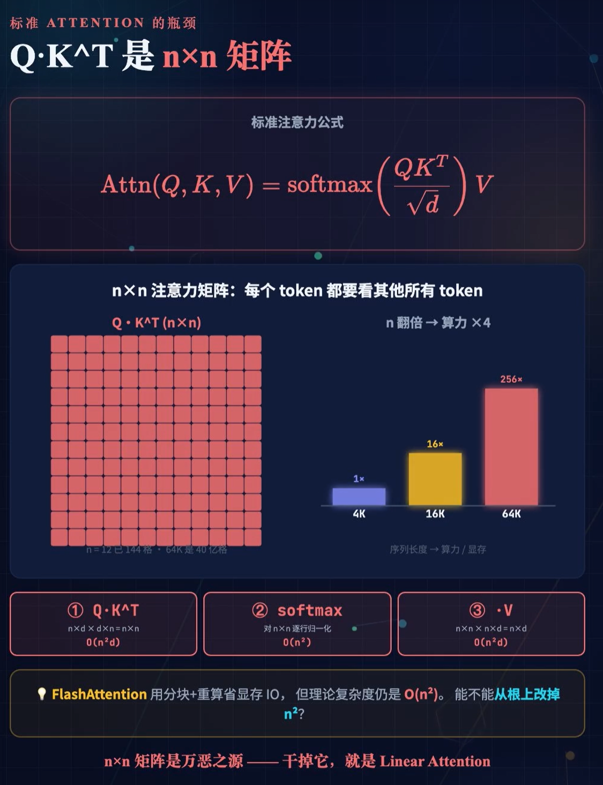
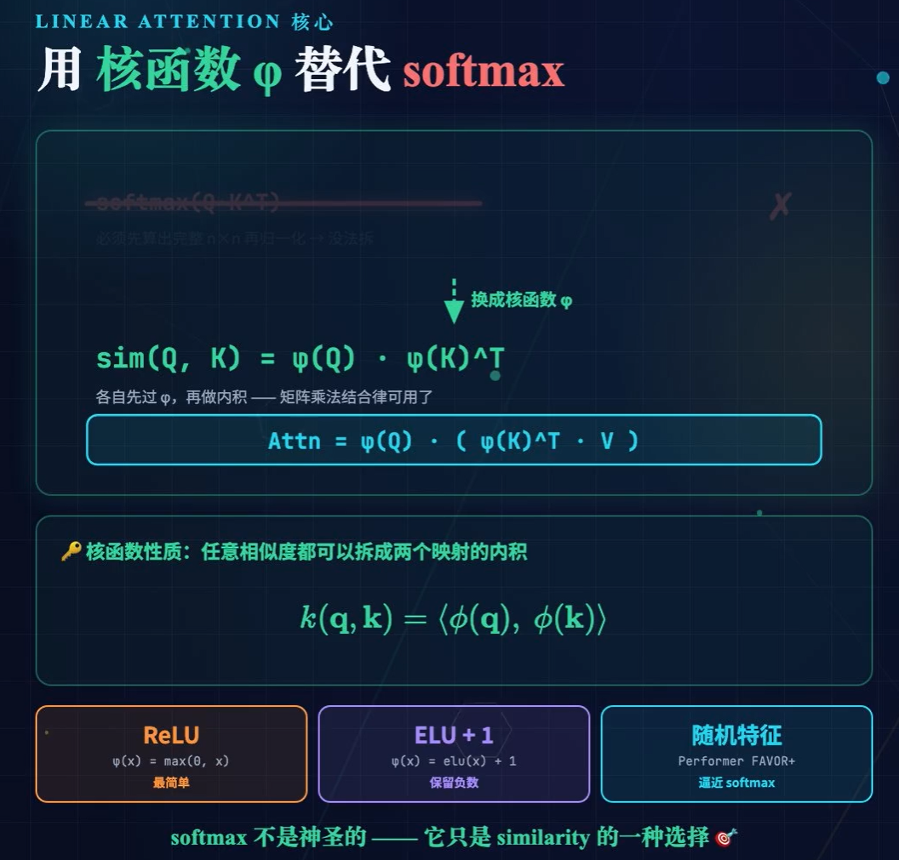
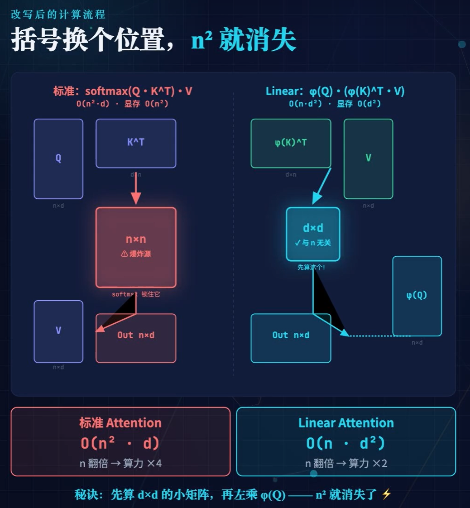
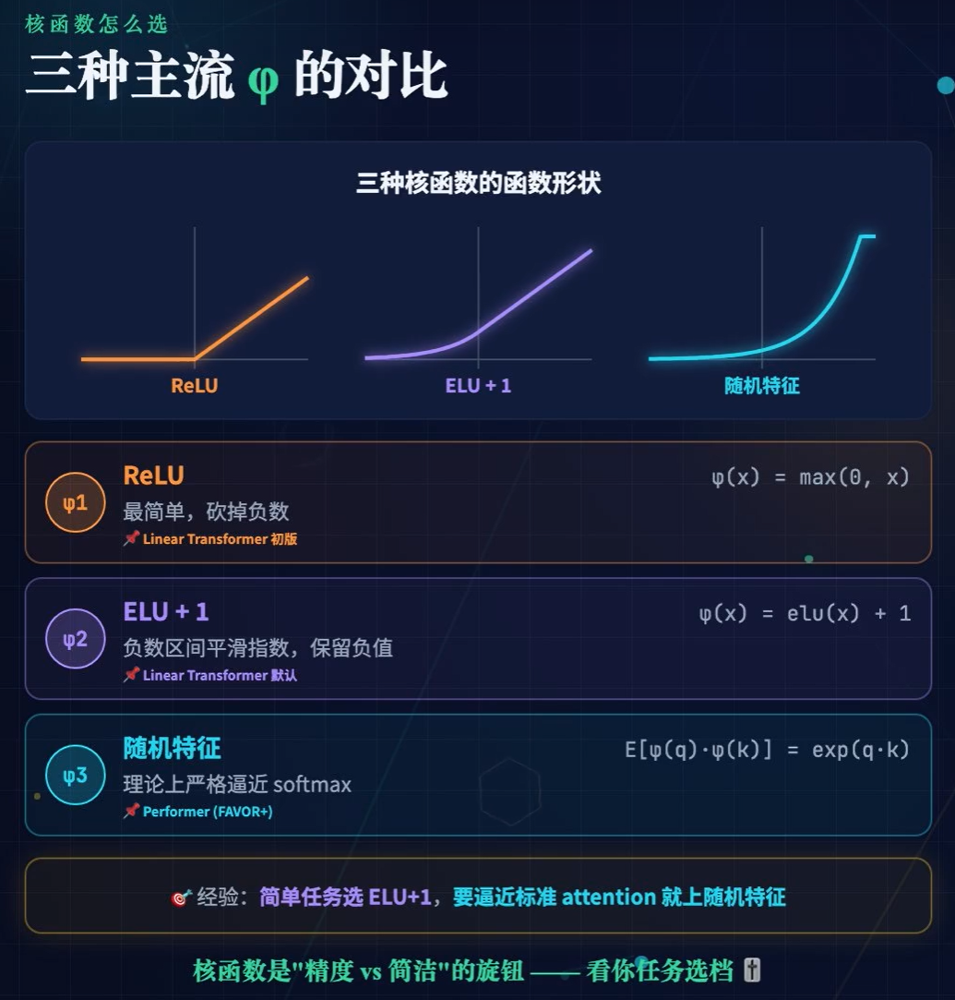

---

## 1. 引言

**因果自注意力（causal self-attention）的计算复杂度关于序列长度 $N$ 呈二次增长 $O(N^2)$，这构成了长序列建模的根本瓶颈**。Linear Attention、DeltaNet 与 Gated DeltaNet 三代工作共享同一核心框架：**通过核方法（kernel method）与矩阵乘法结合律，将注意力机制重写为关于矩阵值隐状态 $S_t$ 的线性递推，从而在理论上实现 $O(N)$ 训练复杂度与 $O(1)$ 推理状态**。

---

## 2. Linear Attention

### 2.1 标准因果注意力的二次瓶颈

因果注意力对第 $t$ 个时间步的输出定义为

$$o_t = \frac{\sum_{i=1}^{t} \exp(q_t^\top k_i) \cdot v_i}{\sum_{i=1}^{t} \exp(q_t^\top k_i)}.$$

该式中，标量权重 $\exp(q_t^\top k_i)$ 显式耦合查询位置 $t$ 与历史位置 $i$，导致对每个 $t$ 均需重新计算与全部历史键的内积，计算量为 $O(t)$，总复杂度为 $O(N^2)$。

### 3.2 核方法线性化与结合律

Linear Attention ([Katharopoulos et al, 2020](https://arxiv.org/abs/2006.16236)) 的核心思想是用非负核函数 $\kappa(q, k)$ 替代指数函数。特别地，选取满足 $\kappa(q, k) = \phi(q)^\top \phi(k)$ 的特征映射 $\phi$，则分子可重写为

$$\sum_{i=1}^{t} \phi(q_t)^\top \phi(k_i) \cdot v_i.$$

由于 $\phi(q_t)^\top \phi(k_i)$ 为标量，可利用标量乘法与矩阵乘法的结合律，将不依赖于求和指标 $i$ 的项 $\phi(q_t)^\top$ 提至求和符号之外：

$$\sum_{i=1}^{t} \phi(q_t)^\top \phi(k_i) v_i^\top = \phi(q_t)^\top \underbrace{\sum_{i=1}^{t} \phi(k_i) v_i^\top}_{:= S_t}.$$

此处关键观察在于：$\phi(k_i) \in \mathbb{R}^{d'}$ 为列向量，$v_i^\top \in \mathbb{R}^{1 \times d}$ 为行向量，其外积 $\phi(k_i) v_i^\top$ 构成一个 $d' \times d$ 的矩阵。因此，求和项 $S_t$ 为矩阵值量。

### 3.3 矩阵值隐状态及其递推

定义矩阵值隐状态（matrix-valued hidden state）：

$$S_t := \sum_{i=1}^{t} \phi(k_i) v_i^\top \quad \in \mathbb{R}^{d' \times d}.$$

该定义直接导出递推关系：

$$S_t = S_{t-1} + \phi(k_t) v_t^\top, \qquad o_t = \phi(q_t)^\top S_t. \tag{1}$$

此即为 Linear Attention 的递归形式。

### 3.4 结构性局限

由式 (1) 可见，$S_t$ 的更新为单调累加：旧信息通过外积永久嵌入状态矩阵，既无定向覆写机制，亦无时间衰减机制。随着序列增长，不同键值对之间产生记忆冲突（memory collision），长程建模能力受限。

---

## 4. DeltaNet：从在线梯度下降导出 Delta Rule

### 4.1 问题建模

为克服 Linear Attention 的单调累加缺陷，需赋予状态矩阵 $S$ 以可更新性。既然 $S_t$ 里存的是键特征 $\phi(k)$ 到值 $v$ 的映射，那就把它看成一个线性预测器：输入是当前的键特征，输出应尽量等于当前的值 $v_t$。因此将 $S$ 视作一个线性预测模型：对于输入键 $k$，模型预测输出为 $S^\top k$。在第 $t$ 步，观测到目标值 $v_t$，定义瞬时平方损失：

$$\mathcal{L}_t(S) = \frac{1}{2} \|S^\top k_t - v_t\|^2. \tag{2}$$

该损失度量模型预测 $S^\top k_t$ 与真实值 $v_t$ 之间的 $L_2$ 误差。DeltaNet 的状态更新规则即来源于对该损失执行一步随机梯度下降（SGD）。

### 4.2 梯度计算与参数更新

首先计算损失函数 (2) 关于 $S$ 的梯度。利用矩阵微积分：

$$\nabla_S \mathcal{L}_t(S) = (S^\top k_t - v_t) k_t^\top = -(v_t - S^\top k_t) k_t^\top. \tag{3}$$

以学习率 $\beta_t > 0$ 执行梯度下降 $S_t = S_{t-1} - \beta_t \nabla_S \mathcal{L}_t(S_{t-1})$，代入式 (3) 得：

$$S_t = S_{t-1} + \beta_t (v_t - S_{t-1}^\top k_t) k_t^\top. \tag{4}$$

式 (4) 即为 **Widrow-Hoff delta rule** 在矩阵值参数上的直接推广。其中：
- $S_{t-1}^\top k_t$ 为利用旧状态对当前键的预测值；
- $e_t := v_t - S_{t-1}^\top k_t$ 为预测误差；
- $\beta_t e_t k_t^\top$ 为沿误差方向的秩-1修正。

### 4.3 矩阵形式的等价解释

假设键向量满足归一化条件 $k_t^\top k_t = 1$（实践中可通过 $L_2$ 归一化或可学习标量吸收范数），将式 (4) 右端重组：

$$S_t = S_{t-1} - \beta_t (S_{t-1}^\top k_t) k_t^\top + \beta_t v_t k_t^\top = S_{t-1}(I - \beta_t k_t k_t^\top) + \beta_t v_t k_t^\top. \tag{5}$$

式 (5) 揭示了 DeltaNet 的操作语义：

- **定向擦除项** $S_{t-1}(I - \beta_t k_t k_t^\top)$：矩阵 $(I - \beta_t k_t k_t^\top)$ 为沿 $k_t$ 方向的收缩投影算子。当 $\beta_t = 1$ 时，它恰好将 $S_{t-1}$ 在 $k_t$ 张成一维子空间上的分量完全置零；当 $0 < \beta_t < 1$ 时，该分量按比例衰减。这实现了对该键对应旧值的定向擦除；
- **定向写入项** $\beta_t v_t k_t^\top$：将新的秩-1外积叠加至状态，完成精确覆写。

由此，DeltaNet ([Schlag et al, 2021](https://arxiv.org/abs/2102.11174)) 将 Linear Attention 的不可改写记忆转化为支持精确更新的联想记忆，显著提升了 in-context learning 能力。

### 4.4 残余局限

DeltaNet 提供了内容维度上的定向纠错能力，但缺乏时间维度上的全局衰减机制。若某一键在后续长时间不再出现，其对应信息将持续驻留于状态矩阵中，无法主动遗忘。长序列场景下，状态能量仍呈无界增长趋势。

---

## 5. Gated DeltaNet：门控遗忘与 Delta Rule 的耦合

### 5.1 双重维度的解耦需求

理想的记忆系统应同时支持两类操作：
1. **时间维度的自适应遗忘**：依输入动态决定历史记忆的保留时长；
2. **内容维度的精确纠错**：依当前键值对对特定记忆进行定向覆写。

Gated DeltaNet ([Yang et al., 2025](https://arxiv.org/abs/2412.06464)) 将上述两种机制解耦并集成于统一的状态转移方程中，其核心思想可概括为 **"先全局遗忘，后局部纠错"**。

### 5.2 输入依赖的门控衰减

引入输入依赖的对角衰减门（input-dependent diagonal decay gate）$\alpha_t \in (0,1)^d$，其由当前输入经小型投影网络动态生成（通常通过 sigmoid 激活约束至 $(0,1)$ 区间）。$\operatorname{Diag}(\alpha_t)$ 对状态矩阵 $S_{t-1}$ 的行空间施加逐通道的指数式衰减，实现自适应遗忘：

$$S'_{t-1} = \operatorname{Diag}(\alpha_t) \, S_{t-1}. \tag{6}$$

该步骤的语义为：在基于当前输入进行新学习之前，先按数据依赖的速率冲刷历史状态中的陈旧信息。

### 5.3 基于衰减状态的 Delta Rule

在遗忘后的状态 $S'_{t-1}$ 上执行检索与纠错：
- **检索**：利用衰减后的状态获取旧值预测 $\hat{v}_t = S_{t-1}'^\top k_t$；
- **误差**：$e_t = v_t - \hat{v}_t = v_t - (\operatorname{Diag}(\alpha_t) S_{t-1})^\top k_t$；
- **写入**：以学习率 $\beta_t$ 将修正量写入状态。

组合遗忘步骤 (6) 与 delta rule 步骤，得到完整的状态转移方程：

$$S_t = \operatorname{Diag}(\alpha_t) \, S_{t-1} + \beta_t \left(v_t - \big(\operatorname{Diag}(\alpha_t) \, S_{t-1}\big)^\top k_t\right) k_t^\top. \tag{7}$$

### 5.4 各方项的严格语义

| 项 | 机制来源 | 数学作用 |
|---|---|---|
| $\operatorname{Diag}(\alpha_t) S_{t-1}$ | Gated Linear Attention / Mamba2 | **全局遗忘**：对状态矩阵所有行施加输入依赖的逐元素衰减，控制记忆保留时长 |
| $(\operatorname{Diag}(\alpha_t) S_{t-1})^\top k_t$ | DeltaNet（检索）+ 门控修正 | **衰减后检索**：基于已遗忘的状态进行预测，确保误差信号建立在"当前有效记忆"之上 |
| $\beta_t (v_t - \dots) k_t^\top$ | DeltaNet（delta rule） | **定向纠错**：沿 $k_t$ 方向按预测误差写入新值，覆写指定记忆而不扰动其他 |

值得强调，检索操作同样作用于衰减后的状态 $\operatorname{Diag}(\alpha_t) S_{t-1}$。这一设计在理论上保证了时间一致性与因果性：已被遗忘的信息不应再参与当前误差的计算。

### 5.5 与 DeltaNet 的严格关系

将式 (7) 展开：

$$S_t = \operatorname{Diag}(\alpha_t) S_{t-1} \big(I - \beta_t k_t k_t^\top\big) + \beta_t v_t k_t^\top. \tag{8}$$

式 (8) 清晰地展示了 Gated DeltaNet 的结构：它在 DeltaNet 的定向擦除-写入框架外，于状态矩阵左侧引入了全局对角衰减 $\operatorname{Diag}(\alpha_t)$。该衰减与擦除操作不可交换（除非 $\alpha_t$ 为标量），体现了时间遗忘与内容纠错的非交换性耦合。

---

## 6. 退化关系与谱系统一

Gated DeltaNet 的状态转移方程 (7) 构成一个参数化家族。通过调控门控参数，可平滑退化为前代模型：

| 参数条件 | 退化模型 | 机制说明 |
|---|---|---|
| $\alpha_t = \mathbf{1}$（无衰减） | **DeltaNet** | 保留 delta rule 定向纠错，关闭时间遗忘 |
| $\alpha_t = \mathbf{1}$ 且 $\beta_t \to 0^+$ | **Linear Attention** | 无衰减、无纠错，退化为纯外积累加 |
| $\beta_t \to 0^+$（无纠错） | **GLA / Mamba2 风格** | 仅余门控衰减与累加写入，无定向覆写 |

上述退化关系表明，三代模型共享同一矩阵值递归骨架，差异仅体现在状态转移核（state transition kernel）的选取上。Linear Attention 提供基础框架，DeltaNet 注入内容维度的纠错能力，Gated DeltaNet 再引入时间维度的自适应遗忘，形成由简至繁的完整谱系。

---

# 参考资料

## 视频
[【线性注意力】Linear Attention 讲透：核函数替代 softmax，O(n²) 降到 O(n)](https://www.bilibili.com/video/BV1JE826rEVe/?spm_id_from=333.337.search-card.all.click&vd_source=e98b669ccbafff4b5aa59dd6303b722f)
