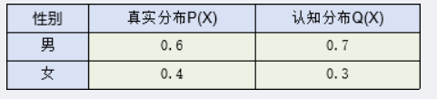
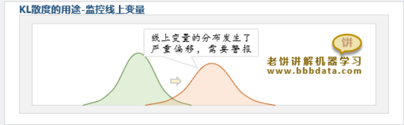
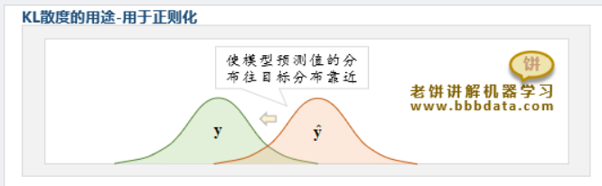

[老饼讲解-机器学习](https://www.bbbdata.com/text/311)

---

# KL散度公式

KL散度（Kullback-Leibler divergence）也称为 KL 距离。

**KL 散度衡量一个概率分布 $Q$ 相对于真实分布 $P$ 的差异**，它们的KL 散度计算公式为：

$$
\mathrm{KL}(P\|Q)=\sum_{x\in X} P(x)\ln\frac{P(x)}{Q(x)}
$$

当 $x$ 为连续变量时，则 KL 散度可以写为：

$$
\mathrm{KL}(P\|Q)=\int_x P(x)\ln\frac{P(x)}{Q(x)}\,dx
$$

**注意：KL 虽然有“距离”之称，但它是不对称的，即：**

$$
\mathrm{KL}(P\|Q)\neq \mathrm{KL}(Q\|P)
$$

---

# KL散度计算例子

真实分布 $P$ 和认知分布 $Q$ 如下，现计算 $Q$ 与 $P$ 的距离。

根据 KL 散度公式，可以计算得到：

$$
\mathrm{KL}(P\|Q)
=
\sum_{x\in X} P(x)\ln\frac{P(x)}{Q(x)}
=
0.6\ln\frac{0.6}{0.7}+0.4\ln\frac{0.4}{0.3}
=
0.0226
$$

---

# KL散度的用途

KL 散度广泛应用于机器学习，与分布相关的问题中都经常能看到它。

## KL散度应用场景一：监控变量分布

由于模型一般是基于历史样本训练的，所以随着时间推移，可能不再适用于线上数据。

此时，可以使用 KL 散度来监控线上变量的分布是否与建模时训练数据的分布一致。

当 KL 散度大于一定阈值时，就自动发出警报，方便建模人员进行分析与采取相关措施。

## KL散度应用场景二：作为损失函数的正则项

在训练模型的时候，可以用 KL 散度作为正则项，强制使模型的预测值趋向目标分布。

例如著名的 VAE 自动编码器模型中，就引入 KL 散度，使其编码器的输出偏向正态分布。

使用 KL 散度作为正则项，可以抵抗过拟合，它可以使模型预测值的分布更加合理化。

---

#  KL散度是如何定义出来的

本节讲解 KL 散度的原理与推导，从而进一步理解 KL 的意义。

## KL散度的原理与意义

KL 是基于信息熵与交叉熵定义出来的。

下面先简单回顾信息熵与交叉熵，再说明 KL 散度的原理。

### 变量的信息熵

假设变量 $ X=[x_1,x_2,\dots,x_n] $ 的分布为 $ P=[p_1,p_2,\dots,p_n] $

即 $X$ 取值为 $x_i$ 的概率为 $p_i$。

当我们了解 $X$ 的分布概率 $P$ 时，在知道真相 $X=x_i$ 时，所获得的信息量为： $ -\ln(p_i) $ [^1]

[^1]: **信息量 $ -\ln(p_i) $ 满足**： 
(1) 概率越小，信息量越大 
(2) 必然事件的信息量为 0 
(3) “两个独立事件同时发生的信息量”等于“两个事件各自信息量之和”，即概率的乘法等于信息量的加法：$\log(pq)=\log p+\log q$

由于 $X$ 的所有可能取值为 $x_1,x_2,\dots,x_n$，所以知道 $X$ 真实取值时获得的信息量期望为：

$$
H(X)
=
-\sum_{i=1}^{n} p_i\ln(p_i)
=
-\sum_{x\in X} p(x)\ln p(x)
$$

上式称为变量的**熵**，它代表知道一个以 $P$ 分布的变量的真实值时所获得的期望信息量。

### 变量的交叉熵

当不知道 $X$ 的真实分布 $ P=[p_1,\dots,p_n] $， 而是认为 $X$ 的分布为 $ Q=[q_1,q_2,\dots,q_n] $ 时，由于认为 $X$ 取值为 $x_i$ 的概率为 $q_i$，则在知道 $X=x_i$ 时获得的信息量为： $ -\ln(q_i) $

由于 $X$ 的所有可能取值为 $x_1,x_2,\dots,x_n$，所以知道 $X$ 真实取值时获得的信息量期望为：

$$
H(X,P\|Q)
=
-\sum_{i=1}^{n} p_i\ln(q_i)
=
-\sum_{x\in X} p(x)\ln q(x)
$$

上式称为变量的**交叉熵**。

它代表以分布 $Q$ 去认识一个分布 $P$ 的变量时，在知道 $X$ 的真实值时所获得的期望信息量。

### KL散度的意义

从信息熵与交叉熵可知：

- 信息熵：我们掌握 $X$ 的真实分布时获得的信息量期望；
- 交叉熵：我们不知道 $X$ 的真实分布，而用另一个分布去描述它时获得的信息量期望。

KL 散度定义为交叉熵与信息熵的差值：

$$
\mathrm{KL}(P\|Q)
=
H_x(P\|Q)-H_x(P\|P)
$$

展开可得：

$$
\mathrm{KL}(P\|Q)
=
\left(-\sum_{x\in X} P(x)\ln Q(x)\right)
-
\left(-\sum_{x\in X} P(x)\ln P(x)\right)
$$

因此：

$$
\mathrm{KL}(P\|Q)
=
\sum_{x\in X} P(x)\ln\frac{P(x)}{Q(x)}
$$

根据吉布斯不等式，KL 散度大于等于 0，故 $$H_x(P\|Q) \ge H_x(P\|P)$$

说明：
- **交叉熵总是大于或等于信息熵**
- 当且仅当 $P = Q$ 时等号成立，说明此时**认知分布等同于真实分布**[^2]。

[^2]: 这就是神经网络训练的目标。

---

## KL散度大于等于0的证明（吉布斯不等式）

KL 散度作为两个分布的距离，它一定不小于 0。下面证明为什么：

$$
D_{KL}(P\|Q)=\sum_{x\in X} P(x)\ln\frac{P(x)}{Q(x)}\ge 0
$$

证明过程需要利用不等式：

$$
\ln x \le x-1
$$

利用此不等式可证明 KL 散度不小于 0。

由于：

$$
- P(x)\ln\frac{P(x)}{Q(x)}
=
P(x)\ln\frac{Q(x)}{P(x)}
\le
P(x)\left(\frac{Q(x)}{P(x)}-1\right)
=
Q(x)-P(x)
$$

因此：

$$
P(x)\ln\frac{P(x)}{Q(x)}
\ge
P(x)-Q(x)
$$

对所有 $x$ 求和：

$$
\sum_{x\in X} P(x)\ln\frac{P(x)}{Q(x)}
\ge
\sum_{x\in X}\big(P(x)-Q(x)\big)
$$

而因为概率分布满足：

$$
\sum_{x\in X} P(x)=1,\quad \sum_{x\in X} Q(x)=1
$$

所以：

$$
\sum_{x\in X}\big(P(x)-Q(x)\big)=1-1=0
$$

因此得到：

$$
D_{KL}(P\|Q)\ge 0
$$

等号当且仅当  $P = Q$ 时（两个分布完全相同）成立。 

---

## 附：$\ln x \le x-1$ 的证明

令：

$$
f(x)=\ln x - x + 1
$$

求导：

$$
f'(x)=\frac{1}{x}-1
$$

令导数为 0，则有：

$$
\frac{1}{x}-1=0
$$

所以：

$$
x=1
$$

可知 $f(x)$ 在 $x=1$ 处取得极值，且易知该点为极大值。

因此：

$$
f(x)\le f(1)=\ln 1 -1+1=0
$$

即：

$$
\ln x - x + 1 \le 0
$$

从而得到：

$$
\ln x \le x-1
$$

---
