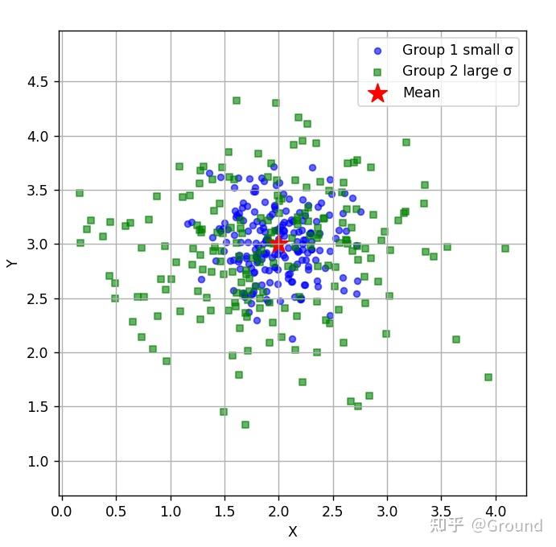
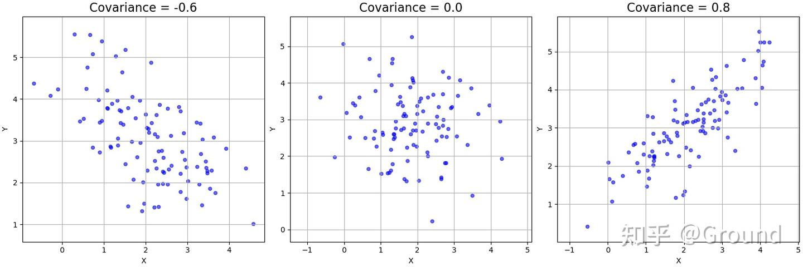

## 基本概念

### 方差 Variance

**方差衡量随机变量相对其均值的离散程度。**

$$
\operatorname{Var}(X)=\mathbb{E}\left[(X-\mathbb{E}[X])^2\right]
$$

等价形式：

$$
\operatorname{Var}(X)=\mathbb{E}[X^2]-\left(\mathbb{E}[X]\right)^2
$$

均值相同时，标准差更大的绿色组数据会更加分散。

---

### 协方差 Covariance

**协方差衡量两个随机变量共同变化的方向。**

$$
\operatorname{Cov}(X,Y)=\mathbb{E}\left[(X-\mathbb{E}[X])(Y-\mathbb{E}[Y])\right]
$$

等价形式：

$$
\operatorname{Cov}(X,Y)=\mathbb{E}[XY]-\mathbb{E}[X]\mathbb{E}[Y]
$$

若

$$
\operatorname{Cov}(X,Y)>0
$$

说明 $X$ 和 $Y$ 倾向于同向变化。

若

$$
\operatorname{Cov}(X,Y)<0
$$

说明 $X$ 和 $Y$ 倾向于反向变化。

若

$$
\operatorname{Cov}(X,Y)=0
$$

说明**二者线性不相关，但不一定独立**。

> 反之，**如果两者独立，则一定不线性相关。**

- 协方差 < 0，说明随着 X 增加，Y 趋于减小
- 协方差 > 0，说明随着 X 增加，Y 也倾向于增大

**协方差的优势在于判断关系的方向（正或负），即观察其值是大于零还是小于零，但不适合直接用其数值大小来比较不同变量间的相关强弱**。例如，计算某群体身高（米）与体重（公斤）的协方差，若将身高单位由米改为厘米，数值扩大100倍，协方差也随之扩大100倍。然而，身高与体重的实际相关关系并未改变，仅是数值规模发生了变化。

### 相关系数

**相关系数（通常指皮尔逊相关系数）是用来衡量两个随机变量之间线性关系强度与方向的标准化指标。**

相比协方差，它去除了量纲的影响，所以可以用来衡量线性关系的程度。

$$
\rho_{X,Y} = \frac{\text{Cov}(X,Y)}{\sigma_X \sigma_Y} = \frac{E[(X - \mu_X)(Y - \mu_Y)]}{\sqrt{E[(X - \mu_X)^2]} \cdot \sqrt{E[(Y - \mu_Y)^2]}}
$$

其中：
- $\text{Cov}(X,Y)$ 是协方差
- $\sigma_X, \sigma_Y$ 是标准差
- $\mu_X, \mu_Y$ 是均值

---

## 方差和协方差的矩阵形式

### 1. 随机向量的均值

若随机向量为

$$
X=
\begin{bmatrix}
X_1\\
X_2\\
\vdots\\
X_d
\end{bmatrix}
$$

则其均值向量定义为：

$$
\mu=\mathbb{E}[X]
=
\begin{bmatrix}
\mathbb{E}[X_1]\\
\mathbb{E}[X_2]\\
\vdots\\
\mathbb{E}[X_d]
\end{bmatrix}
$$

---

### 2. 协方差矩阵

随机向量 $X\in\mathbb{R}^d$ 的协方差矩阵定义为：

$$
\Sigma=\operatorname{Cov}(X)=\mathbb{E}\left[(X-\mu)(X-\mu)^\top\right]
$$

其中：

$$
\mu=\mathbb{E}[X]
$$

展开后可写为：

$$
\Sigma=\mathbb{E}[XX^\top]-\mu\mu^\top
$$

协方差矩阵的第 $(i,j)$ 个元素为：

$$
\Sigma_{ij}=\operatorname{Cov}(X_i,X_j)
$$

因此矩阵形式为：

$$
\Sigma=
\begin{bmatrix}
\operatorname{Var}(X_1) & \operatorname{Cov}(X_1,X_2) & \cdots & \operatorname{Cov}(X_1,X_d)\\
\operatorname{Cov}(X_2,X_1) & \operatorname{Var}(X_2) & \cdots & \operatorname{Cov}(X_2,X_d)\\
\vdots & \vdots & \ddots & \vdots\\
\operatorname{Cov}(X_d,X_1) & \operatorname{Cov}(X_d,X_2) & \cdots & \operatorname{Var}(X_d)
\end{bmatrix}
$$

其中对角线元素是各维度的方差，非对角线元素是不同维度之间的协方差。

---

### 3. 两个随机向量之间的协方差矩阵

若

$$
X\in\mathbb{R}^m,\quad Y\in\mathbb{R}^n
$$

则它们之间的协方差矩阵定义为：

$$
\operatorname{Cov}(X,Y)
=
\mathbb{E}\left[(X-\mathbb{E}[X])(Y-\mathbb{E}[Y])^\top\right]
$$

它是一个 $m\times n$ 的矩阵，第 $(i,j)$ 个元素为：

$$
\operatorname{Cov}(X_i,Y_j)
$$

---

### 4. 样本形式（数据矩阵形式）

设有 $n$ 个样本，每个样本是 $d$ 维向量：

$$
x^{(1)},x^{(2)},\dots,x^{(n)}\in\mathbb{R}^d
$$

样本均值向量为：

$$
\bar{x}=\frac{1}{n}\sum_{k=1}^n x^{(k)}
$$

样本协方差矩阵常写为：

$$
S=\frac{1}{n}\sum_{k=1}^n \left(x^{(k)}-\bar{x}\right)\left(x^{(k)}-\bar{x}\right)^\top
$$

如果使用无偏估计，则写为：

$$
S=\frac{1}{n-1}\sum_{k=1}^n \left(x^{(k)}-\bar{x}\right)\left(x^{(k)}-\bar{x}\right)^\top
$$

若将所有样本按行堆叠成数据矩阵：

$$
X=
\begin{bmatrix}
(x^{(1)})^\top\\
(x^{(2)})^\top\\
\vdots\\
(x^{(n)})^\top
\end{bmatrix}
\in\mathbb{R}^{n\times d}
$$

记中心化后的矩阵为：

$$
X_c=X-\mathbf{1}\bar{x}^\top
$$

则样本协方差矩阵可写为：

$$
S=\frac{1}{n}X_c^\top X_c
$$

或者无偏形式：

$$
S=\frac{1}{n-1}X_c^\top X_c
$$

注意：只有当 $X$ 已经中心化时，才可以直接写成：

$$
S=\frac{1}{n}X^\top X
$$

---

## 独立与不独立

### 独立情形

如果 $X$ 和 $Y$ 独立，则：

$$
\mathbb{E}[XY]=\mathbb{E}[X]\mathbb{E}[Y]
$$

因此：

$$
\operatorname{Cov}(X,Y)=0
$$

并且有：

$$
\operatorname{Var}(X+Y)=\operatorname{Var}(X)+\operatorname{Var}(Y)
$$

更一般地，如果 $X_1,\dots,X_n$ 两两独立，则：

$$
\operatorname{Var}\left(\sum_{i=1}^{n}X_i\right)
=
\sum_{i=1}^{n}\operatorname{Var}(X_i)
$$

若随机向量 $X$ 的各维相互独立，则协方差矩阵是对角矩阵：

$$
\Sigma=
\begin{bmatrix}
\operatorname{Var}(X_1) & 0 & \cdots & 0\\
0 & \operatorname{Var}(X_2) & \cdots & 0\\
\vdots & \vdots & \ddots & \vdots\\
0 & 0 & \cdots & \operatorname{Var}(X_d)
\end{bmatrix}
$$

---

###  不独立情形

如果随机变量 $X$ 和 $Y$ 不独立，则一般有：

$$
\operatorname{Var}(X+Y)
=
\operatorname{Var}(X)+\operatorname{Var}(Y)+2\operatorname{Cov}(X,Y)
$$

更一般地：

$$
\operatorname{Var}\left(\sum_{i=1}^{n}X_i\right)
=
\sum_{i=1}^{n}\operatorname{Var}(X_i)
+
2\sum_{1\leq i<j\leq n}\operatorname{Cov}(X_i,X_j)
$$

如果变量正相关，整体方差会变大；如果负相关，整体方差会变小。

矩阵形式下，若 $a\in\mathbb{R}^d$，则线性组合 $a^\top X$ 的方差为：

$$
\operatorname{Var}(a^\top X)=a^\top \Sigma a
$$

其中，**$\Sigma$ 为协方差矩阵**。

更一般地，若 $A$ 是矩阵，且 $Y=AX+b$，则：

$$
\operatorname{Cov}(Y)=A\operatorname{Cov}(X)A^\top
$$

---

## 数学推导

### 推导：方差的等价形式

从定义出发：

$$
\operatorname{Var}(X)=\mathbb{E}\left[(X-\mathbb{E}[X])^2\right]
$$

展开平方：

$$
(X-\mathbb{E}[X])^2
=
X^2-2X\mathbb{E}[X]+(\mathbb{E}[X])^2
$$

取期望（**期望的线性性质无条件成立**）：

$$
\operatorname{Var}(X)
=
\mathbb{E}[X^2]
-
2\mathbb{E}[X]\mathbb{E}[X]
+
(\mathbb{E}[X])^2
$$

所以：

$$
\operatorname{Var}(X)
=
\mathbb{E}[X^2]-(\mathbb{E}[X])^2
$$

---

### 推导：协方差的等价形式

从定义出发：

$$
\operatorname{Cov}(X,Y)=\mathbb{E}\left[(X-\mathbb{E}[X])(Y-\mathbb{E}[Y])\right]
$$

展开：

$$
(X-\mathbb{E}[X])(Y-\mathbb{E}[Y])
=
XY-X\mathbb{E}[Y]-Y\mathbb{E}[X]+\mathbb{E}[X]\mathbb{E}[Y]
$$

取期望：

$$
\operatorname{Cov}(X,Y)
=
\mathbb{E}[XY]
-\mathbb{E}[X]\mathbb{E}[Y]
-\mathbb{E}[Y]\mathbb{E}[X]
+\mathbb{E}[X]\mathbb{E}[Y]
$$

因此：

$$
\operatorname{Cov}(X,Y)=\mathbb{E}[XY]-\mathbb{E}[X]\mathbb{E}[Y]
$$

---

### 推导：两个变量和的方差

$$
\operatorname{Var}(X+Y)
=
\mathbb{E}\left[((X+Y)-\mathbb{E}[X+Y])^2\right]
$$

因为：

$$
\mathbb{E}[X+Y]=\mathbb{E}[X]+\mathbb{E}[Y]
$$

所以：

$$
(X+Y)-\mathbb{E}[X+Y]
=
(X-\mathbb{E}[X])+(Y-\mathbb{E}[Y])
$$

展开：

$$
\operatorname{Var}(X+Y)
=
\mathbb{E}\left[
(X-\mathbb{E}[X])^2
+
(Y-\mathbb{E}[Y])^2
+
2(X-\mathbb{E}[X])(Y-\mathbb{E}[Y])
\right]
$$

得到：

$$
\operatorname{Var}(X+Y)
=
\operatorname{Var}(X)
+
\operatorname{Var}(Y)
+
2\operatorname{Cov}(X,Y)
$$

---

## 举例

设：

$$X = [1, 2, 3], \quad Y = [2, 4, 6]$$

这里把 $X, Y$ 看作**离散均匀分布**的随机变量，每个值概率都是 $\frac{1}{3}$。则：

$$\mathbb{E}[X] = \frac{1+2+3}{3} = \frac{6}{3} = 2$$

$$\mathbb{E}[Y] = \frac{2+4+6}{3} = \frac{12}{3} = 4$$

计算方差 $\text{Var}(X)$：

$$\text{Var}(X) = \mathbb{E}[(X - \mathbb{E}[X])^2] = \frac{1}{3}\sum_{i=1}^{3}(x_i - 2)^2$$

展开每一项：
- $(1-2)^2 = (-1)^2 = 1$
- $(2-2)^2 = 0^2 = 0$  
- $(3-2)^2 = 1^2 = 1$

$$\text{Var}(X) = \frac{1 + 0 + 1}{3} = \frac{2}{3}$$

计算方差 $\text{Var}(Y)$：

$$\text{Var}(Y) = \frac{1}{3}\sum_{i=1}^{3}(y_i - 4)^2 = \frac{4 + 0 + 4}{3} = \frac{8}{3}$$

计算协方差 $\text{Cov}(X,Y)$：

$$\text{Cov}(X,Y) = \mathbb{E}[(X-\mathbb{E}[X])(Y-\mathbb{E}[Y])] = \frac{1}{3}\sum_{i=1}^{3}(x_i-2)(y_i-4) = \frac{2 + 0 + 2}{3} = \frac{4}{3}$$

故协方差矩阵为：

$$
\Sigma = \begin{bmatrix} \text{Var}(X) & \text{Cov}(X,Y) \\ \text{Cov}(Y,X) & \text{Var}(Y) \end{bmatrix} = \begin{bmatrix} \frac{2}{3} & \frac{4}{3} \\ \frac{4}{3} & \frac{8}{3} \end{bmatrix}
$$

-------

