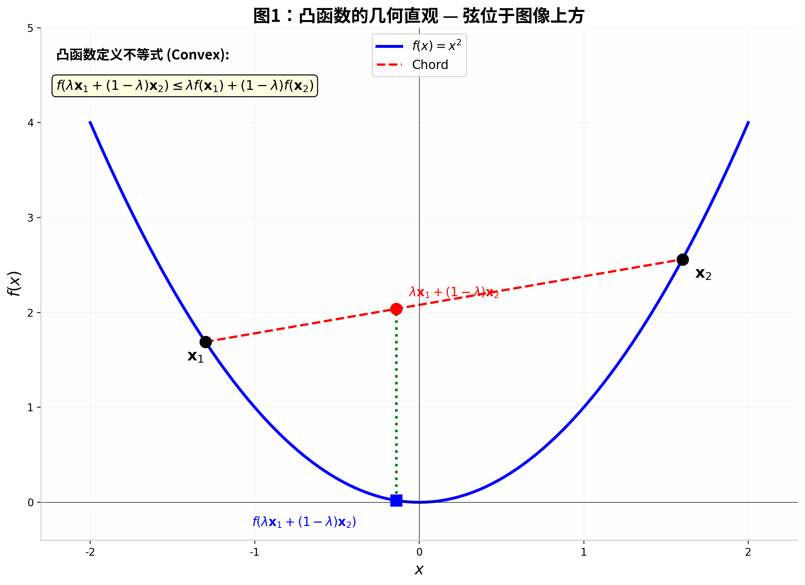
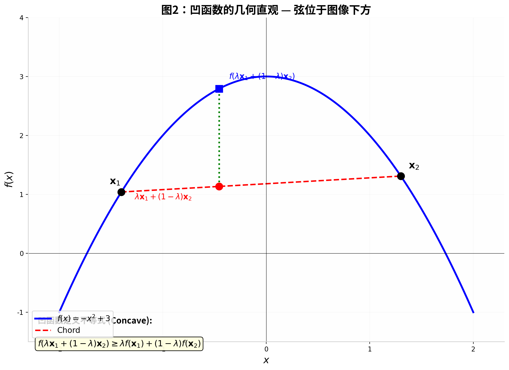
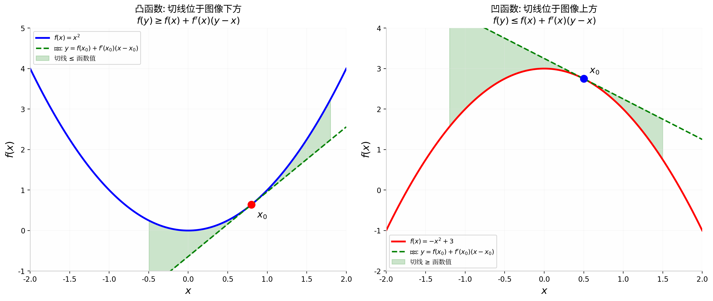
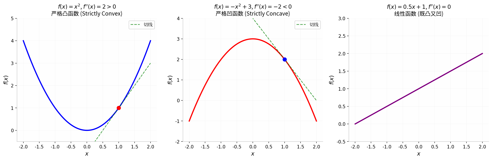
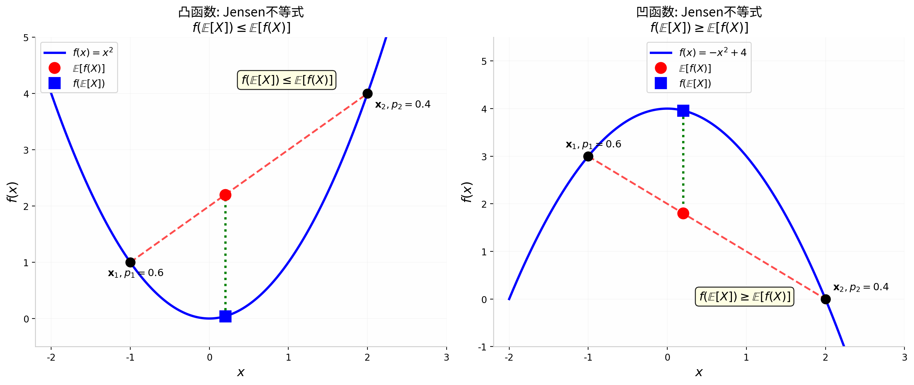
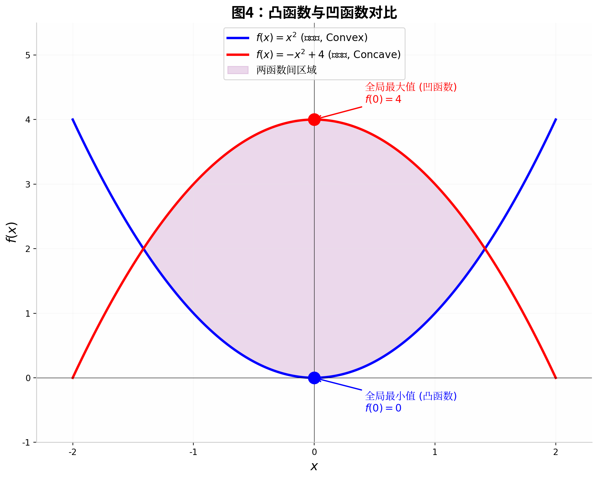

# 凸函数与凹函数的完整推导指南

---

## 一、公式作用概述

**凸函数（Convex Function）** 与 **凹函数（Concave Function）** 是数学优化、机器学习、经济学和工程领域中最核心的数学概念之一。凸函数刻画了"碗状向上"的函数形状，保证了**任意局部最小值即为全局最小值**；凹函数则刻画了"帽状向下"的形状，保证了**任意局部最大值即为全局最大值**。这一性质使得优化算法（如梯度下降）在凸/凹条件下拥有可靠的理论收敛保证。

在机器学习中，凸性分析贯穿多个核心场景：损失函数设计（如均方误差损失是凸函数）、正则化项分析（如 L2 正则化是凸函数）、KL 散度的非负性证明、变分推断中的 Evidence Lower Bound（ELBO）推导，以及深度神经网络优化 landscape 的理论分析等。Jensen 不等式作为凸函数的核心推论，更是概率不等式证明的利器。

---

## 二、推导路线图

```
Step 1: 建立基础概念（定义域、函数、连续性）
    ↓
Step 2: 凸集的定义（凸函数的几何舞台）
    ↓
Step 3: 凸函数的原始定义（弦在图像上方）
    ↓
Step 4: 凹函数的原始定义（弦在图像下方）
    ↓
Step 5: 凸函数的一阶条件（切线判据）
    ↓
Step 6: 凸函数的二阶条件（二阶导数判据）
    ↓
Step 7: Jensen 不等式的推导
    ↓
Step 8: 凸凹函数的对偶关系（-f 的转换）
    ↓
Step 9: 严格凸/严格凹的精细定义
```

---

## 三、完整推导过程

### Step 1: 基础概念的建立

在正式定义凸函数之前，我们需要先明确几个基础数学概念。这些概念构成了凸函数定义的前提条件。

---

> **【知识卡片：函数与定义域】**
> - **定义**：函数是一种将输入集合（定义域）中的每个元素映射到输出集合（值域）中唯一元素的规则。
> - **公式**：$f: \mathcal{X} \to \mathbb{R}$ 表示函数 $f$ 将集合 $\mathcal{X}$ 中的每个元素映射到实数集 $\mathbb{R}$ 中的一个值。
> - **本步作用**：凸函数的定义要求函数作用在一个特定的几何结构（凸集）上，因此需要先明确函数的定义域。

---

> **【知识卡片：实数向量空间 $\mathbb{R}^d$】**
> - **定义**：$\mathbb{R}^d$ 是所有由 $d$ 个实数组成的有序元组的集合，可以看作 $d$ 维空间中的点的坐标表示。当 $d=1$ 时即为普通实数轴；$d=2$ 时为平面；$d=3$ 时为三维空间。
> - **公式**：$\mathbf{x} = (x_1, x_2, \ldots, x_d) \in \mathbb{R}^d$，其中每个 $x_i \in \mathbb{R}$。
> - **本步作用**：凸函数的定义在任意维度的向量空间上均成立，不限于一维实数轴。

---

> **【知识卡片：连续函数】**
> - **定义**：直观地说，连续函数是指图像可以一笔画成、没有间断的函数。数学上，当输入值的变化足够小时，输出值的变化也可以任意小。
> - **公式**：$\lim_{\mathbf{x} \to \mathbf{x}_0} f(\mathbf{x}) = f(\mathbf{x}_0)$
> - **本步作用**：凸函数在定义域的内部点自动具有连续性，这是凸性的重要推论。

---

### Step 2: 凸集的定义 —— 凸函数的"舞台"

在定义凸函数之前，必须先定义**凸集**（Convex Set）。凸集是凸函数作用的"舞台"：一个函数只有在凸集上谈论凸性才有意义。

---

> **【知识卡片：凸集 (Convex Set)】**
> - **定义**：一个集合 $\mathcal{C}$ 被称为凸集，如果对于该集合中任意两点，连接这两点的整条线段都完全包含在该集合内。形象地说，凸集没有"凹陷"。
> - **公式**：集合 $\mathcal{C} \subseteq \mathbb{R}^d$ 是凸集，当且仅当：
>
> $$
> \forall \, \mathbf{x}_1, \mathbf{x}_2 \in \mathcal{C}, \quad \forall \, \lambda \in [0, 1]: \quad \lambda \mathbf{x}_1 + (1 - \lambda) \mathbf{x}_2 \in \mathcal{C}
> $$
> - **本步作用**：凸函数的定义要求定义域必须是凸集，否则"两点之间的函数行为"无法被谈论。

---

**为什么需要凸集？** 考虑函数 $f$ 定义在两个彼此分离的区间上（如 $[-2, -1] \cup [1, 2]$）。此时取 $\mathbf{x}_1 = -1.5$ 和 $\mathbf{x}_2 = 1.5$，它们的中点 $0$ 不在定义域中，因此无法讨论中点处的函数值 —— 凸性的定义将无从谈起。

**常见凸集的例子**：
- 整个空间 $\mathbb{R}^d$
- 区间 $[a, b] \subset \mathbb{R}$
- 范数球 $\{\mathbf{x} \in \mathbb{R}^d : \|\mathbf{x}\| \leq r\}$
- 半空间 $\{\mathbf{x} \in \mathbb{R}^d : \mathbf{a}^\top \mathbf{x} \leq b\}$

---

### Step 3: 凸函数的原始定义

现在我们有了凸集的概念，可以正式定义凸函数了。

---

> **【知识卡片：凸函数 (Convex Function) —— 原始定义】**
> - **定义**：设 $\mathcal{C} \subseteq \mathbb{R}^d$ 是一个凸集，函数 $f: \mathcal{C} \to \mathbb{R}$ 被称为**凸函数**，如果对于 $\mathcal{C}$ 中任意两点 $\mathbf{x}_1, \mathbf{x}_2$ 和任意权重 $\lambda \in [0, 1]$，函数在加权平均点处的值不超过函数值的加权平均。几何上，这意味着**函数图像上任意两点之间的弦（线段）始终位于函数图像的上方或与之重合**。
> - **公式（凸函数定义）**：
>
> $$
> \boxed{f\bigl(\lambda \mathbf{x}_1 + (1 - \lambda) \mathbf{x}_2\bigr) \leq \lambda f(\mathbf{x}_1) + (1 - \lambda) f(\mathbf{x}_2)}
> $$
>
> 其中：
> - $\mathcal{C} \subseteq \mathbb{R}^d$ 为凸集（定义域）
> - $\mathbf{x}_1, \mathbf{x}_2 \in \mathcal{C}$ 为定义域中任意两点
> - $\lambda \in [0, 1]$ 为权重参数
> - 不等号方向 $\leq$ 是凸函数的标志性特征

---



**图 1 解读**：图中蓝色曲线为凸函数 $f(x) = x^2$。取两点 $\mathbf{x}_1$ 和 $\mathbf{x}_2$，红色虚线为连接这两点的**弦**（线性插值）。在横坐标 $\lambda \mathbf{x}_1 + (1-\lambda)\mathbf{x}_2$ 处，弦上的值（红点，高度为 $\lambda f(\mathbf{x}_1) + (1-\lambda)f(\mathbf{x}_2)$）始终**大于等于**函数图像上的值（蓝方块，高度为 $f(\lambda \mathbf{x}_1 + (1-\lambda)\mathbf{x}_2)$）。这正是凸函数定义的不等式的几何表达。

---

**直观理解**：凸函数的图像像一个**向上开口的碗**。如果你在这个碗的任意两点之间拉一根直线（弦），这根线一定在碗的内壁上方（至少不会跑到内壁下方）。这意味着函数"向上弯曲"，不会有局部凹陷。

---

### Step 4: 凹函数的原始定义

凹函数是凸函数的"镜像"概念。

---

> **【知识卡片：凹函数 (Concave Function) —— 原始定义】**
> - **定义**：设 $\mathcal{C} \subseteq \mathbb{R}^d$ 是一个凸集，函数 $f: \mathcal{C} \to \mathbb{R}$ 被称为**凹函数**，如果对于 $\mathcal{C}$ 中任意两点 $\mathbf{x}_1, \mathbf{x}_2$ 和任意权重 $\lambda \in [0, 1]$，函数在加权平均点处的值**不小于**函数值的加权平均。几何上，这意味着**函数图像上任意两点之间的弦始终位于函数图像的下方或与之重合**。
> - **公式（凹函数定义）**：
>
> $$
> \boxed{f\bigl(\lambda \mathbf{x}_1 + (1 - \lambda) \mathbf{x}_2\bigr) \geq \lambda f(\mathbf{x}_1) + (1 - \lambda) f(\mathbf{x}_2)}
> $$
>
> 其中符号约定与凸函数定义相同，但不等号方向反转（$\geq$ 而非 $\leq$）。

---



**图 2 解读**：图中蓝色曲线为凹函数 $f(x) = -x^2 + 3$。与凸函数完全相反，弦（红色虚线）位于函数图像（蓝色曲线）的**下方**。在加权平均点处，函数值（蓝方块）大于等于弦上的值（红点）。

---

### Step 5: 从原始定义到一阶条件

原始定义虽然几何直观，但在实际验证一个函数是否为凸函数时不够方便。对于**可微函数**（即可以求导的函数），存在等价的**一阶条件**，它利用函数的梯度（一阶导数）来判断凸性。

---

> **【知识卡片：梯度 (Gradient)】**
> - **定义**：梯度是一个向量，其每个分量是函数对相应自变量的偏导数。梯度指向函数增长最快的方向，其模长表示增长的速率。
> - **公式**：对于 $f: \mathbb{R}^d \to \mathbb{R}$：
>
> $$
> \nabla f(\mathbf{x}) = \left( \frac{\partial f}{\partial x_1}, \frac{\partial f}{\partial x_2}, \ldots, \frac{\partial f}{\partial x_d} \right)^\top \in \mathbb{R}^d
> $$
> - **本步作用**：一阶条件用梯度来刻画凸函数的几何性质（切线判据）。

---

> **【知识卡片：一阶泰勒展开 (First-order Taylor Expansion)】**
> - **定义**：用函数在某点的函数值和导数值来近似函数在该点附近的取值（比如用在 $x$ 点的函数值和导数值来近似函数在 $y$ 点的函数值）。对于凸函数，这个近似给出的是**全局下界**。
> - **公式**：$f(\mathbf{y}) \approx f(\mathbf{x}) + \nabla f(\mathbf{x})^\top (\mathbf{y} - \mathbf{x})$
> - **本步作用**：一阶条件本质上说明：对于凸函数，一阶泰勒展开给出的是一个全局的下界估计（而非仅局部近似）。

---

#### 定理（凸函数的一阶条件）

设 $\mathcal{C} \subseteq \mathbb{R}^d$ 为开凸集，函数 $f: \mathcal{C} \to \mathbb{R}$ 可微（即梯度 $\nabla f(\mathbf{x})$ 处处存在）。则：

$$
f \text{ 是凸函数} \iff \forall \, \mathbf{x}, \mathbf{y} \in \mathcal{C}: \quad f(\mathbf{y}) \geq f(\mathbf{x}) + \nabla f(\mathbf{x})^\top (\mathbf{y} - \mathbf{x})
$$

**几何意义**：函数图像在任意点 $\mathbf{x}$ 处的**切线（切平面）始终位于函数图像的下方**。这是凸函数"碗状向上"特征的局部表达。

#### 证明：原始定义 $\Rightarrow$ 一阶条件

**目标**：从凸函数定义出发，推导出切线不等式。

**Step 5.1**: 取任意 $\mathbf{x}, \mathbf{y} \in \mathcal{C}$，对任意 $t \in (0, 1]$，定义凸组合：

$$
\mathbf{z}_t = \mathbf{x} + t(\mathbf{y} - \mathbf{x}) = (1-t)\mathbf{x} + t\mathbf{y}
$$

（依据：这是 $\mathbf{x}$ 和 $\mathbf{y}$ 的加权平均，权重为 $\lambda = 1-t$，由凸集定义知 $\mathbf{z}_t \in \mathcal{C}$。）

**Step 5.2**: 由凸函数原始定义（取 $\lambda = 1-t$）：

$$
f\bigl((1-t)\mathbf{x} + t\mathbf{y}\bigr) \leq (1-t)f(\mathbf{x}) + t f(\mathbf{y})
$$

即：

$$
f(\mathbf{z}_t) \leq (1-t)f(\mathbf{x}) + t f(\mathbf{y})
$$

**Step 5.3**: 整理不等式：

$$
f(\mathbf{z}_t) - f(\mathbf{x}) \leq t\bigl[f(\mathbf{y}) - f(\mathbf{x})\bigr]
$$

**Step 5.4**: 两边同除以 $t > 0$：

$$
\frac{f(\mathbf{z}_t) - f(\mathbf{x})}{t} \leq f(\mathbf{y}) - f(\mathbf{x})
$$

**Step 5.5**: 利用 $\mathbf{z}_t - \mathbf{x} = t(\mathbf{y} - \mathbf{x})$，改写左边：

$$
\frac{f(\mathbf{x} + t(\mathbf{y} - \mathbf{x})) - f(\mathbf{x})}{t} \leq f(\mathbf{y}) - f(\mathbf{x})
$$

**Step 5.6**: 令 $t \to 0^+$（即 $t$ 从正方向趋近于零）。左边恰好是**方向导数**的定义：

$$
\lim_{t \to 0^+} \frac{f(\mathbf{x} + t(\mathbf{y} - \mathbf{x})) - f(\mathbf{x})}{t} = \nabla f(\mathbf{x})^\top (\mathbf{y} - \mathbf{x})
$$

（依据：方向导数的定义。由于 $f$ 可微，方向导数等于梯度与方向的点积。）

**Step 5.7**: 取极限后得到：

$$
\nabla f(\mathbf{x})^\top (\mathbf{y} - \mathbf{x}) \leq f(\mathbf{y}) - f(\mathbf{x})
$$

**Step 5.8**: 整理即得**一阶条件**：

$$
\boxed{f(\mathbf{y}) \geq f(\mathbf{x}) + \nabla f(\mathbf{x})^\top (\mathbf{y} - \mathbf{x})} \quad \forall \, \mathbf{x}, \mathbf{y} \in \mathcal{C}
$$

---



**图 6 左侧解读**：对于凸函数 $f(x) = x^2$，绿色虚线为在点 $x_0$ 处的切线 $y = f(x_0) + f'(x_0)(x - x_0)$。可以看到，**整条切线始终位于函数图像的下方**（绿色阴影区域表示函数值与切线值之间的正差距），这正是一阶条件的几何表达。

---

#### 证明：一阶条件 $\Rightarrow$ 原始定义（反向证明）

**Step 5.9**: 假设一阶条件成立。取任意 $\mathbf{x}_1, \mathbf{x}_2 \in \mathcal{C}$ 和 $\lambda \in [0, 1]$。

**Step 5.10**: 定义加权平均点：

$$
\mathbf{z} = \lambda \mathbf{x}_1 + (1 - \lambda) \mathbf{x}_2
$$

**Step 5.11**: 对 $\mathbf{x}_1$ 和 $\mathbf{x}_2$ 分别应用一阶条件（以 $\mathbf{z}$ 为基准点）：

$$
f(\mathbf{x}_1) \geq f(\mathbf{z}) + \nabla f(\mathbf{z})^\top (\mathbf{x}_1 - \mathbf{z})
$$

$$
f(\mathbf{x}_2) \geq f(\mathbf{z}) + \nabla f(\mathbf{z})^\top (\mathbf{x}_2 - \mathbf{z})
$$

**Step 5.12**: 第一式乘以 $\lambda$，第二式乘以 $(1-\lambda)$，相加：

$$
\lambda f(\mathbf{x}_1) + (1-\lambda) f(\mathbf{x}_2) \geq f(\mathbf{z}) + \nabla f(\mathbf{z})^\top \bigl[\lambda(\mathbf{x}_1 - \mathbf{z}) + (1-\lambda)(\mathbf{x}_2 - \mathbf{z})\bigr]
$$

**Step 5.13**: 化简括号中的表达式：

$$
\lambda(\mathbf{x}_1 - \mathbf{z}) + (1-\lambda)(\mathbf{x}_2 - \mathbf{z}) = \lambda\mathbf{x}_1 + (1-\lambda)\mathbf{x}_2 - \mathbf{z} = \mathbf{z} - \mathbf{z} = \mathbf{0}
$$

（依据：$\mathbf{z} = \lambda \mathbf{x}_1 + (1-\lambda)\mathbf{x}_2$ 的定义，这是代数恒等式。）

**Step 5.14**: 代入得：

$$
\lambda f(\mathbf{x}_1) + (1-\lambda) f(\mathbf{x}_2) \geq f(\mathbf{z}) = f\bigl(\lambda \mathbf{x}_1 + (1-\lambda)\mathbf{x}_2\bigr)
$$

这正是凸函数的**原始定义**。证毕 $\blacksquare$。

---

### Step 6: 从原始定义到二阶条件

对于**二阶可微函数**（即可以求二阶导数/海森矩阵的函数），凸性有更简洁的判据。

---

> **【知识卡片：海森矩阵 (Hessian Matrix)】**
> - **定义**：海森矩阵是函数二阶偏导数组成的方阵，描述了函数在一点附近的**局部曲率**。对于一元函数，海森矩阵退化为一个数（二阶导数）。
> - **公式**：对于 $f: \mathbb{R}^d \to \mathbb{R}$：
$$
\nabla^2 f(\mathbf{x}) = \begin{bmatrix} \frac{\partial^2 f}{\partial x_1^2} & \cdots & \frac{\partial^2 f}{\partial x_1 \partial     x_d} \\ \vdots & \ddots & \vdots \\ \frac{\partial^2 f}{\partial x_d \partial x_1} & \cdots   & \frac{\partial^2 f}{\partial x_d^2} \end{bmatrix} \in \mathbb{R}^{d \times d} 
$$
> - **本步作用**：海森矩阵的正定性直接决定了函数的凸凹性。

---

> **【知识卡片：半正定矩阵 (Positive Semi-definite Matrix)】**
> - **定义**：一个对称矩阵 $\mathbf{A} \in \mathbb{R}^{d \times d}$ 被称为半正定的，如果对于所有非零向量 $\mathbf{v} \in \mathbb{R}^d$，都有 $\mathbf{v}^\top \mathbf{A} \mathbf{v} \geq 0$。直观上，半正定矩阵"不会翻转方向"，它对应的二次型始终非负。
> - **公式**：$\mathbf{A} \succeq \mathbf{0} \iff \forall \, \mathbf{v} \in \mathbb{R}^d: \mathbf{v}^\top \mathbf{A} \mathbf{v} \geq 0$
> - **本步作用**：海森矩阵半正定 $\Leftrightarrow$ 函数是凸函数。这是二阶条件的核心。

---

#### 定理（凸函数的二阶条件）

设 $\mathcal{C} \subseteq \mathbb{R}^d$ 为开凸集，函数 $f: \mathcal{C} \to \mathbb{R}$ 二阶连续可微（即海森矩阵 $\nabla^2 f(\mathbf{x})$ 存在且连续）。则：

$$
f \text{ 是凸函数} \iff \forall \, \mathbf{x} \in \mathcal{C}: \quad \nabla^2 f(\mathbf{x}) \succeq \mathbf{0} \text{（海森矩阵半正定）}
$$

**对于一元函数**（$d = 1$），此条件简化为：

$$
f \text{ 是凸函数} \iff \forall \, x \in \mathcal{C}: \quad f''(x) \geq 0
$$

**几何意义**：二阶导数非负意味着函数的斜率（一阶导数）单调不减，即函数"向上弯曲"。

---



**图 5 解读**：三幅图分别展示了 $f''(x) > 0$（严格凸，碗形向上）、$f''(x) < 0$（严格凹，帽形向下）和 $f''(x) = 0$（线性函数，既凸又凹）的典型形状。

---

#### 证明（一元函数情形）：$f''(x) \geq 0 \Rightarrow$ 凸函数

**Step 6.1**: 取任意 $x_1, x_2 \in \mathcal{C}$（设 $x_1 < x_2$）和 $\lambda \in [0, 1]$，定义：

$$
x_\lambda = \lambda x_1 + (1-\lambda) x_2
$$

**Step 6.2**: 由 **泰勒定理**（带拉格朗日余项的一阶展开），在点 $x_\lambda$ 处展开 $f(x_1)$ 和 $f(x_2)$：

$$
f(x_1) = f(x_\lambda) + f'(x_\lambda)(x_1 - x_\lambda) + \frac{1}{2} f''(\xi_1)(x_1 - x_\lambda)^2
$$

其中 $\xi_1$ 位于 $x_1$ 和 $x_\lambda$ 之间。

$$
f(x_2) = f(x_\lambda) + f'(x_\lambda)(x_2 - x_\lambda) + \frac{1}{2} f''(\xi_2)(x_2 - x_\lambda)^2
$$

其中 $\xi_2$ 位于 $x_\lambda$ 和 $x_2$ 之间。

---

> **【知识卡片：泰勒定理 (Taylor's Theorem)】**
> - **定义**：泰勒定理用函数在某点的各阶导数值来构造一个多项式，以近似函数在该点附近的取值。一阶泰勒展开带拉格朗日余项的形式给出精确的表达式。
> - **公式**：$f(x) = f(a) + f'(a)(x-a) + \frac{1}{2}f''(\xi)(x-a)^2$，其中 $\xi$ 位于 $a$ 和 $x$ 之间。
> - **本步作用**：将函数值表示为线性近似加上由二阶导数控制的余项。

---

**Step 6.3**: 利用条件 $f''(\xi) \geq 0$（对所有 $\xi$ 成立），舍弃非负的余项，得到不等式：

$$
f(x_1) \geq f(x_\lambda) + f'(x_\lambda)(x_1 - x_\lambda)
$$

$$
f(x_2) \geq f(x_\lambda) + f'(x_\lambda)(x_2 - x_\lambda)
$$

**Step 6.4**: 第一式乘以 $\lambda$，第二式乘以 $(1-\lambda)$，相加：

$$
\lambda f(x_1) + (1-\lambda) f(x_2) \geq f(x_\lambda) + f'(x_\lambda)\bigl[\lambda(x_1 - x_\lambda) + (1-\lambda)(x_2 - x_\lambda)\bigr]
$$

**Step 6.5**: 化简方括号中的表达式：

$$
\lambda(x_1 - x_\lambda) + (1-\lambda)(x_2 - x_\lambda) = \lambda x_1 + (1-\lambda) x_2 - x_\lambda = x_\lambda - x_\lambda = 0
$$

（依据：$x_\lambda = \lambda x_1 + (1-\lambda) x_2$ 的定义。）

**Step 6.6**: 因此：

$$
\lambda f(x_1) + (1-\lambda) f(x_2) \geq f(x_\lambda) = f\bigl(\lambda x_1 + (1-\lambda) x_2\bigr)
$$

这正是凸函数的原始定义。证毕 $\blacksquare$。

---

### Step 7: Jensen 不等式 —— 从两点到任意多点

Jensen 不等式将凸函数的定义从**两个点**推广到**任意有限多个点**，乃至**连续分布**。

---

> **【知识卡片：期望 (Expectation / 数学期望)】**
> - **定义**：数学期望是随机变量取值的加权平均，权重为各取值对应的概率。直观地说，它表示随机变量的"长期平均值"。
> - **公式**：对于离散随机变量 $X$ 取值 $\{x_i\}_{i=1}^{n}$，概率为 $P(X = x_i) = p_i$：
$$
\mathbb{E}_{X \sim P}[X] = \sum_{i=1}^{n} p_i x_i, \quad \text{其中 } p_i \geq 0, \sum_{i=1}^{n} p_i = 1
$$
>
> 对于连续随机变量 $X$，概率密度函数为 $p(x)$：
$$
\mathbb{E}_{X \sim P}[X] = \int_{-\infty}^{\infty} x \, p(x) \, dx
$$
> - **本步作用**：Jensen 不等式的核心是将期望算子与函数复合的顺序进行交换。

---

#### 定理（Jensen 不等式 —— 离散形式）

设 $f: \mathcal{C} \to \mathbb{R}$ 为凸函数，$\mathbf{x}_1, \ldots, \mathbf{x}_n \in \mathcal{C}$, 权重 $p_1, \ldots, p_n \geq 0$，

且 $\sum_{i=1}^{n} p_i = 1$，则：

$$
\boxed{f\left(\sum_{i=1}^{n} p_i \mathbf{x}_i\right) \leq \sum_{i=1}^{n} p_i f(\mathbf{x}_i)}
$$

或写成期望形式：

$$
f\bigl(\mathbb{E}[X]\bigr) \leq \mathbb{E}\bigl[f(X)\bigr]
$$

**记忆口诀**：对于凸函数，"函数值的期望 $\geq$ 期望的函数值"（即 $f(\mathbb{E}[X]) \leq \mathbb{E}[f(X)]$）。

---

#### 证明（数学归纳法）

**Step 7.1**（归纳基础，$n=2$）：当 $n=2$ 时，Jensen 不等式退化为凸函数的**原始定义**（取 $\lambda = p_1$，$1-\lambda = p_2$）：

$$
f(p_1 \mathbf{x}_1 + p_2 \mathbf{x}_2) \leq p_1 f(\mathbf{x}_1) + p_2 f(\mathbf{x}_2)
$$

这是已知成立的（由凸函数定义）。基础情况得证。

---

> **【知识卡片：数学归纳法 (Mathematical Induction)】**
> - **定义**：一种证明与正整数 $n$ 有关的命题的方法。先证明命题对某个初始值（通常是 $n=1$ 或 $n=2$）成立（归纳基础），再假设命题对 $n=k$ 成立（归纳假设），证明它对 $n=k+1$ 也成立（归纳步骤）。
> - **本步作用**：将凸函数的两点定义推广到任意有限多点。

---

**Step 7.2**（归纳假设）：假设 Jensen 不等式对 $n = k$ 个点成立，即：

$$
f\left(\sum_{i=1}^{k} p_i \mathbf{x}_i\right) \leq \sum_{i=1}^{k} p_i f(\mathbf{x}_i)
$$

其中 $\sum_{i=1}^{k} p_i = 1$，$p_i \geq 0$。

**Step 7.3**（归纳步骤，$n = k+1$）：考虑 $k+1$ 个点，$x_1, \ldots, x_{k+1}$，权重 $p_1, \ldots, p_{k+1} \geq 0$，$\sum_{i=1}^{k+1} p_i = 1$。

**Step 7.4**: 将前 $k$ 个点的加权平均视为一个整体。定义归一化权重：

$$
\tilde{p}_i = \frac{p_i}{1 - p_{k+1}}, \quad i = 1, \ldots, k
$$

注意：
$$
\sum_{i=1}^{k} \tilde{p}_i = \frac{\sum_{i=1}^{k} p_i}{1 - p_{k+1}} = \frac{1 - p_{k+1}}{1 - p_{k+1}} = 1
$$

**Step 7.5**: 将 Jensen 不等式的左边重写为两点凸组合：

$$
\sum_{i=1}^{k+1} p_i \mathbf{x}_i = (1 - p_{k+1}) \underbrace{\sum_{i=1}^{k} \tilde{p}_i \mathbf{x}_i}_{:= \, \bar{\mathbf{x}}} + p_{k+1} \mathbf{x}_{k+1}
$$

**Step 7.6**: 应用凸函数的**原始定义**（两点情形），取 $\lambda = 1 - p_{k+1}$：

$$
f\left(\sum_{i=1}^{k+1} p_i \mathbf{x}_i\right) = f\bigl((1-p_{k+1})\bar{\mathbf{x}} + p_{k+1}\mathbf{x}_{k+1}\bigr) \leq (1-p_{k+1}) f(\bar{\mathbf{x}}) + p_{k+1} f(\mathbf{x}_{k+1})
$$

**Step 7.7**: 对 $f(\bar{\mathbf{x}})$ 应用**归纳假设**（$k$ 个点的 Jensen 不等式）：

$$
f(\bar{\mathbf{x}}) = f\left(\sum_{i=1}^{k} \tilde{p}_i \mathbf{x}_i\right) \leq \sum_{i=1}^{k} \tilde{p}_i f(\mathbf{x}_i) = \sum_{i=1}^{k} \frac{p_i}{1-p_{k+1}} f(\mathbf{x}_i)
$$

**Step 7.8**: 代入 Step 7.6：

$$
f\left(\sum_{i=1}^{k+1} p_i \mathbf{x}_i\right) \leq (1-p_{k+1}) \cdot \sum_{i=1}^{k} \frac{p_i}{1-p_{k+1}} f(\mathbf{x}_i) + p_{k+1} f(\mathbf{x}_{k+1}) = \sum_{i=1}^{k} p_i f(\mathbf{x}_i) + p_{k+1} f(\mathbf{x}_{k+1}) = \sum_{i=1}^{k+1} p_i f(\mathbf{x}_i)
$$

归纳步骤完成。由数学归纳法，Jensen 不等式对所有 $n \geq 2$ 成立。证毕 $\blacksquare$。

---

#### Jensen 不等式的连续形式

对于连续随机变量 $X$，概率密度函数为 $p(x)$：

$$
\boxed{f\bigl(\mathbb{E}_{X \sim p}[X]\bigr) \leq \mathbb{E}_{X \sim p}\bigl[f(X)\bigr]}
$$

即：

$$
f\left(\int_{\mathcal{C}} \mathbf{x} \, p(\mathbf{x}) \, d\mathbf{x}\right) \leq \int_{\mathcal{C}} f(\mathbf{x}) \, p(\mathbf{x}) \, d\mathbf{x}
$$

---



**图 3 解读**：左图展示凸函数 $f(x) = x^2$ 的 Jensen 不等式。取两点 $\mathbf{x}_1 = -1$（概率 $p_1 = 0.6$）和 $\mathbf{x}_2 = 2$（概率 $p_2 = 0.4$）。期望 $\mathbb{E}[X] = 0.2$，对应蓝方块（函数值 $f(0.2) = 0.04$）；期望的函数值 $\mathbb{E}[f(X)] = 0.6 \times 1 + 0.4 \times 4 = 2.2$，对应红点。显然 $0.04 \leq 2.2$，即 $f(\mathbb{E}[X]) \leq \mathbb{E}[f(X)]$。右图展示凹函数的反向不等式。

---

### Step 8: 凸函数与凹函数的对偶关系

凸函数和凹函数之间存在简洁的对偶关系，这使得我们可以将所有关于凸函数的结果立即转化为凹函数的对应结果。

#### 定理（凸凹对偶）

设 $\mathcal{C} \subseteq \mathbb{R}^d$ 为凸集，$f: \mathcal{C} \to \mathbb{R}$。则：

$$
f \text{ 是凸函数} \iff (-f) \text{ 是凹函数}
$$

#### 证明

**Step 8.1**: 假设 $f$ 是凸函数。由凸函数原始定义：

$$
f\bigl(\lambda \mathbf{x}_1 + (1-\lambda)\mathbf{x}_2\bigr) \leq \lambda f(\mathbf{x}_1) + (1-\lambda) f(\mathbf{x}_2)
$$

**Step 8.2**: 两边同乘以 $-1$（乘以负数时不等号方向翻转）：

$$
-f\bigl(\lambda \mathbf{x}_1 + (1-\lambda)\mathbf{x}_2\bigr) \geq \lambda \bigl(-f(\mathbf{x}_1)\bigr) + (1-\lambda) \bigl(-f(\mathbf{x}_2)\bigr)
$$

**Step 8.3**: 上式正是 $(-f)$ 满足**凹函数**的定义。因此 $-f$ 是凹函数。

**Step 8.4**: 反向证明类似，只需将上述步骤逆序即可。证毕 $\blacksquare$。

---

**推论**：利用对偶关系，我们立刻得到凹函数的等价判据：

| 判据 | 凸函数 $f$ | 凹函数 $f$ |
|------|-----------|-----------|
| **原始定义** | $f(\lambda \mathbf{x}_1 + (1-\lambda)\mathbf{x}_2) \leq \lambda f(\mathbf{x}_1) + (1-\lambda)f(\mathbf{x}_2)$ | $f(\lambda \mathbf{x}_1 + (1-\lambda)\mathbf{x}_2) \geq \lambda f(\mathbf{x}_1) + (1-\lambda)f(\mathbf{x}_2)$ |
| **一阶条件** | $f(\mathbf{y}) \geq f(\mathbf{x}) + \nabla f(\mathbf{x})^\top(\mathbf{y} - \mathbf{x})$ | $f(\mathbf{y}) \leq f(\mathbf{x}) + \nabla f(\mathbf{x})^\top(\mathbf{y} - \mathbf{x})$ |
| **二阶条件** | $\nabla^2 f(\mathbf{x}) \succeq \mathbf{0}$（海森半正定） | $\nabla^2 f(\mathbf{x}) \preceq \mathbf{0}$（海森半负定） |
| **Jensen 不等式** | $f(\mathbb{E}[X]) \leq \mathbb{E}[f(X)]$ | $f(\mathbb{E}[X]) \geq \mathbb{E}[f(X)]$ |
| **切线位置** | 切线在图像**下方** | 切线在图像**上方** |
| **极值性质** | 局部最小值 = 全局最小值 | 局部最大值 = 全局最大值 |

---



**图 4 解读**：蓝色曲线 $f(x) = x^2$（凸函数）呈碗形向上，有全局最小值；红色曲线 $f(x) = -x^2 + 4$（凹函数）呈帽形向下，有全局最大值。紫色区域为两函数之间的空间。此图直观展示了凸凹函数形状上的对称关系 —— 它们关于某条水平线互为镜像。

---

### Step 9: 严格凸与严格凹的定义

上述定义中的不等式允许等号成立（例如线性函数 $f(x) = ax + b$ 同时满足凸函数和凹函数的定义，因为等号总是成立）。为了排除这种"平凡"情况，引入**严格凸**和**严格凹**的概念。

---

> **【知识卡片：严格凸函数 (Strictly Convex Function)】**
> - **定义**：严格凸函数要求对于任意两个**不同**的点，不等式严格成立（等号仅在 $\lambda \in \{0, 1\}$ 即取端点时成立）。几何上，这意味着弦**严格地**位于函数图像上方（除了端点）。
> - **公式**：
$$
f\bigl(\lambda \mathbf{x}_1 + (1-\lambda)\mathbf{x}_2\bigr) \boldsymbol{<} \lambda f(\mathbf{x}_1) + (1-\lambda) f(\mathbf{x}_2)
$$
>
> 对所有 $\mathbf{x}_1 \neq \mathbf{x}_2$ 和 $\lambda \in (0, 1)$ 严格成立。

---

> **【知识卡片：严格凹函数 (Strictly Concave Function)】**
> - **定义**：严格凹函数要求不等式严格反向成立。
> - **公式**：
$$
f\bigl(\lambda \mathbf{x}_1 + (1-\lambda)\mathbf{x}_2\bigr) \boldsymbol{>} \lambda f(\mathbf{x}_1) + (1-\lambda) f(\mathbf{x}_2)
$$
>
> 对所有 $\mathbf{x}_1 \neq \mathbf{x}_2$ 和 $\lambda \in (0, 1)$ 严格成立。

---

**严格凸/凹的二阶判据**：

| 条件 | 结论 |
|------|------|
| $\nabla^2 f(\mathbf{x}) \succ \mathbf{0}$（海森矩阵**正定**，即 $\mathbf{v}^\top \nabla^2 f(\mathbf{x}) \mathbf{v} > 0$ 对所有 $\mathbf{v} \neq \mathbf{0}$） | $f$ 是**严格凸函数** |
| $\nabla^2 f(\mathbf{x}) \prec \mathbf{0}$（海森矩阵**负定**） | $f$ 是**严格凹函数** |

**注意**：严格凸 $\Rightarrow$ 凸，但凸 $\nRightarrow$ 严格凸（线性函数是凸函数但不是严格凸函数）。

---

### Step 10: 直观意义的统一总结

**凸函数 $f$ 的核心不等式链**：

$$
\underbrace{f\bigl(\mathbb{E}[X]\bigr)}_{\text{先取期望，再算函数}} \leq \underbrace{\mathbb{E}\bigl[f(X)\bigr]}_{\text{先算函数，再取期望}}
$$

**直观解读**：对于凸函数，"平均后的函数值" 不超过 "函数值的平均"。这反映了一个普遍现象：**不确定性会增加凸函数的输出**（因为函数值在两端被"放大"）。

在机器学习中的应用示例：

1. **KL 散度的非负性**：KL 散度 $D_{\text{KL}}(P \| Q) = \mathbb{E}_{x \sim P}\left[\log \frac{P(x)}{Q(x)}\right]$ 可以表示为负对数函数的期望形式。利用 Jensen 不等式可证明：
$$
D_{\text{KL}}(P \| Q) \geq 0
$$

2. **ELBO 推导**：在变分推断中，利用 Jensen 不等式将难以计算的边际似然 $\log P(\mathbf{x})$ 转化为可优化的下界（Evidence Lower Bound）：

$$
\log P(\mathbf{x}) = \log \int P(\mathbf{x} \mid \mathbf{z}) P(\mathbf{z}) \, d\mathbf{z} = \log \mathbb{E}_{q(\mathbf{z})}\left[\frac{P(\mathbf{x}, \mathbf{z})}{q(\mathbf{z})}\right] \geq \mathbb{E}_{q(\mathbf{z})}\left[\log \frac{P(\mathbf{x}, \mathbf{z})}{q(\mathbf{z})}\right] = \text{ELBO}
$$

   （依据：Jensen 不等式，利用 $-\log$ 是凸函数的事实。）

3. **损失函数设计**：均方误差损失 $\mathcal{L}(\theta) = \frac{1}{N} \sum_{i=1}^{N} (y_i - f_{\theta}(x_i))^2$ 对参数 $\theta$ 的凸性（在适当的模型假设下）保证了梯度下降能找到全局最优。

---

## 四、涉及的基本数学知识清单

| 概念名称 | 在本推导中的具体作用 | 一句话定义或公式表达 |
|---------|---------------------|---------------------|
| 函数与定义域 | 明确凸函数作用的数学对象 | $f: \mathcal{X} \to \mathbb{R}$，将输入映射到输出的规则 |
| 实数向量空间 $\mathbb{R}^d$ | 凸函数定义的空间背景 | $d$ 维空间中所有实数坐标点的集合 |
| 连续函数 | 凸性的推论（凸函数必连续） | $\lim_{\mathbf{x} \to \mathbf{x}_0} f(\mathbf{x}) = f(\mathbf{x}_0)$ |
| 凸集 | 凸函数定义的前提（"舞台"） | $\forall \mathbf{x}_1, \mathbf{x}_2 \in \mathcal{C}, \lambda \in [0,1]: \lambda \mathbf{x}_1 + (1-\lambda)\mathbf{x}_2 \in \mathcal{C}$ |
| 凸函数（原始定义） | 核心概念：弦在图像上方 | $f(\lambda \mathbf{x}_1 + (1-\lambda)\mathbf{x}_2) \leq \lambda f(\mathbf{x}_1) + (1-\lambda)f(\mathbf{x}_2)$ |
| 凹函数（原始定义） | 核心概念：弦在图像下方 | $f(\lambda \mathbf{x}_1 + (1-\lambda)\mathbf{x}_2) \geq \lambda f(\mathbf{x}_1) + (1-\lambda)f(\mathbf{x}_2)$ |
| 梯度 ($\nabla f$) | 一阶条件中刻画切线方向 | $\nabla f(\mathbf{x}) = \left(\frac{\partial f}{\partial x_1}, \ldots, \frac{\partial f}{\partial x_d}\right)^\top$ |
| 海森矩阵 ($\nabla^2 f$) | 二阶条件中刻画局部曲率 | 二阶偏导数组成的 $d \times d$ 矩阵 |
| 半正定矩阵 | 二阶条件：凸函数的海森矩阵性质 | $\mathbf{A} \succeq \mathbf{0} \iff \forall \mathbf{v}: \mathbf{v}^\top \mathbf{A} \mathbf{v} \geq 0$ |
| 半负定矩阵 | 二阶条件：凹函数的海森矩阵性质 | $\mathbf{A} \preceq \mathbf{0} \iff \forall \mathbf{v}: \mathbf{v}^\top \mathbf{A} \mathbf{v} \leq 0$ |
| 一阶泰勒展开 | 推导一阶条件的工具 | $f(\mathbf{y}) \approx f(\mathbf{x}) + \nabla f(\mathbf{x})^\top(\mathbf{y} - \mathbf{x})$ |
| 泰勒定理（带余项） | 推导二阶条件的工具 | $f(x) = f(a) + f'(a)(x-a) + \frac{1}{2}f''(\xi)(x-a)^2$ |
| 方向导数 | 连接原始定义与一阶条件的桥梁 | $\lim_{t \to 0^+} \frac{f(\mathbf{x} + t\mathbf{v}) - f(\mathbf{x})}{t} = \nabla f(\mathbf{x})^\top \mathbf{v}$ |
| 数学归纳法 | 证明 Jensen 不等式从两点到多点 | 证明命题对所有正整数 $n$ 成立的标准方法 |
| 数学期望 | Jensen 不等式的概率形式 | $\mathbb{E}_{X \sim P}[X] = \int x \, p(x) \, dx$ 或 $\sum p_i x_i$ |
| Jensen 不等式 | 凸函数的核心推论，广泛应用于机器学习 | $f(\mathbb{E}[X]) \leq \mathbb{E}[f(X)]$（$f$ 凸） |
| 严格凸/严格凹 | 排除线性函数等"平凡"凸函数 | 不等式严格成立（$<$ 或 $>$ 而非 $\leq$ 或 $\geq$） |
| 概率密度函数 $p(x)$ | 连续形式 Jensen 不等式的权重 | $p(x) \geq 0$，$\int p(x) dx = 1$ |

---

## 五、附录：凸凹函数判定速查表

### 5.1 常见凸函数

| 函数 | 定义域 | 凸性 | 二阶导数/海森矩阵 |
|------|--------|------|-----------------|
| $f(x) = x^2$ | $\mathbb{R}$ | 严格凸 | $f''(x) = 2 > 0$ |
| $f(x) = e^x$ | $\mathbb{R}$ | 严格凸 | $f''(x) = e^x > 0$ |
| $f(x) = -\log x$ | $(0, +\infty)$ | 严格凸 | $f''(x) = \frac{1}{x^2} > 0$ |
| $f(x) = |x|$ | $\mathbb{R}$ | 凸（非严格） | $f''(x) = 0$（$x \neq 0$） |
| $f(\mathbf{x}) = \|\mathbf{x}\|_2^2 = \sum x_i^2$ | $\mathbb{R}^d$ | 严格凸 | $\nabla^2 f(\mathbf{x}) = 2\mathbf{I}_d \succ \mathbf{0}$ |
| $f(\mathbf{x}) = \max_i x_i$ | $\mathbb{R}^d$ | 凸（非严格） | 分段线性 |
| $f(x) = \text{ReLU}(x) = \max(0, x)$ | $\mathbb{R}$ | 凸（非严格） | $f''(x) = 0$（$x \neq 0$） |
| $f(\mathbf{x}) = \mathbf{x}^\top \mathbf{A} \mathbf{x}$（$\mathbf{A} \succeq \mathbf{0}$） | $\mathbb{R}^d$ | 凸 | $\nabla^2 f(\mathbf{x}) = 2\mathbf{A} \succeq \mathbf{0}$ |

### 5.2 常见凹函数

| 函数 | 定义域 | 凹性 | 二阶导数/海森矩阵 |
|------|--------|------|-----------------|
| $f(x) = -x^2$ | $\mathbb{R}$ | 严格凹 | $f''(x) = -2 < 0$ |
| $f(x) = \log x$ | $(0, +\infty)$ | 严格凹 | $f''(x) = -\frac{1}{x^2} < 0$ |
| $f(x) = \sqrt{x}$ | $[0, +\infty)$ | 严格凹 | $f''(x) = -\frac{1}{4}x^{-3/2} < 0$ |
| $f(\mathbf{x}) = -\|\mathbf{x}\|_2^2$ | $\mathbb{R}^d$ | 严格凹 | $\nabla^2 f(\mathbf{x}) = -2\mathbf{I}_d \prec \mathbf{0}$ |
| $f(\mathbf{x}) = \mathbf{x}^\top \mathbf{A} \mathbf{x}$（$\mathbf{A} \preceq \mathbf{0}$） | $\mathbb{R}^d$ | 凹 | $\nabla^2 f(\mathbf{x}) = 2\mathbf{A} \preceq \mathbf{0}$ |

### 5.3 运算保持凸/凹性的规则

| 运算 | 前提条件 | 结论 |
|------|---------|------|
| 非负加权和 | $\alpha_i \geq 0$，$f_i$ 均凸 | $\sum \alpha_i f_i$ 凸 |
| 仿射变换的复合 | $f$ 凸，$\mathbf{A}, \mathbf{b}$ 为常数 | $g(\mathbf{x}) = f(\mathbf{A}\mathbf{x} + \mathbf{b})$ 凸 |
| 逐点最大值 | $f_i$ 均凸 | $f(\mathbf{x}) = \max_i f_i(\mathbf{x})$ 凸 |
| 下确界卷积 | $f, g$ 均凸 | $(f \square g)(\mathbf{x}) = \inf_{\mathbf{y}} \{f(\mathbf{y}) + g(\mathbf{x} - \mathbf{y})\}$ 凸 |

---

## 六、全文总结

本文从基础概念出发，完成了凸函数与凹函数的完整推导链：

1. **凸集** 为凸函数提供了定义的舞台
2. **原始定义**（弦在图像上方/下方）给出了凸/凹函数的几何本质
3. **一阶条件**（切线判据）将凸性转化为可微函数的不等式约束
4. **二阶条件**（海森矩阵判据）将凸性转化为矩阵的正定性检验
5. **Jensen 不等式** 将两点定义推广到任意有限多点和连续分布
6. **对偶关系** $f$ 凸 $\Leftrightarrow$ $-f$ 凹 统一了凸凹理论

这些工具构成了数学优化和机器学习的理论基础，在损失函数设计、概率不等式证明、变分推断等领域有着不可替代的核心地位。
