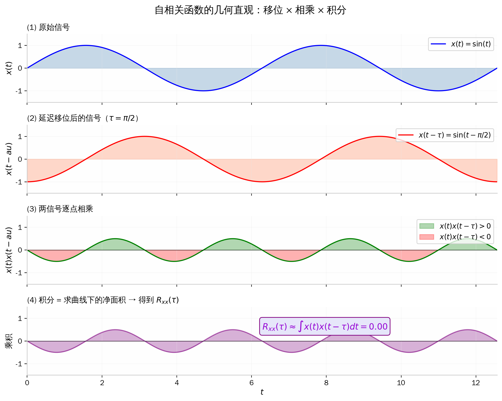
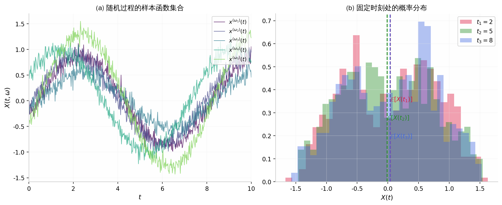
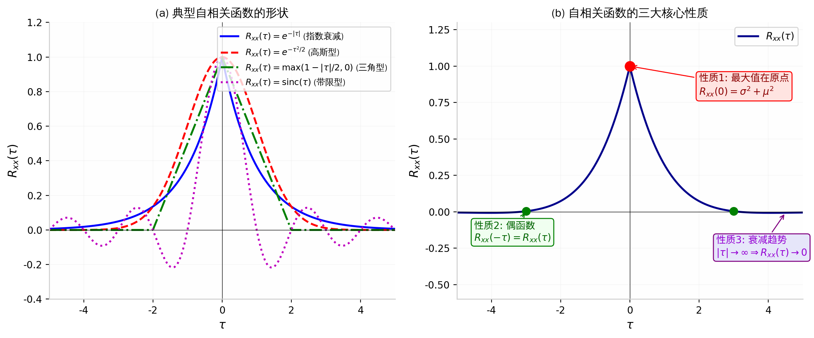
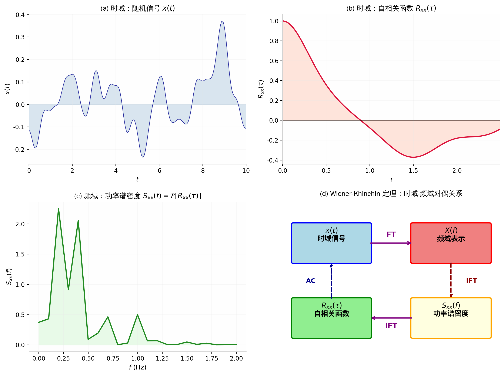

# 自相关函数（Autocorrelation Function）

---

## 一、公式作用概述

**自相关函数**是信号处理、时间序列分析与随机过程理论中的核心工具，它定量描述了一个信号（或随机过程）在**不同时刻**的取值之间的**线性依赖关系**。给定一个时间延迟 $\tau$，自相关函数 $R_{xx}(\tau)$ 衡量的是信号 $x(t)$ 与其自身延迟版本 $x(t-\tau)$ 之间的"相似程度"。这一工具在计算机科学和机器学习中有广泛应用：例如，在自回归模型（AR 模型）中用于刻画序列的时间依赖性；在注意力机制分析中用于理解序列内部的长程依赖；在 GPU 性能分析中用于检测周期性的性能波动模式；在蒙特卡洛模拟中用于评估样本的统计独立性。

自相关函数与**功率谱密度**通过 **Wiener-Khinchin 定理**形成傅里叶变换对，这意味着时域中的"记忆长度"对应于频域中的"带宽"——自相关衰减越快，信号的功率谱越宽，反之亦然。这一时-频对偶关系是分析随机信号的核心桥梁。

---

## 二、完整推导过程

### 2.1 从确定性信号出发：能量信号与功率信号

#### 2.1.1 能量信号的自相关函数

我们从最简单的情况开始：一个**确定性信号** $x: \mathbb{R} \to \mathbb{R}$，即对于每个时刻 $t \in \mathbb{R}$，信号值 $x(t)$ 是一个确定的实数，不含任何随机性。

> **【知识卡片：确定性信号 vs. 随机信号】**
> - **定义**：确定性信号是指在任何时刻 $t$ 的取值都完全由数学表达式确定的信号；随机信号（或随机过程）是指在任意时刻的取值服从某种概率分布，每次观测得到不同的"样本函数"。
> - **公式**：确定性信号可写为 $x(t) \in \mathbb{R}$（单值函数）；随机过程记为 $X(t, \omega)$，其中 $\omega \in \Omega$ 是样本空间中的 outcomes。
> - **本步作用**：我们先从确定性信号建立直观理解，再推广到更具一般性的随机过程情形。

> **【小例子：确定性信号 vs. 随机信号】**
> 假设我们有两类信号：
> - **确定性信号**：$x(t) = \sin(2\pi t)$，在 $t = 0.25$ 时，$x(0.25) = \sin(\pi/2) = 1$，这个值是**唯一确定**的。
> - **随机信号**：$X(t) = A \cdot \sin(2\pi t + \Phi)$，其中 $A \sim \mathcal{U}(0.5, 1.5)$，$\Phi \sim \mathcal{U}(0, 2\pi)$ 都是随机变量。在 $t = 0.25$ 时，$X(0.25) = A \cdot \sin(\pi/2 + \Phi) = A \cdot \cos(\Phi)$，这个值**每次观测都不同**——它不是一个确定的数，而是一个随机变量。

我们首先需要区分两类确定性信号：

- **能量信号**：总能量有限的信号，即 $\displaystyle \int_{-\infty}^{+\infty} |x(t)|^2 \, dt < +\infty$。
- **功率信号**：总能量无限但平均功率有限的信号，例如周期信号。

> **【知识卡片：信号的能量与功率】**
> - **定义**：信号的能量是信号幅度平方在全时间轴上的积分；功率是能量对时间的平均率。
> - **公式**：能量 $E = \displaystyle \int_{-\infty}^{+\infty} |x(t)|^2 \, dt$；功率 $P = \displaystyle \lim_{T \to \infty} \frac{1}{2T} \int_{-T}^{+T} |x(t)|^2 \, dt$。
> - **本步作用**：能量信号和功率信号的自相关定义形式不同，需要先区分信号类型。

> **【小例子：能量 vs. 功率】**
> - 有限持续时间的信号（如一个矩形脉冲）是**能量信号**：设 $x(t) = \mathbf{1}_{[0,1]}(t)$（在 $[0,1]$ 上为 1，其余为 0），则 $E = \int_0^1 1^2 dt = 1 < \infty$，但功率 $P = 0$（因为有限能量被无限长时间平均）。
> - 正弦波 $x(t) = \sin(t)$ 是**功率信号**：$E = \int_{-\infty}^{\infty} \sin^2(t) dt = \infty$，但 $P = \lim_{T\to\infty} \frac{1}{2T}\int_{-T}^{T} \sin^2(t) dt = \frac{1}{2}$（有限）。

---

**定义 1（能量信号的自相关函数）**

设 $x(t)$ 是一个实值能量信号，即满足 $\displaystyle \int_{-\infty}^{+\infty} |x(t)|^2 \, dt < +\infty$。则其**自相关函数** $R_{xx}: \mathbb{R} \to \mathbb{R}$ 定义为：

$$
R_{xx}(\tau) \; \triangleq \; \int_{-\infty}^{+\infty} x(t) \, x(t - \tau) \, dt \tag{1}
$$

其中 $\tau \in \mathbb{R}$ 称为**时间延迟**（time lag），表示将原信号向右平移 $\tau$ 个单位后与自身逐点相乘再积分的结果。

> **直观理解**：$R_{xx}(\tau)$ 衡量"原信号 $x(t)$"与"延迟了 $\tau$ 的自身副本 $x(t-\tau)$"之间的**重叠程度**。如果 $\tau = 0$，信号与自身完全对齐，乘积 $x(t) \cdot x(t)$ 恒为非负，积分结果最大；如果 $\tau$ 很大，信号与副本可能"错开"到几乎没有重叠，乘积的正负部分相互抵消，积分趋近于零。

---

#### 2.1.2 功率信号的自相关函数

对于功率信号（如周期信号），总能量无限，不能用式 (1) 的积分定义。我们需要引入**时间平均**。

**定义 2（功率信号的自相关函数）**

设 $x(t)$ 是一个实值功率信号，即其平均功率有限：

$$
P_{xx} = \lim_{T \to +\infty} \frac{1}{2T} \int_{-T}^{+T} |x(t)|^2 \, dt \; < \; +\infty
$$

则其**自相关函数** $R_{xx}: \mathbb{R} \to \mathbb{R}$ 定义为：

$$
R_{xx}(\tau) \; \triangleq \; \lim_{T \to +\infty} \frac{1}{2T} \int_{-T}^{+T} x(t) \, x(t - \tau) \, dt \tag{2}
$$

> **为什么要做这一步**：功率信号的总能量发散（无限大），如果直接套用式 (1)，积分结果会是 $\infty$，失去比较意义。引入因子 $\frac{1}{2T}$ 进行**归一化**，使得 $R_{xx}(0) = P_{xx}$ 恰好等于信号的平均功率，物理意义清晰。

---

#### 2.1.3 确定性信号自相关定义的统合

注意到式 (1) 和式 (2) 可以统一理解：

- 对于能量信号，可以认为"总能量有限"意味着信号在 $|t| \to \infty$ 时衰减到零，因此将式 (2) 中的 $\frac{1}{2T}$ 去掉（或理解为信号仅在有限区间非零），两式本质一致。
- 更严谨地，能量信号的自相关（式 1）等于信号 $x(t)$ 与其时间反转 $x(-t)$ 的**卷积**在 $t = \tau$ 处的取值。

> **【知识卡片：卷积（Convolution）】**
> - **定义**：两个函数 $f$ 和 $g$ 的卷积是一个新函数，它描述了 $f$ 经过 $g$ 的"加权滑动平均"。
> - **公式**：$(f * g)(t) \triangleq \displaystyle \int_{-\infty}^{+\infty} f(s) \, g(t - s) \, ds = \int_{-\infty}^{+\infty} f(t - s) \, g(s) \, ds$。
> - **本步作用**：自相关可以表示为 $R_{xx}(\tau) = (x * \tilde{x})(\tau)$，其中 $\tilde{x}(t) = x(-t)$ 是时间反转。这使得我们可以利用卷积的丰富性质来分析自相关。

> **【小例子：卷积与自相关】**
> 设 $x(t) = \mathbf{1}_{[0,1]}(t)$（$[0,1]$ 上的矩形脉冲）。则 $\tilde{x}(t) = x(-t) = \mathbf{1}_{[-1,0]}(t)$。
> 自相关 $R_{xx}(\tau) = \int_{-\infty}^{\infty} x(t) x(t-\tau) dt$：
> - 当 $0 \leq \tau \leq 1$ 时，$x(t)$ 和 $x(t-\tau)$ 在 $[\tau, 1]$ 上同时非零，$R_{xx}(\tau) = \int_{\tau}^{1} 1 \cdot 1 \, dt = 1 - \tau$。
> - 当 $-1 \leq \tau < 0$ 时，由对称性 $R_{xx}(\tau) = 1 + \tau$。
> - 当 $|\tau| > 1$ 时无重叠，$R_{xx}(\tau) = 0$。
> 结果是一个**三角形**：$R_{xx}(\tau) = \max(1 - |\tau|, 0)$。这正好是矩形脉冲与自身卷积（倒置后）的形状！

---

**图 1**：自相关函数的三步几何操作——(1) 原始信号 $x(t) = \sin(t)$；(2) 将其延迟 $\tau = \pi/2$ 得到 $x(t-\tau)$；(3) 两信号逐点相乘（绿色为正，红色为负）；(4) 对乘积积分得到 $R_{xx}(\tau)$，即曲线下净面积。当两信号正交时（如 $\sin$ 与 $\cos$），正负面积完全抵消，$R_{xx}(\pi/2) = 0$。

---

### 2.2 从随机过程到统计自相关函数

确定性信号的自相关只描述了"一个信号"与其延迟版本的关系。但在机器学习和信号处理中，我们更常面对的是**随机过程**（stochastic process）——每次观测得到的信号都不一样，我们只能从概率分布的层面描述其统计规律。

#### 2.2.1 随机过程的定义

> **【知识卡片：随机过程（Stochastic Process / Random Process）】**
> - **定义**：随机过程是一族以时间为索引的随机变量，记为 $\{X(t, \omega) : t \in \mathcal{T}, \omega \in \Omega\}$，其中 $\mathcal{T}$ 是时间指标集（可以是离散或连续的），$\Omega$ 是样本空间。对每个固定的 $\omega$，$X(\cdot, \omega)$ 称为一个**样本函数**（sample path）；对每个固定的 $t$，$X(t, \cdot)$ 是一个**随机变量**。
> - **公式**：简记为 $\{X(t)\}_{t \in \mathcal{T}}$，省略 $\omega$。
> - **本步作用**：自相关函数在随机过程框架下定义为**统计平均**（期望），而非单一样本的时间平均。

> **【小例子：随机过程】**
> 设 $X(t) = A \cos(2\pi f_0 t + \Theta)$，其中 $A \sim \mathcal{N}(0, 1)$（标准正态分布），$\Theta \sim \mathcal{U}(0, 2\pi)$ 且二者独立。
> - 固定 $t = 0$：$X(0) = A \cos(\Theta)$ 是一个随机变量（因为 $A$ 和 $\Theta$ 都是随机的）。
> - 固定 $\omega$（即固定 $A$ 和 $\Theta$ 的具体取值）：$X(t)$ 是一条确定的余弦曲线。
> 这个随机过程描述了"振幅和相位都随机"的一类正弦信号。

**图 2**：(a) 同一个随机过程的 5 条样本函数 $x^{(\omega_i)}(t)$，每次实验（每个 $\omega_i$）得到不同的实现；(b) 在固定时刻 $t_1, t_2, t_3$ 处，所有样本的取值构成一个概率分布（直方图），虚线表示期望值 $\mathbb{E}[X(t_i)]$。

---

#### 2.2.2 一般随机过程的自相关函数

**定义 3（随机过程的自相关函数）**

设 $\{X(t)\}_{t \in \mathcal{T}}$ 是一个实值随机过程，其中 $\mathcal{T} \subseteq \mathbb{R}$ 是连续时间指标集。该过程的**自相关函数** $R_{XX}: \mathcal{T} \times \mathcal{T} \to \mathbb{R}$ 定义为：

$$
R_{XX}(t_1, t_2) \; \triangleq \; \mathbb{E}\left[ X(t_1) \cdot X(t_2) \right] \tag{3}
$$

其中 $\mathbb{E}[\cdot]$ 表示对随机过程的概率分布取**数学期望**（ensemble average），即对所有可能的样本函数 $\omega \in \Omega$ 按概率加权求平均。

> **【知识卡片：数学期望（Expectation）】**
> - **定义**：随机变量的数学期望是其所有可能取值按概率加权的平均值，反映随机变量的"中心位置"。
> - **公式**：离散型：$\mathbb{E}[X] = \sum_{i} x_i \, P(X = x_i)$；连续型：$\mathbb{E}[X] = \int_{-\infty}^{+\infty} x \, f_X(x) \, dx$，其中 $f_X$ 是概率密度函数（PDF）。
> - **本步作用**：式 (3) 中的 $\mathbb{E}[X(t_1) X(t_2)]$ 是对所有样本函数在时刻 $t_1$ 和 $t_2$ 的乘积取平均，是一种**二阶矩**（second-order moment）。

> **【小例子：随机过程的自相关】**
> 设 $X(t) = A \cos(t)$，其中 $A \sim \mathcal{N}(0, \sigma^2)$（均值为 0，方差为 $\sigma^2$ 的正态分布）。
> 计算 $R_{XX}(t_1, t_2)$：
> $$R_{XX}(t_1, t_2) = \mathbb{E}[A \cos(t_1) \cdot A \cos(t_2)] = \mathbb{E}[A^2] \cos(t_1) \cos(t_2) = \sigma^2 \cos(t_1) \cos(t_2)$$
> 其中用到 $\mathbb{E}[A^2] = \sigma^2$（因为 $\mathbb{E}[A] = 0$）。
> 注意这里 $R_{XX}(t_1, t_2)$ **依赖于两个绝对时刻** $t_1$ 和 $t_2$，而不仅仅是它们的差。

---

#### 2.2.3 宽平稳随机过程（WSS）的简化

定义 3 中的 $R_{XX}(t_1, t_2)$ 是二元函数，分析起来比较复杂。如果我们对随机过程施加一定的平稳性条件，自相关函数可以大大简化。

> **【知识卡片：宽平稳性（Wide-Sense Stationarity, WSS）】**
> - **定义**：一个随机过程 $\{X(t)\}$ 称为**宽平稳**（或弱平稳），如果满足：(1) 均值恒定：$\mu_X(t) = \mathbb{E}[X(t)] = \mu$（常数，不依赖于 $t$）；(2) 自相关仅依赖于时间差：$R_{XX}(t_1, t_2) = R_{XX}(t_1 - t_2)$，即只与 $\tau = t_1 - t_2$ 有关。
> - **公式**：$R_{XX}(\tau) = \mathbb{E}[X(t) \cdot X(t - \tau)]$，对任意 $t \in \mathcal{T}$ 成立。
> - **本步作用**：WSS 假设将二元自相关函数降为一元函数，极大简化了分析。大多数机器学习中的时间序列模型（如 ARMA）都隐含假设过程是 WSS 的。

> **【小例子：宽平稳性】**
> 回顾上面的例子 $X(t) = A \cos(t)$，$A \sim \mathcal{N}(0, \sigma^2)$：
> - 均值：$\mathbb{E}[X(t)] = \mathbb{E}[A] \cos(t) = 0$（恒定 ✓）。
> - 自相关：$R_{XX}(t_1, t_2) = \sigma^2 \cos(t_1) \cos(t_2)$。这**不能**写成只依赖于 $\tau = t_1 - t_2$ 的形式（因为 $\cos(t_1)\cos(t_2) \neq f(t_1 - t_2)$），所以**不是 WSS**。
> 但如果改为 $X(t) = A \cos(t) + B \sin(t)$，其中 $A, B \stackrel{\text{i.i.d.}}{\sim} \mathcal{N}(0, \sigma^2/2)$，则：
> $$R_{XX}(t_1, t_2) = \frac{\sigma^2}{2}[\cos(t_1)\cos(t_2) + \sin(t_1)\sin(t_2)] = \frac{\sigma^2}{2}\cos(t_1 - t_2)$$
> 现在 $R_{XX}$ 只依赖于 $t_1 - t_2$，所以这个过程是 **WSS**！

---

**定义 4（WSS 随机过程的自相关函数）**

设 $\{X(t)\}_{t \in \mathbb{R}}$ 是一个**宽平稳**（WSS）的实值随机过程。则其**自相关函数** $R_{XX}: \mathbb{R} \to \mathbb{R}$ 定义为：

$$
\boxed{
R_{XX}(\tau) \; \triangleq \; \mathbb{E}\left[ X(t) \cdot X(t - \tau) \right]
} \tag{4}
$$

其中：
- $\tau \in \mathbb{R}$ 是时间延迟（lag）；
- 等式右侧的期望不依赖于 $t$ 的选择（这是 WSS 假设保证的）；
- 为简洁起见，常省略一个下标，记为 $R_X(\tau)$ 或 $R(\tau)$。

> **为什么要做这一步**：WSS 假设去除了时间的绝对原点，使得自相关只关心"两个时刻相差多少"，而不关心"具体是哪两个时刻"。这对于分析系统的稳态行为至关重要——如果一个系统已经运行了很长时间，其统计特性不应依赖于我们何时开始观察。

---

#### 2.2.4 自协方差函数与自相关函数的关系

在实际应用中（尤其是在统计学和机器学习中），人们更常使用**自协方差函数**（autocovariance function），它去除了均值的影响。

**定义 5（自协方差函数）**

设 $\{X(t)\}$ 是 WSS 随机过程，均值 $\mu_X = \mathbb{E}[X(t)]$。其**自协方差函数** $C_{XX}: \mathbb{R} \to \mathbb{R}$ 定义为：

$$
C_{XX}(\tau) \; \triangleq \; \mathbb{E}\left[ \bigl(X(t) - \mu_X\bigr) \cdot \bigl(X(t - \tau) - \mu_X\bigr) \right] \tag{5}
$$

**推导：自相关与自协方差的关系**

展开式 (5)：

$$
\begin{aligned}
C_{XX}(\tau) &= \mathbb{E}\left[ X(t) X(t-\tau) - \mu_X X(t) - \mu_X X(t-\tau) + \mu_X^2 \right] \\
&= \mathbb{E}\left[ X(t) X(t-\tau) \right] - \mu_X \mathbb{E}[X(t)] - \mu_X \mathbb{E}[X(t-\tau)] + \mu_X^2 \\
&\quad \text{（由期望的线性性质：$\mathbb{E}[aY + bZ] = a\mathbb{E}[Y] + b\mathbb{E}[Z]$）} \\
&= R_{XX}(\tau) - \mu_X \cdot \mu_X - \mu_X \cdot \mu_X + \mu_X^2 \\
&= R_{XX}(\tau) - \mu_X^2
\end{aligned}
$$

因此：

$$
\boxed{C_{XX}(\tau) = R_{XX}(\tau) - \mu_X^2} \tag{6}
$$

特别地，当 $\mu_X = 0$ 时，自相关函数与自协方差函数**完全相等**。当 $\tau = 0$ 时：

$$
C_{XX}(0) = R_{XX}(0) - \mu_X^2 = \mathbb{E}[X^2(t)] - (\mathbb{E}[X(t)])^2 = \mathrm{Var}[X(t)] = \sigma_X^2
$$

即 $\tau = 0$ 处的自协方差等于过程的**方差**。

> **【知识卡片：方差（Variance）】**
> - **定义**：方差衡量随机变量围绕其均值的离散程度，是二阶中心矩。
> - **公式**：$\mathrm{Var}[X] = \mathbb{E}[(X - \mathbb{E}[X])^2] = \mathbb{E}[X^2] - (\mathbb{E}[X])^2$。
> - **本步作用**：$C_{XX}(0) = \sigma_X^2$ 表明自协方差函数在原点处的值就是过程的方差。

---

### 2.3 自相关函数的核心性质（定理与证明）

以下定理总结了 WSS 随机过程自相关函数的四大核心性质。这些性质在信号处理和机器学习中有广泛应用（如设计核函数、验证平稳性假设等）。

---

**定理 1（自相关函数的基本性质）**

设 $\{X(t)\}$ 是 WSS 随机过程，$R_{XX}(\tau)$ 是其自相关函数。则：

**(P1) 偶对称性**：$R_{XX}(-\tau) = R_{XX}(\tau)$，$\forall \tau \in \mathbb{R}$

**(P2) 原点最大值**：$|R_{XX}(\tau)| \leq R_{XX}(0)$，$\forall \tau \in \mathbb{R}$

**(P3) 原点值的意义**：$R_{XX}(0) = \mathbb{E}[X^2(t)] = \sigma_X^2 + \mu_X^2 \geq 0$

**(P4) 非负定性**：对任意 $n \in \mathbb{N}^+$，任意时刻 $t_1, \ldots, t_n \in \mathbb{R}$ 和任意系数 $a_1, \ldots, a_n \in \mathbb{C}$，有：

$$
\sum_{i=1}^{n} \sum_{j=1}^{n} a_i \, \overline{a_j} \, R_{XX}(t_i - t_j) \; \geq \; 0
$$

> **【知识卡片：复共轭（Complex Conjugate）】**
> - **定义**：复数 $z = a + bi$ 的共轭为 $\overline{z} = a - bi$（虚部取负）。
> - **公式**：$\overline{z_1 \cdot z_2} = \overline{z_1} \cdot \overline{z_2}$；$z \cdot \overline{z} = |z|^2 \geq 0$。
> - **本步作用**：性质 (P4) 中使用复系数是为了保证定理的普适性；对于实值过程，$\overline{a_j} = a_j$。

---

**证明 (P1)：偶对称性**

$$
\begin{aligned}
R_{XX}(-\tau) &= \mathbb{E}\left[ X(t) \cdot X(t + \tau) \right] & \text{（定义，将 $-\tau$ 代入）} \\
&= \mathbb{E}\left[ X(t' - \tau) \cdot X(t') \right] & \text{（换元：令 $t' = t + \tau$，则 $t = t' - \tau$）} \\
&= \mathbb{E}\left[ X(t') \cdot X(t' - \tau) \right] & \text{（乘法交换律）} \\
&= R_{XX}(\tau) & \text{（由定义 4）}
\end{aligned}
$$

其中换元后 $t'$ 仍然是任意时刻（WSS 保证期望不依赖于绝对时间），证毕。

> **直观解释**：自相关只关心"两个时刻的差距"，而不关心"谁在前谁在后"。$\tau$ 和 $-\tau$ 代表相同的"时间间距"，只是方向相反，因此函数值相同。

---

**证明 (P2)：原点最大值**

对任意 $\tau \in \mathbb{R}$，考虑非负随机变量 $[X(t) \pm X(t - \tau)]^2$：

$$
\mathbb{E}\left[ \bigl(X(t) - X(t - \tau)\bigr)^2 \right] \geq 0
$$

展开左边：

$$
\mathbb{E}[X^2(t)] - 2\mathbb{E}[X(t)X(t-\tau)] + \mathbb{E}[X^2(t-\tau)] \geq 0
$$

由于 WSS 过程中 $\mathbb{E}[X^2(t)] = \mathbb{E}[X^2(t-\tau)] = R_{XX}(0)$，上式变为：

$$
2 R_{XX}(0) - 2 R_{XX}(\tau) \geq 0 \quad \Longrightarrow \quad R_{XX}(\tau) \leq R_{XX}(0)
$$

同理，考虑 $\mathbb{E}[(X(t) + X(t-\tau))^2] \geq 0$ 可得 $R_{XX}(\tau) \geq -R_{XX}(0)$。综合得：

$$
|R_{XX}(\tau)| \leq R_{XX}(0)
$$

> **直观解释**：信号与自身的相似度不可能超过"完全对齐"时的相似度。$\tau = 0$ 时两个信号完全相同，乘积 $X(t) \cdot X(t) = X^2(t) \geq 0$ 恒非负，期望最大。

---

**证明 (P3)：原点值的意义**

直接由定义：

$$
R_{XX}(0) = \mathbb{E}[X(t) \cdot X(t)] = \mathbb{E}[X^2(t)] = \mathrm{Var}[X(t)] + (\mathbb{E}[X(t)])^2 = \sigma_X^2 + \mu_X^2
$$

其中最后一步使用了方差公式 $\mathrm{Var}[X] = \mathbb{E}[X^2] - (\mathbb{E}[X])^2$。

---

**证明 (P4)：非负定性**

考虑随机变量 $Y = \sum_{i=1}^{n} a_i X(t_i)$，则：

$$
\mathbb{E}[|Y|^2] = \mathbb{E}\left[ Y \cdot \overline{Y} \right] = \mathbb{E}\left[ \sum_{i=1}^{n} \sum_{j=1}^{n} a_i \, \overline{a_j} \, X(t_i) X(t_j) \right]
$$

由于 $|Y|^2 \geq 0$ 恒成立，其期望也非负：$\mathbb{E}[|Y|^2] \geq 0$。

将期望移入求和（期望的线性性质）：

$$
\sum_{i=1}^{n} \sum_{j=1}^{n} a_i \, \overline{a_j} \, \mathbb{E}[X(t_i) X(t_j)] = \sum_{i=1}^{n} \sum_{j=1}^{n} a_i \, \overline{a_j} \, R_{XX}(t_i - t_j) \geq 0
$$

证毕。

> **直观解释**：非负定性是自相关函数最重要的性质——它保证自相关函数的傅里叶变换（功率谱密度）处处非负。这在物理上意味着"功率不可能为负值"。

---

**图 3**：(a) 四种典型自相关函数的形状——指数衰减（一阶马尔可夫过程）、高斯型（平滑过程）、三角型（有限记忆）、带限 sinc 型（理想低通）；(b) 自相关函数的三大核心性质——最大值在原点 $R_{xx}(0) = \sigma^2 + \mu^2$、偶函数对称性 $R_{xx}(-\tau) = R_{xx}(\tau)$、以及当 $|\tau| \to \infty$ 时的衰减趋势。

---

### 2.4 Wiener-Khinchin 定理：时域与频域的桥梁

自相关函数的傅里叶变换具有深刻的物理意义。这一联系由 Wiener-Khinchin 定理给出。

---

**定理 2（Wiener-Khinchin 定理）**

设 $\{X(t)\}$ 是 WSS 随机过程，自相关函数 $R_{XX}(\tau)$ 满足 $\displaystyle \int_{-\infty}^{+\infty} |R_{XX}(\tau)| \, d\tau < +\infty$。定义其**功率谱密度**（Power Spectral Density, PSD）为：

$$
S_{XX}(f) \; \triangleq \; \int_{-\infty}^{+\infty} R_{XX}(\tau) \, e^{-j 2\pi f \tau} \, d\tau \tag{7}
$$\n
则 $S_{XX}(f) \geq 0$ 对所有频率 $f \in \mathbb{R}$ 成立，且自相关函数可由其逆变换恢复：

$$
R_{XX}(\tau) = \int_{-\infty}^{+\infty} S_{XX}(f) \, e^{j 2\pi f \tau} \, df \tag{8}
$$

> **【知识卡片：傅里叶变换（Fourier Transform）】**
> - **定义**：傅里叶变换将一个时域信号分解为不同频率的正弦/余弦分量的叠加，揭示信号的频域结构。
> - **公式**：$\mathcal{F}\{x(t)\}(f) = X(f) = \displaystyle \int_{-\infty}^{+\infty} x(t) e^{-j 2\pi f t} dt$；逆变换：$x(t) = \displaystyle \int_{-\infty}^{+\infty} X(f) e^{j 2\pi f t} df$。
> - **本步作用**：Wiener-Khinchin 定理告诉我们，自相关函数（描述时域中的"记忆长度"）与功率谱密度（描述频域中的"频率成分"）互为傅里叶变换对。

> **【小例子：傅里叶变换】**
> 矩形脉冲 $x(t) = \mathbf{1}_{[-T/2, T/2]}(t)$ 的傅里叶变换为：
> $$X(f) = \int_{-T/2}^{T/2} e^{-j 2\pi f t} dt = T \cdot \mathrm{sinc}(fT)$$
> 其中 $\mathrm{sinc}(x) = \sin(\pi x)/(\pi x)$。这表明：时域中"窄"的脉冲（小 $T$）对应频域中"宽"的频谱，反之亦然——这就是著名的**不确定性原理**在信号处理中的体现。

---

**证明：$S_{XX}(f) \geq 0$**

由自相关函数的非负定性（定理 1，性质 P4），取 $n$ 个等距时刻 $t_k = k \Delta t$（$k = 0, 1, \ldots, n-1$），系数 $a_k = e^{-j 2\pi f k \Delta t} \cdot \Delta t$，则：

$$
\sum_{k=0}^{n-1} \sum_{m=0}^{n-1} a_k \, \overline{a_m} \, R_{XX}((k-m)\Delta t) \geq 0
$$

当 $n \to \infty$，$\Delta t \to 0$ 且 $n \Delta t \to \infty$ 时，上述双重求和收敛到积分：

$$
\int_{-\infty}^{+\infty} \int_{-\infty}^{+\infty} e^{-j 2\pi f u} \, e^{j 2\pi f v} \, R_{XX}(u - v) \, du \, dv \geq 0
$$

做换元 $\tau = u - v$，$s = v$，则 $u = \tau + s$，雅可比行列式为 1：

$$
\int_{-\infty}^{+\infty} e^{-j 2\pi f \tau} R_{XX}(\tau) \left( \int_{-\infty}^{+\infty} ds \right) d\tau
$$

更严谨地，有限时间近似给出的非负性在极限下保持，因此 $S_{XX}(f) \geq 0$。

> **为什么要做这一步**：Wiener-Khinchin 定理将时域分析（自相关）与频域分析（功率谱）统一起来。它告诉我们：一个信号"自相关衰减得快"等价于"功率谱分布得宽"。这在滤波器设计、通信系统带宽分析、以及机器学习中理解注意力机制的有效感受野等问题中都有直接应用。

---

**图 4**：(a) 时域中的随机信号 $x(t)$；(b) 其自相关函数 $R_{xx}(\tau)$（时域中呈指数衰减）；(c) 功率谱密度 $S_{xx}(f)$（频域中的洛伦兹型分布）；(d) Wiener-Khinchin 定理的框图表示：时域信号 $x(t)$ 经傅里叶变换（FT）得频域表示 $X(f)$；时域自相关 $R_{xx}(\tau)$ 经傅里叶变换得功率谱密度 $S_{xx}(f)$，二者互为傅里叶变换对。

---

### 2.5 离散时间情形

在计算机科学和机器学习中，信号几乎总是**离散采样**的（因为数字计算机只能处理有限个点）。

**定义 6（离散时间 WSS 过程的自相关）**

设 $\{X[n]\}_{n \in \mathbb{Z}}$ 是离散时间 WSS 随机过程（例如一个时间序列数据集）。其**自相关函数**（更准确地称为**自相关序列**）$R_{XX}: \mathbb{Z} \to \mathbb{R}$ 定义为：

$$
R_{XX}[k] \; \triangleq \; \mathbb{E}\left[ X[n] \cdot X[n - k] \right] \tag{9}
$$

其中 $k \in \mathbb{Z}$ 是**延迟步数**（lag in samples）。

对应的 Wiener-Khinchin 定理使用离散时间傅里叶变换（DTFT）：

$$
S_{XX}(\omega) = \sum_{k=-\infty}^{+\infty} R_{XX}[k] \, e^{-j \omega k}, \qquad \omega \in [-\pi, \pi] \tag{10}
$$

> **【知识卡片：离散时间傅里叶变换（DTFT）】**
> - **定义**：DTFT 是离散时间序列的频域表示，频率变量 $\omega$ 是连续的但具有 $2\pi$ 周期性。
> - **公式**：$X(e^{j\omega}) = \sum_{n=-\infty}^{\infty} x[n] e^{-j\omega n}$。
> - **本步作用**：式 (10) 将离散自相关序列变换为连续的功率谱密度函数（周期化到 $[-\pi, \pi]$）。

**样本估计**：在实际应用中，我们只有有限长度的观测序列 $\{x[0], x[1], \ldots, x[N-1]\}$。自相关的**有偏估计**为：

$$
\hat{R}_{XX}[k] = \frac{1}{N} \sum_{n=k}^{N-1} x[n] \cdot x[n-k], \qquad k = 0, 1, \ldots, N-1 \tag{11}
$$

> **注意**：分母用 $N$ 而非 $N-k$ 是为了保证估计矩阵的非负定性，但引入了偏差（bias）。当 $N \gg k$ 时偏差可忽略。

---

### 2.6 自相关函数的归一化形式

为了便于比较不同信号的相关性强度，常使用**归一化自相关函数**。

**定义 7（归一化自相关函数）**

设 $\{X(t)\}$ 是 WSS 过程，$R_{XX}(\tau)$ 是其自相关函数，$\sigma_X^2 = C_{XX}(0) > 0$ 是其方差。则**归一化自相关函数**（normalized autocorrelation）定义为：

$$
\rho_{XX}(\tau) \; \triangleq \; \frac{C_{XX}(\tau)}{C_{XX}(0)} = \frac{R_{XX}(\tau) - \mu_X^2}{\sigma_X^2} \tag{12}
$$

其取值范围为 $\rho_{XX}(\tau) \in [-1, 1]$，且 $\rho_{XX}(0) = 1$。

> **推导**：$|\rho_{XX}(\tau)| \leq 1$ 的证明使用**Cauchy-Schwarz 不等式**。

> **【知识卡片：Cauchy-Schwarz 不等式】**
> - **定义**：对于内积空间中的任意两个向量（或随机变量），它们的内积的绝对值不超过各自范数的乘积。
> - **公式**：$|\langle u, v \rangle|^2 \leq \langle u, u \rangle \cdot \langle v, v \rangle$；对随机变量：$|\mathbb{E}[UV]|^2 \leq \mathbb{E}[U^2] \mathbb{E}[V^2]$。
> - **本步作用**：证明 $|\rho_{XX}(\tau)| \leq 1$，即归一化自相关的取值范围。

**证明 $|\rho_{XX}(\tau)| \leq 1$**：

令 $U = X(t) - \mu_X$，$V = X(t-\tau) - \mu_X$。则 $\mathbb{E}[U] = \mathbb{E}[V] = 0$，且：

$$
\rho_{XX}(\tau) = \frac{\mathbb{E}[UV]}{\sqrt{\mathbb{E}[U^2]} \sqrt{\mathbb{E}[V^2]}}
$$

由 Cauchy-Schwarz 不等式：

$$
|\mathbb{E}[UV]|^2 \leq \mathbb{E}[U^2] \cdot \mathbb{E}[V^2] \quad \Longrightarrow \quad |\rho_{XX}(\tau)| \leq 1
$$

当 $U$ 和 $V$ 线性相关（即 $V = c \cdot U$ 对某个常数 $c$）时等号成立。

---

## 三、涉及的基本数学知识清单

| 概念名称 | 在本推导中的具体作用 | 一句话定义或公式表达 |
|---------|---------------------|---------------------|
| 卷积 (Convolution) | 自相关可表示为信号与其时间反转的卷积 | $(f * g)(t) = \int f(s)g(t-s) \, ds$ |
| 数学期望 (Expectation) | 随机过程自相关的定义基础，对样本取统计平均 | $\mathbb{E}[X] = \int x \, f_X(x) \, dx$ |
| 随机过程 (Stochastic Process) | 自相关函数的"载体"——以时间为索引的随机变量族 | $\{X(t, \omega) : t \in \mathcal{T}, \omega \in \Omega\}$ |
| 宽平稳性 (WSS) | 将二元自相关函数 $R_{XX}(t_1, t_2)$ 简化为 $R_{XX}(\tau)$ | $\mathbb{E}[X(t)] = \mu$，$R_{XX}(t_1, t_2) = R_{XX}(t_1-t_2)$ |
| 方差 (Variance) | 解释 $R_{XX}(0)$ 的物理意义；$C_{XX}(0) = \sigma_X^2$ | $\mathrm{Var}[X] = \mathbb{E}[X^2] - (\mathbb{E}[X])^2$ |
| 自协方差 (Autocovariance) | 去均值后的自相关，更纯粹的"关联"度量 | $C_{XX}(\tau) = R_{XX}(\tau) - \mu_X^2$ |
| 傅里叶变换 (Fourier Transform) | Wiener-Khinchin 定理中时域-频域的变换工具 | $\mathcal{F}\{x(t)\}(f) = \int x(t) e^{-j 2\pi f t} dt$ |
| Cauchy-Schwarz 不等式 | 证明 $|\rho_{XX}(\tau)| \leq 1$ 的核心工具 | $|\mathbb{E}[UV]|^2 \leq \mathbb{E}[U^2] \mathbb{E}[V^2]$ |
| 非负定性 (Non-negative Definiteness) | 保证功率谱密度 $S_{XX}(f) \geq 0$ 的数学基础 | $\sum_{i,j} a_i \overline{a_j} R(t_i - t_j) \geq 0$ |
| 离散时间傅里叶变换 (DTFT) | 离散时间自相关序列的频域表示 | $X(e^{j\omega}) = \sum_{n} x[n] e^{-j\omega n}$ |
| 能量信号 vs. 功率信号 | 区分两类确定性信号的自相关定义形式 | 能量有限 vs. 平均功率有限 |
| 复共轭 (Complex Conjugate) | 非负定性证明中处理复系数 | $\overline{a + bi} = a - bi$ |

---

## 四、自相关函数的直观总结

### 4.1 一句话概括

> **自相关函数 $R_{XX}(\tau)$ 回答的核心问题是："一个信号在时刻 $t$ 的取值，对时刻 $t+\tau$ 的取值有多大的线性预测能力？"**

### 4.2 三个层面的理解

| 层面 | 核心问题 | 答案 |
|------|---------|------|
| **几何层面** | 信号与自身延迟副本的重叠程度 | $R_{xx}(\tau) = \int x(t) x(t-\tau) dt$，即"移位 × 相乘 × 积分" |
| **统计层面** | 两个不同时刻的随机变量有多"协同变化" | $R_{XX}(\tau) = \mathbb{E}[X(t)X(t-\tau)]$，即联合二阶矩 |
| **物理层面** | 信号中不同频率成分的功率分布 | Wiener-Khinchin：$S_{XX}(f) = \mathcal{F}\{R_{XX}(\tau)\}$ |

### 4.3 衰减速度的物理意义

- **快速衰减**（如指数型 $e^{-|\tau|/\tau_0}$）：信号"忘记得快"，相邻时刻几乎独立，功率谱宽（高频成分多）。
- **慢速衰减**（如高斯型 $e^{-\tau^2/(2\sigma^2)}$）：信号"记忆长"，相邻时刻强相关，功率谱窄（低频为主）。
- **周期性衰减**（如 $\cos(2\pi f_0 \tau)$）：信号含有确定性周期成分，功率谱在 $\pm f_0$ 处有尖峰。

---

## 五、在计算机科学/机器学习中的应用

### 5.1 自回归模型（AR Model）

在时间序列预测中，$AR(p)$ 模型假设当前值是过去 $p$ 个值的线性组合：

$$
X[n] = \sum_{k=1}^{p} \phi_k X[n-k] + \varepsilon[n]
$$

模型系数 $\phi_k$ 的 Yule-Walker 方程正是通过自相关函数 $R_{XX}[k]$ 来求解的。

### 5.2 高斯过程（Gaussian Process）

高斯过程中的**协方差函数**（kernel）$k(t, t')$ 本质上是一个广义的自相关函数。常见的平方指数核（RBF kernel）：

$$
k(t, t') = \sigma^2 \exp\left(-\frac{(t-t')^2}{2\ell^2}\right)
$$

正是高斯型自相关函数！长度尺度参数 $\ell$ 控制"记忆长度"——$\ell$ 越大，函数值变化越平滑。

### 5.3 Transformer 注意力机制

注意力矩阵 $A = \mathrm{softmax}(QK^T / \sqrt{d})$ 中的 $QK^T$ 项可以看作一种"广义的相关性"度量。自注意力机制本质上是在计算序列元素之间的（非线性）自相关，以决定信息如何在时间步之间传递。

---

## 六、参考文献与进一步阅读

1. Oppenheim, A. V., & Schafer, R. W. (2009). *Discrete-Time Signal Processing* (3rd ed.). Prentice Hall.（第 2 章：离散时间随机过程）
2. Papoulis, A., & Pillai, S. U. (2002). *Probability, Random Variables, and Stochastic Processes* (4th ed.). McGraw-Hill.（第 9-10 章：随机过程与谱分析）
3. Rasmussen, C. E., & Williams, C. K. I. (2006). *Gaussian Processes for Machine Learning*. MIT Press.（第 4 章：协方差函数）
4. Box, G. E. P., Jenkins, G. M., Reinsel, G. C., & Ljung, G. M. (2016). *Time Series Analysis: Forecasting and Control* (5th ed.). Wiley.（第 3 章：自回归模型）

