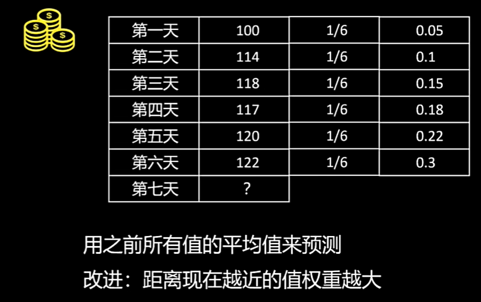
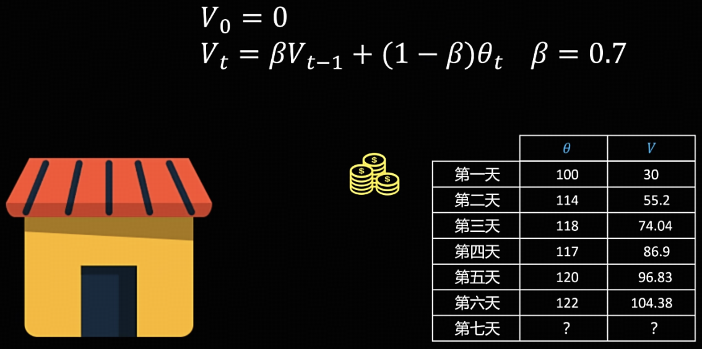

# 指数加权平均（Exponential Moving Average，EMA）

## EMA 的思想

已知前6天的收入数据，如何更准确地预测第7天的收入？

**1. 简单思路：平均值法**

  取前6天收入的算术平均值作为预测值，即每天赋予相同的权重 (1/6)。

**2. 改进思路：加权平均法**

  一个更合理的假设是：距离预测日越近的数据，其参考价值越大。因此，可以为前6天的收入赋予不同的权重，近期的权重大于远期的权重。

上图直观展示了上述两种思路的预测结果对比。

然而，在改进思路中，我们只是定性地遵循“近期权重大、远期权重小”的原则，尚未给出统一的定量表示。为此，可以引入**指数加权平均（Exponential Moving Average, EMA）的公式**：

$$
V_t = \beta V_{t-1} + (1 - \beta) \theta_t
$$

其中：

* $V_0$ 为初始值，
* $\theta_t$ 为第 $t$ 天的观测值（即实际收入），
* $\beta$ 为衰减系数（取值在 0 到 1 之间）。

EMA 的特点是对近期数据赋予更大的权重，对远期数据赋予指数递减的较小权重。将公式展开可得：

$$
\begin{aligned} 
V_t &= \beta V_{t-1} + (1 - \beta) \theta_t \cr
&= (1 - \beta)\theta_t + \beta(1 - \beta)\theta_{t-1} + \beta^{2}(1 - \beta)\theta_{t-2} + \beta^{3}(1 - \beta)\theta_{t-3} + \cdots
\end{aligned}
$$

从展开式可以看出：观测值距离当前时刻越远，其前面的系数中 $\beta$ 的幂次就越高（即权重呈指数级衰减）。这正是“指数加权平均”名称的由来。**其本质是利用一个递推变量 $V_t$，保存了历史信息的平滑摘要**。

## EMA 的问题及修正

初始化时设定 $ V_0 = 0 $，取 $ \beta = 0.7 $。计算后发现，前几天的值明显偏小。

这是由于 $ V_0 = 0 $ 这一初始化条件所导致的。如果计算序列足够长，随着指数加权平均的不断推进，$ V_0 $ 的影响会逐渐减弱，结果自然趋于准确。然而，当计算序列较短时，该如何进行修正呢？

修正方法：对 $ V_0 $ 的初始化值进行偏差修正。

$$
V_t^{\text{correct}} = \frac{V_t}{1 - \beta^t}
$$

由于当 $ t $ 较大时，$ 1 - \beta^t $ 逐渐接近于 1，因此在序列足够长的情况下，修正项对后续 $ V $ 的影响就变得很小了。

# SGD 随机梯度下降

