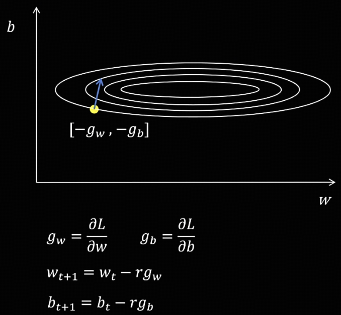
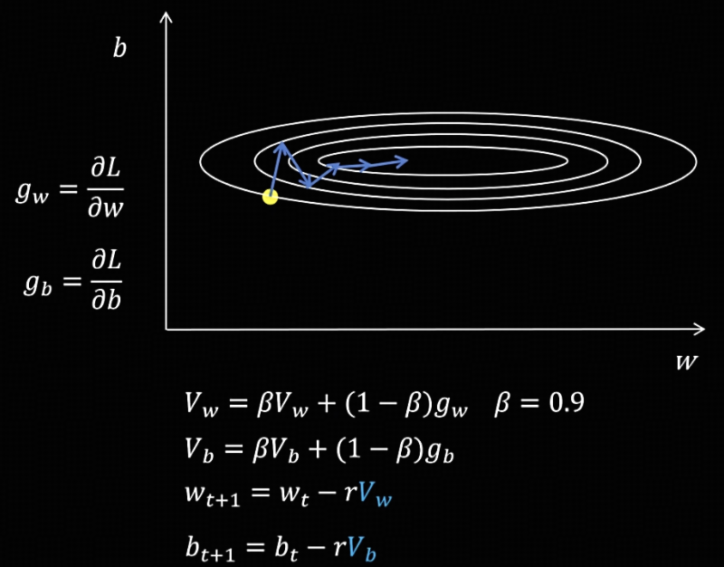
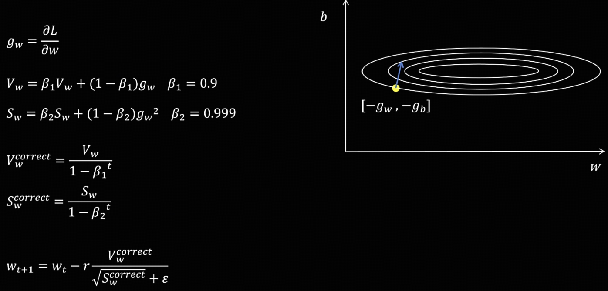
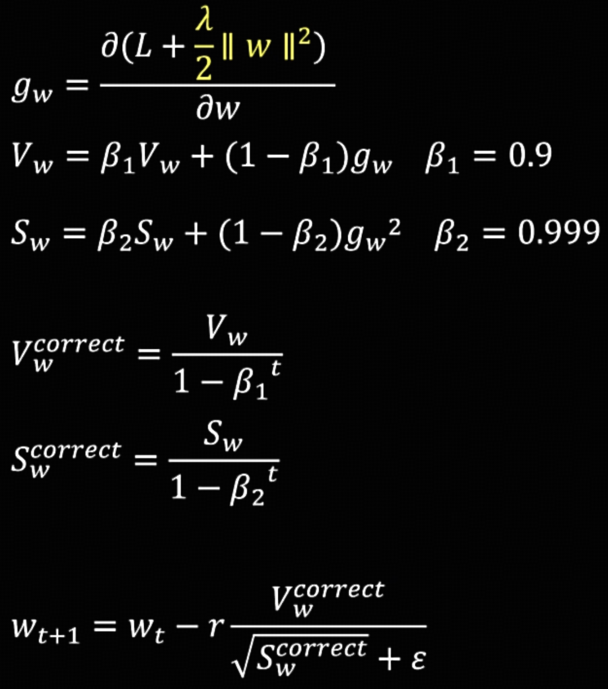
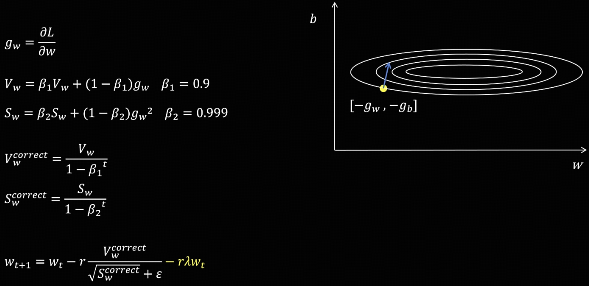

# 指数加权平均（Exponential Moving Average，EMA）

## EMA 的思想

已知前6天的收入数据，如何更准确地预测第7天的收入？

**1. 简单思路：平均值法**

  取前6天收入的算术平均值作为预测值，即每天赋予相同的权重 (1/6)。

**2. 改进思路：加权平均法**

  一个更合理的假设是：距离预测日越近的数据，其参考价值越大。因此，可以为前6天的收入赋予不同的权重，近期的权重大于远期的权重。

上图直观展示了上述两种思路的预测结果对比。

然而，在改进思路中，我们只是定性地遵循“近期权重大、远期权重小”的原则，尚未给出统一的定量表示。为此，可以引入**指数加权平均（Exponential Moving Average, EMA）的公式**：

$$
V_t = \beta V_{t-1} + (1 - \beta) \theta_t
$$

其中：

* $V_0$ 为初始值，
* $\theta_t$ 为第 $t$ 天的观测值（即实际收入），
* $\beta$ 为衰减系数（取值在 0 到 1 之间）。

EMA 的特点是对近期数据赋予更大的权重，对远期数据赋予指数递减的较小权重。将公式展开可得：

$$
\begin{aligned} 
V_t &= \beta V_{t-1} + (1 - \beta) \theta_t \cr
&= (1 - \beta)\theta_t + \beta(1 - \beta)\theta_{t-1} + \beta^{2}(1 - \beta)\theta_{t-2} + \beta^{3}(1 - \beta)\theta_{t-3} + \cdots
\end{aligned}
$$

从展开式可以看出：观测值距离当前时刻越远，其前面的系数中 $\beta$ 的幂次就越高（即权重呈指数级衰减）。这正是“指数加权平均”名称的由来。**其本质是利用一个递推变量 $V_t$，保存了平滑后的历史信息**。

## EMA 的问题及修正

初始化时设定 $ V_0 = 0 $，取 $ \beta = 0.7 $。计算后发现，前几天的值明显偏小。

这是由于 $ V_0 = 0 $ 这一初始化条件所导致的。如果计算序列足够长，随着指数加权平均的不断推进，$ V_0 $ 的影响会逐渐减弱，结果自然趋于准确。然而，当计算序列较短时，该如何进行修正呢？

修正方法：对 $ V_0 $ 的初始化值进行偏差修正。

$$
V_t^{\text{correct}} = \frac{V_t}{1 - \beta^t}
$$

由于当 $ t $ 较大时，$ 1 - \beta^t $ 逐渐接近于 1，因此在序列足够长的情况下，修正项对后续 $ V $ 的影响就变得很小了。

# SGD 随机梯度下降

随机梯度下降的核心思想就是**当前梯度指向哪里，参数就往反方向走**。

图中有两个需要优化的参数 $ w $ 和 $ b $。通过对损失函数计算这两个参数的偏导数，可以得到对应的梯度，然后沿着梯度的反方向更新参数。

**问题所在：** 神经网络的参数量通常十分庞大。由于不同参数的梯度大小差异显著——有的梯度很大，有的却很小——如果在更新参数时统一使用相同的步长，就会导致训练过程出现震荡，进而使模型训练变得不稳定。

## SGD + Momentum

Momentum 的核心思想是：**不要只相信当前梯度，而是综合过去一段时间的梯度趋势**。

具体做法是：首先计算当前时间步所有参数的梯度；然后，利用这些梯度更新所有参数在当前时间步的指数加权平均值；最后，使用该指数加权平均值来更新参数。

以某个参数为例，如果其在不同时间步的梯度有正有负，通过指数加权平均处理后，这些梯度可以相互抵消。这样一来，就能有效缓解模型训练过程中的震荡问题。所以，**Momentum 解决的是“更新方向不稳定”**。

## AdaGrad

Momentum 主要解决方向问题，但还有另一个问题：**所有参数都用同一个学习率，不一定合理**。可能出现某些参数步子太大，震荡；某些参数步子太小，学得慢。

AdaGrad 的思想是：**对每个参数维护历史梯度平方和，梯度经常大的参数，学习率变小；梯度经常小的参数，学习率相对变大**。

公式：
$$
S_w = S_{w} + g_w^2 \tag{1}
$$

$$
S_b = S_{b} + g_b^2 \tag{2}
$$

$$
w_{t+1} = w_{t} - r\frac{g_w}{\sqrt{S_w}+\epsilon} \tag{3}
$$

$$
b_{t+1} = b_{t} - r\frac{g_b}{\sqrt{S_b}+\epsilon} \tag{4}
$$

$\epsilon$ 防止除数为 0。

注意到，公式 (1) 和 (2) 中使用了 $g_w^2$ 和 $g_b^2$。取平方是为了确保结果恒为正，因为 $S_w$ 和 $S_b$ 的目的是缩放学习率，而不是改变梯度的方向。

但是，AdaGrad 的缺点是，$S_w$ 和 $S_b$ 这个累加量只增不减。随着训练进行，$S_w$ 和 $S_b$ 越来越大，导致有效学习率越来越小。

# RMSProp

将 AdaGrad 中 $S_w$ 和 $S_b$ 的累加关系变成指数加权平均，从而能够根据近期梯度的规模，为每个参数自动调整学习率。

# Adam (Adaptive Moment Estimation)

Adam 把 Momentum 和 RMSProp 合在一起，并修正了指数加权平均值。

具体做法是：首先计算参数的梯度，然后分别计算梯度（一阶矩）和梯度平方（二阶矩）的指数加权平均值，并进行偏差修正。最后，在更新参数时，利用修正后的梯度指数加权平均值与梯度平方的指数加权平均值来进行调整。

## Adam 的缺陷

在传统优化器（如 SGD）中，权重衰减 (weight decay) 常常通过 L2 正则实现[^1]，从而避免训练过拟合。

[^1]: 需要强调的是，我们通过 L2 正则化来实现权重衰减。换句话说，**在损失函数中加入 L2 惩罚项，其目的就是进行权重衰减，鼓励模型在训练中学习到较小的参数**。过大的参数容易导致过拟合，因为此时输入哪怕只有微小变化，也可能引起输出的剧烈波动，这恰恰是我们需要避免的。

假设原始 Loss 为 $L_{error}$，加入 L2 正则后为:
$$
L =L_{error} + \frac{\lambda}{2}||w||^2 
$$

梯度变成：
$$
g_w = \nabla L_{error} + \lambda w
$$

其中 $ \lambda $ 为超参数，取值 0~1。

在 SGD 中，梯度更新公式就变成：

$$
w_{t+1} = w_t - r g_w = w_t - r (\nabla L_{error} + \lambda w) = (1-r \lambda)w_t - r \nabla L_{error}
$$

这里的 $(1-r \lambda)w_t$ 就是**权重衰减**，因为系数 $(1-r \lambda) < 1$。

然而，Adam 引入的自适应机制，导致 L2 正则化被纳入了复杂的自适应学习率计算，其惩罚效果被不均匀地扭曲了。如下图：

为了解决这个问题，引入了 AdamW，即将权重衰减解耦，保持了惩罚的“纯粹性”和“一致性”。

# AdamW

在 Adam 的基础上仅做一处改动：在更新参数时加入权重衰减（Weight Decay）。具体来说，每次更新参数后，再对参数减去一个很小的值，以防止参数过大，从而提升模型的泛化能力。AdamW 中的 "W" 指的就是 Weight Decay。

* 图中公式的 $\lambda$ 即 Weight Decay，默认取值 $\lambda=0.01$。

# Adam 与 AdamW 的显存占用

在 Adam 优化器中，需要为每个参数额外维护两组状态：梯度的一阶矩（指数加权平均）和二阶矩（梯度平方的指数加权平均）。由于这些状态是梯度微小变化的长期累积结果，对数值精度非常敏感，因此通常必须使用 float32 而非 float16 来存储。这直接导致了训练时显存占用量的大幅增加。

