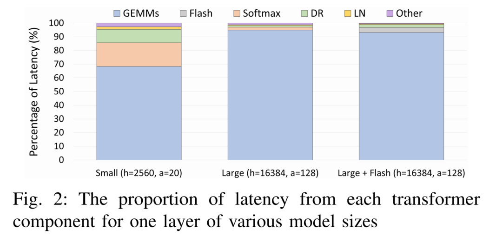

# 参考资料

[The Case for Co-Designing Model Architectures with Hardware](https://arxiv.org/abs/2401.14489)

# 符号约定
| 变量 | 含义 | 变量 | 含义 |
| :---: | :--- | :---: | :--- |
| $a$ | Number of attention heads | $s$ | Sequence length |
| $b$ | Microbatch size | $t$ | Tensor-parallel size |
| $h$ | Hidden dimension size | $v$ | Vocabulary size |
| $L$ | Number of transformer layers | | |


# 为什么要优化 GEMM 维度

下图 2 测量 Transformer 层内各组件（或算子类型）的延迟占比。可以发现，随着模型规模增大，无论是否使用 FlashAttention，GEMM 操作的延迟都占据主导地位。




<a id="swiglu-maf-bench"></a>
# swiglu-maf-bench 测试

`swiglu-maf-bench.py`
```python
#!/usr/bin/env python  
  
"""  
  
这个脚本会帮助你在使用 SwiGLU 时，找到 MLP 隐藏层的中间维度值。  
  
它会在最接近 8/3*h 的范围内进行暴力搜索，寻找能够让  
[b*s, h]×[h, 8/3*h] 矩阵乘法获得最高 TFLOPS 的最佳数值。  
  
尽管 SwiGLU MLP 使用 3 个矩阵，但这个脚本只搜索一个矩阵乘法，因为每个矩阵乘法的性能是  
相同的。  
  
在使用 tensor parallelism 且 tp>1 的情况下，搜索 m1 =  
m/tp 会更快；例如 tp=8 时就是搜索 1/8 的规模。  
  
要适配你的情况，请修改下面的搜索参数。  
  
这个 benchmark 是为论文 The Case for Co-Designing Model Architectures with  
Hardware 编写的：https://arxiv.org/abs/2401.14489  
  
"""  
  
import torch  
from tqdm import trange  
  
### 修改搜索参数开始 ###  
  
# 这是模型的 hidden_size  
d_hidden = 4096  
  
# 现在可以让 8/3 的比例给出起始维度大小，或者选择你自己的值；8/3  
# 只是一个用于补偿第 3 个额外矩阵的建议  
d_ff_base = int(8/3*d_hidden)  
#d_ff_base = 11008  
  
# batch size——对于小矩阵可以设置得更大  
batch_size = 2**2  
  
# 对于小矩阵，可以增加 profiler 的迭代次数  
num_iterations = 100  
  
# 搜索范围：d_ff_base-distance < d_ff_base < d_ff_base+distance  
distance = 100  
  
### 修改搜索参数结束 ###  
  
def benchmark_bmm(b, m, n, k, num_iterations=100, num_matmuls=1):  
    A = torch.randn((b, m, n)).half().to("cuda:0")  
    B = torch.randn((b, n, k)).half().to("cuda:0")  
    C = torch.empty((b, m, k)).half().to("cuda:0")  
    num_warmup_iterations = 50  
  
    start_event = torch.cuda.Event(enable_timing=True)  
    end_event = torch.cuda.Event(enable_timing=True)  
  
    for i in range(num_warmup_iterations + num_iterations):  
        if i == num_warmup_iterations:  
            start_event.record()  
        with torch.no_grad():  
            for i in range(num_matmuls):  
                torch.bmm(A, B, out=C)  
    end_event.record()  
    torch.cuda.synchronize()  
    elapsed_time = start_event.elapsed_time(end_event) / (1000 * num_iterations)  
    flops_per_sec = (2 * b * m * n * k * num_matmuls) / (elapsed_time * 10**12)  
    #print(f"{num_matmuls} 次 {b}x{m}x{n}x{k} 的耗时：{elapsed_time:.3f}")  
    #print(f"{b}x{m}x{n}x{k} 的吞吐量，单位 TFLOP/s：{flops_per_sec:.3f}")  
    #print("-" * 80)  
    return flops_per_sec  
  
  
print(f"Wanted the closest to {d_ff_base} d_ff value that leads to the highest TFLOPS (d_hidden={d_hidden})\n")  
print(f"Searching {int(distance/2)} steps in the range of {d_ff_base-distance} .. {d_ff_base+distance}")  
results = {}  
for d in trange(-distance, distance, 4):  
    d_ff = d_ff_base + d  
    # 找到最接近的能被 4 整除的数，搜索奇数没有意义  
    d_ff -= d_ff % 4  
    #print(d_ff)  
    results[d_ff] = benchmark_bmm(batch_size, m=d_hidden, n=d_ff, k=d_hidden, num_iterations=num_iterations, num_matmuls=1)  
  
starting_tflops_per_sec = benchmark_bmm(batch_size, m=d_hidden, n=d_ff_base, k=d_hidden, num_iterations=num_iterations, num_matmuls=1)  
print("Results: baseline, followed by near-by best performing d_ff results:\n")  
print(" d_ff  tflops mlp_params")  
print("-" * 25)  
print(f"{d_ff_base} {starting_tflops_per_sec:7.2f} {3*d_ff_base*d_hidden}")  
print("-" * 25)  
cut_off = 5  # 你想看到多少个结果  
for d_ff in list(reversed(sorted(results, key=lambda x: results[x])))[:cut_off]:  
    print(f"{d_ff} {results[d_ff]:7.2f} {3*d_ff*d_hidden}")
```
