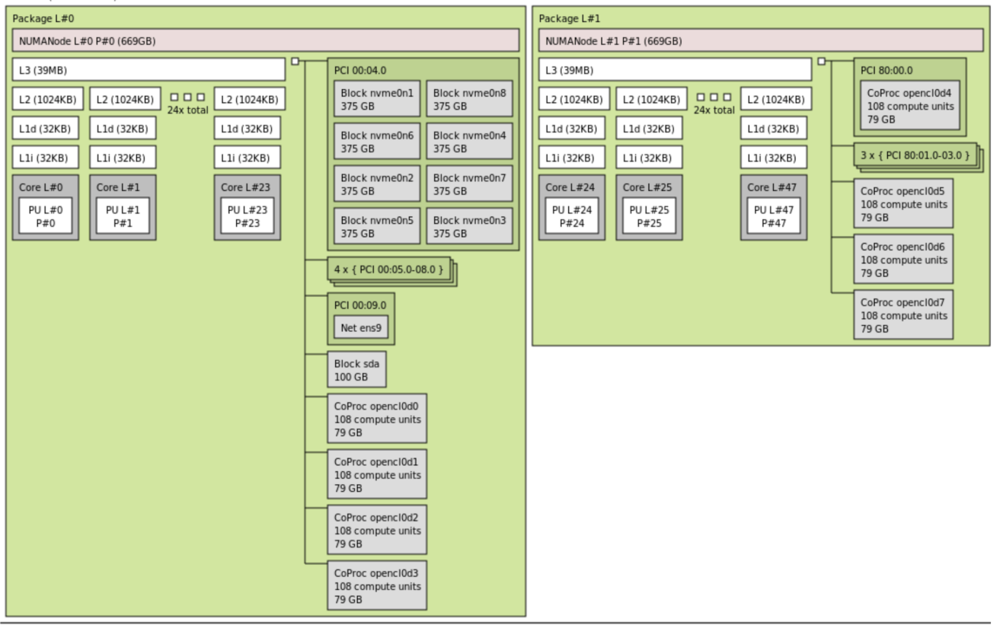

# 环境配置

## 安装工具
```bash
apt update

# 安装控制 NUMA 内存和 CPU 亲和性的命令行工具
apt install numactl

# 安装 NVIDIA Management Library (NVML) 的 Python 库
pip install nvidia-ml-py

# 安装 hwloc 查看 NUMA 拓扑
apt install hwloc
```

## 显示系统 NUMA 硬件拓扑信息

```bash
# 显示系统 NUMA 硬件拓扑信息
numactl --hardware
```
打印的信息含义如下：
| 字段                   | 含义                  |
| -------------------- | ------------------- |
| `available: N nodes` | NUMA 节点总数           |
| `node X cpus`        | 该节点包含的 CPU 核心编号     |
| `node X size`        | 该节点管理的物理内存总量        |
| `node X free`        | 该节点当前空闲内存           |
| `node distances`     | 跨节点内存访问延迟相对值，数值越大越慢 |

- **如果当前的 NUMA 节点为 1，则不需要 NUMA 绑定。只有多节点才需要进行 NUMA 绑定。**


# NUMA

## 什么是 NUMA

在多 CPU 服务器上，内存不是所有 CPU 都“等距离”访问的。这种“访问距离不一样”的架构，就叫 NUMA。

NUMA node 可以简单理解成：**一组 CPU 核心 + 和它们更近的内存 + 和它们更近的 PCIe/GPU 设备**。

使用 `hwloc` 包内的 `lstopo --whole-io topology.svg` 可以导出当前设备的 NUMA 节点拓扑信息。例如：



能明显观察到，单个 NUMA 节点只包含 4 个 GPU 节点，这 4 个 GPU 与该 NUMA 节点的 CPU 核心和内存访问会更快，这就是 NUMA 亲和（NUMA Affinity）。

这些拓扑信息的含义是：
| 项目                   | 信息                              |
| :------------------- | :------------------------------ |
| CPU Package 数量       | 2 个                             |
| NUMA Node 数量         | 2 个                             |
| NUMA Node 0 内存       | 669 GB                          |
| NUMA Node 1 内存       | 669 GB                          |
| 总内存                  | 约 1338 GB                       |
| 每个 Package 核心数       | 24 cores                        |
| 总 CPU core 数         | 48 cores                        |
| 每个 core 对应 PU 数      | 1 个 PU / core                   |
| 每个 core 对应 LU  数      | 1 个 LU / core (如果>1，说明开启了超线程)  |
| GPU / Accelerator 数量 | 8 个                             |
| GPU 名称显示             | CoProc opencl0 到 CoProc opencl7 |
| 每个 GPU 计算单元          | 108 compute units               |
| 每个 GPU 显存            | 79 GB                           |
| NVMe 盘数量             | 8 个 NVMe，每个 375 GB              |
| 系统盘                  | sda，100 GB                      |
| 网卡                   | ens9                            |

常用命令：
```
# 导出完整拓扑的 svg 图
lstopo --whole-io topology.svg

# 导出 XML 供程序分析
lstopo topology.xml

# 终端查看完整文本
lstopo-no-graphics --whole-io

# 终端查看简略文本
lstopy
```

如果使用超线程，CPU 逻辑核的数量会比物理核多，使用 `lstopo -l` 查看。

## 为什么要绑定 NUMA

深度学习训练虽然主要算力在 GPU 上，但 CPU 仍然负责很多事情, 比如：
- DataLoader 读取数据
- 分布式通信的一部分调度
- batch 拼接
- CPU 到 GPU 的数据拷贝
- Python 主进程调度
- 等等

如果没有绑定 NUMA，GPU 进程可以使用任意的 CPU 核心和任意 NUMA 节点的内存。如果 GPU 进程访问非 NUMA 亲和性的 NUMA 节点，数据传输延迟开销会很大。

**所以绑定 NUMA 的核心作用：让 GPU 进程使用与它物理上最近的 CPU 和内存，减少数据传输延迟，提升训练吞吐量。**

对于 GPU，可使用 `nvidia-smi topo -m` 快速查询当前系统推荐的 NUMA 绑定策略：

```bash
$ nvidia-smi topo -m
     GPU0 GPU1 GPU2 GPU3 GPU4 GPU5 GPU6 GPU7 CPU Affinity  NUMA Affinity
GPU0 X    NV18 NV18 NV18 NV18 NV18 NV18 NV18 0-51,         104-155 0
GPU1 NV18 X    NV18 NV18 NV18 NV18 NV18 NV18 0-51,         104-155 0
GPU2 NV18 NV18 X    NV18 NV18 NV18 NV18 NV18 0-51,         104-155 0
GPU3 NV18 NV18 NV18 X    NV18 NV18 NV18 NV18 0-51,         104-155 0
GPU4 NV18 NV18 NV18 NV18 X    NV18 NV18 NV18 52-103,       156-207 1
GPU5 NV18 NV18 NV18 NV18 NV18 X    NV18 NV18 52-103,       156-207 1
GPU6 NV18 NV18 NV18 NV18 NV18 NV18 X    NV18 52-103,       156-207 1
GPU7 NV18 NV18 NV18 NV18 NV18 NV18 NV18 X    52-103,       156-207 1
```


# 实施 NUMA 绑定

有多种方法可实现进程与相应 NUMA 节点的 CPU 核心之间的绑定。

# 脚本 + 启动器配置使用

`numa-set.sh` 脚本
```bash
#!/usr/bin/bash

# 这个辅助工具执行 NUMA 节点绑定，可以与 torchrun 及其他启动器配合使用
# 由 https://github.com/yifuwang 贡献

# 1. 首先赋予执行权限：
#
# chmod a+x ./numa-set.sh
#
# 2. 启动 torchrun 并测试是否正确分配了核心
#
# torchrun --nproc_per_node=8 --no-python ./numa-set.sh \
# python -c 'import os; cs=os.sched_getaffinity(0); print(f"{len(cs)} visible cpu cores: {cs}")'
#
# 所以如果你的原始 torchrun 启动命令是：
#
# torchrun --nproc_per_node=8 --nnodes 2 ... train.py
#
# 现在它变成：
#
# torchrun --nproc_per_node=8 --nnodes 2 ... --no-python ./numa-set.sh python train.py
#
# 命令中的 ... 是指省略了一些参数设置
# 为什么需要 --no-python？ 因为 torchrun 默认行为是自动在命令前加上 python，把后面的参数当作 Python 脚本的参数
# 但此处我们执行的是 shell 脚本

# 查询设备 LOCAL_RANK 的 PCIe 总线 ID
BUS_ID=$(nvidia-smi --query-gpu=pci.bus_id -i $LOCAL_RANK --format=csv,noheader)        # LOCAL_RANK 是 torchrun 分配的进程编号（0,1,2,3...）
BUS_ID=${BUS_ID,,}                                                                      # 把变量内容全部小写

# 查找设备 LOCAL_RANK 所在的 NUMA 节点
NODE=$(cat /sys/bus/pci/devices/${BUS_ID:4}/numa_node)                                  # ${BUS_ID:4}: 从索引 4 开始截取

# 用 numactl 包裹后面的命令，在启动前先设置进程的 NUMA 绑定，然后再执行该命令
echo "Starting local rank $RANK on NUMA node $NODE"
numactl --cpunodebind=$NODE --membind=$NODE "$@"                                        # "$@"：用户传入的实际命令（如 python train.py）及所有参数
```

- 按照 `numa-set.sh` 脚本的注释说明，使用脚本 + torchrun 等启动器执行 NUMA 节点绑定。
- 在运行脚本中的步骤 2 “启动 torchrun 并测试是否正确分配了核心” 时，如果出现了报错，那么使用命令 `numactl --hardware` 检查当前是否为单节点，或者当前环境没有配置成功 NUMA。

## pynvml + python 代码

`numa-set-pynvml.py` 
```python
# 这个辅助工具会将当前进程绑定到与 GPU 处于同一 NUMA 节点的 CPU 核心上

# 衍生自
# https://github.com/NVIDIA/DeepLearningExamples/blob/9dd9fcb98f56187e49c5ee280cf8dbd530dde57b/TensorFlow2/LanguageModeling/BERT/gpu_affinity.py

import os
import math
import pynvml as nvml

nvml.nvmlInit()

def set_numa_affinity(gpu_index, verbose=False):
    """该工具会将当前进程绑定到与 GPU 位于同一 NUMA 节点的 CPU 核心集合上。
    通常情况下，如果你有 8 个 GPU，那么前 4 个位于第一个 NUMA 节点上，
    剩余的 4 个位于第二个 NUMA 节点上。

    `gpu_index` 通常与分布式训练中的 `LOCAL_RANK` 相同，但需要注意
    `CUDA_VISIBLE_DEVICES` 可能会影响它。例如 `CUDA_VISIBLE_DEVICES=0,7` 就不会正确工作
    —— 这时你可能需要用类似下面的方式重新把“逻辑 GPU 编号”映射回“物理 GPU 编号”：

    ```
    if "CUDA_VISIBLE_DEVICES" in os.environ:
        ids = list(map(int, os.environ.get("CUDA_VISIBLE_DEVICES", "").split(",")))
        gpu_index = ids[gpu_index] # 重新映射
    ```

    """

    num_elements = math.ceil(os.cpu_count() / 64)
    handle = nvml.nvmlDeviceGetHandleByIndex(gpu_index)
    affinity_string = ""
    for j in nvml.nvmlDeviceGetCpuAffinity(handle, num_elements):
        # 假设 nvml 返回的是 64 位整数列表
        affinity_string = f"{j:064b}{affinity_string}"
    affinity_list = [int(x) for x in affinity_string]
    affinity_list.reverse()  # 这样核心 0 就是第 0 个元素
    affinity_to_set = [i for i, e in enumerate(affinity_list) if e != 0]

    if verbose:
        cores = os.sched_getaffinity(0)
        print(f"before: {len(cores)} visible cpu cores: {cores}")
    os.sched_setaffinity(0, affinity_to_set)
    if verbose:
        cores = os.sched_getaffinity(0)
        print(f"after: {len(cores)} visible cpu cores: {cores}")

if __name__ == "__main__":

    # 模拟驱动 GPU 0 的进程
    set_numa_affinity(0, verbose=True)
```

在训练代码中，我们导入 `numa-set-pynvml.py`, 并使用 `set_numa_affinity()` 函数来进行 NUMA 绑定，示例的训练代码如下：

```
import os
import torch
import torch.distributed as dist

from numa_affinity import set_numa_affinity

def get_physical_gpu_index(local_rank: int) -> int:
    """
    将 torchrun 的 LOCAL_RANK 映射成 NVML 需要的物理 GPU index。
    """
    visible = os.environ.get("CUDA_VISIBLE_DEVICES")

    if visible is None or visible.strip() == "":
        return local_rank

    ids = [int(x.strip()) for x in visible.split(",") if x.strip() != ""]
    return ids[local_rank]

def main():
    dist.init_process_group(backend="nccl")

    local_rank = int(os.environ["LOCAL_RANK"])
    rank = int(os.environ["RANK"])

    physical_gpu_index = get_physical_gpu_index(local_rank)

    # 给当前进程设置 CPU affinity
    # verbose=True 会打印很多次，8 个进程都会打印，可能有点乱
    # 所以这里只让 rank 0 打印，或者你调试时全部打开
    set_numa_affinity(
        physical_gpu_index,
        verbose=(rank == 0)
    )

    # PyTorch 仍然使用 local_rank
    torch.cuda.set_device(local_rank)
    device = torch.device(f"cuda:{local_rank}")

    # 一定尽量在这里之后创建 DataLoader
    train_loader = ...

    model = ...
    model.to(device)

    model = torch.nn.parallel.DistributedDataParallel(
        model,
        device_ids=[local_rank],
        output_device=local_rank,
    )

    for batch in train_loader:
        ...

if __name__ == "__main__":
    main()

``` 


## srun

若使用 SLURM 且使用 srun 作为启动器（而非 torchrun 等工具），该工具将自动完成所有绑定操作。要使其支持 NUMA 亲和性，只需添加以下两个头文件：
```bash
#SBATCH --gres-flags=enforce-binding
#SBATCH --ntasks-per-socket=4
```
`--ntasks-per-socket=4` 这个参数假设你的系统有 2 个 CPU 插槽（物理 CPU）和 8 个加速器（例如 GPU），因此每个 CPU 插槽对应 4 个加速器（8 ÷ 2 = 4）。

这是一个更精确的解决方案，因为它会为每个进程分配专属的 CPU 核心组，而不仅仅是把所有 NUMA 节点 0 的 CPU 核心分配给驱动加速器 0-3 的进程，把所有 NUMA 节点 1 的 CPU 核心分配给驱动加速器 4-7 的进程。

完整的启动代码如下：
`srun-launcher.slurm`

```bash
#!/bin/bash

# 这是一个用于启动基于 srun 的程序的双节点 SLURM 脚本
# 重要提示：你需要根据注释中标注 EDIT 的地方进行相应设置

#SBATCH --job-name=srun-launcher
#SBATCH --nodes=2
#SBATCH --ntasks-per-node=8          # EDIT 必须与每节点的 GPU 数量一致
#SBATCH --cpus-per-task=10           # EDIT 每个任务分配的 CPU 核心数（总核心数/每节点任务数）
#SBATCH --gres=gpu:8                 # EDIT 如果每节点不是 8 块 GPU，请修改
#SBATCH --time=0:10:00               # EDIT 期望的运行时长
#SBATCH --exclusive
#SBATCH --partition=xyz-cluster      # EDIT 修改为所需的分区名称
#SBATCH --output=%x-%j.out


echo "开始时间: $(date)"

# 脚本中任何错误时自动失败
set -eo pipefail

# 记录脚本的变量和命令，以便将来调试需要
set -x

# EDIT 设置 conda 环境及任何启动脚本
# source /path/to/start-xxx-user # 如果需要在作业前预加载某些内容
# conda activate stas-xxx        # 如果需要激活 conda 环境

LOG_PATH="main_log.txt"

# 我们正在准备 torch.distributed 程序，因此需要：
# - MASTER_ADDR, MASTER_PORT, WORLD_SIZE - 在 `srun` 之前就已确定
# - RANK, LOCAL_RANK - 将在 `srun` 命令中设置
export MASTER_ADDR=$(scontrol show hostnames $SLURM_JOB_NODELIST | head -n 1)
export MASTER_PORT=6000
export WORLD_SIZE=$SLURM_NPROCS

# 在本例中 srun 充当启动器，因此只需 `python` 即可
LAUNCHER="python -u"

# EDIT Python 脚本的路径和名称，以及它所需的任何参数
PROGRAM="torch-distributed-gpu-test.py"

export CMD="$LAUNCHER $PROGRAM"

echo $CMD

# EDIT 如果你想将 /tmp 重定向到 /scratch（某个本地 SSD 路径），因为计算节点上的 /tmp 很小
# export TMPDIR=/scratch

# EDIT: 如需调试可启用以下选项
#
# 用于调试 NCCL 问题
# export NCCL_DEBUG=INFO
#
# 用于在没有正确回溯的情况下解开异步错误 - 可能会使所有操作变得非常慢
# export CUDA_LAUNCH_BLOCKING=1
#
# 用于强制在 NCCL 问题（如挂起的广播）时崩溃
# export NCCL_ASYNC_ERROR_HANDLING=1

# srun 错误处理：
# --wait=60: 第一个任务终止后等待 60 秒，再终止所有剩余任务
# --kill-on-bad-exit=1: 如果任何任务以非零退出码退出，则终止整个作业步
SRUN_ARGS=" \
    --wait=60 \
    --kill-on-bad-exit=1 \
    --jobid $SLURM_JOB_ID \
    "

# 需要使用 bash -c 来实现环境变量的延迟插值
# 我们希望 $SLURM_PROCID 和 $SLURM_LOCALID 的值在实际进程启动时被设置
srun $SRUN_ARGS bash -c "RANK=\$SLURM_PROCID LOCAL_RANK=\$SLURM_LOCALID $CMD" 2>&1 | tee -a $LOG_PATH

echo "结束时间: $(date)"
```
